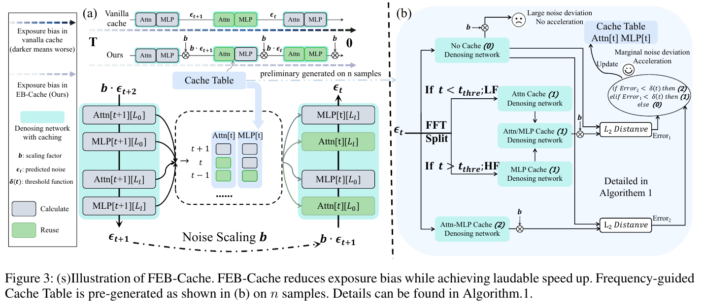
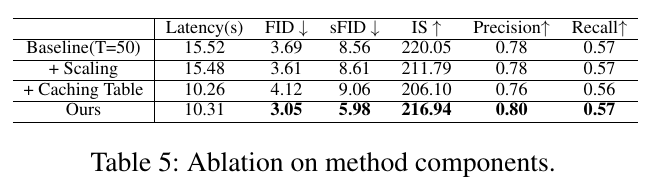

# FEB-Cache: Frequency-Guided Exposure Bias Reduction for Enhancing Diffusion Transformer Caching 精读分析

> [!info] 文档关系
> - 文档类型：Paper
> - 领域入口：[README](../README.md)
> - 上位汇总：[Diffusion 多模态生成与 AI Infra](../surveys/multimodal-diffusion-infra.md)
> - 证据资产：`../assets/papers/feb-cache/`
> - 相关文档：[Figure inventory](../evidence/figure-inventory.md)

> 资料状态：已核验 arXiv v3 PDF、TeX source、官方 GitHub 仓库、基础 DiT checkpoint 端点和公开评审入口。两张内嵌证据图均为 200 DPI PDF 页面紧裁剪，保留单一编号对象及完整 caption；原始 TeX 矢量资产用于反向核对。未复现实验。

## 修订信息

- 当前文档版本：`1.0.0`
- 当前修订 ID：`rev-feb-cache-1.0.0`
- 当前修订时间：`2026-07-25T21:30:00+08:00`
- 替代版本：无（initial）

| 修订 ID | 文档版本 | 时间 | 修订者 | 类型 | 替代修订 | 迁移问题/解析 | 变更摘要 | 原因 | 影响位置 | 依据 | 对结论影响 |
|---|---|---|---|---|---|---|---|---|---|---|---|
| `rev-feb-cache-1.0.0` | `1.0.0` | 2026-07-25T21:30:00+08:00 | `paper-deep-review agent` | initial | 无 | 无 | 首次建立 FEB-Cache 完整精读、视觉证据、源码/代码/checkpoint 核验 | 补齐 canonical Paper 交付标准 | 本文、[Figure inventory](../evidence/figure-inventory.md) | arXiv v3、官方代码 commit、结构与语义验证 | material |

## 0. 资料与配图索引

- 官方记录：[arXiv:2503.07120v3](https://arxiv.org/abs/2503.07120v3)。
- TeX/source：[official arXiv source](https://arxiv.org/src/2503.07120v3)。
- 开源代码：[official repository at reviewed commit](https://github.com/aSleepyTree/EB-Cache/tree/eeca502075b555a4c18859207843b7f4573abfaa)。
- OpenReview：未发现匹配的公开 forum；核验记录见 公开评审核验记录。
- 机制图：Figure 3，`../assets/papers/feb-cache/fig3-feb-cache-framework-caption.png`。
- 结果/消融：Table 5，`../assets/papers/feb-cache/table5-component-ablation-caption.png`。
- Figure inventory 与逐图 QA：[Figure inventory](../evidence/figure-inventory.md)。
- 视觉证据边界：保留原论文 Figure 3 与 Table 5；未用生成图替代论文机制或消融证据。

## 0.1 术语与符号解释

### 0.1.1 术语表

| 术语 | 本文含义 | 别名 | 不等于/易混项 | 证据来源 |
|---|---|---|---|---|
| FEB-Cache | Frequency-guided Exposure Bias Reduction Cache；用分阶段 noise scaling 与 Attn/MLP 分离缓存表共同调节缓存误差 | EB-Cache（代码仓库名） | 不是 KV cache，也不是训练得到的新 DiT | Abstract；Method；Figure 3 |
| exposure bias | 训练时真实前向噪声状态与采样时模型自身历史预测状态之间的不一致及其累积误差 | exposure-bias term | 不是“图像 SNR 越高必然越好”；本文把缓存造成的误差方差增长视为其放大因素 | Motivation Eq. (1)；Appendix |
| feature caching | 在相邻 denoising step 重用 Transformer 中间输出以省去模块计算 | cache/reuse | 不是减少 NFE；也不是 attention KV cache | Introduction；code `src/models.py` |
| separated cache table | 对每个 timestep 选择 no-cache、单模块 cache 或 Attn+MLP cache 的离线表 | frequency-guided cache table | 论文的候选四态描述不等同于公开代码实际可辨识的分支 | Method Algorithm 1；code `cache_table.npy`, `src/models.py:181-203` |
| high-noise / early stage | 采样从 $T$ 向 $0$ 推进时、$t>t_{\mathrm{thre}}$ 的早期区间 | HF branch in Figure 3 | “HF”在图中指 high-noise phase，不应误读为 high-frequency signal | Method §Overall Framework；Figure 3 |
| low-noise / late stage | $t\leq t_{\mathrm{thre}}$ 的后期区间 | LF branch in Figure 3 | “LF”在图中指 low-noise phase，不应误读为 low-frequency signal | Method；Figure 3 |
| Attn Cache | 在当前 step 重用上一次 Attention 残差输出 | SA Cache | 不等于缓存 attention score、$Q/K/V$ 或 serving KV | Method；code `src/models.py:197-203` |
| MLP Cache | 在当前 step 重用上一次 MLP 残差输出 | FFN Cache | 公开代码中未找到明确的 MLP-only 执行分支 | Method；Appendix Table “separate caching” |
| noise scaling | 对网络预测噪声乘以小于 1 的因子以减弱“预测过多噪声” | Epsilon Scaling | 论文给出分段 $b(t)$；代码运行入口主要暴露单一 `delta`，并在实现中用除法 | Method Eq. (3)；code `gaussian_diffusion.py:333` |
| cache-table generation | 在 $n$ 个样本上比较候选预测的范数差并为各 step 投票/加权 | offline search | 不是在线 per-sample adaptive scheduler；公开仓库未给出完整生成脚本 | Algorithm 1；README |
| NFE | number of function evaluations，即采样网络调用步数 | sampling steps | 不能与“实际执行的 Attn/MLP 数量”互换 | Experiments Tables 1–4 |

### 0.1.2 符号表

| 符号 | 含义 | 性质 | 作用域/索引 | 单位/取值 | 来源 | 易混点 |
|---|---|---|---|---|---|---|
| $x_0$ | 干净数据/图像对应状态 | author-defined | 单样本 | latent/image state | Appendix DDPM prerequisites | 采样时不可直接访问 |
| $x_t$ | timestep $t$ 的带噪状态 | author-defined | per step | latent tensor | Appendix | 不是预测的 $\hat{x}_0^t$ |
| $\hat{x}_0^{t-1}$ | 在 step $t-1$ 对 $x_0$ 的估计 | author-defined | per step | latent tensor | Motivation Eq. (1) | 上标表示预测时刻，不是幂 |
| $\epsilon_\theta(x_t,t)$ | denoiser 预测噪声 | author-defined | per sample/step | latent tensor | Algorithm 1 | 与随机变量 $\epsilon_{t-k}$ 不同 |
| $e_t$ | 论文称为预测 $\hat{x}_0$ 与真实 $x_0$ 之间误差的“variance”尺度 | author-defined, ambiguous | per step | 未明确 | Motivation Eq. (1) | 源文措辞把尺度、误差和方差混用 |
| $\epsilon_{t-k}$ | 相邻缓存步的标准化误差随机变量 | author-defined | per cached step | unit variance under assumption | Eq. (2) | 不等于 denoiser 输出 |
| $\rho$ | 相邻误差相关系数 | author-defined | 缓存区间 | $0\leq\rho\leq1$ | Eq. (2)；Appendix example | 实验未估计其真实值 |
| $N$ | 连续缓存步数 | author-defined | cache interval | positive integer | Eq. (2) | 与 NFE 不同 |
| $b(t)$ | 分阶段噪声缩放函数 | author-defined | per timestep | dimensionless | Method Eq. (3) | 代码 `delta` 以除法作用，映射未说明 |
| $b_h,b_l$ | 高噪声/低噪声阶段的 base scaling | author-defined | stage-level | 示例 $0.98,0.96$ | Method Eq. (3) | 下标是 high-/low-noise，不是频率 |
| $T$ | 总 denoising steps | author-defined | whole sampling run | steps | Method | 论文公式同时把 $t$ 写成归一化区间和离散步，表述不严谨 |
| $t_{\mathrm{thre}}$ | 两阶段阈值 | author-defined | run-level | $0.4T$ | Method Eq. (3) | code 使用 `num_steps*0.4` 分支 |
| $E_{\mathrm{ori}}(t)$ | 无缓存网络预测噪声的 $L_2$ norm | author-defined | per candidate/step | norm scalar | Algorithm 1 | 名称叫 error，但本身是预测范数 |
| $E_{\mathrm{Attn-MLP}}(t)$ | 同时缓存 Attn/MLP 后、经 scaling 的预测范数 | author-defined | per candidate/step | norm scalar | Algorithm 1 | 不是相对误差，差值在后续计算 |
| $E_{\mathrm{Candidate}}(t)$ | 阶段候选单模块 cache 的预测范数 | author-defined | per candidate/step | norm scalar | Algorithm 1 | early/late 对应不同模块 |
| $\delta(t)$ | cache-state 接受阈值 | author-defined | per step | norm difference | Algorithm 1；Table 7–8 | 与代码 CLI `delta`（noise scaling）不是同一量 |
| $n$ | 生成 cache table 的样本数 | author-defined | offline calibration | samples；8/32/1228 tested | Table 9 | 不等于 batch size |
| $\mathrm{FLOPs}$ | 论文报告的采样总计算量 | paper-reported | per sample/run | tera-operations（表写 T） | Tables 1–4 | 未给 profiler 或计算脚本 |
| $\mathrm{BW}_{\mathrm{eff}}$ | 本文推导的有效带宽 | analysis-derived | per memory path | bytes/s | §8.4 | 论文无 bytes moved telemetry |
| $U_{\mathrm{BW}}$ | 有效带宽相对峰值利用率 | analysis-derived | per device/path | ratio | §8.4 | 无法从 H100 型号名直接反推 |

## 1. 论文基本信息

- 标题：*FEB-Cache: Frequency-Guided Exposure Bias Reduction for Enhancing Diffusion Transformer Caching*。
- 作者：Zhen Zou、Feng Zhao；arXiv v3 元数据仅列两位作者。
- 版本：arXiv:2503.07120v3，2025-10-06；PDF 使用 AAAI 2026 模板，但官方 record 未声明录用 venue，因此本分析分类为 2025 arXiv preprint。
- 研究领域：Diffusion Transformer 推理加速、feature reuse、exposure-bias mitigation。
- 核心问题：在不训练新模型的前提下，如何避免 feature caching 的误差累积破坏生成质量，同时保留较低的每步计算量。
- 关键约束：依赖相邻 step feature redundancy；cache table 是模型/采样步数/设置相关的离线标定；实验只报告 NVIDIA H100。

## 2. 研究动机与问题—方案闭环

### 2.1 出发点与背景痛点

作者明确指出，DiT 的迭代 denoising 既串行又昂贵；feature caching 能跳过部分 Attention/MLP 计算，却常以质量下降为代价。论文的独特出发点不是继续让 cached trajectory 数值逼近 no-cache trajectory，而是问“缓存为何伤害扩散采样”。Figure 1/2 与 Appendix 被用来建立一个解释：缓存使相邻 step 的预测误差相关并累积，放大 exposure bias；这种偏差随 denoising 阶段在低/高频上的作用并不均匀。

这条动机中，“缓存相关误差的方差超过独立误差线性和”有公式支持；“这就是全部质量下降的主因”只有相关曲线、可视化和联合干预支持，没有直接因果识别。

### 2.2 现有方案为何不够

固定间隔缓存忽略了两个非平稳性：一是早期低频结构与后期高频细节的脆弱程度不同；二是 Transformer 的 Attention 与 MLP 被假设分别更偏低频与高频。统一缓存因此会在错误阶段重用错误模块。单一 Epsilon Scaling 又可能在某些 step 过校正、另一些 step 欠校正。

根约束是作者所说的“frequency mismatch”。不过其测量是把 VAE 解码后的中间图像做 FFT 和 $L_2$ norm，再以模块缓存造成的输出变化推断频率分工；这不是对每层频响的严格线性系统辨识，也未排除缓存位置、残差门控或 sampler 的混杂。

### 2.3 目标问题与成功标准

- 核心研究问题：能否用 stage-aware、module-separated caching 把缓存放大的 exposure bias 调节到更接近 no-cache 的轨迹。
- 成功标准：在近似 FLOPs/latency 预算下优于 FORA、DiTFastAttn、L2C、ToCa、$\Delta$-DiT/PAB；联合方案应同时改善质量与 latency。
- 必须满足：training-free；适用于 DiT image/video backbones；不靠减少 NFE 伪装为 per-step 加速。
- 明确不解决：极高加速比下的无损质量、在线 per-sample cache table、自定义 kernel/serving scheduler、跨硬件实测。

### 2.4 核心方案如何改变变量

FEB-Cache 先以分段 $b(t)$ 缩小预测噪声，再在少量 calibration samples 上，对每个 timestep 比较 no-cache、双模块 cache 和阶段候选单模块 cache 的预测范数差，用 $\delta(t)$ 选择可接受的最省计算状态。早期优先考虑 MLP cache，避免重用当前脆弱的低频 Attention 路径；后期优先考虑 Attn cache，保留 MLP 对高频细节的更新。最终缓存表固定用于推理。

| 原始问题/失败模式 | 根因或约束 | 对应方案 | 改变的变量/行为 | 因果机制 | 预期优化 | 证据 | 判断 |
|---|---|---|---|---|---|---|---|
| 相邻 step 重用导致误差累积 | 相邻误差相关 $\rho>0$ | 限制 cache span/state | 执行或重用模块的 step 集 | 减少相关误差被重复注入 | 降低 FID/feature error | Eq. (2), Figure 5 | partial |
| 固定 scaling 过/欠校正 | bias 随 timestep 非均匀 | 分段 $b(t)$ | 预测噪声幅值 | 后期用更强 scaling 抑制累积偏差 | 更接近 no-cache SNR | Table 5–6, Figure 5 | partial |
| 统一 cache 忽略频率阶段差异 | Attn/MLP 被假设偏低/高频 | separated cache candidates | 每 step 的模块重算集合 | 只缓存当前相对稳定的频率处理模块 | 同 latency 下提高质量 | Figure 2–3, Appendix separate-cache table | partial |
| 每个 step 全算太慢 | 相邻 features 高相似 | 离线 cache table | full-compute ratio | 重用残差输出省去 Attention/MLP | latency/FLOPs 下降 | Tables 1–5 | supported |
| 在线搜索会抵消收益 | candidate evaluation 需多次 forward | $n$ 样本离线投票 | 标定成本移出 serving path | 推理查表 $O(1)$ | 保留 end-to-end speedup | Algorithm 1, Table 9 | plausible |

### 2.5 完整因果链与边界

作者的闭环是：DiT 串行推理昂贵 $\rightarrow$ feature caching 提速但降质 $\rightarrow$ 缓存让相邻预测误差相关累积并放大 exposure bias $\rightarrow$ 该偏差跨频率/阶段不均匀，而 Attn/MLP 又有互补频率偏好 $\rightarrow$ 分阶段 noise scaling 加分离缓存表改变预测噪声幅值和模块重算集合 $\rightarrow$ 在近似 latency 下减少 FID/sFID degradation。

直接成立的是 latency/FLOPs 与联合消融结果；间接成立的是 SNR/FFT/feature-error 机制；未闭合的是“exposure bias 是质量损失主因”“频率分工足以决定最佳 cache state”以及代码是否忠实实现全文四态与动态 $b(t)$。因此总体判断是 `partially-supported`，不是机制已被完全证明。

## 3. 核心贡献

1. 把 DiT feature caching 的质量损失重新解释为 exposure-bias amplification，并给出相关误差方差公式与 SNR/feature-error 观察（Motivation、Appendix）。
2. 提出分阶段 noise scaling，使 correction strength 随 denoising 进程变化（Method Eq. (3)）。
3. 提出基于频率偏好、分离 Attn/MLP 的离线 cache-table 搜索（Figure 3、Algorithm 1）。
4. 在 DiT-XL/2、PixArt-$\Sigma$、CogVideoX，以及 Appendix 的 FLUX/Cosmos/DeepCache 上报告 training-free 质量—延迟权衡。

## 4. 研究方法

### 4.1 方法总览

输入是冻结 denoiser、总步数 $T$、$b(t)$ 与 $\delta(t)$。离线阶段对 $n$ 个样本在每个 step 运行候选 cache states、按与 no-cache prediction norm 的差异做阈值判断并加权得到 table。在线阶段用表决定每个 block 的 Attention/MLP 是重算还是重用，同时对 denoiser noise prediction 做 scaling。输出仍由原 sampler 更新 $x_{t-1}$，无需再训练。

### 4.2 组件级设计动机与具体问题映射

| 设计项 | why 状态 | 原文证据 | 具体问题 | 因果机制 | 替代/权衡 | 验证 | 判断 |
|---|---|---|---|---|---|---|---|
| exposure-bias variance model | author-stated | Eq. (1)–(2), Appendix | 缓存降质缺少解释 | 正相关误差产生协方差项 | 可直接建模 trajectory error；当前假设 $\rho$ 未估计 | 公式+示例，无真实 $\rho$ | plausible |
| stage-specific $b(t)$ | author-stated | Method Eq. (3) | 固定 scaling 非平稳 | 后期更强缩放 | 在线自适应 scaling 更灵活但更贵 | Table 5–6 | partially supported |
| Attn/MLP separated states | author-stated | Figure 2–3 | 统一缓存频率错配 | 当前脆弱频带对应模块保持重算 | layer-wise/token-wise cache 可能更细 | Appendix separate-cache table | partially supported |
| $t_{\mathrm{thre}}=0.4T$ | author-stated，理由不足 | Method | 需分 early/late stage | 固定边界简化策略 | 学习/搜索 boundary | 无独立 ablation | unverified |
| greedy norm-threshold search | author-stated | Algorithm 1 | 直接穷举组合昂贵 | 在三候选中取满足误差阈值的高复用 state | 用 perceptual/latent error 或 DP | Table 7–9 是敏感性，不是最优性证明 | partially supported |
| small-$n$ calibration | author-stated | Table 9 | 标定成本 | 跨样本投票估计稳定表 | per-sample online policy 更自适应 | $n=8/32/1228$ FID 接近 | supported in one setting |
| no retraining | author-stated | Conclusion/code | 训练成本与模型侵入性 | 只改 sampler/runtime | 上限低于蒸馏/训练式方法 | 多 backbone 结果 | supported |
| H100 PyTorch runtime | not-stated as design | Experiment/code | 将 FLOPs 转为 latency | Python/PyTorch 重用模块输出 | custom kernel 可进一步提速 | 只给 end-to-end latency | unverified systems rationale |

### 4.3 模型/系统架构

> 原论文 Figure 3。左侧展示分阶段 scaling 与模块级复用，右侧展示离线 cache-table 候选比较。注意图中的 `(1)` 同时标在单模块与双模块候选上，而代码表值只出现 0/2；这是正文—图—代码需要谨慎对齐之处。

### 4.4 关键公式

在单位方差、相邻误差按距离 $d$ 具有相关 $\rho^d$ 的假设下：

$$
\mathrm{Var}\left(\sum_{k=1}^{N}\epsilon_{t-k}\right)
=N+2\sum_{d=1}^{N-1}(N-d)\rho^d>N.
$$

它只证明“相关误差和的方差大于独立误差和”，不自动证明 cache 是 exposure bias 的唯一来源，也不估计真实 $\rho$。Appendix 取 $\rho=0.8,N=5$ 得 $18.1072$，相对独立方差 $5$ 是 $3.62\times$；这是代入示例，不是实测值。

论文给出的分阶段 scaling 为：

$$
b(t)=
\begin{cases}
b_h+(1-b_h)\exp\left(\frac{-5(1-t)}{1-t_{\mathrm{thre}}}\right), & t_{\mathrm{thre}}\le t\le T,\\
b_l+(b_h-b_l)\exp\left(\frac{5(t-t_{\mathrm{thre}})}{1-t_{\mathrm{thre}}}\right), & 0\le t<t_{\mathrm{thre}}.
\end{cases}
$$

这里正文把 $t$ 同时描述为 $T\rightarrow0$ 的离散 step、又在指数里使用 $1-t$，归一化约定不充分。公开代码则使用：

$$
\epsilon_{\mathrm{used}}=\frac{\epsilon_\theta}{\mathrm{delta}},
$$

见官方 commit 的 `src/diffusion/gaussian_diffusion.py:333`；若要实现论文的乘法 $b(t)<1$，应有 $\mathrm{delta}=1/b(t)>1$，但 README/脚本没有给出此映射，`sh/dit.sh` 反而传 `0.965`。故代码对 scaling 的一致性判为 `unverified/possibly inconsistent`。

### 4.5 实验设计

- DiT-XL/2：ImageNet $256^2$（50/250 NFE）、$512^2$（100 NFE），DDPM；另有 20-step DDIM。
- 复杂任务：PixArt-$\Sigma$ $1024^2/2048^2$ T2I、CogVideoX-2B $720\times480$ T2V；Appendix 加 FLUX、Cosmos、DeepCache。
- Baselines：减少 NFE、FORA、L2C、DiTFastAttn、ToCa、$\Delta$-DiT、PAB。
- 指标：FID、sFID、IS、Precision/Recall、CLIP、VBench、PSNR/SSIM/LPIPS、FLOPs 与 latency。
- 论文称实验均在 NVIDIA H100，但未报告具体 H100 型号、batch、warm-up、软件栈、重复次数、方差或能耗；部分样本数/评估协议在 TeX 中被注释掉，影响可复核性。

## 5. 主要技术主张与证据矩阵

### 5.1 主结果

- ImageNet $256^2$, 50-step DDPM：FEB-Cache 10.40 s、FID 3.05；no-cache 15.52 s、FID 3.69。按表值，latency 降 $5.12$ s（$33.0\%$），约 $1.49\times$；FID 降 $0.64$（$17.3\%$，越低越好）。与相近 latency 的 FORA 10.01 s/FID 8.45 相比，质量优势大。
- 250-step、约 $2.48\times$ 档：FEB-Cache FID 2.40，对应 FORA 3.46、DiTFastAttn 3.06、ToCa 2.52；但 no-cache 250-step FID 2.27，说明高加速档仍有小幅 quality cost。
- PixArt-$\Sigma$ $1024^2$：Ours 0.97 s、FID 81.14，相近 latency baselines 为 82.06–83.07；$2048^2$ 时 FID 140.03 并非最佳（DiTFastAttn 138.67），但 CLIP/IS 最高。
- CogVideoX：Ours 98.01 s、VBench 78.79；原始 50-step 142.10 s/VBench 80.91。它优于相近预算 baselines 的 VBench，但未保持原始质量。

这些结果支持“更好的 Pareto 点”，不支持所有场景全面最优，也不支持无损。

### 5.2 消融与技术点证据矩阵

> 原论文 Table 5。联合方案优于两个单独组件，但表中没有“uniform cache + 同一 scaling”与“separated cache + fixed/unscaled”的全因子交叉，频率分离的独立贡献仍不完全隔离。

| 技术点 | 声称收益 | 对应证据 | 控制 | 指标变化 | 强度 | 结论 |
|---|---|---|---|---|---|---|
| noise scaling | 降低 exposure bias | Table 5 `+Scaling` | 对 baseline 单因素 | FID 3.69→3.61；IS 220.05→211.79 | direct but mixed metrics | weak/partial |
| cache table | 提速 | Table 5 `+Caching Table` | 单因素 | 15.52→10.26 s；FID 3.69→4.12 | direct | speed supported, quality worsens |
| scaling+cache synergy | 同时提速提质 | Table 5 Ours | matched component bundle | 10.31 s/FID 3.05 | direct bundle ablation | supported as joint package |
| separated Attn/MLP caching | 频率匹配优于 uniform | Appendix separate-cache table | matched latency near 2.3 s | FID 18.19→16.67；IS 127.75→149.01 | replacement baseline | partial; still worse than 10-step baseline FID 12.17 |
| $b_l/b_h$ | robustness | Table 6 | sensitivity | FID 3.05–3.42 across tested pairs | sensitivity | supported locally |
| threshold function | positive-linear best | Tables 7–8 | sensitivity | FID 3.05 vs 3.13/3.34 | sensitivity | supported in one setup |
| small $n$ sufficient | low calibration cost | Table 9 | sensitivity | FID 3.05/3.05/3.06 for 8/32/1228 | direct sensitivity | supported in one setup |
| cache amplifies exposure bias | mechanism | Eq. (2), Figures 1/5, feature visualization | no causal intervention isolating EB | SNR/feature-error trends | indirect/correlation | plausible, not proven |
| cross-backbone generality | broad applicability | Tables 2–4, Appendix | settings differ | competitive metrics | confounded | partially supported |

### 5.3 是否验证假设与收益归因

联合方案的效果很清楚：Table 5 显示 scaling 单独几乎不提速、table 单独提速但伤质量，两者组合才同时取得 10.31 s 与 FID 3.05。相对 `+Caching Table`，加 scaling 后 FID 改善 $1.07$（$26.0\%$），latency 只增加 $0.05$ s；这是最强的组件归因。

然而把该协同进一步分解成“频率分离”与“exposure bias 拟合”仍缺少完整 factorial ablation。Appendix 的 separated vs uniform caching 支持分离策略，但测试是 10-step DDIM、质量整体较差；不能无条件外推到所有主表。

| 组件/变化 | 基线 | 变化 | 影响路径 | 证据 |
|---|---|---|---|---|
| cache table | 50-step baseline | $-5.26$ s；FID $+0.43$ | runtime↓, quality↓ | matched direct |
| scaling | 50-step baseline | $-0.04$ s；FID $-0.08$；IS $-8.26$ | quality mixed | matched direct |
| joint package | baseline | $-5.21$ s；FID $-0.64$ | runtime↓, quality↑ | matched direct |
| scaling added to table | table only | $+0.05$ s；FID $-1.07$ | correction of cache error | matched direct |
| separation vs uniform | uniform cache | $-0.04$ s；FID $-1.52$ | stage/module selection | Appendix matched replacement |

## 6. Related Work 对比

| 类别 | 方法核心 | 优点 | 局限 | 与 FEB-Cache |
|---|---|---|---|---|
| DeepCache | U-Net 跨 step 重用深层 feature | training-free | 面向 encoder-decoder/skip 结构 | FEB-Cache 把 EBR 推广到 DeepCache，但 DiT 主方法不同 |
| FORA | 固定间隔复用 DiT block output | 简单 | 高速档质量崩塌 | FEB-Cache 用 table 和 scaling 修正固定策略 |
| $\Delta$-DiT | 缓存 feature residual 并跳层 | 适配 isotropic DiT | 仍依赖 trajectory similarity | FEB-Cache 优先解释/调节误差而非换缓存对象 |
| L2C | 学习 cache policy | 可适应 step | 有训练/策略成本；高加速退化 | FEB-Cache 离线少样本查表 |
| DiTFastAttn/ToCa/PAB | attention/token/broadcast 的结构性稀疏或复用 | 可与模块优化组合 | 机制不同、预算匹配复杂 | 论文展示 ToCa+Ours，但缺全面组合实验 |
| Epsilon Scaling | 缩小预测噪声 | 无缓存也可用 | 固定 factor 难适配阶段 | FEB-Cache 用 cache amplification 抵消过校正 |

比较大体覆盖 2024–2025 的主要 cache baselines，但不同方法的官方实现、调参强度、batch/runtime 条件没有完全公开，公平性只能判为部分可核验。

## 7. OpenReview 公开评审 × 论文核验

未发现与 FEB-Cache 精确标题或 arXiv ID 匹配的公开 OpenReview 页面。OpenReview API 直接查询在本环境返回 HTTP 403；搜索命中的 ICLR 2026 PDF只是引用 FEB-Cache 的另一篇论文。故 public review、decision、rebuttal、discussion 均 `skipped-with-reason`，不使用任何 reviewer opinion，也不能排除私有或改题提交。详见 公开评审核验记录。

## 8. Infra 需求分析

### 8.1 算力与延迟

设第 $t$ 步全算 FLOPs 为 $F_t^{\mathrm{full}}$，缓存状态保留的模块计算为 $F_t^{\mathrm{state}}$，则：

$$
F_{\mathrm{run}}=\sum_{t=1}^{T}F_t^{\mathrm{state}},
\qquad
S_F=\frac{\sum_t F_t^{\mathrm{full}}}{F_{\mathrm{run}}}.
$$

论文表 1 的 50-step DiT-XL/2 从 5.98 T 降到 3.49 T，对应理论计算比 $1.71\times$，而 latency 15.52/10.40 为 $1.49\times$。约 $13\%$ 的 speedup gap（按 $1-1.49/1.71$）说明剩余算子、框架 launch、VAE/采样更新与 cache 管理未随 FLOPs 等比下降。这是分析推导，不是 profiler 结果。

### 8.2 显存与存储

每层需要保留最近一次 Attn 与 MLP 残差输出。若 batch 为 $B$、token 数 $L$、hidden width $D$、层数 $H$、每元素 $s$ bytes，则最粗 cache 上界为：

$$
M_{\mathrm{cache}}\approx 2BLDHs.
$$

DiT-XL/2 code 为 $D=1152,H=28$。$256^2$ 图像的 latent size 32、patch size 2，故 $L=256$；若 fp32、$B=1$，两类残差约 $2\cdot1\cdot256\cdot1152\cdot28\cdot4\approx63$ MiB；fp16/bf16 约 31.5 MiB。CFG 实现会复制 batch，实际活动内存可再增。论文未报告 peak memory。

离线 cache table 本身仅 $O(T)$；公开 50-entry int64 文件为 528 bytes，微不足道。标定阶段需运行多个候选 forward，但不在 serving critical path。

### 8.3 Data Types / 数值格式

| 对象 | 格式 | 阶段 | 硬件依赖 | 影响 | 证据 |
|---|---|---|---|---|---|
| DiT matmul | TF32 enabled by default | inference | NVIDIA Ampere+，H100 | 速度↑，数值有小差异 | `sample_ddp.py:64-65,208-209` |
| model weights/activations | 未显式 half/bf16；`.to(device)` 保持 checkpoint dtype | inference | GPU | 实际 dtype 未锁定 | `sample_ddp.py:86-99` |
| cache table | NumPy int64 | runtime lookup | CPU load/GPU indexing path未说明 | 体积小 | `cache_table.npy` |
| FID feature calculation | TensorFlow float16 cast | evaluation | TF/GPU | 降低 feature comparison memory | `featureeval.py:402-403` |
| FP8/int8/int4 | 未使用/未报告 | — | — | 不应推断量化收益 | paper/code |

### 8.4 带宽、互联与利用率

缓存减少 Attention/MLP 的权重读取和算术，但新增 residual cache 的 HBM 读写。每个复用模块每 step 的最低读流量近似：

$$
\mathrm{BytesMoved}_{\mathrm{reuse}}\ge BLDs,
\quad
\mathrm{BW}_{\mathrm{eff}}=\frac{\mathrm{BytesMoved}}{\mathrm{RuntimeSeconds}},
\quad
U_{\mathrm{BW}}=\frac{\mathrm{BW}_{\mathrm{eff}}}{\mathrm{BW}_{\mathrm{peak}}}.
$$

论文没有 kernel timeline、bytes moved 或 H100 SKU，无法给出可信利用率。Attention/MLP 被完全跳过时节省大量 weight/activation traffic；但 Python dict、per-layer branch、未融合 residual add 可能引入 launch 与不连续访问开销。单 GPU 结果不涉及 NVLink、RDMA、all-reduce/all-to-all；多 GPU 只在 DDP 上分样本，未展示模型通信。

### 8.5 CPU/GPU/NPU 异构与 serving

CPU 负责 NumPy table load、随机 label、PNG/NPZ 与进程控制；GPU 负责 DiT/VAE。代码没有 pinned memory、async copy、CUDA Graph、custom operator 或 NPU 路径。Table 应常驻 host 或转为轻量索引，但实现未明确 device placement。DDP 仅做 embarrassingly parallel 样本生成和 barrier，不是在线 scheduler。因而该方法是 algorithm-level compute skipping，不是完整 serving system。

## 9. 开源代码对照

- 仓库：[official repository at reviewed commit](https://github.com/aSleepyTree/EB-Cache/tree/eeca502075b555a4c18859207843b7f4573abfaa)。
- commit：`eeca502075b555a4c18859207843b7f4573abfaa`。
- 语法检查通过，但未安装依赖/下载 2.7 GB checkpoint/运行 H100 复现。

| 论文机制 | 本地路径 | 一致性 |
|---|---|---|
| DiT-XL/2 28层、1152 width、16 heads | `src/models.py:240-254,512+` | 一致 |
| 每层保存 Attn/MLP residual | `src/models.py:181-208` | 一致 |
| no-cache / both-cache / Attn-cache | `src/models.py:191-203` | 部分一致 |
| MLP-only cache | 未找到清晰分支 | 未开源/不一致 |
| early/late $0.4T$ 分段 | `src/models.py:386-391` | 分支存在，但受 `innerN` 逻辑影响 |
| 动态 $b(t)$ | 未找到 | 不一致/缺失 |
| 单一 scalar scaling | `src/diffusion/gaussian_diffusion.py:333` | 仅部分对应，且采用除以 `delta` |
| cache table runtime | `sample_ddp.py:84,155-157`; `gaussian_diffusion.py:490-507` | 一致 |
| cache-table generation Algorithm 1 | 无脚本 | 缺失 |
| checkpoint/VAE 下载 | `src/download.py:15-43`; `sample_ddp.py:98-99` | base DiT URL 可达；本地绝对 VAE 路径阻塞 |

最严重的复现问题是：README 单卡命令没有把 `cache_table_path` 传入 `p_sample_loop`，而 cache 分支期望 array；DDP 才传 table。仓库无 requirements/lockfile、无完整 license、无 benchmark 配置、无 PixArt/CogVideoX/FLUX/Cosmos 代码。公开 table 只含 0 和 2，不能证明论文叙述的所有 cache states。

### 9.1 Checkpoint/config

官方代码仅使用 Meta DiT base checkpoints，不发布 FEB-Cache 专属权重。两个 endpoint 均 HTTP 200，大小约 2.70 GB；未下载 tensor。模型结构由本地 code 明确为 DiT-XL/2，方法不改变容量。VAE revision 未声明，故 exact checkpoint/config 仍未验证。

## 10. 优点、局限与改进

### 优点

- 把“缓存提速但降质”连接到可分析的 diffusion error accumulation，而非只做相似度 heuristic。
- 联合消融显示 cache 与 scaling 具有强互补性；质量—延迟 Pareto 点在多 backbone 上较稳定。
- training-free，table 标定可用很少样本，理论上易集成。

### 局限

- exposure-bias 机制主要是相关性和建模假设；没有测量真实 $\rho$、误差分布或做结构方程式的因果干预。
- 频率分析依赖 VAE decode/FFT/norm；频带切分细节、统计区间和显著性不足。
- 主表无置信区间、重复次数和完整 profiling；H100 型号、batch/warmup 也未报告。
- 部分基线调参和官方实现来源不透明；“perfectly balance”表述强于证据。
- 公开代码与论文在 dynamic scaling、MLP-only state、table generation、VAE path 和实验覆盖上有实质缺口。
- cache table 是否跨 prompt、resolution、sampler、model revision 稳定尚未系统测试；它不是在线自适应。

### 可改进

1. 做完整 $2\times2$ factorial：uniform/separated cache $\times$ fixed/stage scaling，并固定 FLOPs。
2. 报告真实 step-wise error covariance、$\rho(t)$、频带能量置信区间及其与 FID/LPIPS 的预测关系。
3. 发布 Algorithm 1 table generator、每个主表 table、环境锁、VAE revision 与 benchmark scripts。
4. 将四态编码显式化并加入 unit tests，验证论文图、cache table、runtime branch 一一对应。
5. 报 HBM traffic、kernel time、cache memory、MFU/带宽利用率及不同 batch/resolution 的 speedup。
6. 比较 offline global table 与 online per-sample scheduler，测分布漂移和跨 checkpoint 迁移。

## 11. 研究启发

- 可把 cache policy 看作“受误差预算约束的模块调度”：目标不是 feature similarity 最大，而是对最终 sampler dynamics 的扰动最小。
- 频率只是可能的结构先验之一；可进一步用 token spatial scale、Jacobian sensitivity、uncertainty 或 learned error predictor决定 cache state。
- scaling 与 caching 的协同说明，算法级 approximation 可配合 trajectory correction；同一思想可扩展到 quantization、token pruning、early exit。
- 最小复现实验应先限于 DiT-XL/2 50-step：补齐 VAE 与 table generator，重跑四态/两阶段逻辑，再复核 Table 5，最后才扩到视频。

## 12. 解读问题/待验证清单

1. 论文的 $e_t$ 究竟是误差标准差、方差还是幅值，推导中的单位是否一致？
2. 真实 $\rho$ 在无缓存/Attn cache/MLP cache 下分别是多少，是否足以解释 FID？
3. Eq. (3) 的 $t$ 是否归一化；代码中的 `delta` 与 $b(t)$ 如何精确映射？
4. Figure 3 的 cache-state 编码与 `cache_table.npy` 的 0/2 两值如何对应？
5. 公开代码为何没有明显的 MLP-only branch 和 table-generation script？
6. 分离缓存的收益在 50/250-step 主设置上是否仍成立，还是只在 10-step Appendix 条件成立？
7. $t_{\mathrm{thre}}=0.4T$ 是否跨 sampler/model/resolution 稳定？
8. $n=8$ 的稳定性是否对 prompt/domain shift 仍成立？
9. latency 是单样本还是 batch；是否包含 VAE、I/O、warm-up？
10. 在精确 FLOPs 匹配下，FEB-Cache 是否仍优于强 baseline 的官方实现？
11. cache memory traffic 会不会在更大 batch/更高 resolution 下抵消计算收益？
12. 机制是 exposure-bias correction，还是更一般的 sampler noise regularization？

## 13. 一句话总结

FEB-Cache 最有价值的地方，是用“分阶段误差校正 + 模块级缓存调度”把 feature reuse 从固定 heuristic 推进到受 diffusion trajectory 约束的策略；其联合消融和多模型 Pareto 结果有说服力，但 exposure-bias 因果解释与公开代码对全文机制的忠实复现仍是最大不确定性。
