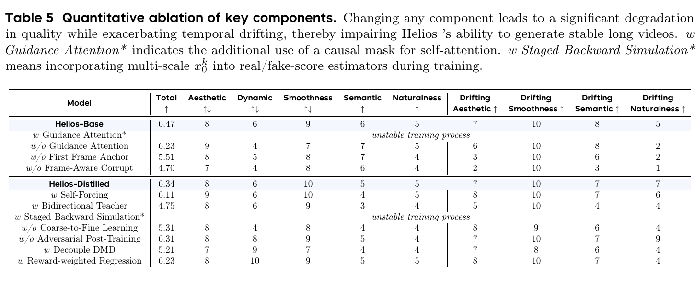

# Helios: Real Real-Time Long Video Generation Model 精读

> [!info] 文档关系
> - 文档类型：Paper
> - 领域入口：[README](../README.md)
> - 上位汇总：[近半年多模态视觉生成模型全景](../surveys/visual-generation-model-landscape.md)
> - 证据资产：`../assets/papers/helios/`
> - 证据索引：[Figure inventory](../evidence/figure-inventory.md)

> 资料状态：已核验 39 页 arXiv PDF/source 与官方 Helios commit `47219a07860f158ce56a3b1d1ee2e012aab5c39b`。未独立下载并重数 checkpoint tensors。

## 修订信息

- 版本：`1.0.1`
- 当前修订 ID：`rev-helios-affiliation-backfill-20260730`
- 当前修订时间：`2026-07-30T23:30:00+08:00`
- 类型：metadata-update

| 修订 ID | 文档版本 | 时间 | 修订者 | 类型 | 替代修订 | 变更摘要 | 原因 | 影响位置 | 依据 | 对结论影响 |
|---|---|---|---|---|---|---|---|---|---|---|
| `rev-helios-affiliation-backfill-20260730` | `1.0.1` | `2026-07-30T23:30:00+08:00` | `/root` | `metadata-update` | `rev-helios-1.0.0` / `1.0.0` | 补充作者—机构元数据与角色证据边界 | 统一回填 affiliation 交付字段 | `作者与机构` | 论文 PDF 标题页、机构编号与角色脚注 | none：不改变方法、实验与归因结论 |

## 1. 核心口径

### 作者与机构

- 第一作者（首位列名）：Shenghai Yuan → Peking University；ByteDance China。
- 共同第一作者（仅含论文明确标注者）：论文未显式标注。
- 通讯作者/通讯联系人（仅含论文明确标注者）：
  - Li Yuan → Peking University
- 其他作者涉及的机构（去重列举，不作逐作者映射）：Peking University；ByteDance China；Canva；Chengdu Anu Intelligence。
- 对应依据：论文 PDF 标题页、作者机构编号与角色脚注（核验日期：2026-07-30）。
- 边界说明：◦ 是 ByteDance 实习工作说明，§ 是 project leader；均不扩展为共同一作或通讯作者。

Helios 是 Wan-2.1-derived **14B parameter-dense DiT**，没有 MoE/router 证据。它的“autoregressive”不是逐视觉 token，而是按视频 latent chunk 延续：历史 chunk 是 clean context，当前 chunk 在 diffusion trajectory 内去噪。

| 字段 | 核验结论 |
|---|---|
| 参数 | 14B total，按 dense backbone 记 14B active；未独立重数 checkpoint |
| 范式 | chunk autoregressive video diffusion |
| 数据 | 约 0.8M `<10s` clips；领域、许可、过滤和完整混合未披露 |
| dtype | 公开训练/推理 config 含 bf16 路径；不同阶段细节见代码 |
| 速度 | 19.53 FPS：384×640、single H100、端到端含 VAE/text encoder |

## 2. 架构

> 原论文 Figure 4 与完整 caption。左侧是 chunk-AR diffusion pipeline，右侧是 Guidance Self/Cross Attention。

### 2.1 Multi-Term Memory Patchification

长视频若保留全部历史 token，attention 和 HBM 成本会线性甚至更快增长。MTMP 对 short/mid/long history 使用不同 temporal patch scale，让越久远的状态越粗。代价是远期细节不可逆丢失，必须靠首帧锚点和当前局部 history 保真。

### 2.2 Pyramid Unified Predictor-Corrector

PUPC 用粗到细空间流逐级预测当前 chunk，减少在全分辨率上重复计算。它与 MTMP 在系统结果中捆绑，论文没有给出每项独立 FPS 份额。

### 2.3 Guidance Attention

history 和 current noisy latent 的角色不同。Guidance Self Attention 对 historical keys 做 head-wise amplification；Guidance Cross Attention 让 text 只更新 noisy target。论文最终方案**不使用 causal mask**；Table 5 的 `w Guidance Attention*` 才额外加入 causal mask，并出现训练不稳定。

### 2.4 AHD 与少步生成

Asymmetric Hierarchical Distillation 使用真实历史 teacher forcing 和分层 DMD 压缩采样。论文文字称 3 steps，但公开 inference config 出现 `[2,2,2]`，到底是每阶段、总步数还是 predictor/corrector 次数存在歧义，正式使用时应固定 checkpoint/config 后实测。

## 3. 证据

> 原论文 Table 5 与完整 caption。Guidance Attention、First Frame Anchor、Frame-Aware Corrupt，以及 distillation 侧的 Self-Forcing、Bidirectional Teacher、Coarse-to-Fine、Adversarial Post-Training、Decouple DMD 和 Reward-weighted Regression 都在同一评价表中检查。

| 声称 | 证据 | 判断 |
|---|---|---|
| 防止长视频漂移 | Table 5 对 Guidance/anchor/corrupt 的直接消融 | 因果证据较强 |
| 19.53 FPS | Table 3 / Section 5.1 | 端到端口径清楚；组件归因缺失 |
| 不依赖 sparse/linear attention、KV cache、quantization | 论文与代码 | 对最终方法成立 |
| “无需 parallelism/sharding” | 正文概括 vs config | 只能收窄解释：main DiT 可避开 TP/CP，但 EMA/DMD 使用 ZeRO |

## 4. Runtime 边界

19.53 FPS 不是 playback FPS，也不是 denoiser-only：论文明确包含 VAE 和 text encoder，运行在单 H100、384×640。与此同时，它也不是“完全无优化”的朴素 PyTorch：

- 使用 FlashAttention；
- 使用 compile；
- Norm/RoPE 有 Triton/fused kernel；
- 没有使用 sparse/linear attention、KV cache、quantization。

因此可以比较相同论文协议下的端到端 throughput，但不能把 19.53 FPS 分解成 MTMP、PUPC、distillation 和 kernel 各自贡献。

## 5. 训练与系统

- Stage 3 config 使用 ZeRO-3 管理 sharded FP32 EMA，并做 CPU↔GPU model offload。
- DMD config 使用 ZeRO-2；所以“training without sharding”不能按字面覆盖所有状态和阶段。
- 14B bf16 参数权重下界约 28GB；训练还需 master weights、optimizer、EMA、activation 和 history latent。
- 公开材料未给完整端到端 latency breakdown、GPU-hours 或数据治理细节。

## 6. 局限

1. 没有公开 OpenReview 评审。
2. 训练数据只给顶层 clip 数；领域、过滤、去重与许可未披露。
3. checkpoint tensors 未独立重数，14B 采用论文/代码一致口径。
4. “3 steps”与 `[2,2,2]` config 有歧义。
5. 速度可核验为端到端，但无法做组件级因果分解。

## 来源

- [arXiv:2603.04379](https://arxiv.org/abs/2603.04379)
- [PKU-YuanGroup/Helios](https://github.com/PKU-YuanGroup/Helios)
