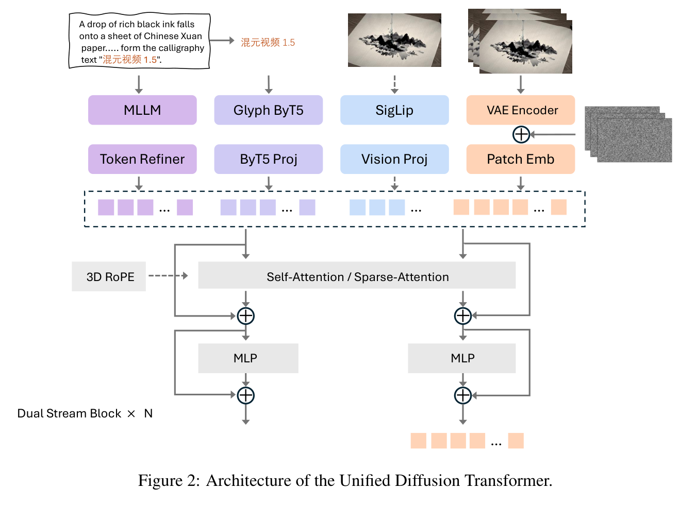

# HunyuanVideo 1.5 Technical Report 精读分析

> [!info] 文档关系
> - 文档类型：Paper
> - 领域入口：[README](../README.md)
> - 上位汇总：[Diffusion 多模态生成与 AI Infra](../surveys/multimodal-diffusion-infra.md)
> - 证据资产：`../assets/papers/hunyuanvideo-1-5/`
> - 相关文档：[Figure inventory](../evidence/figure-inventory.md)

> 资料状态：官方 arXiv v2 PDF 与 LaTeX 源码、官方 GitHub 代码、Hugging Face checkpoint 元数据与三份 pinned config 均已核验。原论文配图为 240 DPI PDF 裁剪；每张只含一个编号对象及完整 caption。OpenReview 仅发现 PDF 镜像，未发现公开评审线程。

## 修订信息

- 当前文档版本：`1.0.0`
- 当前修订 ID：`rev-hunyuanvideo-1-5-1.0.0`
- 当前修订时间：`2026-07-25T21:22:49+08:00`
- 替代版本：`none`

| 修订 ID | 文档版本 | 时间 | 修订者 | 类型 | 替代修订 | 迁移问题/解析 | 变更摘要 | 原因 | 影响位置 | 依据 | 对结论影响 |
|---|---|---|---|---|---|---|---|---|---|---|---|
| `rev-hunyuanvideo-1-5-1.0.0` | `1.0.0` | `2026-07-25T21:22:49+08:00` | `paper-deep-review agent` | `initial` | `none` | `none` | 首次冻结完整单篇深评，覆盖论文、源码、代码、checkpoint、视觉、机制、实验与 infra | 补齐 canonical Paper 交付标准 | 本文、[Figure inventory](../evidence/figure-inventory.md) | arXiv v2、代码 commit、HF revision、两张 QA 图 | `material` |

## 0. 资料与配图索引

- 论文：[arXiv:2511.18870v2](https://arxiv.org/abs/2511.18870v2)。
- LaTeX：[official arXiv source](https://arxiv.org/src/2511.18870v2)。
- 开源代码：[official repository at reviewed commit](https://github.com/Tencent-Hunyuan/HunyuanVideo-1.5/tree/60783e704160023913bee78f0b47036d393d4dfa)。
- Checkpoint：[tencent/HunyuanVideo-1.5](https://huggingface.co/tencent/HunyuanVideo-1.5/tree/9b49404b3f5df2a8f0b31df27a0c7ab872e7b038) revision `9b49404b3f5df2a8f0b31df27a0c7ab872e7b038`；只核验元数据/config，未下载权重张量。
- OpenReview：公开评审核验记录；无公开 review/decision/rebuttal。
- 图表：
  - Figure 2：`../assets/papers/hunyuanvideo-1-5/fig2-unified-dit-architecture-caption.png`。
  - Table 7：`../assets/papers/hunyuanvideo-1-5/table7-ssta-inference-ablation-caption.png`。
- 视觉证据边界：保留原论文 Figure 2 与 Table 7；未用生成图替代论文机制或系统结果证据。

## 0.1 术语与符号解释

### 0.1.1 术语表

| 术语 | 本文含义 | 别名 | 不等于/易混项 | 证据来源 |
|---|---|---|---|---|
| HunyuanVideo 1.5 | 8.3B 参数、统一支持 T2V/I2V 的 latent video DiT 及其 VSR 管线 | HY1.5 | 不是初代 13B HunyuanVideo | Abstract；Table 1；HF config |
| Unified DiT | 在同一 54 层 dual-stream Transformer 中融合文字、glyph、视觉和 noisy latent 条件 | Unified Diffusion Transformer | “统一”指任务/条件接口，不证明所有训练阶段完全共享 checkpoint | §3.1；Figure 2 |
| SSTA | Selective and Sliding Tile Attention：动态重要性选块与局部滑窗块稀疏注意力 | sparse attention | 不是 serving cache，也不是 SageAttention；后二者属于 runtime 优化 | §3.1 Algorithm 1；代码 `ssta_attention.py` |
| Selective mask | 依据 pooled Q–K 相似度与 K–K 冗余得分选择 top-$k$ 块 | importance mask | 不是 token pruning；被跳过的是注意力块对 | Algorithm 1 |
| STA mask | Sliding Tile Attention 的局部三维窗口先验 | local window mask | 不等于 SSTA 全部；论文将其与 selective mask 合并 | Algorithm 1 |
| Glyph-ByT5 | 为多语种字形渲染提供细粒度 glyph 特征的第二文本通道 | Glyph ByT5 | 不等于主语义 MLLM；官方发布还需额外下载 Glyph-SDXL-v2 | §3.1；`checkpoints-download.md` |
| CFG-distilled model | 速度实验采用的 classifier-free-guidance 蒸馏 checkpoint | distilled model | 不等于基础 50-step dense checkpoint，也不等于后续 step-distilled 4/8/12-step 模型 | §6；README |
| VSR | 独立 cascaded video super-resolution DiT，在 latent 空间由 LR 条件恢复 HR 视频 | video SR | 不等于 VAE decoder 内部上采样 | §3.2；Figure 3 |
| Rating | 五维绝对评分：遵循性/一致性、审美、画质、结构稳定、运动 | dimension rating | 不是公开标准 benchmark，量表标定与方差未报告 | §5.1 |
| GSB | Good/Same/Bad 人工成对比较；论文又把 Same 分成 equally good/bad | pairwise preference | “HY Win Rate”是 better 减 other better，不是胜局占非平局比例 | §5.2；Tables 4–5 |
| progressive training | T2I→混合 T2I/T2V/I2V、低到高分辨率/帧率，再 CT/SFT/RLHF | staged curriculum | 表 2 并未给出 SFT/RLHF 数据量与所有训练步数 | §4；Table 2 |
| group offloading | 以模块组为单位在 CPU/GPU 间迁移权重并可与计算 overlap | pipeline offload | 不是模型压缩；节省显存以传输/延迟为代价 | `generate.py`；pipeline code |

### 0.1.2 符号表

| 符号 | 含义 | 性质 | 作用域/索引 | 单位/取值 | 来源 | 易混点 |
|---|---|---|---|---|---|---|
| $Q,K,V$ | attention query/key/value | author-defined | head、时空 token | feature tensor | Algorithm 1 | 这里同时含视觉与可选文本块 |
| $h$ | attention head 数 | author-defined | model | 16 | Table 1；HF config | 不是 hidden size |
| $F,H,W$ | latent canvas 的时间、高、宽 | author-defined | one sample | latent grid | Algorithm 1 | 原视频分辨率需先除 VAE 压缩率 |
| $D$ | 单 head feature 维度 | author-defined | per head | 128 | Table 1 | $hD=2048$ |
| $N$ | 一个 SSTA tile 的 token 数 | author-defined | per block | $tile_t tile_h tile_w$ | Algorithm 1 | 默认 sparse config 为 $6\times8\times8=384$ |
| $B$ | 三维 canvas 的块数 | author-defined | per sample | blocks | Algorithm 1 | 不是 batch size |
| $WS$ | STA 三维窗口大小 | author-defined | per block | $(w_t,w_h,w_w)$ | Algorithm 1 | config 还给出 `win_ratio=10` |
| $k$ | selective mask 保留的 top block 数 | author-defined | per query block/head | config 64 | Algorithm 1；HF sparse config | 不是 diffusion steps |
| $\bar Q_b,\bar K_b$ | 块内池化后的 Q/K 摘要 | author-defined | per block | vector | Algorithm 1 | pooling 细节可由 config 改写 |
| $\mathrm{Score}_s$ | Q–K 块相似度 | author-defined | $h\times B\times B$ | score | Algorithm 1 | 与 redundancy score 不同 |
| $\mathrm{Score}_r$ | K–K 块内冗余项 | author-defined | $h\times1\times B$ | score | Algorithm 1 | 论文公式的索引写法较压缩 |
| $\lambda,\beta$ | 相似度与冗余权重 | author-defined | SSTA scoring | $\lambda=0.7$；$\beta$ 未在 config 同名给出 | Algorithm 1；HF sparse config | 代码的 `lambda_` 参与 importance mask；论文/代码命名不完全对齐 |
| $M_{\mathrm{sel}}$ | selective block mask | author-defined | block pair | Boolean | Algorithm 1 | 不是最终 mask |
| $M_{\mathrm{sta}}$ | sliding-window block mask | author-defined | block pair | Boolean | Algorithm 1 | 只表达局部先验 |
| $M_{\mathrm{combined}}$ | 两种 mask 合并后的最终 block mask | author-defined | block pair | Boolean | Algorithm 1 | 论文写逻辑 AND；代码在 `create_ssta_3d_mask` 实现 |
| $P$ | 参数量 | analysis-derived | model | 8.3B | paper reported | 未在本次下载权重张量计数 |
| $b_w$ | 每个权重元素字节数 | analysis-derived | dtype | bf16 2、fp32 4、fp8 1 | dtype definition；代码 | 不包含 optimizer/activation |
| $T_{\mathrm{dense}},T_{\mathrm{sparse}}$ | matched dense/sparse 每步时间 | analysis-derived | one config | seconds/step | Table 7 | 仅限 8×H800、CFG-distilled 设置 |
| $S$ | 速度倍数 $T_{\mathrm{dense}}/T_{\mathrm{sparse}}$ | analysis-derived | one config | ratio | 本文 §5.2 | 不代表端到端单卡速度 |
| $L_{\mathrm{red}}$ | 延迟降低比例 | analysis-derived | one config | fraction | 本文 §5.2 | 与 speedup 百分比口径不同 |
| $\mathrm{BW}_{eff}$ | 有效带宽 | analysis-derived | memory/interconnect path | bytes/s | 本文 §8.4 | 无 bytes telemetry，不能数值化 |
| $U_{\mathrm{BW}}$ | 相对峰值带宽利用率 | analysis-derived | device/path | ratio | 本文 §8.4 | 峰值带宽不能代替实测利用率 |

## 1. 论文基本信息

- 标题：*HunyuanVideo 1.5 Technical Report*。
- 作者/机构：Tencent Hunyuan Foundation Model Team。
- 版本：arXiv `2511.18870v2`，2025。
- 领域：latent video diffusion Transformer、统一 T2V/I2V、稀疏注意力与视频超分。
- 核心问题：开源视频生成模型难以同时达到强视觉/运动质量、长视频推理效率与消费级显存可达性。
- 核心约束：长时高分辨率 latent token 序列；8.3B 权重驻留；文字/图像/视频多条件融合；训练数据与人评协议大多非公开。

## 2. 研究动机与问题—方案闭环

### 2.1 出发点与背景痛点

作者明确把市场状态描述为两端失衡：闭源 Kling/Veo/Sora 能力强但不可获得；开源 Wan2.2 的高端方案需管理总计 27B、激活 14B 的双专家，5B 紧凑版又在运动稳定与专业审美上不足（Introduction）。因此起点不是单一“把模型做小”，而是在开放发布约束下同时保住质量、运动、分辨率与可部署性。

这也是一项系统型工作：参数规模、VAE token 压缩、attention 稀疏性、数据清洗、caption、训练课程、偏好对齐和 VSR 都会共同决定最终结果。论文把它们打包成一个产品级方案，但实验对其中各分量的隔离强弱很不均衡。

### 2.2 现有方案为何不够

作者明确指出三类失败：大模型/MoE 权重与计算成本高；小模型运动稳定与审美不足；标准 self-attention 随序列长度二次增长。本文进一步重建第四个约束：直接生成 1080p 会显著放大 latent token 和 attention 成本，因此主模型先生成 480p/720p，再用 VSR 解耦高分辨率细化。

根因层面，论文证据最扎实的是长序列 attention：同硬件、同帧数、同分辨率的 dense/SSTA 对照直接给出每步时间。相反，“数据清洗、Glyph-ByT5、Muon、progressive curriculum 各自让最终质量达到 SOTA”缺少逐项 matched ablation，只能视为合理但混杂的系统归因。

### 2.3 目标问题与成功标准

- 目标：以 8.3B 开源模型统一生成 5–10 秒、480p/720p T2V/I2V，并经 VSR 到 1080p。
- 质量成功标准：Rating 五维评分及 GSB 相对偏好达到开放模型领先，并接近/部分超过闭源系统。
- 效率成功标准：长序列 SSTA 相对 FlashAttention-3 dense 路径降低每步时间；在 offload+VAE tiling 下单卡峰值显存为 13.6 GB。
- 可复现成功标准：公开训练/推理代码、主模型/VAE/SR/蒸馏/sparse checkpoints。
- 明确未解决：训练数据清单与许可审计、完整训练算力/能耗、公开 benchmark prompt/人评原始记录、各模块大规模独立消融、生产 SLA。

### 2.4 核心方案如何解决并优化问题

| 原始问题/失败模式 | 根因或约束 | 对应方案设计 | 改变的变量/系统行为 | 作用机制 | 预期优化及指标 | 证据来源 | 判断 |
|---|---|---|---|---|---|---|---|
| 大模型难部署 | 权重和激活驻留高 | 8.3B DiT + 3D causal VAE | 参数量与 latent 网格缩小 | 16×空间、4×时间压缩降低 token 数 | 显存、每步延迟 | Table 1；§6；HF VAE config | partial |
| T2V/I2V 分离维护 | 条件接口不同 | unified dual-stream DiT | 共享骨干并用 type embedding 区分条件 | 文本、glyph、SigLIP、VAE latent 汇入共同 attention | 多任务质量/维护成本 | Figure 2；代码 config | plausible；无独立消融 |
| 长视频 attention 昂贵 | dense attention 为 $O(L^2)$ | SSTA | block-pair 稀疏率提高 | 动态重要性选择结合局部滑窗 | time/step | Algorithm 1；Table 7；代码 | supported for latency |
| 直接 1080p 成本高 | HR latent 序列长 | cascaded VSR | 主模型与细化阶段解耦 | LR latent channel concat + latent upsample + HR denoise | 1080p 细节 | Figure 3/6；I2V Rating 的 480pSR | partial；无 matched VSR off |
| 提示语义与字形冲突 | MLLM 偏语义，字节级文字细节不足 | Qwen2.5-VL + Glyph-ByT5 | 双文本通道 | 高层语义与细粒度 glyph 特征互补 | instruction/text rendering | §3.1；代码；定性图 | plausible；无独立表 |
| 高分辨率训练不稳 | token 长度与 flow shift 改变 | progressive curriculum + shift schedule | 分辨率、帧率、时长、任务混合逐级变化 | 先学图像语义再扩展时空难度 | 收敛与运动稳定 | §4；Table 2 | indirect/confounded |
| 偏好与运动伪影 | reward model 对细粒度运动区分有限 | CT/SFT + T2V DPO→online RL、I2V online RL | 训练分布与偏好目标改变 | 人工 GSB 对与 VLM reward 引导 | 人评质量/运动 | §4.2；Figure 5 | indirect；阶段图非数值消融 |
| 单卡显存不足 | 8.3B bf16 权重本身约 16.6 GB | pipeline/group offload + VAE tiling | 权重迁移与 decode 分块 | 用 CPU 内存/PCIe 时间换 GPU 峰值显存 | peak memory 13.6 GB | §6；`generate.py` | supported as reported setup |

### 2.5 完整因果链与证据闭环

论文的完整链条是：开放生态缺少“高质量且高效率”的模型；大 MoE 权重重、小模型质量弱、长序列 dense attention 贵；于是用高压缩 VAE 与 8.3B unified DiT 控制基础规模，用多条件编码和大规模数据/渐进训练保质量，用 SSTA 削减长序列 attention，用 VSR 将 1080p 细化移到第二阶段，再用 offload/tiling 下探单卡显存。Rating/GSB 显示其相对开放模型有竞争力，Table 7 直接验证 SSTA 延迟，13.6 GB 测量验证一种单卡部署路径。

直接闭环的是“SSTA 改变 block attention 密度→长上下文每步延迟下降”和“offload/tiling→峰值显存下降”。间接闭环的是“统一条件/数据/训练/VSR→最终质量”：最终模型比较与阶段可视化支持系统整体有效，却不能唯一归因到 Glyph、Muon、caption RL 或每个训练阶段。最大边界是评测集、量表、原始评分与训练数据不可审计，且 closed-source baseline 使用默认配置，预算并非严格匹配。

## 3. 核心贡献与创新点

1. 8.3B unified DiT 同时服务 T2V/I2V，并结合 16×空间、4×时间 causal 3D VAE（§3.1、Table 1）。
2. SSTA 把动态重要性选块与局部滑窗先验合并，并由 flex-block-attn kernel 执行（Algorithm 1、代码）。
3. 双文本通道与 SigLIP/VAE 双图像条件改善语义、字形与 I2V 细节输入（Figure 2、§3.1）。
4. 从数据清洗/caption 到 progressive pretrain、CT/SFT/RLHF 的端到端训练管线（§2、§4）。
5. 独立 latent VSR 与公开代码/checkpoints，补齐 1080p 输出和工程可用性（§3.2、官方仓库/HF）。

## 4. 研究方法

### 4.1 方法总览

> 原论文 Figure 2，PDF 第 4 页。T2V 输入由 MLLM 与 Glyph-ByT5 编码；I2V 还加入 SigLIP 语义和 VAE reference latent。所有条件与 noisy latent 进入 54 层 dual-stream DiT；self-attention 可替换为 SSTA。

训练从 T2I 256p/512p 起步，再按 1:6:3 混合 T2I/T2V/I2V，逐步提升到 720p、24 fps、2–10 秒；随后 T2V/I2V 分别进行 CT、SFT 与偏好对齐。生成先在 480p/720p 完成，再可走 VSR 到 1080p。

### 4.2 组件级设计动机与具体问题映射

| 设计项 | why 状态 | 原文证据 | 针对问题 | 因果机制 | 替代/权衡 | 验证证据 | 判断 |
|---|---|---|---|---|---|---|---|
| 8.3B/54-layer dual-stream DiT | author-stated | Intro；Table 1 | 大 MoE 资源重 | 控制容量并统一条件交互 | 更小模型便宜但质量风险；更大模型相反 | final Rating/GSB，非容量曲线 | plausible |
| causal 3D VAE 16×/4×/32ch | author-stated | §3.1 | 视频 token 太长 | 强时空压缩减少 DiT token | 高压缩可能丢细节，靠 VSR 补偿 | config+系统时间，缺重建消融 | partial |
| MLLM + Glyph-ByT5 | author-stated | §3.1 | 语义理解与多语文字渲染难兼得 | 两类编码特征互补 | 增加模型依赖与条件 token | code/config；无定量拆分 | unverified benefit |
| I2V VAE latent + SigLIP | author-stated | §3.1 | 参考图细节与语义均需保留 | latent 保细节，SigLIP 保语义/指令 | 条件冗余、算力增加 | Figure 2；无单通道 ablation | plausible |
| condition type embedding | author-stated | §3.1 | 多条件来源易混淆 | 显式标识 text/glyph/vision 类型 | 增加少量参数 | code config | code-supported |
| SSTA selective mask | author-stated | Algorithm 1 | 全局相关块不能仅靠局部窗覆盖 | Q–K 相似度减 K–K 冗余后 top-$k$ | 选块计算与近似误差 | Table 7 将完整 SSTA 与 dense 比；未拆 selective | partial |
| STA local mask | author-stated | Algorithm 1 | 视频有局部时空先验 | 保留邻近块连接 | 可能漏掉远距依赖 | 与 selective 捆绑 | unverified alone |
| flex-block-attn kernel | author-stated | §3.1；代码 | 稀疏 mask 不自动等于 wall-clock 加速 | 定制 kernel 跳过块计算 | ThunderKittens/硬件依赖 | Table 7 端到端每步时间 | supported as bundle |
| Muon optimizer | author-stated | §3.1 | 收敛慢/不稳 | momentum + Newton–Schulz 正交化 | 实现复杂、与 AdamW 公平预算需说明 | 仅文字称半步数更低 loss | unverified quantitative |
| progressive T2I→video curriculum | author-stated | §4.1；Table 2 | 直接高时空分辨率训练难 | 从静态语义到视频、从低到高难度 | 多变量共同变化导致不可归因 | 训练成功；无 matched curriculum | indirect |
| CT/SFT/RLHF | author-stated | §4.2；Figure 5 | 运动伪影/人偏好 | 高质数据和 preference optimization 重塑输出分布 | reward hacking、数据成本 | 定性阶段图；无数值表 | correlation-only |
| cascaded latent VSR | author-stated | §3.2/§4.3 | 主模型直接 1080p 成本高 | LR latent condition 约束 HR flow denoise | 两阶段延迟与误差传播 | Figure 6、Rating 480pSR | partial |
| offload + VAE tiling | inferred/code-stated | §6；code | 单卡放不下管线 | CPU 驻留/分组迁移与分块 decode | PCIe/CPU 内存/延迟开销 | 13.6 GB peak | supported for memory only |

### 4.3 SSTA 机制与代码对照

论文先将 latent canvas 划为 $B$ 个、每块 $N$ 个 token，计算：

$$
\mathrm{Score}_s=\bar Q_b\bar K_b^\top
$$

$$
\mathrm{Score}_r=
\frac{1}{N-1}
\sum_{\substack{i=1\\j\ne i}}^N
[\bar K_b\bar K_b^\top]_{ij}
$$

$$
\mathrm{Score}_i=\lambda\mathrm{Score}_s-\beta\mathrm{Score}_r
$$

然后将 top-$k$ selective mask 与局部 STA mask 合并，并调用 block-sparse kernel：

$$
M_{\mathrm{combined}}=M_{\mathrm{sel}}\land M_{\mathrm{sta}},
\qquad
O=\mathrm{flex\_block\_attention}(Q,K,V,M_{\mathrm{combined}})
$$

代码 `hyvideo/models/transformers/modules/ssta_attention.py` 确认三维 tile/padding、文本块拼接、importance sampling、每样本 mask 与 `flex_block_attn_func`；sparse config 固定 `tile_size=[6,8,8]`、`ssta_topk=64`、`ssta_lambda=0.7`、`attn_sparse_type=ssta`。需要注意：论文伪代码把两 mask 简写为 AND，代码的实际 mask 构造、文本 padding 与 head-sharing 语义更复杂，不能只凭伪代码复刻。

### 4.4 训练与 VSR

Table 2 报告 5B/1B 图像阶段；视频预训练阶段使用 800M、200M、100M、100M 规模，分辨率从 256p 到 720p、帧率从 16 到 24 fps。CT 对 T2V/I2V 各用 1M 高质视频。SFT 样本量、训练 steps、batch、学习率与完整 shift schedule 未报告。

I2V online RL 用四维 VLM reward 和 MixGRPO；T2V 因 reward model 难分辨细粒度运动，先对约 $O(10K)$ prompt 的人工 GSB pair 做 DPO，再在线 RL。VSR 从预训练 T2V 初始化，用 1M 个 1K–4K、3–10 秒视频和高分辨率图像，以 LR latent 与 noise channel-concat 的 flow matching 训练。

## 5. 关键结论与证据归因

### 5.1 主结果

Rating 中，HY1.5 T2V 的结构稳定性 79.75，高于 Wan2.2 73.75、Kling2.1 66.74、Seedance 68.69、Veo3 75.62；但 instruction following 61.57 明显低于 Veo3 73.77，审美 63.30 也不是最佳。I2V 720p 的视觉质量 60.33 居表中最高，但运动 58.62 低于 Seedance 60.47/Veo3 60.91。

GSB 里，T2V 对 Wan2.2/Kling/Seedance 的 “HY Win Rate” 为 17.12/12.6/11.02 个百分点，对 Veo3 为 -10.32；I2V 对 Wan/Kling 为 12.65/9.72，对 Seedance/Veo3 为 -5.77/-3.61。因评测 prompt、默认配置、评分量表与置信区间不公开，“开放模型 SOTA”在作者协议内有支持，但无法当作跨平台绝对排序。

### 5.2 SSTA 直接消融

> 原论文 Table 7，PDF 第 11 页。8×H800、CFG-distilled、无额外工程加速；dense 使用 FlashAttention-3。

速度与延迟降低定义为：

$$
S=\frac{T_{\mathrm{dense}}}{T_{\mathrm{sparse}}},
\qquad
L_{\mathrm{red}}=1-\frac{T_{\mathrm{sparse}}}{T_{\mathrm{dense}}}
$$

- 720p/121 帧：$2.0084\to1.5638$ s/step，$S=1.284$，延迟下降 22.1%。
- 720p/241 帧：$5.5070\to2.9475$ s/step，$S=1.868$，延迟下降 46.5%。

这是本文最强的组件级证据：分辨率、帧数、硬件与后端说明明确，且长序列收益更大，符合二次 attention 的机制预期。但它仍把 selective mask、STA mask、sparse-trained distilled checkpoint 与 custom kernel 捆绑，不能分别归因。

### 5.3 技术主张证据矩阵

| 技术点 | 声称收益 | 实验/对照 | 是否受控 | 证据强度 | 结论 |
|---|---|---|---|---|---|
| 8.3B compact DiT | 质量/效率平衡 | final model vs heterogeneous baselines | confounded | system result | 系统层支持，容量因果未隔离 |
| high-compression VAE | 减 token/显存/延迟 | config + speed | no VAE-rate replacement | code + indirect | plausible |
| SSTA | 长序列加速 | Table 7 dense vs sparse | matched at config level | direct bundle ablation | supported |
| SSTA 无损质量 | 保持质量 | 报告文字；无对应稀疏质量表 | unknown | none | unverified |
| Glyph-ByT5 | 双语字形 | 定性能力声明 | no removal | code-only/qualitative | unverified benefit |
| Muon | 半步数更低 loss | 无曲线/表 | unknown | claim only | unverified |
| progressive training | 稳定收敛/质量 | Table 2 + final outcome | confounded | indirect | plausible |
| CT/SFT/RLHF | 运动/偏好提升 | Figure 5 定性阶段样例 | weak control | mechanism visualization | correlation-only |
| VSR | 1080p 细节 | Figure 6；480pSR Rating | partial | qualitative + system | partially supported |
| offload/tiling | 单卡 13.6 GB | single configuration | setup-specific | direct measurement | supported within setup |
| fp8 GEMM/cache | 后续工程加速 | repository README after paper | not paper-controlled | code/release evidence | 不归入论文核心收益 |

### 5.4 收益来源归因

| 组件/变化 | 对比基线 | 指标变化 | 影响路径 | 证据强度 |
|---|---|---|---|---|
| SSTA bundle | FlashAttention-3 dense | 121帧 1.284×；241帧 1.868× | attention compute/latency | matched direct |
| SSTA + engineering bundle | accelerated dense | Table 8: 121帧 28.33→26.41s；241帧 96.78→58.39s | runtime latency | matched but Sage/cache/compile context |
| VSR path | direct 720p HY1.5 | I2V 各维有升有降：480pSR 结构稳定 70.13 vs 66.67，但图像一致性 68.82 vs 72.07 | detail/stability vs conditioning fidelity | imperfect system comparison |
| full training/data stack | Wan/Kling/Seedance/Veo | Rating/GSB mixed wins | quality, motion, alignment | confounded |

最小缺失实验包括：dense/sparse 同 checkpoint 的质量与 latency 双报告；selective-only/STA-only；移除 Glyph；AdamW/Muon matched tokens；固定数据预算的 curriculum；VSR off/on 在相同输出分辨率；CT/SFT/DPO/RL 的数值化阶段表。

## 6. Related Work 对比

| 类别/工作 | 核心机制 | 优点 | 局限 | 与本文关系 |
|---|---|---|---|---|
| Wan2.2 | 27B total、14B activated MoE；另有 5B | 高容量分阶段专家 | 权重重；小版质量受限 | HY1.5 用单 8.3B unified DiT 取平衡 |
| 初代 HunyuanVideo | 大规模开源 video DiT | 奠定数据/架构管线 | 更重、部署门槛高 | 1.5 强调 compact/VSR/SSTA |
| StepVideo | 开源 T2V 系统 | 规模化视频生成 | 任务/条件覆盖不同 | 作为开放域竞品 |
| STA | 静态滑动三维 tile | 局部先验、规则稀疏 | 远距关系覆盖弱 | SSTA 加动态选择 |
| FlashAttention-3 | 精确 dense attention kernel | 高效且无稀疏近似 | 仍随序列二次增长 | Table 7 dense backend |
| SageAttention/cache | 低精度 attention/跨步 feature reuse | 工程加速 | 可能与质量/步依赖耦合 | Table 8 的 runtime bundle，不是 SSTA 机制本身 |

比较公平性有限：closed-source 模型只用默认配置；生成成本、prompt rewrite、采样步数、版本日期和输出后处理并未完全统一。

## 7. OpenReview 公开评审 × 论文交叉核验

- PDF 镜像：`https://openreview.net/pdf/ce1eab30ecce66e8dfe014657c70f2916db22b95.pdf`。
- 访问日期：2026-07-25。
- 公开 forum/review/meta-review/decision/rebuttal：未发现。

| 来源 | 观点/问题 | 对应论文 | 证据 | 状态 | 判断 |
|---|---|---|---|---|---|
| Public OpenReview | 无可访问 reviewer claim | 全文 | exact-title 搜索、PDF 镜像、API 403 | unavailable | 跳过 reviewer 交叉核验，不用镜像存在推断 peer-review 状态 |

因此本文的局限判断来自论文、源码、代码与 config，而不是匿名评审意见。

## 8. Infra 需求分析

### 8.1 算力与 token 规模

对 720p、$F_v$ 帧视频，按 VAE 16×空间、4×时间且 DiT patch 为 $1\times1\times1$，近似视觉 token 数：

$$
L_v=
\left\lceil\frac{F_v}{4}\right\rceil
\cdot
\frac{720}{16}
\cdot
\frac{1280}{16}
$$

121 帧约 111,600 tokens，241 帧约 219,600 tokens。dense attention 的 pair 数近似四倍增长，Table 7 中 dense 时间从 2.0084 增至 5.5070 s/step，而 SSTA 从 1.5638 增至 2.9475，方向一致。

论文没有训练 FLOPs、GPU 数/时长、MFU 或能耗。训练代码支持 FSDP、sequence/context parallel 和 gradient checkpointing，但这不等于论文训练集群配置。

### 8.2 显存与存储

仅权重理论下界：

$$
M_{\mathrm{weights}}=P\,b_w
$$

8.3B 参数在 bf16 约 16.6 GB、fp32 约 33.2 GB、fp8 权重约 8.3 GB（十进制，不含 scale/metadata）。训练还需梯度、optimizer state 与 activation；Muon 的额外状态和 FSDP shard 策略决定实际峰值。论文单卡 13.6 GB 小于 bf16 权重下界，必须依赖 CPU offload/group offload，而不是“8.3B 本身可常驻 13.6 GB”。

### 8.3 Data Types / 数值格式

| 对象 | 格式 | 阶段 | 硬件依赖 | 影响 | 证据 |
|---|---|---|---|---|---|
| Transformer weights/activation | bf16 默认，fp32 可选 | train/infer | CUDA bf16 | 省显存、Tensor Core | `generate.py`/`train.py` |
| VAE autocast | fp16 | train/infer | CUDA fp16 | 降 VAE 成本 | pipeline/train code |
| FP8 GEMM | optional，per-token/per-tensor variants | post-paper inference | `sgl-kernel==0.3.18` | 权重/GEMM 加速，质量未在论文验证 | `generate.py` |
| SSTA mask | Boolean block mask | inference/training sparse stage | flex-block-attn kernel | 跳过 block pair | `ssta_attention.py` |

### 8.4 带宽、互联与利用率

$$
\mathrm{BW}_{eff}=
\frac{\mathrm{BytesMoved}}{\mathrm{RuntimeSeconds}},
\qquad
U_{\mathrm{BW}}=
\frac{\mathrm{BW}_{eff}}{\mathrm{BW}_{peak}}
$$

8×H800 context parallel 会在设备间分割 token，并需要 attention/hidden-state 通信；代码在 `parallel_states.py` 和 Transformer forward 中按 SP rank 切分。单卡 offload 则把权重组经 CPU–GPU 路径搬移，`overlap_group_offloading=True` 试图掩蔽传输。论文未给 NVLink/PCIe 拓扑、每步 bytes、通信时间或峰值带宽，故不能计算有效带宽/利用率。SSTA 可能从 compute-bound 转向 kernel launch/memory-bound，需 profiler 才能判断。

### 8.5 CPU/GPU/NPU 异构执行

| 阶段 | CPU | GPU | 数据移动/overlap | 瓶颈 | 证据 |
|---|---|---|---|---|---|
| prompt/条件处理 | tokenizer、可 offload encoder | MLLM/ByT5/SigLIP 可上 GPU | host→device condition | encoder/传输 | pipeline code |
| DiT denoise | offload 权重驻留 | 54-layer DiT、attention | group offload 可 overlap | GEMM/attention/PCIe | `generate.py` |
| VAE decode | tiling 调度 | fp16 VAE tiles | tile 逐块 | decode/边界/显存 | pipeline |
| 8×H800 | host launch | context-parallel DiT | GPU互联通信 | 未 profile | paper §6 |

NPU 路径未报告，flex-block-attn/ThunderKittens/Sage/sgl-kernel 均带 CUDA 生态依赖，不能假定跨 NPU 等价。

### 8.6 Serving 与 runtime 边界

代码支持 cache、torch compile、SageAttention、FP8、offload、LoRA、step distillation；其中很多在论文 v2 后发布。论文 Table 7 的 SSTA 机制收益和 Table 8 的工程 bundle 必须分开：cache/compile/Sage 改 runtime，SSTA 改 attention sparsity；后续 step-distilled 模型改 diffusion 步数。仓库没有 production batching、queue、SLA、并发吞吐或故障恢复 telemetry。

## 9. 开源代码与 checkpoint 对照

- 仓库 commit：`60783e704160023913bee78f0b47036d393d4dfa`。
- HF revision：`9b49404b3f5df2a8f0b31df27a0c7ab872e7b038`。

| 论文机制 | 本地路径 | 一致性 |
|---|---|---|
| 54层、2048宽、16 heads、32 channels | `hyvideo/models/transformers/hunyuanvideo_1_5_transformer.py`; pinned HF config | 一致 |
| Glyph-ByT5 mapper | `hyvideo/models/text_encoders/byT5/`; Transformer init | 一致，但外部 glyph 权重另下 |
| SSTA | `hyvideo/models/transformers/modules/ssta_attention.py` | 一致；代码补充 padding/text mask |
| Muon | `hyvideo/optim/muon.py`; `train.py` | 实现存在 |
| flow matching | `train.py`; scheduler | 实现存在 |
| offload/FP8/cache | `generate.py`; pipeline/cache helper | 实现存在，部分属论文后扩展 |

Checkpoint config 直接确认：720p T2V 为 dense `attn_mode=flash`；720p sparse I2V 为 `flex-block-attn` 且 SSTA 参数明确；VAE config 为 `ffactor_spatial=16`、`ffactor_temporal=4`、`latent_channels=32`。容量差异并非 dense/sparse 的来源，两 config 的层数/宽度/heads 相同；算法差异在 attention mode/params。权重 shard 存在于公开列表，但未 tensor-count，因此参数量仍标为 paper-reported。

## 10. 优点、局限与改进

### 优点

- 问题定位清楚：不是只追质量，而是质量、开放性、长序列效率与显存的联合约束。
- SSTA 有真正 matched 的 wall-clock 表，且长序列收益规律合理。
- 代码与 checkpoint 覆盖 architecture、training、inference、sparse、VSR，配置可审计。
- 主结果并未完全掩盖弱项：对 Veo3、Seedance 的部分 GSB/运动指标仍为负。

### 局限

- 技术报告极短，数据来源/许可、训练 steps/算力、SFT/RL 规模与 reward 细节不足。
- 核心质量模块几乎无独立消融；最终系统增益高度混杂。
- “SSTA 保持质量”缺少 dense/sparse matched 质量数据。
- 人评 benchmark、prompt、量表、原始标注、显著性和置信区间不公开。
- Table 7 只测 8×H800；13.6 GB 只报告峰值，不报告同配置延迟。
- 开源依赖包含 gated SigLIP 来源和外部 Glyph 权重，完整下载并非单仓库闭环。
- 训练数据规模巨大，版权、隐私、偏见与深伪风险没有系统分析。

### 可改进之处

公开 prompt/视频/匿名评分；报告 bootstrap CI 与 inter-rater agreement；补完整 ablation grid；把 algorithm-only 与 kernel-only 分开；给单卡 offload 的延迟/PCIe bytes；发布训练集群、FLOPs、能耗与数据治理卡；提供 NPU/非 CUDA fallback。

## 11. 研究启发

- 对长视频 DiT，应把“稀疏模式质量”和“kernel 能否兑现稀疏”共同设计与评测。
- 两阶段 base→VSR 是将语义/运动与高频细节解耦的工程范式，但需防止第二阶段改变身份/动作。
- 多条件统一架构的下一步应是条件通道的可归因实验，而非继续堆组件。
- 复现最小闭环：公开 720p dense/sparse checkpoint、固定 prompt/seed、8×H800 或可比 GPU、50-step timing、SSTA kernel、质量 pairwise eval。

## 12. 解读问题/待验证清单

1. sparse checkpoint 与 dense checkpoint 是否只差 SSTA 训练，还是蒸馏/数据也不同？
2. selective 与 STA 单独各贡献多少质量和 latency？
3. $\beta$ 在实现中如何对应 `ssta_lambda` 和 importance sampling？
4. Glyph-ByT5 对中文/英文文字准确率各提升多少？
5. Muon “半训练步数”是否在同 token、batch、LR sweep 下成立？
6. 13.6 GB 配置的端到端 latency、CPU RAM、PCIe 流量是多少？
7. 480p→VSR 与原生 720p/1080p 在相同输出分辨率的质量/成本如何？
8. Rating/GSB 的 prompt、量表、评审一致性和统计显著性如何？
9. 训练数据的来源许可、去重与隐私过滤能否审计？
10. OpenReview 是否未来出现公开 forum/review；若出现需新增 evidence revision。

## 13. 一句话总结

HunyuanVideo 1.5 的最可信贡献是把高压缩 8.3B video DiT、SSTA kernel 和可 offload 的公开实现组合成较低门槛系统，其中 SSTA 对 720p/241 帧给出 1.868× matched 每步加速；最大不确定性是绝大多数质量组件缺少独立消融，SOTA 与“无损稀疏”结论仍受私有数据和人评协议边界限制。
