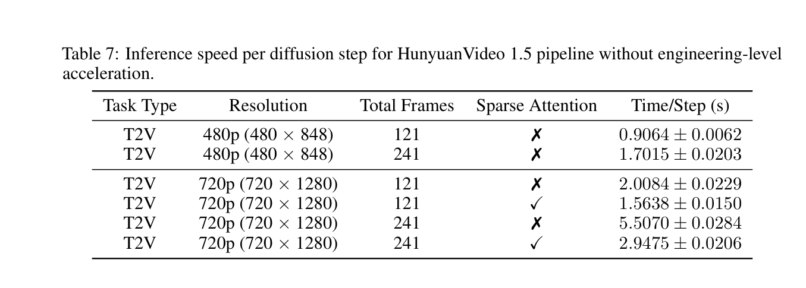

# HunyuanVideo 1.5

> [!info] 文档关系
> - 文档类型：Paper
> - 领域入口：[README](../README.md)
> - 上位汇总：[Diffusion 多模态生成与 AI Infra](../surveys/multimodal-diffusion-infra.md)
> - 证据资产：`../assets/papers/hunyuanvideo-1-5/`

HunyuanVideo 1.5 代表开放视频 DiT 的一体化管线：16x 空间/4x 时间 VAE、8.3B DiT、SSTA 与级联 VSR。其 13.6 GB 运行声明依赖 CPU offload 和 VAE spatial tiling；8.3B bf16 权重本身约 16.6 GB。论文 SSTA 伪代码使用 mask intersection，而检查的代码使用 union，需视为实现差异。

