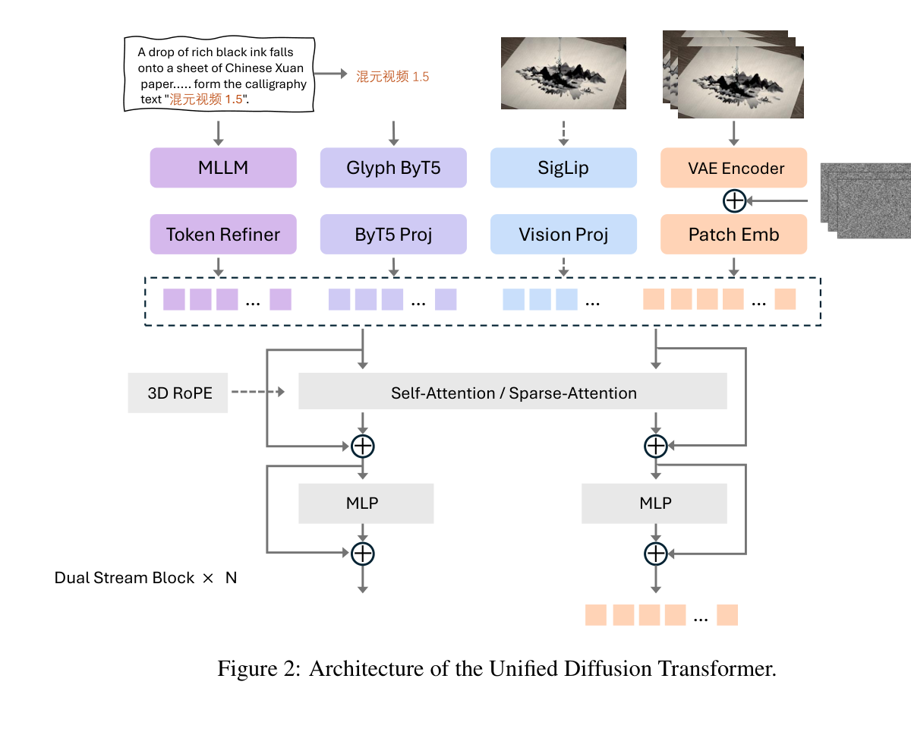

# HunyuanVideo 1.5 Technical Report 深度审阅
> [!info] 文档关系
> - 文档类型：Paper
> - 领域入口：[README](../README.md)
> - 上位汇总：[Diffusion 多模态生成与 AI Infra](../surveys/multimodal-diffusion-infra.md)
> - 证据资产：`../assets/papers/hunyuanvideo-1-5/`
> - 相关文档：[Figure inventory](../evidence/figure-inventory.md)

## 修订信息

- 当前文档版本：`1.0.0`
- 当前修订 ID：`rev-initial-20260712`

| 修订 ID | 版本 | 时间 | 执行者 | 类型 | Supersedes | 摘要 | 原因 | 影响位置 | 证据 | 结论影响 |
|---|---|---|---|---|---|---|---|---|---|---|
| `rev-initial-20260712` | `1.0.0` | `2026-07-12T00:00:00+08:00` | Codex paper agent `review_hunyuanvideo15` | initial | 无 | 初始单篇交付 | task packet 要求首次精读 | 全文 | arXiv 2511.18870、官方代码提交 `60783e704160023913bee78f0b47036d393d4dfa` | material |

## 基本信息与来源清单

- 标题：*HunyuanVideo 1.5 Technical Report*
- 作者：Bing Wu 等，腾讯混元团队
- 版本：arXiv:2511.18870，Technical Report 2025；本次 PDF 获取于 2026-07-12。
- 主证据：[arXiv:2511.18870](https://arxiv.org/abs/2511.18870)（14 页；核验 PDF SHA-256 `f4071d96fa3db0f23ff998ed479008e0044bf8fa3e60d6cf292da8d9c4399b60`）。
- 代码证据：官方仓库 `code/HunyuanVideo-1.5/`，提交 `60783e704160023913bee78f0b47036d393d4dfa`。
- 源码：arXiv e-print endpoint 返回 14 字节错误响应，未得到 LaTeX source；图表来自 220 DPI PDF 页面裁剪。
- OpenReview：任务包未给 URL，技术报告无已知公开 OpenReview 记录，故不适用。
- Checkpoint metadata：仓库列出模型目录，但未下载权重/模型仓库快照；checkpoint 级配置结论均标为未核验。
- 生成分析图：严格以本文件作为 `responses-doc --input-file` 调用两次；默认 `gpt-5.5-medium` 与重试 `gpt-5.2` 均因当前账户组不支持而 HTTP 404（request IDs `a49ce560-8c28-4d0b-82f0-c1d5502fdb62`、`6bc237d4-21cf-4965-ae01-6357e452bbef`），故未生成占位图。

| 视觉 | 类型 | 位置 | 用途 |
|---|---|---|---|
| Figure 2 | mechanism | `../assets/papers/hunyuanvideo-1-5/fig2_unified_dit_caption.png` | 统一 DiT、多条件输入与双流块结构 |
| Table 7 | result/system | `../assets/papers/hunyuanvideo-1-5/table7-inference-speed.png` | 无工程加速时 SSTA 对长序列的逐步延迟影响 |

## 术语与符号

### 术语表

| 术语 | 本文含义 | 别名/来源 | 来源 | 歧义与边界 |
|---|---|---|---|---|
| Unified DiT | 统一承载 T2I/T2V/I2V 的 8.3B 双流扩散 Transformer | author-defined | §3.1、Figure 2 | base generator，不等同于后级 SR DiT。 |
| 3D causal VAE | 对图像/视频进行 16x 空间、4x 时间压缩、32 latent channels 的视频 VAE | author-defined | §3.1 VAE | 代码类名为 Conv3D VAE；论文称“3D transformer architecture”，具体模块表述不完全一致。 |
| SSTA | Selective and Sliding Tile Attention，动态选择块与静态局部滑窗的稀疏注意力 | author-defined | §3.1、Algorithm 1 | 属于 DiT attention/runtime；不是 VAE tiling，也不是 sequence parallel。 |
| STA mask | 由 3D 局部窗口确定的静态块掩码 | author/code-defined | Algorithm 1；`ssta_attention.py:322-401` | 论文写与选择 mask 用 `AND`；代码用 `OR`，语义重大差异。 |
| selective mask | 用 pooled Q-K 相似度并惩罚 K-K 冗余得到的 top-k 块掩码 | author/code-defined | Algorithm 1；`ssta_attention.py:90-124,170-320` | 代码还支持 similarity-only、threshold 与 head sharing，报告未完整给出部署参数。 |
| group offloading | 以 Transformer block group 为单位在 CPU/GPU 间迁移权重 | code-defined | `hunyuan_video_pipeline.py:1404-1413` | 与 pipeline component offload 叠加；overlap 会增大 CPU 内存。 |
| VAE tiling | 以重叠空间 tile 编解码并 blend 边界，降低峰值 activation memory | code-defined | `hunyuanvideo_15_vae.py:615-641,776-801` | 当前代码明确不支持 temporal tiling（569-570、803-805）。 |
| base generation | 480p/720p 的 T2V/I2V 基础扩散生成 | analysis-qualified | §3、§6 | 不能把 SR 输出质量或耗时归因于 base DiT。 |
| cascaded VSR | 使用另一 8.3B SR DiT 在 latent space 上采样到 720p/1080p | author-defined | §3.2、Figure 3 | 是独立后级；代码默认 SR 为 6/8 steps，不属于 Table 7 的 base step。 |

### 符号表

| 符号 | 含义 | 来源类型 | 范围/索引 | 单位/值 | 来源 | 歧义 |
|---|---|---|---|---|---|---|
| $Q,K,V$ | attention query/key/value | author-defined | $h\times F\times H\times W\times D$ | tensor | Algorithm 1 | $H,W$ 是 latent token grid，不是像素分辨率。 |
| $N$ | 每个 3D tile 的 token 数 | author-defined | $N=t_t t_h t_w$ | tokens/block | Algorithm 1 | 代码默认 tile `(6,8,8)`，checkpoint 可覆盖。 |
| $B$ | 3D block 数 | author-defined | $(F/t_t)(H/t_h)(W/t_w)$ | blocks | Algorithm 1 | 要求 grid 可整除或先 padding。 |
| $W_S$ | STA 局部窗口 | author-defined | $(w_t,w_h,w_w)$ | blocks | Algorithm 1 | 代码名 `kernel_thw`。 |
| $\lambda,\beta$ | Q-K 相关性与 K-K 冗余权重 | author-defined | block score | scalar | Algorithm 1 Eq. line 8 | 代码写 $1-\lambda$ 而非独立 $\beta$。 |
| $k$ | 每个 query block 选择的 top-k key blocks | author-defined | per query/head | blocks | Algorithm 1 | 发布 sparse checkpoint 的实际值未核验。 |
| $L$ | 本审阅推导的 DiT 视频 token 数 | analysis-derived | $T_lH_pW_p$ | tokens | 本文“序列规格”推导 | 忽略文本 token 与实现 padding 细节。 |
| $S$ | SSTA 加速比 | analysis-derived | $t_{dense}/t_{sparse}$ | x | Table 7/8 推导 | 只适用于表中硬件、并行与模型设置。 |

## 一句话判断

这是一套将 8.3B base DiT、高压缩 VAE、SSTA、蒸馏、缓存与级联 SR 组合起来的开放视频生成系统；论文对长序列 SSTA 延迟和 13.6 GB offload 部署给出直接测量，但 checkpoint 级 SSTA 参数、CPU 内存/PCIe 流量、消费者 GPU 延迟和各组件独立质量贡献仍缺证据。

## 统一 DiT、VAE 与序列规格

论文 Table 1 给出的正式架构是 54 个 dual-stream blocks、model dimension 2048、FFN 8192、16 heads、head dim 128，合计约 8.3B 参数。Figure 2 显示 MLLM 文本、Glyph-ByT5、SigLIP 图像语义与 VAE image latent 进入统一双流结构；I2V 同时采用 channel concatenation 的低层细节条件和 sequence concatenation 的 SigLIP 语义条件（§3.1）。

VAE 报告规格为 16x 空间压缩、4x 时间压缩、32 latent channels。对 121 帧、720x1280，若按 causal temporal mapping $T_l=(F-1)/4+1=31$，空间 latent 为 $45\times80$。结合 DiT spatial patch `[1,2,2]`，高度需 padding 到偶数，审阅推导约为

$$L=31\times\lceil45/2\rceil\times(80/2)=28{,}520.$$

241 帧对应 $61\times23\times40=56{,}120$ video tokens，约为 121 帧的 1.97x；dense attention 二次复杂度因此约增长 3.87x。Table 7 的 dense 720p latency 从 2.0084 s 增至 5.5070 s（2.74x），低于纯二次比例，说明整步还含 MLP/通信等非二次部分。以上 token 数是基于论文压缩率与代码 patch size 的明确推导，不是论文报告值。

重要复现边界：仓库类默认 `hidden_size=3072, heads=24, 20 double + 40 single blocks`（`hunyuanvideo_1_5_transformer.py:350-376`），与论文 Table 1 不同；这些只是类默认值，不能替代缺失的发布 checkpoint config。VAE 的压缩因子与 latent channels 由 checkpoint config 注入（`hunyuanvideo_15_vae.py:499-539`），仓库未内置具体值。

## SSTA 机制与 paper/code 对照

Algorithm 1 的逻辑是：将 3D token grid 分块；对 block pooled Q/K 计算 Q-K 相关性；用 K-K 平均相似度估计冗余；top-k 得到选择 mask；再构造局部 STA mask；最后执行 block-sparse attention。重要性分数可写作

$$I_{ij}=\lambda\,\mathrm{sim}(\bar Q_i,\bar K_j)-\beta\,R_j.$$

代码在 fp32 中计算 pooled gate logits（`ssta_attention.py:252-273`），可减少低精度选择误差；支持 importance 与 similarity 两种 sampling。动态 mask 对 batch size 1 有断言（279），部署批处理扩展性未证明。

最大的机制差异是：论文 Algorithm 1 line 20 写 $M_{combined}=M_{sel}\land M_{sta}$，而代码 `create_ssta_3d_mask` 使用 `torch.logical_or`（`ssta_attention.py:437-447`）。从“结合局部先验与动态全局选择”的文字看，OR 更符合保留 local union selected-global 的直觉；但这仍是审阅推断，不能静默修正论文。该差异会改变稀疏率、可达区域和速度/质量权衡，必须用 checkpoint/config 与实验复核。

代码还揭示了硬件边界：`flex-block-attn` 仅在设备名含 `NVIDIA H` 且扩展可导入时开放（`commons/__init__.py:159-169`）；README 也称 sparse attention 需 H-series。因而论文的 SSTA 速度不能外推到 RTX 4090，4090 的 13.6 GB 声明是 offload 可运行性，不是 SSTA 可运行性。

## 推理速度、显存与部署证据

Table 7 在 CFG-distilled model、8x NVIDIA H800、context parallel 下测量。无工程加速时：

- 720p/121 帧：2.0084 -> 1.5638 s/step，$S=1.284$（约 22.1% latency reduction）。
- 720p/241 帧：5.5070 -> 2.9475 s/step，$S=1.868$（约 46.5% reduction），支持“SSTA 更适合长 context”。
- Table 8 在 SageAttention、`torch.compile`、feature cache 等工程加速同时启用时，720p/241 帧 50 steps 从 96.78 -> 58.39 s，$S=1.657$；121 帧仅 28.33 -> 26.41 s，$S=1.073$。

这些是直接 matched sparse on/off 延迟证据，但不是质量等价的独立消融；论文只称工程加速保持“nearly identical”质量，未给该表对应的客观/人工质量差。

### 显存、offload 与精度

论文报告 pipeline offloading + group offloading + VAE tiling 时，单卡 720p/121-frame T2V/I2V 峰值 13.6 GB，可在 RTX 4090 上运行。代码路径与声明一致：

- CLI 默认 `offloading=true`、transformer dtype `bf16`（`generate.py:153-180,340-361`）。
- 低于 60 GiB 自动启用 component + group offload；overlap 时每组 1 block 并启用 stream，否则每组 4 blocks（`hunyuan_video_pipeline.py:1404-1413,1550-1563`）。
- component 通过 context manager 在使用前 `.to(cuda)`、使用后 `.to(cpu)`（`commons/__init__.py:228-241`）。
- VAE 固定 fp16 autocast，按显存阈值选择 128/256 spatial tile 和 0.25/0.125 overlap（`hunyuan_video_pipeline.py:1566-1578`）；`memory_efficient_context` 启用 batch slicing 与 spatial tiling（`hunyuanvideo_15_vae.py:889-898`）。temporal tiling 在当前实现中明确抛错。

8.3B 参数若全用 bf16，仅权重约 $8.3\times10^9\times2=16.6$ GB（十进制），已高于 13.6 GB 峰值。因此该峰值必然依赖绝大多数权重驻留 CPU、按组件/组换入 GPU，而非模型整体常驻。代价是 PCIe/DMA 流量与 CPU RAM；README 明确 overlap group offload 会“significantly increase CPU memory”，但论文未报告 CPU 峰值、传输字节、PCIe 带宽、overlap 效率或 4090 端到端延迟，故不能评估有效带宽：

$$BW_{eff}=\frac{\text{bytes moved}}{t},\qquad U=BW_{eff}/BW_{peak}$$

所需的 bytes moved 与 transfer time 均未披露。代码使用 CUDA stream overlap，但没有 NPU 路径；CPU 承担权重驻留/迁移及预后处理，GPU 执行 DiT/VAE/attention。多 H800 实验另使用 sequence/context parallel 的 all-to-all，论文未给 interconnect 拓扑与通信占比。

精度边界：Transformer CLI 仅 bf16/fp32；VAE fp16；gate logits fp32；README 提到可选 fp8 GEMM 安装，但论文 Table 7/8 未明确 fp8 是否启用，不能把速度归因给 fp8。SageAttention、FlashAttention 2/3 与 torch SDPA 有 fallback 路径（`commons/__init__.py:178-226`）。

## Base、超分与部署声明分离

| 层级 | 输入/输出 | 论文/代码事实 | 不应混淆的结论 |
|---|---|---|---|
| Base generation | noise/condition -> 480p 或 720p latent/video | 8.3B Unified DiT；Table 7/8 是 base diffusion timing | 不能包含 SR 的额外 6/8 steps 与第二个 8.3B 模型成本。 |
| Cascaded VSR | base LR latent/video -> 720p/1080p | 独立 8.3B SR DiT，LR latent channel concat，单独 latent upsampler；代码 720p SR 6 steps、1080p SR 8 steps（`commons/__init__.py:108-123`） | SR 改善细节的视觉例子不是 matched quantitative ablation；默认 CLI `--sr=true` 会改变端到端时间。 |
| Deployment | 模型组件 + CPU/GPU runtime | 13.6 GB 是 offload+group offload+VAE tiling 的 720p/121-frame单卡峰值 | 不代表无 offload、无充足 CPU RAM或消费者 GPU 上 SSTA；SSTA 当前限 H-series。 |

## 技术声明证据矩阵

| 声明 | 证据类型 | 证据 | 判断 |
|---|---|---|---|
| 8.3B compact Unified DiT | paper specification | Table 1、§3.1 | 模型规模有报告，checkpoint config 未独立核验。 |
| VAE 16x/4x/32 channels | paper specification + code interface | §3.1；VAE config fields | plausible/partially verified；具体 config 缺失。 |
| SSTA 长序列加速 | direct matched latency | Table 7 sparse on/off | supported for 8xH800 CFG-distilled setup。 |
| SSTA 在工程加速上仍增益 | direct matched latency but bundled backend/cache | Table 8 | supported for latency；质量等价未隔离。 |
| SSTA 保持质量 | indirect statement | §3.1 distillation phase；无 matched quality table | unverified。 |
| Muon 半步数低 loss 且更好 | author observation | §3.1 Optimizer | no shown ablation；unverified。 |
| progressive training 提升稳定性/质量 | confounded | Table 2、训练叙述 | plausible but many stages bundled。 |
| SR 改善细节并修复失真 | mechanism visualization | Figure 5、§3.2 | indirect；无 matched metric ablation。 |
| 13.6 GB 单消费 GPU | direct peak-memory statement | §6 | supported for stated configuration；measurement protocol/CPU cost absent。 |
| 1.87x SSTA speedup | direct derived ratio | Table 7 241-frame 720p: 5.5070/2.9475 | supported, not general end-to-end consumer-GPU speed。 |

## 设计理由矩阵

| 设计 | 理由状态/来源 | 具体问题 | 因果机制 | 替代与权衡 | 验证证据 |
|---|---|---|---|---|---|
| 高压缩 causal VAE | author-stated，§3.1/§6 | 720p 长视频 token/activation 过大 | 16x spatial、4x temporal 压缩降低 DiT $L$ | 更高压缩可能损失细节；以 SR 补偿 | indirect latency attribution；无 VAE rate ablation，partially-supported |
| Unified T2I/T2V/I2V DiT | author-stated，§3.1 | 分任务模型重复且条件能力割裂 | type embedding + 多条件双流共享 backbone | 专项模型可能更强；共享训练有干扰 | benchmark 是整包系统，confounded |
| SSTA | author-stated，§3.1/Algorithm 1 | dense attention 对长 $L$ 二次增长 | local STA 保邻域，selective top-k 保全局相关块 | 稀疏率/质量/硬件 kernel 依赖；paper/code AND/OR 差异 | Table 7 direct latency，质量 unverified |
| sparse training in distillation | author-stated，§3.1 | 直接替换 sparse attention 可能伤质量 | 蒸馏阶段适配 sparse receptive field | 需专用 sparse checkpoint；发布状态不完整 | no matched quality ablation，unverified |
| 双文本编码器 | author-stated，§3.1 | 场景语义与多语言字形难同时建模 | MLLM 提供高层语义，Glyph-ByT5 提供细粒度字符 | 增加模型/显存/offload 成本 | 整体 benchmark，缺 component ablation |
| Progressive curriculum + shift schedule | author-stated，§4.1 | 分辨率/帧率/token length 改变导致 flow matching 不稳 | 从 T2I/低分辨率逐步扩展并按长度调 shift | 训练复杂、数据与阶段贡献混杂 | training schedule documented；no isolated ablation |
| Cascaded latent VSR | author-stated，§3.2 | base 高分辨率生成成本高、细节不足 | LR latent concat + trained upsampler + SR DiT | 第二个 8.3B 模型增加耗时/内存迁移 | Figure 5 indirect；no matched quantitative ablation |
| component/group offload + VAE tiling | author-stated/code-defined，§6/code | 单卡无法常驻 8.3B + encoders/VAE activations | 权重按需迁移，空间 tile 限制 VAE峰值 | PCIe/CPU RAM/latency 代价；temporal tiling unavailable | 13.6 GB direct peak claim，成本缺失 |

## 相关工作定位

论文将自身放在开放视频 DiT（HunyuanVideo/Wan/Mochi/Cosmos）、高压缩 VAE、稀疏视频注意力（STA）和工程 attention kernel 之间。相对 full attention，SSTA 的优势是 block dynamic global selection + static local prior；相对纯 STA，它试图恢复远距离关系；相对 MoBA 类动态块选择，它保留规则局部窗口。公平性限制是 Table 7 仅与同模型 FlashAttention-3 dense backend 对照，这是验证 SSTA runtime 的合理 matched comparison，但没有与其他 sparse mechanisms 在同稀疏率、同质量下比较。

## 显式证据闭环

问题：长 720p 视频令 attention token 数快速增长。设计：高压缩 VAE 先缩短序列，SSTA 再稀疏 QK block 连接。机制证据：Algorithm 1 与代码 mask/kernel 路径。测量：Table 7 在 241 帧从 5.5070 降至 2.9475 s/step。结论：在 8xH800、CFG-distilled 条件下，SSTA 对长序列确有显著 runtime 增益。限制：paper/code mask 运算不一致、质量保持无 matched ablation、sparse kernel 限 H-series，因此不能推出 RTX 4090 上同样加速或无质量代价。

## 局限、启发与待验证问题

### 实用局限

- 13.6 GB 只报告 GPU 峰值；CPU RAM、PCIe 流量、冷启动、端到端 wall time 未报告。
- SSTA checkpoint、top-k/tile/window/sampling 参数未由本地 checkpoint metadata 核验，且 README 当时仍称 sparse weights coming soon。
- 消费级 GPU 部署与 SSTA 是两条不同证据链：4090 支持 offload base pipeline，但代码禁止在非 H-series 使用 sparse extension。
- VAE temporal tiling 在代码中不可用，极长视频的 VAE memory 扩展不能依赖该路径。
- Base/SR/蒸馏/cache/SageAttention 经常组合启用，质量与速度收益难做组件归因。

### 研究启发

- 应把“稀疏 mask 质量”与“kernel 执行效率”分开测：固定 mask 比较 kernel，再固定 kernel 比较 selector。
- offload 系统应同时报告 GPU/CPU 峰值、H2D/D2H bytes、PCIe utilization 与 overlap stall，才能让 14 GB 可运行性转为可部署性。
- 需要统一 paper pseudocode 与 code mask semantics，并在相同 sparsity 下做 OR/AND/union-with-local 的质量-延迟曲线。

### 待验证清单

1. 发布 sparse checkpoint 的真实 `config.json` 是否采用论文 Table 1 的 54x2048x16，以及实际 SSTA tile/top-k/window？
2. Algorithm 1 的 AND 是排版错误，还是代码 OR 是后续修改？两者的有效 sparsity 和质量差多少？
3. 13.6 GB 测量对应 bf16/fp16/fp8 哪种精度、是否含 SR、CPU 峰值与 PCIe 代价是多少？
4. Table 8 的 feature cache 对质量与速度各贡献多少，SSTA 与 cache 是否交互？
5. 480p->720p 与 720p->1080p SR 的 matched perceptual/temporal consistency 指标和额外延迟是多少？
