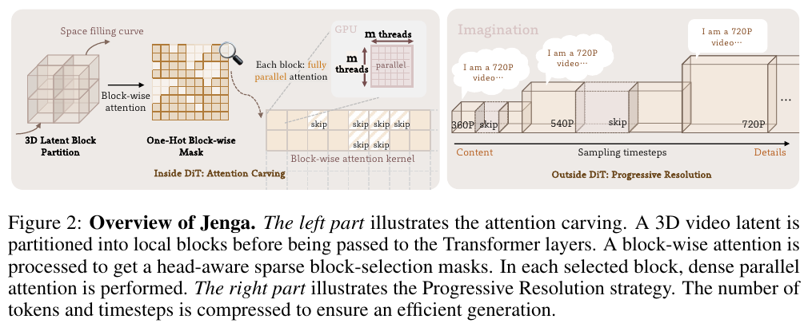
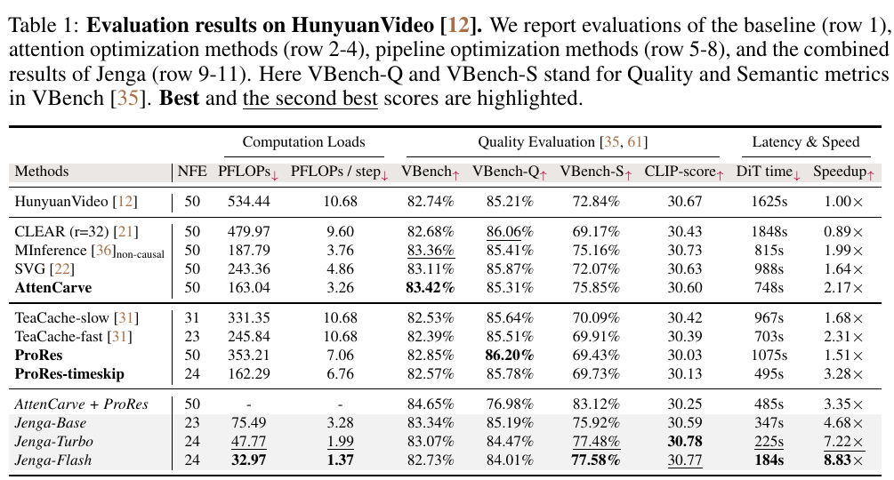

---
tags:
  - paper
  - collection/multimodal-generation
  - domain/model-systems
  - status/deep-review
  - topic/video-generation
  - method/dynamic-token-carving
document_type: paper
domain: multimodal_generation
collection: Multimodal Generation
review_status: deep-review
canonical: true
---

# Training-Free Efficient Video Generation via Dynamic Token Carving 精读分析

> [!info] 文档关系
> - 文档类型：Paper
> - 领域入口：[README](../README.md)
> - 上位专题：[Video generation sparse attention](../../../01_ai_infra/kernel/custom_attn/surveys/video-generation-sparse-attention.md)
> - 证据资产：[assets/papers/jenga](../assets/papers/jenga/)

> 资料状态：本分析以 `arXiv PDF`（arXiv:2505.16864v2，26 页）为唯一技术事实来源。PDF 可完整检索和渲染；arXiv source 在 55 秒上限内只下载到 24,248,302/27,632,537 bytes，未作为证据；官方代码获取被中止，未检查实现；任务包未提供 OpenReview URL，且按上级指令停止网络查询。两张原论文图表均为 180 DPI PDF 截图裁剪，包含完整 caption，并通过 contact-sheet 与逐图原分辨率 QA。

## 修订信息

- 当前修订 ID：`rev-jenga-obsidian-properties-20260731`
- 当前文档版本：`1.0.2`
- 当前修订时间：`2026-07-31T10:00:00+08:00`
- 替代版本：`rev-jenga-affiliation-backfill-20260730` / `1.0.1`

| 修订 ID | 文档版本 | 时间 | 修订者 | 类型 | 替代修订 | 迁移问题/解析 | 变更摘要 | 原因 | 影响位置 | 依据 | 对结论影响 |
|---|---|---|---|---|---|---|---|---|---|---|---|
| `rev-20260730-jenga-initial` | `1.0.0` | `2026-07-30T14:04:26+08:00` | `review_jenga` | `initial` | 无 | 无 | 首次 PDF-only 精读、两图 QA、证据与归因审计 | delegated initial delivery | 全文及本地 artifacts | task packet；arXiv v2 PDF | 不适用 |
| `rev-jenga-affiliation-backfill-20260730` | `1.0.1` | `2026-07-30T23:30:00+08:00` | `/root` | `metadata-update` | `rev-20260730-jenga-initial` / `1.0.0` | 无 | 补充作者—机构元数据与角色证据边界 | 统一回填 affiliation 交付字段 | `作者与机构` | 论文 PDF 标题页、机构编号与角色脚注 | none：不改变方法、实验与归因结论 |
| `rev-jenga-obsidian-properties-20260731` | `1.0.2` | `2026-07-31T10:00:00+08:00` | `/root` | `metadata-update` | `rev-jenga-affiliation-backfill-20260730` / `1.0.1` | 无 | 增加 Obsidian YAML Properties 与层级标签 | 全量 canonical Paper 标签补齐 | 文件头 YAML frontmatter | 已验证的 ICML 2026 标签 schema；仓库覆盖矩阵 | none：不改变论文分析与证据结论 |

## 0. 资料与配图索引

- 论文：`arXiv PDF`；SHA-256 见 `过程交付清单`。
- 论文版本：PDF 首页标记 `arXiv:2505.16864v2 [cs.CV] 22 Nov 2025`，并写有 “Preprint. Under review.”。任务包给出的 “NeurIPS 2025” 未能由 PDF 内文独立确认。
- 源码/LaTeX：不可用；限时下载不完整，不作为证据。
- 开源代码：论文指向 `https://github.com/dvlab-research/Jenga`，但本次未获得可检查快照；所有实现级判断均标为未验证。
- OpenReview：任务包为 `unknown`，未建立公开评审交叉核验。
- 提取文本：`extracted_text/paper.txt`（`pdftotext -layout`）。
- 机制图：Figure 2，`../assets/papers/jenga/fig2_jenga_overview_caption.png`。
- 结果表：Table 1，`../assets/papers/jenga/table1_main_results_caption.png`。
- QA：`Figure inventory` 与 `figures/contact-sheet.png`。
- 算法总览：直接采用原论文 Figure 2；未生成 AI 图。

## 0.1 术语与符号解释

### 0.1.1 术语表

| 术语 | 本文含义 | 别名/来源性质 | 不等于/易混项 | 证据来源 |
|---|---|---|---|---|
| Jenga | 不训练模型、只改推理的组合管线：AttenCarve + ProRes，并在部分配置中再加固定 timestep skip | author-defined | 不是单一稀疏注意力内核；8.83× 也不是 AttenCarve 单独收益 | Abstract；§1；Table 1 |
| Attention Carving | 在每个注意力头内，以块均值估计相关性，只为选中的 KV 块做密集块内注意力 | AttenCarve，author-defined | 不删除视频 latent，也不减少 FFN/投影所处理的 token 数；它跳过的是未选中的 query–KV block attention | §3.1；Fig. 3；Algorithms 2–4 |
| Progressive Resolution | 早期阶段用较低 latent 分辨率，阶段切换时恢复“干净”latent、上采样并重新加噪，后期升到目标分辨率 | ProRes，author-defined | 不是注意力稀疏率调度；它直接改变整个 DiT forward 的视觉 token 数 | §3.2；Fig. 4；Algorithm 1 |
| importance mask | 由块均值 Q/K 的近似注意力概率得到的每头动态块选择 | $B_{\mathrm{top}}$，author-defined | 不是训练得到的语义路由器；同一输入的不同层/头/步可不同 | Eq. (3)；Algorithm 3 |
| condition mask | 强制保留所有与文本条件块相关的注意力 | $B_{\mathrm{cond}}$，author-defined | 视觉 query 的稀疏 KV 选择仍存在；文本 query 在 Algorithm 2 中走 full attention | §3.1；Algorithm 2 |
| adjacency mask | 强制保留 3D 邻近块以避免块边界伪影 | $B_{\mathrm{adja}}$，author-defined | 不是 importance mask 的静态替代，而是其安全补集 | §3.1；Fig. 7 |
| text-attention amplifier | 低分辨率首阶段给视觉 query→文本 key 的 attention logit 加分辨率相关偏置 | author-defined | 不改变文本 embedding，也不是 classifier-free guidance | §3.2；Fig. 4 |
| case-agnostic timestep skip | 预先固定的 23/24 步采样日程，中段稀、两端密 | author-defined | 不是输入自适应缓存；Table 1 中 Jenga-Base/Turbo/Flash 的高倍加速包含此项 | §3.2；§4.1；Table 1 |
| effective sparsity | 最终 mask 跳过的块交互比例，受 top-k、概率阈值、条件块和邻接块共同影响 | paper metric | 不等同于参数 $1-k$，因为 union mask 会补回块 | Table 3d |

### 0.1.2 符号表

| 符号 | 含义 | 性质 | 作用域/索引 | 单位/取值 | 来源 | 易混点 |
|---|---|---|---|---|---|---|
| $N,N_v,N_c$ | 总 token 数、视觉 token 数、条件 token 数 | author-defined | 每次 DiT forward | token；$N=N_v+N_c$ | §3 | ProRes 改 $N_v$；AttenCarve 通常不改 $N_v$ |
| $t,h,w$ | latent 的时间、高、宽 token 维度 | author-defined | 每个分辨率阶段 | token grid；720P 实验为 $32\times45\times80$ | §3；§4.1 | $t$ 也被论文用于扩散 timestep，需按上下文区分 |
| $Q_i,K_i,V_i$ | 第 $i$ 个注意力头的 query/key/value | author-defined | 每层、每头、每采样步 | $\mathbb{R}^{N\times d_k}$ | Eq. (1) | 不是缓存后固定对象；随层和步变化 |
| $d,h,d_k$ | embedding 维度、头数、单头维度 | author-defined | 模型级 | $d_k=d/h$ | §3.1 | 具体数值未报告 |
| $M,m$ | 块数、每块 token 数 | author-defined | 每分辨率/attention | $m=N/M$；实验 $m=128$ | §3.1；§4.1 | 论文同时写“block count m”的个别语句，主定义以每块 token 数为准 |
| $z_{thw},z_{\mathrm{blk}}$ | 标准时空顺序与 SFC 分块顺序的视觉 token | author-defined | 每次模型调用的视觉序列 | latent token features | Eq. (2) | 二者内容相同，只是索引排列不同 |
| $G,G^{-1}$ | Generalized Hilbert 置换及逆置换 | author-defined | 每分辨率阶段预计算 | index permutation | Eq. (2) | 只重排索引，不改变 token 内容 |
| $\hat Q,\hat K$ | 每块均值池化后的 query/key | author-defined | 每层、每头 | block features | Eq. (3) | 只用于选块；被选块内部仍算原始 dense attention |
| $R$ | 粗粒度块间 attention 概率矩阵 | author-defined | 每层、每头、每 query block | $[0,1]$，行 softmax | Eq. (3) | 是选择近似，不是最终输出 attention |
| $k,p$ | 最低 top-k 比例与累计概率阈值 | author-defined | 可按 stage 设置 | $k\in[0,1],p\in[0,1]$；常用 $k=0.3/0.2,p=0.3$ | §3.1；§4.1 | Algorithm 3 取两种约束所需块数的较大者 |
| $B,B_{\mathrm{top}},B_{\mathrm{cond}},B_{\mathrm{adja}}$ | 最终 mask 及其三部分 | author-defined | 每头的 block pair | binary | §3.1 | $B$ 是 union，额外安全块会降低实际 sparsity |
| $R_s,R_S$ | 第 $s$ 阶段与目标阶段 latent 规格 | author-defined | ProRes stage | $\{t,h_s,w_s,r,d\}$ | §3.2 | 与粗 attention 概率 $R$ 同字母但不是同一对象 |
| $x_t,\hat x_0^s,\epsilon_t,\tilde\epsilon,\sigma_t$ | 当前 noisy latent、预测 clean latent、预测噪声、新噪声、调度噪声强度 | author-defined | 扩散步/阶段切换 | latent / scalar schedule | Eq. (4) | $\epsilon_t$ 与 Algorithm 1 中变量排版存在轻微不一致 |
| $U$ | 3D latent area interpolation | author-defined | stage transition | latent→higher-resolution latent | §3.2 | 不是像素域超分 |
| $\beta,\rho$ | 文本 attention logit 偏置及平衡因子 | author-defined | 首个低分辨率 stage | $\beta=-\rho\log(\mathrm{numel}(R_s)/\mathrm{numel}(R_S))$；$\rho=0.5$ | §3.2；§4.1 | Algorithm 4 直接写加 $\rho$，与正文的 $\beta$ 命名有实现表述差异 |
| $T,S$ | 总 denoising steps 与分辨率 stage 数 | author-defined | generation | integer | §3.2 | Jenga 结果常同时改变 $T$ 和 $S$，归因需拆开 |

## 1. 论文基本信息

### 作者与机构

- 第一作者（首位列名）：Yuechen Zhang → The Chinese University of Hong Kong。
- 共同第一作者（仅含论文明确标注者）：论文未显式标注。
- 通讯作者/通讯联系人（仅含论文明确标注者）：论文未显式标注。
- 其他作者涉及的机构（去重列举，不作逐作者映射）：The Chinese University of Hong Kong；Hong Kong University of Science and Technology；Kuaishou Technology；SmartMore。
- 对应依据：论文 PDF 标题页、作者机构编号与角色脚注（核验日期：2026-07-30）。

- 研究领域：视频 Diffusion Transformer 推理加速。
- 核心问题：高分辨率视频使 self-attention 随 token 数近似二次增长；扩散又把 DiT forward 重复数十次。
- 研究目标：不训练模型，通过减少 attention block 交互和早期视觉 token 数来降低 DiT forward 时间，同时保持 VBench/CLIP/人评质量。
- 关键约束：需要 3D latent 局部性、阶段间 latent 对齐、条件信息不被稀疏化、GPU 上稀疏结构可高效执行。
- 证据版本：arXiv v2 PDF；代码、source、公开评审未核验。

## 2. 研究动机与问题—方案闭环

### 2.1 出发点与背景痛点

作者明确指出，单张 H800 生成 5 秒 720P HunyuanVideo 约需 27 分钟；其中 self-attention 占 forward 时间的 77.8%。瓶颈有两个彼此独立的轴：高分辨率把视觉 token 数推到约 115K，使 full attention 的交互数随 $N^2$ 增长；扩散采样又将这次昂贵 forward 重复 50 次。只优化其中一轴，另一轴仍然保留。

论文的关键观察也是分阶段的：早期 denoising 主要建立内容结构，不必从一开始就使用最终分辨率；后期主要补细节，已有内容使注意力呈高冗余，不必保留所有 KV 交互。Jenga 因此把 ProRes 放在 DiT 外部改变 token 数，把 AttenCarve 放在 DiT 内部改变 attention 交互数；固定 timestep skip 则是第三个、独立的采样步数优化。

### 2.2 现有方案为何不够

| 现有方案/做法 | 可观察的失败 | 具体场景 | 例子来源 | 根因/被忽略变量 | 为什么简单修补仍不够 | 证据 |
|---|---|---|---|---|---|---|
| 全程 720P + full attention | 50 步 DiT time 1625s | 每一步都处理 $32\times45\times80=115{,}200$ 视觉 token，即使早期只在搭结构 | paper-provided | 未利用 denoising 的 coarse-to-fine 轨迹 | 只减少步数会丢掉迭代预算，仍让保留的每一步承担完整 720P 成本 | §1；§4.1；Table 1 |
| 固定局部窗口/预定义稀疏模式 | CLEAR 在同表中 1848s，反而慢于 1625s baseline；静态模式也会漏掉长程/语义块 | 某深层 head 从局部模式转为语义相关远距块，固定窗口无法跟随 | paper-provided（Fig. 13） | attention 随输入、层、头和 timestep 变化 | 扩大固定窗口虽能少漏信息，却在所有位置重新支付更多计算，不能按实例分配预算 | §1；§2；Fig. 13；Table 1 |
| 只按低分辨率生成后放大 | 视野变窄，过程退化成对局部画面的超分 | 低分辨率 token 更偏向空间邻域，文本描述的全局场景覆盖不足 | paper-provided（Fig. 4/5/14） | 降分辨率改变了视觉局部 attention 与文本条件的相对权重 | 普通 latent resize 只改尺寸，不会恢复被弱化的文本条件利用 | §3.2；Fig. 4 |
| 只做稀疏 attention | AttenCarve 仍需 50 次 forward，且 FFN/投影仍处理全部 token | 即使 attention 降到 748s，早期每一步的 115K token 仍经过非 attention 模块 | 本文据 Table 1 构造的说明例，不是论文实验 | 稀疏 attention 不改变整个网络的 token 长度 | 进一步增大 attention sparsity 会首先损害条件、邻接或重要块，而不是消除 FFN/投影成本 | Table 1；§3.2；Fig. 15 |

### 2.3 目标问题与成功标准

- 目标：在训练-free、plug-and-play 条件下，同时降低每步 attention 交互、每步全网络 token 数和可选的采样步数。
- 成功标准：DiT time/PFLOPs 显著下降；VBench、VBench-Q/S、CLIP 与人评保持可比；跨 T2V/I2V/蒸馏模型可迁移。
- 不解决：VAE 解码加速、训练成本、任意强稀疏率下的质量保证、阶段转换的严格分布一致性。

### 2.4 方案如何改变变量

| 原始问题 | 方案设计 | 改变的变量/行为 | 作用机制 | 预期指标 | 证据 | 判断 |
|---|---|---|---|---|---|---|
| full attention 的 $N^2$ 交互 | AttenCarve | 每 query block 实际访问的 KV block 数 | 动态粗选 + 条件/邻接安全块；kernel 不加载未选块 | attention latency、PFLOPs | Eq. (3)；Table 1；Fig. 15 | 有直接单组件结果，但算法与 kernel 贡献未完全拆开 |
| 早期 720P token 过多 | ProRes | 早期 $N_v=t h_s w_s$ | 低分辨率 stage 先定内容，后期高分辨率补细节 | 全 DiT latency、step PFLOPs | Eq. (4)；Table 1/3d；Fig. 15 | 有独立 ProRes 与 schedule 消融 |
| 低分辨率视野收缩 | text-attention amplifier | vision→text logits | 给文本块加分辨率相关正偏置，降低相对局部邻域支配 | VBench/CLIP/FOV | §3.2；Table 3b；Fig. 14 | 有参数敏感性，缺少与“无 amplifier”的严格独立主表 |
| 50 次 forward | fixed timestep skip | NFE 从 50 降到 23/24 | 复用/跳过中段步骤 | 总 latency | Table 1 | 收益明显，但与 TeaCache-style latent reuse 的边界表述不够清楚 |

### 2.5 完整因果链与证据边界

论文从“高分辨率 $N^2$ attention + 多步重复”出发，分别以 AttenCarve 减少选中的 block pair、以 ProRes 减少早期 $N_v$、以固定 skip 减少 NFE。Table 1 直接显示 AttenCarve-only 和 ProRes-only 都降低时间；Table 3 又分别验证 mask 组成与低分辨率步比例。然而 8.83× 是 Jenga-Flash 的组合值，包含 24-step skip、两阶段 ProRes、较高 AttenCarve sparsity 和 Triton kernel，不能归给“动态 token carving”单项。论文没有提供相同 mask、相同 NFE 下的通用 kernel-vs-algorithm 分解，也没有代码供本次核验，因此实现级因果链只部分闭合。

## 3. 核心贡献

1. 动态 block-wise attention：按层/头/步从输入 Q/K 估计重要 KV 块，并用条件与 3D 邻接 mask 防止典型信息丢失。
2. 分辨率阶段化：早期少 token、后期恢复目标分辨率，并用 re-noise 继续同一 denoising 轨迹。
3. 低分辨率条件补偿：分辨率越低，vision→text attention logit 偏置越强，以稳定视野。
4. 把三种正交杠杆组合为 training-free inference pipeline，并在多个视频 DiT 上报告 2.12–8.83× 级别加速；但最高数字是组合结果。

## 4. 研究方法

### 4.1 方法总览

> 原论文 Figure 2（含完整 caption）。左侧是 DiT 内的 AttenCarve：latent 经 3D 保局部的顺序划块，mask 决定哪些块间 attention 真正执行。右侧是 DiT 外的 ProRes：采样从低分辨率走向高分辨率。图中两条路径是互补机制，不应把 ProRes 的 token 减少称为 AttenCarve 的“删 token”。

一个 prompt 先编码为文本 token。每个 resolution stage 预计算 SFC 索引、逆索引和邻接 mask；每个 denoising step 将视觉 token 重排后送入 DiT。每层 attention 根据当前 Q/K 动态构建 importance mask，与 condition/adjacency mask 取 union；Triton kernel 只计算 mask 中的块。模型输出前恢复原 $t\!h\!w$ 顺序。阶段切换时先估计 clean latent，升采样，再按当前噪声强度 re-noise。首个低分辨率阶段还增强文本 attention，后续阶段关闭。

### 4.2 AttenCarve：选什么、跳什么、何时恢复

1. **排列而非删除。** $G$ 把 3D 邻近 token 尽量排到相邻的一维位置，形成每块 $m=128$ token 的块。
2. **粗评分。** 每块 Q/K 先做 mean pool，得到便宜的 $M\times M$ 概率 $R$。
3. **动态选择。** 每个 query block/attention head 至少保留 top-$k$ 比例，同时继续保留高概率块直到累计概率超过 $p$。
4. **安全补集。** 所有 condition 相关块与 26-neighborhood 邻接块强制加入。
5. **真正跳过的计算。** 自定义 block-sparse kernel 跳过 $B[i,j]=0$ 的 Q–KV 块乘加与对应 KV 读取；选中的块内部仍做 dense attention。
6. **没有跳过的计算。** patch embedding、投影、FFN、未被 ProRes 改变的视觉 token，以及 condition query 的 full attention 都仍存在。
7. **恢复位置。** token 在 patchify 后重排，在 unpatchify 前用 $G^{-1}$ 恢复；附录 Algorithm 1 把这对操作放在每个 denoising step 的模型调用两侧。因代码不可用，是否通过 fused layout 避免层间额外 copy 未验证。

### 4.3 ProRes：与 attention sparsity 分离

ProRes 不改变某个 attention head 选多少 KV 块；它把整个 stage 的 latent 网格从 360P/540P 逐步升到 720P，因此 attention、FFN、projection 等所有按 token 执行的模块都处理更短序列。阶段切换不是简单 resize noisy latent，而是先从当前预测恢复 clean latent、再升采样、再重新加噪。其独立风险是 latent 对齐与边界伪影；AttenCarve 的独立风险是漏掉重要长程或边界交互。二者可组合，但失败模式不同。

### 4.4 关键公式

$$
z_{\mathrm{blk}}=G(z_{thw}),\qquad z_{thw}=G^{-1}(z_{\mathrm{blk}})
$$

**这条公式在算什么？** 把标准时空顺序变成适合连续分块的 SFC 顺序，并在输出前还原。

**怎么读？** 内容不变，只改变 token 的索引位置。

**输入与输出。** 输入是按 $t,h,w$ 展平的视觉 token；输出是 block-contiguous token，逆变换恢复原顺序。

**变量在这里各做什么？** $G$ 是置换，$G^{-1}$ 是精确逆置换，$z$ 是 token 特征。

**直觉。** 一维相邻项更可能在 3D latent 中也相邻，因此固定大小块内部更相似，邻接块也更容易预计算。

**边界。** 置换本身不产生稀疏，也不保证语义相似；它只利用空间连续性。

**小例子。** Figure 3 的 $4\times4\times4$ toy latent 以 $m=8$ 分块；这是论文示例。

$$
R=\operatorname{softmax}\left(\hat Q\hat K^\top/\sqrt{d_k}\right),\qquad
B=B_{\mathrm{top}}\cup B_{\mathrm{cond}}\cup B_{\mathrm{adja}}
$$

**这条公式在算什么？** 先估计哪些 query block 与 KV block 值得计算，再把动态重要块与两个安全 mask 合并。

**怎么读？** 用块均值做低成本试算，选中后才用原始 token 做精确块内 attention。

**输入与输出。** 输入为 block-pooled $\hat Q,\hat K$；输出 $R$ 是概率矩阵，$B$ 是二值执行 mask。

**变量在这里各做什么？** $d_k$ 做尺度归一化；$B_{\mathrm{top}}$ 随 Q/K 动态变化；$B_{\mathrm{cond}}$ 保留文本；$B_{\mathrm{adja}}$ 保留局部连续性。

**直觉。** $k$ 或 $p$ 越大，通常保留块越多、质量风险越低、速度越慢；union 中固定安全块使实际稀疏率不等于 $1-k$。

**边界。** 块均值可能抹平块内尖峰；概率阈值是近似 attention 的阈值，不是最终 token attention 的误差保证。

**小例子。** 若某 query block 的粗概率为 $[0.50,0.25,0.15,0.10]$，$k=0.25,p=0.7$，至少 top-1，但为跨过 0.7 需保留前两块；邻接/条件 mask 还可能再补块。（本文构造的说明例，不是论文实验）

$$
\hat x_0^s=x_t-\sigma_t\epsilon_t,\qquad
x_{t-1}=(1-\sigma_t)U(\hat x_0^s)+\sigma_t\tilde\epsilon,\quad
\tilde\epsilon\sim\mathcal N(0,I)
$$

**这条公式在算什么？** 在分辨率 stage 切换时，先估计干净 latent，再升采样并重新放回相同噪声强度附近。

**怎么读？** 不直接放大带噪状态，而是“去噪估计→放大→重新加噪”后继续采样。

**输入与输出。** 输入为当前 $x_t$、模型噪声预测 $\epsilon_t$、调度强度 $\sigma_t$；输出为下一分辨率的 noisy latent。

**变量在这里各做什么？** $U$ 做 3D area interpolation；$\tilde\epsilon$ 提供新随机噪声；$\sigma_t$ 控制 clean 与 noise 的混合。

**直觉。** 早期低分辨率少 token，切换后高分辨率补细节；但插值后的 clean latent 不严格服从目标分辨率真实轨迹。

**边界。** 作者承认存在 distribution discrepancy，并用 scheduler re-shift 缓解；Algorithm 1 的 stage transition 条件写作 `if s > 1`，与正文“中间 stage 结束后切换”存在疑似伪代码条件歧义。

**小例子。** 540P stage 完成一半步骤后恢复 clean latent，升至 720P，再 re-noise 继续；这是论文 Turbo 配置的机制化表述。

$$
\beta=-\rho\log\frac{\operatorname{numel}(R_s)}{\operatorname{numel}(R_S)}
$$

**这条公式在算什么？** 根据当前/目标分辨率 token 比例计算 vision→text attention logit 的补偿偏置。

**怎么读？** 当前分辨率越低，比例越小，$\beta$ 越正，文本条件越容易被注意。

**输入与输出。** 输入为两个 stage 的元素数和 $\rho$；输出为无量纲 logit bias。

**变量在这里各做什么？** $\rho$ 控制补偿强度；$R_s,R_S$ 描述 stage 规格。

**直觉。** 低分辨率视觉 token 更偏局部时，提高文本 logits 可拉回全局语义/视野。

**边界。** 过大的 $\rho$ 会整体移动 softmax 分布并损害质量；正文称偏置为 $\beta$，Algorithm 4 却直接给文本块加 $\rho$，代码缺失使两者映射未验证。

**小例子。** 若当前 token 数是目标的 $1/4$ 且 $\rho=0.5$，$\beta=-0.5\log(1/4)\approx0.693$。（本文按论文公式计算）

### 4.5 组件级设计动机矩阵

| 设计项 | why 来源 | 具体问题 | 因果机制 | 替代/权衡 | 验证证据 | 判断 |
|---|---|---|---|---|---|---|
| SFC reorder | author-stated | 线性 hwt 分块破坏 3D 局部性/需更多 padding | 连续曲线让一维块保持 3D 邻近 | 规则 3D cube；分辨率适配与 padding 更差 | Table 3b；Table 7 | 有间接/消融支持 |
| $B_{\mathrm{top}}$ | author-stated | 静态模式不能跟随层/头/步 | 当前 Q/K 块均值动态选 KV | token-level 选择更精细但开销高 | Table 3c；Fig. 13 | 有直接消融；mean pooling 误差未隔离 |
| probability cutoff | author-stated | 某些 head 需要全局 context，固定 top-k 会漏 | 概率质量集补充超出 top-k 的块 | 更高阈值更稳但稀疏率下降 | Table 3a/3d；Fig. 7 | 有敏感性证据 |
| condition mask | author-stated | 文本条件被稀疏会损失语义 | 条件相关 attention 全保留 | 增加少量计算 | Table 3b/c | 删除后 VBench 81.82 vs 83.07，直接消融 |
| adjacency mask | author-stated | 独立块边界出现 grid artifacts | 强制 26-neighborhood 交互 | 增加计算，邻域数固定 | Table 3b/c；Fig. 7 | 直接消融 + 可视化 |
| Triton block kernel | author-stated | 稀疏 mask 若只做 dense 后置零不会加速 | 不加载/计算未选 KV block | 硬件与块大小依赖 | Fig. 15；Appendix C.4 | runtime 有测量；无 kernel replacement ablation |
| multi-stage ProRes | author-stated | 早期高分辨率 token 浪费 | 早期降低全网络 $N_v$，后期恢复细节 | stage 多会增 alignment 误差 | Table 1；Table 3b/d | 有独立结果和 schedule 消融 |
| clean→upsample→re-noise | author-stated | 直接跨分辨率需接回 denoising trajectory | 在 clean estimate 上变换后恢复噪声 | 仍有分布差异/边界 artifact | Eq. (4)；limitations | 机制合理，缺少替代 transition 消融 |
| text amplifier | author-stated | 低分辨率 FOV 收缩 | 加强文本相对局部视觉注意力 | 太强会改变 softmax、降质量 | Table 3b；Fig. 14 | 参数敏感性支持，公式/伪代码命名待代码核验 |
| fixed timestep skip | author-stated | 多步 forward 成本 | 中段稀疏采样、两端密集 | 可能损失轨迹精度 | Table 1 | 有组合对照；与 reuse 贡献未完全分开 |

## 5. 关键结论与证据

### 5.1 主结果

> 原论文 Table 1（含完整 caption）。该表是分离归因的核心：AttenCarve-only、ProRes-only、ProRes+timeskip、AttenCarve+ProRes 与三个最终配置分别列出。

- **AttenCarve-only：** 1625→748s，绝对减少 877s、相对减少 54.0%，speedup 2.17×；PFLOPs 534.44→163.04（减少 69.5%）；VBench 82.74→83.42（+0.68 点）。这证明“动态稀疏 attention + 对应 kernel”的整体有效性，未证明两者各自贡献。
- **ProRes-only：** 1625→1075s，减少 550s、33.8%，1.51×；PFLOPs 534.44→353.21（减少 33.9%）；VBench 82.74→82.85（+0.11 点）。这与 attention sparsity 无关，是早期 token 数减少的独立证据。
- **AttenCarve + ProRes（50 NFE）：** 485s、3.35×、VBench 84.65。PFLOPs 未报告，因此二者的组合 FLOPs 不能从表中精确核对。
- **Jenga-Flash：** 184s、8.83×、VBench 82.73，较 baseline -0.01 点；但它同时使用 24 NFE、两阶段分辨率、较高稀疏率和 kernel，属于组合结论。

### 5.2 技术点证据矩阵

| 技术点 | 声称效果 | 对应证据 | 对照 | 证据强度 | 结论 |
|---|---|---|---|---|---|
| AttenCarve overall | 降 attention/forward 时间 | Table 1 AttenCarve-only；Fig. 15c/d | 同 50 NFE，但算法与 kernel 绑定 | 直接组件结果，内部贡献混合 | 支持整体，不支持 kernel 单独归因 |
| dynamic importance | 保留关键块 | Table 3c `w/o Importance` 77.41 vs All 83.07 | 其余 mask 保留，latency不同 | 直接消融 | 支持质量作用 |
| adjacency | 防 grid artifacts | Table 3c；Fig. 7 | w/o Adjacency | 直接消融 + 可视化 | 支持 |
| condition | 保语义 | Table 3c | w/o Condition | 直接消融 | 支持 |
| SFC | 保局部性/少 padding | Table 3b；Table 7 | hwt / cube | 替换对照 | 支持，但主表增益小 |
| ProRes | 降全网络 token cost | Table 1 ProRes-only；Table 3d | baseline/full-res | 直接组件结果 + 敏感性 | 支持 |
| text amplifier | 稳定 FOV | Table 3b $\rho$ sweep；Fig. 14 | 多 $\rho$，无完全独立主表 | 间接/敏感性 | 部分支持 |
| timestep skip | 降总 forward 数 | ProRes vs ProRes-timeskip；AttenCarve vs Jenga-Base | NFE 同时变化 | 直接但属于采样策略 | 支持 speed，质量边界由表内指标限定 |
| “semantic improvement from key selection” | VBench-S 提升 | 完整配置/AttenCarve rows | 指标相关性，无机制隔离 | correlation-only | 不能断言选择机制必然提升语义 |
| 8.83× | 组合加速 | Table 1 Jenga-Flash | 多项同时改变 | 多因素混合 | 只归给完整配置 |

### 5.3 分离 AttenCarve、ProRes 与 kernel

| 变化 | 可归因指标 | 能说什么 | 不能说什么 |
|---|---|---|---|
| baseline→AttenCarve | 2.17×、PFLOPs -69.5% | sparse block selection + Triton execution 的联合收益 | 不能把 2.17× 全归给 selection 或 kernel 任一项 |
| baseline→ProRes | 1.51×、PFLOPs -33.9% | 低分辨率 stage 的独立全网络 token 收益 | 不能称为 attention sparsity 收益 |
| ProRes→ProRes-timeskip | 1.51×→3.28×，NFE 50→24 | 在 ProRes 上再减步数的组合增益 | 不能归给 ProRes 本身 |
| Jenga-Base→Turbo | 347→225s，VBench 83.34→83.07 | 在 AttenCarve+skip 基础上加入 2-stage ProRes 的近似增量 | NFE 23→24 且 stage-specific $k$ 可能变化，非完美单变量 |
| Turbo→Flash | 225→184s，VBench 83.07→82.73 | 更高 sparsity 的速度/质量折中 | 不能当作新 resolution schedule 收益 |
| Fig. 15 FlashAttention2→AttenCarve | attention 0.445→0.132s；selection overhead 2.8% | kernel 能兑现 mask 为 attention latency | 无代码和 matched alternate kernel，无法验证实现细节/可移植性 |

### 5.4 Evidence loop

动机声称高 $N$ attention 与多步 forward 是瓶颈；方法分别改变 block interaction、token count、NFE；Table 1 提供三种近似桥接对照；Table 3 提供 mask 与 schedule 消融；Fig. 15 提供 token count、attention timing 与 overhead。闭环的缺口是：没有公开可核验代码快照；ProRes transition 替代方案消融不足；最高 speedup 是多项绑定；质量主要依赖 VBench/CLIP 和 70 份问卷，未给方差/显著性。

## 6. Related Work 对比

| 类别 | 机制 | 优点 | 局限 | 与 Jenga 的关系 |
|---|---|---|---|---|
| CLEAR/STA/SVG | 预定义时空局部模式 | 规则、实现直接 | 不随输入/层/头变化，长程聚合受限 | AttenCarve 改为动态 block selection |
| MInference/SpargeAttn/AdaSpa | 块级选择/均值估计 | 比固定窗口灵活 | 规则 partition、需调 sparsity 或原为语言模型场景 | Jenga 引入 3D SFC、条件/邻接安全 mask |
| TeaCache/feature reuse | 跳过或复用 diffusion steps/features | 降 NFE/forward | 不能降低保留 step 的高分辨率 attention 成本 | 与 AttenCarve/ProRes 正交，但 Jenga 也采用固定 skip/reuse |
| Bottleneck Sampling | 变分辨率采样 | 直接减少 token | 若保留初始高分辨率或 FOV 变化，收益/质量受限 | ProRes 让低分辨率负责内容，并加 text amplifier |
| distillation/quantization | 训练或数值格式层面加速 | 可与 pipeline 组合 | 训练成本或精度/硬件约束 | Jenga 声称无需训练；量化未在本文验证 |

公平性注意：Table 1 中 CLEAR 反而慢于 baseline，说明稀疏 pattern 不能保证 wall-clock 收益；但不同方法的适配质量、kernel 成熟度与超参调优程度可能不对等。论文未给所有 baseline 的同等工程优化审计。

## 7. OpenReview 公开评审交叉核验

未执行公开 OpenReview 评审交叉核验。任务包 `openreview_url: unknown`；PDF 写 “Preprint. Under review.”，而任务包写 “NeurIPS 2025”，两者的时间/版本关系未能在停止网络后验证。该缺口不改变 PDF 内方法与表格读数，但降低对 venue 状态、评审争议和 rebuttal 修订的把握。

## 8. Infra 需求分析

### 8.1 算力与 token 复杂度

full attention 的主项近似 $\mathcal O(N^2d_k)$。AttenCarve 令每个 query 平均只访问 $N'$ 个 KV token，论文写作 $\mathcal O(N'N)$；$N'$ 应理解为由 mask 中平均选中块数乘 $m$ 得到。ProRes 则把 $N_v=t h_s w_s$ 本身降低，因而同时降低 attention 与按 token 线性增长的 FFN/投影。

Figure 15 报告 720P/540P/360P 分别为 115,200/63,360/28,160 token，23-step generation time 为 708/256/68s。360P token 仅为 720P 的 24.4%，full-attention pair 数理论比例约 5.98%，实际时间比例 9.60%；差异说明端到端还有 FFN、projection、launch、VAE 外部或其他非二次项。

### 8.2 显存、数据类型与带宽

论文报告 720P 上 Jenga 显存 71.84→74.49 GiB，增加 2.65 GiB（3.7%），来源包括 mask/selection 与布局。PDF 未报告权重、activation、accumulation 的 fp16/bf16/fp32 细节；代码不可用，因此不能判断 Triton kernel 是否依赖特定混合精度或 accumulator。

若被选中 KV 的字节量近似 $2N'd_kb$（K+V，$b$ 为每元素字节数），稀疏 mask 可降低 HBM 读取；但论文没有 bytes moved、peak bandwidth 或 profiler bandwidth，因此不能计算 effective bandwidth/utilization。Fig. 15d 的时间占比（visual block-wise attention 88.8%、block selection 2.8%、post reshape 3.4%、text attention 1.13%、others 3.78%）只能说明时间构成，不能直接证明 memory-bound 或 compute-bound。

### 8.3 GPU/多卡与自定义算子

- 单卡主实验：NVIDIA H800；block size 128；Triton kernel。
- 8×H800：论文称基于 xDiT，attention head 维并行，其他模块 token 维并行；Jenga-Flash 184→39s，官方 HunyuanVideo 1625→225s。代码未检查，通信、all-to-all/all-reduce、NVLink 流量和 overlap 均未知。
- CPU/NPU：PDF 未报告 CPU preprocessing、host-device transfer 或 NPU fallback；不得推断支持。
- kernel 边界：AttenCarve 只优化 attention；RoPE、normalization 与 VAE 仍被作者列为未来优化。最高 speedup 因此依赖 GPU 上 block sparsity 能转化为真实跳算，而非仅 FLOPs 下降。

## 9. 开源代码对照

官方 URL 来自论文，但本次无代码 commit 可检查。以下实现细节仅为论文级：

| 论文机制 | PDF 证据 | 代码状态 | 结论 |
|---|---|---|---|
| SFC reorder / inverse | Eq. (2), Algorithm 1 | 未检查 | 概念明确；layout/fusion 未验证 |
| mask construction | Algorithm 3 | 未检查 | sort+cumsum+union 被描述；边界条件未验证 |
| Triton sparse kernel | Algorithm 4 | 未检查 | 跳块逻辑被描述；dtype、numerical parity、autotune 未验证 |
| ProRes stage switch | Eq. (4), Algorithm 1 | 未检查 | 伪代码 `if s > 1` 疑似与正文不一致 |
| text amplifier | §3.2 vs Algorithm 4 | 未检查 | $\beta$ 与直接加 $\rho$ 的映射存在表述歧义 |
| checkpoint/config | 无公开 metadata 检查 | 未检查 | 参数量、模型 revision 与配置均不作实现事实陈述 |

## 10. 优点、局限与改进

### 优点

- 把三种计算杠杆清楚放在不同层级：block interaction、全网络 token 数、NFE。
- Table 1 提供了 AttenCarve-only 和 ProRes-only，避免完全无法归因。
- Table 3 对 mask 组成、stage 数、低分辨率比例和阈值做了较系统消融。
- 机制与 GPU 友好执行一起设计，Fig. 15 至少报告 selection overhead 与 attention timing。

### 局限

- 8.83× 是多项绑定，不能代表 AttenCarve 或 ProRes 单项。
- 代码/source 未核验，kernel、dtype、多卡通信与算法伪代码歧义均停留在论文陈述。
- 分辨率切换会有 latent alignment/boundary artifacts；详细 prompt 只是缓解，不是机制保证。
- SFC partition 不使用语义，mean pooling 也可能漏掉块内少量强相关 token。
- VBench/CLIP 对结构与人类偏好覆盖有限；70 份问卷未给置信区间。
- PDF 版本的 venue 状态与任务包不一致；OpenReview/rebuttal 不可用。

### 可改进

- 用 matched kernel 对照拆开 selection 算法与 Triton 实现收益。
- 固定 NFE、mask 与 kernel，仅替换 ProRes transition，验证 clean-resize-re-noise 的必要性。
- 报告 HBM bytes、effective bandwidth、occupancy、各分辨率 kernel efficiency 与通信量。
- 对低分辨率 FOV 补充无 amplifier/固定 bias/动态 $\beta$ 的受控对照。
- 让语义感知 selection 与 SFC 局部先验并存，同时维持结构化块稀疏。

## 11. 研究启发

- 视频稀疏 attention 的重要问题不是“能否删 80%”，而是删哪类交互仍能在 GPU 上形成规则跳算。
- coarse-to-fine 生成允许把资源预算沿时间重分配：早期省空间分辨率，后期省 attention 密度。
- 组合系统的 headline speedup 必须按算法、采样日程和 kernel 三层报告，否则跨论文比较会混淆。
- 最小复现实验应包含：HunyuanVideo 固定 50 NFE 的 full/AttenCarve/ProRes/combined 四桥接组，再固定 23/24 NFE 比较 stage 数与 sparsity。

## 12. 待验证清单

1. Algorithm 1 的 stage transition 条件是否应为 `s < S`，实际代码如何实现？
2. 正文 $\beta$ 与 Algorithm 4 直接加 $\rho$ 的精确换算在哪里完成？
3. AttenCarve 相对 FlashAttention2 的 3.7× 是 attention-only 还是含 mask construction 的稳态测量？
4. 不同 dtype、Hopper kernel、sequence padding 下，2.8% selection overhead 是否稳定？
5. 8 卡 token/head parallel 的通信量和扩展效率如何分解？
6. Jenga-Base 中固定 timestep skip 与 TeaCache-style latent reuse 各贡献多少？
7. Table 1 `AttenCarve + ProRes` 的 PFLOPs 为什么缺失？
8. 公开代码、模型 revision、OpenReview/rebuttal 是否解决伪代码与评测公平性问题？

## 13. 一句话总结

Jenga 的可信核心不是笼统“删 token”，而是把 **AttenCarve 的块交互跳算** 与 **ProRes 的全网络 token 缩短** 分开，再与固定 timestep skip 和 Triton kernel 组合；PDF 证据支持两项机制各自加速，但 8.83× 只能归属于完整配置，且实现细节因代码/source/OpenReview 不可用而未验证。
