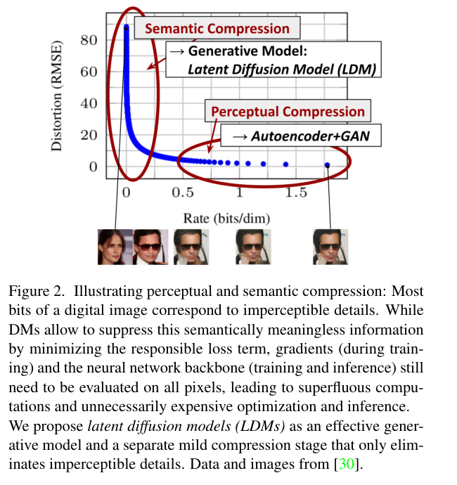

# Latent Diffusion Models

> [!info] 文档关系
> - 文档类型：Paper
> - 领域入口：[README](../README.md)
> - 上位汇总：[Diffusion 多模态生成与 AI Infra](../surveys/multimodal-diffusion-infra.md)
> - 证据资产：`../assets/papers/ldm/`

LDM 将反复去噪从像素网格迁移到冻结 autoencoder 的连续 latent；论文证据支持温和压缩区间，而不是“压得越狠越好”。每维下采样 `f` 将空间位置降为原来的 `1/f²`，但真实加速还受 latent channel、U-Net、attention 和一次性解码成本影响。

