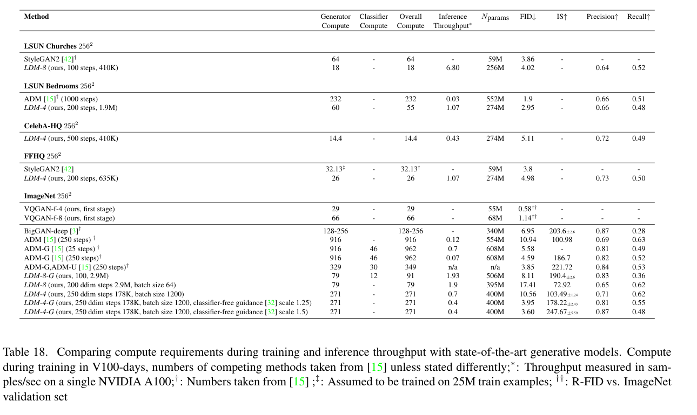

# High-Resolution Image Synthesis with Latent Diffusion Models
> [!info] 文档关系
> - 文档类型：Paper
> - 领域入口：[README](../README.md)
> - 上位汇总：[Diffusion 多模态生成与 AI Infra](../surveys/multimodal-diffusion-infra.md)
> - 证据资产：`../assets/papers/ldm/`
> - 相关文档：[Figure inventory](../evidence/figure-inventory.md)

## Revision Information

- Current document version: `1.0.0`
- Current revision ID: `rev-ldm-initial`

| Revision ID | Version | Revised at | Revised by | Type | Supersedes | Migration resolution | Summary | Reason | Affected locations | Evidence | Impact |
|---|---|---|---|---|---|---|---|---|---|---|---|
| rev-ldm-initial | 1.0.0 | 2026-07-12T00:00:00+08:00 | review_ldm | initial | none | none | Initial evidence-grounded review | Initial delivery | `analysis.md`, [Figure inventory](../evidence/figure-inventory.md) | Paper PDF and official repository identity | material |

## Source And Figure Inventory

- Primary source: [arXiv:2112.10752](https://arxiv.org/abs/2112.10752), 45-page arXiv/CVPR paper.
- Visual evidence: [Figure 2](../assets/papers/ldm/fig2-perceptual-semantic-compression.png) and [Table 18](../assets/papers/ldm/table18_compute_throughput_caption.png); full provenance and QA are in [Figure inventory](../evidence/figure-inventory.md).
- Code: official repository HEAD resolved to `a506df5756472e2ebaf9078affdde2c4f1502cd4`; the full clone and commit-pinned raw-file retrieval timed out, so code-path claims remain unverified.
- Source archive: arXiv e-print transfer timed out and the partial archive is not treated as evidence.
- OpenReview: no URL is supplied and CVPR 2022 does not imply a public OpenReview record; not applicable.

## Terminology And Symbols

### Terms

| Term | Meaning | Source | Ambiguity |
|---|---|---|---|
| Latent Diffusion Model (LDM) | A diffusion model trained in the frozen first-stage autoencoder representation rather than RGB pixels. | Sec. 3, Eq. 3 | “Latent” does not mean a jointly learned probabilistic prior here; the first stage is trained separately. |
| Perceptual compression | First-stage removal of visually imperceptible/high-frequency detail using an autoencoder with perceptual/adversarial reconstruction training. | Introduction, Fig. 2, Sec. 3.1 | It is lossy and therefore establishes a reconstruction ceiling. |
| Semantic compression | The diffusion model’s learning of the remaining conceptual distribution. | Introduction, Fig. 2 | This is a conceptual label, not a separately measured codec stage. |
| KL-reg / VQ-reg | Mild latent regularization by KL penalty or vector-quantization layer. | Sec. 3.1, Appendix D.2 | The paper evaluates both; “VAE” is shorthand only for the KL-regularized path. |
| Cross-attention conditioning | Mapping conditioner tokens into keys/values while U-Net features supply queries. | Sec. 3.3, Eq. 4 | It changes conditioning flexibility, not the spatial compression factor itself. |

### Symbols

| Symbol | Meaning | Provenance | Scope / unit | Source | Ambiguity |
|---|---|---|---|---|---|
| $x\in\mathbb{R}^{H\times W\times3}$ | RGB image | author-defined | pixels | Sec. 3.1 | Pixel value normalization is implementation-dependent. |
| $z=\mathcal{E}(x)$ | encoded latent | author-defined | $h\times w\times c$ tensor | Sec. 3.1 | KL and VQ regularization produce different latent distributions. |
| $\tilde{x}=\mathcal{D}(z)$ | reconstruction | author-defined | pixels | Sec. 3.1 | Reconstruction quality bounds downstream detail. |
| $f=H/h=W/w$ | spatial downsampling factor | author-defined | ratio, typically 4 or 8 at the useful operating point | Sec. 3.1, Sec. 4.1 | Spatial element reduction is $f^2$, not $f$. |
| $t$ | diffusion timestep | author-defined | discrete step | Eq. 3 | Training uses 1000 steps in Appendix configurations; samplers may use fewer inference steps. |
| $\tau_\theta(y)$ | learned conditioning representation | author-defined | $M\times d_\tau$ tokens | Sec. 3.3, Appendix E.2.1 | Conditioner architecture differs by task. |

## Core Mechanism: Pixels To Latents

*Original paper Figure 2, including its full caption.*

The enduring idea is a division of labor. A separately trained encoder-decoder absorbs the expensive obligation to preserve local appearance; a denoising U-Net then models the lower-resolution latent distribution:

$$
z=\mathcal{E}(x),\qquad \tilde{x}=\mathcal{D}(z),
$$

$$
L_{\mathrm{LDM}}=\mathbb{E}_{z,\epsilon,t}\left[\left\|\epsilon-\epsilon_\theta(z_t,t)\right\|_2^2\right].
$$

This separation matters as much as compression. Reconstruction loss trains $\mathcal{E},\mathcal{D}$ before diffusion; the diffusion objective learns the latent prior with the first stage frozen. Thus a poor reconstruction is not repaired by more denoising compute, while a good codec does not by itself model semantic diversity.

For equal channel width, moving from $H\times W$ pixels to $(H/f)\times(W/f)$ latents reduces spatial positions by $f^2$: $f=4$ gives $16\times$ fewer positions and $f=8$ gives $64\times$. Actual FLOPs do not fall exactly by $f^2$ because latent channel counts, U-Net widths, attention, decoder cost, and batching change. The paper’s controlled sweep (Sec. 4.1; Fig. 6-7) is therefore more reliable than a pure token-count argument: $f=4$ to $8$ is the useful region, while $f=32$ visibly sacrifices generative quality.

### Design-Rationale Matrix

| Design | Rationale status / source | Concrete problem | Causal mechanism | Alternatives / trade-off | Validation |
|---|---|---|---|---|---|
| Frozen, separately trained first stage | author-stated; Introduction, Sec. 3.1 | Pixel DMs repeatedly spend compute on imperceptible detail and joint training must balance reconstruction against prior learning. | Remove perceptually redundant detail once, then reuse the representation across diffusion tasks. | Joint latent training can adapt the codec but reintroduces objective coupling; stronger compression lowers cost but fixes a lower detail ceiling. | Direct compression-factor sweep in Sec. 4.1/Fig. 6-7; separation itself is compared mainly through prior work, so only partially isolated. |
| Mild KL or VQ regularization | author-stated; Sec. 3.1 | Unregularized latent space can be irregular, while aggressive bottlenecks destroy detail. | Encourage tractable latents without forcing high compression. | KL is continuous; VQ discretizes. Their costs and artifacts differ. | Appendix D.2 reconstruction table; indirect for downstream diffusion quality. |
| Latent-space U-Net denoising | author-stated; Sec. 3.2, Fig. 2 | Sequential pixel-space U-Net evaluations dominate training and sampling. | Evaluate the backbone over $1/f^2$ as many spatial sites, then decode once. | Pixel diffusion avoids codec loss; token/patch generators use different scaling. | Direct factor sweep and Table 18, though architectures/learning rates are not perfectly matched. |
| Cross-attention conditioner | author-stated; Sec. 3.3, Eq. 4 | Concatenation/class embeddings do not uniformly support text, layout, and other token sets. | U-Net features query task-specific conditioning tokens, decoupling conditioning representation from image grid. | Concatenation is cheaper for aligned dense maps; attention adds $O(NM)$ memory/compute. | Multi-task results are indirect; no clean cross-attention replacement ablation. |
| Convolutional sampling above training resolution | author-stated; Sec. 4.3.2 | High-resolution training is expensive and fixed-size generators are restrictive. | Fully convolutional latent U-Net can process larger latent grids. | Larger grids increase activation/attention memory and may alter latent SNR; global coherence is not guaranteed. | Qualitative Figure 9/13 and Appendix D.1; not a controlled scalability proof. |

## Technical-Claim Evidence Matrix

| Claim | Evidence | Classification | Judgment |
|---|---|---|---|
| Moderate latent compression improves the quality/compute frontier over pixel diffusion. | Sec. 4.1, Fig. 6-7; matched 2M-step, single-A100 sweep with similar parameter counts. | direct but learning rates/architectures vary | Supported for tested settings. |
| Too much compression damages quality. | LDM-32 trend in Fig. 6-7 and reconstruction metrics in Appendix D.2. | direct sensitivity | Supported. |
| Separating reconstruction and diffusion avoids joint loss balancing. | Method design and comparison to jointly trained LSGM. | plausible, not isolated ablation | Partially supported. |
| Cross-attention provides general conditioning. | Eq. 4 and results across text/layout tasks. | indirect | Capability shown; causal superiority over alternatives unverified. |
| LDM cuts training compute and improves throughput. | Table 18. | reported comparison, partly heterogeneous | Strong directional evidence; exact ratios inherit hardware/model/sampler confounds. |

## Results And Evidence Loop

*Original paper Table 18, including its full caption.*

The cleanest bridge is: pixel-space redundancy -> smaller latent grid -> more examples per device step / cheaper U-Net evaluation -> a better achievable frontier under fixed compute. In the ImageNet factor sweep, all variants use one A100 and comparable parameter counts, but batch size rises from 7 for LDM-1 to 40 for LDM-4 and 64 for LDM-8 (Appendix Table 13). Table 18 then reports, for example, LSUN-Bedrooms LDM-4 at 55 V100-days and 1.07 samples/s versus ADM at 232 V100-days and 0.03 samples/s; this is about $4.2\times$ lower reported training compute and $35.7\times$ higher reported throughput, but it also changes parameter count, sampling steps, and architecture. The limitation closes the evidence loop: the result establishes a system-level frontier, not a pure $f^2$ kernel speedup.

## Infrastructure Implications

- **Compute and memory:** spatial activation storage and convolution work shrink roughly with latent area, enabling larger batch sizes. The autoencoder decode is paid once per final sample rather than once per denoising step. Attention becomes more affordable at moderate $f$, but its cost scales with latent query count times conditioning-token count.
- **Bandwidth:** no byte-traffic counters or kernel timings are reported, so effective bandwidth and utilization cannot be computed. The mechanism should reduce repeated U-Net activation traffic, but decoder traffic and latent-channel expansion prevent equating pixel reduction with bandwidth reduction.
- **Precision:** the paper does not establish fp16/bf16/fp32 execution details or mixed-precision dependence. Table 18 is hardware-level evidence, not a datatype study.
- **Interconnect and scheduling:** experiments are largely single-GPU; there is no evidence for all-reduce efficiency, pipeline parallelism, NVLink/RDMA utilization, or distributed scheduler behavior. Larger latent batches may improve utilization, but this is an inference.
- **CPU/GPU/NPU heterogeneity:** the paper assumes GPU execution and reports no CPU preprocessing overlap, NPU kernels, DMA layout, or fallback paths. A modern heterogeneous deployment must separately place text encoding, iterative U-Net, and decode; only the stage separation is enduring, not a demonstrated placement policy.
- **Persistent systems consequence:** latent compression shortens the spatial token sequence before the iterative core. It changes the dominant cost surface from “repeat high-resolution pixel work every step” to “iterate on compressed state, decode once,” which remains applicable even when the denoiser changes from U-Net to transformer.

## Code And Reproducibility Cross-Check

The official repository identity was verified at commit `a506df5756472e2ebaf9078affdde2c4f1502cd4`. However, the clone ended before a checkout and commit-pinned raw-file downloads timed out; therefore requested VAE paths (`AutoencoderKL`, `quant_conv`, `post_quant_conv`), `LatentDiffusion.encode_first_stage`/`scale_factor`, and `CrossAttention` are not claimed as inspected. Appendix E.2 and Tables 13/17 remain the evidence for conditioner sequence lengths, heads, depths, batches, and single-A100 setup. Checkpoint metadata was not inspected.

## Related Work Positioning

Relative to pixel DMs, LDM accepts a lossy reconstruction ceiling for much cheaper repeated denoising. Relative to aggressively compressed autoregressive/VQ approaches, it keeps a milder spatial bottleneck and uses diffusion for the prior. Relative to jointly trained latent score models, it prioritizes reusable frozen representations and simpler objective separation. Comparisons are directionally fair on standard metrics, but compute numbers drawn from other papers and the A100-to-V100 conversion weaken exact efficiency rankings.

## Limitations

1. Compression-factor ablations vary learning rates and some architecture details, so $f$ is not perfectly isolated.
2. Table 18 combines different samplers, step counts, parameter sizes, and hardware conversions; it cannot identify kernel-level causes.
3. The first-stage reconstruction ceiling can erase fine text, faces, or texture before diffusion sees them.
4. No datatype, bandwidth-utilization, multi-GPU, or heterogeneous-accelerator measurements support those deployment dimensions.
5. Code paths and checkpoint metadata could not be inspected due incomplete network transfers; implementation statements are restricted to paper evidence.

## Research Inspirations

- Treat codec rate, denoiser token length, and decode cost as one Pareto surface rather than selecting $f$ from reconstruction alone.
- Measure bytes moved per denoising step and decoder amortization to separate compute from bandwidth gains.
- Co-design adaptive latent resolution with attention locality: preserve spatial detail only where the denoiser benefits from it.

## Unresolved Reading Questions

- How much of the $f=4$ to $8$ advantage survives strictly matched U-Net width, optimizer, batch, and learning rate?
- Which error types arise in the frozen codec and remain impossible for the diffusion prior to repair?
- On current accelerators, where does the bottleneck cross from convolution/attention to decoder and memory traffic?
