---
tags:
  - paper
  - collection/multimodal-generation
  - domain/model-systems
  - status/deep-review
  - topic/long-video-generation
  - method/nvfp4-balanced-sequence-parallelism
---

# LongLive-2.0：面向长视频生成的 NVFP4 并行基础设施

> [!info] 文档关系
> - 文档类型：Paper
> - 领域入口：[README](../README.md)
> - 上位汇总：[Visual generation model landscape](../surveys/visual-generation-model-landscape.md)
> - 证据资产：`../assets/papers/longlive-2-0/`
> - 相关文档：[Figure inventory](../evidence/longlive-2-0-figure-inventory.md)

## 修订信息
- 当前文档版本：`1.1.0`
- 当前修订 ID：`rev-longlive20-figures-tables-20260903`
- 当前修订时间：`2026-09-03T20:00:00+08:00`
- 替代版本：`rev-longlive20-initial-20260903`

| 修订 ID | 文档版本 | 时间 | 修订者 | 类型 | 替代修订 | 变更摘要 | 原因 | 依据 | 对结论影响 |
|---|---|---|---|---|---|---|---|---|---|
| rev-longlive20-initial-20260903 | 1.0.0 | 2026-09-03 | /root | initial | 无 | 首次精读与发布候选 | 用户请求 | arXiv:2605.18739v2 PDF、TeX、NVlabs/LongLive commit 7860ad9 | none |
| rev-longlive20-figures-tables-20260903 | 1.1.0 | 2026-09-03 | /root | evidence-update | rev-longlive20-initial-20260903 | 修复表格渲染、紧裁剪并补齐 Figure 1–12 与 Table 1–7 | 用户反馈 | LaTeX 源码、逐图原分辨率检查 | none |

## 0. 资料与配图索引
- 论文：`paper.pdf`（arXiv:2605.18739v2，20 页）
- LaTeX：`source.tar`；展开分析在系统临时目录完成
- 开源代码：`https://github.com/NVlabs/LongLive`，commit `7860ad9685686bc3edfd407eb4d12579ca47d689`
- OpenReview：未发现公开页面
- 原论文正式资产：`../assets/papers/longlive-2-0/`
- 图表 inventory：`figure_inventory.md`

## 0.1 术语与符号解释
### 0.1.1 术语表
| 术语 | 本文含义 | 不等于/易混项 | 证据来源 |
|---|---|---|---|
| NVFP4 | NVIDIA Blackwell 支持的 4 位浮点、微块缩放格式 | 不是仅部署后量化（PTQ） | §2.2、§3.1 |
| Balanced SP | 将同一时间块的干净历史与带噪目标放在同一 rank 的序列并行布局 | 不等于把拼接序列均匀切片的传统 SP | §2.1、Figure 3 |
| 教师强制 | 用真实历史作为条件预测后续目标 | 不等于 diffusion forcing | §2.1 |
| DMD | 分布匹配蒸馏，用少步学生逼近原扩散模型 | 不等于 AR 长视频微调本身 | §2.2 |
| KV 缓存 | 保存历史注意力的 key/value，避免重复计算 | 不等于模型权重缓存 | §3.1 |
| attention sink | 固定少量早期帧作为注意力锚点以稳定长序列外观 | 不等于扩大滑动窗口 | §4.2、Figure 7 |

### 0.1.2 符号表
| 符号 | 含义 | 性质 | 作用域 | 单位/取值 | 来源 | 易混点 |
|---|---|---|---|---|---|---|
| $P$ | 序列并行组大小 | author-defined | SP group | 正整数 | Eq. (1) | 不是参数并行度 |
| $L$ | 干净与带噪 token 总长度 | author-defined | 每次训练样本 | token 数 | Eq. (1) | 不是视频秒数 |
| $d$ | 每个头的维度 | author-defined | DiT 层 | hidden dim | Eq. (1) | 不是 NVFP4 位宽 |
| $H$ | 注意力头数量 | author-defined | DiT 层 | count | Eq. (1) | 不等于 halo |
| $F$ | VAE latent 帧数 | author-defined | 视频样本 | frame count | §2.1 | 不等于原始帧数 |
| $h$ | VAE 左 halo 大小 | author-defined | 每个 rank | latent frames | §2.1 | 只用于边界感受野 |
| $W$ | 推理注意力窗口的 chunk 数 | author-defined | 生成步骤 | chunks | §4.2 | 不等于 KV cache 总长度 |
| $\mathcal A_g,\mathcal A_s$ | 全局/镜头级 attention sink 集合 | author-defined | 推理 | token sets | Eq. in §4.2 | 不是训练 mask |

## 0.2 算法总览
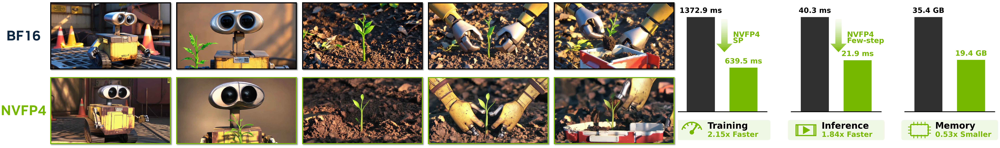
> 图 1：原论文 Figure 1，展示多镜头长视频质量及 BF16/NVFP4 的速度、显存对比。
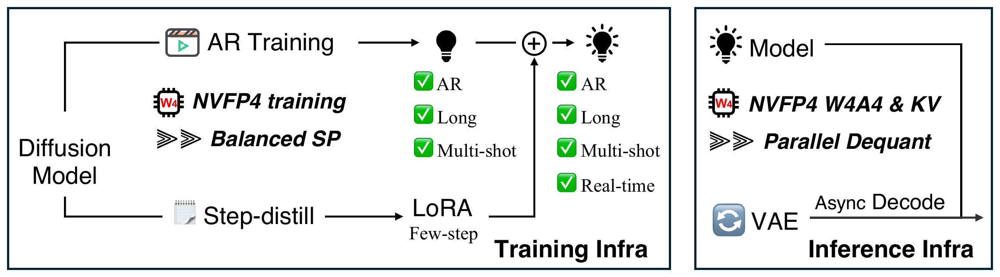
> 图 2：原论文 Figure 2，展示训练基础设施、DMD LoRA 和推理基础设施的完整边界。

## 1. 论文基本信息
- 署名类型：个人作者；机构：NVIDIA。
- 完整作者列表：Yukang Chen、Luozhou Wang、Wei Huang、Shuai Yang、Bohan Zhang、Yicheng Xiao、Ruihang Chu、Weian Mao、Qixin Hu、Shaoteng Liu、Yuyang Zhao、Huizi Mao、Ying-Cong Chen、Enze Xie、Xiaojuan Qi、Song Han。
- 第一作者/共同一作：Yukang Chen（first listed author，equal contribution marker，PDF title page）、Luozhou Wang（equal contribution marker，PDF title page）、Wei Huang（equal contribution marker，PDF title page）、Shuai Yang（equal contribution marker，PDF title page）；机构均为 NVIDIA。作者身份与机构证据均来自 PDF title page。
- 通讯作者：论文未标注 corresponding author；项目负责人标记为 Yukang Chen `†`，不等同于通讯作者。
- 其余作者机构（去重）：NVIDIA。
- 研究领域：长视频扩散生成的训练与推理系统。
- 核心问题：视频长度增长带来的显存、计算、通信和端到端延迟瓶颈。
- 关键约束：Blackwell 才原生支持 NVFP4；非 Blackwell 需 SP 推理；低精度必须与训练/推理对齐。

## 2. 研究动机与问题—方案闭环
作者在 PDF title page 将 Yukang Chen 标为 first listed author，并以 `*` 标记 equal contribution；证据位置为 PDF title page。其角色依据原文可写为：first listed; equal contribution marker。
### 2.1 出发点与背景痛点
作者指出，长视频同时放大训练序列、VAE latent 准备、DiT GEMM、KV 缓存和 VAE 解码成本。现有工作偏重算法，训练与部署基础设施没有协同设计（author-stated，Introduction）。

### 2.2 现有方案为何不够
场景：4 卡切分 clean/noisy 拼接序列。简单修补：增加 GPU 不能消除切分和 VAE 重复。
| 现有做法 | 可观察失败 | 具体场景 | 根因 | 为什么简单修补不够 | 证据 |
|---|---|---|---|---|---|
| 传统 SP 直接切分 `[clean; noisy]` | 某些 rank 几乎只有 clean token，loss 工作量失衡 | 4 卡、4 个 chunk 时，按拼接序列切片会出现 clean-heavy/noisy-heavy rank | loss-bearing noisy token 与序列切片边界不对齐 | 只增加 GPU 仍保留不均衡和 VAE 重复编码 | §2.1、Figure 3 |
| PTQ 后再部署 NVFP4 | 人脸细节和语义出现质量下降 | 仅部署量化的模型没有在量化误差下训练 | 训练分布与部署数值格式错配 | 调低位宽或校准不能恢复训练时未见过的误差 | Appendix G Figure 11、Table 7 |
| 滑动窗口丢弃旧 token | 多镜头切换后外观漂移 | 单一 global sink 保身份但不保镜头内连续性；移动 sink 又丢全局身份 | 长期身份与局部时间一致性是两个时间尺度 | 单纯扩大窗口增加显存和计算，不能解决两种锚点冲突 | §4.2、Figure 7/10 |

### 2.3 目标与成功标准
目标是直接把双向扩散模型微调成可交互、长、多镜头 AR 模型，并在同一数值路径上实现少步实时推理。成功标准是：训练迭代时间下降、峰值显存下降、端到端（含 VAE）FPS 上升，同时 VBench/VBench-Long 不显著下降。明确边界是硬件相关的 NVFP4 支持和有限的公开复现细节。

### 2.4 方案如何改变变量并产生优化
| 问题 | 设计 | 改变的变量/行为 | 预期指标 | 证据与判断 |
|---|---|---|---|---|
| SP loss 失衡、VAE 重复 | Balanced SP | 每个 rank 同时拥有同块 clean/noisy；VAE 只编码本地 chunk+halo | 训练时间、显存 | Table 1，直接支持 |
| GEMM 和激活显存 | NVFP4-aware training | 权重/激活以 W4A4 参与 GEMM，梯度保持高精度路径 | 训练吞吐、显存 | Table 1/2/7，直接支持 |
| KV 缓存增长和解码空转 | NVFP4 KV + 并行反量化 + 异步 VAE | KV 字节数、通信量和 CPU/GPU 解码重叠 | E2E latency/FPS | Table 3/6，部分归因 |
| 多镜头外观漂移 | 双层 attention sink | $\mathcal A_g$ 固定全局身份，$\mathcal A_s$ 随镜头重绑定 | 一致性 | Figure 10、Table 5，机制可视化支持 |

### 2.5 因果链结论
长视频长度触发显存和延迟瓶颈；传统 SP 的 token/损失与 VAE 分片不一致，PTQ 又造成数值错配。Balanced SP 对齐时间块所有权，NVFP4 对齐训练与部署数值格式，KV 压缩和异步解码减少通信与空转，双层 sink 稳定跨镜头身份。Table 1/3 直接测到速度和显存改善，Table 4/5 显示质量保持；但各 runtime kernel 对收益的独立贡献并未完全分离，故整体结论是“有直接系统证据、部分机制归因”。

## 3. 核心贡献
1. Balanced SP：联合 teacher-forcing、SP、VAE 分块和 loss 负载均衡（§2.1，Figure 3）。
2. 端到端 NVFP4 训练/推理：W4A4、NVFP4 KV、并行反量化（§2.2、§3）。
3. 异步流式 VAE 解码，将模型去噪与解码重叠（§3.2，Table 3）。
4. 双层多镜头 attention sink 与直接长视频 AR 微调流程（§4，Table 5）。

## 4. 研究方法
### 4.1 方法总览
训练时视频先由 VAE 编成 latent；每个 rank 取得本地 chunk 和左 halo，形成 clean/noisy 配对，经过 Ulysses All-to-All 后直接使用通信原生的 AR mask。推理时模型以 W4A4 NVFP4 运行，历史 KV 以 NVFP4 保存，滑窗外保留全局和镜头锚点，VAE 在另一 GPU 异步解码。
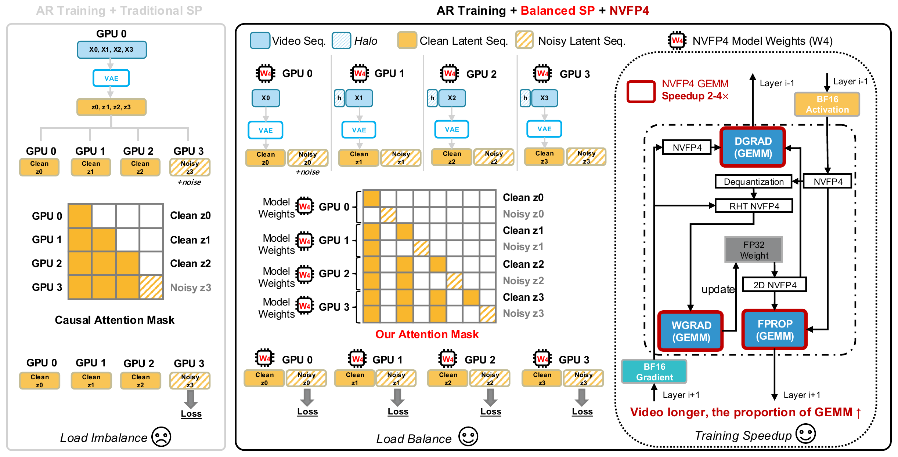
> 图 3：原论文 Figure 3，Balanced SP 复用同一时间分片到 VAE、DiT、注意力和 loss。
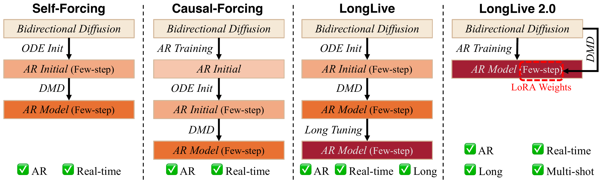
> 图 4：原论文 Figure 4，直接长视频 AR 微调并注入独立 LoRA，跳过复杂多阶段初始化。

### 4.2 组件级设计动机与具体问题映射
以下逐项说明设计选择解决的可观察问题、改变的状态、可能机制、替代方案及证据；表格是索引，不替代这些解释。Balanced SP 针对传统 SP 将 clean/noisy 切成不同 rank 的失衡，配对布局让每卡都有监督目标；NVFP4-aware training 针对 PTQ 的训推错配，在训练时暴露量化误差；KV 压缩针对长历史显存和通信，异步解码针对 VAE 造成的空转；双层 sink 针对单一锚点无法兼顾全局身份与镜头内连续性。前两项有受控或替换对照，halo 和 sink 的独立边际收益仍是部分验证。
**Balanced SP 的读者解释。** 传统 SP 把 clean/noisy 拼接后切片，可能让某个 rank 几乎没有带损失的 noisy token；Balanced SP 改为同一时间块配对，使每卡都承担相近监督量，代价是需要专门的 mask 和 halo。证据是 Figure 3 与 Table 1，属于直接对照。
**NVFP4-aware training 的读者解释。** 只在部署阶段做 PTQ 会让训练时的数值分布与推理不同；本文训练期间就使用 NVFP4 W4A4，使 GEMM 和量化误差与部署一致，代价是依赖 Blackwell 和专用 kernel。Figure 11/Table 7 支持质量边界，但没有完全拆出 kernel 贡献。
**KV 压缩、异步解码与双层 sink 的读者解释。** KV 压缩减少长历史的字节和跨卡通信，异步解码把 VAE 工作与下一次去噪重叠；双层 sink 同时保留全局身份和当前镜头锚点。Table 3/6 与 Figure 10 支持这些方向，但镜头切换检测和组合收益仍需更多受控实验。
| 设计项 | why 状态 | 具体问题 | 因果机制 | 权衡 | 验证 |
|---|---|---|---|---|---|
| clean/noisy 同 chunk 配对 | author-stated §2.1 | noisy loss 在 rank 间失衡 | 每 rank 获得近似相同 loss-bearing token | 需要自然 mask 和重排 | Table 1，supported |
| SP-aware chunked VAE + halo | author-stated §2.1 | VAE 在每 rank 重复编码 | 成本从 $O(F)$ 降为 $O(F/P+h)$ | halo 带来边界冗余 | 无单独消融，partially supported |
| NVFP4-aware training | author-stated §2.2 | PTQ 训练部署错配 | 训练时暴露量化误差并利用 W4A4 GEMM | 依赖 Blackwell/定制 kernel | Table 7/11，supported |
| KV NVFP4 + 并行反量化 | author-stated §3.1 | 长历史占显存、SP 通信大 | 低位宽存储并在 kernel 内反量化 | 量化误差、kernel 专用 | Table 3/6，supported |
| 异步流式解码 | author-stated §3.2 | VAE 解码造成 GPU 空转 | 解码与下一次去噪重叠 | 需要额外 GPU/流同步 | Table 3，supported |
| 双层 attention sink | author-stated §4.2 | 单 sink 无法兼顾全局和镜头一致性 | 全局锚点保身份，镜头锚点随 cut 重绑 | 需检测镜头切换 | Figure 10，partially supported |

### 4.3 关键公式
$$
z^{(p)}=[z^{(p)}_{clean},z^{(p)}_{noisy}]\in\mathbb{R}^{L/P\times H\times d}.
$$
<!-- 这条公式在算什么？描述每个 rank 的配对 token 张量形状。 -->
**这条公式在算什么？**描述每个 rank 的配对 token 张量形状。描述每个 rank 的配对 token 张量。
**怎么读？** 每个 rank 只保留总长度的 $1/P$，但同时包含 clean 与 noisy。
**输入与输出。** 输入是 $L,P,H,d$ 和两类 latent；输出是本地张量。
**变量在这里各做什么？** $L$ 是总 token 长度，$P$ 是并行组大小，$H$ 是注意力头数量，$d$ 是每个头的维度。
**直觉。** 增大 $P$ 降低单卡序列和显存，但必须保持时间块配对。
**边界。** 这是 patch embedding 后的 DiT 序列，不是原始像素；halo 不包含在该式的 $L$ 中。
**小例子。** 若 $L=4096,P=4$，每 rank 负责 1024 个 token，而不是只负责 clean 或 noisy 一侧。

$$
\mathcal K_{eff}(t)=\mathcal A_g\cup\mathcal A_s\cup KV[t-W,t).
$$
**这条公式在算什么？** 给出第 $t$ 个 chunk 的有效 key/value 集。
**怎么读？** 当前窗口之外只保留全局身份锚点和当前镜头锚点。
**输入与输出。** 输入是两类锚点和窗口 KV；输出是去重后的注意力键值集合。
**变量在这里各做什么？** $\mathcal A_g$ 永久固定，$\mathcal A_s$ 在镜头切换时重绑，$W$ 控制局部历史。
**直觉。** 用常数级锚点换取长程身份，同时把计算限制在滑窗。
**边界。** 只描述推理阶段；不应误读为训练 causal mask。
**小例子。** 窗口滚过第一个镜头后，仍读取全局前几帧和新镜头前几帧，而不读取全部旧 KV。

### 4.4 训练、实验与部署
训练以 16/32/64 秒视频比较 BF16、SP、Balanced SP、NVFP4；DMD 分支逐步量化 generator、real-score、fake-score。推理在 GB200 180GB 测试 BF16、NVFP4、NVFP4 KV、异步解码和 2/3 步去噪；非 Blackwell 的 SP 结果见 Appendix D。代码配置位于 `configs/train_ar.yaml`、`configs/inference.yaml`、`inference_sp.py`、`utils/nvfp4_kernel.py`（commit `7860ad9`）。

## 5. 关键结论与证据
### 5.1 主结果
Table 1：64 秒从 BF16+SP 的 1372.9 s/iter 降到 NVFP4+Balanced SP 的 639.5 s/iter，约 2.15×；16/32 秒为 1.3×/1.4×。Table 3：2 步、64 秒端到端 36.3 s，45.7 FPS，峰值总显存 19.4 GB。Table 4 在 720p、5B、2 步下吞吐 45.7 FPS；Table 5 的 60 秒 VBench-Long 平均排名 3.67，为比较组最佳。

#### Table 1：AR 训练迭代时间（秒）
| 视频长度 | BF16 无 SP | BF16+SP | BF16+Balanced SP | NVFP4+Balanced SP |
|---:|---:|---:|---:|---:|
| 16 s | 75.3 | 52.2 | 45.8 | 40.1 |
| 32 s | 202.7 | 162.7 | 136.8 | 119.3 |
| 64 s | OOM | 1372.9 | 1196.5 | 639.5 |

#### Table 2：DMD 逐步量化的峰值显存（每 GPU）
| Generator | Real-score | Fake-score | 峰值显存 | 相对 BF16 |
|---|---|---|---:|---:|
| BF16 | BF16 | BF16 | 70.5 GB | - |
| NVFP4 | BF16 | BF16 | 63.3 GB | 0.90× |
| NVFP4+LoRA | NVFP4 | BF16 | 57.2 GB | 0.81× |
| NVFP4+LoRA | NVFP4 | NVFP4+LoRA | 49.0 GB | 0.69× |

#### Table 3：GB200 端到端推理效率
| 设置 | FPS | 16 s 延迟/显存 | 32 s 延迟/显存 | 64 s 延迟/显存 |
|---|---:|---|---|---|
| BF16 | 24.8 | 26.6 s / 36.4 GB | 53.2 s / 36.4 GB | 112.9 s / 36.4 GB |
| NVFP4 | 32.0 | 22.9 s / 29.7 GB | 46.6 s / 29.7 GB | 96.0 s / 29.7 GB |
| + NVFP4 KV | 29.7 | 23.8 s / 19.4 GB | 48.9 s / 19.4 GB | 99.5 s / 19.4 GB |
| + 异步解码 | 29.7 | 15.9 s / 19.4 GB | 29.1 s / 19.4 GB | 57.6 s / 19.4 GB |
| 3 步 | 35.2 | 12.7 s / 19.4 GB | 23.2 s / 19.4 GB | 46.0 s / 19.4 GB |
| 2 步 | 45.7 | 11.2 s / 19.4 GB | 19.2 s / 19.4 GB | 36.3 s / 19.4 GB |

#### Table 4：VBench（完整决策字段）
| 模型 | 精度 | 步数 | 参数 | 分辨率 | FPS | Total | Quality | Semantic |
|---|---|---:|---:|---|---:|---:|---:|---:|
| Self-Forcing | BF16 | 4 | 1.3B | 832×480 | 21.2 | 84.31 | 85.07 | 81.28 |
| Causal-Forcing | BF16 | 4 | 1.3B | 832×480 | 21.0 | 84.04 | 84.59 | 81.84 |
| Rolling-Forcing | BF16 | 4 | 1.3B | 832×480 | 19.5 | 81.22 | 84.08 | 86.43 |
| LongLive-2.0 | NVFP4 | 2 | 5B | 1280×720 | 45.7 | 83.14 | 85.40 | 74.12 |

#### Table 5：VBench-Long（60 秒）
| 方法 | 平均排名↓ | 主体一致性↑ | 背景一致性↑ | 运动平滑↑ | 动态程度↑ | 美学质量↑ | 成像质量↑ |
|---|---:|---:|---:|---:|---:|---:|---:|
| NOVA | 8.50 | 77.50 | 88.06 | 98.94 | 12.00 | 47.53 | 44.97 |
| MAGI-1 | 6.67 | 79.46 | 87.76 | 99.26 | 56.00 | 52.10 | 54.54 |
| Causal-Forcing | 6.50 | 93.52 | 94.12 | 95.74 | 72.32 | 51.24 | 62.30 |
| SkyReels-V2 | 6.00 | 84.99 | 89.95 | 98.67 | 44.00 | 57.64 | 66.67 |
| Self-Forcing | 5.83 | 95.84 | 95.27 | 98.20 | 51.72 | 56.05 | 62.22 |
| CausVid | 5.33 | 86.75 | 89.85 | 98.47 | 52.00 | 62.88 | 67.47 |
| Rolling-Forcing | 4.50 | 94.09 | 94.47 | 98.65 | 36.00 | 63.50 | 72.42 |
| LongLive | 4.17 | 97.13 | 95.89 | 98.61 | 44.56 | 58.17 | 67.56 |
| LongLive-2.0 | 3.67 | 97.48 | 97.00 | 98.86 | 60.62 | 53.68 | 65.51 |
| LongLive-2.0 → NVFP4 | 3.83 | 97.62 | 96.97 | 98.94 | 45.88 | 53.72 | 66.24 |
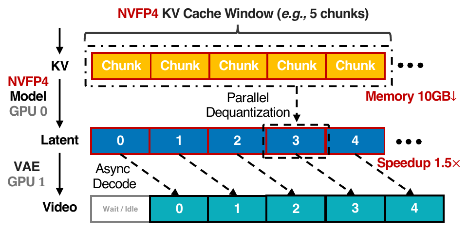
> 图 6：原论文 Figure 6，展示 NVFP4 W4A4、KV 压缩与推理路径。
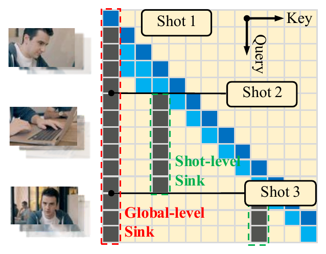
> 图 7：原论文 Figure 7，全局 sink 与镜头级 sink 的双锚点机制。

### 5.3 附录系统与机制证据
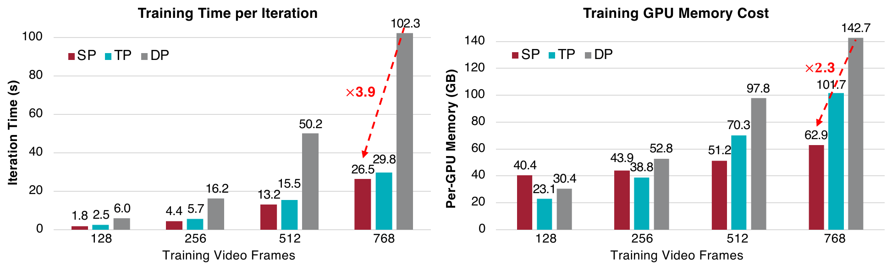
> 图 8：原论文 Figure 8，比较 SP、TP、DP 在交互式 AR 训练中的迭代速度和峰值显存。
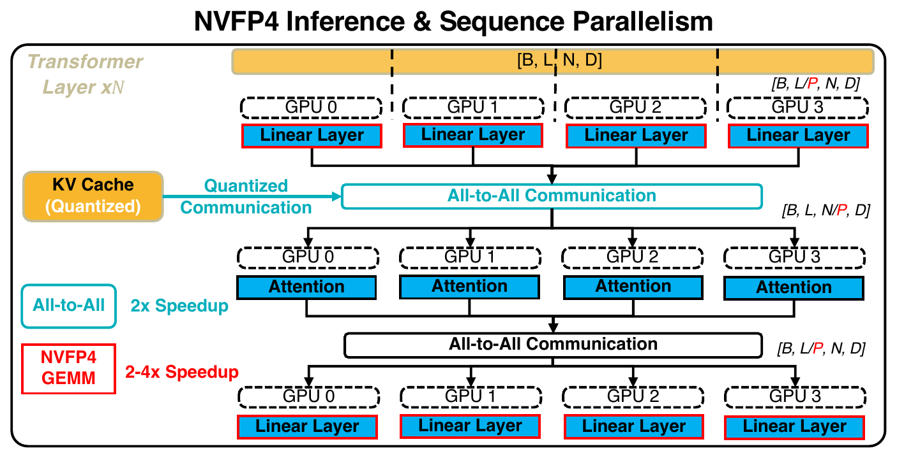
> 图 9：原论文 Figure 9，展示非 Blackwell GPU 上的 SP 推理和低位宽通信。

#### Table 6：H100 上 SP 推理延迟与通信时间
| SP 组大小 | KV 精度 | 16 s：E2E / 通信 | 32 s：E2E / 通信 | 64 s：E2E / 通信 |
|---:|---|---|---|---|
| 1 | BF16 | 31.0 s / - | 50.2 s / - | 85.0 s / - |
| 2 | BF16 | 19.3 s / 1.8 s | 38.1 s / 3.2 s | 62.5 s / 5.4 s |
| 2 | 4-bit KV | 18.3 s / 1.1 s | 36.0 s / 2.3 s | 53.3 s / 3.6 s |
| 4 | BF16 | 26.2 s / 12.8 s | 38.6 s / 12.2 s | 65.4 s / 20.6 s |
| 4 | 4-bit KV | 21.1 s / 7.8 s | 32.3 s / 9.7 s | 54.8 s / 16.4 s |
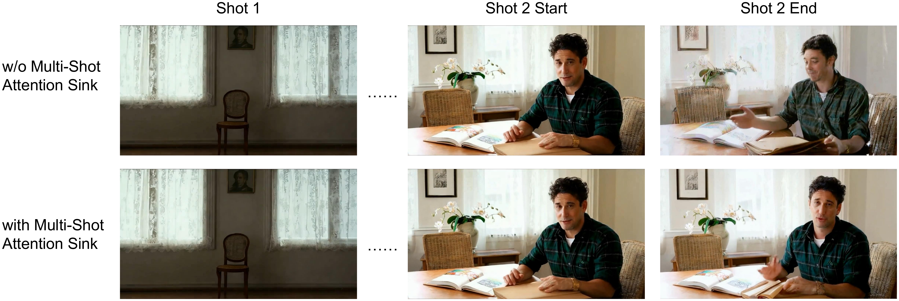
> 图 10：原论文 Figure 10，无双层 sink 时后续镜头漂移，加入后镜头外观更稳定。
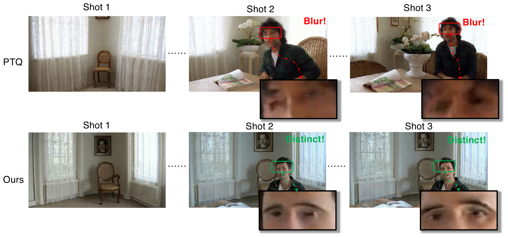
> 图 11：原论文 Figure 11，比较部署后量化与训练期 NVFP4；后者保留更清晰的面部细节。

#### Table 7：相同 5B、1280×720 配置下的精度消融
| 精度 | 量化方式 | 步数 | Total↑ | Quality↑ | Semantic↑ |
|---|---|---:|---:|---:|---:|
| BF16 | - | 4 | 85.06 | 86.67 | 78.63 |
| NVFP4 | PTQ | 4 | 84.04 | 85.76 | 77.15 |
| NVFP4 | 训练期预量化 | 4 | 84.51 | 86.43 | 76.81 |
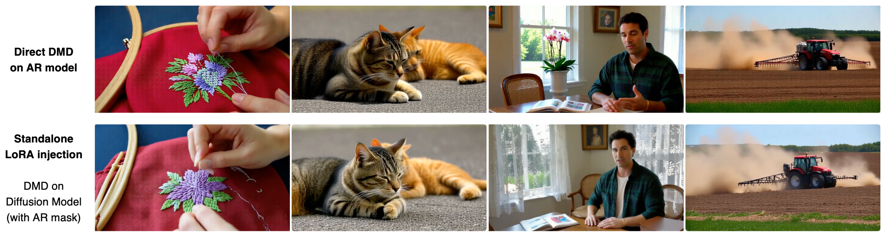
> 图 12：原论文 Figure 12，比较直接在 AR 模型上 DMD 与独立 LoRA 注入策略。

### 5.2 技术主张证据矩阵
| 技术点 | 直接证据 | 控制程度 | 判断 |
|---|---|---|---|
| Balanced SP 提速 | Table 1 BF16 SP vs Balanced SP | 同长度但布局改变，较直接 | supported |
| NVFP4 训练收益 | Table 1/7 | 与布局和 kernel 组合，非完全单因素 | partially supported |
| KV 压缩省显存 | Table 3、Appendix D Table 6 | progressive ablation | supported |
| 异步解码降 E2E | Table 3 | progressive ablation | supported |
| 双层 sink 保一致性 | Figure 10、Table 5 | 视觉消融但指标有限 | partially supported |
| PTQ 质量下降 | Figure 11、Table 7 | 同模型量化路径对比 | supported |

### 5.3 收益归因
训练收益主要由 Balanced SP 的负载/ VAE 分片和 NVFP4 GEMM 共同产生；64 秒的 2.15× 是组合收益，不应归因给单一模块。推理收益可较清晰分解为 NVFP4、KV 压缩（显存/通信）和异步解码（E2E 空转）；2 步 LoRA 还改变了算法工作量。论文没有把 kernel、通信和调度开销做完全正交的方差分解，以下归因应视为桥接式近似。

## 6. Related Work 对比
Self-Forcing/Causal-Forcing 依赖 ODE 初始化、DMD 和长调优，多阶段但能处理 AR 长视频；LongLive-2.0 以长视频直接微调换取更简单的训练流程。PTQ 方法部署便宜但存在训练-推理错配；本文用预训练 NVFP4 对齐数值路径。传统 SP 通用但 clean/noisy 与 loss 不平衡；Balanced SP 专门为 chunk-level AR 设计，牺牲通用性换取负载均衡。

## 7. 基础设施分析
- 计算：NVFP4 W4A4 减少 GEMM 访存和计算；收益随视频长度上升，因为 DiT GEMM 占比增加。
- 显存：DMD 峰值从 70.5 GB 降至 49.0 GB（0.69×）；推理 KV 后为 19.4 GB。
- 通信：SP 在 All-to-All 前将 Q/K/V 转为 NVFP4，论文报告通信量约降 3.6×（Appendix D）。
- 异构硬件：Blackwell 使用原生 NVFP4；H100 等非 Blackwell 采用 SP 推理，依赖跨 GPU 互联和低位宽 collective。
- 数据类型：训练/推理涉及 BF16、NVFP4 W4A4、FP32 scale、FP8 E4M3 block scale；梯度路径仍保留较高精度。
- 端到端指标：论文明确把 VAE 解码纳入 E2E latency；异步流式解码需要额外设备和 stream synchronization。

## 8. 局限与未解决问题
1. NVFP4 依赖 Blackwell 原生支持，其他 GPU 的 SP 路径不能等价代表单卡 NVFP4。
2. 公开代码可核对配置和 kernel 文件，但权重、训练数据、完整硬件拓扑和复现实验成本未给出。
3. 组合消融不足以严格分离 Balanced SP、NVFP4 kernel、通信和调度的边际贡献。
4. 双层 sink 对镜头切换检测错误、快速剪辑和跨镜头身份冲突的鲁棒性仍需更广泛测试。
5. 低位宽量化的质量边界主要由 VBench 及定性图覆盖，长尾提示词和真实交互分布仍未知。

## 9. 研究启发与待验证清单
- 能否建立同时包含 accepted quality、通信字节和 E2E latency 的统一长视频系统目标？
- 在相同硬件和 token 布局下，Balanced SP 与其他 SP/TP 方案的单因素比较是什么？
- NVFP4 KV 的量化误差是否随窗口、镜头数和运动强度系统变化？
- 异步解码在单 GPU、共享显存和多租户调度下的收益是否仍成立？

## 10. OpenReview 交叉核对
未发现公开 OpenReview 页面，因此没有可交叉核对的评审、meta-review 或 rebuttal；结论仅基于论文、源码和官方代码。
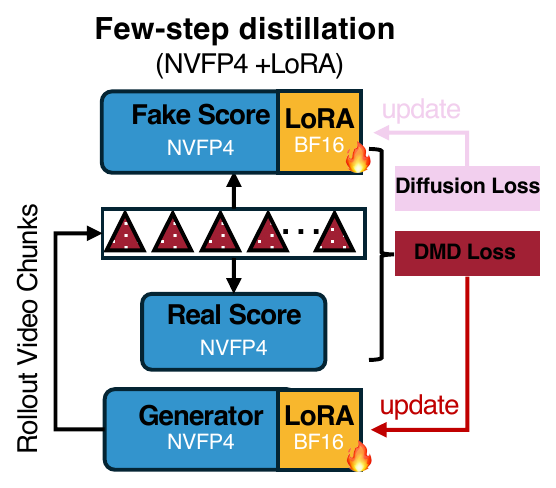
> 图 5：原论文 Figure 5，generator、real-score 和 fake-score 在低精度 NVFP4 下协同训练。
