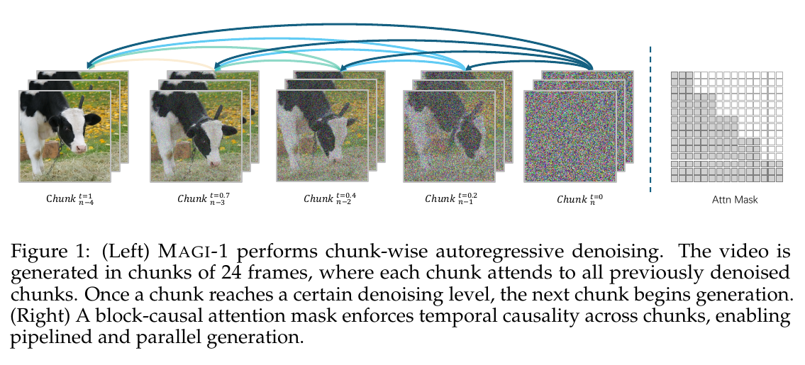
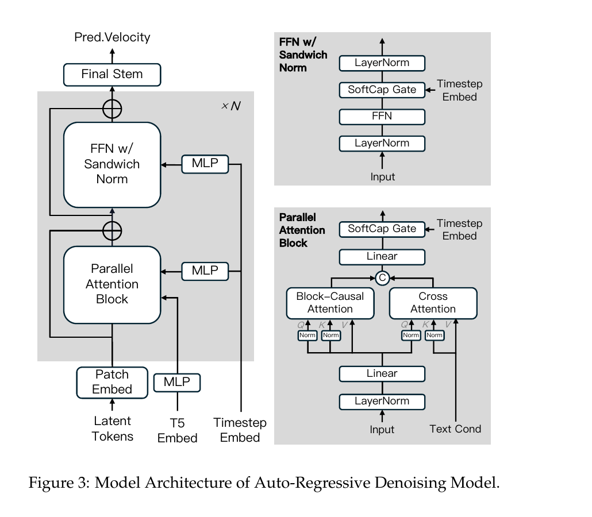
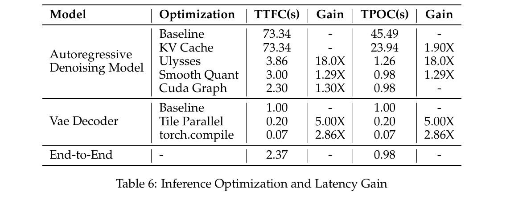
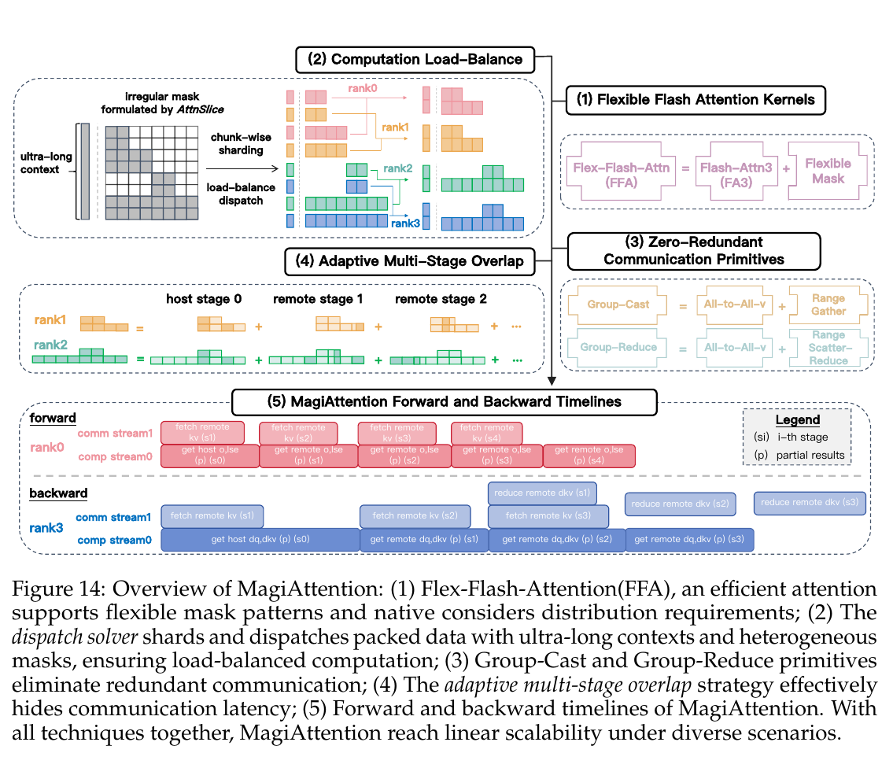

# MAGI-1: Autoregressive Video Generation at Scale 深度评审

> [!info] 文档关系
> - 文档类型：Paper
> - 领域入口：[README](../README.md)
> - 上位汇总：[Diffusion 模型多模态演进调研](../surveys/diffusion-evolution.md)
> - 证据资产：`../assets/papers/magi-1/`
> - 相关文档：[Figure inventory](../evidence/figure-inventory.md)

> 本报告评审 arXiv:2505.13211v1（2025-05-19）。论文是技术报告而非 ICML 2026 录用版本；论文 PDF、官方 HTML、官方推理代码与 MagiAttention 代码已交叉核验。作者事实、代码事实和本文推导分别标注。

## 修订信息

- 当前文档版本：`1.0.0`
- 当前修订 ID：`rev-magi-1-m3-initial`
- 当前修订时间：`2026-07-25T21:45:00+08:00`
- 替代版本：无，首次交付

| 修订 ID | 版本 | 时间 | 修订者 | 类型 | 替代修订 | 摘要 | 对结论影响 |
|---|---|---|---|---|---|---|---|
| `rev-magi-1-m3-initial` | `1.0.0` | 2026-07-25T21:45:00+08:00 | `paper-deep-review agent` | initial | 无 | 从官方 PDF、代码和视觉材料重建完整审阅，补齐论文级问题—方案闭环、证据矩阵与发布验证 | material |

## 0. 资料与证据索引

| 项目 | 核验结果 |
|---|---|
| 论文 | [arXiv:2505.13211](https://arxiv.org/abs/2505.13211)，v1 PDF 共 61 页，SHA-256 `aa0697368aa6e109788c55c1f5bff23427bea1525f15048c3e83d385f5056406` |
| 官方代码 | [SandAI-org/MAGI-1](https://github.com/SandAI-org/MAGI-1)，commit `0fcefdef8ce2df37a3b8890979433c06eb003328`；[SandAI-org/MagiAttention](https://github.com/SandAI-org/MagiAttention)，commit `d3eb7fd2b4358510ff46fa039fdcc7b2475589f7` |
| 开放范围 | MAGI-1 仓库覆盖模型配置与推理；未开放完整训练数据、训练代码和生产调度栈 |
| OpenReview | 未发现该技术报告的公开 forum、评审、decision 或 rebuttal；不适用评审交叉核验 |
| 原论文视觉 | Figure 1、Figure 3、Figure 14、Table 6；均保留完整 caption、单一编号对象并通过原分辨率 QA |
| 视觉证据边界 | 保留原论文 Figure 1、Figure 3、Figure 14 与 Table 6；未用生成图替代论文机制或系统结果证据 |

## 0.1 术语与符号

### 术语表

| 术语 | 本文含义 | 别名 | 不等于/易混项 | 来源 |
|---|---|---|---|---|
| Chunkwise-AR | 将视频按固定时间块自回归展开；块内同时做 diffusion/flow 去噪，块间使用 block-causal 条件 | chunk-wise autoregressive denoising | 不是逐帧 next-token AR | Section 2，Figure 1 |
| Denoising window | 同时处于不同噪声阶段并流水去噪的 chunk 数 | `window_size` | 不等于总视频 chunk 数，也不等于 KV 历史范围 | Figure 1；官方配置 |
| Clean/context chunk | 已完成去噪、作为后续块条件和 KV 历史的 chunk | previous denoised chunk | Figure 1 中最左 `t=0` 块不属于 4 个活跃去噪块 | Figure 1；推理代码 |
| ARDF | autoregressive denoising with flow matching 的视频 DiT | Auto-Regressive Denoising Model | 不是离散视频 tokenizer 的 next-token model | Sections 2-3 |
| PnP | 把变长、变分辨率样本在线装箱到固定 token 容量 | Patch-and-Pack | 4M token 是装箱上限，不是默认单条视频长度 | Section 5.2 |
| TPOC | 生成首块后，每个后续 1 秒 chunk 的时间 | time per output chunk | 不等于 TTFC | Section 6.1，Table 6 |
| TTFC | 首个可播放视频 chunk 到达的时间 | time to first chunk | 包含冷启动/首块路径，通常高于 TPOC | Section 6.1，Table 6 |
| KV range | 一个 query chunk 能回看多少个先前 chunk | history window | 不等于并发去噪 window；论文 serving 的 range 5 是 5 秒历史 | Sections 2.3, 6.1 |
| MagiAttention | 面向变长、异构 block mask 的分布式 FlashAttention3 路径 | FFA + dispatch + group collectives + overlap | 不只是一个 attention kernel，还包含调度和通信机制 | Section 5.3，Figure 14 |

### 符号表

| 符号 | 含义 | 性质 | 作用域 | 单位/取值 | 来源 | 易混点 |
|---|---|---|---|---|---|---|
| $x_i^0$ | 第 $i$ 个 chunk 的干净 latent | author-defined | per chunk | latent tensor | Section 2.2 | 上标 0 表示 clean endpoint |
| $x_i^1$ | 第 $i$ 个 chunk 的高斯噪声 latent | author-defined | per chunk | latent tensor | Section 2.2 | 上标 1 表示 noise endpoint |
| $x_i^t$ | flow 时间 $t$ 的插值 latent | author-defined | per chunk/step | $t\in[0,1]$ | Section 2.2 | 论文约定 $t=0$ clean、$t=1$ noise |
| $v_i^*$ | flow-matching 目标速度 $x_i^1-x_i^0$ | author-defined | per chunk/step | latent velocity | Section 2.2 | 不是 epsilon prediction |
| $C$ | 一个 chunk 的 latent frame 数 | code-defined | per request | 默认 6 | runtime `chunk_width` | raw frame 数为 $4C$ |
| $r_t,r_s$ | VAE 时间、空间压缩率 | analysis-derived | global | 4、8 | Section 3.1；代码 | 不含 DiT patch size |
| $p_t,p_s$ | DiT 时间、空间 patch size | code-defined | global | 1、2 | 24B/4.5B config | raw 时空覆盖需再乘 VAE 压缩率 |
| $H,W$ | 输出 raw video 高、宽 | analysis-derived | per request | pixel | runtime config | portrait/landscape 对 token 乘积无影响 |
| $N_c$ | 每个 chunk 的视觉 DiT token 数 | analysis-derived | per chunk | tokens | 本文核算 | 不含 text tokens、padding、CFG 副本 |
| $K$ | 总生成 chunk 数 | analysis-derived | per clip | chunks | 本文核算 | 有 prefix 时需单独处理 clean chunk |
| $S$ | sampling/shortcut steps | author/code-defined | per request | 8/16/32/64 | Section 2.5；config | 不等于 chunk 数 |

## 1. 论文定位与结论先行

MAGI-1 的核心不是“用 AR 取代 diffusion”，而是把视频 flow denoising 改造成可流水的 chunk 级自回归过程：每个 chunk 内仍是连续 latent 去噪，chunk 间用 block-causal attention 和 KV cache 维持单向时间因果。作者给出 4.5B/24B 模型、最高 4M-token 训练上下文、MagiAttention 分布式路径，以及 24 张 H100/H800 上 480p、24fps、每秒视频块低于 1 秒的 serving 结果。

最强证据来自机制图、公开推理代码和 Table 6 的逐级 latency；最弱部分是算法归因。质量 benchmark、数据规模、模型规模、训练 curriculum、AR 因果性与系统优化同时变化，论文没有用大规模 matched ablation 分离每个组件对最终质量的贡献。

## 2. 研究动机与问题—方案闭环

### 2.1 出发点与背景痛点

作者明确把长视频生成中的两个矛盾作为出发点：全局双向 video diffusion/flow 模型能在整段序列上交换信息，却必须等待整段去噪完成，序列越长，注意力、激活与重复历史计算越昂贵；逐 token 或逐帧自回归虽然天然流式，却牺牲了 chunk 内并行去噪能力（Introduction、Section 2、Figure 1，`author-stated`）。实际目标并非只生成固定短 clip，而是让 24 fps 视频按一秒单位持续产生，并使已完成历史可复用。

系统侧痛点同样明确：超长、变长、异构 mask 的 packed attention 会造成 rank 间负载不均和通信暴露；若每个新 chunk 都重算全部历史，稳态延迟随历史增长，无法达到实时播放（Sections 5.2、5.3、6.1，Figure 14、Table 6，`author-stated`）。

### 2.2 现有方案为何不够

全局 bidirectional video DiT 的失败模式是“整段完成后才能交付”以及长上下文计算/显存扩张；简单把视频切段又会丢失跨段时间条件。逐 token AR 的失败模式则是把空间视频 token 串行化，不能利用连续 latent flow 在块内并行更新。训练时若始终使用完美 clean history，推理时自身生成历史的误差还会造成 exposure bias（Section 2.4，`author-stated`）。

根约束是必须同时保持三种性质：块间时间因果、块内并行去噪、历史计算可缓存；并且分布式 runtime 要处理 block mask 和变长 packed 序列。论文证明了这些机制可以共存，但没有同规模、同数据的全局 DiT 对照来隔离其质量收益，因此“AR 因果性导致 Physics-IQ 提升”只能视为相关性推断。

### 2.3 论文计划解决的问题与成功标准

- 核心问题：把连续 latent 视频生成重写为可流式、可缓存的 chunk-autoregressive flow denoising。
- 场景与约束：24 fps 长视频；每个 chunk 24 raw frames；块内保留并行去噪；块间只依赖已经完成或较早的 chunk。
- 成功标准一：公开机制与代码确实实现 block-causal chunk pipeline，并能逐秒输出（Figure 1；官方推理代码）。
- 成功标准二：历史 KV 复用和分布式并行显著降低 TTFC/TPOC，最终 480p TPOC 不超过一秒（Table 6）。
- 成功标准三：在长上下文训练中维持高 packing 利用率与可扩展 attention（Sections 5.2–5.3）。
- 明确不解决：论文没有充分隔离数据、规模、curriculum 与 AR 结构各自对视频质量/物理能力的因果贡献，也没有公开完整训练和生产 scheduler。

### 2.4 核心方案如何解决并优化问题

| 原始问题/失败模式 | 根因或约束 | 对应方案设计 | 改变的变量/系统行为 | 作用机制 | 预期优化及指标 | 证据来源 | 判断 |
|---|---|---|---|---|---|---|---|
| 整段视频完成前无法播放 | 全局双向去噪依赖未来位置 | 24-frame chunkwise-AR | 输出粒度变为一秒 chunk | 完成一个 chunk 即可交付，并启动后续块 | 流式输出、TTFC/TPOC | Figure 1；Section 6.1 | supported |
| 新块重复计算全部历史 | 历史条件未缓存 | block-causal attention + finite-range KV cache | 历史 K/V 从重算变为复用，回看范围受限 | 稳态每块只计算活动窗口和有限历史 | Table 6 TPOC 45.49→23.94 s | Sections 2.3、6.1；Table 6 | supported |
| 块内若完全串行则吞吐低 | 视频空间 token 数巨大 | 块内 flow denoising + staggered denoising window | 多个块处于不同 flow 时间且块内 token 并行 | 保留连续生成质量并形成 pipeline | 并行度、每秒块延迟 | Figure 1；Section 2 | partially-supported |
| 变长 packed block mask 导致负载和通信问题 | rank 工作量不均、collective 冗余 | PnP + MagiAttention | dispatch、collective 和 overlap 策略改变 | 平衡异构 attention 负载并隐藏通信 | scaling、通信暴露、训练利用率 | Sections 5.2–5.3；Figure 14 | partially-supported |
| 推理历史含模型误差 | clean-context train/inference mismatch | noisy clean-context injection | 训练 context 加最多 5% 噪声 | 提升对累积历史误差的容忍 | 长时稳定性 | Section 2.4 | plausible；无移除消融 |

### 2.5 完整因果链与证据闭环

完整链条是：长视频需要边生成边播放且不能随历史无限重算；全局 bidirectional 去噪无法逐块交付，逐 token AR 又过度串行；因此论文把视频 latent 分成一秒 chunk，在 chunk 内保留 flow denoising，在 chunk 间施加 block-causal mask，并把已完成 chunk 的 KV 缓存为有限历史。该变化使输出单位、条件依赖和历史计算行为同时改变，预期改善流式可用性、稳态延迟与长序列可扩展性。Figure 1 与官方代码直接验证了 chunk/mask/runtime 语义，Table 6 的增量行直接验证 KV cache、Ulysses、SmoothQuant 和 CUDA Graph 对延迟路径的累计作用，Figure 14 与系统报告支持分布式 attention 的 bundle 效果。

证据闭环只达到 `partially-supported`：流式机制和 latency 因果链有直接/桥接证据；训练 attention 的各子机制被捆绑，缺单项消融；质量与物理一致性结果同时受模型规模、数据、训练 curriculum、metric 和 AR 结构影响，不能由现有实验证明是 chunkwise causality 单独导致。公开材料还缺完整训练数据、训练代码、集群成本、生产 scheduler 和量化质量 telemetry，因此结论边界应限定为“系统方案可行且在报告硬件上达到实时稳态”，而不是“已证明该结构普遍提升视频质量”。

## 3. Chunkwise-AR 参数核算

### 3.1 直接答案

| 场景 | 总 raw 帧 | 输出分辨率 | 总生成 chunk | 每 chunk raw 帧 | 每 chunk 时长 | 每 chunk 视觉 token | 总视觉 token |
|---|---:|---:|---:|---:|---:|---:|---:|
| 24B 官方默认配置 | 96 | 720x1280 | 4 | 24 | 1 秒 | 21,600 | 86,400 |
| 4.5B 官方默认配置 | 96 | 720x720 | 4 | 24 | 1 秒 | 12,150 | 48,600 |
| 论文实时 serving | 按流式长度增长 | 480x640（3:4） | 每秒增加 1 | 24 | 1 秒 | 7,200 | $7,200K$ |
| 论文 720p、16 秒示例 | 384 | 720x1280 | 16 | 24 | 1 秒 | 21,600 | 345,600 |

结论：论文与代码共同给出 **每个 chunk 24 帧、24fps 下 1 秒**。Figure 1 画了 5 个彩色块，其中最左是已完成的 `t=0` clean/context chunk，右侧 4 个才是处于不同噪声阶段的活跃去噪窗口；因此正确表述是 **最多 4 个 chunk 并行/流水去噪，图中同时展示 1 个 clean 上下文 + 4 个活跃 chunk**，而不是“同时生成 5 个 chunk”。官方默认 96 帧 clip 恰好含 4 个生成 chunk。

### 3.2 Token 公式与代码交叉核验

VAE 把 raw video 在时间上压缩 4 倍、空间上压缩 8 倍；DiT 再用 $p_t=1,p_s=2$ 划 patch。默认 `chunk_width=6` 表示 6 个 latent frames，所以：

$$
F_{\text{raw/chunk}}=C r_t=6\times4=24,
$$

$$
N_c=\frac{C}{p_t}\frac{H}{r_sp_s}\frac{W}{r_sp_s}
=6\frac{H}{16}\frac{W}{16}.
$$

24B 默认 720x1280：$6\times45\times80=21,600$；4.5B 默认 720x720：$6\times45\times45=12,150$；480x640：$6\times30\times40=7,200$。代码在 `video_generate.py` 中先按 `ceil((num_frames/4)/chunk_width)` 算 chunk 数，再按 `chunk_width*(latent_h/patch_size)*(latent_w/patch_size)` 算 chunk token，和上述推导一致。

一个 DiT visual token 覆盖的 raw 时空体积是 $4\times16\times16$，即 **4 帧、16x16 pixels**。这里的 token 数只计视觉序列，不含文本 token、padding、CFG 的多分支 batch 或 KV 历史重复读取。

### 3.3 “几百 token”与 4M token 怎么理解

论文称第一块“only a few hundred tokens”，而单条 480p chunk 是 7,200 tokens；二者表面矛盾。论文实时路径使用 24-way context parallel，若均匀切分，$7,200/24=300$ tokens/GPU，正好是“几百”。这是基于系统配置的合理推断，但原文没有明确写“per GPU”，不能提升为作者明确事实。

4M token 是 PnP 训练的最大 packed context capacity。一个 pack 会混合多条不同长度、不同分辨率样本，因此不能唯一换算成“一个视频有多少 chunk”。仅作量纲参考，$4,000,000/21,600\approx185.2$ 个 720p chunk，但这不是论文标准单视频设置；忽略文本和 padding 时，约相当于 11.6 条 720p、16 秒样本。

### 3.4 三个容易混淆的窗口

| 参数 | 含义 | 本文/代码设置 |
|---|---|---|
| `window_size` | 同时处于流水 denoising 的 chunk 数 | 官方默认 4 |
| 总 chunk 数 $K$ | clip 被切成多少个 1 秒单元 | 96 帧为 4；16 秒为 16 |
| KV range | query 回看的历史 chunk 数 | serving 报告为 5；默认代码随噪声阶段为 `[5,4,3,2]`，clean range 为 1 |

## 4. 研究方法

### 4.1 方法总览

全局双向 video DiT 每一步都重算整段长视频 -> 长度、分辨率和 sampling steps 相乘导致延迟/显存失控 -> 以 1 秒 chunk 建立 block-causal flow denoising -> 用错位噪声 schedule 同时推进 4 个 chunk -> 已完成 chunk 写入 KV cache，有限 KV range 让稳态每块成本有界 -> shortcut distillation 和系统并行把 TPOC 压到实时阈值。

### 4.2 组件级设计动机与具体问题映射

| 设计 | why 状态 | 具体问题 | 因果机制 | 替代/权衡 | 验证证据 | 判断 |
|---|---|---|---|---|---|---|
| 24-frame chunkwise-AR | author-stated | 全视频联合去噪不可流式，长序列成本高 | 块间单向、块内并行；完成一块即可播放并缓存 | 全局双向 DiT 可用未来上下文，可能更一致 | Figure 1、代码、latency；缺 matched quality ablation | mechanism supported，质量归因未验证 |
| monotonic staggered noise schedule | author-stated | 逐块串行会浪费并行算力 | 早块更干净、后块更嘈杂，使多个 chunk 同时推进 | 同噪声级并行实现简单但不满足 AR 顺序 | Figure 1/Section 2，推理代码 | supported by implementation |
| block-causal attention + finite KV | author-stated | 保持时间因果并控制历史成本 | 当前块只读自身与已去噪前块；有限 range 使稳态 cache 有界 | 全历史质量潜力更高但成本随时长增加 | mask 图、KV cache latency、代码 | partially supported |
| 5% noisy clean-context injection | author-stated | 训练看 clean history、推理看有误差 history 的 exposure bias | 轻微扰动条件块，增强对累积误差鲁棒性 | self-forcing 更贴近推理但训练昂贵 | Section 2.4，无独立消融 | plausible/unverified |
| shortcut distillation | author-stated | 64-step flow sampling 太慢 | 联合条件化 step budget，支持 64/32/16/8 步 | consistency/trajectory distillation 等 | 速度与质量表，但多项改动共变 | partially supported |
| PnP online packing | author-stated | 变长、变分辨率样本造成 padding 浪费 | 把样本装入固定 token capacity，报告 99% capacity utilization | bucketing 简单但碎片更多 | Section 5.2 系统指标 | supported as utilization claim |
| MagiAttention | author-stated | 4M-token、异构 mask 下普通 CP 负载与通信不均 | FFA、dispatch solver、group collectives、adaptive overlap | Ulysses/Ring 更通用、实现成本低 | Figure 14 与 scaling 实验；独立组件消融有限 | partially supported |
| W8A8/FP8 SmoothQuant | author-stated | 24B linear 层计算与 HBM 压力 | 除首尾层外量化权重/激活，利用 H100/H800 tensor cores | INT8 更普适但论文观察到 artifact | Table 6 +30% speed，质量校准说明有限 | serving speed supported，质量边界不充分 |

### 4.3 ARDF 架构

模型使用 Transformer VAE（614M）把视频压到 8x spatial、4x temporal latent。4.5B/24B video DiT 使用 block-causal self-attention；self-attention 与 text cross-attention 并联，共用一次 query projection 和一次 tensor-parallel communication；FFN 使用 sandwich normalization，24B 使用 SwiGLU，并加入 QK norm、GQA 和 Softcap modulation。并联 attention 的系统动机明确，但论文缺少仅替换串/并联结构的 matched latency-quality ablation。

### 4.4 Flow matching 与 guidance

$$
x_i^t=(1-t)x_i^0+t x_i^1,\qquad v_i^*=x_i^1-x_i^0,
$$

$$
\mathcal L=\mathbb E_{i,t}\left\|v_\theta(x_i^t,t,c)-v_i^*\right\|_2^2.
$$

块间通过 block-causal context $c$ 条件化。基础 guidance 对 previous chunk 与 text 分别使用 1.5 和 7.5；当 $t>0.3$ 时降到 1 和 0。distilled 最后阶段 previous-chunk weight 报告为 0.7。它们是配方事实，不是经完整 sensitivity study 证明的全局最优值。

### 4.5 训练 curriculum

4.5B 依次训练 360p、480p、720p，最大时长从 8 秒扩到 16 秒；24B 从 256p 起步。image:video sampling ratio 报告为 4:1，AR caption 比例逐阶段为 0%、10%、10%。最大训练上下文为 4M packed tokens。论文未披露完整数据量、来源比例、训练 FLOPs、集群规模或 wall-clock，因此无法复算 scaling efficiency、数据污染风险和总成本。

## 5. 结果与证据边界

### 5.1 质量结果

- VBench I2V 中，VAE 2x decoder 的 Quality 为 82.44、I2V score 为 96.12；1x 为 81.67/96.08。结果有竞争力但并非所有子指标最优，尤其 visual quality 仍有差距。
- Physics-IQ 上，MAGI-1 V2V 为 56.02，VideoPoet 为 29.50；MAGI-1 I2V 为 30.23。作者将优势联系到 autoregressive causality，但模型规模、数据、训练目标和系统设置都不同，这只能算相关性，不是“AR 导致物理能力”的受控证明。
- in-house human evaluation 使用私有 prompt/流程并按 native resolution 比较，缺少完整 annotator agreement、盲评和统一分辨率细节，不能独立复核。

### 5.2 技术点证据矩阵

| 技术点 | 声称收益 | 证据 | 对照性 | 结论 |
|---|---|---|---|---|
| chunkwise-AR | 长视频、流式、因果生成 | Figure 1、代码、端到端 serving | 无同规模全局 DiT matched quality/control | 系统机制直接，质量贡献 confounded |
| block-causal KV cache | 避免重复历史计算 | Table 6 baseline TPOC 45.49 -> 23.94 s | 同一 serving pipeline 的增量优化 | latency supported |
| Ulysses/context parallel | 分布式长序列 | TPOC 23.94 -> 1.26 s | 同时跨 24 GPU，硬件/并行度发生根本变化 | 系统收益直接，不能当算法收益 |
| SmoothQuant | 降 transformer latency | TPOC 1.26 -> 0.98 s | 接近增量对照 | speed supported；quality telemetry 不足 |
| CUDA Graph | 降 launch overhead | TTFC 3.00 -> 2.30 s，TPOC 仍 0.98 s | 同表增量 | 主要改善首块，supported |
| Transformer VAE | 快速高质量 decode | 25 帧 256x256、H800 上 avg 12.28 ms | codec/实现/硬件不完全统一 | replacement baseline，外推到 720p streaming 有限 |
| exposure-bias noise | 长期稳定 | 配方描述 | 无移除实验 | unverified |
| MagiAttention 各子机制 | 线性扩展、隐藏通信 | scaling/Figure 14 | 多子机制捆绑 | bundle supported，component attribution weak |

### 5.3 Serving 收益归因

| 累积配置 | TTFC | TPOC | 相比上一行的主要路径 |
|---|---:|---:|---|
| AR model baseline | 73.34 s | 45.49 s | 未优化基线 |
| + KV cache | 73.34 s | 23.94 s | 复用 clean history，TPOC -47.4% |
| + Ulysses | 3.86 s | 1.26 s | 24-way context parallel，是最大降幅 |
| + SmoothQuant | 3.00 s | 0.98 s | W8A8/FP8 linear 加速，TPOC -22.2% |
| + CUDA Graph | 2.30 s | 0.98 s | 主要减少 TTFC/launch overhead |

VAE decode 从约 1 秒经 tiling 降到 0.2 秒，再经 compile 降到 0.07 秒；最终端到端 TTFC 2.37 秒、TPOC 0.98 秒。该表是累积桥接 baseline，可用于粗分解 latency，但不是统计方差分解；尤其 Ulysses 行改变了分布式执行形态。

## 6. MagiAttention 与 Infrastructure

### 6.1 算力与并行

作者估算实时生成每 1 秒视频约需 9 PFLOPS/s，并用 3 节点、24 张 H100/H800 达到 480p、3:4、16 steps、KV range 5 下 TPOC < 1 秒。官方 24B 默认推理配置为 bf16、CP=8、KV offload 开启；论文生产结果则是 24-way 路径，不能把开源默认配置当作生产配置的完整复现。

4M token attention 即使 FlashAttention 不 materialize $N^2$ matrix，full attention 算术量仍是 $O(N^2d)$。MagiAttention 用支持异构 block mask 的 FFA、packed dispatch、Group-Cast/Group-Reduce 和多阶段 overlap 解决分布式负载/通信，不改变 full attention 的理论二次复杂度。“linear scalability”指在测试并行区间内的 wall-time scaling，不代表算法随 token 数线性。

### 6.2 数据类型

| 对象 | 格式 | 阶段 | 硬件依赖 | 影响 | 证据 |
|---|---|---|---|---|---|
| 模型参数/activation | bf16 | 默认开源推理 | CUDA tensor cores | 质量保守、带宽为 fp32 一半 | 24B/4.5B config |
| Linear 权重/activation | W8A8 FP8 SmoothQuant | 实时 serving | H100/H800 FP8 | transformer 约 +30%，TPOC 1.26->0.98 s | Section 6.1，Table 6 |
| 首尾敏感层 | 高精度保留 | serving | GPU | 控制量化误差 | Section 6.1 |
| KV cache | bf16，支持 CPU offload | 开源推理/4090 | PCIe + host DRAM | 降显存，但引入传输和同步 | config/README |
| attention accumulation/layout | FlashAttention3 路径 | train | Hopper-oriented kernel | 减少 HBM materialization | MagiAttention code/paper |

SmoothQuant calibration 使用 alpha 0.45、30% I2V 样本；论文称 INT8 产生明显 artifacts。这里暴露出硬件依赖：FP8 加速不能直接外推到不具备相同 tensor-core/kernel 的 GPU/NPU。

### 6.3 带宽与通信

对每层、每个 rank 的搬运量，定义：

$$
BW_{eff}=\frac{BytesMoved}{Runtime},\qquad U=\frac{BW_{eff}}{BW_{peak}}.
$$

论文只报告 unoverlapped communication <3%，未给每次 collective bytes、链路峰值或 trace，因此不能数值复算 $BW_{eff}$ 和 $U$。MagiAttention 的 group cast/reduce 消除冗余通信，dispatch solver 平衡不同 mask/sequence 长度，adaptive overlap 将通信藏到 attention compute 后；“<3%”应理解为暴露在关键路径上的通信占比，而不是网络带宽利用率。

RTX 4090 部署中，4.5B 用单卡、24B 用 8 卡，结合 pipeline parallel、context parallel、CPU KV offload 与 chunk-sequence overlap。PCIe 相比 NVLink 更容易使 host-device KV 搬运成为瓶颈，CSO 的作用是用相邻 chunk 计算覆盖搬运。论文报告峰值 19.07/19.29 GB，24B MFU 66%；这些是特定 4090 软件栈和 shape 下的结果。

### 6.4 CPU/GPU 异构与 serving

| 阶段 | CPU | GPU | 数据移动/overlap | 风险 |
|---|---|---|---|---|
| prompt/输入 | tokenization、I/O、调度 | T5/video encode | host->device | production batching 未开源 |
| ARDF sampling | runtime coordination | 24B DiT、CP/PP、KV attention | GPU collectives | mask 不均衡、collective tail |
| KV offload | host DRAM 保存历史 cache | 按 chunk 取回 KV | PCIe async + CSO | PCIe 带宽和 pinned memory 压力 |
| decode/输出 | 封装与流式发送 | tiled/compiled VAE | device->host/output | TTFC 受首块 decode 影响 |

未发现 NPU 实现或 fallback。公开代码能复现模型级推理，但不含论文所述 24-GPU生产 scheduler、continuous batching、admission control、故障恢复和 telemetry。

## 7. 官方代码对照

| 论文机制/数值 | 官方代码位置（commit `0fcefdef...`） | 判断 |
|---|---|---|
| 24B：48 层、6144 hidden、48 heads、8 query groups | `example/24B/24B_base_config.json` | 一致 |
| 4.5B：34 层、3072 hidden、24 heads | `example/4.5B/4.5B_base_config.json` | 一致 |
| 96 frames、24fps、chunk width 6、temporal factor 4 | 两个 base config `runtime_config` | 一致，4 chunks x 24 raw frames |
| 24B 720x1280、patch 2、CP=8、bf16 | 24B base config | 一致；这不是论文 24-GPU serving 完整配置 |
| chunk 数和 latent shape | `inference/pipeline/video_generate.py:91-123` | 一致 |
| chunk token 数 | `inference/pipeline/video_generate.py:360-369` | 一致，直接支撑本文 token 公式 |
| stage-dependent KV range | base config `[5,4,3,2]` / clean 1 | 比论文“range 5”更细；需按阶段理解 |
| MagiAttention kernel/dispatch/collective | MagiAttention commit `d3eb7fd...` | 仓库存在并与 Figure 14 结构对应；训练集成细节未完整审计 |

官方 checkpoint 链接存在，但本次未下载数十 GB 权重并逐 tensor 审计；参数量与结构以论文、config 和 README 交叉确认，checkpoint metadata 标为未独立验证。

## 8. Related Work

| 路线 | 机制 | 优点 | 局限 | 与 MAGI-1 的关系 |
|---|---|---|---|---|
| 全局双向 video DiT | 整段 latent 在每步联合去噪 | 全局时空一致性强 | 不能天然流式，长视频重算昂贵 | MAGI-1 用块间因果换 streaming/KV reuse |
| Diffusion Forcing/FVDM | 序列位置可处于不同噪声时间 | 统一预测/生成、支持因果条件 | schedule 与长期误差传播复杂 | MAGI-1 属于面向规模和 serving 的 chunk 化实现 |
| CausVid/causal diffusion distillation | teacher/student 或少步因果生成 | 低延迟 | 训练/蒸馏稳定性与质量归因困难 | 同为 causal video generation，相比时需匹配数据和步数 |
| 离散 AR video token | 逐 token next-token prediction | 复用 LLM decode/KV infra | 空间 token 串行、codec 误差 | MAGI-1 是 chunk 内连续去噪，不是逐 token AR |

## 9. OpenReview 核验

截至 2026-07-21，按准确标题和 arXiv ID 未发现 MAGI-1 的公开 OpenReview forum；搜索命中仅是其他投稿在参考文献中引用该报告。因此公开 review、decision、rebuttal 和 discussion 均不适用，不能借 reviewer 观点补强或削弱论文结论。

## 10. 优点、局限与最小补实验

优点：chunk/frame/token 语义在论文与代码间高度一致；流式 latency 有逐级表格；训练、推理、分布式 attention 和消费级部署形成了较完整系统叙事；原始 Figure 1 清楚揭示“clean context + 4 active chunks”。

局限：

1. 论文是 technical report，未发现公开同行评审。
2. 训练源码、完整数据、训练集群和成本未开放；4M context 与 99% packing utilization 无法端到端复现。
3. source archive 下载不完整，但完整 PDF、官方 HTML 和两个官方代码仓库足以支持本文主要结论。
4. 关键算法组件缺同规模 matched ablation；Physics-IQ 优势不能单独归因于 causal AR。
5. 私有人评、native-resolution 比较和量化质量评价披露不足。
6. “few hundred tokens”没有明确口径；本文的 300 tokens/GPU 是推断。
7. 开源代码主要是推理实现，不是论文完整训练和 production serving stack。
8. 4M token 是 packed capacity，不能解释为单条默认视频 token 数。

最小补实验：固定 24B/data/steps 比较 global-bidirectional 与 chunkwise causal；分别移除 noisy-context injection、finite KV、parallel attention；报告 KV range 1/2/5/8 的质量-latency 曲线；把 24-GPU系统优化拆成相同硬件上的 KV/Ulysses/quant/kernel ablation；公开 4M-token pack 分布、通信 bytes 与 trace；以统一 resolution 和盲评复核人评。

## 11. 研究启发与待验证问题

- 视频生成可以把“采样步并行”和“时间因果”正交化：不同 chunk 处于不同噪声阶段，既保持 AR 顺序又利用 GPU 并行。
- 对系统设计，chunk 是质量、KV、调度、decode 和播放协议共同共享的控制粒度；1 秒 chunk 是端到端选择，不只是模型超参数。
- 需要区分三种 token 口径：全局 packed tokens、单视频 visual tokens、context-parallel 后 per-GPU tokens。
- 值得验证 Figure 1 的 4-stage window 是否对 8/16/32/64 shortcut budget 都是最优，以及非均匀 chunk 长度能否进一步改善运动边界。
- 需要量化有限 KV range 对长期 identity drift、looping 和 physics consistency 的影响，而不仅是平均 benchmark。

## 12. 一句话总结

MAGI-1 把 video flow model 组织成“每块 24 帧、最多 4 块流水去噪”的 chunkwise-AR 系统，并用 block-causal KV、few-step distillation 和分布式 attention 把 24B 模型推到 480p 实时；其 chunk/token 参数与代码证据扎实，但质量收益的组件因果归因、4M-token训练复现和生产 telemetry 仍不充分。
