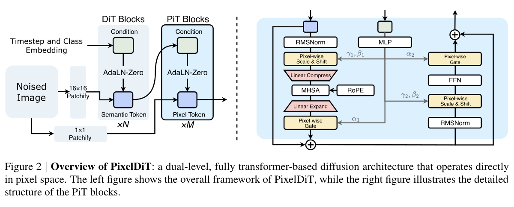
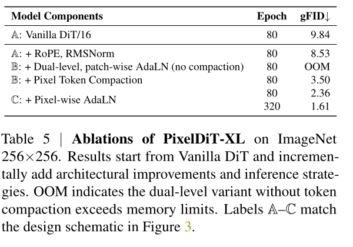

# PixelDiT - Pixel Diffusion Transformers for Image Generation 独立精读

> [!info] 文档关系
> - 文档类型：Paper
> - 领域入口：[README](../README.md)
> - 上位汇总：[Diffusion 多模态生成与 AI Infra](../surveys/multimodal-diffusion-infra.md)
> - 证据资产：`../assets/papers/pixeldit/`
> - 相关文档：[Figure inventory](../evidence/figure-inventory.md)

> 资料状态：已核验官方 arXiv v2 PDF（25 页），并按 physical PDF page 重建两张原论文裁剪。LaTeX/source archive、代码 worktree、checkpoint metadata 与公开评审原始材料本轮未取得。因此本文严格区分“PDF 直接核验”“既有代码记录”“分析推导”和“当前不可核验”。

## 修订信息

- 当前文档版本：`1.1.0`
- 当前修订 ID：`rev-pixeldit-20260725-pdf-recovery`
- 当前修订时间：`2026-07-25T21:52:59+08:00`
- 替代版本：`rev-pixeldit-20260725-initial` / `1.0.0`

| 修订 ID | 文档版本 | 时间 | 修订者 | 类型 | 替代修订 | 迁移问题/解析 | 变更摘要 | 原因 | 影响位置 | 依据 | 对结论影响 |
|---|---|---|---|---|---|---|---|---|---|---|---|
| rev-pixeldit-20260725-initial | 1.0.0 | 2026-07-25T21:38:19+08:00 | `paper-deep-review agent` | initial | 无 | 无 | 首次交付：来源边界、视觉 QA、动机闭环、组件证据与 infra | 补齐 canonical Paper 交付标准 | 本文、[Figure inventory](../evidence/figure-inventory.md) | 既有精读与资产 | material |
| rev-pixeldit-20260725-pdf-recovery | 1.1.0 | 2026-07-25T21:52:59+08:00 | `paper-deep-review agent` | evidence-update | `rev-pixeldit-20260725-initial` / `1.0.0` | 无 | 恢复官方 PDF；纠正 Figure 2 physical page；按原页重裁 Figure 2 与 Table 5 | 补齐原始页面证据 | 资料索引、[Figure inventory](../evidence/figure-inventory.md)与来源边界 | 官方 PDF SHA-256 `72de48b4...59b8293`；180 DPI QA | minor |

## 0. 资料与配图索引

- 论文：[arXiv:2511.20645v2](https://arxiv.org/abs/2511.20645v2)，25 physical pages，核验 SHA-256 `72de48b44936dc51c95334b557832a39b8a3f89d4b2dd8fd3b6c25a3a59b8293`。
- Figure 2：physical PDF page 3，bbox `(145,190,1200,485)`；`../assets/papers/pixeldit/fig2-dual-level-architecture-caption.png`。
- Table 5：physical PDF page 8，bbox `(760,1120,600,420)`；`../assets/papers/pixeldit/table5-core-ablation-caption.png`。
- 图表清单与 QA：[Figure inventory](../evidence/figure-inventory.md)。
- 代码：正式记录固定 commit `41f73006ae532b0b41fee72b181dc22891a5a01a`，但本轮无 worktree，代码 claim 只作为未重新核验的既有记录。
- OpenReview：公开评审核验记录，本地无公开评审原始证据。
- 视觉证据边界：保留原论文 Figure 2 与 Table 5；未用生成图替代论文机制或消融证据。

## 0.1 术语与符号解释

### 0.1.1 术语表

| 术语 | 本文含义 | 别名 | 不等于/易混项 | 证据来源与歧义 |
|---|---|---|---|---|
| dual-level DiT | 宽 patch-level DiT 负责全局语义，窄 pixel-level PiT 保留并更新像素状态 | 双层架构 | 不是外置 VAE encoder + latent DiT 两阶段系统 | PDF Sec. 3.1, physical p.3, Fig. 2 |
| PiT block | 像素路径中的 Transformer block，包含 pixel-wise modulation、线性压缩、MHSA、展开与 FFN | pixel transformer block | “pixel-level”不表示在 $HW$ token 上直接做全局 MHSA | Fig. 2；阶段限定为 pixel refinement |
| pixel token compaction | 每个 patch 的 $p^2$ 像素 token 暂时压成一个 token 做 patch-grid 全局注意力，再展开 | compress-attend-expand | 不是持久生成表征，也不是有损 VAE codec | PDF Sec. 3.2；Table 5 physical p.8；源码仍不可用 |
| pixel-wise AdaLN | patch 语义产生块内每个像素独立的 scale、shift、gate 参数 | per-pixel modulation | 不同于对整个 patch 广播一组 AdaLN 参数 | 既有记录 Eq. 6；Fig. 2 图示 scale/shift/gate |
| VAE-free | 扩散目标与采样直接位于 RGB 像素空间 | pixel-space diffusion | 不等于网络内部没有任何临时压缩 | 既有记录 Abstract/Sec. 1/3 |
| gFID | 文中 ImageNet 生成质量主指标，越低越好 | FID under guidance | 具体 guidance 配置不能由当前两张图恢复 | Table 5 列名；配置边界来自既有记录 |

### 0.1.2 符号表

| 符号 | 含义 | 性质 | 作用域/索引 | 单位/取值 | 来源 | 易混点 |
|---|---|---|---|---|---|---|
| $B,C,H,W$ | batch、通道、高、宽 | author-defined | 输入图像张量 | count / pixels | 既有记录 Sec. 3.1 | $H,W$ 为像素分辨率 |
| $p$ | 方形 patch 边长 | author-defined | patchify/compaction | pixels；示意图为 $16$ | Fig. 2 与既有记录 | token 数缩小 $p^2$，score matrix 理论缩小 $p^4$ |
| $L$ | patch token 数 | author-defined | 每图 | $L=(H/p)(W/p)$ | 既有记录 Sec. 3.1 | 不等于 $HW$ |
| $D,D_{\mathrm{pix}}$ | patch/pixel 隐藏宽度 | author-defined | 每层 | features | 既有记录 Table 1 | 本地缺 Table 1，具体配置不能重验 |
| $N,M$ | patch-level DiT / PiT block 深度 | author-defined | 模型 | layers | Fig. 2 的 $\times N,\times M$ | 不代表 token 数 |
| $X,\Theta$ | 像素特征与逐像素 AdaLN 参数 | author-defined | patch 内像素 | tensors | PDF Eq. 5–6 | $\Theta$ 最后一维含六组调制参数 |
| $\mathcal C,\mathcal E$ | 线性压缩与展开映射 | author-defined | PiT attention 子层 | linear maps | 既有记录 Sec. 3.2 | 不是 VAE encoder/decoder |
| $A_{\mathrm{pix}},A_{\mathrm{patch}}$ | 未压缩/压缩注意力 score 元素数 | analysis-derived | 单头单图 | elements | §8 推导 | fused SDPA 可能不显式物化 score |
| $b$ | 每元素字节数 | analysis-derived | memory estimate | bytes | §8 推导 | bf16/fp16 常取 $2$，不代表所有状态均为 2 bytes |

## 1. 论文基本信息

- 领域：端到端像素空间 diffusion Transformer。
- 核心问题：去掉外置 VAE 后，如何避免 $HW$ 像素序列全局注意力的二次复杂度，同时保留块内像素差异。
- 核心假设：全局语义可以在 patch 网格上建模，像素细节可以通过较窄的 PiT 路径、临时 compaction 和逐像素调制恢复。
- 证据等级：架构、公式和完整实验表可由官方 PDF/提取文本复核；代码实现与 checkpoint 仍只来自既有记录，未在本轮重验。

## 2. 研究动机与问题—方案闭环

### 2.1 出发点、失败模式与根因

作者主张（既有记录据 Abstract、Sec. 1/3）是：latent diffusion 依赖预训练且通常冻结的 VAE，图像生成质量受到重建误差和两阶段目标不一致约束；直接 pixel diffusion 可联合优化但又把序列长度从 latent/patch grid 推回 $HW$，全局注意力的计算和内存呈二次增长。由此，论文不是简单“取消压缩”，而是把长程计算所需的临时压缩移入端到端模型，同时维持一条逐像素残差/细化路径。

可观察失败有两类。第一，plain patch DiT 把 patch 内像素过早汇聚，细节表达能力受限；第二，plain pixel Transformer 若直接在全部像素上做全局 MHSA 会不可承受。Table 5 的双层但“不 compaction”变体出现 OOM，直接支持第二类可行性瓶颈；本地材料没有同架构同预算的 VAE/no-VAE 桥接实验，因此“VAE 重建上限是主要质量瓶颈”仍只获间接支持。

### 2.2 目标问题与成功标准

- 目标：在 RGB pixel space 中训练/采样，同时把全局注意力控制在 patch-grid 序列规模。
- 成功标准：避免 uncompacted pixel attention 的 OOM；compaction 后保留可竞争的 gFID；pixel-wise modulation 和 PiT attention 应在匹配设置下带来增益。
- 约束：compaction 不能成为外置、冻结的重建瓶颈；局部像素状态需要持续存在。
- 明确边界：论文材料没有隔离证明“移除 VAE”本身优于 latent baseline，也没有给出跨硬件的端到端加速比例。

### 2.3 问题—方案映射

| 原始问题/失败模式 | 根因或约束 | 对应设计 | 改变的变量/行为 | 因果机制 | 预期优化 | 证据 | 判断 |
|---|---|---|---|---|---|---|---|
| latent pipeline 存在重建误差与目标割裂 | 外置 VAE 有损且常冻结 | 直接 RGB diffusion | 优化域从 latent 改为 pixels | 生成目标可端到端作用于最终像素 | 降低重建上限、改善质量 | 既有记录 Abstract/Sec. 1；缺 matched no-VAE bridge | plausible |
| $HW$ 全局 MHSA OOM | score 元素为 $O((HW)^2)$ | pixel token compaction | 序列 $HW\rightarrow HW/p^2$ | 每 patch 暂压一 token 做全局注意力后展开 | 降 FLOPs/显存，训练可行 | Table 5 uncompacted OOM；既有记录 Table 6 82,247→311 GFLOPs | supported for feasibility |
| patch-only 路径弱化块内差异 | 同 patch 像素共享粗粒度语义 | pixel path + pixel-wise AdaLN | 保留逐像素状态并生成位置特定调制 | patch 语义按像素控制 scale/shift/gate | 改善细节与 gFID | Table 5 3.50→2.36 @80 epochs | supported |
| 纯局部像素更新缺少长程一致性 | 局部 FFN/调制无全局 token mixing | PiT compressed MHSA | patch-grid 间建立全局依赖 | 压缩 token 交换全局信息后回写像素状态 | 改善全局一致性 | 既有记录 Table 6：移除 attention 退化 0.20/0.25 gFID | partially-supported（表未在本地） |

### 2.4 完整因果链与证据边界

需求是避开 VAE 的重建/冻结约束；直接像素建模又造成 $HW$ 全局注意力不可扩展；PixelDiT 以宽 patch DiT 承载语义、窄 PiT 保留像素状态，并在每个 PiT attention 子层执行 $HW\rightarrow HW/p^2\rightarrow HW$ 的临时压缩—注意力—展开，再用 pixel-wise AdaLN 把 patch 语义细分到块内像素。理论上这把 score matrix 元素降为原来的 $1/p^4$，Table 5 的 OOM→3.50 验证可行性，3.50→2.36 验证逐像素 AdaLN 的质量贡献。

闭环只达到“部分支持”：compaction 的可行性和 pixel-wise AdaLN 的增益有 PDF 直接证据；完整系统的 1.61 gFID 显示竞争力，但训练 epoch、REPA、架构和 guidance 同时变化，不能作为取消 VAE 的因果证明。代码实现仍未在本轮独立核验。

## 3. 核心贡献

1. 以 dual-level Transformer 将全局语义与像素细化分工，Figure 2 直接展示两条路径。
2. 在 PiT 内使用临时 pixel token compaction，使全局注意力落在 patch-grid 而非 $HW$ 序列。
3. 使用 pixel-wise AdaLN 表达同 patch 内位置差异，Table 5 提供匹配 80 epoch 增量消融。
4. 完整系统在既有记录中报告 ImageNet-256 gFID 1.61、ImageNet-512 gFID 1.81；这些是系统级结果，不是单组件或 VAE-free 的独立归因。

## 4. 方法与组件级设计动机

Figure 2 显示同一 noisy image 经过 $16\times16$ patchify 进入 DiT blocks，同时经过 $1\times1$ patchify 保留 pixel token。DiT 输出 semantic token 并条件化 PiT；PiT block 内由 pixel-wise scale/shift、linear compress、MHSA+RoPE、linear expand、pixel-wise gate、RMSNorm/FFN 组成。

### 4.1 组件级设计动机矩阵

| 设计项 | why 状态/来源 | 具体问题 | 因果机制 | 替代/权衡 | 验证 | 判断 |
|---|---|---|---|---|---|---|
| dual-level patch + pixel paths | author-stated；既有记录 Sec. 3.1/Fig. 2 | patch-only 细节弱、pixel-only 全局计算贵 | 宽低序列语义路径与窄高分辨率像素路径分工 | U-Net/latent hierarchy；代价为双路径参数与调度 | Table 5 与 compaction 捆绑 | partially-supported |
| token compaction | author-stated；既有记录 Sec. 3.2 | $HW$ MHSA OOM | 每 patch 压一 token，全局混合后展开 | window/sparse/linear attention；线性压缩有信息瓶颈 | Table 5 OOM；既有 Table 6 FLOPs | supported for feasibility |
| pixel-wise AdaLN | author-stated；既有 Eq. 6/Fig. 2 | patch-wise 广播无法区分块内像素 | 语义映射为逐像素 scale/shift/gate | cross-attention；投影宽度随 $p^2$ 增长 | Table 5 3.50→2.36 | supported |
| RMSNorm + 2D RoPE | inferred；既有记录 Sec. 3.1/Table 5 | 训练稳定与二维位置编码 | 归一化激活并注入相对二维位置 | LayerNorm/absolute PE | 两项捆绑 9.84→8.53 | plausible, confounded |
| REPA objective | author-stated；PDF Sec. 3.3 | pixel training 语义收敛慢 | 中层 token 对齐 DINOv2 语义 | 无 teacher 或其他表征对齐；增加冻结 encoder 成本 | PDF Appendix Table 12 | partially-supported |

### 4.2 关键公式

$$
L=\frac{H}{p}\frac{W}{p}=\frac{HW}{p^2}.
$$

$$
\Theta=\Phi(s_{\mathrm{cond}})\in\mathbb R^{(BL)\times p^2\times 6D_{\mathrm{pix}}}.
$$

$$
\mathcal L=\mathbb E\left[\left\|f_\theta(x_t,t,y)-v_t\right\|_2^2\right]
+\lambda_{\mathrm{REPA}}\mathcal L_{\mathrm{REPA}}.
$$

后两式已对照官方 PDF 的 Eq. 6/Sec. 3.3；正文与 manifest 仍不扩展论文没有报告的训练细节。

## 5. 实验、技术 claim 与归因

### 5.1 技术 claim 证据矩阵

| 技术点 | 声称收益 | 实验/控制 | 指标变化 | 证据强度 | 结论 |
|---|---|---|---|---|---|
| RMSNorm + RoPE | 改善 vanilla DiT | Table 5，同为 80 epoch，但两项一起加入 | 9.84→8.53；绝对 -1.31，约 -13.3% | confounded | 组合有效，单项归因 unverified |
| dual-level without compaction | 直接像素路径 | Table 5，80 epoch | OOM | direct failure observation | 证明 uncompacted 版本在未报告的测试环境不可行 |
| token compaction | 恢复可训练性 | Table 5，80 epoch | OOM→3.50 | direct feasibility | supported；不能由 OOM 计算精确 speedup |
| pixel-wise AdaLN | 提升像素细节/质量 | Table 5，80 epoch | 3.50→2.36；绝对 -1.14，约 -32.6% | direct incremental ablation | supported |
| 训练至 320 epoch | 完整系统质量 | Table 5 | 2.36@80→1.61@320；绝对 -0.75，约 -31.8% | compute-confounded | 训练预算收益，不是架构组件增益 |
| VAE-free | 避免重建误差 | 既有记录称 Fig. 1 定性编辑例 | 非 matched quantitative bridge | indirect | plausible, not isolated |
| PiT MHSA | 提升全局一致性 | 既有记录 Table 6 remove-attention | 2.36→2.56 @80；1.97→2.22 @160 | direct ablation, but table absent locally | partially-supported in this run |

### 5.2 主结果与公平性

PDF Tables 2–3 报告 ImageNet-256 gFID 1.61 和 ImageNet-512 gFID 1.81；与 PixelFlow-XL 1.98、REPA 2.08 的差值分别为 0.37（18.7%）和 0.27（13.0%）。这些数字已在 PDF 中直接复核，但 baseline 间的模型规模、训练 epoch、REPA、数据和 guidance 未同时匹配，完整系统优势仍不能归因为去 VAE。

### 5.3 收益来源

- 直接：Table 5 的 pixel-wise AdaLN 在 80 epoch matched incremental setting 下带来 1.14 gFID 绝对改善。
- 可行性：compaction 将 OOM 变为可训练结果，但缺硬件、precision、峰值显存，无法量化 OOM 边界。
- 混杂：RMSNorm 与 RoPE 一起加入；320 epoch 同时改变训练预算；跨论文主结果同时改变架构和 recipe。
- PDF 已重验 PiT attention、REPA 与完整主结果；代码/配置一致性仍未重验。

## 6. Related Work 对比

| 类别 | 机制 | 优点 | 局限 | 与 PixelDiT 的关系 |
|---|---|---|---|---|
| latent DiT | VAE 压缩后在 latent grid 扩散 | 序列短、生态成熟 | 重建上限与两阶段优化 | PixelDiT 直接 RGB，但承担更高像素路径成本 |
| patch-only pixel DiT | 大 patch token 直接建模 | Transformer 简洁 | patch 内细节可能被过早汇聚 | PixelDiT 保留独立 pixel state |
| plain pixel Transformer | $HW$ token 全局注意力 | 直接像素依赖 | 二次 score 导致 OOM | PixelDiT 用临时 compaction 规避 |
| window/sparse attention | 局部或稀疏 token mixing | 避免全局二次计算 | 长程依赖/实现规则更复杂 | 是 compaction 的替代路线，论文现有消融未比较 |

比较公平性边界：当前材料不能确认所有 related-work baseline 的参数、数据、训练预算与 sampling guidance；因此只比较机制和权衡，不宣称全面 SOTA 因果。

## 7. OpenReview 交叉核验

本地没有 OpenReview URL、review、meta-review、decision 或 rebuttal；本次恢复范围是父任务提供的官方 PDF，未提供公开评审原始记录。该分支为 `skipped-with-reason`，详见 公开评审核验记录。因此 novelty、baseline fairness、数据来源和复现性担忧只能作为本审查提出的证据缺口，不能冒充 reviewer 意见。

## 8. Infra 需求分析

### 8.1 计算与显存

未压缩像素注意力的 score 元素数与压缩后的值为：

$$
A_{\mathrm{pix}}=(HW)^2,\qquad
A_{\mathrm{patch}}=\left(\frac{HW}{p^2}\right)^2,\qquad
\frac{A_{\mathrm{pix}}}{A_{\mathrm{patch}}}=p^4.
$$

当 $H=W=256,p=16$ 时，二者分别为 $4{,}294{,}967{,}296$ 和 $65{,}536$ 元素。若粗略按 bf16 score、$b=2$ bytes 计算：

$$
M_{\mathrm{score}}=A\,b,
$$

约为 8 GiB 与 128 KiB（单头单图、未计 batch/head/backward，且 fused SDPA 可能不显式物化完整矩阵）。这是 analysis-derived 方向估计，不是论文实测峰值。既有记录的 Table 6 82,247→311 GFLOPs 为 264 倍而非 $p^4$，因为 MLP、投影、patch path 等不按相同比例下降。

### 8.2 Data types、带宽与 kernel

既有记录称训练为 bf16 mixed precision、T2I 吞吐为 fp16，FSDP collective/optimizer state 为 fp32；本轮无代码/配置，均标记“未重新核验”。compaction 减少 attention QKV/score 的长序列流量，却增加 compress/expand 投影与逐像素读写。由于没有逐算子 bytes、runtime、HBM 峰值与 profiler：

$$
\mathrm{EffectiveBandwidth}=
\frac{\mathrm{BytesMoved}}{\mathrm{RuntimeSeconds}},\qquad
\mathrm{Utilization}=
\frac{\mathrm{EffectiveBandwidth}}{\mathrm{PeakBandwidth}}
$$

均无法数值化。不能仅由 GFLOPs 声称真实 wall-clock 或 bandwidth speedup，也不能断言固定 FlashAttention backend。

### 8.3 并行、互联与异构

既有记录称 T2I 代码使用 FSDP FULL_SHARD，意味着参数 all-gather 与梯度 reduce-scatter；但 world size、bucket、NVLink/RDMA、overlap 和通信占比未知。CPU 可合理承担 dataloader/文本预处理，GPU 执行训练/采样；本地没有 NPU kernel、CPU offload 或异构 scheduler 证据。部署结论只能限定为“既有记录所描述的 NVIDIA/PyTorch 路径”，不能外推 NPU。

## 9. 代码与 checkpoint 对照

正式记录给出官方代码 commit `41f73006ae532b0b41fee72b181dc22891a5a01a`，并记载：

- `pixdit_core/pixeldit_c2i.py:190-289`：双路输入、PiT compress/attention/expand 与 fold 输出；
- `pixdit_core/modules.py:215`：PyTorch SDPA；
- `c2i/src/diffusion.py:82,107`：bf16 autocast；
- `t2i/train.py:65-92`：FSDP FULL_SHARD，通信/优化器状态 fp32。

这些路径在本轮无 worktree，故属于“legacy-recorded, locally unavailable”，不满足本轮源码复核。checkpoint 只知既有记录称 `tools/download.py` 指向 Hugging Face；本轮没有 metadata/config/权重，参数量和 checkpoint 配置均未验证。

## 10. 优点、局限与可改进项

### 优点

- 把“VAE-free 像素建模”与“可扩展全局语义计算”的矛盾转化为清晰的层次结构。
- Table 5 直接展示 uncompacted OOM、compaction 可行和 pixel-wise AdaLN 增益，关键机制至少有一条受控证据链。
- 临时 compaction 不替代逐像素状态，概念上避免把内部层次结构误写成外置 codec。

### 局限

- 缺同架构同预算、仅改变 VAE 的桥接实验；“去 VAE 提升质量”未被隔离。
- OOM/FLOPs 没有绑定硬件、batch、precision、峰值显存和 wall-clock，系统可扩展性外推有限。
- 本轮已有 PDF/全文；仍缺 LaTeX source、code worktree、checkpoint metadata 与 OpenReview，不能独立重验实现和评审。
- 26M T2I 数据的来源、过滤和许可细节在既有记录中不足。

### 最小补强实验

1. 固定参数、FLOPs、REPA、guidance 和训练预算，对比 latent 与 pixel objective。
2. 分离 RMSNorm 与 RoPE，并对 $p,D_{\mathrm{pix}},M$ 做质量—吞吐 Pareto。
3. 报告峰值显存、step time、kernel profile、HBM bytes、MFU 和 FSDP 通信占比。
4. 重新取得固定 commit worktree与 checkpoint config，逐项核对论文配置。

## 11. 研究启发

- 压缩位置可以从独立 tokenizer/codec 移入 backbone 内部，关键不在“是否压缩”，而在是否保留端到端目标和高分辨率状态。
- 可探索可逆/多尺度 compaction、动态 $p$、内容自适应 token budget，以及对 compaction 信息损失的显式正则。
- 系统研究应把 algorithmic token reduction 与 kernel/backend/FSDP runtime 分开测量。

## 12. 待验证问题

1. VAE-free 的收益在严格 matched bridge 中是否仍存在？
2. compaction 的线性映射丢失哪些频率/颜色细节，pixel residual path 能否完全补偿？
3. pixel-wise AdaLN 的收益来自位置特异性、额外参数量还是优化稳定性？
4. PiT attention 在不同分辨率、$p$ 与文本条件下的边际收益如何？
5. fused SDPA 下实际 memory traffic、利用率与 wall-clock 是否遵循理论 $p^4$ 趋势？
6. 公开代码 commit 和 checkpoint 是否完全匹配论文 XL/T2I 配置？

## 13. 一句话总结

PixelDiT 的核心价值是把像素空间扩散的全局二次注意力，通过“保留像素状态、临时压缩做全局混合”的双层 Transformer 化解；Table 5 支持其可行性与 pixel-wise AdaLN 增益，但 VAE-free 的独立质量因果、跨硬件效率和本轮源码复核仍未闭合。
