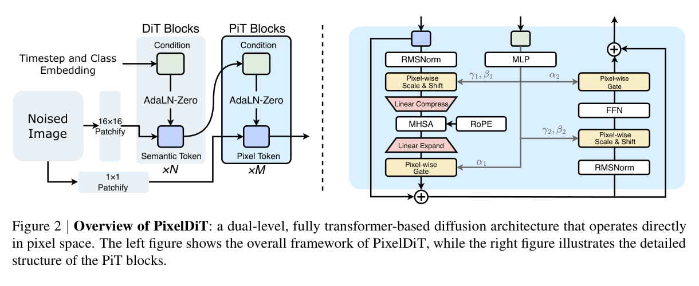

# PixelDiT

> [!info] 文档关系
> - 文档类型：Paper
> - 领域入口：[README](../README.md)
> - 上位汇总：[Diffusion 多模态生成与 AI Infra](../surveys/multimodal-diffusion-infra.md)
> - 证据资产：`../assets/papers/pixeldit/`

PixelDiT 去掉预训练 VAE，但并非让全局 attention 直接处理 `HW` 像素。其 dual-level 结构用 pixel token compaction 把全局序列降到 `HW/p²`，再以 pixel path 恢复局部纹理；因此路线变化是“把压缩从独立有损 codec 移入端到端 transformer”，不是取消层次化表示。

