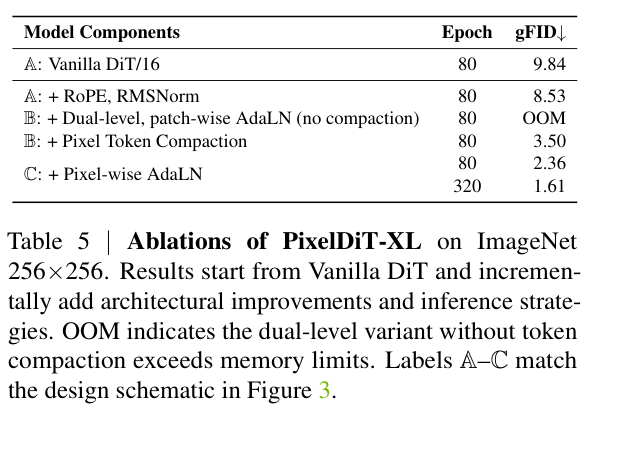

# PixelDiT - Pixel Diffusion Transformers for Image Generation 精读分析
> [!info] 文档关系
> - 文档类型：Paper
> - 领域入口：[README](../README.md)
> - 上位汇总：[Diffusion 多模态生成与 AI Infra](../surveys/multimodal-diffusion-infra.md)
> - 证据资产：`../assets/papers/pixeldit/`
> - 相关文档：[Figure inventory](../evidence/figure-inventory.md)

> 资料状态：arXiv v2 PDF（25 页）、完整 LaTeX 源码与官方代码均已获取；代码固定于 commit `41f73006ae532b0b41fee72b181dc22891a5a01a`。下列论文图均为 180 DPI PDF 裁剪并含完整 caption。

## 修订信息

- 当前文档版本：`1.0.0`
- 当前修订 ID：`rev-2511-pixeldit-initial`
- 当前修订时间：`2026-07-12T12:00:00+08:00`
- 替代版本：无（initial）

| 修订 ID | 文档版本 | 时间 | 修订者 | 类型 | 替代修订 | 迁移问题/解析 | 变更摘要 | 原因 | 影响位置 | 依据 | 对结论影响 |
|---|---|---|---|---|---|---|---|---|---|---|---|
| rev-2511-pixeldit-initial | 1.0.0 | 2026-07-12T12:00:00+08:00 | review_pixeldit | initial | 无 | 无 | 初始深度审阅、视觉与代码/infra 核验 | initial delivery | analysis.md；figure_inventory.md；code/PixelDiT | task_packet.yaml；论文与代码 | material |

## 0. 资料与配图索引

- 论文与 LaTeX：[arXiv:2511.20645](https://arxiv.org/abs/2511.20645)；核验版本为 v2。
- 代码：`code/PixelDiT/`，commit `41f73006ae532b0b41fee72b181dc22891a5a01a`
- Figure 2：`../assets/papers/pixeldit/fig2-dual-level-architecture.png`
- Table 5：`../assets/papers/pixeldit/table5_core_ablation_caption.png`
- OpenReview：任务包未给出，且 CVPR 2026 公开评审入口未能从所给材料确认；不把评审意见作为证据。
- AI 生成图：跳过；运行环境未提供 `OPENROUTER_ICU_API_KEY`，不以其他图替代。

## 0.1 术语与符号解释

### 0.1.1 术语表

| 术语 | 本文含义 | 别名 | 不等于/易混项 | 证据来源 |
|---|---|---|---|---|
| dual-level DiT | patch-level DiT 先形成语义 token，pixel-level PiT 再进行逐像素更新 | 双层架构 | 不是两阶段 VAE+DiT；两条路径在同一端到端模型内 | Sec. 3.1, Fig. 2 |
| pixel token compaction | 每个 patch 内的 $p^2$ 像素 token 线性压成一个全局注意力 token，注意力后再展开 | compress-attend-expand | 不是持久的生成表征压缩；残差仍保留像素路径 | Sec. 3.2；`pixdit_core/pixeldit_c2i.py` |
| pixel-wise AdaLN | patch 语义 token 投影成每个像素独立的六组调制参数 | per-pixel modulation | 不同于 patch-wise 广播同一参数 | Sec. 3.2, Eq. 6, Fig. 3 |
| VAE-free | 扩散训练和采样直接位于 RGB 像素空间 | pixel-space | 不代表模型没有任何短时降维操作 | Abstract, Sec. 1/3 |

### 0.1.2 符号表

| 符号 | 含义 | 性质 | 作用域/索引 | 单位/取值 | 来源 | 易混点 |
|---|---|---|---|---|---|---|
| $B,C,H,W$ | batch、通道、高、宽 | author-defined | 输入张量 | count/pixels | Sec. 3.1 | $H,W$ 是像素分辨率 |
| $p$ | patch 边长 | author-defined | 两条路径分组 | pixels；常用 16 | Sec. 3.1/4.5 | 注意 token 缩短为 $p^2$ 倍、注意力矩阵缩小 $p^4$ 倍 |
| $L$ | patch token 数 | author-defined | 每张图 | $(H/p)(W/p)$ | Sec. 3.1 | 不等于像素 token 数 $HW$ |
| $D,D_{pix}$ | patch/pixel 隐藏宽度 | author-defined | 每层 | features；$D_{pix}\ll D$ | Sec. 3.1, Table 1 | 代码默认值不等于论文 XL 配置 |
| $N,M$ | patch/PiT block 深度 | author-defined | 模型 | layers | Table 1 | 与 token 数无关 |
| $X,\Theta$ | 像素特征与逐像素 AdaLN 参数 | author-defined | patch 内像素 | tensors | Eq. 5-6 | $\Theta$ 最后一维含六组参数 |
| $\mathcal C,\mathcal E$ | 线性压缩/展开算子 | author-defined | 每个 PiT block | maps | Sec. 3.2 | 不是 VAE encoder/decoder |
| $A_{pix},A_{patch}$ | 像素全局/压缩后注意力矩阵元素数 | analysis-derived | 单头每图 | elements | 本文 Sec. 7.2 推导 | 未计 batch/head/反向保存倍数 |

## 1. 论文基本信息

- 领域：端到端像素空间 diffusion transformer；CVPR 2026。
- 核心问题：去掉 VAE 后，如何避免 $HW$ 像素全局注意力的二次复杂度，同时保留逐像素细节更新。
- 核心假设：全局语义可在 patch 网格上学习；像素细节可由窄 PiT 路径与语义调制恢复。

## 2. 核心贡献与证据边界

1. 双层纯 Transformer 数据流（Sec. 3.1, Fig. 2），把语义计算和像素细化分开。
2. pixel token compaction 把全局注意力序列从 $HW$ 降至 $L=HW/p^2$（Sec. 3.2, Table 6）。
3. pixel-wise AdaLN 让同一 patch 内像素获得不同调制（Eq. 6, Table 5）。
4. ImageNet-256 gFID 1.61、ImageNet-512 gFID 1.81；但与 latent baseline 的比较并未同时控制数据、训练 epoch、参数量、REPA 与 guidance，因此只能证明完整系统竞争力，不能单独证明“去 VAE”带来质量优势（Tables 2-3）。

## 3. 研究方法

### 3.1 问题到方案的逻辑链

像素注意力二次爆炸 -> patch 路径承载全局语义 -> PiT 以窄通道保留逐像素状态 -> 每块先压成一个 token 做全局注意力再展开 -> pixel-wise AdaLN 把语义条件细分到各像素。

### 3.2 设计动机与具体问题映射

| 设计项 | why 状态/来源 | 具体问题 | 因果机制 | 替代/权衡 | 验证 | 判断 |
|---|---|---|---|---|---|---|
| 双层路径 | author-stated, Sec. 3.1 | 单层 patch DiT 丢细节；全像素 DiT 太贵 | 宽 patch 路径做语义，窄 pixel 路径做细节 | 卷积 U-Net/层次 latent；代价是双路径复杂性 | Table 5 增量但与 compaction 捆绑 | partially supported |
| token compaction | author-stated, Sec. 3.2 | $HW$ 全局注意力 OOM | $HW\to HW/p^2$ 后做全局注意力 | window/sparse/linear attention；线性压缩可能丢信息 | Table 6: 82,247->311 GFLOPs，uncompacted OOM | supported for feasibility |
| pixel-wise AdaLN | author-stated, Sec. 3.2 | patch 广播无法表达块内差异 | $D\to p^2\cdot6D_{pix}$ 生成逐像素门控/缩放/偏置 | cross-attention；投影参数随 $p^2$ 增长 | Table 5: 3.50->2.36 gFID at 80 epochs | supported |
| RMSNorm+2D RoPE | inferred from LGT, Sec. 3.1 | 稳定性与二维位置 | 归一化与旋转位置编码 | LayerNorm/absolute PE | Table 5: 9.84->8.53，两个变化捆绑 | confounded |
| REPA objective | author-stated, Sec. 3.3 | 像素训练语义收敛慢 | 中层 token 对齐 DINOv2 | 自监督/无 teacher；增加 frozen encoder 成本 | Appendix ablation，主 latent 比较仍混杂 | partially supported |

### 3.3 模型/系统架构

输入同时经 $p\times p$ patchify 进入 $N$ 层 DiT、经 $1\times1$ pixelify 保留像素 token。语义 token 条件化 $M$ 个 PiT block；代码 `pixeldit_c2i.py:267-286` 与此一致。PiT 的注意力并非在整张像素序列上执行，而是压缩后在 patch 序列上执行。

### 3.4 关键公式

$$L=\frac Hp\frac Wp,\qquad \Theta=\Phi(s_{cond})\in\mathbb R^{(BL)\times p^2\times6D_{pix}}.$$

$$\mathcal L=\mathbb E\|f_\theta(x_t,t,y)-v_t\|_2^2+\lambda_{repa}\mathcal L_{repa}.$$

### 3.5 训练与实现事实

ImageNet XL 使用 $D=1152,N=26,M=4$，bf16 mixed precision，batch 256；T2I 先 512 分辨率 400K step/batch 1024，再 1024 分辨率 100K step/batch 768（Sec. 4.1）。代码使用 PyTorch SDPA（`pixdit_core/modules.py:215`）、bf16 autocast（`c2i/src/diffusion.py:82,107`），T2I 采用 FSDP FULL_SHARD 且通信/优化器状态精度 fp32（`t2i/train.py:65-92`）。公开仓库未提供完全匹配论文训练硬件数量与端到端 wall-clock。

## 4. 关键结论与证据

### 4.1 主结果及公平性

ImageNet-256 的 1.61 比 PixelFlow-XL 1.98 低 0.37（18.7%），但表中模型规模/epoch 缺失不一。ImageNet-512 的 1.81 优于 REPA 2.08（0.27，13.0%），然而 PixelDiT 同时包含 REPA 对齐、不同架构/训练预算与 guidance；这不是“相同 DiT，仅移除 VAE”的受控实验。T2I fp16 A100 吞吐报告为 512: 1.07 sample/s、1024: 0.33 sample/s（Table 4），只可用于该采样配置，不能外推训练效率。

### 4.2 技术 claim 证据矩阵

| 技术点 | claim | 实验 | 控制 | 变化 | 强度 | 结论 |
|---|---|---|---|---|---|---|
| compaction | 使像素训练可行 | Tables 5/6 | matched architecture branch | OOM->3.50；82,247->311 GFLOPs | direct feasibility | supported |
| pixel-wise AdaLN | 改善细节/质量 | Table 5 | 80 epoch incremental | 3.50->2.36，绝对 -1.14/相对 -32.6% | direct ablation | supported |
| PiT attention | 全局对齐有益 | Table 6 | remove attention | 2.36->2.56 (80e), 1.97->2.22 (160e) | direct ablation | supported |
| RMSNorm+RoPE | 改善基线 | Table 5 | 两项捆绑 | 9.84->8.53 | confounded | component attribution unverified |
| VAE removal | 避免重建误差 | Fig. 1 editing example | model/recipe not matched | qualitative | mechanism visualization | plausible, not isolated |
| 320 epoch 1.61 | SOTA quality | Table 5 | training budget changed | 2.36@80->1.61@320 | confounded with compute | complete-system result |

### 4.3 Evidence loop

Claim（compaction 使 pixel global attention 可行）-> mechanism（序列缩短 $p^2$、矩阵缩小 $p^4$）-> measurement（Table 6: 82,247 vs 311 GFLOPs；uncompacted OOM）-> code（`PiTBlock` compress/attention/expand）-> limitation（OOM 硬件/精度和内存峰值未报告，311 GFLOPs 不是 wall-clock）。因此机制与可行性证据闭环，但无法推出跨硬件吞吐比例。

### 4.4 收益归因

可直接归因：pixel-wise AdaLN 在相同 80 epoch 增益 1.14 gFID；PiT attention 的 80/160 epoch 增益分别 0.20/0.25。不可直接归因：1.61 对 latent baseline 的差距混合架构、REPA、数据/训练和采样；RMSNorm 与 RoPE 捆绑。

## 5. Related Work 对比

| 类别 | 机制 | 优点 | 局限 | PixelDiT 差异 |
|---|---|---|---|---|
| latent DiT | VAE 压缩后扩散 | 序列短 | 有重建上限与两阶段目标 | 直接 RGB，但计算更重 |
| PixelFlow/PixNerd | 层次 flow/神经场 | 像素空间可扩展 | 非纯 Transformer | PixelDiT 用双层 Transformer |
| plain pixel transformer | 全局像素或大 patch | 简单 | O($H^2W^2$) 或细节弱 | compaction+pixel modulation |

## 6. OpenReview 交叉核验

任务包 `openreview_url` 为 unknown，论文/仓库材料未提供 forum、decision 或 rebuttal 标识；因此公开 OpenReview 分支记为不适用，不能据此评估审稿阶段争议。

## 7. Infra 需求分析

### 7.1 计算扩展

未压缩像素全局注意力每头约 $O((HW)^2d)$；压缩后为 $O((HW/p^2)^2D)$。注意力矩阵理论缩小 $p^4$，$p=16$ 为 65,536 倍；实际总模型 GFLOPs 仅从 82,247 到 311（264倍），因为 patch MLP、投影、像素 MLP 等不随同一比例缩放。

### 7.2 激活显存

单头单图注意力元素：$A_{pix}=(HW)^2$，$A_{patch}=(HW/p^2)^2$。256 分辨率时分别为 4,294,967,296 与 65,536；仅矩阵若 bf16 为约 8 GiB vs 128 KiB（未计 head、batch、反向与 fused SDPA 不物化矩阵的优化）。这解释 OOM 方向，但不是论文实测峰值。

### 7.3 数据类型、带宽与 kernel

训练为 bf16 mixed precision；T2I 吞吐为 fp16；FSDP collective/state 配置为 fp32。SDPA 可使用 fused kernel，但仓库未固定 FlashAttention backend，故不能声称特定 kernel。compaction 增加线性投影读写，却显著减少 attention QKV/score 流量；无逐算子 bytes/runtime，无法计算 effective bandwidth 或利用率。局部 pixel MLP/调制更可能受 HBM traffic 影响，patch attention 随宽度/长度可能偏 compute-bound。

### 7.4 并行、互联与异构

T2I 代码 FULL_SHARD 意味每层参数 all-gather、梯度 reduce-scatter；粗略每 step 通信量与参数字节 $P b$ 同阶并乘 world-size 系数，确值依 FSDP bucket/拓扑。未报告 GPU 数、NVLink/RDMA、利用率或 overlap 指标。CPU 负责数据加载/文本预处理，GPU 执行模型；代码无 NPU kernel、CPU offload（显式 false）或异构调度证据。部署结论限于 NVIDIA CUDA 路径。

## 8. 代码交叉核验

commit `41f73006ae532b0b41fee72b181dc22891a5a01a`：`pixdit_core/pixeldit_c2i.py:190-289` 实现两路输入与 fold 输出；`PiTBlock` 实现压缩、SDPA、展开与逐像素 AdaLN；`pixeldit_t2i.py` 只在 patch 路径加入联合文本注意力，符合 Sec. 3.2。`tools/download.py` 指向公开 Hugging Face checkpoint，但本次未下载大权重；模型元数据/精确参数量因此只以仓库配置为准，不从 README 推断。

## 9. 局限、启发与待验证问题

- 没有“同架构同预算、有/无 VAE”的桥接实验，VAE-free 优势仍与完整系统变化混杂。
- OOM 与 GFLOPs 未绑定硬件、batch、precision、峰值显存；难复现系统边界。
- 26M T2I 数据缺少来源/过滤细节，限制公平比较和复现。
- 值得验证 fused SDPA 下实际 HBM bytes、MFU、FSDP 通信占比，以及 $p,D_{pix},M$ 的质量-吞吐 Pareto。
- 最小关键实验：固定参数/FLOPs/REPA/guidance，比较 latent 与 pixel；报告不同 GPU 上峰值显存、step time、kernel profile 与有效带宽。
