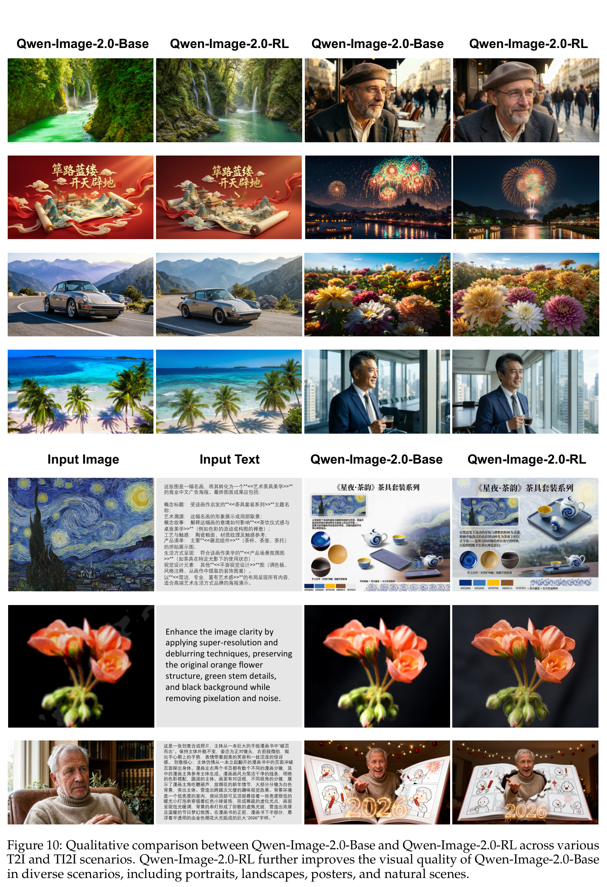

# Qwen-Image-2.0 Technical Report 精读

> [!info] 文档关系
> - 文档类型：Paper
> - 领域入口：[README](../README.md)
> - 上位汇总：[近半年多模态视觉生成模型全景](../surveys/visual-generation-model-landscape.md)
> - 证据资产：`../assets/papers/qwen-image-2-0/`
> - 证据索引：[Figure inventory](../evidence/figure-inventory.md)

> 资料状态：已核验 arXiv PDF/source 与官方 Qwen-Image family repository commit `6b5e1f5cec987d404be5ac6657db3b9aacb56a89`。该 commit 只公告 2.0，未提供 2.0 weights/config/implementation；因此不从上一代外推参数或 dtype。

## 修订信息

- 版本：`1.0.0`
- 修订 ID：`rev-qwen-image-2-0-1.0.0`
- 时间：`2026-07-28T20:30:00+08:00`
- 类型：initial

## 1. 论文要回答什么

Qwen-Image-2.0 试图用一套条件编码器、VAE 和 MMDiT 同时覆盖文本生成图像与指令式编辑，并在 2K、高密度文字、多语言、复杂构图和交互延迟之间取得平衡。它不是简单把 editing model 挂到 text-to-image model 后面，而是把 T2I 与文本+图像条件编辑（TI2I）写进同一条件—目标建模路径。

可核验的模型字段：

| 字段 | 结论 | 边界 |
|---|---|---|
| 参数架构 | **未披露** | MMDiT 不等于 MoE；不能写 Dense/MoE/MoT |
| 总/激活参数 | **未披露** | 只披露 VAE encoder 79M、decoder 259M |
| 独立模块 | Prompt Enhancer 初始化自 Qwen3.5-9B | 不属于 MMDiT 参数 |
| 生成范式 | diffusion/flow family MMDiT；RL 后训练；conditional DMD | base loss/mask 未完整披露 |
| 训练/推理 dtype | **未披露** | repo 的 bf16 示例属于 2512/Edit-2511 |

## 2. 方法

> 原论文 Figure 8 与完整 caption。冻结的 Qwen3-VL 提供文本/输入图像条件，输入图像同时经 VAE 变为可逆 latent；目标 latent 加噪后与条件 token 一起进入共享 MMDiT。

### 2.1 `f16c64` VAE

图像以 16× 空间下采样、64 latent channels 表示。高压缩减少 2K 图像的空间 token，但会把压力转移到重建质量、channel 宽度和 latent 可扩散性。论文以 residual shortcut 和 semantic alignment 改善这一折中；没有把所有子组件逐一消融。

### 2.2 统一条件—目标流

Qwen3-VL 输出系统提示、用户文本和输入图像语义；VAE 提供输入/目标图像 latent。MMDiT 使用 MSRoPE、QK RMSNorm、bias-free modulation 和 SwiGLU，在统一 token 流内学习 T2I 与 TI2I。该架构消除了独立 editing pipeline，但论文没有给出精确 attention mask 或每个改动的受控收益。

### 2.3 Prompt Enhancer、RL 与 DMD

- Prompt Enhancer 用 inverse-degradation supervision 和下游视觉 reward 扩写短提示，额外引入 9B 级模块成本。
- RL 使用多维 reward 和 adapted GRPO；rollout 使用 CFG，但 unconditional branch 不进入 policy objective。
- conditional DMD 把 40-step teacher 压缩为 4 NFE student。`40→4` 可称 90% NFE 减少或 10× NFE 缩减，但没有 wall-clock 测量时不能写成 10× 延迟加速。

## 3. 数据与训练

论文描述了分阶段的图文/编辑数据和分辨率课程，但未披露可审计的总样本数、各来源权重、过滤/去重/许可、base optimizer/compute 或 dtype。后训练 Figure 10 把 reward、CFG、prompt 与 checkpoint 变化捆在一起，适合证明“整体改善”，不适合给单项 reward 分配因果份额。

> 原论文 Figure 10 与完整 caption。它是 bundled qualitative evidence，不是独立 reward 的量化消融。

## 4. 证据判断

| 声称 | 证据 | 判断 |
|---|---|---|
| T2I/TI2I 共用条件—目标路径 | Figure 8、Section 3.2 | 结构证据强 |
| 16× VAE 兼顾高分辨率成本与重建 | Table 1 | replacement evidence；子组件未隔离 |
| RL 改善多维偏好 | Figure 10 | 定性、多个变化捆绑 |
| 4 NFE 保留 teacher 能力 | Figure 11 | NFE 明确；质量和延迟证据有限 |
| 完整模型是某个 B 数或 Dense | 无 | 不可写 |

## 5. Infra 含义

- 16× VAE 让 2K latent 的空间位置相对 8× 减少 4 倍，但 64 channels 增加每 token 宽度；最终 HBM/compute 需结合 patching 和 hidden projection。
- 2K、多输入编辑会放大条件 token、activation 与 attention 内存；MMDiT 是否能用现有 image/video sparse-attention kernel 取决于未披露 mask。
- 4 NFE 主要降低 denoiser 调用次数；端到端还包含 Prompt Enhancer、Qwen3-VL、VAE encode/decode 和 CFG 分支。
- total/active、dtype、并行和 2.0 checkpoint 不公开，无法给出可靠显存、吞吐或部署成本。

## 6. 局限

1. 官方 family repo 在核验 commit 中没有 2.0 weights/config/code。
2. 没有公开 OpenReview 评审线程。
3. 参数架构、完整规模、base loss/mask、训练 compute 与 dtype 未披露。
4. 主要结果以系统级和定性证据为主，组件级因果归因有限。

## 来源

- [arXiv:2605.10730](https://arxiv.org/abs/2605.10730)
- [QwenLM/Qwen-Image](https://github.com/QwenLM/Qwen-Image)
