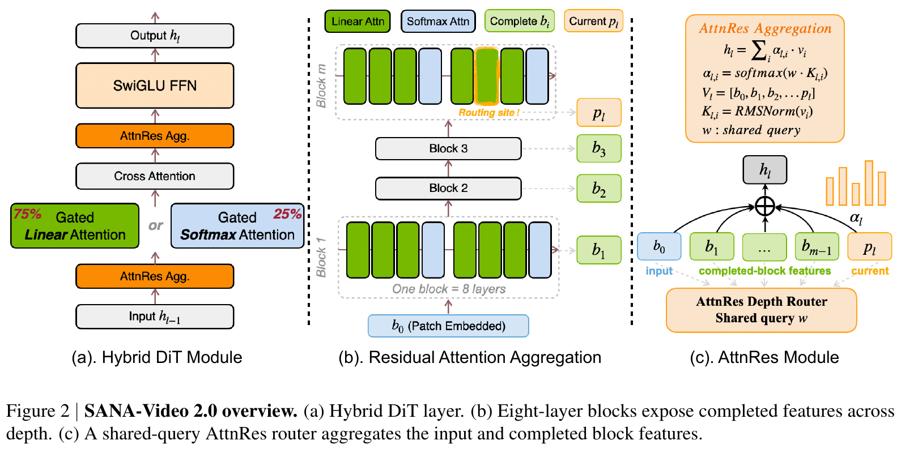
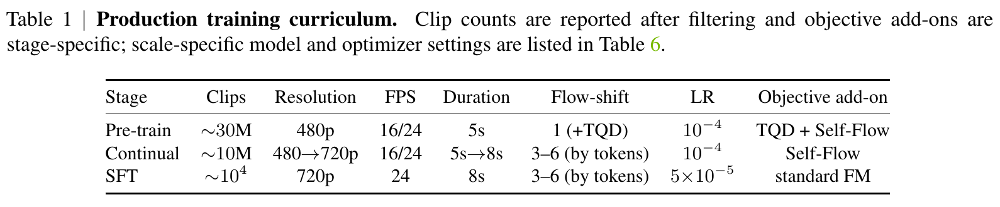
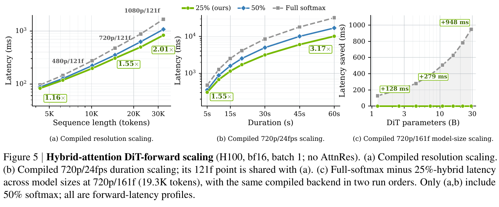
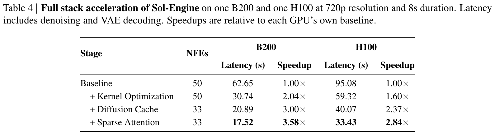
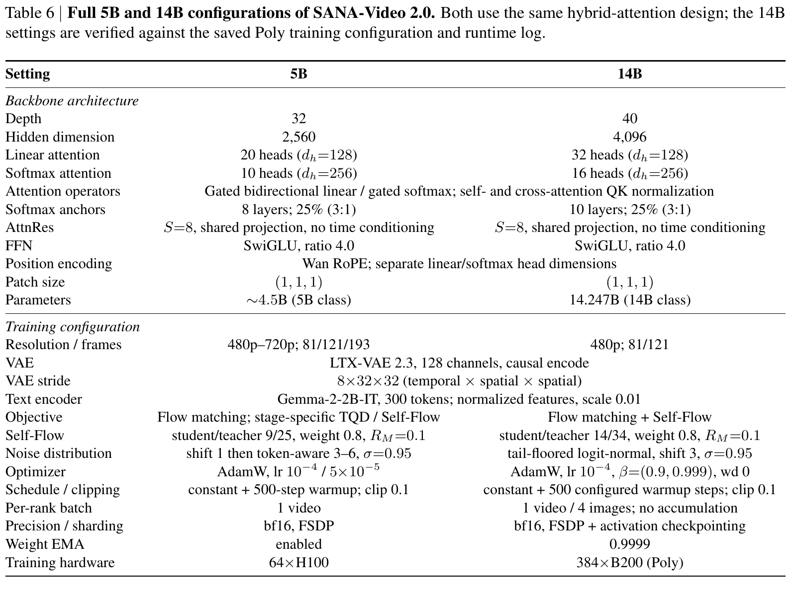

# SANA-Video 2.0 精读

> [!info] 文档关系
> - 文档类型：Paper
> - 领域入口：[README](../README.md)
> - 上位汇总：[近半年多模态视觉生成模型全景](../surveys/visual-generation-model-landscape.md)
> - 证据资产：`../assets/papers/sana-video-2/`
> - 证据索引：[Figure inventory](../evidence/figure-inventory.md)

> 资料状态：已核验 31 页 arXiv PDF/source 和官方 NVlabs/Sana commit `6298508fcb511762a11c42cff45b2fc9fd930325`。该 commit 尚无完整 5B/14B、AttnRes、Sol-Engine/QAT production 实现。

## 修订信息

- 版本：`1.0.0`
- 修订 ID：`rev-sana-video-2-1.0.0`
- 时间：`2026-07-28T20:30:00+08:00`
- 类型：initial

## 1. 核心结论

SANA-Video 2.0 是 parameter-dense video DiT family：

| Variant | 参数 | active | 结构 | 精度/分片 |
|---|---:|---:|---|---|
| 5B class | 约 4.5B | 同规模 | 32 层，3:1 linear/softmax | bf16、FSDP |
| 14B class | 14.247B | 同规模 | 40 层，3:1 linear/softmax | bf16、FSDP+activation checkpointing |

“75% linear attention、25% softmax attention”描述 layer/operator schedule，不是参数 MoE；Sol-Engine 的 sparse attention 也不改变基础模型的 total/active 参数口径。

## 2. 方法

> 原论文 Figure 2 与完整 caption。每 8 层构成一个 block；3:1 hybrid attention 控制序列复杂度，Block AttnRes 从输入、已完成 block 和当前 partial sum 中路由深度信息。

### 2.1 Hybrid Linear–Softmax Attention

纯 softmax 随时空 token 二次增长，纯 linear attention 又可能损失精细匹配。SANA 每 4 层保留 1 个 softmax anchor，其余使用 gated bidirectional linear attention。论文把 25% 作为 quality/latency knee，而不是“最低 loss 唯一最优点”。

### 2.2 Block AttnRes

连续 linear layers 容易形成低秩/深度退化。AttnRes 每 8 层汇总一次 completed feature，用共享 query 在输入、历史 block summary 和当前 partial sum 上做深度路由。它稀疏的是跨深度来源，不是 parameter expert。论文的 probe 显示深层 rank 提升约 11.7%，但最终 MSE 差只有 0.00041；结构解释比质量因果更强。

### 2.3 训练与数据

- 预训练：约 30M clips，480p、5 秒，TQD + Self-Flow。
- continual：约 10M clips，480→720p、5→8 秒，Self-Flow。
- SFT：约 $10^4$ clips，720p、8 秒，standard flow matching。
- 5B 使用 64×H100；14B 使用 384×B200。总 steps、GPU-hours、数据来源权重与许可没有披露。

## 3. 效率证据的正确读法

> 原论文 Figure 5。H100、bf16、batch 1、compiled、无 AttnRes；三组都是 DiT-forward profile。横轴“60s”由 720p/24fps tensor shape 构造，不是完整 60 秒视频生成。

Figure 5 的 1.16×—3.17×衡量 matched backbone forward。模型规模越大、序列越长，softmax anchor 的二次成本越明显；但这些数字不能直接转成端到端生成 FPS。

> 原论文 Table 4。720p、8 秒，包含 denoising 和 VAE decoding；B200 62.65→17.52 秒、3.58×，H100 95.08→33.43 秒、2.84×。

Sol-Engine 逐级叠加：

1. kernel optimization；
2. diffusion cache，并把 NFE 50→33；
3. sparse attention。

因此 3.58× 是系统配方，不是 backbone 的单项收益；也不能与 Figure 5 的 forward speedup 相乘。

## 4. 配置证据

> 原论文 Table 6。它给出深度、hidden、head、anchor、AttnRes、VAE、objective、optimizer、bf16/FSDP 和训练硬件，是参数/dtype 口径的主要证据。

## 5. Infra 含义

- 14.247B bf16 权重仅参数下界约 28.5GB，未计 activation、optimizer、VAE、text encoder 与 EMA。
- 720p/长视频首先受时空 token 和 attention/HBM 流量制约，因此需要 linear attention、fusion 和 cache 共同工作。
- cache 与 sparse attention 是近似计算，必须同时报告质量、NFE 和 hardware；不能只报告 speedup。
- 5B/14B production config 与 AttnRes/Sol-Engine 未完整进入公开 commit，可复现性低于论文表格的披露程度。

## 6. 局限

- OpenReview 不适用；未发现公开论坛。
- 训练 steps/GPU-hours、数据来源权重、过滤/去重/许可缺失。
- 官方代码尚不能完整复现论文 5B/14B、AttnRes 和 Sol-Engine。
- efficiency 图分别测 backbone forward 和 end-to-end stack，不能混为一个乘法链。

## 来源

- [arXiv:2607.21553](https://arxiv.org/abs/2607.21553)
- [NVlabs/Sana](https://github.com/NVlabs/Sana)
