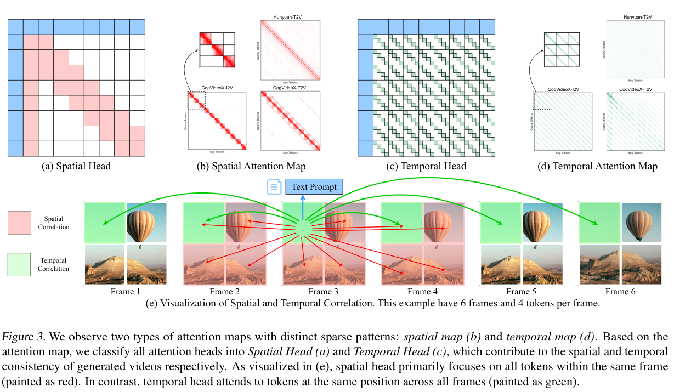
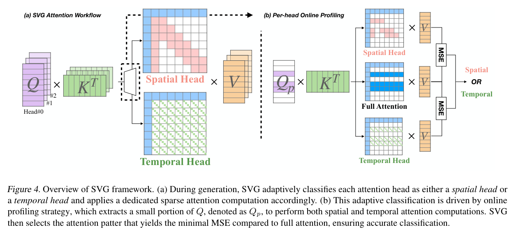
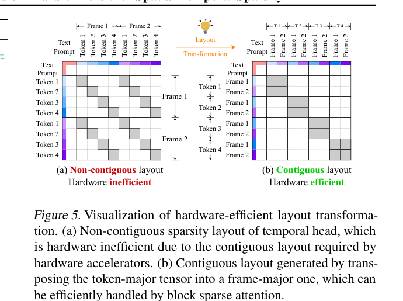
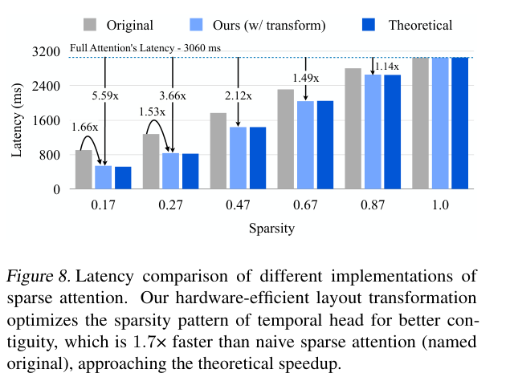

---
tags:
  - paper
  - collection/multimodal-generation
  - domain/model-systems
  - status/deep-review
  - topic/video-generation
  - method/spatial-temporal-sparse-attention
document_type: paper
domain: multimodal_generation
collection: Multimodal Generation
review_status: deep-review
canonical: true
---

# Sparse VideoGen: Accelerating Video Diffusion Transformers with Spatial-Temporal Sparsity 精读分析

> [!info] 文档关系
> - 文档类型：Paper
> - 领域入口：[README](../README.md)
> - 上位汇总：[Diffusion 多模态生成与 AI Infra](../surveys/multimodal-diffusion-infra.md)
> - 证据资产：`../assets/papers/sparse-videogen/`
> - 相关文档：[Figure inventory](../evidence/figure-inventory.md)

> 资料状态：已核验 arXiv v2 PDF 与 LaTeX source。四张证据图均为 `1530×1980` PDF 页面坐标系的紧裁剪，逐张保留完整 caption 并完成原分辨率 QA。官方代码仓库 commit 只能由既有记录确认，工作树本轮未取得，因此代码实现细节标为 blocked。

## 修订信息

- 当前修订 ID：`rev-sparse-videogen-obsidian-properties-20260731`
- 当前文档版本：`1.0.2`
- 当前修订时间：`2026-07-31T10:00:00+08:00`
- 替代版本：`rev-sparse-videogen-affiliation-backfill-20260730` / `1.0.1`

| 修订 ID | 文档版本 | 时间 | 修订者 | 类型 | 替代修订 | 迁移问题/解析 | 变更摘要 | 原因 | 影响位置 | 依据 | 对结论影响 |
|---|---|---|---|---|---|---|---|---|---|---|---|
| `rev-sparse-videogen-1.0.0` | `1.0.0` | `2026-07-25T23:00:00+08:00` | `paper-deep-review agent` | `initial` | 无 | 无 | 首次冻结完整单篇 review | 补齐 canonical Paper 交付标准 | 本文、[Figure inventory](../evidence/figure-inventory.md) | PDF/source 与四图原分辨率 QA | material |
| `rev-sparse-videogen-affiliation-backfill-20260730` | `1.0.1` | `2026-07-30T23:30:00+08:00` | `/root` | `metadata-update` | `rev-sparse-videogen-1.0.0` / `1.0.0` | 无 | 补充作者—机构元数据与角色证据边界 | 统一回填 affiliation 交付字段 | `作者与机构` | 论文 PDF 标题页、机构编号与角色脚注 | none：不改变方法、实验与归因结论 |
| `rev-sparse-videogen-obsidian-properties-20260731` | `1.0.2` | `2026-07-31T10:00:00+08:00` | `/root` | `metadata-update` | `rev-sparse-videogen-affiliation-backfill-20260730` / `1.0.1` | 无 | 增加 Obsidian YAML Properties 与层级标签 | 全量 canonical Paper 标签补齐 | 文件头 YAML frontmatter | 已验证的 ICML 2026 标签 schema；仓库覆盖矩阵 | none：不改变论文分析与证据结论 |

## 0. 资料与配图索引

- 论文：[arXiv:2502.01776v2](https://arxiv.org/abs/2502.01776v2)，27 April 2025，核验 SHA-256 `e99b9a439a16fed428e4748b42d139fd4e2e85e4fbd311aabc6d9451edb363a6`。
- LaTeX source：[official arXiv source](https://arxiv.org/src/2502.01776v2)，核验 SHA-256 `f7d7e3f8d8bc0c9f6140b71001c23b5d8de3fc1bcff4ac2f5e6f62bdabf29ee2`。
- 代码：论文指向 `https://github.com/svg-project/Sparse-VideoGen`；既有本地证据记录远端 commit `f89aedaf169ac2ae5b186bda674e53c3dc08c476`，但本次没有可审计工作树，见第 9 节。
- OpenReview：公开评审核验记录；未提供本地公开评审、decision 或 rebuttal，按证据边界跳过。
- 图表与 bbox：[Figure inventory](../evidence/figure-inventory.md)。
  - Figure 3：`../assets/papers/sparse-videogen/fig3_spatial_temporal_head_masks_caption.png`。
  - Figure 4：`../assets/papers/sparse-videogen/fig4_svg_workflow_caption.png`。
  - Figure 5：`../assets/papers/sparse-videogen/fig5_layout_transformation_caption.png`。
  - Figure 8：`../assets/papers/sparse-videogen/fig8_sparse_kernel_latency_caption.png`。
- 视觉证据边界：保留原论文 Figure 3、Figure 4、Figure 5 与 Figure 8；未用生成图替代论文机制或系统结果证据。

## 0.1 术语与符号解释

### 0.1.1 术语表

| 术语 | 本文含义 | 别名 | 不等于/易混项 | 证据来源 |
|---|---|---|---|---|
| 3D full attention | 在所有视频 token 上执行的 dense spatiotemporal attention | dense attention | 不是只在单帧内的 2D spatial attention | PDF Sec. 1, 3.3 |
| Spatial Head | 在当前 input 与 denoising step 上，更接近 spatial mask 输出的 attention head | spatial pattern/head | 不是固定层类型；不是永远只看一帧 | PDF Sec. 3.1, 4.1；Fig. 3–4 |
| Temporal Head | 在当前 input 与 denoising step 上，更接近 temporal slash mask 输出的 head | temporal pattern/head | 不是 causal temporal attention，也不是静态 head 标签 | PDF Sec. 3.1, 4.1；Fig. 3–4 |
| Online profiling | 对少量 query rows 同时计算 full、spatial、temporal 输出并按 head 的 MSE 选择 mask | sampling-based identification | 不是离线 calibration；不是对所有 rows 永远做 full attention | Algorithm 1；PDF Sec. 4.1；Table 3 |
| Oracle profiling | 对 100% rows 执行上述模式比较的质量参照 | full-row profiling | 不等于最终 dense inference baseline | Table 3 |
| Layout transformation | 将 temporal-head token-major 非连续访问重排为 frame-major 连续布局，再逆置换输出 | reorder, transpose | 不改变所选 mask、保留比例或注意力数学结果；属于 serving/runtime stage | PDF Sec. 4.2；Fig. 5 |
| Sparsity ratio | 论文表格/公式中的实际保留计算比例，如 $c_s/N$ 或 $c_t/L$ | sparse ratio | 易与“被跳过比例”混淆；Table 4 的 ratio 越大，保留越多 | PDF Sec. 3.3, 5.4；Table 4 |
| System-algorithm co-design | online mask choice、layout、block-sparse/custom kernels 与 FP8 的组合路径 | SVG stack | 完整栈速度不能自动归因给任一单组件 | PDF Fig. 7；Sec. 4–5 |

### 0.1.2 符号表

| 符号 | 含义 | 性质 | 作用域/索引 | 单位/取值 | 来源 | 易混点 |
|---|---|---|---|---|---|---|
| $B$ | batch size | author-defined | attention call | count | Algorithm 1 | 实验未给 serving batch telemetry |
| $H$ | Algorithm 1 中的 attention-head 数；复杂度段又用于 hidden dimension | author-defined, overloaded | per model | count | Algorithm 1；PDF Sec. 3.3 | 同一字母在论文两处语义不同 |
| $S$ | 总 token 数 | author-defined | per attention call | tokens | Algorithm 1 | 约等于 $LN$，但 text/first-frame token 被理论式忽略 |
| $D$ | 每个 attention head 的维度 | author-defined | per head | 64 or 128 examples | Algorithm 1；PDF Sec. 4.3 | 不等于复杂度段的 hidden dimension $H$ |
| $L$ | 每帧 token 数 | author-defined | per request | 4080 or 3600 | PDF Sec. 3.3, 5.1 | 不等于视频输出帧数 |
| $N$ | latent frame 数 | author-defined | per request | 11 or 33 | PDF Sec. 3.3, 5.1 | 输出视频报告 80/128 frames，VAE 后 latent frames 更少 |
| $c_s$ | spatial head 保留的邻近帧数 | author-defined | model/run config | 4 or 10 frames | PDF Sec. 3.3, 5.1 | 保留比例为 $c_s/N$ |
| $c_t$ | temporal head 每个 query 保留的 token 数 | author-defined | model/run config | 1224 or 1200 tokens | PDF Sec. 3.3, 5.1 | 保留比例为 $c_t/L$ |
| $t$ | profiling 抽样 query-row 数 | author-defined | profiling call | rows, example 32 | Algorithm 1 | 与 denoising timestep 俗称 $t$ 易混 |
| $x$ | profiling 抽样比例 | author-defined | per profiling call | 0.1%–100%, default 1% | PDF Sec. 4.1, Table 3 | 不是 sparsity ratio |
| $Q,K,V,O$ | query、key、value、attention output | author-defined | tensor $[B,H,S,D]$ | tensor | Algorithm 1 | $Q_p$ 仅为 sampled query rows |
| $P$ | token-major 到 frame-major 的 permutation | author-defined in commented derivation | temporal runtime layout | permutation | LaTeX `text/5_Methodology.tex` | 源码把等价式置于注释；实现存储格式未核验 |
| $r_s,r_t$ | spatial/temporal 保留比例 | analysis-derived | per head | $c_s/N$, $c_t/L$ | 本文 §8 | 不是 paper 独立符号 |
| $b$ | 每元素字节数 | analysis-derived | datatype dependent | bytes | 本文 §8 | FP8/BF16 路径不同，论文未给全部 dtype |
| $B_{\mathrm{eff}},U_B$ | 有效带宽与峰值带宽利用率 | analysis-derived | measured kernel/path | bytes/s, ratio | 本文 §8.4 | 论文缺 bytes/time telemetry，不能数值化 |

## 1. 论文基本信息

### 作者与机构

- 第一作者（首位列名）：Haocheng Xi → University of California, Berkeley。
- 共同第一作者（仅含论文明确标注者）：
  - Shuo Yang → University of California, Berkeley
- 通讯作者/通讯联系人（仅含论文明确标注者）：
  - Chenfeng Xu → University of California, Berkeley
- 其他作者涉及的机构（去重列举，不作逐作者映射）：University of California, Berkeley；Massachusetts Institute of Technology；NVIDIA；Tsinghua University。
- 对应依据：论文 PDF 标题页、作者机构编号与角色脚注（核验日期：2026-07-30）。

- 标题：Sparse VideoGen: Accelerating Video Diffusion Transformers with Spatial-Temporal Sparsity。
- 作者：Haocheng Xi、Shuo Yang、Yilong Zhao 等。
- 版本：arXiv:2502.01776v2，Preprint，2025；LaTeX 使用 ICML 2025 arXiv style，不能据此推断正式接收。
- 研究领域：video diffusion transformer inference、sparse attention、GPU kernel/system optimization。
- 核心问题：如何在不训练模型的情况下，把 3D full attention 的动态 head-level 稀疏性转成真实端到端加速，同时尽量保持 dense 输出质量。
- 关键约束：模式随 prompt 与 denoising step 改变；temporal stride 布局对硬件不友好；稀疏后小算子与 layout traffic 可能主导；系统实测只在 H100 80GB HBM3、CUDA 12.4 上完整报告。

## 2. 研究动机与问题—方案闭环

### 2.1 出发点与背景痛点

作者明确指出，视频 DiT 把图像模型的 2D attention 扩展为跨时空 token 的 3D full attention；随着 latent frames 和每帧 token 增长，attention 的二次复杂度使几秒 720p 视频仍需数十分钟生成（author-stated，Abstract/Introduction）。这不是单纯的训练成本问题，而是 off-the-shelf video generator 的推理部署瓶颈。

Figure 3 给出本文的经验触发点：不同 head 的 attention map 常呈现 frame-nearby block 或 same-position-across-frames slash 两类结构。若多数权重集中在少量时空相关 token，dense QK/AV 的大量运算可能冗余。然而“看到稀疏”并不等于“能加速”：模式选择、内存布局和 kernel 实现共同决定收益。

### 2.2 现有方案为何不够

第一类失败是单一稀疏模式的表达不足。Spatial-only 会丢掉跨帧同位置依赖，temporal-only 会丢掉帧内与邻帧结构；MInference 的通用 block pattern 也难匹配论文所示 slash-wise temporal pattern（author-stated，Sec. 2, 5.2）。根因是视频 head 的主导依赖形态不同，且会随 input 与 denoising step 变化。

第二类失败是 oracle pattern choice 本身不经济。对每个 head 的全部 rows 同时计算 full、spatial、temporal attention 可以选出较小 MSE 的 mask，但它保留了 full attention 成本，不能作为最终加速路径（author-stated，Sec. 3.2, 4.1）。

第三类失败是理论 FLOPs 与实际硬件效率脱节。Temporal head 在 token-major layout 中以 stride $L$ 跨帧访问，无法形成 accelerator 需要的连续 tile；直接套通用 sparse kernel 会受到 gather、metadata、低利用率和额外流量限制（author-stated，Sec. 4.2；Fig. 5）。即使 attention 变快，head-dimension QK-norm/RoPE 等小算子也会暴露为新瓶颈。

### 2.3 目标问题与成功标准

- 核心目标：training-free 地为每个 input/step/head 选择 spatial 或 temporal sparse mask，并让两类 mask 在 GPU 上获得端到端收益。
- 成功标准 1：默认 1% profiling 接近 100% oracle profiling 的 PSNR/SSIM/LPIPS。
- 成功标准 2：layout transform 的 sparse kernel 接近理论稀疏加速，优于 naive/original layout。
- 成功标准 3：在 CogVideoX-v1.5、HunyuanVideo 等 off-the-shelf models 上降低 latency/FLOPs，同时保持对 dense output 的相似性与 VBench 指标。
- 明确边界：不改变模型训练；不解决全部 denoising-step 数；不证明所有 GPU/NPU 上可移植；也不等同于独立人类偏好质量评估。

### 2.4 核心方案如何解决并优化问题

SVG 先在 profiling stage 对少量 query rows 计算 full 与两种 sparse attention 输出，按每个 head 的 MSE 选择 spatial/temporal mask；随后在 inference attention stage 应用所选 mask。对 temporal head，runtime stage 把 token-major tensor 置换为 frame-major，使跨帧同位置 token 连续，再调用 block-sparse attention 并逆置换输出。最后以定制 QK-norm/RoPE、Triton fused profiling/reorder、FlashInfer block-sparse 与可选 FP8 兑现硬件收益。

| 原始问题/失败模式 | 根因或约束 | 对应方案设计 | 改变的变量/系统行为 | 作用机制 | 预期优化及指标 | 证据来源 | 判断 |
|---|---|---|---|---|---|---|---|
| 静态/单一 mask 不能覆盖 head 动态性 | head pattern 随 input 与 denoising step 变化 | 1% online profiling | 从固定标签变为每次动态 per-head mask choice | sampled rows 上比较 sparse 与 full 输出 MSE | oracle-like PSNR/SSIM/LPIPS，低 overhead | Algorithm 1；Table 3 | supported on one subset |
| Spatial-only 或 temporal-only 各丢一类依赖 | 视频依赖同时包含帧内/邻帧与跨帧同位置结构 | 双 mask candidate set | 每个 head 选择不同 receptive pattern | 保留与该 head 更匹配的结构 | quality 高于单-pattern baselines | Fig. 3–4；Table 1 | partial：完整方法比较有系统混杂 |
| Temporal slash pattern 理论稀疏但硬件低效 | stride-$L$ 访问不连续 | layout transformation | token-major 改为 frame-major contiguous blocks | 等价置换改善 locality/tile utilization | sparse kernel latency 接近 theoretical | Sec. 4.2；Fig. 5, 8 | supported at H100 kernel level |
| attention 变快后小算子暴露 | head dim 64/128 的并行度不足 | CUDA sub-warp QK-norm/RoPE 与 Triton fusion | 减少 launch、中间读写和低占用 | fused/reduction kernels 提高吞吐 | QK-norm/RoPE microbench speedup | Table 2 | partial：微基准不能等比例外推 E2E |
| Hunyuan sparse attention 仍有算力/带宽成本 | operand bytes 与 Tensor Core throughput | FP8 sparse attention | operand precision 降低 | 更少 bytes、利用 H100 FP8 path | latency 1171 s 到 968 s，PSNR 小降 | Table 1；Fig. 7 | supported only as sequential H100 stage |

### 2.5 完整因果链与证据闭环

因果链是：720p video DiT 的长 context 使 3D full attention 二次增长；Figure 3 观察到 head-level spatial/temporal concentration，但模式随 input/step 改变且 temporal layout 非连续；因此 SVG 以 sampled full-vs-sparse MSE 动态选 mask，再用 layout transformation、block-sparse/custom kernels 与可选 FP8 改变保留运算量、内存连续性和数值格式；Table 3、Figure 8 与 Table 1 分别测量模式选择质量、kernel latency 和端到端 latency/quality。

直接支持的环节包括：1% vs 100% profiling sensitivity；transformed vs original temporal-layout kernel；完整 SVG vs dense 的端到端 latency。间接或混杂的环节包括：Figure 3 的模式观察并非逐 head causal ablation；完整方法优于单-pattern baseline 同时叠加动态选择和工程栈；Figure 7 的 1.81× sparse stage 捆绑 profiling、layout 与 kernel。未验证边界包括跨硬件 portability、真实 HBM bytes/利用率、代码级 dtype/layout、跨 prompt/domain 方差，以及人类偏好质量。

## 3. 核心贡献与创新点

1. 把 video DiT attention 的稀疏性建模为动态 spatial/temporal head pattern，而非单一静态 mask（Fig. 3–4）。
2. 用约 1% query rows 的 online profiling 近似全量 oracle pattern choice，避免 full-row identification 取消加速收益（Algorithm 1；Table 3）。
3. 用等价 layout transformation 把 temporal stride pattern 转为连续 block，以系统设计弥合理论 FLOPs 与 kernel latency（Fig. 5, 8）。
4. 把 sparse attention 与 custom small kernels、Triton/FlashInfer 和 FP8 串为 H100 上的端到端路径（Table 1–2；Fig. 7）。

## 4. 研究方法

### 4.1 方法总览

输入是 video DiT 当前 denoising step 的 $Q,K,V$。Profiling stage 从 query rows 抽取 $Q_p$，分别得到 full、spatial、temporal attention output；每个 head 选择相对 full output MSE 更小的 candidate。Sparse-attention stage 依 head mask 执行不同保留结构。Serving/runtime stage 对 temporal head 做 permutation、block-sparse attention 与 inverse permutation；其余 custom kernels 与 FP8 属于执行优化，不改变 candidate-set 定义。

### 4.2 组件级设计动机与具体问题映射

| 设计项 | why 状态 | 原文证据 | 针对的具体问题 | 因果机制 | 替代/权衡 | 验证证据 | 判断 |
|---|---|---|---|---|---|---|---|
| Spatial mask | author-stated | Sec. 3.1, Fig. 3 | 帧内/邻帧相关性集中 | 保留连续 frame blocks | dense 更稳；窗口过小伤质量 | single-pattern baseline + maps | partially supported |
| Temporal mask | author-stated | Sec. 3.1, Fig. 3 | 跨帧同位置依赖 | 以 stride $L$ 保留对应位置 | 通用 blocks 更易执行但不匹配 slash pattern | temporal-only baseline + maps | partially supported |
| Per-head online choice | author-stated | Sec. 4.1, Algorithm 1 | pattern 随 input/step 动态变化 | sampled output MSE 选择更近似 full 的 mask | offline 更便宜但不自适应；oracle 太贵 | Table 3 | supported on sampled VBench subset |
| 1% sampling | author-stated | Sec. 4.1, Table 3 | 降低 profiling overhead | 只对少量 rows 执行三路比较 | 更小样本快但可能误判；更大样本稳但贵 | 0.1/1/5/100% sensitivity | supported without variance |
| Skip first 25% denoising steps | author-stated | Sec. 5.1 | early steps 对生成质量关键 | early stage 保持 dense attention | 降低可加速覆盖范围 | 与 baselines 共用设置，缺独立消融 | plausible/unverified |
| Layout transformation | author-stated | Sec. 4.2, Fig. 5 | temporal stride layout 不连续 | permutation 令同位置跨帧 token 连续 | reorder 产生额外流量；gather/scatter 更通用 | Fig. 8 | supported at kernel level |
| Block-sparse kernel | author-stated | Sec. 4.3, 5.3 | 通用 dense kernel 不兑现 sparsity | 只计算保留 blocks | metadata/tile 约束、硬件依赖 | Fig. 8 | supported, implementation blocked |
| Custom QK-norm/RoPE | author-stated | Sec. 4.3, Table 2 | small head dimension 利用率低 | sub-warp reduction 提高并行效率 | PyTorch 可移植但慢 | replacement microbench | supported only for microbenchmark |
| Fused profiling/reorder | author-stated | Sec. 4.3 | launch 与中间 tensor overhead | Triton fusion 减少 materialization | fusion 增加维护/portability 成本 | 无独立端到端消融 | plausible/unverified |
| FP8 sparse attention | author-stated | Sec. 4.3, Table 1 | Hunyuan attention 仍昂贵 | 降低 bytes 并利用 H100 FP8 | 精度/scale/accumulation 风险 | sequential final stage | supported on H100 only |

### 4.3 模型/系统架构与 layout

Figure 5 的关键是 stage qualification：mask discovery 决定“算哪些 token”；layout transformation 决定“这些 token 如何存取”；block-sparse kernel 决定“如何执行”。置换不应被写成改善 attention quality，也不应把 kernel latency 改善归因成更好的 sparse candidate。

### 4.4 关键公式

忽略 text prompt 与 first-frame sink 后，令每帧 token 为 $L$、latent frames 为 $N$、hidden dimension 为 $H$，论文给出 full attention 的 QK 与 AV 工作量：

$$
\mathrm{FLOPs}_{\mathrm{full}} = 4L^2N^2H.
$$

Spatial head 只保留 $c_s$ 个邻近 frames：

$$
\mathrm{FLOPs}_{\mathrm{spatial}} = 4L^2Hc_sN,\qquad r_s=\frac{c_s}{N}.
$$

Temporal head 每个 token 保留 $c_t$ 个跨帧 tokens：

$$
\mathrm{FLOPs}_{\mathrm{temporal}} = 4N^2Hc_tL,\qquad r_t=\frac{c_t}{L}.
$$

对置换矩阵 $P$，LaTeX source 的注释推导表达了等价性：

$$
\operatorname{Attention}(PQ,PK,PV)=P\operatorname{Attention}(Q,K,V),
$$

最终再乘 $P^\top$ 恢复原顺序。该式说明数学输出可等价，不代表 permutation 是零成本。

### 4.5 训练、实验与部署设计

SVG 不训练模型。CogVideoX-v1.5 的 latent attention shape 报告为 11 frames × 4080 tokens/frame，HunyuanVideo 为 33 × 3600；输出视频分别报告 80/128 frames。配置取 CogVideoX $c_s=4,c_t=1224$，Hunyuan $c_s=10,c_t=1200$，作者称约 30% 保留比例。所有 baselines 跳过前 25% denoising steps 的稀疏化。Quality 用 dense output 为参照的 PSNR/SSIM/LPIPS，以及 VBench Image Quality/Subject Consistency；这测量保真与 benchmark quality，不等于全面人类偏好。

## 5. 主要技术主张与证据矩阵

### 5.1 主结果

Table 1 报告：

- CogVideoX I2V：528 s 到 237 s，2.23×；T2V：528 s 到 232 s，2.28×。
- HunyuanVideo：2253 s 到 1171 s，1.92×；加 FP8 后 968 s，2.33×。
- Hunyuan FP8 的 PSNR 从 29.546 到 29.452，绝对下降 0.094，约 0.32%；LPIPS 从 0.127 到 0.128。
- Hunyuan reported FLOPs 从 612.37 PFLOPs 到 259.79 PFLOPs，约下降 57.6%，但 latency 下降比例受非-attention 运算与 kernel 利用率影响。

### 5.2 技术 claim 证据矩阵

| 技术点 | 声称收益 | 对应证据 | 对照控制 | 指标变化 | 分类 | 结论 |
|---|---|---|---|---|---|---|
| 双 spatial/temporal pattern | 同时保持空间与时间一致性 | Fig. 3；Table 1 single-pattern baselines | 完整方法还含 dynamic choice/kernels | PSNR/LPIPS 优于 baselines | confounded + mechanism visualization | partially supported |
| 1% online profiling | 接近 oracle | Table 3 | matched profiling ratio | PSNR 31.118 vs 31.324；LPIPS 0.0757 vs 0.0744 | direct sensitivity | supported on random subset; no variance |
| Layout transformation | 兑现 temporal sparsity | Fig. 8 | original vs transformed under Hunyuan config | caption 报 1.7× faster；10% ratio 总 3.63× | direct kernel ablation | supported on H100 configuration |
| Custom QK-norm/RoPE | 小算子加速 | Table 2 | PyTorch replacement | average 7.4× / 15.5× | replacement microbench | supported only at micro level |
| Sparse stack | 最大 E2E incremental gain | Fig. 7 | sequential build-up | reported 1.81× stage | confounded bundle | 不能拆分 profiling/layout/kernel |
| FP8 | 额外 throughput | Table 1；Fig. 7 | sequential final stage | 1171 s to 968 s；PSNR -0.094 | sequential direct | supported on H100/Hunyuan |
| Wan 2.1 1.51× | 扩展到第三个 model family | Abstract/Appendix visuals | 主定量表缺完整 row/config | 1.51× only | incomplete result evidence | unverified in this delivery |

### 5.3 假设验证

动态 mask choice 的必要性只有“patterns vary”与 online sensitivity 的组合支持，缺少 matched static-offline vs online assignment 的独立实验。Layout 假设获得最强的受控 kernel 证据。完整质量结论较可信地表明 SVG output 接近 dense output，但 random VBench subsets、无方差、无独立人评限制外推。

### 5.4 收益来源归因

| 组件/变化 | 对比 | 指标变化 | 影响路径 | 证据强度 |
|---|---|---|---|---|
| efficient small kernels bundle | baseline -> efficient kernel | 约 1.06×，由 Fig. 7 图示读取 | runtime only | rough/confounded |
| profiling + masks + layout + block sparse | efficient kernel -> sparse stage | 约 1.81× | fewer attention blocks + executable layout | rough/confounded |
| FP8 | sparse -> sparse+FP8 | 1171 s -> 968 s，约 1.21× | dtype/runtime | sequential direct |
| complete stack | 2253 s -> 968 s | 2.33× | algorithm + runtime | direct full-system comparison |

前三项乘积约为总倍率只能说明 sequential breakdown 自洽，不是正式方差分解。尤其不能把 1.81× 全部归于“稀疏模式发现”，也不能把 Table 2 的 7–15× 微基准直接映射为 E2E 倍率。

## 6. Related Work 对比

| 类别/工作 | 机制 | 优点 | 局限 | 与本文关系/公平性 |
|---|---|---|---|---|
| DiTFastAttn | spatial-only locality | 连续 block 易执行 | 忽略 temporal-head slash pattern | SVG 对其优势同时包含 dynamic selection 与更多 kernels |
| Temporal-only baseline | same-position cross-frame mask | 保留 temporal dependencies | 丢帧内/邻帧结构 | 本文手工 baseline，用于说明单一 pattern 不足 |
| MInference | mean-pooled block sparse pattern | 长上下文通用 | 论文称难匹配 slash-wise video pattern | 缺本地代码级公平性核验 |
| PAB | step/layer cache reuse | 避免部分 attention computation | 可能质量下降；Hunyuan row OOM | 与 sparse attention 机制不同，不能归因 mask quality |
| FlashAttention-2 | exact dense fused attention | 强 dense baseline | 仍计算全部 attention | 全部 baselines 使用 FA2，但 SVG 另叠加 custom stack |
| Low-bit attention | FP8/INT quantization | 降 bytes/提升 throughput | 数值与硬件依赖 | 与 SVG 正交并在 Hunyuan final path 组合 |

## 7. OpenReview 公开评审 × 论文交叉核验

状态为 `skipped-with-reason`。PDF 标注 Preprint，本轮没有可审计的 forum/review/decision/rebuttal 材料。因此没有 reviewer claim 被当成事实；“未提供”也不等于“公开页面不存在”。

## 8. Infra 需求分析

### 8.1 算力

粗略 profiling QK/AV 工作量相对 full attention 可写为：

$$
\rho_{\mathrm{profile}}\approx x(1+r_s+r_t),
$$

其中 $x=1\%$。它只估 attention arithmetic，不含 mask generation、launch、reorder 与同步。论文正文报告约 3% runtime overhead，与这个量级相容，但不是由公式证明。

### 8.2 显存与存储

Dense score materialization 的朴素规模是 $O(BHS^2)$，FlashAttention 类 kernel 不显式存完整 score matrix。Sparse path 还需要 mask/block metadata 与 reordered Q/K/V；论文未报告 metadata width、workspace size 或 peak memory，Table 1 的 Peak Memory 列为空，因此不能量化显存收益。

### 8.3 Data Types / 数值格式

| 对象 | 格式 | 阶段 | 硬件依赖 | 影响 | 证据 |
|---|---|---|---|---|---|
| Hunyuan sparse attention operands | FP8 in optional final variant | inference | H100 FP8/Tensor Core path | 1171 s -> 968 s；PSNR -0.094 | Sec. 4.3；Table 1 |
| CogVideoX attention operands | 未明确；FP8 未应用 | inference | head dim 64 被作者称 arithmetic intensity 不足 | 不能假定 BF16 或累加格式 | Sec. 5.2 |
| QK-norm/RoPE | 未明确 | inference | CUDA sub-warp implementation | microbenchmark faster | Sec. 4.3；Table 2 |
| block metadata / permutation indices | 未报告 | runtime | Triton/FlashInfer | 额外 storage/traffic 未知 | Sec. 4.3 |

FP8 的 scale granularity、accumulation dtype、packing/layout 与 dequantization 均未披露，也无法由缺失的代码工作树补齐。

### 8.4 带宽、互联与有效利用率

若 permutation 未与相邻算子融合，对 Q/K/V/O 的一次读写下界可粗写为：

$$
\mathrm{Bytes}_{\mathrm{permute}}\gtrsim 2b\left(|Q|+|K|+|V|+|O|\right).
$$

有效带宽与利用率应由：

$$
B_{\mathrm{eff}}=\frac{\mathrm{BytesMoved}}{\mathrm{RuntimeSeconds}},\qquad
U_B=\frac{B_{\mathrm{eff}}}{B_{\mathrm{peak}}}.
$$

论文只给总 latency/相对 speedup，没有 kernel bytes、memory transactions、achieved bandwidth 或 HBM3 peak normalization，故不能声称具体利用率。Figure 8 支持 transformed layout 改善实际 latency，但无法区分 locality、tile occupancy、metadata 或 fusion 各自贡献。

### 8.5 CPU/GPU/NPU 异构执行

完整验证仅为单张 H100 80GB HBM3 + CUDA 12.4。论文没有报告 CPU prompt preprocessing、host-device transfer、pinned memory、DMA、pipeline overlap、NPU kernels、fallback path、multi-GPU NVLink/PCIe/RDMA 或 serving scheduler。可支持的结论仅是 NVIDIA GPU inference path，不能外推到异构 serving。

### 8.6 调度、Serving 与自定义算子

论文明确涉及 CUDA QK-norm/RoPE、Triton fused profiling/reorder、FlashInfer block-sparse kernel；未报告 CUDA graph、continuous batching、request scheduler 或 SLA。Mask 是否每层/每 step 重算、是否缓存及生命周期未被完整描述，是部署复现关键缺口。

## 9. 开源代码对照

- 官方 URL：`https://github.com/svg-project/Sparse-VideoGen`。
- 既有本地记录的远端 commit：`f89aedaf169ac2ae5b186bda674e53c3dc08c476`。
- 本地工作树：不存在；本次不得下载新材料。
- 分类：`blocked`，而不是把论文或 README 描述当成代码事实。

既有 formal evidence 仅记录远端 tree 曾显示 `svg/flashinfer_patch.py`、`svg/kernels/ops/attention_ops*.py`、`svg/kernels/triton/{permute,layernorm}.py` 与 CUDA `ops.cu` 等路径，并记录 clone/codeload/raw-file 获取失败。因为没有文件内容，本报告不声称 tensor stride、block size、FlashInfer API、dtype、scale、launch configuration、mask cache 或 Wan path 已实现。代码 commit 仅作为 remote provenance，不满足逐文件 cross-check。

Checkpoint/model metadata 也未在本地提供；模型结构与容量仅采用论文明确报告的 latent frame/token/head dimension，不从 README 推断权重配置。

## 10. 优点与局限

### 优点

- 论文把 pattern、dynamic choice、layout 与 kernel 串成可测的系统链，而非只报告理论 FLOPs。
- Table 3、Figure 8、Figure 7 分别覆盖 profiling sensitivity、layout kernel ablation 和 E2E breakdown。
- Training-free，能作用于多个现成 video DiT；FP8 展示了与低精度的组合空间。

### 局限

- 系统 telemetry 只覆盖单 H100，缺跨硬件/负载/批量验证。
- 1.81× sparse stage 捆绑 profiling、mask、layout 与 kernel，组件归因不充分。
- 代码、checkpoint metadata 与具体 kernel config 本次不可审计。
- Quality 主要是相对 dense output 的像素/感知相似性与有限 VBench subset，缺方差和独立人评。
- “30% sparsity”实际指保留比例，术语易误读；Wan 2.1 的 1.51× 缺本地完整主表证据。
- Layout traffic、effective bandwidth、peak memory、accumulation precision 与 mask metadata 未报告。

### 可改进之处

最小补实验应在固定 model、prompt、hardware、ratio 下分别关闭 online choice、layout transform、custom small kernels 与 FP8；同时报告 kernel time、bytes moved、achieved bandwidth、occupancy、peak memory、variance 和人评。另需 static/offline assignment vs online assignment 的 matched comparison，以直接验证动态选择的独立价值。

## 11. 研究启发

- 稀疏算法的研究对象应同时包含 candidate mask 与 executable layout；FLOPs 降低不是系统收益的充分条件。
- 对动态 pattern 可设计跨 denoising steps 的 mask cache/transition model，减少 profiling，但必须评估误判与质量漂移。
- 可在同一 mask 下比较 H100/A100/消费 GPU/NPU，分离算法稀疏性与特定 Tensor Core/kernel 收益。
- 可将 permutation 与 QKV projection、RoPE 或 output projection 融合，实测是否减少额外 HBM round-trip。

## 12. 解读问题/待验证清单

1. online mask 是每层每 step 重算，还是存在 cache；cache 生命周期与错误恢复如何？
2. 1% rows 的抽样策略是否随机、分层或固定，随机方差多大？
3. 作者对“spatial/temporal head 动态变化”的直接统计是什么；static assignment matched baseline 表现如何？
4. $P/P^\top$ 是否与相邻 kernel 融合，真实额外 HBM bytes 是多少？
5. FlashInfer block metadata、block size 与“至少 16 个连续元素”的硬件假设如何对应？
6. FP8 的 scale granularity、accumulator dtype 和 error-control 策略是什么？
7. Wan 2.1 的 1.51× 对应何种配置、硬件、质量表和 kernel path？
8. 在 batch serving 或多 GPU 下，profiling/reorder 的调度与通信成本如何变化？

## 13. 一句话总结

Sparse VideoGen 的核心贡献是把动态 spatial/temporal head 选择、连续 layout 和定制 GPU execution 串成 H100 上可兑现的 video-DiT sparse-attention 路径；2.33× 全栈结果有直接证据，但代码、跨硬件、带宽 telemetry 与组件级独立归因仍是主要不确定性。
