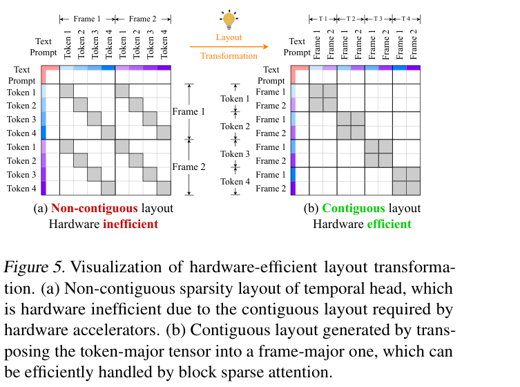

# Sparse VideoGen 精读分析
> [!info] 文档关系
> - 文档类型：Paper
> - 领域入口：[README](../README.md)
> - 上位汇总：[Diffusion 多模态生成与 AI Infra](../surveys/multimodal-diffusion-infra.md)
> - 证据资产：`../assets/papers/sparse-videogen/`
> - 相关文档：[Figure inventory](../evidence/figure-inventory.md)

> 资料状态：PDF 与 arXiv LaTeX source 已获取；官方代码仓库 HEAD 固定为 `f89aedaf169ac2ae5b186bda674e53c3dc08c476`，但 clone checkout 与逐文件下载长期阻塞，未获得可审计工作树。两张配图均为 200 DPI PDF 裁剪，含完整 caption。

## 修订信息

- 当前文档版本：`1.0.0`
- 当前修订 ID：`rev-initial-20260712`
- 当前修订时间：`2026-07-12T23:30:00+08:00`
- 替代版本：无（initial）

| 修订 ID | 文档版本 | 时间 | 修订者 | 类型 | 替代修订 | 迁移问题/解析 | 变更摘要 | 原因 | 影响位置 | 依据 | 对结论影响 |
|---|---|---|---|---|---|---|---|---|---|---|---|
| rev-initial-20260712 | 1.0.0 | 2026-07-12T23:30:00+08:00 | review_sparse_videogen | initial | 无 | 无 | 首次完整精读 | initial delivery | `analysis.md`; [Figure inventory](../evidence/figure-inventory.md) | PDF、LaTeX source、视觉 QA | material |

## 0. 资料与配图索引

- 论文：[arXiv:2502.01776](https://arxiv.org/abs/2502.01776)，核验 PDF SHA-256 `e99b9a439a16fed428e4748b42d139fd4e2e85e4fbd311aabc6d9451edb363a6`。
- LaTeX：arXiv e-print；源码文件名仅作为公式/caption 的证据定位符。
- 提取文本：`extracted_pdf/extracted_text/full_text.clean.txt`；17 页。
- 代码：官方仓库 commit `f89aedaf169ac2ae5b186bda674e53c3dc08c476`，工作树获取 blocked，见第 8 节。
- 视觉：Figure 5（机制）、Figure 7（端到端系统证据）；详见 [Figure inventory](../evidence/figure-inventory.md)。
- OpenReview：任务包无 URL，论文为技术报告，未发现可核验的公开 OpenReview 入口；不适用。
- AI 生成图：跳过；父任务要求优先 freeze，且该图是可选项。

## 0.1 术语与符号解释

### 0.1.1 术语表

| 术语 | 本文含义 | 别名 | 不等于/易混项 | 证据来源 |
|---|---|---|---|---|
| Spatial head | 主要关注同帧及邻帧连续 token block 的 attention head | spatial pattern | 不是固定 head 类型；会随 prompt/denoising step 变化 | Sec. 3.1, 4.1 |
| Temporal head | 按每帧 token 数 `L` 跨帧取同一空间位置，原布局呈 stride-`L` slash pattern | temporal pattern | 不是 causal temporal attention | Sec. 3.1, Fig. 5 |
| Online profiling | 对约 1% query rows 同时算 full/spatial/temporal 输出，以每 head MSE 选 mask | sampling-based identification | 不是离线固定 head 分类；也不是对全部 token 做 full attention | Algorithm 1, Sec. 4.1, Table 3 |
| Layout transformation | temporal head 的 token-major 到 frame-major 转置，使跨帧 token 连续 | reorder | 不改变候选 mask/算法稀疏率；仅改变执行布局 | Sec. 4.2, Fig. 5 |
| Sparsity ratio | 文中实际保留计算比例，如 `c_s/N` 或 `c_t/L` | sparse ratio | 易与“跳过比例”相反理解 | Sec. 3.2 formulas |

### 0.1.2 符号表

| 符号 | 含义 | 性质 | 作用域/索引 | 单位/取值 | 来源 | 易混点 |
|---|---|---|---|---|---|---|
| `B,H,S,D` | batch、head 数、总 token、head dimension | author-defined | attention tensor `[B,H,S,D]` | counts | Algorithm 1 | `H` 在 FLOPs 段也被用作 hidden dimension |
| `L,N` | 每帧 token 数、帧数 | author-defined | per request | tokens/frame, frames | Sec. 3.2 | Hunyuan 为 3600、33 latent frames；视频输出帧数另报 128 |
| `c_s,c_t` | spatial head 保留邻帧数、temporal head 每 token 保留 token 数 | author-defined | model config | frames, tokens | Sec. 3.2, 5.1 | 决定保留比例而非删除比例 |
| `t,x` | sampled query rows 数、采样比例 | author-defined | profiling call | rows, % | Algorithm 1, Sec. 4.1 | 论文示例 `t=32`，实验默认 `x=1%` |
| `P` | token-major 到 frame-major 的排列矩阵 | author-defined | temporal-head layout | permutation | Sec. 4.2 source comments | 正文未给显式存储格式 |

## 1. 基本信息与问题链

3D full attention 随视频 token 数平方增长；论文观察到 head-level spatial/temporal 两类稀疏结构，却同时面临三项落地障碍：模式随输入和去噪步动态变化、temporal stride 布局不连续、稀疏后小算子成为瓶颈。SVG 是 training-free 推理方案：在线抽样选 head mask，再做等价布局重排，最后调用定制 norm/RoPE、Triton 与 FlashInfer block-sparse kernels（Sec. 4）。实验覆盖 CogVideoX-v1.5 I2V/T2V 与 HunyuanVideo T2V，系统基准仅报告 H100 80GB HBM3、CUDA 12.4（Sec. 5.3）。

## 2. 核心贡献

1. 将 video DiT attention head 归为动态 spatial/temporal pattern，并用 1% sampled rows 近似 oracle pattern choice（Algorithm 1, Table 3）。
2. 将 temporal stride-`L` layout 转为 frame-major contiguous blocks，使理论稀疏可被 block-sparse kernel 利用（Fig. 5, Fig. 8）。
3. 将稀疏 attention、定制小 kernel 和 FP8 组合成 H100 上的端到端路径，HunyuanVideo 从 2253 s 降到 968 s（Fig. 7）。

## 3. 方法、设计动机与证据

### 3.1 计算与分类

Full attention 估算为 $4L^2N^2H$ FLOPs；spatial 与 temporal 路径分别约为 $4L^2Hc_sN$ 和 $4N^2Hc_tL$，保留比例为 $c_s/N$ 与 $c_t/L$。该推导忽略 text prompt 和 first-frame sink，故不是精确 runtime model（Sec. 3.2）。Algorithm 1 对 sampled query `Q_i` 计算 full/spatial/temporal 三种输出，以每 head 输出 MSE 的较小者选择 mask；它按 input 和 denoising step 在线重判，不应描述成静态 head profiling。

### 3.2 设计动机矩阵

| 设计项 | why 状态/来源 | 具体问题 | 因果机制 | 替代/权衡 | 验证 | 判断 |
|---|---|---|---|---|---|---|
| 两类 spatial/temporal mask | author-stated, Sec. 3.1 | 单一 block mask 丢失跨帧或帧内依赖 | 分别保留邻帧连续块与同空间位置跨帧 token | dense 更稳但二次复杂度；更多 pattern 更灵活但 profiling 更贵 | baseline quality + attention maps，非逐 head causal ablation | partially supported |
| 1% online profiling | author-stated, Sec. 4.1 | pattern 随输入/step 变化，离线分类失效 | sampled rows 上比较两种 sparse 输出与 full 输出 MSE | oracle 100% 更准但无加速；静态 profile 更便宜但不适应 | Table 3 sensitivity：1% vs 100% | supported（小 subset） |
| frame-major layout transform | author-stated, Sec. 4.2 | temporal stride-`L` 破坏 Tensor Core/block locality | permutation 将跨帧同位置 token 变连续，再做 block sparse attention并逆置换 | gather/scatter 或通用 sparse kernel；重排有额外流量 | Fig. 8 在 10%保留率比 naive 1.7x | supported at kernel level |
| fused/custom kernels | author-stated, Sec. 4.3 | head dim 64/128 的 QK-norm/RoPE 并行度低，小算子占比上升 | sub-warp reduction、Triton fusion、FlashInfer block sparse 减少 launch/中间读写 | PyTorch/FA2 可移植但慢 | Table 2 microbench；缺完整源码核验 | partially supported |
| FP8 sparse attention | author-stated, Sec. 4.3 | attention 仍受算力/带宽限制 | 降低 operand bytes 并利用 H100 FP8 throughput | BF16 更通用；量化有误差 | Hunyuan +FP8 1.21x incremental、PSNR -0.094 | supported on H100 only |

### 3.3 Layout 与硬件机制

Figure 5 显示 token-major temporal pattern 是跨大 stride 的离散元素；转置后变为 frame-major 局部块。数学上 permutation 可保持 attention 结果等价，但系统收益还取决于 `P/P^T` 成本、block metadata、tile shape 和 HBM traffic。论文称 Tensor Core 每维至少需要 16 个连续元素；这是 NVIDIA/H100-oriented 假设，并未在 A100、消费卡、NPU 或 CPU 上验证。

## 4. 实验、技术 claim 与收益归因

### 4.1 技术 claim 证据矩阵

| Claim | 证据 | 控制性 | 分类 | 边界 |
|---|---|---|---|---|
| 1% profiling 近似 oracle | Table 3: PSNR 31.118 vs 31.324；LPIPS .0757 vs .0744 | matched ratio sensitivity | direct sensitivity | random VBench subset，未给方差 |
| layout transform 带来 1.7x | Fig. 8, 10%保留率，3.63x total | transformed vs original sparse kernel | direct ablation | 仅 Hunyuan config/H100 |
| QK-norm/RoPE 7.4x/15.5x | Table 2 microbench | PyTorch baseline | replacement baseline | microkernel 不能直接外推 E2E |
| FP8 额外 1.21x | Fig. 7 and Table 1 | sequential stack | confounded/sequential | 同时标为 SVG final point，未展示纯 FP8 kernel breakdown |
| 总体 2.33x 且质量接近 dense | Table 1, Fig. 7 | end-to-end baseline | direct system comparison | 单 H100；quality 是对 dense output 的相似性，非人评偏好 |

### 4.2 主结果

CogVideoX I2V/T2V latency 从 528 s 降至 237/232 s（2.23x/2.28x）；Hunyuan 从 2253 s 降至 1171 s（1.92x），加 FP8 后 968 s（2.33x）。Hunyuan PSNR 29.546 到 FP8 29.452，绝对下降 0.094（约 0.32%）；这些数字来自 Table 1。

### 4.3 端到端归因

| 顺序变化 | 约 latency | incremental speedup | 可归因对象 | 证据强度 |
|---|---:|---:|---|---|
| baseline -> efficient kernel | 2253 -> 约2125 s | 1.06x | QK-norm/RoPE/其他 kernel bundle | confounded bundle |
| + sparse attention | 约2125 -> 约1174 s | 1.81x | profiling + layout + block sparse 整体 | confounded algorithm/system bundle |
| + FP8 | 约1174 -> 968 s | 1.21x | FP8 final stage | sequential direct |

总 2.33x 是完整 stack 相对 baseline；`1.06 x 1.81 x 1.21 ≈ 2.32` 只说明图中顺序倍率自洽。它不是方差分解：例如 layout transform 属于 sparse stage，不能把 1.81x 全归给 sparsity pattern；kernel 微基准的 7-15x 也未直接贡献同等 E2E 倍率。

## 5. Related Work 对比

| 方法 | 机制 | 优点 | 局限/公平性 |
|---|---|---|---|
| DiTFastAttn | spatial-only locality | 简单连续 block | 忽略 temporal-head pattern；SVG 对其质量优势同时含动态选择 |
| MInference | mean-pooled block sparse pattern | 通用长上下文稀疏 | 论文称无法选 slash temporal pattern；实现公平性未由本次代码核验 |
| PAB | 跨 step/layer cache reuse | 避免部分 attention | 机制不同且 Hunyuan OOM，不能形成完整同硬件比较 |
| FlashAttention-2 | dense fused exact attention | 强 dense baseline | 所有 baseline 使用 FA2；SVG 另叠加更多定制 kernel，算法与工程收益需拆开 |

## 6. OpenReview 交叉核验

不适用：任务包 `openreview_url` 为 unknown，论文标注 Technical Report 2025，PDF/source 未提供 OpenReview forum。按父任务要求未继续联网搜索，因此没有 reviewer claim 被用作证据。

## 7. Infra 深析

### 7.1 Compute、layout 与 memory

保留比例降低 QK/AV FLOPs，但 online profiling 对 sampled rows 仍各算 full、spatial、temporal 输出。若采样比例为 $x$，粗略 profiling QK/AV 工作量约为 $x(1+r_s+r_t)$ 倍 full attention，其中 `r_s/r_t` 为两种保留比例；论文实测默认约 3% runtime overhead。Layout transform 至少读写 Q/K/V 与输出 permutation；若每元素 `b` bytes，未融合的下界流量约 $2b(|Q|+|K|+|V|+|O|)$。论文未报告 bytes moved 或 kernel runtime，故无法计算 effective bandwidth / HBM3 peak utilization。

### 7.2 Data type 与 kernel 路径

| 对象 | 格式 | 阶段 | 依赖/影响 | 证据 |
|---|---|---|---|---|
| attention operands | FP8 in final Hunyuan variant | inference | H100 FP8；1.21x sequential，PSNR -0.094 | Sec. 4.3, Table 1, Fig. 7 |
| QK-norm/RoPE | 未明确（不可假定 BF16） | inference | CUDA sub-warp reduction，head dim 64/128 | Sec. 4.3, Table 2 |
| mask/layout metadata | 未报告 | profiling/runtime | Triton fused profiling/reorder + FlashInfer block sparse | Sec. 4.3 |

CogVideoX head dim 64 因 arithmetic intensity 不足未用 FP8，说明格式收益并非“字节更少即可”，仍受 tile utilization 与 tensor-core shape 约束。论文未报告 accumulator precision、packing、scale granularity、mask index width或中间 layout，均为复现缺口。

### 7.3 异构、互联与 serving

仅验证单张 H100 80GB HBM3 + CUDA 12.4；没有多 GPU、NVLink/PCIe/RDMA、batch scheduler、CUDA graph、CPU preprocessing overlap、NPU kernel 或 fallback 数据。因此可支持的结论是“单 NVIDIA GPU inference path”，不能外推到异构 serving。CPU 可能负责 prompt/调度但论文无 telemetry；所有 host-device transfer 与同步假设均未报告。

## 8. 代码对照与可复现性

官方 repository refs 给出 commit `f89aedaf169ac2ae5b186bda674e53c3dc08c476`，tree 列表显示 `svg/flashinfer_patch.py`、`svg/kernels/ops/attention_ops*.py`、`svg/kernels/triton/{permute,layernorm}.py` 与 CUDA `ops.cu` 等预期路径。但 clone 两次均在 checkout/blob transfer 长时间阻塞；固定 commit codeload 下载到 16,404,480 bytes 后仍未完成；逐 raw-file 请求被中止。因此本报告不声称具体 tensor stride、launch configuration、FlashInfer API 或 dtype 与论文一致。代码 cross-check 状态为 blocked，论文级实现 claim 仅由 Sec. 4.3 支撑。

## 9. 优点、局限与证据闭环

优点是从 pattern、online choice、layout 到 kernel 的问题链完整，并提供 sensitivity、kernel ablation 与 E2E breakdown。关键局限：系统结果仅单 H100；代码不可审计；1.81x 把 profiling/layout/sparse kernel 捆绑；layout permutation traffic、有效带宽和数值精度未披露；quality 基于 dense-output similarity 与有限 VBench subset，缺方差/人评。证据闭环因此是：动态 pattern 观察 -> sampled classifier -> layout/kernel 可执行性 -> H100 E2E 改善 -> 但跨硬件与细粒度 attribution 仍未验证。

## 10. 研究启发

- 将 head classification 与 runtime layout jointly optimize，而非只追求 FLOPs sparsity。
- 最小复现实验应分别关闭 profiling、reorder、custom norm/RoPE、FP8，并报告 kernel bytes/time 与 HBM utilization。
- 对 A100/H100/NPU 做同 mask 的 matched portability benchmark，区分算法稀疏与特定 tensor-core 收益。

## 11. 待验证问题

1. 每 denoising step 是否都重判所有 heads，mask cache 生命周期是什么？
2. `P/P^T` 是否与 QKV projection、RoPE 或 output projection 融合，真实额外 HBM bytes 是多少？
3. FlashInfer block metadata 的粒度、block size 与 16-element contiguous 假设如何对应？
4. FP8 的 scale granularity、accumulation dtype 与 error control 是什么？
5. 在固定 kernels 下，online choice 相对静态 head assignment 的独立质量与 latency 增益是多少？

## 12. 一句话总结

Sparse VideoGen 的核心价值不是单纯发现 attention sparsity，而是把动态 head 选择、连续 layout 和定制 kernel 串成 H100 上可兑现的 2.33x 路径；最大不确定性是代码与跨硬件未核验，且关键 1.81x 阶段仍混合了算法和系统贡献。
