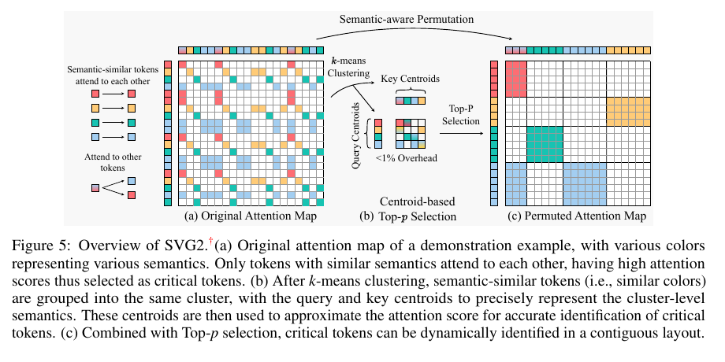
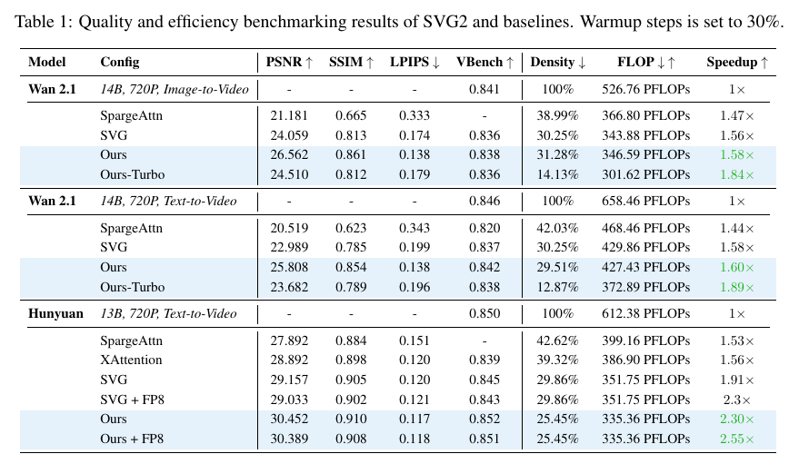
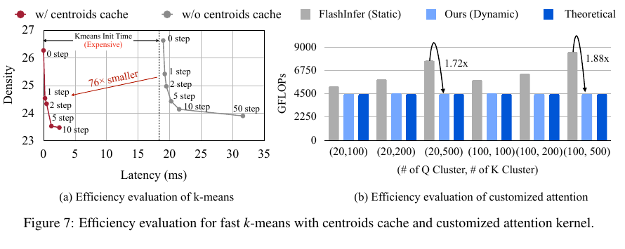

# Sparse VideoGen2: Accelerate Video Generation with Sparse Attention via Semantic-Aware Permutation 精读分析

> [!info] 文档关系
> - 文档类型：Paper
> - 领域入口：[README](../README.md)
> - 上位专题：[Video generation sparse attention](../../../01_ai_infra/kernel/custom_attn/surveys/video-generation-sparse-attention.md)
> - 证据资产：[assets/papers/sparse-videogen2](../assets/papers/sparse-videogen2/)

> 资料状态：主证据为 arXiv 论文 PDF（20 页，任务包标题与 PDF metadata 一致）。arXiv source 下载在中断前只形成不完整归档，不能作为可解包证据；官方 GitHub 仓库因网络连接失败未固定 commit，因此所有实现细节仅按论文描述核验。本文嵌入的 Figure 5、Figure 7 与 Table 1 均为 160 DPI PDF 页面裁剪，包含完整 caption/title，并经过 contact-sheet 与逐图原分辨率检查。

## 修订信息

- 当前文档版本：`1.0.0`
- 当前修订 ID：`rev-vgsa-009-initial`
- 当前修订时间：`2026-07-29T17:00:00+08:00`
- 替代版本：无（initial）

| 修订 ID | 文档版本 | 时间 | 修订者 | 类型 | 替代修订 | 迁移问题/解析 | 变更摘要 | 原因 | 影响位置 | 依据 | 对结论影响 |
|---|---|---|---|---|---|---|---|---|---|---|---|
| `rev-vgsa-009-initial` | `1.0.0` | `2026-07-29T17:00:00+08:00` | `review_sparse_videogen2` | `initial` | 无 | 无 | 首次建立单篇精读、证据图、公式解释、设计与技术点证据矩阵 | 任务包要求 initial delivery | `本文`；`Figure inventory`；`../assets/papers/sparse-videogen2/` | `arXiv PDF`、Section 3–6、Appendix D–E | material：形成首个可审计结论 |

## 0. 资料与配图索引

- 论文：`arXiv PDF`，arXiv:2505.18875，PDF metadata 显示标题与作者，20 页。
- LaTeX/source：`source/arxiv-2505.18875.tar` 为中断下载的不可验证归档，不用于结论。
- 开源代码：官方 URL 为 `https://github.com/svg-project/Sparse-VideoGen`；本次未能固定 commit，`code/Sparse-VideoGen/` 仅残留不完整 Git 元数据，不作为实现证据。
- OpenReview：任务包未给出页面，论文为 arXiv-only；未发现需要交叉核验的公开 OpenReview 记录。
- 提取文本：`extracted_text/paper.txt`、`extracted_text/paper-layout.txt`。
- 机制图：Figure 5，`../assets/papers/sparse-videogen2/fig5-svg2-overview-caption.png`。
- 结果表：Table 1，`../assets/papers/sparse-videogen2/table1-quality-efficiency-caption.png`。
- 系统图：Figure 7，`../assets/papers/sparse-videogen2/fig7-system-efficiency-caption.png`。
- 批量初筛：`figures/contact-sheet.png`。
- AI 生成图：未生成；原论文 Figure 5 已完整展示输入、聚类/置换、选择、稀疏布局与输出状态，作为读者可用的算法总览。

## 0.1 术语与符号解释

### 0.1.1 术语表

| 术语 | 本文含义 | 别名 | 不等于/易混项 | 证据来源 |
|---|---|---|---|---|
| SVG2 | Sparse VideoGen2；无需训练、面向视频 DiT 推理的稀疏注意力框架 | Sparse VideoGen2 | 不是基础生成模型，也不是训练方法 | Abstract；Section 4 |
| semantic-aware permutation | 先按 Q/K 激活的语义相似性分别聚类，再将同簇 token 物理重排为连续布局 | semantic permutation | 不只是改变逻辑 mask；它同时改变内存/块布局，最终还要逆置换输出 | Section 4.1；Figure 5 |
| critical token / critical cluster pair | 对 softmax 注意力质量贡献较大的 token 或 Q-cluster/K-cluster 组合 | critical computation | 不等于“所有非零注意力”；由近似分数和 top-p 预算筛选 | Sections 3.1、4.2 |
| centroid-based top-p selection | 用 Q/K 簇中心近似簇对注意力质量，再选择累计概率达到阈值的簇对 | dynamic budget control | 不等于语言模型 nucleus sampling；这里选择的是计算块，不是生成 token | Section 4.2 |
| centroid cache | 把相邻去噪步的簇中心作为下一步 k-means 初始化 | Flash k-means（任务包用语） | 论文正文称 fast k-means with centroid cache，并未定义名为 “Flash k-means” 的独立算法 | Section 4.3；Figure 7(a) |
| dynamic block-sparse kernel | 接受变化 Q/K 簇尺寸、稀疏加载 K/V、在 shared memory 中连续化后用 MMA 密集计算的自定义 kernel | SAPAttn kernel（正文偶有此称呼） | 不等于静态 128×128 block mask；也不等于只减少理论 FLOPs | Section 4.3 |
| density | 稀疏注意力实际计算量除以完整注意力计算量 | computation budget | 不是端到端时间占比；相同 density 可因布局和 kernel 不同而有不同延迟 | Section 5.1 |
| attention recall | 被保留注意力分数占 oracle 目标注意力质量的比例 | recall | 不是视频生成指标；它是选择器的机制指标 | Sections 3.1、5.5 |
| warmup steps | 开始使用稀疏注意力前保留 dense attention 的去噪步比例 | dense warmup | 不是 kernel 预热；Table 1 使用 30%，Table 2 使用 0% | Section 5.1；Tables 1–2 |

### 0.1.2 符号表

| 符号 | 含义 | 性质 | 作用域/索引 | 单位/取值 | 来源 | 易混点 |
|---|---|---|---|---|---|---|
| $Q,K,V$ | query、key、value token 矩阵 | author-defined | 每层、每个 attention head | $Q\in\mathbb{R}^{N_q\times d}$，$K,V\in\mathbb{R}^{N_k\times d}$ | Section 4.1 | Q 与 K 独立聚类，K 与 V 共享同一置换 |
| $N_q,N_k$ | Q/K token 数量 | author-defined | 每层、每 head | token count | Section 4.1 | 不等于 cluster count |
| $d,d_k$ | attention head 特征维度/缩放维度 | author-defined | 每个 head | feature count | Eqs. 1–2 与 Section 4.1 | 论文在两处分别写 $d$ 与 $d_k$ |
| $C_q,C_k$ | Q/K cluster 数量 | author-defined | 每层、每 head | 正整数；实践设置包括 100/500 | Sections 4.1、5.3；Appendix D | 数量过大可能降低 tensor-core 利用率 |
| $Q_i,K_j$ | 第 $i$ 个 Q cluster 与第 $j$ 个 K cluster | author-defined | $i\in[1,C_q]$，$j\in[1,C_k]$ | token set | Section 4.1 | Q/K cluster 不是一一对应 |
| $\pi_q,\pi_k$ | Q/K 的置换矩阵 | author-defined | 每层、每 head | 正交 permutation matrix | Section 4.1 | $\pi_q$ 与 $\pi_k$ 通常不同；Appendix D 的平均 ARI 为 0.345 |
| $O,O'$ | 原 attention 输出与置换后再恢复顺序的输出 | author-defined | 每层、每 head | activation tensor | Section 4.1 | $O'$ 已包含 $\pi_q^\top$ 的逆置换 |
| $S_{ij}$ | Q cluster $i$ 与 K cluster $j$ 的中心点积缩放分数 | author-defined | cluster pair | real-valued logit | Eq. 1 | 是 pre-softmax 近似分数，不是最终概率 |
| $P'_{ij}$ | 考虑 K cluster 大小后的近似注意力概率 | author-defined | cluster pair | $[0,1]$，对 $j$ 归一化 | Eq. 2 | 与真实 token-level $P$ 不同 |
| $|K_j|$ | K cluster $j$ 中 token 数量 | author-defined | cluster $j$ | token count | Eq. 2 | 作为 cluster multiplicity 权重 |
| $p$ | top-p 累计概率阈值 | author-defined | 每次选择 | $(0,1]$，具体默认值未在正文固定 | Section 4.2 | 不是生成采样温度 |
| $D$ | density，稀疏/完整 attention 计算之比 | analysis-derived notation | 一次 workload | ratio 或百分比 | Section 5.1 | 论文正文定义概念，本分析为便于公式记为 $D$ |
| $B$ | 静态 block 边长 | analysis-derived notation | kernel tile | token count，如 128 | Section 4.3 的 128×128 示例 | 与 cluster size 不同 |

## 0.2 算法总览

> Figure 5（论文原图，PDF 第 6 页）：原注意力中的相似语义 token 被分别聚成 Q/K clusters；centroid 对 cluster pair 评分，top-p 选择预算；置换把被选区域变为连续密集块。图中未展开的系统步骤是相邻去噪步 centroid cache 与动态尺寸稀疏 kernel。

一眼读法：输入是当前 DiT attention 层的 $Q,K,V$；Q/K 分别做 k-means，得到 cluster、centroid 与两套置换；centroid 分数和 top-p 决定计算哪些 cluster pair；token 按 cluster 重排后，自定义 kernel 对选中块执行稀疏加载、密集 MMA；最后对 Q 维逆置换，输出与原顺序一致的 attention 结果。整个方法发生在推理/去噪阶段，不需要训练或校准；centroid 只跨相邻去噪步缓存，不是跨请求永久学习的参数。

## 1. 论文基本信息

- 研究领域：视频扩散 Transformer（DiT）推理、稀疏注意力、GPU kernel。
- 核心问题：已有 block sparse attention 既找不准高贡献 token，又因其物理位置分散而浪费 dense accelerator 的计算块。
- 研究目标：在保持 full-attention 视频质量的同时，降低 attention density、FLOPs 与端到端延迟。
- 关键约束：每层每 head 的 Q/K 语义不同；cluster 尺寸动态；tensor core 仍需要适配的密集 tile；端到端收益受 attention 在全模型中的占比限制。

## 2. 研究动机与问题—方案闭环

### 2.1 出发点与背景痛点

作者明确指出，高分辨率视频 DiT 的序列长度达到每帧数千 token、跨数十帧；HunyuanVideo 33 帧生成中 attention 占端到端时间超过 80%（Section 3.1）。与此同时，oracle 分析显示保留约 13% attention 计算即可达到 95% attention recall、PSNR 约 27（Figure 3）。因此问题不是“有没有稀疏性”，而是能否在不先算完整 $QK^\top$ 的情况下准确找到它，并把不规则稀疏映射成 GPU 能高效执行的布局。

### 2.2 现有方案为何不够

| 现有方案/做法 | 可观察的失败 | 具体场景或例子 | 例子来源 | 根因/被忽略变量 | 为什么简单修补仍不够 | 证据 |
|---|---|---|---|---|---|---|
| 按连续位置分成固定 block，再用 mean/max pooling 估计重要性 | 相同预算下 attention recall 远离 oracle | 相邻空间位置上的苹果和蛋糕可能语义不同；把它们放进同一 block 后，聚合表示无法代表任何一方，低占比但重要的 token 被漏掉 | paper-provided | 位置邻近不保证 Q/K 激活语义相似 | 缩小固定 block 会增加评分 block 数和调度开销，却仍不能保证语义一致 | Section 3.2；Figures 3–4 |
| 找到散落 token 后直接用固定 128×128 block kernel | 计算块同时处理大量不重要 token，有效计算比例低 | 128 个 query token 只需 32 个 key token 时，静态 kernel 仍 padding 到 128×128，论文计算为 75% 浪费 | paper-provided | tensor core 需要连续、规则 tile，而重要 token 按语义散落且 cluster 大小变化 | 只提高 selector recall 不改变物理布局；只换更小静态 tile 又会损失硬件效率并增加元数据/launch 开销 | Sections 3.2、4.3；Figure 4 |
| 每个去噪步从头运行 k-means++ 到收敛 | 聚类开销可达到 attention 时间的 50% 或相当水平 | 论文称 GPU k-means++ 可能需要 100+ iterations；若每个 step 都重新初始化，稀疏节省会被聚类吞掉 | paper-provided | 相邻去噪步高度相似这一时间冗余未被利用 | 简单减少 iteration 可能降低 cluster 质量、迫使更高 density 才达到相同 recall | Section 4.3；Figure 7(a) |

### 2.3 论文计划解决的问题与成功标准

- 核心研究问题：能否同时提高 critical-token identification accuracy、减少物理布局造成的 compute waste，并把聚类/选择/kernel 开销压到端到端可获益的范围。
- 目标对象：Wan2.1 14B 与 HunyuanVideo 13B 的 720p 推理。
- 成功标准：相同 density 下更高 PSNR/recall，或相同质量下更低 density；kernel FLOPs/时间优于静态 block；最终端到端 speedup 且 VBench 不显著退化。
- 明确不解决：训练效率、DiT 之外 attention 的泛化；论文 Conclusion 明确把后一项列为局限。

### 2.4 核心方案如何解决并优化问题

| 原始问题/失败模式 | 根因或约束 | 对应方案设计 | 改变的变量/系统行为 | 作用机制 | 预期优化及指标 | 证据来源 | 判断 |
|---|---|---|---|---|---|---|---|
| 位置 block 表示不准 | block 内语义混杂 | Q/K 分别按激活做 k-means | 降低 cluster 内语义方差 | centroid 更接近该簇 token 的真实表示 | 同 density 下 recall/PSNR 上升 | Section 4.1；Figure 8；Table 6 | supported |
| critical token 物理散落 | dense MMA 要求连续 tile | cluster-wise permutation | 把同簇 token 的内存顺序变连续 | 选中 cluster pair 可映射为密集块 | compute waste 与实际 kernel work 下降 | Sections 4.1、5.5 | partially-supported：报告 36% 平均 overhead 降低，但无完整 latency 分解 |
| 固定计算预算不适应层/head/step | 稀疏度动态变化 | centroid-based top-p | 选择的 cluster pair 数随分布变化 | 累计近似概率到阈值而非固定 block 数 | 质量—density 可调 | Section 4.2；Figure 2 | partially-supported：整体曲线支持，top-p 独立消融不足 |
| k-means 初始化太慢 | 每步从头收敛 | centroid cache | 下一步初始化点复用前一步 centroid | 利用相邻 denoising step 相似性减少 iteration | k-means latency 降低 | Section 4.3；Figure 7(a) | supported under tested workload |
| cluster 尺寸动态、静态 kernel padding | 固定 128×128 block | dynamic block-sparse kernel | K/V 稀疏加载并在 shared memory 连续化 | 保留 MMA 密集计算、避免无效 padding | kernel work/latency 降低 | Section 4.3；Figure 7(b)；Appendix D | partially-supported：有 kernel 曲线，无代码复核 |

### 2.5 完整因果链与证据闭环

背景是长序列视频 DiT 的 attention 成为主要延迟；可观察痛点是理论稀疏性很高，但位置 block 方法既漏掉重要 token 又把散点 padding 成大块；根因分别是“位置不等于语义”和“硬件密集 tile 与散点布局不匹配”。SVG2 先用独立 Q/K k-means 改善表示，再用 permutation 改变物理连续性，用 centroid top-p 选择预算，用 cache 与动态 kernel 把算法额外开销转成可执行收益。Figure 8 与 Appendix Table 6 直接支持语义聚类/独立 QK 的识别作用；Section 5.5 的 36% overhead 降低支持布局作用；Figure 7 分别支持 cache 与 kernel；Table 1 则验证完整系统的质量—速度结果。

证据边界：完整系统优于基线是直接测量；但 permutation、top-p、cache 与 kernel 对端到端 1.58–2.30× 各自贡献没有统一 matched latency waterfall，因此不能把总 speedup 精确拆给单个组件。FP8 行还同时改变数值格式，不可归因给 SVG2 算法。

## 3. 核心贡献与创新点

1. 以 Q/K 激活语义而非位置做独立聚类并置换，兼顾 critical-token identification 与连续计算布局（Sections 4.1、5.5）。
2. 用带 cluster-size 修正的 centroid 概率近似和 top-p 动态决定稀疏预算（Section 4.2）。
3. 利用相邻去噪步复用 centroid 初始化，论文报告在相近/lower density 下 k-means latency 最高降 76×（Figure 7(a)）。
4. 为动态 cluster 尺寸设计稀疏加载 + dense MMA kernel，支持 FA2/A100 与 FA3/H100（Section 4.3）。
5. 在 720p Wan2.1/HunyuanVideo 上展示端到端最高 1.89×/2.30×（不含 FP8 行）且质量接近 dense（Table 1）。

## 4. 研究方法

### 4.1 方法总览

每个 attention layer/head 收到 $Q,K,V$ 后，SVG2 对 Q 与 K 独立聚类，得到 $C_q,C_k$ 个 cluster 及 centroid；按 cluster 重排 Q/K/V；用 centroid pair 近似注意力并以 top-p 选出需要计算的 cluster pair；动态 kernel 稀疏读取 K/V、在 shared memory 中排成连续 tile、执行 MMA；最后用 $\pi_q^\top$ 恢复 query 顺序。相邻 denoising step 复用 centroid 作为下一次 k-means 初值。

### 4.2 组件级设计动机与具体问题映射

| 设计项 | 论文是否明确说明 why | 原文证据 | 针对的具体问题/失败模式 | 可能起作用的因果机制 | 替代方案/权衡 | 验证证据 | 判断 |
|---|---|---|---|---|---|---|---|
| Q/K 独立 k-means | author-stated | Sections 4.1、D.3 | 位置 block 语义混杂；Q/K grouping 不同 | 降低簇内差异；分别保持 Q/K 表达 | shared hidden-state clustering 更便宜但损失 PSNR | Figure 8；Table 6 | supported |
| cluster-wise permutation | author-stated | Sections 3.2、4.1 | critical token 散点导致 padding | 同 cluster token 物理连续 | index gather/scatter 有开销；cluster 太小会降低 tile 利用 | Section 5.5 的 36% overhead 降低 | partially-supported |
| centroid score + size-weighted softmax | author-stated | Eqs. 1–2 | 不算完整 $QK^\top$ 时估计 criticality | 以 centroid 代替 token pair，$|K_j|$ 补偿簇大小 | mean/max block pooling 更便宜但语义表示弱 | Figure 8；无单独 size-weight ablation | partially-supported |
| top-p 动态预算 | author-stated | Section 4.2 | 固定 block 数无法适应动态稀疏度 | 按累计近似质量选到阈值 | 固定 density 更可预测但质量不稳 | Figure 2/整体结果；缺独立替换实验 | plausible but not isolated |
| centroid cache | author-stated | Section 4.3 | k-means 从头初始化吞噬收益 | 相邻 step centroid 接近下一步 optimum | scene/step 变化大时可能需更多 iterations | Figure 7(a) | supported in tested setting |
| dynamic block-sparse kernel | author-stated | Section 4.3 | 变长 cluster 用静态 tile 大量 padding | sparse global load，shared-memory 连续化，MMA dense compute | 更复杂索引与定制硬件路径 | Figure 7(b)、Figures 11–12 | partially-supported；代码不可核验 |
| 30% dense warmup | inferred | Section 5.1；Table 1 vs Table 2 | 早期去噪可能更敏感 | 先 dense 再 sparse 保护质量 | 降低总体速度；论文同时报告 0% 结果 | Tables 1–2 | confounded；无独立机制论证 |

### 4.3 关键公式

#### F1：置换不改变 attention 数学输出

$$
O'=\pi_q^\top\operatorname{softmax}\!\left(\frac{(\pi_qQ)(\pi_kK)^\top}{\sqrt d}\right)\pi_kV
=\operatorname{softmax}\!\left(\frac{QK^\top}{\sqrt d}\right)V=O.
$$

**这条公式在算什么？** 它回答“为了让 token 连续化而重排行列，会不会改变 dense attention 的结果”。

**怎么读？** 同时按 $\pi_q$ 重排 Q、按同一 $\pi_k$ 重排 K/V，再把 query 维逆置换，结果应与原 attention 相同。

**输入与输出。** 输入是 $Q,K,V,\pi_q,\pi_k,d$；输出是恢复原 query 顺序的 $O'$。

**变量在这里各做什么？** $\pi_q$ 重排 query 行，$\pi_k$ 同时重排 key/value 行，$\pi_q^\top$ 恢复输出；$d$ 是缩放维度。

**直觉。** permutation 只改变计算顺序，不删除元素；成对的置换和逆置换相消。

**边界。** 该等价证明针对完整 dense attention；实际 SVG2 还做 top-p 截断，因此稀疏结果只近似 $O$。浮点 kernel 的舍入顺序也可能带来小差异。

**小例子。** 本文构造的说明例：把三个 K/V token 从 `[a,b,c]` 改成 `[c,a,b]`，只要 K 和 V 同步改序，softmax 权重仍乘到原来的 value；若只重排 K 不重排 V，等价性立即失效。

#### F2：centroid pair 的 pre-softmax 分数

$$
S_{ij}=\frac{\operatorname{centroid}(Q_i)\operatorname{centroid}(K_j)^\top}{\sqrt{d_k}}.
$$

**这条公式在算什么？** 它估计 query cluster $i$ 对 key cluster $j$ 的匹配强度。

**怎么读？** 用两个簇中心的缩放点积代替簇内所有 token pair 的完整点积。

**输入与输出。** 输入是 $Q_i,K_j$ 的 centroid 和维度 $d_k$；输出是一个 cluster-pair logit $S_{ij}$。

**变量在这里各做什么？** $i,j$ 标识 cluster pair，centroid 压缩该簇 token，$\sqrt{d_k}$ 控制点积尺度。

**直觉。** 簇内越语义一致，centroid 越能代表其 token，近似越可靠；簇内混杂时平均中心会掩盖少数重要 token。

**边界。** 依赖 k-means cluster 足够同质；它不是 token-level exact score。

**小例子。** 本文构造的说明例：若一个 Q cluster 的中心与两个 K cluster 中心点积分别为 4 和 1，则在相同簇大小下，前者会被 top-p 更早选择。

#### F3：考虑 K-cluster 大小的近似概率

$$
P'_{ij}=\frac{|K_j|\exp(S_{ij})}{\sum_{k=1}^{C_k}|K_k|\exp(S_{ik})}.
$$

**这条公式在算什么？** 它把 cluster-pair logit 归一化为可累加、可做 top-p 的近似注意力质量。

**怎么读？** 对某个 Q cluster，把每个 K cluster 的指数分数乘以其 token 数，再除以所有 K clusters 的加权总和。

**输入与输出。** 输入是 $S_{ij}$、各 $|K_j|$ 与 $C_k$；输出是 $P'_{ij}\in[0,1]$。

**变量在这里各做什么？** $|K_j|$ 表示该中心代表多少 token，$C_k$ 给出归一化范围，$P'_{ij}$ 是选择器排序和累计的量。

**直觉。** 两个 cluster centroid 分数相同时，更大的 cluster 代表更多 token-level 配对，因此获得更大总质量。

**边界。** 它假设 cluster 内 token 可由同一 centroid score 近似；论文未给出移除 $|K_j|$ 的受控消融。

**小例子。** 本文构造的说明例：两个 K clusters 的 $S$ 相同、大小分别 32 和 96，则归一化概率约为 0.25 与 0.75，top-p=0.7 时只选大簇即可越过阈值。

#### F4：静态 block padding 的理论浪费

$$
W_{\mathrm{pad}}=1-\frac{n_qn_k}{\lceil n_q/B\rceil B\cdot \lceil n_k/B\rceil B}.
$$

**这条公式在算什么？** 它估计动态 cluster pair 被强制装进固定 $B\times B$ block 时，乘加位置有多少是 padding 浪费。

**怎么读？** 有效 token-pair 数除以分配的固定块容量，剩余比例就是浪费。

**输入与输出。** 输入是实际 cluster 大小 $n_q,n_k$ 和 block 边长 $B$；输出是 $[0,1)$ 的 padding waste。

**变量在这里各做什么？** $n_qn_k$ 是有效 pair 数，两个 ceiling 项决定静态 kernel 实际分配容量。

**直觉。** cluster 尺寸越偏离 $B$ 的整数倍，padding 占比越高；dynamic kernel 的目标是让 load/compute 更接近 $n_qn_k$。

**边界。** 这是本文依据 Section 4.3 构造的容量估计，不含索引、shared-memory 搬运与 tile 尾部的实际时间。

**小例子。** 论文示例：$n_q=128,n_k=32,B=128$，有效比为 $128\times32/(128\times128)=25\%$，故 $W_{\mathrm{pad}}=75\%$。

### 4.4 训练、实验与部署设计

SVG2 training-free。Wan2.1 生成 21 帧、每帧 3600 token；HunyuanVideo 33 帧、每帧 3600 token。主结果使用 30% warmup steps；质量指标为相对 dense 输出的 PSNR/SSIM/LPIPS，绝对视频质量由 VBench 补充。论文称在单张 H100 上测试，kernel 同时设计了 FA2/A100 和 FA3/H100 路径，但具体软件版本、batch、clock、编译参数与重复次数未完整报告。

## 5. 关键结论

### 5.1 主结果

> Table 1（论文原表，PDF 第 9 页）：30% warmup 下，SVG2 “Ours” 在 Wan2.1 I2V/T2V 达 1.58×/1.60×，在 HunyuanVideo 达 2.30×；Turbo 行以更低 density 换取部分质量。Hunyuan `Ours + FP8` 的 2.55× 同时包含数值格式变化，不能当作纯 SVG2 算法收益。

相对 SVG 基线，Wan2.1 I2V 的 Ours：PSNR 24.059→26.562（+2.503，约 +10.4%），speedup 1.56×→1.58×；Wan2.1 T2V：22.989→25.808（+2.819，约 +12.3%），speedup 1.58×→1.60×；Hunyuan：29.157→30.452（+1.295，约 +4.4%），density 29.86%→25.45%，speedup 1.91×→2.30×。这些是同表差值，但缺误差条和多次运行方差。

### 5.2 系统与机制证据

> Figure 7（论文原图，PDF 第 9 页）：左图在达到相近或更低 density 时，centroid cache 把 k-means 初始化/迭代轨迹的 latency 大幅左移，作者概括为最高 76×；右图比较静态 FlashInfer、dynamic kernel 与理论工作量，实践配置 $(C_q,C_k)=(100,500)$ 的 computation reduction 为 1.88×。

| 论文声称的技术点 | 声称收益/效果 | 对应实验/消融 | 对照是否受控 | 指标变化 | 证据强度 | 结论 |
|---|---|---|---|---|---|---|
| semantic k-means 提高识别 | 同 density 更高 recall | Figure 8 | permutation on/off、相同 cluster size | 曲线持续更高，未给逐点表 | direct mechanism ablation | supported |
| permutation 减少布局浪费 | 相同 critical set 下更低 overhead | Section 5.5 | 同一 top-p 选择集合、仅布局不同 | 平均 -36% overhead | direct ablation（文字报告） | supported，但缺图表/时间单位 |
| Q/K 独立聚类必要 | shared permutation 降质量 | Table 6 | 多个 permutation 变体 | 独立：31.28%/26.562 PSNR；shared Q/K：38.23%/22.439、38.58%/22.183 | replacement baseline | supported |
| centroid cache 降 k-means latency | 最高 76× | Figure 7(a) | cache on/off、以达到 90% recall 的 density 对齐 | 图示 latency 约 sub-ms vs 20–30ms 区域 | direct system comparison | supported under tested configuration |
| dynamic kernel 减少 padding/work | 平均 1.48×，100/500 为 1.88× | Figure 7(b) | 实际动态 workload，静态 FlashInfer vs ours | GFLOPs reduction | replacement baseline | partially supported：不是端到端 latency，代码不可核验 |
| top-p 动态预算优于固定预算 | 更好 quality-density frontier | Figure 2、Table 1 | 与多种方法整体对比 | 最多 2.3× density reduction at same PSNR | confounded | 整体有效，但 top-p 单项未隔离 |
| 完整 SVG2 端到端加速 | 最高 2.30×（不含 FP8） | Table 1 | dense/baseline 同表 | Wan 1.58–1.89×；Hunyuan 2.30× | system end-to-end | supported，复现实验细节有限 |

### 5.3 收益来源归因

| 组件/变化 | 对比基线 | 指标变化 | 影响路径 | 证据强度 |
|---|---|---|---|---|
| semantic clustering/permutation | permutation-disabled | recall 上升；overhead 平均 -36% | selector accuracy + layout work | matched mechanism ablation，但未给端到端拆分 |
| centroid cache | 无 cache | k-means latency 最高 76× smaller | preprocessing/runtime | matched curve at comparable density |
| dynamic kernel | FlashInfer static | 平均 computation reduction 1.48×，100/500 为 1.88× | kernel padding/work | replacement baseline；非 latency |
| SVG→Ours 完整桥接 | SVG | Hunyuan speedup 1.91→2.30×、PSNR +1.295 | algorithm + selector + layout + kernel bundled | 粗略归因，不是论文正式方差分解 |
| Ours→Ours+FP8 | Ours | Hunyuan 2.30→2.55×、PSNR -0.063 | numeric format/runtime | FP8 单独变化较清楚，但硬件/精度实现无法由代码核验 |

## 6. Related Work 对比

| 类别/论文 | 方法核心 | 优点 | 局限 | 与本文关系 |
|---|---|---|---|---|
| SpargeAttention | 固定位置 block + block-level 重要性 | 通用、规则 kernel 友好 | 位置 block 语义混杂且散点 padding | SVG2 的直接问题基线 |
| SVG（前作） | 面向视频生成的稀疏 attention | 已能降低 density | 论文表中质量/速度均低于 Ours，具体升级归因被多组件绑定 | SVG2 是独立续作与系统化改进 |
| XAttention | 其他稀疏选择模式 | Hunyuan 对比可用 | 表中 density 39.32%、speedup 1.56× | SVG2 更低 density、更高质量/速度 |
| MMInference | 多模态 LLM 的 modality-aware permutation | 用重排改善规则性 | 模态边界先验不等于视频 attention 的动态语义 cluster | permutation 思路相关但场景/选择依据不同 |
| FlashInfer/static block | 规则 block sparse kernel | 工程成熟 | 不能自然适配动态 cluster size | SVG2 kernel 的系统对照 |

公平性边界：Table 1 汇报统一模型/分辨率和指标，但不同方法的实现成熟度、kernel backend、warmup 与可用基线并不完全相同；某些 VBench 项缺失，且没有统计方差。

## 7. OpenReview 公开评审 × 论文内容交叉核验

任务包的 `openreview_url` 为 unknown，论文状态为 arXiv 2025；本次停止外部检索后没有可验证的公开 OpenReview forum、review、decision 或 rebuttal。该分支记为 not applicable，不把缺少评审当作论文结论的反证。

## 8. Infra 需求分析

### 8.1 算力与端到端上限

attention 理论工作由 density $D$ 近似缩放，但端到端 speedup 还受非 attention 部分限制。论文 Appendix E 解释 Hunyuan context 约 118k、Wan 约 75k，且 Wan 还有 cross-attention，因此 SVG2 对全模型时间的可加速比例不同。Table 1 的 Hunyuan 2.30× 与 Wan 1.58–1.60×符合该 Amdahl-style 边界，但论文未给完整 latency waterfall。

### 8.2 显存、数据类型与格式

| 对象 | 数据类型/格式 | 使用阶段 | 硬件依赖 | 对精度/速度/显存的影响 | 证据 |
|---|---|---|---|---|---|
| Q/K/V activation | 主实验精度未在正文明确固定 | inference | A100/H100 | 无法量化 | Section 5.1 缺口 |
| attention compute | FA2/FA3 dense MMA；FA3 使用 `wgmma m64n64k16` | kernel | NVIDIA Ampere/Hopper | 要求 tile 对齐；cluster 太小/太多会降利用率 | Section 4.3；Appendix D |
| FP8 variant | FP8 | Hunyuan inference | H100 路径推定相关，但代码不可核验 | 2.30×→2.55×，PSNR 30.452→30.389 | Table 1 |
| cluster/index metadata | cluster IDs、per-token K/V offsets | selection/kernel | GPU global/shared memory | 增加索引与搬运开销，论文未报告 bytes | Section 4.3 |
| centroid cache | centroid activation cache | consecutive denoising steps | GPU memory 推断 | 少量额外存储换 k-means 初始化时间 | Section 4.3 |

### 8.3 带宽、局部性与异构执行

semantic permutation 让 Q cluster 连续加载；K/V 可能因变长 cluster 在 global memory 中分散，kernel 使用 per-token address offsets 稀疏加载，再写入 shared memory 形成连续 tile。因论文未报告 bytes moved、runtime breakdown 与 H100 peak bandwidth，本次不能可信计算 effective bandwidth/utilization；“超过理论最大性能 85%”是作者以 `density × dense FA3 runtime` 构造的上界相对值，不是 HBM 峰值利用率。

没有证据显示 CPU 参与核心路径；聚类、选择、gather 与 attention kernel 均按 GPU 路径描述。host-device transfer、pinned memory、DMA、multi-GPU、NVLink/RDMA、all-reduce/all-to-all 与 serving scheduler 均未报告，因此不得假设其已被 overlap 或优化。

### 8.4 调度、kernel 与硬件边界

动态 cluster size 需要每层/head 的 cluster metadata、top-p 结果与地址 offsets；这带来变长 workload 和潜在 load imbalance。Appendix D 显示 $C_q>200$ 时 kernel performance 明显下降，而 $C_k$ 增至 4000 影响小；作者最终用 $C_q=100,C_k=500$ 取得质量—速度折中。该选择说明算法预算与 tensor-core tile 利用率相互约束，而非 density 越低/cluster 越多就一定越快。

## 9. 开源代码对照

- 仓库 URL：`https://github.com/svg-project/Sparse-VideoGen`
- commit：unavailable。
- 获取结果：首次 clone 只留下不完整 `.git`；后续 fetch 因代理连接失败且按父任务要求停止所有网络。未读取 README 作为实现事实，也未把不完整仓库计入代码证据。

| 论文机制 | 本地路径 | 稳定 commit 链接 | 一致性判断 |
|---|---|---|---|
| semantic permutation | unavailable | unavailable | 论文描述可读，代码未核验 |
| centroid top-p/cache | unavailable | unavailable | 论文描述可读，代码未核验 |
| FA2/FA3 dynamic kernel | unavailable | unavailable | kernel 路径、dtype、launch/config 均未核验 |
| checkpoint/config | not applicable | not applicable | 方法 training-free，论文未声明专属模型权重 |

因此“支持 FA2/A100、FA3/H100、wgmma、85% theoretical maximum”等实现层判断均限定为 author-reported。

## 10. 优点与局限

### 优点

- 将“找准稀疏区域”和“让硬件真正跳过无效工作”放在同一算法—系统闭环里。
- 机制证据覆盖识别 recall、布局 overhead、cache latency、kernel work 与端到端结果，不只报告最终 speedup。
- Appendix 对 Q/K 独立聚类、cluster count 与模型间 speedup 差异给出额外解释。

### 局限

- 核心组件没有统一端到端 latency waterfall；总收益归因仍有多项改动同时发生。
- Figure 7(b) 主要比较 GFLOPs/理论工作量，不等于实测 kernel latency 或吞吐。
- 代码 commit、编译配置、数据类型、软件版本与测量方差无法核验，复现性结论受限。
- 只评测两类 13B/14B 720p 视频 DiT；作者也承认未讨论其他 attention 架构。
- quality 主要以相对 dense 的像素/感知指标衡量；VBench 接近 dense 但部分 baseline 条目缺失。
- centroid cache 在相邻 step 变化突然、不同 scheduler 或 guidance 设定下是否稳定未测试。

### 可改进之处

最小补充实验应包括：permutation-only、centroid-size-weight-only、top-p vs fixed-budget、cache-only、kernel-only 的 matched end-to-end waterfall；报告 gather/scatter/cluster/selection/kernel 各自 latency、bytes moved、方差；在非 DiT attention、不同 resolution/frame count、不同 denoising scheduler 上做泛化。

## 11. 研究启发

- 稀疏算法若不同时改变数据布局，理论 FLOPs 往往不会转化为实际速度。
- 去噪序列的时间连续性不仅可复用 KV/activation，也可复用“选择器的状态”如 centroid。
- cluster count 是算法精度与硬件 tile 利用率的共同超参，应以 quality-latency 而非 recall 单独调节。
- 对动态稀疏 kernel，分开审计“选择了什么”和“如何搬运/执行”能避免把 selector 收益误归给 kernel。

## 12. 解读问题/待验证清单

1. $|K_j|$ size weighting 是否有独立消融？
2. top-p 相比固定 density/block-count 在相同 quality 目标下节省多少？
3. 36% computation overhead reduction 的单位、测量工具与层/模型分布是什么？
4. 76× 是初始化、完整 k-means 还是端到端模块的最大值？不同 step 的 tail latency 如何？
5. dynamic kernel 的实测 latency/TFLOP/s、HBM bytes 与 occupancy 是否支持 Figure 7(b) 的 GFLOPs 结论？
6. permutation/gather/scatter 的时间是否计入 Table 1 speedup？
7. 30% warmup 的必要性与质量敏感度如何？
8. FP8 的量化位置、累加精度和校准策略是什么？
9. 不同 scheduler、guidance、prompt motion 强度会否破坏 centroid 的跨步稳定性？
10. 公开代码能否在固定 commit 下复现 Table 1 与 Figures 7–8？

## 13. 一句话总结

SVG2 的核心价值是把语义聚类带来的“更准确稀疏选择”通过置换和动态 kernel 转换成连续、可由 tensor core 高效执行的块，并用跨去噪步 centroid cache 控制选择成本；论文的机制与端到端证据总体支持这一闭环，但组件级 latency 归因和代码复现仍是最大不确定性。
