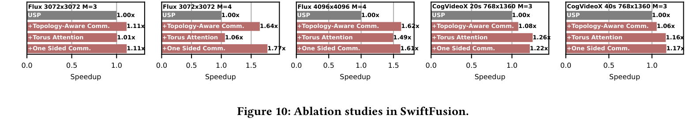
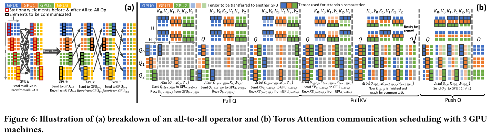

---
tags:
  - paper
  - collection/multimodal-generation
  - domain/model-systems
  - status/deep-review
  - topic/distributed-inference
  - method/sequence-parallelism
document_type: paper
domain: multimodal_generation
collection: Multimodal Generation
review_status: deep-review
canonical: true
---

# SwiftFusion 精读分析

> [!info] 文档关系
> - 文档类型：Paper
> - 领域入口：[README](../README.md)
> - 上位汇总：[Diffusion 多模态生成与 AI Infra](../surveys/multimodal-diffusion-infra.md)
> - 证据资产：`../assets/papers/swiftfusion/`
> - 相关文档：[Figure inventory](../evidence/figure-inventory.md)

> 资料状态：已核验官方 arXiv PDF（SHA-256 `130f6eab546bb57c43c36d4886af0152ae2d655a2eb99806b90acb94fe4b0114`），并完成 Figure 6/10 精确重裁及原分辨率 QA。LaTeX/source archive、官方代码、checkpoint metadata 与 OpenReview 快照本轮未取得，均按证据边界分类。

## 修订信息

- 当前修订 ID：`rev-swiftfusion-obsidian-properties-20260731`
- 当前文档版本：`1.1.2`
- 当前修订时间：`2026-07-31T10:00:00+08:00`
- 替代版本：`rev-swiftfusion-affiliation-backfill-20260730` / `1.1.1`

| 修订 ID | 文档版本 | 时间 | 修订者 | 类型 | 替代修订 | 迁移问题/解析 | 变更摘要 | 原因 | 影响位置 | 依据 | 对结论影响 |
|---|---|---|---|---|---|---|---|---|---|---|---|
| `rev-swiftfusion-m4-initial` | `1.0.0` | `2026-07-25T18:30:00+08:00` | `paper-deep-review agent` | `initial` | 无 | 无 | 从既有精读与正式资产建立审查，完成证据分类与视觉 QA | 补齐 canonical Paper 交付标准 | 本文、[Figure inventory](../evidence/figure-inventory.md) | 既有资料与正式资产 | material：确认系统结论但机制视觉仍 blocked |
| `rev-swiftfusion-m4-pdf-recovery` | `1.1.0` | `2026-07-25T20:30:00+08:00` | `paper-deep-review agent` | `evidence-update` | `rev-swiftfusion-m4-initial` / `1.0.0` | 无 | 接入官方 PDF，重裁 Figure 6/10，解除 primary/visual blockers | 补齐原始页面证据 | 资料索引、机制图、证据边界与 QA | 官方 PDF physical pp.6/12、[Figure inventory](../evidence/figure-inventory.md) | material：delivery 从 blocked 恢复为 complete |
| `rev-swiftfusion-affiliation-backfill-20260730` | `1.1.1` | `2026-07-30T23:30:00+08:00` | `/root` | `metadata-update` | `rev-swiftfusion-m4-pdf-recovery` / `1.1.0` | 无 | 补充作者—机构元数据与角色证据边界 | 统一回填 affiliation 交付字段 | `作者与机构` | 论文 PDF 标题页、机构编号与角色脚注 | none：不改变方法、实验与归因结论 |
| `rev-swiftfusion-obsidian-properties-20260731` | `1.1.2` | `2026-07-31T10:00:00+08:00` | `/root` | `metadata-update` | `rev-swiftfusion-affiliation-backfill-20260730` / `1.1.1` | 无 | 增加 Obsidian YAML Properties 与层级标签 | 全量 canonical Paper 标签补齐 | 文件头 YAML frontmatter | 已验证的 ICML 2026 标签 schema；仓库覆盖矩阵 | none：不改变论文分析与证据结论 |

## 0. 资料与配图索引

- 论文 PDF：[arXiv:2601.20273](https://arxiv.org/abs/2601.20273)，14 页，核验 SHA-256 `130f6eab546bb57c43c36d4886af0152ae2d655a2eb99806b90acb94fe4b0114`。
- LaTeX/source：本地缺失。
- 开源代码：本地缺失；论文记录论文未提供 repository，无法给 commit hash。
- OpenReview：公开评审核验记录，`skipped-with-reason`。
- 合格图表：Figure 10，`../assets/papers/swiftfusion/fig10-ablation-caption.png`。
- 合格机制图：Figure 6，`../assets/papers/swiftfusion/fig6-torus-scheduling-caption.png`；physical PDF p.6，右侧 Push O panel 与完整 caption 均已恢复。
- 视觉证据边界：保留原论文 Figure 6 与 Figure 10；未用生成图替代论文机制或消融证据。

> 图注：Figure 10 为原论文结果/消融视觉。它支持工作负载依赖的组件归因，但不能把整体 speedup 线性拆成各组件固定贡献。

> 图注：Figure 6 为原论文机制视觉；从 physical PDF p.6 的 200 DPI render 精确裁剪，完整包含 (a)/(b)、最右侧 Push O panel 与 caption。

## 0.1 术语与符号解释

### 0.1.1 术语表

| 术语 | 本文含义 | 别名 | 不等于/易混项 | 证据来源 |
|---|---|---|---|---|
| topology-aware scheduling | 把 Ulysses 与 Ring 两个并行维度映射到跨机/机内层级的静态调度 | TAS | 不是运行时动态拓扑搜索 | 论文 §方法与设计理由、§基础设施 |
| Ulysses dimension | 沿 attention head 维做 all-to-all 的序列并行维度 | Ulysses SP | 不等于 Ring token circulation | 论文 §拓扑感知 SP |
| Ring dimension | 沿序列块传递 KV 并逐步累计 attention 的维度 | Ring SP | 不等于跨机 collective 必然最优 | 论文 §拓扑感知 SP |
| Torus Attention | 将跨机 Ulysses lifecycle 分解为 Pull Q、Pull KV、Push O 的 staged schedule | Torus | 不是通用 torus 网络拓扑 | 论文 §Torus Attention |
| stationary elements | all-to-all 前后仍归属当前 rank 的 head slice | stationary chunk | 只对论文给定布局成立 | 论文 §Torus Attention |
| Pull Q | Torus 的第一通信/计算阶段：先使用本地 KV，并拉取后续 Q | Q pull stage | 不是目标验证或 drafting | 论文 §Torus Attention |
| Pull KV | Torus 的第二阶段：对已收 Q 拉取远端 KV 并 online merge | KV pull stage | 末 stage 仍有不可隐藏计算尾部 | 论文 §Torus Attention |
| Push O | Torus 的输出归位阶段：推送远端输出并计算本地保留输出 | output push stage | 不等于完整 all-to-all barrier | 论文 §Torus Attention |
| one-sided communication | NVSHMEM remote put/get 配合 stream ordering 和 barrier | one-sided runtime | 不是无同步，也不是无接收方一致性要求 | 论文 §One-sided communication |
| matched speedup | 同 workload/hardware 下的基线延迟除以方法延迟 | speedup ratio | Figure 7 最优配置比较不等于同一并行配置 | 论文 §结论先行、§匹配消融 |
| effective bandwidth | 分阶段真实搬运字节数除以阶段时长 | $BW_{eff}$ | 不等于 NIC 标称峰值 | 本分析 §7 |
| exact attention semantics | 系统重排通信/计算但意图保持 attention 数学结果 | exact attention | 不代表论文已报告逐元素数值回归 | 论文 §相关工作、§局限 |

### 0.1.2 符号表

| 符号 | 含义 | 性质 | 作用域/索引 | 单位/取值 | 来源 | 易混点 |
|---|---|---|---|---|---|---|
| $B$ | batch size | author-defined | workload | requests | 论文 §拓扑感知 SP | 论文实验具体 batch 未在本地投影中恢复 |
| $L$ | 全局 sequence length | author-defined | attention layer | tokens | 论文 §拓扑感知 SP | 局部 shard 长度不是 $L$ |
| $H$ | attention head 数 | author-defined | attention layer | heads | 论文 §拓扑感知 SP | 实验 workload 为 24 heads |
| $D$ | 每个 head 的维度 | author-defined | per head | elements | 论文 §拓扑感知 SP | Flux/CogVideoX 分别记录 128/64 |
| $N$ | 机器数 | author-defined | cluster | machines | 论文 §拓扑感知 SP | 实验不超过 4 台 |
| $M$ | 每机 GPU 数 | author-defined | node | GPUs/machine | 论文 §拓扑感知 SP | 实验为 8 |
| $P_u$ | Ulysses parallel degree | author-defined | mesh | ranks | 论文 §拓扑感知 SP | 受 $H$ 整除约束 |
| $P_r$ | Ring parallel degree | author-defined | mesh | ranks | 论文 §拓扑感知 SP | 满足 $P_uP_r=NM$ |
| $T_{l,h}$ | tensor $T$ 的 sequence/head 分片 | author-defined | Torus rank layout | tensor slice | 论文术语表 | 只用于论文 Torus 布局 |
| $V_{USP}$ | USP 每 GPU 跨机通信元素数 | author-defined | per layer/GPU | elements | 论文 Appendix C 公式 | 不含协议开销 |
| $V_{SFU}$ | SwiftFusion 每 GPU 跨机通信元素数 | author-defined | per layer/GPU | elements | 论文 Appendix C 公式 | 是解析流量，不是延迟 |
| $s$ | 单元素字节数 | analysis-derived | dtype | bytes/element | 本分析 §7 | dtype 未报告，不能固定代入 |
| $T_c$ | 跨机通信阶段耗时 | analysis-derived | per stage | seconds | 本分析 §7 | 论文未报告该分解 |
| $BW_{eff}$ | 有效带宽 | analysis-derived | per stage | bytes/s | 本分析 §7 | 不能用 400 Gbps 峰值直接替代 |
| $BW_{peak}$ | 标称峰值带宽 | analysis-derived | interconnect | bytes/s | 本分析 §7 | EFA 400 Gbps 的聚合口径未恢复 |
| $\eta$ | 有效链路利用率 | analysis-derived | per stage | $0<\eta\le1$ | 本分析 §7 | 无 timeline/bytes measurement，不能数值核验 |
| $T_{compute}$ | 一个 Torus stage 的 attention 计算时间 | analysis-derived | stage | seconds | 本分析 §4.4 | 与 sequence/chunk/kernel 相关 |
| $T_{comm}$ | 一个 Torus stage 的通信时间 | analysis-derived | stage | seconds | 本分析 §4.4 | 与拓扑、拥塞和消息粒度相关 |

## 1. 论文基本信息

### 作者与机构

- 第一作者（首位列名）：Jiacheng Yang → University of Toronto；Vector Institute。
- 共同第一作者（仅含论文明确标注者）：论文未显式标注。
- 通讯作者/通讯联系人（仅含论文明确标注者）：论文未显式标注。
- 其他作者涉及的机构（去重列举，不作逐作者映射）：University of Toronto；Vector Institute；Amazon；NVIDIA。
- 对应依据：论文 PDF 标题页、作者机构编号与角色脚注（核验日期：2026-07-30）。

- 研究领域：分布式 diffusion transformer 推理与 sequence parallel runtime。
- 核心问题：USP 在层级网络中把 Ring 放到跨机慢链路，跨机流量不随机器数充分下降；原子 all-to-all 与双边通信又限制重叠。
- 研究目标：通过 topology mapping、staged attention 和 one-sided runtime 降低多机 DiT attention 单步延迟，同时维持 exact attention 语义和不高于 USP 的显存。
- 关键约束：同构 NVIDIA GPU、NVSwitch 机内互联、EFA/RDMA 跨机、NVSHMEM、head divisibility 与足够计算窗口。
- 来源身份：arXiv:2601.20273；ACM CAIS 2026 由本地投影记录，未能用原始页面复核。

## 2. 研究动机与问题—方案闭环

### 2.1 出发点与背景痛点

`author-stated via local projection`：高分辨率图像和长视频使 DiT attention 的 sequence length 与单步计算/显存快速增大，单 GPU 无法高效承载；sequence parallel 因而成为推理扩展手段。但部署网络具有明显层级：同机 NVSwitch 快，跨机 EFA 慢。若并行算法忽略这一差异，增加 GPU 可能把更多时间消耗在慢链路与同步上。

本地投影重建的核心痛点不是 attention 数学复杂度本身，而是 USP 的二维并行映射和 collective lifecycle 与物理拓扑不匹配：跨机 Ring 每 GPU 流量近似不随机器数下降，且 NCCL sender/receiver 的逐步配对形成 bubble。

### 2.2 现有方案为何不够

USP 把 Ulysses 与 Ring 组合起来，但默认映射会令跨机链路承载 Ring。Ring 的近似每 GPU 通信量为 $2BLHD$，没有 $1/N$ 缩放；Ulysses 约为 $4BLHD/P$，却受 head 数整除和 atomic all-to-all 阻碍计算通信重叠。简单交换 collective 仍不足够：跨机 all-to-all 若整体完成后才启动 attention，流量虽下降，延迟仍受同步与不可重叠窗口控制。

因此根因包含三层：通信量缩放律与拓扑层级错配、collective 粒度过粗、双边同步/runtime kernel 对 SM 与进度的占用。这个因果拆分已用 PDF §3/§4、Appendix C、Figure 6 与 Figure 10 交叉复核。

### 2.3 论文计划解决的问题与成功标准

- 核心研究问题：如何在不改变 attention 输出语义的前提下，让较低跨机带宽承载随机器数下降的通信，并把剩余跨机通信与 attention 计算重叠。
- 适用场景：多机、多 GPU、高分辨率 Flux 与长视频 CogVideoX 式 DiT 推理。
- 成功标准 1：相对 USP 降低 matched workload 单步延迟。
- 成功标准 2：跨机通信元素数随 $N$ 下降，并在 $N>2$ 显示拓扑收益。
- 成功标准 3：累计组件消融能够说明 TAS、Torus 与 one-sided 的 workload-dependent 作用。
- 成功标准 4：显存不高于 USP，且 runtime 可在 NVSwitch/EFA/NVSHMEM 栈上执行。
- 明确不解决：模型质量提升、训练算法、非 NVIDIA/NPU 异构部署、任意 topology 的动态最优搜索。

### 2.4 核心方案如何解决并优化问题

SwiftFusion 先改变“谁走哪条链路”：让跨机承载通信量随 degree 下降的 Ulysses，让机内 NVSwitch 承载 Ring。随后改变“什么时候传”：将跨机 all-to-all 分解为 Pull Q、Pull KV、Push O，利用 stationary chunk 先计算并为后续 chunk 创造 overlap 窗口。最后改变“如何同步”：用 NVSHMEM one-sided put/get 与 stream ordering 替代每一步双边配对，但保留 layer boundary barrier。

| 原始问题/失败模式 | 根因或约束 | 对应方案设计 | 改变的变量/系统行为 | 作用机制 | 预期优化及指标 | 证据来源 | 判断 |
|---|---|---|---|---|---|---|---|
| 跨机 Ring 流量不随机器数下降 | USP 映射忽略分层拓扑 | TAS 反转映射 | 跨机维度从 Ring 改为 Ulysses | 将慢链路流量变为约 $O(1/N)$ | 降低多机 step latency | Appendix C 公式、Figure 10 | partially-supported |
| atomic all-to-all 阻塞 attention | 必须等待完整 collective | Torus staged schedule | collective lifecycle 变为分块 Pull/Push | stationary-first 让计算与后续通信并行 | 隐藏跨机通信 | PDF §4.3、Figure 6、Figure 10 | partially-supported |
| NCCL 每 step 配对同步形成 bubble | sender/receiver 必须匹配且 kernel 参与进度 | NVSHMEM one-sided runtime | remote put/get 与 stream ordering | 解耦配对并降低 per-step 同步 | 缩短 runtime latency | Figure 10 累加式消融、Appendix B 投影 | partially-supported |
| 分块 attention 多 launch/merge | chunk 化产生额外 kernel 与内存往返 | fused multi-Q/multi-KV kernel | online softmax 状态在单 kernel 内维护 | 融合多块计算与 merge | 降低 kernel overhead | Figure 12 文本投影 | plausible |

### 2.5 完整因果链与证据闭环

高分辨率/长视频使 DiT attention 必须跨 GPU 扩展；USP 虽组合两种序列并行，却让通信量近常数的 Ring 穿越慢跨机链路，并以原子 collective 与双边同步限制重叠。SwiftFusion 用 TAS 把 Ulysses 映射到跨机，使每 GPU 跨机元素数随机器数下降；用 Torus 把 all-to-all 拆成可流水阶段，使 stationary chunk 的 attention 计算覆盖后续传输；用 one-sided runtime 降低逐步 sender/receiver 配对。预期结果是跨机 bytes、同步 bubble 和暴露通信时间下降，从而降低单步 latency。

直接证据包括 Appendix C 的解析通信量关系、Figure 6 的调度机制与 Figure 10 的 matched cumulative ablation；PDF §5.2 报告平均 $1.35\times$、最高 $1.77\times$。证据边界同样明确：$N=2$ 时 TAS 可更慢，短图像 workload 的 Torus+NCCL 可回退，one-sided 也不是每点单调增益；论文未提供代码、timeline、有效带宽或独立 kernel/runtime 消融。因此闭环判为 partially supported，但 primary-source 与视觉交付已完整。

## 3. 核心贡献与创新点

1. `author-stated via projection`：提出 TAS，以通信量缩放律和 head legality 将 Ulysses/Ring 映射到跨机/机内拓扑。
2. `author-stated via projection`：提出 Torus Attention，把四次原子 all-to-all 的生命周期重排为 Pull Q、Pull KV、Push O。
3. `author-stated via projection`：使用 NVSHMEM one-sided put/get、独立 CUDA stream 和明确 barrier 边界实现统一通信 runtime。
4. `author-stated via projection`：提供 fused multi-Q/multi-KV online-softmax kernel，降低分块计算/merge 开销。
5. `direct result visual`：在 A100/NVSwitch/EFA 测试床上，以 Figure 10 展示组件收益具有显著 workload dependence。

## 4. 研究方法

### 4.1 方法总览

输入是一个 DiT attention layer 的 $Q,K,V$ 分片和 $NM$ 个 GPU 的层级拓扑；TAS 决定 $P_u\times P_r$ mesh 及 rank mapping，Torus 调度跨机 Q/KV/O 生命周期，机内 Ring 与跨机 one-sided 操作在独立 streams 上推进，fused kernel 执行分块 attention 与 online merge，最终输出保持原 attention layout。方法只改推理 runtime，不改模型训练或权重。

### 4.2 组件级设计动机与具体问题映射

| 设计项 | why 状态 | 原文/投影证据 | 针对的具体问题 | 因果机制 | 替代/权衡 | 验证证据 | 判断 |
|---|---|---|---|---|---|---|---|
| TAS topology reversal | author-stated | §3/§4.2 投影 | 跨机 Ring 流量近常数 | 跨机改走 Ulysses | 两机时无流量优势 | Appendix C + Fig.10 | partially-supported |
| $P_u=\gcd(NM,H)$ | author-stated | §4.2 投影 | head divisibility 限制 Ulysses degree | 选最大合法 Ulysses degree | 不是实测 cost model | 解析合法性；无 scheduler ablation | plausible |
| $P_r=NM/P_u$ mesh | author-stated | §4.2 投影 | 需覆盖全部 ranks | 剩余 degree 交给 Ring | rank placement 错误会跨机 | 公式/部署要求 | plausible |
| stationary-first breakdown | author-stated | §4.3/Fig.6 投影 | 原子 all-to-all 无法早算 | 先算不移动分片 | 需额外 bookkeeping | Fig.10 视频增益；机制图拒收 | partially-supported |
| Pull Q→Pull KV→Push O | author-stated | §4.3 投影 | Q/KV/O 生命周期与体量不同 | 先 Q 创造窗口，再 KV merge，最后 O 归位 | 最后 KV stage 有尾部 | 无顺序替换消融 | plausible |
| NVSHMEM one-sided put/get | author-stated | §4.4/Appendix B 投影 | NCCL 双边配对与 SM contention | remote access 解耦配对 | 依赖 symmetric heap/RDMA | Fig.10 累加增量 | partially-supported |
| layer/stream barriers | author-stated | Appendix B 投影 | one-sided 数据可见性与正确性 | layer boundary barrier 与 group ordering | 仍存在同步成本 | 伪代码文本；无代码 | plausible |
| fused multi-Q/multi-KV kernel | author-stated | Appendix A/Fig.12 投影 | 多 kernel launch 与全局内存 merge | 单 kernel online softmax | Ampere 特化、移植困难 | microbenchmark 文本 | partially-supported |
| best-config selection | not-stated as design rationale | 无作者 why 证据 | 不同方法最佳 degree 不同 | 各方法自行选最佳配置 | 弱化同配置公平性 | Fig.7/8 投影 | unverified as causal design |

### 4.3 模型/系统架构

Figure 6 展示完整执行层次：跨机 Ulysses/Torus 的 all-to-all breakdown、Pull Q、Pull KV、Push O，以及 stationary chunk 的计算/通信时序。新裁图完整保留 (a)/(b)、legend、最右侧 Push O panel 与 caption；其原分辨率 QA 记录在 [Figure inventory](../evidence/figure-inventory.md)。

### 4.4 关键公式

SwiftFusion 的静态 legality 规则：

$$
P_u=\gcd(NM,H),\qquad P_r=\frac{NM}{P_u}.
$$

PDF Appendix C 给出的跨机元素数：

$$
V_{SFU}=4\frac{N-1}{N}\frac{BLHD}{N},
\qquad
V_{USP}=2(N-1)\frac{BLHD}{N}.
$$

因此在给定适用条件下：

$$
\frac{V_{USP}}{V_{SFU}}=\frac{N}{2}.
$$

这只是通信元素模型。Torus stage 的暴露时间可由本分析近似写为：

$$
T_{stage}\approx\max(T_{compute},T_{comm})+T_{sync/residual}.
$$

只有 $T_{compute}\ge T_{comm}$ 且 GPU/NIC 并发进度真实成立时，主体通信才可能被遮蔽；Figure 10 的短图像回退就是“并非总能隐藏”的直接反例。

### 4.5 实验与部署设计

- 硬件：最多 4 台 AWS `p4de.24xlarge`；每台 8 张 A100 40 GiB、NVSwitch，跨机 EFA 最高 400 Gbps。
- 软件：driver 570.172.08、CUDA 12.8、PyTorch 2.8、NCCL 2.27.3、NVSHMEM 3.4.5。
- workload：Flux 12B 的 3072/4096 图像；CogVideoX 5B 的 20/40 秒、768x1360 视频。
- attention：均为 24 heads；head dimension 分别记录为 128/64。
- dtype、batch、重复次数、误差条、生成质量回归：本地投影未恢复或明确标为未报告。

## 5. 主要技术主张与证据矩阵

### 5.1 主结果

PDF §5.2 报告：相对 USP，SwiftFusion 各自最优配置的单步延迟平均加速 $1.35\times$、最高 $1.77\times$；若只看若干相同配置比较，报告平均 $1.61\times$、最高 $3.11\times$。这些仍是论文报告值，不是本地硬件复现值。

### 5.2 消融和机制证据

| 技术点 | 声称收益 | 对应证据 | 对照 | 指标变化 | 证据强度 | 结论 |
|---|---|---|---|---|---|---|
| TAS | 降跨机流量/延迟 | Figure 10 + Appendix C | matched workload cumulative | $1.06\times$–$1.64\times$ vs USP | theory + direct cumulative | 多机多数点支持；非普适 |
| Torus | 隐藏 all-to-all | Figure 10 | 在 TAS 后累加 | 图像点回退，视频点上升 | direct cumulative | workload-dependent |
| one-sided | 降同步/SM contention | Figure 10 | 在 TAS+Torus 后累加 | 四点恢复/提高，一点略回退 | direct cumulative but bundled | partially-supported |
| fused kernel | 降 launch/merge overhead | Figure 12 文本投影 | microbenchmark | 具体曲线未在本地恢复 | indirect local evidence | unverified in this delivery |
| exact attention | 不降低质量 | 机制陈述 | 无本地数值回归 | 未报告 | no local direct evidence | plausible, not independently verified |

### 5.3 Figure 10 的 matched 数据

| Workload | TAS/USP | +Torus/USP | +one-sided/USP | 审查判断 |
|---|---:|---:|---:|---|
| Flux 3072, M=3 | $1.11\times$ | $1.01\times$ | $1.11\times$ | Torus+NCCL 回退；one-sided 恢复 |
| Flux 3072, M=4 | $1.64\times$ | $1.06\times$ | $1.77\times$ | TAS 主收益，最终组合最高 |
| Flux 4096, M=4 | $1.62\times$ | $1.49\times$ | $1.61\times$ | Torus 未超过 TAS，one-sided 恢复 |
| CogVideoX 20s, M=3 | $1.08\times$ | $1.26\times$ | $1.22\times$ | Torus 有直接增益，one-sided 略回退 |
| CogVideoX 40s, M=3 | $1.06\times$ | $1.16\times$ | $1.17\times$ | Torus 主增量，one-sided 边际增益 |

### 5.4 收益来源归因

speedup 是比值，不能线性相减。Figure 10 最可靠的归因是方向：TAS 在所示 Flux 四机点贡献最大；Torus 更偏长视频序列；one-sided 在多个短图像点恢复 Torus+NCCL 的损失，但不是每个点都提高。整体 $1.35\times$ 不能归到某个单组件，Figure 10 也没有“仅 Torus”“仅 one-sided”完全析因对照。

## 6. 相关工作定位

| 方法组 | 机制差异 | SwiftFusion 的相对价值 | 比较公平性/限制 |
|---|---|---|---|
| Ring/Ulysses/USP | 固定 collective/组合 SP | topology reversal + staged overlap | 直接基线主要是 USP |
| DistriFusion/PipeFusion | 利用 diffusion temporal redundancy，可能近似 | SwiftFusion 意图保持 exact attention | 未在本地恢复直接质量-延迟同表 |
| ScaleFusion | 面向特定 spatial-temporal attention overlap | SwiftFusion 面向更通用 attention runtime | 仅定性比较 |
| DeepEP/Flux/Comet | 面向 MoE/GEMM 通信重叠 | 按 Q/KV/O 生命周期设计 | operator 与 workload 不同 |
| compiler overlap systems | 自动生成/调度通信计算 | SwiftFusion 是手工专用 schedule | 无 compiler baseline 和维护成本数据 |

## 7. 基础设施、带宽与异构性

每 GPU 理想跨机字节量为：

$$
Bytes_{SFU}=s\cdot4\frac{N-1}{N^2}BLHD.
$$

若阶段耗时为 $T_c$：

$$
BW_{eff}=\frac{Bytes_{SFU}}{T_c},
\qquad
\eta=\frac{BW_{eff}}{BW_{peak}}.
$$

论文投影没有 $T_c$、NIC 聚合口径或 $\eta$，所以不能从“400 Gbps”推出实际利用率。部署还依赖 GPU-direct RDMA、NVSHMEM symmetric heap、三个或更多 CUDA streams、NIC 在 GPU kernel 运行时推进通信、正确的 rank placement，以及 $H\bmod P_u=0$。

额外 buffer 的粗略上界由投影重建为：

$$
M_{buffer}\approx4sBLHD+M_{m,l},
$$

但实际按 local shard 分配，不能把它当作论文完整显存公式。dtype 未报告，不能固定为 bf16/fp16。系统假设同构 NVIDIA GPU；CPU 主要启动/调度，没有 NPU、CPU fallback、mixed accelerator、PCIe oversubscription 或 Hopper 实验。Ampere PTX/CuTe fused kernel 迁移到 Hopper/NPU 需要重写与调优。

## 8. 开源代码、配置、checkpoint 与可复现性

- 官方代码：本地不存在，论文也记录论文未给 repository。任何 NVSHMEM API、barrier placement、buffer lifetime、stream 依赖和 fused kernel 细节都只是 paper-reported。
- commit hash：不适用，不能伪造。
- checkpoint/model metadata：本地不存在；SwiftFusion 是 runtime 系统而非新权重发布，但这不允许推断实验 dtype 或 hidden config。
- 可运行性：未执行，因为没有代码与 A100/EFA/NVSHMEM 集群。
- 结论：算法/系统机制已由 PDF 与图表复核；implementation fidelity 与 runtime reproduction 未验证。

## 9. OpenReview 交叉核验

| review/source | claim/concern | severity | linked claim | paper/rebuttal/code evidence | status | reading impact |
|---|---|---|---|---|---|---|
| 本地无公开 OpenReview 证据 | 不引入 reviewer claim | unavailable | 全部 | 公开评审核验记录 记录任务包无 URL、全库无快照、按要求未联网 | unclear | 不把缺失视为“无批评”；仅依赖论文投影 |

## 10. 实际局限

1. LaTeX/source archive 未提供；公式与 caption 已由 PDF 核验，但不能检查宏或源图资产。
2. 没有官方代码/commit，无法验证 NVSHMEM API、barrier、stream、kernel 和 buffer 实现。
3. 没有 dtype、重复次数、误差条、有效带宽、timeline 或质量回归，不能把机制等价直接升级为测量等价。
4. Figure 10 是累加式消融；组件交互强，缺少完全析因设计。
5. 结果只覆盖 A100/NVSwitch/EFA 与有限机器数；$N=2$、非整除布局、Hopper/NPU/混合硬件的退化边界未验证。
6. 文档输入式 AI 分析图不可用；没有用 prompt-only 图替代原始证据。
7. publication validation 为 parent-owned；本 review 没有改 formal paths。

## 11. 研究启发

最可迁移的思想是先比较 collective 的“每 rank 通信量随 degree 的缩放律”，再把它映射到层级链路；其次，在 collective layout 中寻找 stationary chunk，将其作为最早计算启动点。更稳健的下一步是建立含 $BW_{intra}$、$BW_{inter}$、启动延迟、head divisibility、kernel occupancy、NIC progress 和 overlap efficiency 的 cost model，以动态选择 $P_u,P_r$ 与 chunk size。

## 12. 待验证问题

- 官方 LaTeX/source archive 是否包含可直接复用的 Figure 6 矢量源图？
- dtype、batch、重复次数、误差条与 exactness 数值回归是否在附录中明确？
- Figure 10 是否存在原始 latency，而不只是归一化 speedup？
- one-sided 的收益中，同步减少与 SM contention 各占多少？
- Pull Q/Pull KV/Push O 顺序是否有 replacement ablation？
- 在 Hopper、IB、多 NIC、head 少于 machine 数或 $N\nmid P_u$ 时，静态 gcd 规则是否仍接近最优？
