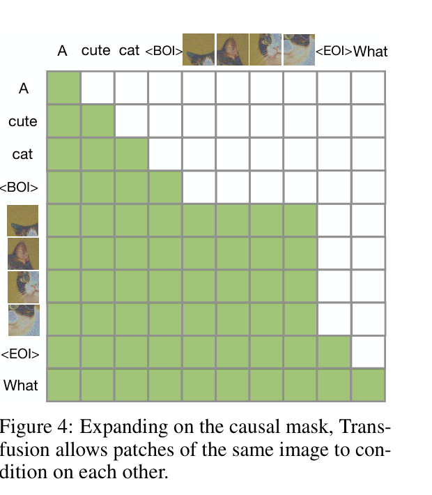

# Transfusion

> [!info] 文档关系
> - 文档类型：Paper
> - 领域入口：[README](../README.md)
> - 上位汇总：[Diffusion 多模态生成与 AI Infra](../surveys/multimodal-diffusion-infra.md)
> - 证据资产：`../assets/papers/transfusion/`

Transfusion 在一个 causal mixed sequence 中组合 text next-token loss 与 image DDPM loss；跨 block 保持因果，当前图像内部使用 dense bidirectional attention。服务时 AR token 是 append-only，而图像 block 在每个 denoise step 被覆盖重算，因此共享权重不等于共享调度机制。

