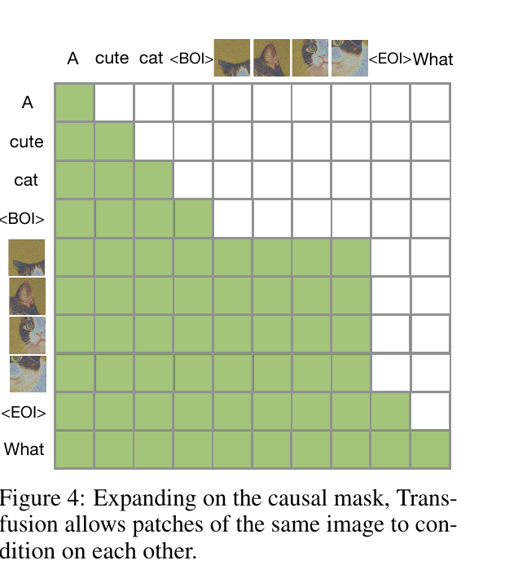
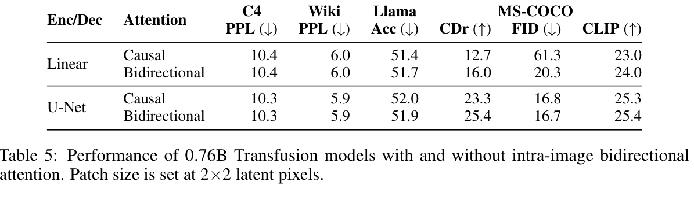
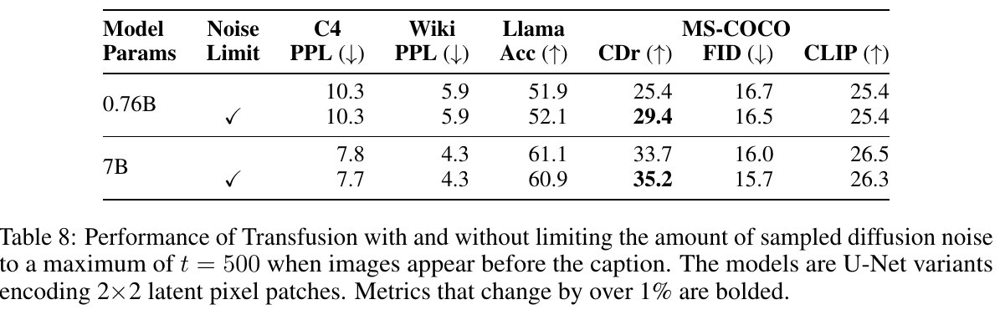

# Transfusion: Predict the Next Token and Diffuse Images with One Multi-Modal Model 精读审计

> [!info] 文档关系
> - 文档类型：Paper
> - 领域入口：[README](../README.md)
> - 上位汇总：[Diffusion 多模态生成与 AI Infra](../surveys/multimodal-diffusion-infra.md)
> - 证据资产：`../assets/papers/transfusion/`
> - 相关文档：[Figure inventory](../evidence/figure-inventory.md)

> 资料状态：官方 23 页 PDF 已保存并完成全文提取；Figure 4、Table 5、Table 8 均从 PDF 216 DPI 页面渲染重新裁剪并逐图原分辨率 QA。论文未提供官方代码/checkpoint URL，本地也无 OpenReview 快照；这些检查以 `skipped-with-reason` 分类，不影响 PDF 级审阅完成。

## 修订信息

- 当前修订 ID：`rev-transfusion-affiliation-backfill-20260730`

- 当前文档版本：`1.1.1`
- 当前修订时间：`2026-07-30T23:30:00+08:00`
- 替代版本：`rev-delivery-remediation-20260725-transfusion` / `1.1.0`

| 修订 ID | 文档版本 | 时间 | 修订者 | 类型 | 替代修订 | 迁移问题/解析 | 变更摘要 | 原因 | 影响位置 | 依据 | 对结论影响 |
|---|---|---|---|---|---|---|---|---|---|---|---|
| `rev-delivery-remediation-20260725-transfusion` | `1.1.0` | `2026-07-25T18:00:00+08:00` | `paper-review-agent + parent audit` | corrective | `rev-initial-20260712-transfusion` | 旧稿的来源状态、图注与证据边界不一致 | 以官方 PDF 重审全文，补齐术语、符号、动机闭环、设计依据、claim matrix、公式、结果归因、Infra、局限与三张原分辨率视觉 QA | non-ICML delivery remediation | 全文；[Figure inventory](../evidence/figure-inventory.md) | [arXiv:2408.11039](https://arxiv.org/abs/2408.11039)、Figure 4、Table 5、Table 8 | material |
| `rev-initial-20260712-transfusion` | `1.0.0` | `2026-07-12T17:44:02+08:00` | `review_transfusion` | initial | 无 | 无 | 首次建立论文、视觉、目标函数与 mixed-serving 审阅 | initial delivery | 全文 | arXiv PDF 与论文源码 | superseded |
| `rev-transfusion-affiliation-backfill-20260730` | `1.1.1` | `2026-07-30T23:30:00+08:00` | `/root` | `metadata-update` | `rev-delivery-remediation-20260725-transfusion` / `1.1.0` | 无 | 补充作者—机构元数据与角色证据边界 | 统一回填 affiliation 交付字段 | `作者与机构` | 论文 PDF 标题页、机构编号与角色脚注 | none：不改变方法、实验与归因结论 |

## 0. 资料与配图索引

- 论文身份：*Transfusion: Predict the Next Token and Diffuse Images with One Multi-Modal Model*，报告为 ICLR 2025 / arXiv:2408.11039。
- 官方论文：[arXiv:2408.11039](https://arxiv.org/abs/2408.11039)；本轮核验 PDF 的 SHA-256 为 `22fc9b47e2df5da239e61b3530f468597a4a1329c789e6587191824d61b6c10f`。
- 视觉：Figure 4、Table 5 与 Table 8；完整 physical page、原页尺寸、bbox、caption 和逐图 QA 见 [Figure inventory](../evidence/figure-inventory.md)。
- 代码/配置/权重：不可用。
- OpenReview：不可用，见 公开评审核验记录。
- AI 生成图：`visual-evidence-skip`；生成图不能替代论文一级证据。

## 0.1 术语与符号解释

### 0.1.1 术语表

| 术语 | 本文含义 | 别名 | 不等于/易混项 | 证据来源与歧义 |
|---|---|---|---|---|
| Transfusion sequence | 文本 token 与连续图像 latent patch 串接的 mixed-modality sequence | mixed sequence | 不是把图像量化进词表 | §3 Data Representation，physical p.5 |
| Transfusion attention | block 间因果、同一 image block 内双向的 attention | intra-image bidirectional attention | 不是整条序列全双向 | §3 Transfusion Attention，Figure 4，physical pp.5–6 |
| LM mode | 逐 token 自回归生成文本的阶段 | text decoding | 不等于训练期并行算所有 token loss | §3 Inference，physical p.6 |
| diffusion mode | 对当前 image patch block 迭代去噪的阶段 | image decoding | 不把每个 timestep 追加为历史 token | §3 Inference，physical p.6 |
| joint objective | text LM loss 与 image DDPM loss 的标量加权和 | multi-objective training | 不代表两种输出共享同一概率头或统计单位 | Eq. 4，physical p.6 |
| shared model | 大部分 transformer 主干跨模态共享 | unified backbone | 不等于 embedding、adapter、head 全共享 | §3 Model Architecture，physical p.5 |
| patch compression | 以 linear 或 U-Net adapter 聚合 latent pixels，减少 transformer image positions | image sequence compression | patch 是连续向量，不是 VQ code | §3 Model Architecture；Tables 6–7 |
| noise limiting | image-before-caption 训练时将 diffusion timestep 限制为不超过 500 | noise cap | 不是推理步数裁剪 | Table 8 caption |
| parity FLOP proxy | 达到某质量指标时的理论训练 FLOP 对比 | compute-efficiency proxy | 不是实测 serving latency/throughput | §4.2，Figure 5/Table 3 |

### 0.1.2 符号表

| 符号 | 含义 | 性质 | 作用域/索引 | 单位/取值 | 来源 | 易混点 |
|---|---|---|---|---|---|---|
| $y_i,y_{<i}$ | 当前离散 token 与其前缀 | author-defined（secondary-audited） | text positions | token/sequence | 本地证据摘要与只读投影 | 图像 patch 不属于闭合词表 |
| $P_\theta$ | 参数 $\theta$ 下的 token 条件分布 | author-defined（secondary-audited） | per text token | probability | 只读投影目标函数 | image head 输出连续噪声 |
| $x_0,x_t,x_T$ | 干净、带噪与纯噪声 image latent | author-defined（secondary-audited） | per image/timestep | tensor | 只读投影目标函数 | inference 原位更新说法未由代码复核 |
| $\epsilon,\epsilon_\theta$ | 注入噪声与预测噪声 | author-defined（secondary-audited） | per latent/timestep | tensor | 只读投影目标函数 | 未确认是否存在其他 parameterization |
| $t,T$ | 当前与总 diffusion timestep | author-defined（secondary-audited） | per image | integer | Table 8；只读投影 | $t\le500$ 是训练条件，不是 500 个推理步 |
| $\bar\alpha_t$ | 累计信号保真系数 | author-defined（secondary-audited） | per timestep | scalar | 只读投影目标函数 | schedule 细节未由 primary source 复核 |
| $\lambda$ | diffusion loss 权重 | author-defined（secondary-audited） | global | 报告为 5 | 只读投影 | 未见 sensitivity |
| $k$ | adapter 聚合窗口边长 | author-defined（secondary-audited） | model variant | latent pixels | 只读投影 | image position 数按 $k^2$ 缩减 |
| $n$ | 一个 image block 的 transformer positions 数 | author-defined（secondary-audited） | per image | positions | 只读投影 | 不是文本 token 数 |
| $B,L,h_{kv},d_h,b$ | batch、prefix 长度、KV heads、head width、每元素字节 | analysis-derived | serving estimate | request/position/dimension/byte | §8 推导 | 论文未报告具体值 |
| $T_{\mathrm{infer}},g$ | 去噪迭代数与 CFG forward 系数 | analysis-derived | per image request | step / multiplier | §8 推导 | $g$ 取值与 fusion 均未核验 |

## 1. 论文基本信息

### 作者与机构

- 第一作者（首位列名）：Chunting Zhou → Meta。
- 共同第一作者（仅含论文明确标注者）：
  - Lili Yu → Meta
- 通讯作者/通讯联系人（仅含论文明确标注者）：论文未显式标注。
- 其他作者涉及的机构（去重列举，不作逐作者映射）：Meta；Waymo；University of Southern California。
- 对应依据：论文 PDF 标题页、作者机构编号与角色脚注（核验日期：2026-07-30）。

- 领域：统一多模态生成；自回归语言模型与 latent diffusion。
- 核心问题：能否让一个共享 transformer 对离散文本做 next-token prediction，同时对连续图像 latent 做 diffusion，而不先把图像量化为离散词表。
- 报告范围：从小模型到 7B 级共享主干的训练与多模态理解/生成评估。
- 证据约束：PDF 可核验方法、公式与全部表格；代码、checkpoint 与 serving telemetry 不可用。

## 2. 研究动机与问题—方案闭环

### 2.1 出发点与背景痛点

作者在 Abstract/Introduction 中把动机概括为两难：纯自回归统一模型需要把图像量化成离散 code，可能造成信息损失；独立语言模型与 diffusion model 则无法共享全部参数。`author-stated`：Transfusion 保留文本与图像各自合适的目标，同时共享 transformer。

### 2.2 现有方案为何不够

`author-stated`：离散 image token 会引入 quantization，独立 tower 则不能共享全部参数。§3 进一步明确：仅把连续 patch 放进 causal sequence 会使 image block 内后部 patch 无法影响前部 patch，因此加入 image-local bidirectionality。Table 5 直接显示这种 mask 对 linear adapter 至关重要，但对含内部双向 attention 的 U-Net 边际很小，说明失败根因是“当前表示路径缺少足够的同图信息交互”，而非所有配置都同等依赖 transformer 内双向 attention。

### 2.3 目标问题与成功标准

- 目标：一个主干同时完成 text understanding/generation 与 image understanding/generation。
- 约束：text 保持 causal next-token semantics；image 保持 continuous denoising；跨块不泄漏未来。
- 成功标准：语言 PPL/accuracy 不显著退化，图像 FID/CLIP 与 caption CIDEr 具有竞争力，并能在 mixed sequences 双向切换。
- 非目标：论文没有在本地证据中证明 production serving throughput、KV-cache 正确性、数值格式或多 accelerator scaling。

### 2.4 核心方案如何解决并优化问题

| 原始问题/失败模式 | 根因或约束 | 对应设计 | 改变的变量/行为 | 作用机制 | 预期优化 | 证据 | 判断 |
|---|---|---|---|---|---|---|---|
| 图像离散化损失细节 | VQ bottleneck | continuous latent + DDPM loss | image output space 从 categorical 改为 continuous noise prediction | 避免对图像细节做词表量化 | FID/CLIP 与 scaling | §4.2 Figure 5/Table 3；recipe 有混杂 | partially supported |
| 同图 patch 因 causal mask 隔离 | raster-like causality | intra-image bidirectional attention | image block 的可见性矩阵 | 所有同图 patch 交换空间信息 | FID/CIDEr | Table 5 | supported for linear; partial for U-Net |
| 两模态需要不同归纳偏置 | 输出空间和统计单位不同 | $\mathcal L_{LM}+\lambda\mathcal L_{DDPM}$ | 共享参数接收两种梯度 | 保留原生 loss，同时共享 backbone | joint quality | §3 Eq. 4；$\lambda=5$ 无公开 sensitivity | partially supported |
| 高噪图像不能可靠条件 caption | 训练 diffusion 需要随机噪声 | image-before-text 时限制 $t\le500$ | 下游文本看到的视觉 SNR | 提高图像条件可辨识度 | CIDEr | Table 8 | supported |
| image positions 太多 | attention/KV 随 $n$ 增长 | U-Net patch compression | 减少 transformer image positions | adapter 先做局部聚合 | 质量/序列成本 Pareto | Tables 6–7；image exposure/容量仍混杂 | partially supported |

### 2.5 完整因果链与证据闭环

背景触发是“统一模型”希望共享参数，却不能牺牲文本的因果建模或图像的连续生成。可观察痛点分别是离散图像 bottleneck、独立双塔重复、同图 causal 信息流受限和高噪图像对后续文本不可靠。Transfusion 通过 mixed sequence、模态专用目标、image-local bidirectional mask、adapter 压缩和位置相关 noise cap 改变输出空间、可见性矩阵、序列长度与条件信噪比。Figure 5/Table 3 在 recipe 级支持 continuous diffusion 相对 Chameleon 的 scaling，Table 5 直接支持 mask×adapter 交互，Table 8 直接支持 noise cap 对 captioning 的收益；但 shared-vs-separate、$\lambda=5$、250-step inference 与 production serving 没有匹配消融或 telemetry。因此整体判断是 `partially-supported`，审阅本身在 PDF 证据边界内 complete。

## 3. 核心贡献

1. 以单一 mixed sequence 表示 text token 与 continuous image patches。
2. 在同一 transformer 上聚合 LM 与 DDPM 两种目标，而不是把图像强制改写成 AR code。
3. 采用 block-aware attention：跨元素 causal，同图内部 bidirectional。
4. 用 adapter 控制 image sequence compression，并揭示 adapter 与 attention mask 的交互。
5. 暴露 image-before-text 时 diffusion corruption 与理解目标的冲突，并以 noise cap 缓解。

## 4. 研究方法

### 4.1 方法总览

输入 sequence 由 text、BOI、image latent patches、EOI 交错组成。text positions 走 embedding/LM head 与 causal loss；image positions 走 image adapter/diffusion head 与 denoising loss；共享 transformer 处理二者。推理时 BOI 触发 image block 的迭代去噪，$x_{t-1}$ 原位覆盖 $x_t$，EOI 后恢复 AR text decode（§3 Inference）。cache 行为仍未有代码验证。

Figure 4 显示：跨元素保持下三角 causal mask，而同一 image block 形成 dense square；后续 EOI/text 可看完整先前图像，图像 patch 不能看未来 EOI/text。

### 4.2 组件级设计动机与具体问题映射

| 设计项 | why 状态 | 证据 | 具体问题 | 因果机制 | 替代/权衡 | 验证 | 判断 |
|---|---|---|---|---|---|---|---|
| continuous latent | author-stated | Intro, §2.3, §4.2 | VQ bottleneck | continuous denoising | VQ 易部署但有量化损失 | Chameleon replacement baseline，recipe 级混杂 | partially supported |
| BOI/EOI delimiters | author-stated | §3 Data Representation/Inference | 模态边界与 mode switch | 显式标记 adapter/state | 外部 router 更清晰但不统一 | 无 marker ablation | plausible |
| shared transformer | author-stated | §3 Model Architecture | 双主干重复 | 跨模态复用大参数矩阵 | separate towers 可专门调优 | 无 matched shared-vs-separate ablation | partially supported |
| modality-specific adapters | inferred | Table 5 rows | 离散/连续接口不同 | 适配输入输出空间 | 全共享更简洁但约束更强 | adapter comparison confounded | plausible |
| intra-image bidirectional mask | author-stated | Table 5 | 同图 causal 隔离 | dense image block interaction | causal KV cache 更简单 | direct matched ablation | supported |
| joint weighted loss | author-stated | §3 Eq. 4, §4.1 | 两种输出统计不同 | 两类梯度更新共享 $\theta$ | dynamic weighting/alternation | 联合结果有，$\lambda$ sensitivity 无 | partially supported |
| U-Net adapter | inferred + secondary hypothesis | Table 5 | linear adapter 缺局部 mixing | spatial inductive bias | 增参数和 kernels | interaction evidence | partially supported |
| noise cap $t\le500$ | author-stated | Table 8 | 高噪 image 破坏 caption condition | 提高条件 SNR | clean auxiliary branch | direct matched ablation | supported |
| 250-step image inference | not-stated rationale | §4.1 Inference | quality/compute trade-off | iterative denoising | accelerated samplers | 无 step sensitivity/latency | unverified |

### 4.3 关键公式

$$
\mathcal L_{LM}=\mathbb E[-\log P_\theta(y_i\mid y_{<i})]
$$

$$
x_t=\sqrt{\bar\alpha_t}x_0+\sqrt{1-\bar\alpha_t}\epsilon
$$

$$
\mathcal L_{DDPM}=\mathbb E\left[\lVert\epsilon-\epsilon_\theta(x_t,t,c)\rVert_2^2\right]
$$

$$
\mathcal L=\mathcal L_{LM}+\lambda\mathcal L_{DDPM},\qquad \lambda=5
$$

公式分别由 PDF Eq. 1、Eq. 2、Eq. 3 和 Eq. 4 核验。§3 明确 LM loss per token、DDPM loss per image；但具体 reduction 实现与 $\lambda$ 的 sensitivity 未报告。

### 4.4 训练、实验与部署边界

§4.1 报告 AdamW、4096 sequence、0.5T/2T budgets、训练 schedule 1000、推理 250 steps 和 CFG 系数，但没有 dtype、parallelism 或 serving implementation。任何 production 性能推断必须与 paper-reported fact 分离。

## 5. 关键结论

### 5.1 技术点证据矩阵

| 技术点 | 声称收益 | 对应证据 | 控制 | 强度 | 结论 |
|---|---|---|---|---|---|
| intra-image bidirectional mask | 改善图像/理解 | Table 5 | 同规模、同 adapter 行内 matched | direct ablation | linear 强支持，U-Net 边际小 |
| U-Net adapter | 提供空间 mixing | Table 5 mask interaction | adapter 容量不同 | indirect/confounded | plausible |
| noise cap | 改善 image-to-text | Table 8 | 同规模 on/off | direct ablation | supported for CIDEr |
| continuous diffusion 胜过 discrete image LM | 质量与 scaling | Figure 5/Table 3，§4.2 | 数据/compute/VAE 尽量匹配，recipe 不完全相同 | replacement baseline / confounded | recipe-level supported |
| shared backbone 比双塔高效 | 复用参数 | §3 参数共享描述；无 matched serving/throughput | 未受控 | mechanism only | unverified system gain |
| $\lambda=5$ 合理 | 平衡训练 | 无 sensitivity | 未受控 | none | unverified |
| 250 steps 合理 | 生成质量 | 无 step curve/latency | 未受控 | none | unverified |

### 5.2 直接消融与原分辨率证据

Table 5：linear adapter 下 causal→bidirectional 使 FID $61.3\to20.3$，绝对下降 $41.0$、相对下降约 $66.9\%$；CIDEr $12.7\to16.0$。U-Net 下 FID 仅 $16.8\to16.7$，CIDEr $23.3\to25.4$。这直接证明 mask 收益依赖 adapter 是否已提供空间 mixing，不能把 linear 的巨大 FID 增益外推到最终 U-Net 配置。

Table 8：限制 $t\le500$ 后，0.76B CIDEr $25.4\to29.4$，绝对 $+4.0$、相对约 $+15.7\%$；7B 为 $33.7\to35.2$，绝对 $+1.5$、相对约 $+4.5\%$。其余指标变化较小，支持“noise cap 主要修复 image-to-text conditioning”而非普遍提升所有能力。

### 5.3 收益归因

| 变化 | 指标变化 | 影响路径 | 证据 |
|---|---|---|---|
| causal→bidirectional, linear | FID $-41.0$；CIDEr $+3.3$ | image-block 信息流 | matched direct |
| causal→bidirectional, U-Net | FID $-0.1$；CIDEr $+2.1$ | 与 adapter mixing 重叠 | matched direct |
| noise cap, 0.76B | CIDEr $+4.0$ | 更清晰的 image condition | matched direct |
| noise cap, 7B | CIDEr $+1.5$ | 同上但规模效应更弱 | matched direct |
| 其他总体收益 | 不可独立归因 | 数据、容量、目标与训练 recipe 混杂 | PDF 可核验结果，但归因仍 confounded |

## 6. Related Work 对比

| 类别 | 核心机制 | 优点 | 局限 | 与本文关系 |
|---|---|---|---|---|
| discrete unified LM | VQ image codes + AR loss | 单一 decode runtime | quantization 与长 image sequence | Transfusion 的主要概念对照 |
| VLM understanding | visual encoder/projector + LM | 复用成熟组件 | 通常不原生生成图像 | Transfusion 目标更双向 |
| LM + external diffusion | LM 路由独立 denoiser | 模态专用能力强 | 主干与 serving 资源重复 | Transfusion 强调共享 backbone |
| latent diffusion | text encoder condition denoiser | 图像生成成熟 | 不生成 text | Transfusion 保留其连续目标 |

公平性边界：§4.2 尽量匹配数据、compute 与 autoencoder，但 Table 4 显示 Chameleon 还包含 stability modifications；Table 9 又使用异构 literature-reported 数据、参数、冻结 encoder、reranking 与 synthetic captions。因此前者是 recipe-level controlled comparison，后者只能说明竞争力。

## 7. OpenReview 公开评审交叉核验

没有本地公开评审、decision、rebuttal 或 discussion 快照，因此本节 `skipped-with-reason`。详见 公开评审核验记录。这不影响 PDF 级方法与实验审阅，却无法判断 rebuttal 是否补充了 $\lambda$、代码、baseline 或 serving 证据。

## 8. Infra 需求分析

### 8.1 计算与节拍

text decode 是每步一个 query；image decode 是对 $n$ 个当前 image positions 重复 $T_{\mathrm{infer}}$ 次：

$$
C_{\mathrm{text}}\approx mC_{\mathrm{step}}(1,L),\qquad
C_{\mathrm{image}}\approx T_{\mathrm{infer}}gC_{\mathrm{step}}(n,L+n)
$$

共享权重不等于共享最优 batch shape。AR 对低延迟敏感，diffusion 更像重复的大块矩阵任务；统一 scheduler 容易产生 head-of-line blocking。

### 8.2 显存、KV 与带宽

前缀 KV 的符号估计为：

$$
S_{\mathrm{prefix}}=2BLh_{kv}d_hb
$$

当前 image block 每个 diffusion step 都改变 hidden state，因此普通 append-only KV 不能直接复用：

$$
\mathrm{Traffic}_{\mathrm{imageKV}}\gtrsim2BT_{\mathrm{infer}}nh_{kv}d_hb
$$

有效带宽与利用率只能写为：

$$
\mathrm{EffectiveBandwidth}=\frac{\mathrm{BytesMoved}}{\mathrm{RuntimeSeconds}},\qquad
\mathrm{Utilization}=\frac{\mathrm{EffectiveBandwidth}}{\mathrm{PeakBandwidth}}
$$

论文的本地证据没有 bytes、runtime 或 peak，因此不能给数值。

### 8.3 Data types、互联与异构

- fp32/fp16/bf16/fp8、KV dtype、累加精度、量化与 custom kernel：未报告/未核验。
- TP/DP/FSDP、NVLink/RDMA、all-reduce volume：未报告/未核验。
- CPU 可承担 tokenizer、VAE I/O 与 scheduler；GPU/NPU 可承担 transformer、diffusion 与 U-Net，但 DMA、pinned memory、async copy 和 fallback 路径均无证据。
- block mask、mode switch 与 U-Net adapter 要求 accelerator 具备完整算子覆盖；这是系统推断，不是论文结论。

### 8.4 Serving 状态机

| 阶段 | shape | cache 行为 | 调度需求 | 风险 |
|---|---|---|---|---|
| text prefill | $B\times L$ | 建 prefix KV | length bucketing | 长 mixed context 占 HBM |
| text decode | $B\times1$ | append-only | continuous batching | 被 image job 阻塞 |
| image step | $B\times n$ | current block 重算 | 按 $n,t,g$ 分桶 | 多步 residency |
| EOI transition | $B\times1$ | commit final image KV | consistency barrier | 旧 $x_t$ KV 污染 later text |

没有代码或 telemetry，故这只是复现时必须测试的 hypothesis。

## 9. 开源代码、配置与 checkpoint 对照

PDF 未给出官方 repository 或 checkpoint URL，本地也没有 commit、configuration 或 checkpoint metadata。因此代码 cross-check 为 `skipped-with-reason`；dtype、mask materialization、loss reduction、CFG fusion、cache refresh 与 parallelism 均不声称已核验。

## 10. 优点、局限与 evidence loop

### 优点

- 问题分解清楚：共享主干不要求强行统一两种输出分布。
- Table 5 揭示 mask 与 adapter 的关键交互，而不是仅报告完整模型。
- Table 8 直接暴露 multi-objective training 中 corruption 与 conditioning 的冲突。

### 局限

- source archive 未供应，但完整 PDF 足以核验正文与 appendix。
- 无代码/配置/权重/OpenReview 快照。
- shared-vs-separate、$\lambda$、推理步数和 serving 成本缺 matched evidence。
- Table 9 的大模型竞争力对比具有跨论文数据与评测混杂。

### Evidence loop

核心 claim 是“一套 shared transformer 可同时承载 AR text 与 diffusion image”；机制由 mixed sequence、block mask、双目标、adapter 与 noise cap 构成。PDF 的 Figure 5/Table 3 支持 recipe-level scaling，Table 5/8 直接闭合 mask 和 noise cap 两条局部因果链；shared runtime efficiency 仍无 telemetry。故论文级可行性结论成立，但组件归因和生产系统结论必须收窄。

## 11. 研究启发

- 在相同 image exposure 而非相同 element budget 下复做 patch compression。
- 对 $\lambda$、noise cap 与 denoising steps 画质量—吞吐 Pareto surface。
- 构建 text-only、image-only、interleaved 三类 workload，测 TTFT、TPOT、image latency、HBM 与 cache rebuild。
- 对 final-image KV commit 与全 image-block recompute 做 correctness/latency 对照。

## 12. 解读问题/待验证清单

1. DDPM loss 的 reduction 粒度如何与 token-level LM loss对齐？
2. 每张图是否独立采样 $t$，多个 dense image blocks 如何 materialize mask？
3. later text 是否使用最终 $x_0$ 对应的完整 KV 重算？
4. CFG 两路是否共享 prefix KV 或 fused batch？
5. shared backbone 相对同总参数 separate models 是否真实节省 HBM/吞吐？
6. $\lambda$ 与 text:image element ratio 是否造成梯度或容量偏置？
7. 250 steps 的质量—延迟曲线如何？
8. OpenReview rebuttal 是否补充上述缺口？

## 13. 一句话总结

Transfusion 的 PDF 证据支持“同一 shared transformer 可组合 AR text 与 diffusion image”，并直接证明同图双向 attention 与位置相关 noise cap 能修复 mixed-sequence 的具体冲突；最大不确定性仍是组件级归因和未实现、未测量的 mixed serving。
