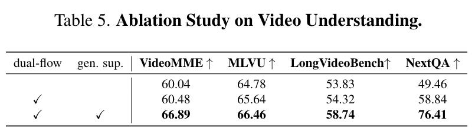

# Vega：统一视频理解与生成的 AR–Diffusion 混合框架精读

> [!info] 文档关系
> - 文档类型：Paper
> - 领域入口：[README](../README.md)
> - 上位汇总：[近半年多模态视觉生成模型全景](../surveys/visual-generation-model-landscape.md)
> - 证据资产：`../assets/papers/vega/`
> - 证据索引：[Figure inventory](../evidence/figure-inventory.md)

> 资料状态：已核验 15 页 arXiv PDF 与完整 LaTeX source。论文未链接可用的 Vega code、checkpoint 或 OpenReview；因此接口、精确参数和最终 checkpoint 的统一性只能按论文证据判断。

## 修订信息

- 版本：`1.0.0`
- 修订 ID：`rev-vega-1.0.0`
- 时间：`2026-07-28T20:30:00+08:00`
- 类型：initial

## 1. 核心结论

Vega 最有价值的地方不是把 AR 与 diffusion 混在一个标签里，而是给两者清楚分工：

- AR Transformer 预测低频、离散的 semantic keyframe token；
- diffusion decoder 把语义状态渲染成稠密 49 帧视频；
- 理解侧复用视觉 token，但采用 dual-flow selection 和额外 visual-token supervision。

参数口径必须修正：论文 Tables 1–2 的 `3B` 对应 Qwen2.5-3B AR backbone，不是完整生成系统。已披露组件至少有：

$$
P_{\mathrm{resident}}
=P_{\mathrm{AR}}+P_{\mathrm{diff}}+P_{\mathrm{tokenizer}}+P_{\mathrm{MLP}}
>3.0\mathrm{B}+1.3\mathrm{B}=4.3\mathrm{B}.
$$

这只是生成路径驻留参数下界；tokenizer、MLP、冻结/卸载/共享方式均未披露。全文没有 MoE、expert routing 或 active-expert count，稀疏关键帧是 token/时间计算稀疏，不是参数稀疏。

## 2. 方法

> 原论文 Figure 2 与完整 caption。左侧生成路径是 text/keyframe tokens → AR → semantic keyframe prediction → diffusion；右侧理解路径是 dual-flow visual tokens + text → AR answer，并对视觉 token 加监督。

### 2.1 生成路径

TA-Tok 把视觉映射到 65,536 项离散语义词表。AR 以约 2 秒间隔预测关键帧 token，降低稠密视频序列的 token 成本。2-layer MLP 把离散语义接到 Wan2.1-1.3B diffusion decoder，后者输出 49×832×480、8 FPS 视频。推理使用 AR top-k 256/top-p 0.95 和 diffusion CFG 4.0/50 steps。

### 2.2 Noise-controlled condition

I2V/V2V 中，framewise mask $M$ 决定哪些 latent 加噪：

$$
\tilde z_t=\sqrt{\bar\alpha_t}z+M\odot\sqrt{1-\bar\alpha_t}\epsilon.
$$

参考帧取 $M=0$，保留可逆外观 latent；目标帧取 $M=1$，由 diffusion 去噪。论文给出机制和定性结果，但没有独立量化 noise control 的收益。

### 2.3 理解路径

30 帧被分成 10 个 pivot 和 20 个 detail frame；pivot 用较小 pooling scale 2，detail 用 scale 3。这里所谓 pivot 仍是均匀采样，不是学习式 shot-boundary detector。masked visual-token prediction 为文本答案之外提供更密集的视觉监督。

## 3. 数据与训练

| 阶段 | 披露数据 | 日程 | 关键缺口 |
|---|---|---|---|
| Stage 1 | 约 100M image-text；列出 Blip3o、JourneyDB、FineVision 等 | batch 256，200k steps | 每源权重、过滤/去重、许可、dtype、硬件 |
| Generation | 5M videos + 若干 image sets；video:T2I=2:1；30% I2V | batch 64，60k steps；49×832×480 | 5M 是否只计视频、loss、compute |
| Understanding | 第二阶段来源；具体混合未知 | batch 16，80k steps；30 frames | mask ratio、loss weight、污染检查 |

论文未披露训练/推理 dtype、GPU/NPU、wall-clock、FLOPs、吞吐或 latency。

## 4. 证据

> 原论文 Table 5 与完整 caption。Baseline→dual-flow 在四项理解 benchmark 上均提升；再加入 generative visual supervision 后继续提升，但没有多种子方差。

| 设计 | 证据 | 判断 |
|---|---|---|
| visual-only diffusion condition | Table 3 相对 text-only replacement | reported setting 内直接支持 |
| keyframe/token 数折中 | Table 4 sensitivity | 支持存在 trade-off；无 latency/FLOPs |
| dual-flow | Table 5 sequential ablation | 结果支持 |
| vision supervision | Table 5 增量 | 结果支持；机制与超参未隔离 |
| AR→diffusion hybrid 优于纯 AR | 主表/完整系统 | 多项变化捆绑，只能部分支持 |
| 理解与生成相互迁移 | 无 remove-one-task/cross-task control | 未验证 |

## 5. “统一”的边界

理解 benchmark、VBench/VBench++、token sensitivity 和 Figure 2 能证明框架层共享 AR/视觉词表接口，但不能证明：

- 理解与生成来自同一个公开最终 checkpoint；
- 两个任务存在可量化双向 transfer；
- 一次部署能同时复现两条路径；
- 3B 是全系统参数；
- 稀疏 keyframe 等于 sparse parameters。

所以更准确的表述是“统一框架、分支证据”，而不是“已复现的单 checkpoint 端到端产品”。

## 6. Infra 含义

- 生成路径至少常驻 >4.3B 参数，还要运行 50 次 diffusion denoising；延迟很可能由 decoder 主导，但论文没有测量。
- 理解路径不需要 diffusion，active/resident 参数应与生成路径分开报告。
- keyframe AR 减少语义 token，diffusion 仍承担稠密时间/空间计算；这是计算分层，不是免费压缩。
- 缺少 dtype、hardware、code 与 checkpoint，无法给可靠显存、吞吐或带宽估计。

## 7. 局限

1. 无代码、checkpoint 或 OpenReview。
2. 精确 total/active、tokenizer/MLP 参数和冻结/卸载策略未知。
3. dtype、hardware、compute、latency 全部未披露。
4. 数据混合、过滤、去重与许可不完整。
5. 理解/生成统一性缺少跨任务受控实验。

## 来源

- [arXiv:2606.31326](https://arxiv.org/abs/2606.31326)
