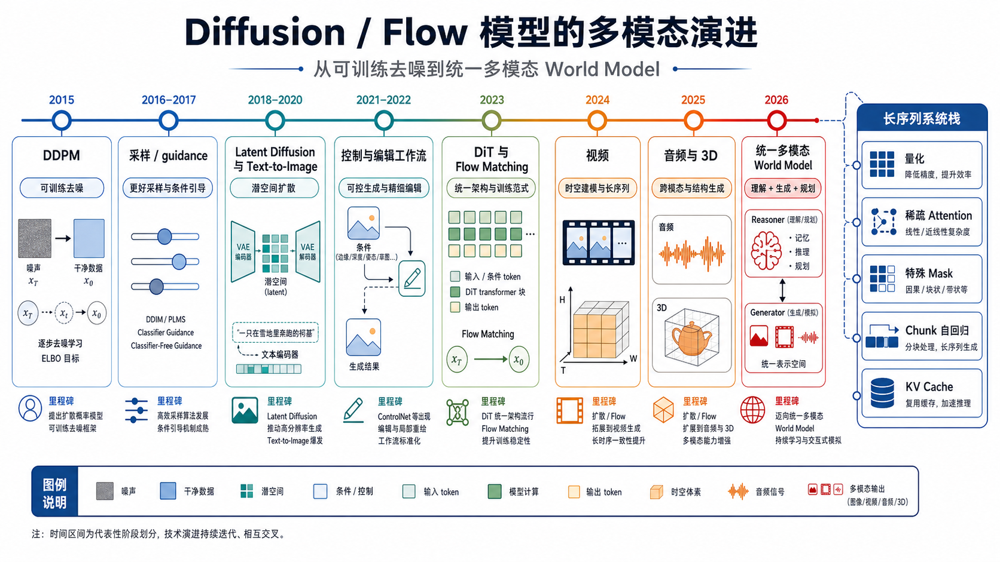
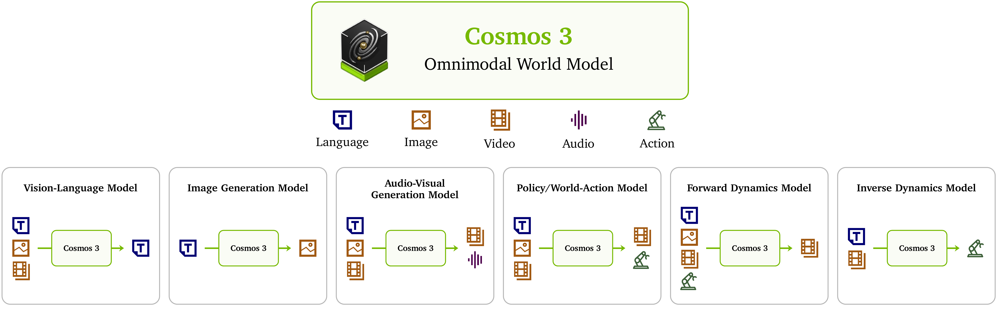
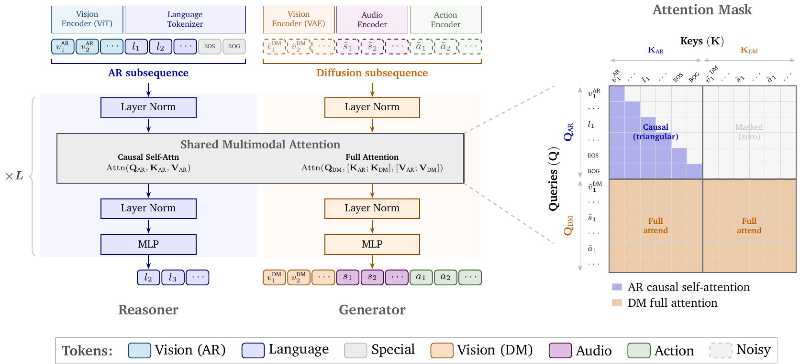
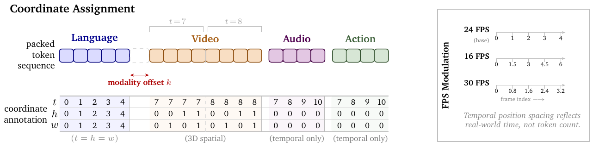
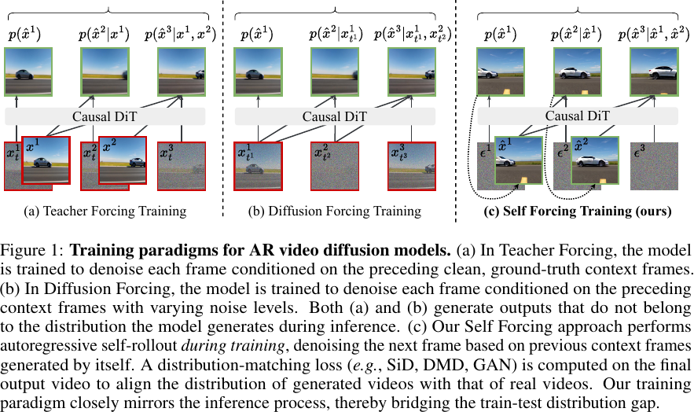
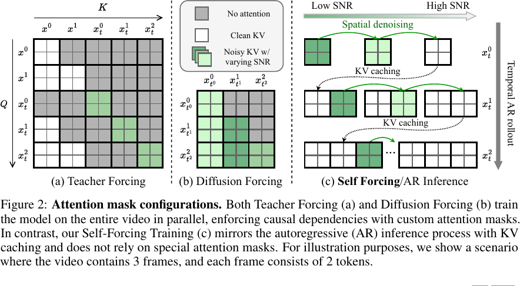
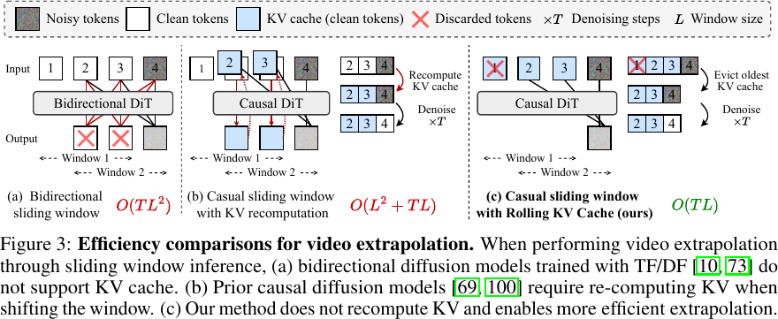
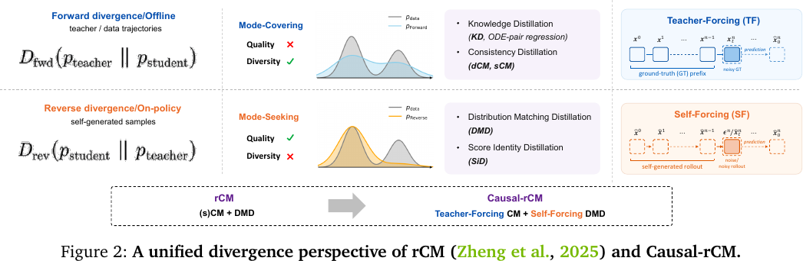
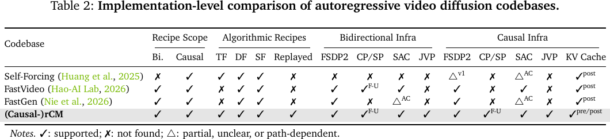

# Diffusion 模型多模态演进调研

> [!info] 文档关系
> - 文档类型：Survey
> - 领域入口：[README](../README.md)
> - 证据资产：`../assets/surveys/diffusion-evolution/`
> - 相关文档：[Cosmos 3](../papers/cosmos-3.md)，[Model pipeline](../topics/model-pipeline.md)

## 资料边界

- 生成日期：2026-07-02。
- 范围：以多模态 diffusion / flow 生成模型为主，覆盖图像、视频、音频、3D、动作/世界模型；dLLM 只作为相邻分支。

生成日期：2026-07-02  
范围：以多模态 diffusion / flow 生成模型为主，覆盖图像、视频、音频、3D、动作/世界模型；dLLM 只作为相邻分支，不纳入多模态主演进线。

## 结论先行

Diffusion 模型的多模态演进不是“图像、视频、音频、3D”的简单分类扩展，而是一条按瓶颈推进的时间线：

1. 先解决可训练的 denoising 生成目标。
2. 再解决采样、score/SDE、guidance 和质量。
3. 再用 latent diffusion 把高分辨率生成变得可承受。
4. 再通过 CLIP/大语言编码器把文本条件接入图像生成。
5. 再通过 ControlNet、Adapter、InstructPix2Pix 把 diffusion 变成可控工作流。
6. 再用 DiT、rectified flow、flow matching 推动 backbone 和 objective 的规模化。
7. 再把静态图像扩展到视频、音频、3D 等连续信号。
8. 最后走向 Cosmos 3 这类 reasoner + diffusion/flow generator 的 omnimodal world model。

主线图如下。dLLM 作为相邻文本生成分支，不进入这张多模态 diffusion / flow 主线图。



## 1. 2015-2020：从热力学扩散到 DDPM

代表工作：

- Sohl-Dickstein et al., 2015, `Deep Unsupervised Learning using Nonequilibrium Thermodynamics`
- Ho et al., 2020, `Denoising Diffusion Probabilistic Models`

这一阶段解决的是“diffusion 能不能成为稳定生成模型”。早期思想是逐步加噪，再学习反向去噪。DDPM 的关键贡献是把训练目标简化成可工程复现的噪声预测/去噪目标，使 diffusion 从理论框架变成强图像生成 baseline。

趋势意义：

- diffusion 的核心不在“多模态”，而在“可学习的反向生成过程”。
- 后续所有多模态扩展，本质都是把不同模态转成某种可 denoise / velocity predict 的表示。

## 2. 2020-2021：采样、score/SDE、guidance 成熟

代表工作：

- DDIM
- Score-Based Generative Modeling through SDEs
- Improved DDPM
- Guided Diffusion
- Classifier-Free Guidance

这一阶段的瓶颈是质量和采样效率。DDIM、Score SDE、Improved DDPM、EDM、progressive distillation、consistency model 等工作，把 diffusion 从“能生成”推向“可调采样速度、质量和 likelihood”。Guidance 进一步让条件生成质量明显提升。

趋势意义：

- 多模态系统后来大量复用这些采样器、noise schedule、guidance 机制。
- CFG 让“条件强度”成为可调旋钮，直接影响后来的 text-to-image、video 和 audio prompt following。

## 3. 2021-2022：Text-to-Image 与 Latent Diffusion

代表工作：

- Latent Diffusion Models / Stable Diffusion
- DALL-E 2
- Imagen

这一阶段真正打开“多模态 diffusion”的入口，但最初是弱多模态：文本作为条件，图像作为生成目标。

LDM 的关键是把像素空间扩散改成 VAE latent 空间扩散。这样高分辨率生成不再需要直接在像素上反复 denoise，计算成本大幅下降。DALL-E 2 走 CLIP latent 层级生成路线；Imagen 则强调大语言编码器对 prompt fidelity 的决定性作用。

趋势意义：

- 文本条件不是附属模块，而是生成质量的一部分。
- latent 表示成为后续视频、音频和世界模型的基础工程选择。
- Stable Diffusion 生态说明：一旦 latent diffusion 和开源权重结合，控制、插件、LoRA、微调、部署会迅速爆发。

## 4. 2022-2023：控制、编辑与工作流化

代表工作：

- ControlNet
- T2I-Adapter
- InstructPix2Pix

这一阶段的瓶颈是 prompt-only 生成不可控。真实产品和创作流程需要姿态、边缘、深度、分割、局部编辑、指令编辑等明确约束。

ControlNet 的思路是给预训练 diffusion 增加可训练控制分支，让边缘、pose、depth 等控制图可以稳定影响生成。T2I-Adapter 则代表轻量 adapter 路线。InstructPix2Pix 说明编辑可以通过合成指令数据变成监督任务。

趋势意义：

- diffusion 从“模型”变成“工作流组件”。
- 控制层和 base model 可以解耦，这解释了为什么开源生态里 ControlNet、LoRA、Adapter 会非常重要。
- 但这一套对视频/世界模型还不够，长时序控制和物理约束远比单图控制难。

## 5. 2022-2024：Transformer 与 Flow 化

代表工作：

- DiT
- U-ViT / PixArt-alpha
- Flow Matching
- Rectified Flow
- Stable Diffusion 3

这一阶段的瓶颈是 U-Net 结构和传统 diffusion 采样路径的规模化上限。DiT 证明 latent patch + transformer 可以成为 diffusion backbone。Flow Matching 和 Rectified Flow 把生成理解为连续分布之间的速度场/传输路径。Stable Diffusion 3 则把 rectified-flow transformer 推到高分辨率 text-to-image 系统层面。

趋势意义：

- 大模型化之后，diffusion 越来越像 transformer 系统，而不是传统图像 U-Net。
- 目标函数从“反向扩散”扩展成更宽的 diffusion/flow family。
- 对多模态模型来说，这个转向很关键：transformer 更容易统一处理文本、图像 patch、视频 latent、音频 token、action token。

## 6. 2022-2025：视频成为多模态主战场

代表工作：

- Video Diffusion Models
- Make-A-Video
- Imagen Video
- Video LDM
- Stable Video Diffusion
- CogVideoX
- HunyuanVideo
- Movie Gen

视频把 diffusion 的难度从“单帧真实感”提升到“时间一致性”。模型必须同时处理主体身份、运动轨迹、相机运动、场景持续性和长时序采样成本。

早期视频 diffusion 常见路线是从图像模型迁移：增加 temporal layer、使用分层/cascade、先图像后视频、或在 latent space 做视频 denoising。后来的 CogVideoX、HunyuanVideo、Movie Gen 等系统更明显地走向 large video DiT / media foundation model。

趋势意义：

- 视频是 world model 的前置压力测试。
- 只会生成漂亮单帧不够，模型需要理解物体如何随时间变化。
- 视频还把推理成本问题放大，因为 denoising loop 要乘上空间和时间维度。

## 7. 2023-2025：音频与 3D 扩展

代表工作：

- DiffWave / WaveGrad
- AudioLDM
- DreamFusion
- Magic3D
- ProlificDreamer
- Shap-E

音频和 3D 说明 diffusion 的跨模态扩展不是简单换数据集，而是先选表示。

音频可以在 waveform、mel-spectrogram 或 latent 表示上建模。AudioLDM 继承了 latent diffusion 思路，把 text-to-audio 变成音频 latent 的生成问题。3D 分支则经常使用 2D diffusion prior 来监督 NeRF/mesh/implicit field，例如 DreamFusion 的 score distillation 路线。

趋势意义：

- 每种模态都需要自己的 codec / latent / renderer / decoder。
- “统一模型”不等于所有模态共享完全相同的低层表示。
- 3D 和 audio 进一步暴露同步和物理一致性问题：声音要和画面事件对齐，3D 要跨视角一致。

## 8. 2024-2026：统一多模态与 World Model

代表工作：

- Transfusion
- Show-o
- Movie Gen
- Cosmos 3

这一阶段的关键问题变成：如何让理解、推理和生成在一个系统里协同。

Transfusion 尝试在同一多模态模型里同时做 next-token prediction 和 image diffusion。Cosmos 3 则走得更远：把系统定位成 omnimodal world foundation model，不只做 text-to-video，还要处理 video、audio、action 和 reasoner。

Cosmos 3 的关键思想可沿主 Paper 的证据章节阅读：

- [AR 与 diffusion subsequence](../papers/cosmos-3.md#22-mot-与单向条件注入) 分别承载 reasoner/understanding 与 image/video/audio/action flow generation。
- [Mixture-of-Transformers](../papers/cosmos-3.md#22-mot-与单向条件注入) 让 reasoner/generator 在每层使用独立参数，并由 two-way attention 让 generator 单向读取 AR 条件。
- [3D mRoPE 与物理时间](../papers/cosmos-3.md#23-unified-3d-mrope-与物理时间) 对齐 video/audio/action 的 timestamp，而不是强制各模态使用相同 TPS。
- [训练 curriculum](../papers/cosmos-3.md#3-训练目标与阶段) 与 [joint loader / serving infra](../papers/cosmos-3.md#5-infrastructure) 是完整系统结果的重要混杂因素，不能把榜单收益单独归给 MoT。

已有本地 Cosmos 3 分析和原论文关键图如下：







趋势意义：

- 多模态 diffusion 的终点不是“一个更大的视频模型”，而是“能按物理时间协调多种连续信号的生成/仿真模型”。
- 语言 reasoner 和 diffusion generator 的关系，需要架构级隔离和受控交互。
- 这也是为什么 dLLM 不应该被放在同一条主线：dLLM 的目标是文本生成范式，Cosmos 3 这类系统的目标是物理世界信号的生成和仿真。
- Cosmos 3 的 benchmark 与 leaderboard 边界见 [主结果证据矩阵](../papers/cosmos-3.md#6-experiments-与主结果边界)，补充问答见 [Q&A](../supplements/cosmos-3-q-and-a.md)。

## 9. 长序列 diffusion 的系统诉求：量化、稀疏 Attention 与特殊 Mask

视频、3D、音频和 world model 把 diffusion 的序列长度从二维图像 latent patch 扩展到：

```text
N = T_video * H_latent * W_latent
  + N_audio
  + N_action
  + N_text_or_reasoner
  + control / mask / reference tokens
```

这带来一个和 LLM decode 不完全相同的系统瓶颈：LLM 自回归生成可以复用 KV-cache；而视频 DiT / flow model 在每个 denoising step 都要对变化后的 latent 重新做大规模 prefill-like transformer forward。也就是说，长序列 diffusion 的成本大致是：

```text
采样步数 S * transformer 层数 L * attention/MLP over N tokens
```

因此，后续工程优化不会只靠减少采样步数，还会同时压缩 linear/MoE/attention、稀疏化 attention，并引入更复杂的 attention mask。

### 9.0 复杂度与符号：为什么长视频一定会逼出 attention 轻量化

为了避免把“视频很长所以很慢”写成泛泛判断，这里先把 video DiT / flow transformer 的核心系统量拆开。

| 符号 | 含义 | 作用域 | 备注 |
|---|---|---|---|
| `T` | 视频帧数或 latent 时间 token 数 | per sample | 受 fps、时长、temporal VAE 压缩率影响 |
| `H_l, W_l` | latent 空间高宽 | per frame | 受 VAE 空间压缩率和 patch size 影响 |
| `N_v = T * H_l * W_l` | 视频 latent token 数 | per denoising step | 长视频最主要的序列长度来源 |
| `N = N_v + N_text + N_audio + N_action + N_control` | 总 token 数 | per denoising step | world model 还要叠加音频、动作、控制和 reference token |
| `S` | sampling / denoising / flow steps | per generated clip | few-step distillation 降低的是这一维 |
| `L` | transformer 层数 | per model | DiT / video DiT 主干深度 |
| `d, H_a, d_h` | hidden size、attention heads、head dim | per layer | `d = H_a * d_h` |

单层 full attention 的主计算量可粗略写成：

```text
QKV / output projection: O(N * d^2)
QK^T + AV attention:     O(N^2 * d)
MLP:                    O(N * d * d_ff)
```

整个采样过程约为：

```text
O(S * L * (N^2 * d + N * d^2 + N * d * d_ff))
```

FlashAttention 这类 kernel 能避免显式 materialize `N*N` attention map，显著降低 HBM 读写和中间显存，但它不改变 full attention 的 `N^2` 算术复杂度。因此，当 `T`、分辨率或多模态 token 同时增长时，attention 轻量化不是可选优化，而是决定长视频是否能服务化的主瓶颈。

Movie Gen 报告其最大视频生成模型使用 30B transformer，最大 context length 为 73K video tokens，对应 16 秒、16fps 的 1080p 视频。这个量级下，仅 `N^2` token-pair 就是约 `5.3e9`，还要乘以层数、采样步数和 batch。HunyuanVideo、CogVideoX、Wan2.1 也都显示开源视频模型正在走向 10B 级 DiT / expert transformer / video foundation model。结论很直接：**长时高分辨率 video diffusion 的优化中心会从“只减少 denoising steps”扩展到“减少每一步 transformer forward 的 token、bit、attention pair 和 cache 体积”。**

### 9.1 量化：不能直接照搬 LLM PTQ

DiT / video diffusion 的主要算子仍是 linear projection、MLP、QKV/attention projection，因此量化是必然诉求。但 diffusion 的量化比普通 LLM 更麻烦，原因有三点。

第一，activation 分布随 denoising timestep 明显变化。TQ-DiT 提出 time-grouping quantization，就是为了解决 DiT activation 的时间变化；TaQ-DiT 也指出 Post-GELU activation 对 denoising step 很敏感。因此 diffusion PTQ 至少需要 **timestep-aware calibration**，不能只用一批静态校准样本。

第二，视频 token 同时有空间和时间相关性。Q-VDiT 指出，图像模型量化方法不能直接迁移到视频 DiT；它引入 token-aware quantization estimator 和 temporal maintenance distillation，目标是保住跨帧相关性。S2Q-VDiT 进一步强调，超长 video token sequence 会带来 calibration variance，并用 attention-guided sparse token distillation 强调更关键的 token。

第三，量化和稀疏 attention 会相互放大误差。QuantSparse 直接把问题说清楚：单独量化、单独稀疏都可能有效，但朴素叠加会造成 attention shift，导致质量下降。因此对长视频 DiT 来说，量化最好和 attention sparsification、temporal consistency distillation 联合设计。

具体到模块：

| 模块 | 诉求 | 风险 |
|---|---|---|
| Linear / MLP | W8A8、W4A8、FP8 / NVFP4 + INT8 混合精度，优先压缩 FFN 和投影层 | timestep activation drift、Post-GELU 非对称分布、少数 volatile blocks 被过度量化 |
| Attention Q/K/V | per-head / per-channel scaling，QK logits 和 softmax 保持更高精度，V 和 out projection 可更激进 | 长序列下小量化误差会改变 attention 排名，引发身份漂移、闪烁或跨帧不一致 |
| MoE / Mixture-of-Transformers | expert/tower 单独量化，router/gate 和 shared expert 保守量化，按专家热度做 mixed precision | 专家选择随空间位置和 denoising timestep 变化，量化可能改变 routing 或专家负载 |
| VAE / codec / decoder | 与 generator 分开校准，避免只优化 transformer 指标 | latent 误差会被 decoder 放大成纹理、颜色和时序伪影 |

DiT-MoE 还说明，expert selection 会受空间位置和 denoising timestep 影响。这意味着 MoE diffusion 的量化不能只看“每个专家权重压到几 bit”，还要看：

- router / gate 是否保持足够精度；
- 热专家和冷专家是否使用不同 bit-width；
- 不同 timestep 的专家使用分布是否被量化扰动；
- expert-parallel serving 下，量化是否真的降低端到端延迟，而不是只降低模型大小。

结论是：长序列 diffusion 的量化目标不应只写成 `W4A8` 或 `FP8`，而应写成 **timestep-aware + token-aware + modality-aware mixed precision**。

近三年代表工作可以按“从 image DiT PTQ 到 video DiT，再到量化+稀疏联合压缩”来读：

| 工作                                                 |      时间 | 主要对象                              | 关键机制                                                                                                                                         | 对长视频的启发                                                                           |
| -------------------------------------------------- | ------: | --------------------------------- | -------------------------------------------------------------------------------------------------------------------------------------------- | --------------------------------------------------------------------------------- |
| [PTQ4DiT](https://arxiv.org/abs/2405.16005)        | 2024-05 | DiT PTQ                           | Channel-wise Salience Balancing、Spearman `rho` guided Salience Calibration、离线重参数化                                                            | DiT 里有 salient channels，且 activation salience 随 timestep 变，PTQ 校准必须看 denoising 轨迹 |
| [ViDiT-Q](https://arxiv.org/abs/2406.02540)        | 2024-06 | image/video diffusion transformer | 视频/图像 DiT 量化、敏感层和敏感 timestep 识别、metric-decoupled mixed precision                                                                             | 说明 video DiT 不是把 U-Net diffusion PTQ 直接套上去；低 bit 时必须做层/timestep 级混合精度             |
| [Q-DiT](https://arxiv.org/abs/2406.17343)          | 2024-06 | DiT PTQ                           | 自动 granularity allocation、sample-wise dynamic activation quantization                                                                        | activation 同时有空间方差、时间方差和样本方差；固定 scale 容易偏                                         |
| [TaQ-DiT](https://arxiv.org/abs/2411.14172)        | 2024-11 | DiT W4A8                          | joint reconstruction、Post-GELU time-variance-aware transformation                                                                            | Post-GELU activation 是低比特量化的高风险点，不能只看 linear weight                               |
| [SVDQuant](https://arxiv.org/abs/2411.05007)       | 2024-11 | 大型 diffusion / FLUX / PixArt      | 把 activation/weight outlier 吸收到高精度 low-rank branch，Nunchaku 融合 kernel                                                                        | 对 4-bit diffusion 有工程价值：低秩补偿必须和 kernel fusion 绑定，否则额外访存会吃掉收益                      |
| [TQ-DiT](https://arxiv.org/abs/2502.04056)         | 2025-02 | DiT                               | Multi-region Quantization、Time-grouping Quantization                                                                                         | 明确把 timestep grouping 作为降低 activation temporal drift 的一等机制                        |
| [Q-VDiT](https://arxiv.org/abs/2505.22167)         | 2025-05 | video DiT                         | Token-aware Quantization Estimator、Temporal Maintenance Distillation                                                                         | 视频量化目标不只是单帧重构误差，还要保持跨帧 spatiotemporal correlation                                 |
| [S²Q-VDiT](https://arxiv.org/abs/2508.04016)       | 2025-08 | video DiT W4A6                    | Hessian-aware salient calibration data、attention-guided sparse token distillation                                                            | 超长 token sequence 会放大校准方差，校准集选择和 token distillation 都要利用 attention saliency       |
| [QuantSparse](https://arxiv.org/abs/2509.23681)    | 2025-09 | HunyuanVideo-13B                  | model quantization + attention sparsification 联合，multi-scale salient attention distillation、second-order sparse attention reparameterization | 量化和稀疏不能朴素叠加；稀疏造成的信息损失会放大量化噪声并触发 attention shift                                   |
| [6Bit-Diffusion](https://arxiv.org/abs/2603.18742) | 2026-03 | video DiT 推理                      | NVFP4/INT8 inference-time mixed precision、Temporal Delta Cache                                                                               | bit-width 可以随 timestep 和 block sensitivity 动态变化，cache/reuse 与量化会合流                |

一个更可落地的 video diffusion 量化策略应当是分层的：

| 层级 | 推荐策略 | 不建议做法 | 原因 |
|---|---|---|---|
| 权重 | per-channel / per-group W8、W6、W4，salient channel 保守处理 | 全模型统一 per-tensor W4 | DiT 权重和 activation 都有 channel salience，统一 scale 容易牺牲少数关键通道 |
| activation | timestep-aware / sample-wise dynamic scale，Post-GELU 单独观察 | 用一批静态 prompt + 单一 timestep 校准 | diffusion activation 分布沿 denoising trajectory 漂移 |
| attention Q/K | QK logits 或 score correction 保持更高精度；cached key 量化要 bias correction | 把 Q/K/V/O 全部同 bit 同 scale 处理 | 小量化误差会改变 softmax 排名，长序列下会放大为时序漂移 |
| video token | attention-guided token distillation / salient calibration | 只最小化单 token MSE | 高影响 token 往往决定主体身份、运动和跨帧一致性 |
| MoE / 多塔 | router/gate、shared expert、热 expert 更保守；冷 expert 可更激进 | 只按参数量平均分 bit | expert routing 随 timestep、空间位置、模态而变，量化可能改变 routing 分布 |
| VAE / decoder | 与 generator 分开校准，质量指标看最终视频 | 只看 latent MSE 或 transformer layer error | codec 误差会被 decoder 放大成纹理、颜色和闪烁 |

如果服务化目标是高分辨率长视频，量化 KPI 也不应只写 model size。更合理的指标是：

```text
显存 = 参数显存 + activation workspace + KV/residual cache + VAE/decoder workspace
端到端延迟 = S * (DiT forward + VAE decode + scheduler/runtime overhead)
视频质量 = 单帧质量 + subject consistency + motion consistency + loop/frozen failure rate
```

也就是说，`W4A8`、`NVFP4/INT8` 只是数值格式；真正的系统策略是 **timestep-aware calibration + attention-aware token weighting + mixed precision runtime + cache-aware serving**。

### 9.2 稀疏 Attention：稀疏模式必须理解时空结构

视频 DiT 的 full attention 成本随 `N^2` 增长。Sparse VideoGen 明确指出，视频 DiT 的低效主要来自 3D full attention 的二次复杂度，并观察到 attention heads 可以动态分成 spatial heads 和 temporal heads。LVSA 则面向长视频，把 structured window pattern 和 rotating global anchors 结合，避免固定网格导致长程时序伪影。

这说明稀疏 attention 在 diffusion 里不能只是“随便做 top-k”或“固定窗口”。更合理的结构是：

```text
空间局部窗口
  + 时间邻域 / stride
  + 少量全局 anchor / keyframe
  + 跨模态桥接 token
  + 必要的控制 / reference tokens
```

不同 head、不同层、不同 denoising timestep 的稀疏需求也不同：

- 早期 denoising 更依赖全局布局、主体关系和大运动；
- 后期 denoising 更依赖局部纹理、边界和细节；
- 有些 attention head 主要做 frame 内空间聚合，有些 head 主要做跨帧运动对齐；
- world model 还需要跨 video/audio/action 的同步 token。

因此，高质量稀疏 attention 至少需要三类能力：

1. **结构化 block-sparse kernel**：支持窗口、条带、跨帧、全局 anchor，而不是只支持普通 causal mask。
2. **低开销动态策略**：如果每个 denoising step 都重新 profile，可能把节省的算力吃掉；LiteAttention 这类方法利用 denoising steps 间的稀疏模式连续性，就是在降低动态稀疏的控制开销。
3. **质量指标从单帧转向时序**：不能只看 FID 或单帧美观度，还要看 identity consistency、motion consistency、loop / frozen video failure、音画同步和 action consistency。

近三年的稀疏 attention 工作可以分成四类：

| 类别 | 代表工作 | 核心想法 | 优点 | 风险 |
|---|---|---|---|---|
| training-free pattern discovery | [Sparse VideoGen](https://arxiv.org/abs/2502.01776)、[Sparse-vDiT](https://arxiv.org/abs/2506.03065)、[HASTE](https://arxiv.org/abs/2605.14513) | 根据 head/layer 的 spatial、temporal、diagonal、stripe 等模式选择 sparse kernel 或预算 | 不改训练，能直接加速 CogVideoX、HunyuanVideo、Wan2.1 这类已有模型 | online profiling / mask prediction 有开销；错误 mask 会伤运动和身份一致性 |
| 通用 sparse/quantized attention | [SpargeAttn](https://arxiv.org/abs/2502.18137)、[MInference](https://arxiv.org/abs/2407.02490)、[FlexPrefill](https://arxiv.org/abs/2502.20766)、[SeerAttention](https://arxiv.org/abs/2410.13276)、[HashAttention](https://arxiv.org/abs/2412.14468) | online filter、head pattern、query-aware sparse pattern、learned block gate 或 hash retrieval | 很多是 training-free 或轻量适配，可跨 LLM / image / video 复用思想 | 多数最初面向 LLM prefill/decode，迁移到 video DiT 要重新处理双向时空 attention 和多步 denoising |
| temporal-coherent dynamic sparse | [LiteAttention](https://arxiv.org/abs/2511.11062)、[MOD-DiT](https://arxiv.org/abs/2601.11641) | 利用 denoising steps 间 sparse pattern 连续性，避免每一步重新采样/搜索 | 更适合 diffusion 的多步推理结构 | 需要确认 pattern drift 在不同 prompt、motion、resolution 下仍稳定 |
| 长视频结构化 sparse | [LVSA](https://arxiv.org/abs/2605.31057) | structured window + rotating global anchors + FlashInfer kernel | 直接针对 long-horizon frozen / loop failure；global anchor 避免固定窗口偏置 | anchor 设计和质量评估要与模型、时长、分辨率匹配 |
| 架构级降复杂度 | [FrameDiT](https://arxiv.org/abs/2603.09721) | 把跨帧建模从 token-level attention 改成 frame-level matrix attention | 从结构上降低长视频时序建模成本 | 需要训练/换架构，不是现有模型的即插即用加速 |
| AR diffusion sparse/cache | [Self Forcing](https://arxiv.org/abs/2506.08009)、[Fast AR Video Diffusion](https://arxiv.org/abs/2602.01801)、[Sparse Forcing](https://arxiv.org/abs/2604.21221)、[Forcing-KV](https://arxiv.org/abs/2605.09681) | chunk autoregressive rollout，历史通过 KV / residual / persistent block cache 保留，当前 chunk 稀疏访问历史 | 把长视频从一次 full sequence prefill 变成 stateful rollout，适合实时和交互 | cache 污染、历史遗忘、causal mask 质量损失、KV 显存增长 |

SpargeAttn 不是孤例。近三年长上下文 LLM 和视频生成都在把 full attention 拆成“先找重要 token/block/head，再只算必要 QK/AV”的问题。按机制更细地看：

| 谱系 | 代表工作 | 时间 | 稀疏粒度 | 是否可直接插到已有模型 | 对 video diffusion 的迁移判断 |
|---|---|---:|---|---|---|
| head pattern / prefill sparse | [MInference 1.0](https://arxiv.org/abs/2407.02490) | 2024-07 | per-head 的 A-shape、vertical-slash、block-sparse pattern | 是，training-free | 和 Sparse VideoGen / Sparse-vDiT 很像：先离线识别 head pattern，再在线建 sparse index；可迁移到 video DiT，但 pattern 要从 causal LLM 改成时空双向 pattern |
| query-aware KV page selection | [Quest](https://arxiv.org/abs/2406.10774) | 2024-06 | KV cache page | 是，training-free | 更适合 chunk AR video diffusion 的历史 cache 选择；对整段 bidirectional denoising 帮助有限 |
| context-aware prefill sparse | [FlexPrefill](https://arxiv.org/abs/2502.20766) | 2025-02 | per-head sparse pattern + cumulative-attention index | 是，training-free | 可借鉴其 query-aware pattern switching，但 video DiT 需要按 frame/patch/timestep 重新定义 cumulative attention budget |
| vector retrieval attention | [RetrievalAttention](https://arxiv.org/abs/2409.10516) | 2024-09 | ANNS 检索出的 KV token / block | 是，training-free | 可用于长历史 visual memory / keyframe anchor 检索，但每个 denoising step 重建索引会很贵，需要跨 step 复用 |
| dynamic token pruning | [LazyLLM](https://arxiv.org/abs/2407.14057)、[SlimInfer](https://arxiv.org/abs/2508.06447) | 2024-07 / 2025-08 | prompt token / hidden-state token | 是，training-free | 思路对应 video token dropping / token merging；风险是删掉运动关键 token 会导致漂移或冻结 |
| head role split | [DuoAttention](https://arxiv.org/abs/2410.10819) | 2024-10 | retrieval head vs streaming head | 需要轻量识别 retrieval heads | 对 video DiT 有启发：有些 head 保留全局/keyframe 访问，有些 head 只做局部时空窗口 |
| learned block gate | [SeerAttention](https://arxiv.org/abs/2410.13276) | 2024-10 | block-level attention gate | 需要轻量自蒸馏训练 gate | 比 hand-crafted sparse pattern 更灵活；video diffusion 要让 gate 感知 timestep、frame、空间位置 |
| semantic hash sparse | [HashAttention](https://arxiv.org/abs/2412.14468) | 2024-12 | query-key Hamming space pivotal token | 需要学习 hash mapping | 适合语义检索式 long context；对视频可用于主体/场景 anchor，但局部运动依赖不能只靠语义相似 |
| universal sparse + quantized attention | [SpargeAttn](https://arxiv.org/abs/2502.18137) | 2025-02 | online predicted attention blocks + softmax-aware filtering | 是，plug-and-play | 最接近“通用注意力算子”路线；对 video diffusion 有直接价值，但要评估多步 denoising 下误差累积 |
| trainable hierarchical sparse | [Native Sparse Attention](https://arxiv.org/abs/2502.11089) | 2025-02 | coarse token compression + fine token selection | 否，需要原生训练/适配 | 适合作为下一代 video/world backbone 设计，不是已有模型的无训练加速器 |
| block router / MoE-style attention | [MoBA](https://arxiv.org/abs/2502.13189)、[VMoBA](https://arxiv.org/abs/2506.23858) | 2025-02 / 2025-06 | query-to-KV block routing | 通常需要训练；VMoBA 面向视频 diffusion | VMoBA 是最直接的 video diffusion 对应物：把 MoBA 改成 1D/2D/3D recurrent block partition 和全局 block selection |
| dense-sparse switchable | [InfLLM-V2](https://arxiv.org/abs/2509.24663) | 2025-09 | 短序列 dense，长序列 sparse | 需要训练/适配 | 对 diffusion 的启发是：短 clip / 低分辨率保留 full attention，长 clip / 高分辨率切 sparse attention |
| multi-context sparse KV | [SamKV](https://arxiv.org/abs/2508.11661) | 2025-08 | 多上下文 KV cache sparse selection | 是，面向 RAG 多上下文 | 对多参考视频、检索式 memory、world model 多 episode cache 有参考价值 |
| interleaved token sparse | [Token Sparse Attention](https://arxiv.org/abs/2602.03216) | 2026-02 | 每层每头动态压缩 Q/K/V token set，再恢复输出 | 是，可和 dense / sparse kernel 组合 | 比永久 token eviction 更适合 diffusion，因为 token 重要性随层和 timestep 变化 |
| sparse attention + memory system | [SPIN](https://arxiv.org/abs/2604.26837)、[NOSA](https://arxiv.org/abs/2510.13602) | 2026-04 / 2025-10 | sparse attention 粒度统一到 page / hierarchical memory | 系统级框架 | 对 video serving 很关键：没有 page/cache manager，稀疏 attention 的不规则访存可能抵消 FLOPs 节省 |

这些方法和 SpargeAttn 的关系可以概括成三条路线：

```text
路线 A：training-free / plug-and-play
  MInference, Quest, RetrievalAttention, FlexPrefill, LazyLLM, SpargeAttn
  -> 适合已有大模型和已有 video DiT 的快速加速尝试

路线 B：learned / native sparse attention
  SeerAttention, HashAttention, Native Sparse Attention, MoBA, VMoBA, InfLLM-V2
  -> 适合从预训练或长序列微调阶段就把 sparse pattern 学进去

路线 C：sparse attention + serving memory
  SamKV, NOSA, SPIN, Forcing-KV
  -> 适合 chunk AR / long-context serving，把稀疏计算和 KV/cache/offload 绑定
```

把这批方法迁移到 diffusion 时要特别小心两点。第一，LLM 的长上下文稀疏 attention 大多针对 causal prefill / decode，而标准 video DiT 在每个 denoising step 是 bidirectional spatiotemporal attention；所以 LLM 的 KV page selection 不能原样替代 video full attention。第二，diffusion 有 `S` 个 denoising step，稀疏模式查找本身也会乘上 `S`；因此最有价值的机制通常是 **offline head pattern、跨 denoising step mask reuse、或 chunk AR 中的 persistent cache**。

因此，video diffusion 的 sparse attention 不是单一算法，而是一组 runtime 能力：

```text
1. token packing:     把 frame / patch / modality / chunk 映射到稳定 tile layout
2. mask planning:     生成 window / stripe / anchor / causal / cross-modal block mask
3. sparse kernel:     block-sparse QK/AV，不 materialize dense mask
4. mask reuse:        跨 denoising step 或跨 chunk 复用稀疏模式
5. quality guard:     对 subject、motion、loop、sync 做在线或离线守护
```

一个常见误区是把 sparse attention 理解成“降低 FLOPs 即可”。对视频生成来说，真正困难的是 sparse pattern 是否仍然覆盖运动依赖：

| 依赖类型 | 如果 mask 漏掉 | 需要的稀疏结构 |
|---|---|---|
| 同帧主体/背景布局 | 单帧构图破碎、局部纹理错位 | frame 内局部窗口 + 少量全局 token |
| 相邻帧运动 | 抖动、边缘拖影、局部运动断裂 | temporal neighborhood / diagonal / multi-diagonal |
| 长程身份保持 | 人脸、衣服、物体身份漂移 | global anchors / keyframes / persistent visual blocks |
| 大相机运动 | 画面冻结、loop、场景不推进 | rotating anchors / stride temporal links |
| 音画/action 对齐 | 嘴型不同步、动作响应滞后 | 按物理时间坐标的 cross-modal local window |

这也是为什么 LVSA 额外强调 long-video loop / frozen failure，Sparse Forcing 强调 persistent visual blocks，Causal-rCM 强调 custom-mask FlashAttention-2 JVP kernel。attention 轻量化的终点不是“有一个 sparse mask”，而是 **mask 语义、kernel、cache、scheduler、质量指标共同设计**。

### 9.3 特殊 Attention Mask：从 causal / bidirectional 走向多流受控交互

多模态 diffusion 与普通 LLM 最大的 mask 差异在于：它经常需要把 **AR token** 和 **diffusion token** 放在同一个系统里，但二者的可见性规则不同。

典型 mask 需求包括：

| 场景 | Mask 诉求 |
|---|---|
| Transfusion / Show-o 类统一模型 | 文本 token 通常需要 causal 或任务相关可见性；图像/latent diffusion token 更接近 bidirectional denoising；混合序列要区分 next-token loss 和 diffusion loss |
| Cosmos 3 类 reasoner + generator | AR reasoner 可以读历史和条件；generator 可以读 reasoner 条件；但 noisy diffusion token 不应反向污染 reasoner tower |
| 视频 / world model 流式生成 | 当前 chunk 可读历史 chunk，未来 chunk 不可见；局部帧可以双向 denoise，但跨 chunk 要 causal |
| inpainting / control / reference | known tokens、masked tokens、control tokens、reference tokens 需要不同可见性和不同 conditioning 强度 |
| audio-video-action 同步 | video tokens、audio tokens、action tokens 需要按物理时间坐标对齐，mask 要允许同一时间邻域交互，同时限制无关远距离污染 |

这类 mask 往往不是标准三角 causal mask，也不是纯 full attention，而是 **block causal + bidirectional local + cross-modal read-only + sparse global anchors** 的组合。Causal-rCM 的技术报告甚至把 custom-mask FlashAttention-2 JVP kernel 作为 causal video diffusion 训练/蒸馏的关键基础设施，说明特殊 mask 已经从“建模细节”变成“kernel 级能力”。

一个实用的 world model mask 可以抽象成：

```text
AR reasoner tokens:
  causal self-attention
  + read text / history / state
  - cannot read noisy future diffusion tokens

Diffusion generator tokens:
  bidirectional within current denoise block
  + read AR condition / text / control / history anchors
  + sparse temporal-spatial neighbors
  - cannot leak future action / future observation when doing streaming

Audio / action tokens:
  align by physical time coordinate
  + read local video window
  + read reasoner state
```

这也解释了为什么 Cosmos 3 类系统会引入 dual-stream attention、Mixture-of-Transformers 和 3D mRoPE：它们不是为了架构炫技，而是为了在同一系统中隔离 reasoner 和 noisy generator，同时让 video/audio/action 按物理时间坐标交互。

### 9.4 Chunk 自回归生成：从整段 denoising 到 stateful rollout

2025-06 之后，chunk 自回归生成已经成为长视频 diffusion / world model 的重要分支。它不是简单把视频切段，而是把生成过程改造成类似 decode 的 **stateful rollout**：模型逐 chunk 生成，历史通过 KV-cache、residual cache 或 persistent visual blocks 保留；当前 chunk 内仍执行 few-step diffusion / flow denoising。

Self Forcing 给出了这条线的关键训练范式：训练时就模拟 AR inference，用 self-generated history 和 KV caching 做 rollout，避免 teacher forcing 下“训练看真实历史、推理看自生成历史”的 exposure bias。



这直接改变 attention mask 的要求。chunk AR diffusion 的 mask 不是普通 causal triangle，也不是普通 full attention，而是“历史 chunk 可读、当前 chunk 内 denoise-local、未来 chunk 不可见”的复合结构。



在推理侧，rolling KV cache 把长视频 extrapolation 从反复重算滑窗 KV 推向持续 cache update。Self Forcing 的图 3 把三种方式对比得很清楚：bidirectional sliding window 不支持 KV cache；普通 causal sliding window 仍要重算 overlap KV；rolling KV cache 通过 eviction 和增量写入把复杂度降到 `O(TL)`。



但这也意味着 video diffusion serving 需要新的 runtime，而不是只换 sampler：

| 组件 | 需求 | 代表工作 |
|---|---|---|
| Chunk scheduler | chunk size、overlap、stride、首 chunk / 后续 chunk 不同步数、prompt/action/audio 时间对齐 | Self Forcing, Lip Forcing, TempAct |
| KV / residual cache manager | rolling KV、cache eviction、cache update forward、clean/noisy context、RoPE 前后缓存、cache contamination guard | Self Forcing, X-Cache, Forcing-KV |
| Sparse / persistent memory | history routing、persistent visual blocks、global anchors、local temporal sparse window | Sparse Forcing, Fast AR, LVSA |
| KV-cache 量化 | INT2/INT4/FP8 cache、attention-score bias correction、current chunk 与 cached chunk mixed precision | Quantized Keys Steal Attention |
| Custom mask kernel | chunk causal + current denoise-local + multimodal time-aligned mask，最好不要 materialize dense mask | Causal-rCM, MagiAttention |
| Planner / controller | 把全局 prompt 拆成 chunk-level subgoals，并用 rollout reward 修正事件顺序 | TempAct, Cosmos 3 |

Causal-rCM 进一步说明，这不是单点优化，而是算法和基础设施的共同设计。它把 teacher-forcing CM 作为稳定初始化，把 self-forcing DMD 作为 on-policy refinement，并明确需要 custom-mask FlashAttention-2 JVP kernel、FSDP2、context/sequence parallel、selective activation checkpointing、replayed backprop 和 KV cache 同时兼容。





所以 chunk AR 生成和前面三类系统诉求的关系是：

- **量化**：重点从权重量化扩展到 KV-cache / residual-cache 量化。Quantized Keys Steal Attention 指出低比特 key 会因 Jensen bias 抢占 attention mass，因此 cache quantization 需要 bias correction，而不是只做 bit packing。
- **稀疏 attention**：重点从单次 full sequence 稀疏扩展到跨 chunk persistent memory。Sparse Forcing 的 persistent visual blocks 和 PBSA kernel 就是这种趋势。
- **特殊 mask**：chunk causal mask 变成核心 mask 形态。Causal-rCM 的 TF packed forward 需要 `[clean context, noisy target]` 的 special causal mask，并把 custom-mask JVP 做到 fused attention kernel 里。

最终结论：chunk 自回归 diffusion 已经有实质进展，特别适合实时视频、音视频同步、交互式 world model 和 action-conditioned rollout。但它带来的 infra 诉求比普通 video DiT 更强：需要一个能同时理解 `chunk/timestep/modality/action/cache/mask` 的 joint runtime。

### 9.5 综合判断

长序列 diffusion 的工程主线会从“更快 sampler”扩展成下面这个栈：

```text
shorter sampling / distillation
  + timestep-aware quantization
  + token-aware video quantization
  + MoE / tower-aware mixed precision
  + structured sparse attention
  + custom multimodal attention mask
  + serving-time scheduler
```

最重要的结论是：**量化、稀疏 attention 和特殊 mask 不能分开看**。量化会改变 attention 分布；稀疏会放大量化误差；mask 决定了哪些模态、哪些时间片、哪些 noisy tokens 能互相影响。对于未来的视频生成和 world model serving，真正需要的是一个 joint runtime：它能同时理解 timestep、modality、spatiotemporal coordinate、expert routing 和 mask pattern。

近三年优先关注的典型工作可以分两层读：2024-2025 的 image/video DiT 量化与 sparse attention 是基础，2025-2026 的 chunk AR、cache、custom mask 是长时视频和 world model 的服务化方向。

| 方向 | 论文 | 时间 | 关键点 |
|---|---|---:|---|
| DiT PTQ | [PTQ4DiT](https://arxiv.org/abs/2405.16005) | 2024-05 | DiT activation / channel salience 与 denoising timestep 相关，PTQ 需要 salience-aware calibration。 |
| Image/Video DiT 量化 | [ViDiT-Q](https://arxiv.org/abs/2406.02540) | 2024-06 | 面向图像和视频 diffusion transformer，识别敏感层/敏感 timestep，并做 metric-decoupled mixed precision。 |
| DiT dynamic activation quantization | [Q-DiT](https://arxiv.org/abs/2406.17343) | 2024-06 | 用自动 granularity allocation 和 sample-wise dynamic activation quantization 处理 DiT activation 方差。 |
| 4-bit diffusion | [SVDQuant](https://arxiv.org/abs/2411.05007) | 2024-11 | 把 outlier 吸收到 low-rank branch，并通过 Nunchaku kernel 降低 4-bit diffusion 的访存开销。 |
| Timestep-aware quantization | [TQ-DiT](https://arxiv.org/abs/2502.04056) | 2025-02 | Multi-region + time-grouping quantization，明确把 timestep drift 作为 DiT 量化核心问题。 |
| Sparse video attention | [Sparse VideoGen](https://arxiv.org/abs/2502.01776) | 2025-02 | 观察 video DiT attention head 可分为空间/时间模式，用 training-free sparse attention 降低 3D full attention 成本。 |
| Video DiT 量化 | [Q-VDiT](https://arxiv.org/abs/2505.22167) | 2025-05 | Token-aware quantization estimator + temporal maintenance distillation，强调视频跨帧相关性不能被量化破坏。 |
| Sparse Video DiT | [Sparse-vDiT](https://arxiv.org/abs/2506.03065) | 2025-06 | 面向 video diffusion transformer 的 sparse attention 加速，延续 training-free/结构化稀疏路线。 |
| AR video diffusion | [Self Forcing](https://arxiv.org/abs/2506.08009) | 2025-06 | 训练时模拟自回归推理历史，配合 rolling KV cache，把长视频生成推向 stateful rollout。 |
| 视频 DiT 量化 | [S²Q-VDiT](https://arxiv.org/abs/2508.04016) | 2025-08 | 用 Hessian-aware salient calibration data 和 attention-guided sparse token distillation 处理超长 video token sequence 的校准方差。 |
| 量化 + 稀疏联合压缩 | [QuantSparse](https://arxiv.org/abs/2509.23681) | 2025-09 | 明确指出量化和 attention sparsification 朴素叠加会造成 attention shift，并在 HunyuanVideo-13B 上联合优化二者。 |
| Temporal sparse attention | [LiteAttention](https://arxiv.org/abs/2511.11062) | 2025-11 | 利用 diffusion denoising steps 间 attention sparsity 的时间连续性，避免每一步都重新 profile sparse pattern。 |
| Dynamic sparse attention | [MOD-DiT](https://arxiv.org/abs/2601.11641) | 2026-01 | 用 mixture-of-distributions 预测一段 denoising interval 的 block mask，减少动态稀疏的采样开销。 |
| AR video diffusion attention | [Fast Autoregressive Video Diffusion and World Models with Temporal Cache Compression and Sparse Attention](https://arxiv.org/abs/2602.01801) | 2026-02 | 面向 autoregressive video diffusion / world model，用 temporal cache compression、ANN cross-attention 和 ANN self-attention 控制长 rollout 的 KV 增长。 |
| Causal adaptation | [Adapting VACE for Real-Time Autoregressive Video Diffusion](https://arxiv.org/abs/2602.14381) | 2026-02 | 把 VACE 这类全序列双向控制/编辑模型改造成 fixed chunk + causal attention + KV cache 的实时 AR pipeline，代价是参考一致性受 causal 约束影响。 |
| Efficient attention architecture | [FrameDiT](https://arxiv.org/abs/2603.09721) | 2026-03 | 提出 frame-level matrix attention，把跨帧建模从 token attention 改成 frame matrix attention，降低长视频时空 attention 负担。 |
| Dynamic token length | [Dynamic Chunking Diffusion Transformer](https://arxiv.org/abs/2603.06351) | 2026-03 | 学习 data-dependent chunking，在不同区域和不同 timestep 使用不同 token 压缩率，是另一种减少长序列长度的路线。 |
| Trainable sparse attention | [Sparse Forcing](https://arxiv.org/abs/2604.21221) | 2026-04 | 面向 autoregressive diffusion rollout，提出 Persistent Block-Sparse Attention 和 persistent visual blocks，降低长程生成 KV-cache footprint。 |
| Cross-chunk residual cache | [X-Cache](https://arxiv.org/abs/2604.20289) | 2026-04 | few-step AR world model 已缺少传统跨 denoising-step 冗余，因此改做跨 chunk block residual cache，并对 KV update chunk 强制全量计算以阻断误差污染。 |
| KV-cache compression | [Forcing-KV](https://arxiv.org/abs/2605.09681) | 2026-05 | head-wise static/dynamic KV pruning，报告单 H200 超 29 FPS、30% cache memory reduction，并开源多 AR diffusion 基座的 inference toolkit。 |
| KV-cache quantization | [Quantized Keys Steal Attention](https://arxiv.org/abs/2605.26266) | 2026-05 | 低比特 cached keys 会因 Jensen bias 抢占当前 chunk 的 attention mass，需要按 query norm 和 quant step 做 score-level correction。 |
| Head-wise adaptive sparse attention | [HASTE](https://arxiv.org/abs/2605.14513) | 2026-05 | 训练无关，按 head 做 adaptive sparse budget，并复用 temporal mask，改善 video DiT sparse attention 的速度-质量折中。 |
| Long-video sparse attention | [LVSA](https://arxiv.org/abs/2605.31057) | 2026-05 | structured window pattern + rotating global anchors + FlashInfer kernel，重点解决长视频 frozen / loop failure。 |
| Omnimodal MoT / special mask | [Cosmos 3](https://arxiv.org/abs/2606.02800) | 2026-06 | omnimodal world model，Mixture-of-Transformers、reasoner/generator 分流、video/audio/action 物理时间对齐，是 MoE/tower-aware 量化和特殊 mask 的核心参考。 |
| Layered MoT video editing | [Vera](https://arxiv.org/abs/2606.23610) | 2026-06 | layered diffusion + Mixture-of-Transformers，把编辑层和原视频层通过 joint self-attention 交互，适合作为多塔/多层生成架构参考。 |
| Custom mask kernel / causal diffusion | [Causal-rCM](https://arxiv.org/abs/2606.25473) | 2026-06 | causal video diffusion / interactive world model 的 open recipe，明确把 custom-mask FlashAttention-2 JVP kernel 作为训练和蒸馏基础设施。 |
| Audio-video chunk AR | [Lip Forcing](https://arxiv.org/abs/2606.11180) | 2026-06 | 把 14B audio-conditioned bidirectional video diffusion teacher 蒸馏成 2-step causal student，面向实时 lip sync，强调 sync-window reward 和 first-frame latency。 |
| Planner-executor RL | [TempAct](https://arxiv.org/abs/2606.28016) | 2026-06 | 面向 chunk-wise AR 的事件顺序和 prompt transition 问题，用 LLM planner + AR diffusion executor 的层级 RL 优化 temporal plausibility。 |
| AR + diffusion unified video | [Vega](https://arxiv.org/abs/2606.31326) | 2026-06 | 统一 video understanding 和 generation：AR 模型预测 keyframe semantic visual tokens，diffusion 模块负责 dense rendering。 |

阅读顺序建议：

1. **量化线**：`PTQ4DiT -> ViDiT-Q / Q-DiT -> SVDQuant -> TQ-DiT -> Q-VDiT -> S²Q-VDiT -> QuantSparse -> 6Bit-Diffusion`。这条线说明 diffusion 量化从“静态 PTQ”逐步走到 timestep-aware、token-aware、video-aware 和 quant+sparse joint optimization。
2. **稀疏 attention 线**：`Sparse VideoGen -> Sparse-vDiT / SpargeAttn -> LiteAttention / MOD-DiT -> LVSA / HASTE -> Sparse Forcing / Causal-rCM`。这条线说明稀疏从 training-free head pattern 走到 denoising-step reuse、长视频 anchor、persistent sparse memory 和 custom mask kernel。
3. **服务化线**：`Self Forcing -> X-Cache -> Forcing-KV -> Quantized Keys Steal Attention -> Causal-rCM`。这条线把 full-sequence video DiT 推向 chunk autoregressive rollout，核心问题变成 KV/cache/mask/scheduler 的联合设计。

作为背景但不作为近期优先阅读：DiT-MoE、Transfusion、Cosmos 3 仍是理解 MoE/tower、AR+diffusion 混合序列和特殊 mask 的重要前置。

## dLLM：相邻分支，不是主线

代表工作：

- D3PM
- Diffusion-LM
- SEDD
- Masked Diffusion Language Models
- LLaDA

dLLM 和多模态 diffusion 共享“denoise / mask recovery / iterative refinement”的思想，但它的状态空间、目标和瓶颈不同：

| 维度 | 多模态 diffusion 主线 | dLLM 分支 |
|---|---|---|
| 主要状态 | 连续 latent、图像/视频/audio/3D/action 表示 | 离散 token 或 masked token |
| 核心瓶颈 | 视觉质量、时间一致性、跨模态同步、物理约束、推理成本 | 文本质量、解码策略、离散扩散目标、语言 benchmark |
| 典型系统 | LDM, SD3, Video LDM, AudioLDM, Cosmos 3 | D3PM, Diffusion-LM, SEDD, LLaDA |
| 是否放入主时间线 | 是 | 否，只作为旁支 |

## 代码与工程证据

本次调研不只看论文，也记录了代码生态：

| 方向 | 仓库 | 作用 |
|---|---|---|
| 基础 diffusion | `https://github.com/openai/improved-diffusion` | Improved DDPM baseline |
| Guidance | `https://github.com/openai/guided-diffusion` | classifier guidance / high-quality image diffusion |
| Latent diffusion | `https://github.com/CompVis/latent-diffusion` | LDM / Stable Diffusion 早期核心代码 |
| 通用管线 | `https://github.com/huggingface/diffusers` | scheduler、pipeline、ControlNet、LoRA、video/audio 集成 |
| 控制 | `https://github.com/lllyasviel/ControlNet` | 条件控制分支 |
| Adapter | `https://github.com/TencentARC/T2I-Adapter` | 轻量控制适配器 |
| DiT | `https://github.com/facebookresearch/DiT` | transformer diffusion backbone |
| SD/SVD/SD3 生态 | `https://github.com/Stability-AI/generative-models` | latent diffusion、video diffusion、flow transformer 系统 |
| 视频 | `https://github.com/THUDM/CogVideo` | CogVideoX 开源视频模型族 |
| 视频 | `https://github.com/Tencent/HunyuanVideo` | 大规模视频生成框架 |
| Chunk AR 训练 | `https://github.com/guandeh17/Self-Forcing` | self-rollout + KV cache 的 autoregressive video diffusion 训练/推理 |
| Chunk AR KV 压缩 | `https://github.com/zju-jiyicheng/Forcing-KV` | inference-side KV cache compression toolkit，支持 Self-Forcing、LongLive、Causal Forcing 等 |
| 视频生成加速框架 | `https://github.com/hao-ai-lab/FastVideo` | FSDP2、sequence parallel、selective activation checkpointing、sparse distillation 与 real-time inference |
| Heterogeneous mask attention | `https://github.com/SandAI-org/MagiAttention` | ultra-long context + heterogeneous mask 的 distributed attention / context parallel 栈 |
| 音频 | `https://github.com/haoheliu/AudioLDM` | text-to-audio latent diffusion |
| 3D | `https://github.com/openai/shap-e` | 条件 3D 生成代码 |
| 世界模型 | `https://github.com/NVIDIA/cosmos-framework` | Cosmos 模型、数据、生成与 serving 框架 |

工程趋势：

- 早期代码重点是 denoising objective 和 sampler。
- LDM 之后重点转为 VAE/latent、conditioning、pipeline。
- ControlNet 之后重点转为可控生成工作流。
- DiT/SD3 之后重点转为 transformer/flow 训练和高效推理。
- Video/Cosmos 之后重点转为数据管线、token packing、时间坐标、attention mask、stateful cache、serving 和多模态 rollout。
- 长序列 video/world diffusion 之后，工程重点会进一步转向 timestep-aware 量化、MoE/tower-aware mixed precision、structured sparse attention、custom mask kernel 和 serving-time scheduler 的联合优化。

## 推荐阅读顺序

如果目标是快速理解技术演进，建议按下面顺序读：

1. DDPM：理解最小可用 diffusion。
2. Score SDE / DDIM：理解连续时间和采样。
3. LDM：理解 latent diffusion 为什么改变成本结构。
4. DALL-E 2 / Imagen：理解文本条件为什么关键。
5. ControlNet / T2I-Adapter：理解可控生成。
6. DiT / Flow Matching / Rectified Flow / SD3：理解新一代 backbone 和 objective。
7. Video LDM / SVD / CogVideoX / HunyuanVideo：理解视频扩散。
8. AudioLDM / DreamFusion / Magic3D：理解音频和 3D 的表示问题。
9. Cosmos 3：理解 reasoner + diffusion/flow generator 的世界模型方向。
10. TQ-DiT / Q-VDiT / Sparse VideoGen / LVSA / Causal-rCM：理解长序列 diffusion 的量化、稀疏 attention 和特殊 mask 系统诉求。
11. Self Forcing / X-Cache / Forcing-KV / Sparse Forcing / TempAct：理解 chunk 自回归生成、rolling KV、cross-chunk cache、persistent sparse memory 和 planner-executor runtime。

## 正式证据入口

Cosmos 3 的单篇证据、源码核查与系统分析见 [Cosmos 3 Paper](../papers/cosmos-3.md)；检索缓存、PDF、源码、渲染页和执行日志仅作为过程材料保存，不作为正式知识链接。
