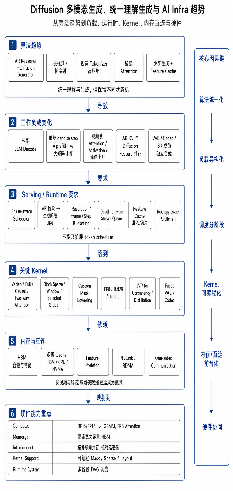
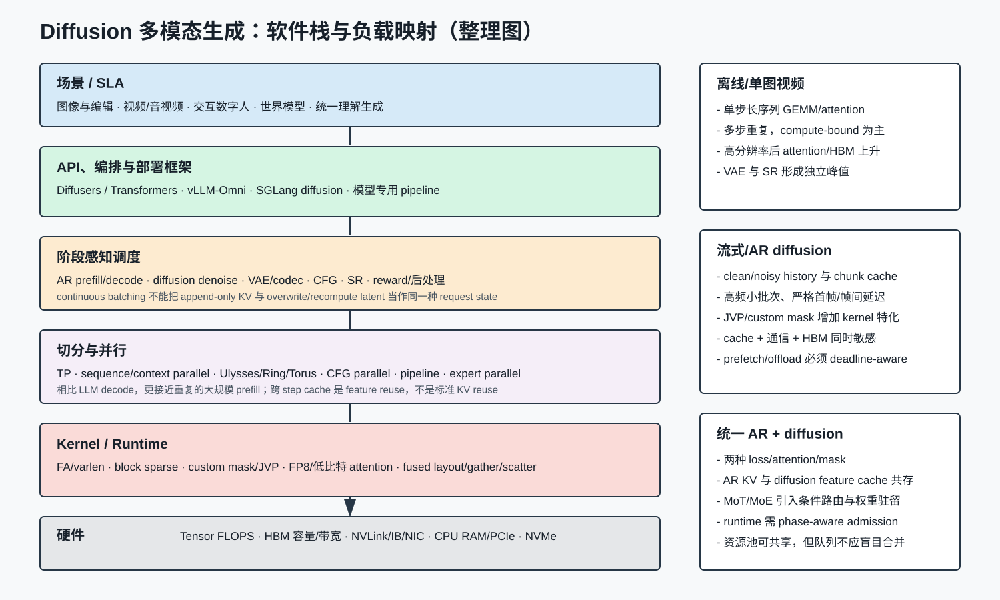
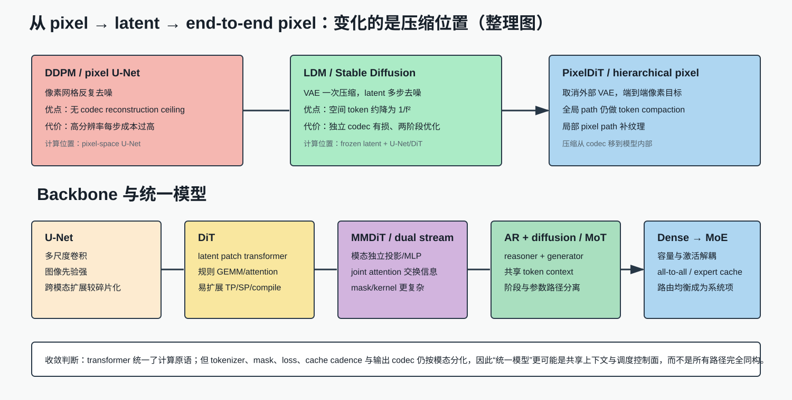
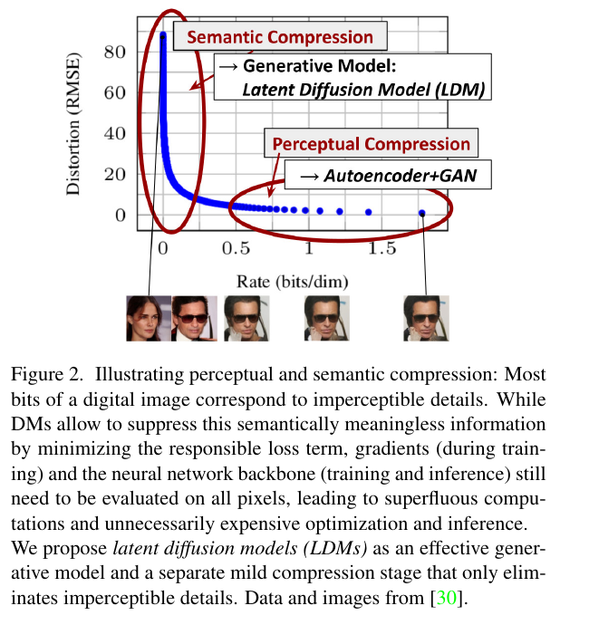
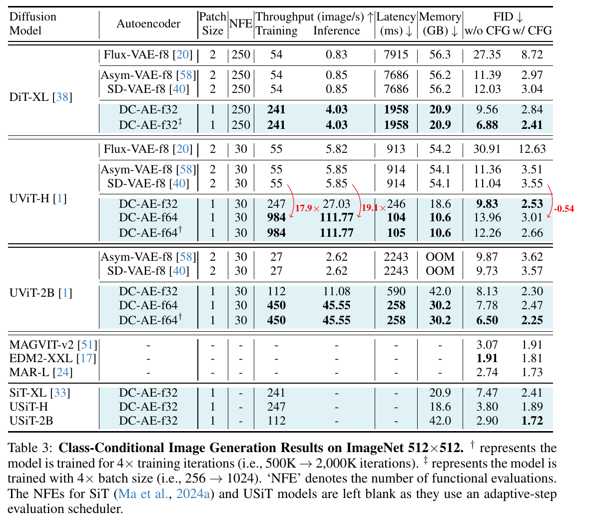
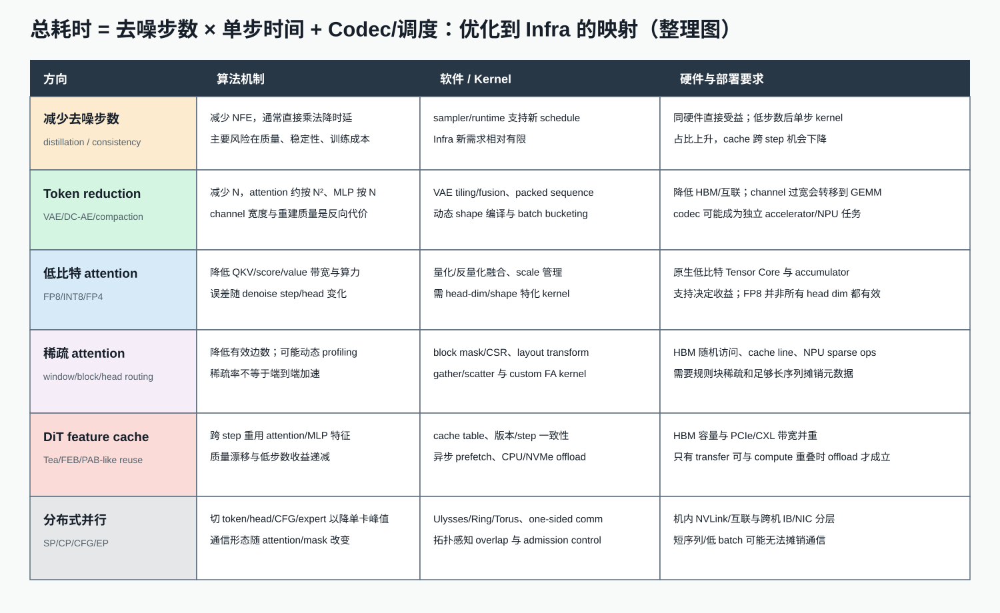
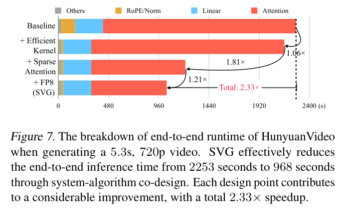
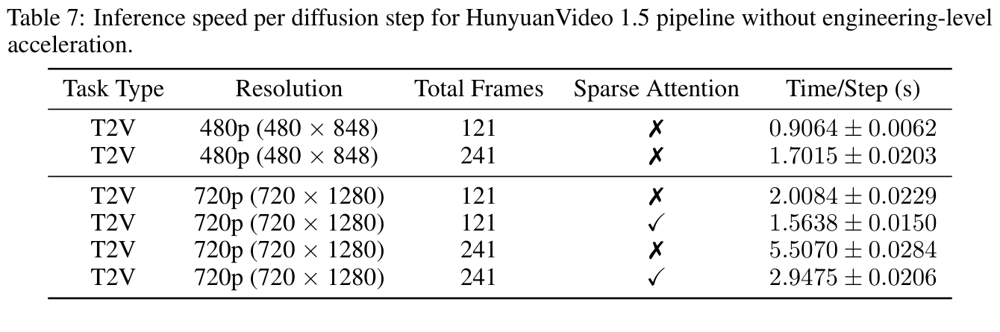
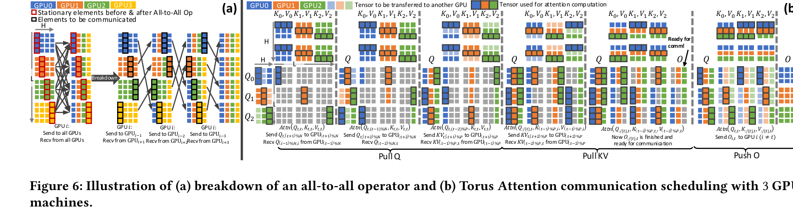

# Diffusion 多模态生成技术、统一理解生成与 AI Infra 趋势

> [!info] 文档关系
> - 文档类型：Survey
> - 领域入口：[README](../README.md)
> - 上位汇总：无
> - 证据资产：`../assets/surveys/multimodal-diffusion-infra/`
> - 相关文档：[Figure inventory](../evidence/figure-inventory.md)，[Diffusion evolution](diffusion-evolution.md)

## 修订信息

- 当前版本：`1.0.0`
- Revision ID：`rev-multimodal-diffusion-infra-initial`
- 状态：initial
- 核验日期：2026-07-12
- 历史：`1.0.0` 为首次系统调研；没有被替代的旧 manifest。

## 结论先行

Diffusion/flow 多模态生成正在从“单个图像/视频模型”变成一套异构执行系统。高质量生成仍主要由连续 latent/pixel 上的重复 transformer forward 完成；理解、规划、指令跟随和跨任务上下文则越来越多地交给 AR reasoner。BAGEL、Transfusion、Cosmos 3 表明，未来的“统一”更可能发生在 token context、训练数据、参数控制面和产品接口，而不是把所有模态强行压成一种 loss、一种 cache 和一种执行节奏。

对 AI Infra 最重要的变化有五条：

1. **负载不是 LLM decode。** 大部分 denoise step 是重复的 prefill-like 大矩阵计算；长视频进一步把 attention、activation HBM 与 sequence-parallel 通信推到前台。
2. **统一模型产生两种 state machine。** AR KV 是 append-only，diffusion latent/feature 会按 step overwrite/recompute；服务框架必须 phase-aware，而不能只扩展一个 token scheduler。
3. **视觉 tokenizer 是系统旋钮。** token 数 `N` 由空间/时间压缩与 patch 共同决定；channel 决定每 token payload。压缩率、重建上限、attention 复杂度和 VAE 峰值必须联合评估。
4. **少步生成后，单步 kernel 更重要。** 当 NFE 从几十步降到 1-8 步，跨 step cache 的机会减少，长序列 attention、低比特和稀疏 kernel 的占比反而上升。
5. **软硬件协同从“支持 FP16 GEMM”转向 mask/layout/cache/topology。** custom mask、varlen、block sparse、JVP、FP8、one-sided communication、多级 cache prefetch 逐渐成为可区分平台效率的能力。





## 1. 背景、应用成熟度与应用趋势

多模态生成已从营销素材、图像编辑进入视频广告、影视预演、数字人、游戏资产、辅助设计和合成训练数据；高质量单图与短视频已具备产品成熟度，但长视频叙事、稳定物理交互、可审计版权、低延迟双向音视频和实时世界模型仍处于快速迭代期。Gartner 的公开 AI Hype Cycle 页面强调 GenAI 正从早期热度转向可落地价值，但该页面在本次核验中受 Cloudflare 验证阻挡，因此本文不引用其付费曲线位置或年限数字，只采用“从通用演示走向垂直工作流、治理与成本约束”的公开行业判断。未来应用重心将从一次性 prompt-to-content 转向多轮编辑、可控代理创作、音画同步、交互仿真和具身数据生成；这使端到端延迟、单位有效秒成本、可复现控制和持续上下文比单一 benchmark 分数更重要。[Gartner AI Hype Cycle public landing](https://www.gartner.com/en/articles/hype-cycle-for-artificial-intelligence)

## 2. 技术栈：从场景到 Kernel

### 2.1 场景与 SLA

| 场景                     | 核心 SLA                      | 主要资源形态                              | 典型失败模式                         |
| ---------------------- | --------------------------- | ----------------------------------- | ------------------------------ |
| 单图/编辑                  | 秒级首图、成本、文字/布局准确             | 中等序列、多步 DiT、VAE                     | prompt 不一致、细节与文字错误             |
| 短视频                    | 生成秒成本、运动/主体一致性              | 空间×时间长序列、VAE/VSR                    | 身份漂移、运动冻结、显存峰值                 |
| 音视频联合                  | A/V 同步、长程结构                 | 双 codec、共享时间轴、联合 attention          | 声画错位、codec 吞吐不平衡               |
| 交互数字人/stream diffusion | 首帧与 frame-to-frame deadline | chunk cache、causal mask、高频小批次       | 抖动、deadline miss、history drift |
| 统一理解生成                 | 多轮上下文、工具/编辑闭环               | AR KV + diffusion feature + 多 codec | 阶段调度冲突、cache 污染                |
| 世界模型/合成数据              | 条件控制、物理/动作一致性、吞吐            | 视频/音频/action token、长 horizon        | rollout error、存储与数据管线瓶颈        |

### 2.2 框架与 runtime 分工

- **Diffusers** 适合模型 pipeline、scheduler、VAE、ControlNet/LoRA 和单请求优化，是算法快速落地的基线。
- **Transformers** 承载 text encoder、VLM/reasoner、统一 decoder 和部分 DiT/MoT 组件；在统一模型中与 diffusion pipeline 的生命周期开始重叠。
- **vLLM-Omni 类系统** 的价值是把文本、音频、视觉模块放进统一请求图和资源管理面，但不能假设所有 stage 都使用 paged KV。
- **SGLang diffusion/专用 serving engine** 需要把 denoise step、CFG、VAE、SR、cache reuse 和 sequence parallel 暴露为调度对象；prefix reuse 只是其中一类状态。
- **生产编排层** 还要处理模型版本、LoRA/control adapter、codec、内容安全、watermark、存储和异步回传。算法论文通常不覆盖这些成本。

### 2.3 调度系统

LLM continuous batching 的基本单位是“下一 token”；diffusion 更适合以 `(model, resolution bucket, frame bucket, step, guidance mode, cache policy)` 形成 batch。统一模型还要管理 AR 与 diffusion phase 的转换：

```text
request
  -> encode/prefill
  -> AR reason/plan (append-only KV)
  -> allocate latent + noise
  -> S denoise forwards (overwrite latent; optional feature cache)
  -> VAE/codec/SR
  -> optional AR critique/edit loop
```

调度器应提供：分辨率/帧数 bucketing、step-aware batch merge、deadline-aware stream queue、CFG branch 合并/并行、VAE 与 DiT 异构 worker、cache admission/eviction、CPU offload 带宽保护，以及超长请求的抢占边界。抢占一个 LLM decode 通常只需保存 KV；抢占视频 diffusion 可能还要保存 latent、scheduler state、condition embedding、每层 feature cache 和 codec state。

### 2.4 并行策略与 LLM 的差异

| 策略 | Diffusion 价值 | 与 LLM 常见用法的差异 |
|---|---|---|
| Tensor parallel | 分大权重 GEMM/MoE | 每 step 重复 collective，低 batch 时更敏感 |
| Sequence/context parallel | 切长图像/视频 token | 无法依赖 decode KV 将计算降为单 token；attention collective 持续存在 |
| Ulysses/Ring/Torus | 在 head/sequence 维切 attention | 必须映射机内/跨机拓扑并重叠通信；短序列可能回退 |
| CFG parallel | 正/负条件分支并行 | 可减少串行 branch，但增加权重/activation 和同步 |
| Pipeline parallel | 模型层或长视频 block 流水 | denoise step 与噪声同步可能破坏 naive pipeline 并行 |
| Expert parallel | Dense→MoE、MoT/模态 tower | token 类型与 step 改变 expert 分布，all-to-all 需容量规划 |

[SwiftFusion](../papers/swiftfusion.md) 给出 topology-aware sequence parallel 的直接系统证据；[Cosmos 3 Infrastructure 分析](../papers/cosmos-3.md#8-infrastructure-分析)则展示 Ulysses、CFG parallel、cache 和 compile 在统一模型中的组合。二者共同说明并行选择不能只看通信字节，还要看链路层级、同步语义和可重叠窗口。

### 2.5 负载特性

对单层 DiT，粗略成本可写为：

$$
C_{step} \approx L\left(aND^2+bN^2D+cC_{MoE}\right),
$$

其中 `N` 是视觉/视频 token 数，`D` 是 hidden width，`L` 是层数。中等 `N`、大 `D` 时 QKV/MLP GEMM 更 compute-bound；长视频使 `N²D` attention、activation 和通信快速支配。与 LLM decode 相比，输入 latent 每 step 改变，标准 KV cache 不能消除对视觉 token 的重算。

stream diffusion 又不同：chunk history、noisy context、frame deadline 与 custom mask 让 HBM 容量、通信和 kernel launch 同时敏感。[Causal-rCM 的 Infra 分析](../papers/causal-rcm.md#8-infra-需求分析)以 packed teacher-forcing、JVP 与 context-parallel cache 为代表；其“10x”是收敛迭代数改善，不是 wall-clock kernel 加速。

### 2.6 特殊 Kernel

- varlen/full/causal/two-way attention：BAGEL、Transfusion、Cosmos 3 都需要超出普通 causal mask 的语义。
- block sparse/window/selected global attention：需要 mask lowering、CSR/block metadata、规则 layout 和可复用编译缓存。
- layout transform + fused sparse attention：Sparse VideoGen 说明稀疏模式若在内存中非连续，理论 FLOPs 不会变成吞吐。
- custom-mask FA JVP：连续时间 consistency/distillation 需要 primal+tangent 共同流式计算。
- FP8/低比特 attention：需要原生 Tensor Core、合适 head dimension、scale 与 accumulator；并非所有模型都受益。
- fused VAE tiling/codec：VAE 不再是可忽略前后处理，长视频中可能形成独立显存与带宽峰值。

## 3. 单模型管线：为什么从像素到 Latent 又回到像素



### 3.1 Pixel DDPM：目标直接，但重复计算昂贵

早期 DDPM 在像素上反复去噪，避免了 learned codec 的信息上限，但每一步都在高分辨率网格执行 U-Net。其历史价值是提供稳定训练目标，不是当前高分辨率系统的成本最优解。

### 3.2 LDM：把可见细节与语义建模解耦

[LDM](../papers/ldm.md#25-完整因果链与证据闭环) 的核心判断是：大量像素细节不应在每个 denoise step 反复计算。VAE 先做一次 perceptual compression，生成模型在更小 latent grid 上处理语义/结构，最后一次 decode。代价是 codec reconstruction ceiling、两阶段训练与 VAE runtime。



这一选择在 2022-2025 成为主流，原因不是 latent 天然更“智能”，而是当时 transformer/U-Net、显存和训练规模不足以承担高分辨率像素序列。DC-AE 又把 `f` 从常见 8 推到 32/64，进一步用 tokenizer 换 attention 成本。

### 3.3 PixelDiT：不是取消压缩，而是把压缩移入模型

[PixelDiT](../papers/pixeldit.md#24-完整因果链与证据边界) 回到端到端 pixel objective，理由是外部 VAE 的有损重建和两阶段冻结会累积误差、阻碍 joint optimization。但它仍用 dual-level path：全局 patch path 处理压缩序列，pixel path 做局部细化。换句话说，路线变化是：


```text
独立、预训练、冻结的有损 codec
        ↓
可端到端学习、位于 backbone 内部的层次化 token compaction
```

这条路线能否扩展到长视频仍未确定。图像像素局部性可由双层结构吸收；视频还要同时处理时间压缩、codec throughput 和长程运动。未来更可能是 latent、deep codec 与 hierarchical pixel 三路并存，而非 PixelDiT 全面替代 VAE。

## 4. Backbone：U-Net → DiT → MMDiT/MoT → MoE

### 4.1 U-Net 到 DiT

[DiT](../papers/dit.md#25-完整因果链与证据闭环) 用规则的 transformer block、adaLN-Zero 和 latent patch 取代多尺度 U-Net。其系统优势是算子更规整、易使用 GEMM/FlashAttention/TP/SP/compile；代价是 token 数对 attention 成本更敏感，局部/多尺度先验需由数据和结构重新学习。

### 4.2 Single-stream、dual-stream 与 MMDiT

- single-stream 将文本/视觉 token 投到共享宽度后统一 attention，参数共享强，但模态冲突和 mask 复杂。
- dual-stream/MMDiT 为文本与图像保留独立 projection/MLP，通过 joint attention 交换信息，易控制模态容量。
- 视频 DiT 再加入时空位置、3D attention、SSTA/window/sparse 结构；音视频联合还需物理时间对齐与双 codec。

### 4.3 统一理解生成：Transfusion → BAGEL → Cosmos 3

[Transfusion](../papers/transfusion.md) 证明一个 transformer 可以同时优化 AR 与 image diffusion，但 shared parameter 会接收不同 loss，且 noised image → text 会产生条件冲突。[BAGEL 研究方法](../papers/bagel.md#4-研究方法)进一步用 full MoT hard routing 分离理解/生成参数，并通过 clean VAE/ViT context、noise-aware mask 支持多轮内容。[Cosmos 3](../papers/cosmos-3.md) 把这一路线扩到 language/image/video/audio/action：AR reasoner 不读取 noisy generator token，generator 可读取 reasoner 和自身 token；3D mRoPE 按物理时间对齐不同 FPS/TPS。


这代表的未来趋势不是“AR 被 diffusion 替代”，而是**AR 负责离散规划与验证，diffusion/flow 负责并行连续信号生成**。Infra 上将出现：

- 共享权重或双塔权重的驻留策略；
- AR KV、clean context、noisy latent 和 feature cache 的多类 cache；
- causal/full/noise/two-way mask lowering；
- phase-aware admission 和异构 batching；
- reasoner 与 generator 的独立扩缩容、失败隔离和 QoS。

### 4.4 Dense 到 MoE

Dense DiT 仍是性能基线；MoE 的吸引力是扩大视觉/全模态容量而不按比例增加每 token FLOPs。MoT 与 learned MoE 要区分：BAGEL/Cosmos 的 token 类型预先决定 tower，不是多个专家的动态 top-k。未来 learned MoE 会带来 expert parallel all-to-all、路由不均、热门 expert cache、低 batch 退化和跨模态容量配额；硬件需要高双向互联和更灵活的分布式 collective。

### 4.5 闭源工业模型的证据边界

Seedance 2.0、Veo 3 等闭源系统的产品表现说明音画联合、多参考控制、长镜头与世界复杂度是产品方向，但公开材料不足以确定其 VAE、MoE、并行度或 kernel。本文只将它们作为需求信号：音画同步要求共享 timestamp、codec 负载平衡和联合后处理；长视频要求分层生成、SR、streaming 和成本控制。任何具体 backbone 推断均为低置信分析，不作为论文级证据。

## 5. Visual Tokenizer 与序列长度

### 5.1 统一公式

对图像：

$$
N_{image}=\left\lceil\frac{H}{f_h p_h}\right\rceil
\left\lceil\frac{W}{f_w p_w}\right\rceil.
$$

对视频：

$$
N_{video}=\left\lceil\frac{T}{f_t p_t}\right\rceil
\left\lceil\frac{H}{f_h p_h}\right\rceil
\left\lceil\frac{W}{f_w p_w}\right\rceil.
$$

实际实现还会因 causal VAE 的首帧、padding、frame packing、reference/control token 和文本 token 发生修正。channel `c` 不改变 `N`，但会改变输入 projection、latent payload 和 VAE/DiT 接口带宽。

### 5.2 典型规格与数量级

| 模型/路线 | 空间压缩 | 时间压缩 | latent patch | 示例 token 数 | 说明 |
|---|---:|---:|---:|---:|---|
| SD/LDM 常见 VAE | 8×8 | 1 | 1 或 2 | 512²、p1：4096 | latent channel 常为 4，不能与 token 数混淆 |
| DiT-XL/2 | 8×8 | 1 | 2×2 | 256²：256 | `T=(I/p)²` 中 `I` 是 latent 边长 |
| DC-AE f32p1 | 32×32 | 1 | 1 | 512²：256 | 更宽 channel 换取深压缩质量 |
| DC-AE f64p1 | 64×64 | 1 | 1 | 512²：64 | 论文显示显著吞吐收益；codec 训练更难 |
| HunyuanVideo 1.5 | 16×16 | 4 | 1 | 720p/241 帧约数十万 | 具体 padding/latent frame 规则以 checkpoint 为准 |
| PixelDiT | 无外部 VAE | 1 | 内部 compaction `p` | global path `HW/p²` | pixel path 仍处理局部像素结构 |

[DC-AE Table 3](../papers/dcae.md#51-主结果) 展示 f8p2 到 f64p1 的训练/推理/显存变化；它说明“相同 latent scalar 数”也可能对应完全不同 token 数，attention 与 projection 的瓶颈因此不同。



### 5.3 视频 VAE 的 Infra 诉求

- 3D/causal convolution 与 temporal compression 增加 kernel 和状态复杂度。
- spatial tiling 可降峰值，但会增加 overlap、拼接和 CPU/PCIe 管理；temporal tiling 不一定受支持。
- encode/decode 与 DiT 可使用不同 batch/worker，适合流水；但 stream 场景需要 codec state 与 frame deadline。
- 高压缩 VAE 降低 DiT token，却可能扩大 channel、decoder 和重建损失，不能只按 `N²` 评估。

## 6. 性能优化：从公式到软硬件

总时延可写为：

$$
T_{total}=S\cdot T_{step}+T_{text/reasoner}+T_{VAE/codec}+T_{SR}+T_{schedule/transfer}.
$$



### 6.1 去噪步数 `S`

progressive/consistency/rectified-flow distillation、少步 sampler 和 causal consistency 直接减少迭代次数。这类方法的 Infra 新需求相对少，主要是新 scheduler、训练 rollout 和质量验证；但少步以后 `T_step` 占比上升，跨 step cache 的可用相邻状态减少。[Causal-rCM 技术点证据矩阵](../papers/causal-rcm.md#53-技术点证据矩阵)还表明 continuous-time distillation 可能需要 custom-mask JVP kernel。

### 6.2 Token reduction/compression

这是最稳定的单步优化，因为同时降低 MLP、attention、activation 和 sequence-parallel 通信。技术包括更深 VAE/DC-AE、token merge/pruning、分辨率/时间渐进和 PixelDiT compaction。硬件侧需求是高效 codec、动态 shape、packed/bucketed batch；过度压缩会将瓶颈转移到宽 channel GEMM 和 decoder。

### 6.3 低比特 attention

低比特可减少 bandwidth 和 Tensor Core 成本，但依赖硬件原生 dtype、head dimension 和 scale 策略。[Sparse VideoGen](../papers/sparse-videogen.md) 报告 FP8 为 HunyuanVideo 栈带来 1.21x incremental gain，同时指出对另一 head dimension 不一定有效。因此 runtime 应按模型/head/step 选择精度，而不是全局开关。

### 6.4 稀疏 attention

window、tile、block-sparse、head-specific pattern 和 dynamic profiling 都在减少有效 attention edges。Infra 的关键不是“支持一个 sparse op”，而是：

- mask 转换到规则 block/CSR；
- token layout 与访问模式匹配；
- profiling/meta overhead 可摊销；
- gather/scatter 和 sparse attention 融合；
- fallback dense 与质量阈值；
- GPU/NPU 都有等价 kernel，而非只在论文 H100 配置有效。

[Sparse VideoGen](../papers/sparse-videogen.md) 的 1.7x layout 增益说明内存连续性与算法稀疏率同等重要；[HunyuanVideo 1.5](../papers/hunyuanvideo-1-5.md#52-ssta-直接消融) 的 SSTA 则提醒 paper/code mask 语义必须版本化核验。





### 6.5 DiT cache 与多级 offload

DiT cache 重用相邻 step 的 attention/MLP/transformer feature，不是 LLM KV cache。[FEB-Cache](../papers/feb-cache.md#25-完整因果链与边界) 把质量漂移与 component frequency 联系起来，但发布实现未复现完整 MLP-only/attention-only table。系统设计应把以下内容作为可选能力而非论文既成事实：

1. HBM 保存热点 step/layer feature；
2. CPU RAM 保存较冷 feature；
3. NVMe 只用于足够大、计算窗口足够长的离线请求；
4. prefetch 必须基于明确的未来 step 和 deadline；
5. transfer 与 compute 无法重叠时，offload 会反向增加时延；
6. cache key 包含模型、adapter、condition、resolution、step、scheduler 和精度。

低步数模型中 cache reuse 收益可能下降；长视频中 cache footprint 又按 `N×D×layers` 增长。因此需要 admission policy，而不是默认全开。

### 6.6 分布式单步加速

[SwiftFusion](../papers/swiftfusion.md) 说明多机 DiT 的核心是拓扑感知：慢链路承载更少的通信量，并用 staged attention 与 one-sided communication 创建重叠窗口。硬件规格应关注：机内/跨机带宽比、NIC 注入率、GPU direct RDMA、collective progress 占用的 SM、head divisibility 和小消息延迟，而不只看峰值 FLOPS。



## 7. 未来趋势与 AI Infra 路线判断

### 7.1 高置信趋势

1. **AR reasoner + diffusion/flow generator 成为统一模型主线。** BAGEL、Transfusion、Cosmos 3 已形成连续谱系；产品需要理解、规划、生成、评价和编辑闭环。
2. **视频/音视频决定系统上限。** 空间×时间序列、codec 和同步会持续推动 sparse attention、sequence parallel 与异构流水。
3. **tokenizer 与 backbone 联合设计。** DC-AE 和 PixelDiT 从两个方向打破固定 VAE 假设；压缩位置会在独立 codec 与模型内部层次结构间重新分配。
4. **runtime 变成多阶段 DAG scheduler。** text/reasoner、DiT、VAE、SR、安全和存储会独立扩缩容；统一 API 不代表统一 worker。
5. **kernel 接口从固定 causal attention 走向可编程 mask/layout。** FlexAttention、block sparse、varlen、JVP 与 FP8 需要编译缓存和稳定 fallback。

### 7.2 尚未收敛的选择

- latent diffusion 与 VAE-free pixel hierarchy 谁在视频上更优；
- single-stream、dual-stream、MoT 和 learned MoE 的容量/通信最优点；
- 训练型 sparse attention 与 training-free sparse runtime 的质量/可迁移性；
- feature cache 在 1-8 步模型中的收益上限；
- AR 与 diffusion 是否共享全部 backbone，还是共享 context/control plane 更经济；
- GPU、NPU 和专用 codec accelerator 的最优分工。

### 7.3 对硬件与平台的具体建议

| 层 | 近期必需能力 | 中期差异化能力 |
|---|---|---|
| Compute | BF16/FP16 大 GEMM、FP8 attention/MLP | FP4/混合 accumulator、动态精度 per head/step |
| Memory | 高 HBM 容量/带宽、显式 activation 管理 | HBM-CPU/CXL-NVMe 多级 cache 与硬件 prefetch |
| Interconnect | NVLink/等价机内互联、IB/RDMA | one-sided GPU communication、拓扑暴露与可编程 overlap |
| Kernel | FA/varlen、VAE/conv、fused norm/MLP | block sparse、custom mask/JVP、layout transform、动态 routing |
| Runtime | resolution/frame bucketing、step batching、offload | AR+diffusion phase scheduler、deadline-aware stream、cache admission |
| Observability | step/codec/transfer 分段时延、显存峰值 | mask sparsity、cache hit/quality drift、link utilization、expert imbalance |

## 8. 证据边界

- 12 篇核心工作均有独立深读、任务包、两类原图、figure inventory 和 manifest；个别代码/源码因网络或未公开而标为 blocked。
- BAGEL、PixelDiT、Cosmos 3、HunyuanVideo 1.5、Causal-rCM、FEB-Cache 等代码结论固定到检查的 commit；Sparse VideoGen 只定位 commit，未取得可审计 worktree，kernel 细节按论文主张处理。
- Seedance 2.0、Veo 3 等闭源模型仅用于产品趋势，不对未公开 backbone、VAE 或并行策略作确定性陈述。
- Gartner 页面访问受验证阻挡，本文未引用付费图表或具体成熟年限。
- 所有整理图表达跨论文综合判断，不替代原论文证据。
