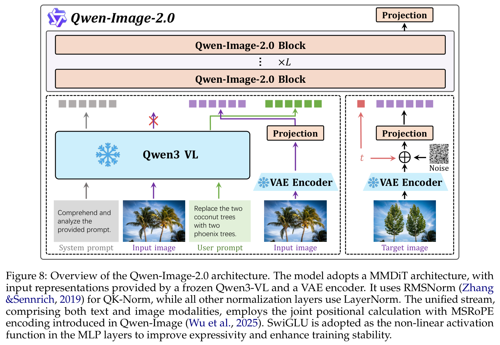
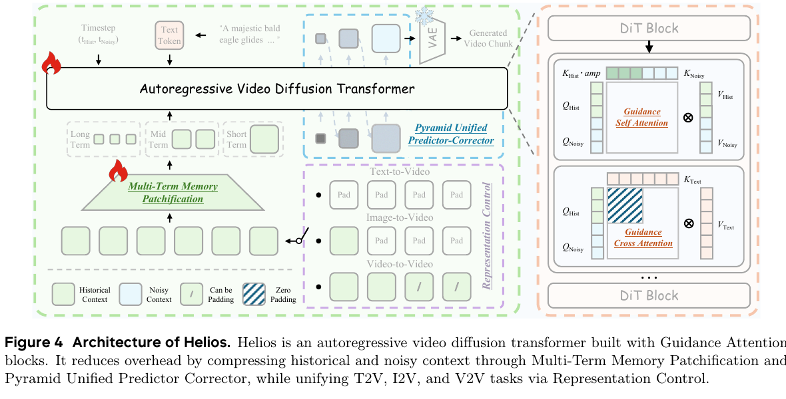
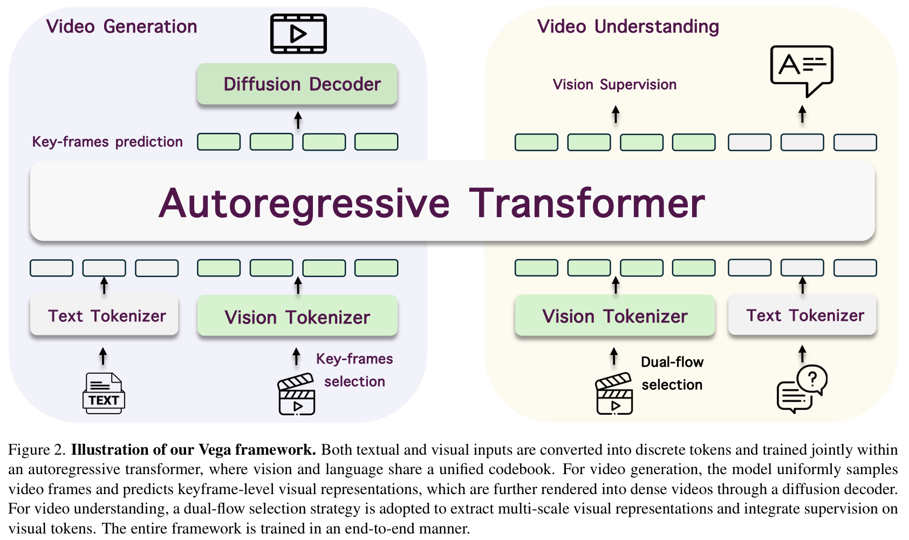

# 近半年多模态视觉生成模型全景：架构、规模、数据与生成范式

> [!info] 文档关系
> - 文档类型：Survey
> - 领域入口：[README](../README.md)
> - 深读论文：[Qwen-Image-2.0](../papers/qwen-image-2-0.md)、[BAGEL](../papers/bagel.md)、[SANA-Video 2.0](../papers/sana-video-2.md)、[Cosmos 3](../papers/cosmos-3.md)、[Helios](../papers/helios.md)、[Vega](../papers/vega.md)
> - 证据索引：[Figure inventory](../evidence/figure-inventory.md)

## 修订信息

- 当前版本：`1.0.0`
- 当前修订 ID：`rev-visual-generation-model-landscape-1.0.0`
- 修订时间：`2026-07-28T20:30:00+08:00`
- 时间窗：`2026-01-28`—`2026-07-28`；BAGEL 是 2025 前史锚点，不计入近期样本

## 1. 结论先行

近半年视觉生成没有收敛到单一“终极范式”，而是形成三层分工：

1. **图像生成/编辑仍以 diffusion 或 rectified flow 为主。** Qwen-Image-2.0、Mage-Flow、Boogu-Image 等都把重点放在统一生成—编辑、强条件编码、高压缩 VAE、RL 和少步蒸馏。Qwen-Image-2.0 没有披露完整参数规模、Dense/MoE/MoT 或 dtype，不能沿用上一代 20B/bf16 标签。
2. **视频侧的主线是 diffusion backbone 加 AR/chunk-AR 时间组织。** SANA-Video 2.0 是 4.5B/14.247B parameter-dense DiT；Helios 是 14B dense、按 latent chunk 延续的 autoregressive diffusion；它们的线性/稀疏 attention、cache、token pruning 都不等于参数稀疏。
3. **真正可核验的参数稀疏样本仍少。** BAGEL 的 14B total/7B active MoT 和 Cosmos 3 的 MoT 是清晰样本；Vera 也披露 MoT。其余大量“sparse”工作稀疏的是 token、head、attention 邻域、关键帧或步骤，而不是条件激活参数。
4. **AR 与 diffusion 正从竞争变成分层协作。** Vega 用 AR 预测稀疏语义关键帧，再由 diffusion 渲染 49 帧稠密视频；BAGEL/Cosmos 3 则在理解/推理与连续视觉生成之间做参数或塔级分工。
5. **规模字段远比产品能力更不透明。** 25 个系统中，闭源产品几乎都不披露参数和 dtype；即使论文公开，常见口径也只覆盖 backbone。Vega 的表中 `3B` 只对应 AR 主干，已披露生成组件的驻留下界已是 `>4.3B`，还未计 tokenizer/MLP。
6. **系统速度必须拆成 backbone、采样步数与 runtime 三段。** SANA 的 3.58× Sol-Engine 是 kernel、cache、稀疏 attention 和 NFE 的组合，不能归给 3:1 hybrid backbone；Helios 的 19.53 FPS 是单 H100、384×640 的端到端结果，但缺少组件级分解。

## 2. 口径

### 2.1 “Dense / Sparse”只描述参数架构

| 标签 | 本文定义 | 例子 | 不应混入 |
|---|---|---|---|
| Dense | 一次前向通常激活该 backbone 的全部普通参数 | SANA-Video 2.0、Helios、Mage-Flow | linear attention、block sparse attention、KV cache |
| MoE/MoT | 通过 expert/tower routing 只激活部分参数，必须报告 total/active 才能比较 | BAGEL 14B/7B；Cosmos 3 MoT | 多模态、多塔但无条件路由证据 |
| 结构化压缩 | 剪 head、layer、step-specific module，降低计算但不等于基础模型 MoE | MobileWan、Dynamic-in-Few-Step | 直接写成“Sparse model” |
| Token/attention 稀疏 | 减少 keyframe、token、head 或 attention edge | Vega、SANA Sol-Engine、Avatar V | 参数 active count |
| Unknown | 官方材料不足以判定 | Seedance 2.0、ChatGPT Images 2.0、LTX-2.3 | 根据产品体验反推架构 |

### 2.2 “数据类型”拆成两类

- **模态与数据构成**：文本、图像、视频、音频、action、interleaved document；还应记录规模、过滤、去重、课程和任务比例。
- **数值格式**：训练/推理的 fp32、bf16、fp16、fp8、int8/int4，以及是否只是第三方量化。未披露一律写 `—`，不从相邻版本或示例代码外推。

### 2.3 范式标签

- `AR`：离散 token 的 next-token/next-scale 生成。
- `diffusion/flow`：连续 latent 的迭代去噪、flow matching 或 rectified flow。
- `autoregressive diffusion`：按帧或 chunk 自回归推进，但每个单元内部仍由 diffusion/flow 生成。
- `hybrid`：AR 做语义规划/理解，diffusion 做连续渲染；不应只用一个词覆盖两条路径。

## 3. 近半年模型矩阵

`—` 表示一手材料未披露；“下界”只相加明确披露的常驻组件，不代表精确总参数。

| 日期 | 模型 | 领域/输入→输出 | 参数架构 | 规模（total→active） | 生成范式 | 数据构成与规模 | 数值格式 | 开放度/证据 |
|---|---|---|---|---|---|---|---|---|
| 2026-02-10 | [Qwen-Image-2.0](../papers/qwen-image-2-0.md) | 文本/图像→图像 | **未披露** | 仅 VAE 79M+259M；全模未知 | MMDiT diffusion/flow；RL；4-NFE DMD | 图文、编辑、多阶段分辨率课程；总量/配比未披露 | — | 报告；family repo 无 2.0 权重/config |
| 2025-05-20 | [BAGEL](../papers/bagel.md) | 交错文本/图像/视频→文本/图像 | **MoT** | **14B→7B** | 文本 AR + 视觉 rectified flow | 约 5.17T 多阶段 token（近似相加）；交错多模态 | 推理 BF16；社区量化不算原生证据 | 开放权重/代码；前史锚点 |
| 2026-03-04 | [Helios](../papers/helios.md) | 文本/图像/视频→长视频 | **Dense** | **14B→14B** | chunk autoregressive diffusion | 约 0.8M `<10s` clips；领域/许可混合未披露 | 公开 config 含 bf16 路径；完整口径见 Paper | 开放代码/checkpoint |
| 2026-07-23 | [SANA-Video 2.0](../papers/sana-video-2.md) | 文本→视频 | **Dense** | **4.5B/14.247B→同规模** | flow-matching video DiT | 约 30M 预训练 clips、10M continual、约 10K SFT；480p→720p、5s→8s | bf16；FSDP | 论文+官方 family repo；2.0 实现不完整 |
| 2026-05-31 | [Cosmos 3](../papers/cosmos-3.md) | 文本/图像/视频/音频/action→多模态 | **MoT** | 16B/64B；active 未统一披露 | AR reasoner + diffusion/flow generator | physical-AI 多模态数据、action/video 课程 | 见 canonical Paper；不同组件口径不一 | 报告、代码、checkpoint |
| 2026-06-30 | [Vega](../papers/vega.md) | 文本/视频→文本/视频 | **Dense，无 MoE 证据** | 表称 AR 3B；生成路径**下界 >4.3B** | AR semantic keyframe + diffusion renderer | 约 100M 图文；第二阶段 5M videos + 图像集；video:T2I=2:1 | — | 论文/source；无代码/checkpoint |
| 2026-06-25 | Qwen-Image-2.0-RL | 文本/图像→图像 | 继承 2.0，未知 | — | diffusion + GRPO + on-policy distillation | reward/prompt 数据；规模未披露 | — | 技术报告；并入 Qwen family |
| 2026-07-14 | Boogu-Image-0.1 | 文本/图像→图像 | Dense（无 expert 证据） | — | unified diffusion/flow | 208.62M unique images | — | Apache-2.0 权重/代码/配方 |
| 2026-07-21 | Mage-Flow | 文本/图像→图像 | Dense | 约 4B→约 4B | rectified flow / MMDiT | — | — | 论文；发布状态待核 |
| 2026-07-27 | UniGen-AR | 文本/图像/control→图像 | Dense | — | next-scale visual AR | — | — | 论文/项目页 |
| 2026-06-22 | Vera | 文本/视频→编辑层/视频 | **MoT** | — | layered diffusion | 486K layered frames | — | 论文 |
| 2026-06-24 | Causal-rCM | 文本/历史/action→流式视频 | 继承基座；非新 MoE | Wan 1.3B；Cosmos variant 继承基座 | few-step autoregressive diffusion distillation | synthetic data；细节见报告 | — | open-recipe 论文 |
| 2026-06-09 | Lip Forcing | 视频+音频→口型同步视频 | Dense students | 1.3B/14B→同规模 | few-step autoregressive diffusion | — | — | 论文 |
| 2026-07-03 | Flex-Forcing | 文本/视频上下文→视频 | 继承 Dense video DiT | — | bidirectional + AR diffusion | — | — | 论文 |
| 2026-07-07 | MobileWan | 文本→移动端视频 | 压缩 Dense；结构化 head pruning | 从 Wan2.2-5B 压缩 | chunk-AR diffusion/distillation | teacher-distillation data | — | 论文/项目；非参数 MoE |
| 2026-07-03 | Vidu S1 | 图像+语音指令→交互视频 | 未披露 | — | diffusion + TurboDiffusion/TurboServe | — | — | 论文/在线 demo |
| 2026-07-20 | AlayaWorld | 文本/图像/视频/相机轨迹→交互世界视频 | Dense | 15B→15B | chunk-AR diffusion + distillation | — | — | 技术报告 |
| 2026-07-07 | Dynamic-in-Few-Step | 文本→视频 | step-specific Mixture-of-Models；非基础 MoE | 继承 Wan-14B；每步计算下降 | few-step diffusion distillation | distillation data | — | 论文 |
| 2026-07-22 | Self Gradient Forcing | 文本/短历史→长视频 | 继承 Dense causal DiT | — | autoregressive diffusion training | 5 秒训练窗 | — | 论文；代码/模型待发布 |
| 2026-07-23 | Ms. Forcing | 文本/rolling state→流式视频 | Dense；多尺度 token/attention 稀疏 | — | streaming autoregressive diffusion | — | — | 论文 |
| 2026-07-27 | TaoMate | 参考视频+音频+prompt→音视频 avatar | Dense | — | few-step AR joint audio-video generation | — | — | 论文/项目页 |
| 2026-02-12 | Seedance 2.0 | 文本/图像/音频/视频→音视频 | **未披露** | — | 官方仅称统一多模态联合生成 | — | — | 闭源产品/官方页 |
| 2026-04-21 | ChatGPT Images 2.0 | 文本/图像/对话→图像 | **未披露** | — | system card 未披露 | 高层 safety/data 说明 | — | 闭源产品+system card |
| 2026-04-08 | Avatar V | 视频/音频/文本/motion→avatar 视频 | Dense DiT；reference attention 稀疏 | — | flow matching + chunk-AR serving | 50M raw videos→100M+ clips；10M+ avatar clips | — | 闭源技术系列 |
| 2026-03 | LTX-2.3 | 文本/图像/音频→视频 | **未披露** | 官方 workflow 提到 22B dev variant | diffusion/flow family | — | — | 权重/workflow 可用；未定位完整 2.3 报告 |

## 4. 六个锚点模型

### 4.1 Qwen-Image-2.0：能力完整，规模字段不完整

Qwen-Image-2.0 用冻结的 Qwen3-VL 编码文本和输入图像，`f16c64` VAE 处理目标/参考图像，MMDiT 在共享条件—目标 token 流中统一 T2I 与 TI2I。后训练叠加多 reward GRPO 和 conditional DMD，把 40-step teacher 压到 4 NFE。最重要的审计结论不是“它有多少 B”，而是**论文没有回答**：全模型 total/active、Dense/MoE/MoT、base loss/mask、训练/推理 dtype 均不能从上一代仓库外推。

### 4.2 BAGEL：参数稀疏的清晰基准

BAGEL 以 modality hard routing 在理解与生成两套完整 Transformer expert 之间选择，14B 常驻、每 token 约激活 7B；两套参数仍在统一 attention 图中交换上下文。它证明“参数稀疏”要同时回答 router、total、active 和共享边界，而不仅是出现 `sparse` 字样。详见既有 [BAGEL 精读](../papers/bagel.md)。

### 4.3 SANA-Video 2.0：Dense backbone 与系统栈必须分开

SANA 的 5B class 实为约 4.5B，14B 为 14.247B，两者都是 parameter-dense。75% linear + 25% softmax anchor 是 attention operator schedule；AttnRes 是跨深度 feature router，都不是 expert sparsity。Figure 5 的 60 秒横轴是构造的 tensor-shape forward profile，不是完整 60 秒视频生成。

Sol-Engine 的 B200 3.58× 来自 kernel optimization、NFE/cache、sparse attention 的逐级叠加；它不能与 hybrid backbone 的 3.17× forward gain直接相乘，也不能全归因于模型结构。

### 4.4 Cosmos 3：MoT 与多模态 world-model 系统

Cosmos 3 把 AR reasoner、diffusion/flow generator、图像/视频/音频/action 数据和 physical-AI serving 放入同一平台。16B/64B 是 variant total 口径，active 参数需按具体组件和路由读取，不能给一个跨平台统一数字。仓库已有完整 [Cosmos 3 精读](../papers/cosmos-3.md) 和问答补充，本 Survey 只复用，不重复复制。

### 4.5 Helios：AR 是 chunk 顺序，单元内部仍是 diffusion

Helios 的 autoregressive unit 是视频 latent chunk，不是像 GPT 一样逐视觉 token 输出。MTMP 压缩不同时间跨度的历史，PUPC 由粗到细预测当前 chunk，Guidance Attention 区分 history/noisy/text 角色，AHD 把采样压缩到少步。它是 14B dense；最终模型不使用 causal mask、linear/sparse attention、KV cache 或量化，但 runtime 仍用了 FlashAttention、compile 和 Triton。

### 4.6 Vega：AR 规划，diffusion 渲染

Vega 把视频理解和生成映射到统一离散语义序列。生成侧 AR 只预测约每 2 秒一个关键帧的 TA-Tok 表示，Wan2.1-1.3B diffusion decoder 再输出 49×832×480 的稠密视频；理解侧用 dual-flow token selection 和 masked visual-token supervision。这个“稀疏关键帧”减少序列计算，但没有参数专家。

## 5. 方法谱系与演进

| 路线 | 代表 | 主要收益 | 主要代价/未解问题 |
|---|---|---|---|
| Dense diffusion/flow | Qwen-Image-2.0、SANA、Mage-Flow | 连续视觉质量、统一编辑、可蒸馏 | 多步采样；总参数/dtype 常缺失 |
| MoT/MoE unified model | BAGEL、Cosmos 3、Vera | 分离异质目标的容量，保留共享上下文 | 常驻权重、router、并行/all-to-all 与 active 口径复杂 |
| AR visual tokens | UniGen-AR | 统一 next-token/next-scale 接口 | 长视频 token 数与细节质量 |
| autoregressive diffusion | Helios、AlayaWorld、Causal-rCM | 长视频/流式生成，局部窗口训练 | 误差累积、历史压缩、首帧/颜色漂移 |
| AR→diffusion hybrid | Vega、BAGEL/Cosmos 的系统级分工 | AR 管语义，diffusion 管连续细节 | 两塔常驻、接口与端到端归因不透明 |
| 压缩/少步/系统优化 | MobileWan、Dynamic-in-Few-Step、SANA Sol-Engine | 延迟、显存和终端部署 | 容易把近似、结构剪枝和参数稀疏混称 |

时间上的显著变化不是“diffusion 被 AR 替代”，而是：

- 2025 的 BAGEL 把 AR/flow 放进一个 MoT 统一模型；
- 2026 上半年 Cosmos 3 把这种分工扩展到 world model 平台；
- Helios 把 diffusion 放进 chunk-AR 时间循环；
- Vega 进一步把 AR 限定在稀疏语义关键帧，让 diffusion 专注稠密渲染；
- 7 月工作大量转向少步、流式、移动端和 attention/kernel 优化。

## 6. 数据与 dtype 观察

| 观察 | 证据 | 判断 |
|---|---|---|
| 数据规模大，但“规模”常不能推出数据质量 | Boogu 208.62M unique images；Vega 100M 图文+5M 视频；SANA 30M+10M clips；Avatar V 100M+/10M+ clips | 需要同时报告过滤、去重、许可、任务比例和 curriculum |
| 训练课程从静态混合转向阶段化 | Qwen 的分辨率/任务课程；SANA 480p→720p、5s→8s；Vega 图文→视频分支 | 阶段收益多与数据、分辨率、目标同时变化，因果归因有限 |
| dtype 披露明显落后于参数/能力宣传 | 六个锚点中仅 BAGEL、SANA、Helios 的代码/config 可给出部分 bf16 证据 | 论文表格应把 dtype 未披露视为一等缺口 |
| 第三方量化不代表原模型精度 | BAGEL 社区 NF4/INT8、LTX workflow 等 | 必须区分 native training/inference 与 downstream deployment |

## 7. Infra 含义

| 维度 | 近期模型带来的需求 | 代表证据 |
|---|---|---|
| 参数/显存 | Dense 14–15B 视频 DiT 需要权重分片或大显存；MoT 还增加常驻参数，即使 active 较低 | SANA 14.247B；Helios 14B；BAGEL 14B/7B |
| 序列长度 | 720p、长视频让 attention 成本快速上升，驱动 linear/anchor、chunking、keyframe 和 token pooling | SANA 3:1；Helios MTMP；Vega keyframes |
| Kernel | linear attention、FlashAttention、Norm/RoPE fusion、Triton、compiler 成为结构收益落地的前提 | SANA Sol-Engine；Helios fused kernels |
| 采样/NFE | 少步蒸馏通常比单次 kernel 优化更直接改变端到端延迟 | Qwen 40→4 NFE；Helios AHD；Causal-rCM |
| Cache/状态 | autoregressive diffusion 要保存 clean history、首帧或压缩 memory，但并非都适合传统 token KV cache | Helios history latent；BAGEL clean visual KV；SANA diffusion cache |
| 通信 | Dense 大模型偏 TP/FSDP/ZeRO；MoE/MoT 还需关注 router placement、expert all-to-all 或多塔驻留 | SANA FSDP；Helios ZeRO EMA/DMD；BAGEL/Cosmos MoT |
| 端侧 | pruning、step-specific model 和低 NFE 把瓶颈从纯 FLOPs 转向内存、kernel 覆盖和 VAE | MobileWan、Dynamic-in-Few-Step |

## 8. 当前共识、分歧与研究空白

### 共识

- 高质量稠密视觉输出仍主要依赖 diffusion/flow。
- 长视频必须压缩时间状态：chunk、keyframe、memory 或 attention sparsity 至少选其一。
- 生成与理解的统一更像“共享接口 + 专门容量”，不再等于所有任务完全共享参数。
- 端到端效率需要模型、采样器、kernel/runtime 联合设计。

### 分歧

- **容量共享还是路由分离**：Dense 统一 backbone 更简单；MoT 缓解异质目标冲突但增加常驻与路由成本。
- **AR 放在哪一层**：UniGen-AR 直接生成视觉序列；Helios 用 AR 组织 diffusion chunks；Vega 只用 AR 生成语义关键帧。
- **稀疏的对象**：参数、token、head、attention edge、step/layer 都能稀疏，但它们对显存、通信和 kernel 的作用完全不同。

### 研究空白

1. 统一报告 `total / active / resident / per-path active` 参数与 native dtype。
2. 在相同硬件、分辨率、时长、NFE 下分解 backbone、VAE、text encoder、cache 和 kernel 延迟。
3. 给出数据来源权重、过滤/去重、许可和 benchmark contamination 检查。
4. 验证 AR→diffusion hybrid 是否真的产生跨任务迁移，而不只是两个分支共存。
5. 为 MoT/MoE 视频模型公开 router 负载、all-to-all、HBM 驻留和 serving 并发测量。

## 9. 证据边界

- 模型/论文检索日期为 2026-07-28；GitHub stars/forks 只是当日工程采用快照，不作为质量排序。
- 新近论文引用数极不稳定，未用引用数做强排序；闭源系统只采用官方页面或 system card，不反推未公开结构。
- 六个锚点均以 PDF/source/官方代码或 checkpoint 做证据核验；BAGEL、Cosmos 3 直接复用仓库既有 canonical 分析。
- Qwen-Image-2.0 的 2.0 实现、SANA 2.0 的完整 production code、Vega 的代码/checkpoint 均未公开到足以复现全部结论。
- 不同模型的 benchmark、prompt rewriting、分辨率、时长、NFE、硬件和是否包含 VAE/text encoder 不一致，主表不能被当作绝对排行榜。

## 参考入口

- [Qwen-Image-2.0 Technical Report](https://arxiv.org/abs/2605.10730)
- [BAGEL](https://arxiv.org/abs/2505.14683)
- [Helios](https://arxiv.org/abs/2603.04379)
- [SANA-Video 2.0](https://arxiv.org/abs/2607.21553)
- [Cosmos 3](https://arxiv.org/abs/2606.02800)
- [Vega](https://arxiv.org/abs/2606.31326)
