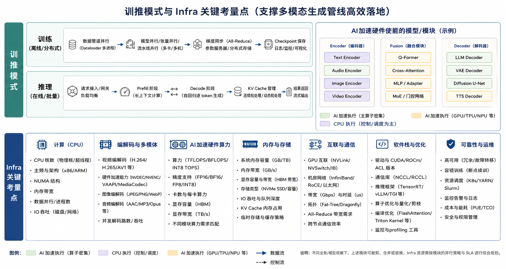

# 多模态模型管线

> [!info] 文档关系
> - 文档类型：Topic
> - 领域入口：[README](../README.md)
> - 上位汇总：[Diffusion evolution](../surveys/diffusion-evolution.md)
> - 证据资产：`../assets/topics/model-pipeline/`
> - 相关文档：[Training data](training-data.md)，[Cosmos 3](../papers/cosmos-3.md)

## 资料边界

- 用途：快速记录典型多模态生成管线和 infra 负载位置。
- 正式资产：[pipeline.png](../assets/topics/model-pipeline/pipeline.png)、[infra-loads.png](../assets/topics/model-pipeline/infra-loads.png)。
- 证据边界：当前是管线草图入口，详细模型和数据分析见 [Diffusion evolution](../surveys/diffusion-evolution.md) 与 [Cosmos 3](../papers/cosmos-3.md)。

典型多模态生成管线：

其负载特点涉及了诸多infra维度：

