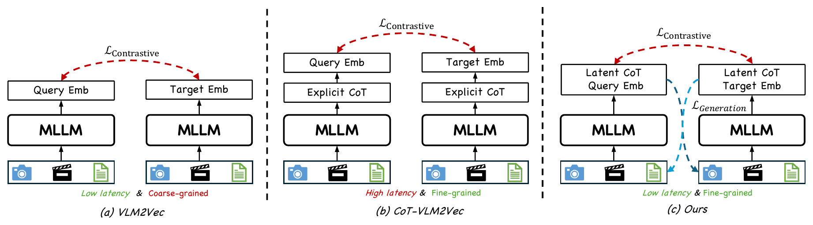
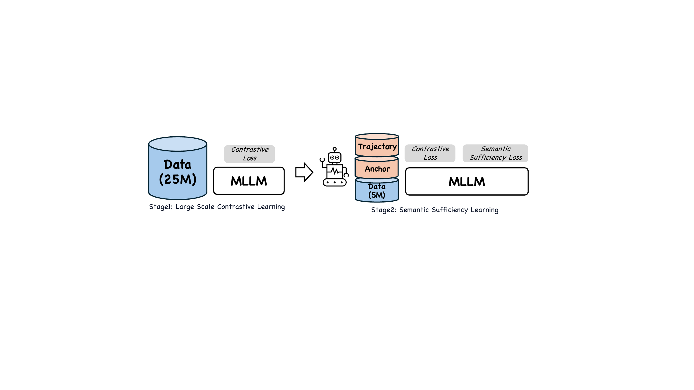
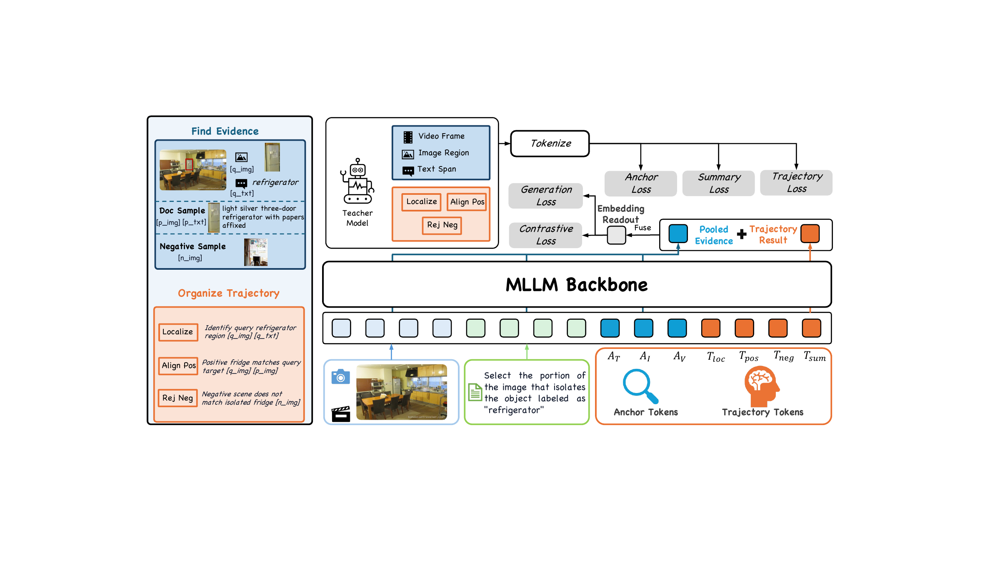
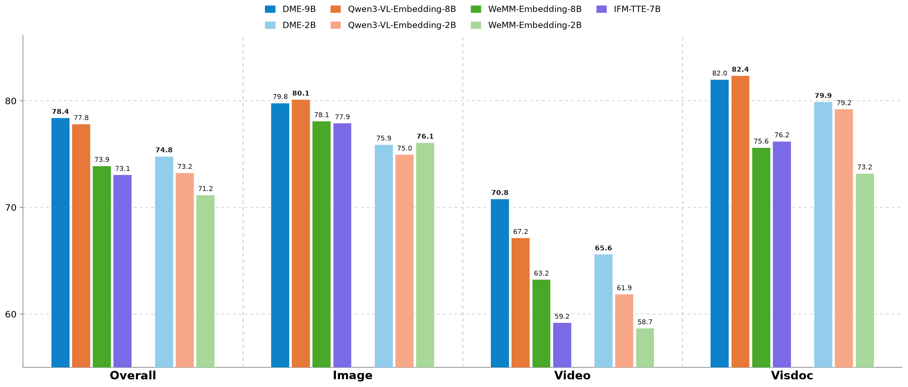
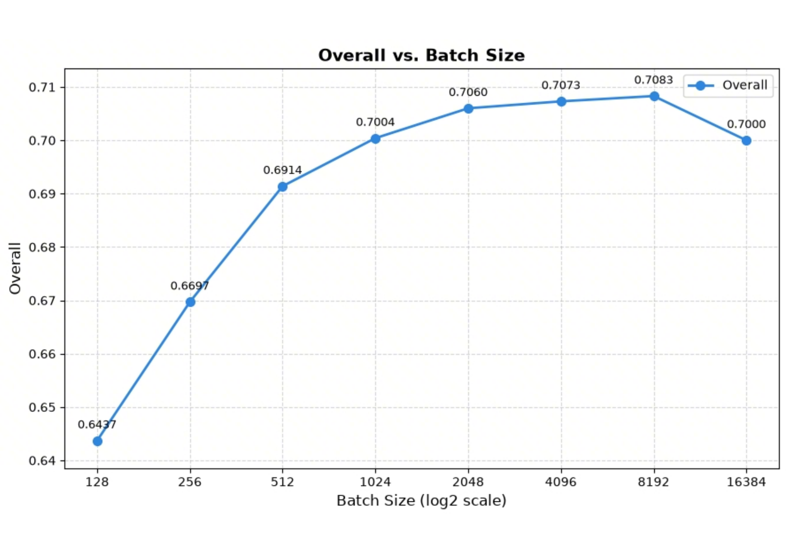
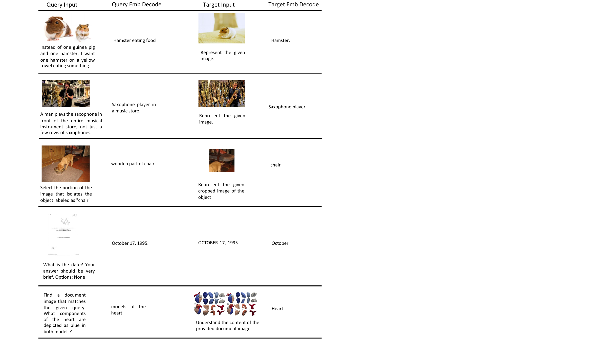
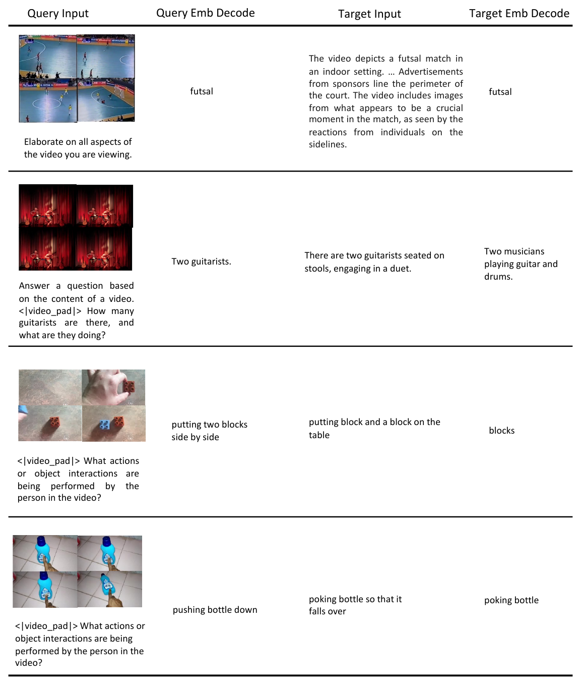
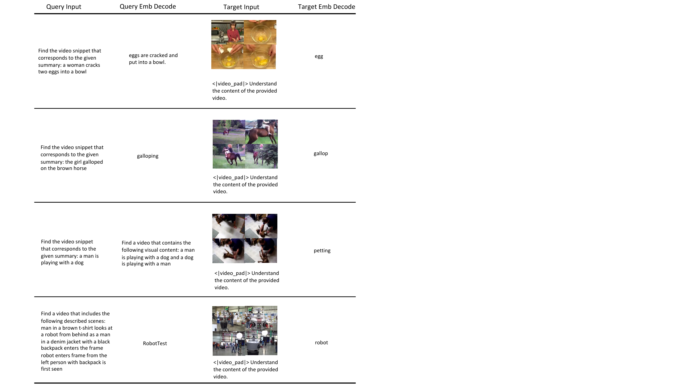

---
tags:
  - paper
  - collection/multimodal-understanding
  - domain/model-systems
  - status/deep-review
  - topic/multimodal-retrieval
  - method/evidence-grounded-embedding
---

# Douyin Multimodal Embedding Model Technical Report 精读分析

> 资料状态：本次解读完全基于 arXiv v3 PDF 与随附 LaTeX 源码重新生成；图像由源码图重新栅格化并紧裁剪，完整 caption 以相邻 Markdown 文本保留。未使用既有交付 Markdown。

关系：父级 [multimodal understanding README](../README.md) · [Survey](../surveys/multimodal-embedding.md) · [figure inventory](../evidence/figure-inventory.md) · [Paper assets](../assets/papers/douyin-multimodal-embedding/)

## 修订信息
- 当前文档版本：`2.1.0`
- 当前修订 ID：`rev-dme-rationale-prose-20260902`
- 当前修订时间：`2026-09-02T12:05:00+08:00`
- 替代版本：前一 process manifest 的 SHA-256 记录在本次 manifest；本次正文不依赖前一 Markdown。

| 修订 ID | 文档版本 | 时间 | 类型 | 替代修订 | 变更摘要 | 依据 | 对结论影响 |
|---|---|---|---|---|---|---|---|
| `rev-dme-source-rerun-20260902` | `2.0.0` | `2026-09-02` | `content-update` | 前一 manifest SHA-256 | 从 PDF/TeX 源码重建全文、图表与证据矩阵；补齐模板章节和发布链路 | arXiv v3 PDF/TeX；validators | 实质更新 |
| `rev-dme-rationale-prose-20260902` | `2.1.0` | `2026-09-02` | `content-update` | `rev-dme-source-rerun-20260902` | 将 4.2 设计项改为逐项通俗解释并保留汇总表 | 用户反馈；LaTeX §4.2、§5 | 无 |

## 0. 资料与配图索引
- 论文：process package 中的 arXiv v3 PDF（arXiv:2608.02148v3）
- LaTeX：process package 中的 source archive；抽取树仅保存在临时目录
- 开源代码：未在论文中给出可核验仓库；代码快照不适用
- OpenReview：未找到对应公开评审；`openreview_reviews.md` 不适用
- 提取文本：process package 中的 searchable extraction
- 图表：见 [figure inventory](../evidence/figure-inventory.md) 与 `../assets/papers/douyin-multimodal-embedding/`；每个源码图是单一对象、窄边界 PNG，完整 caption 紧邻保留
- AI 生成分析示意图：不适用；原始 Figure 3 已能表达方法流程

## 0.1 术语与符号解释
### 0.1.1 术语表
| 术语 | 本文含义 | 别名 | 不等于/易混项 | 证据来源 |
|---|---|---|---|---|
| DME | Douyin Multimodal Embedding，面向大规模多模态检索的双编码器 | Douyin Multimodal Embedding | 不是生成式检索器 | 摘要、§1 |
| 双编码器 | 查询和文档分别编码为向量，再用向量相似度检索 | bi-encoder | 不含在线 cross-encoder 重排 | §3 |
| 语义充分性 | 向量由检索相关证据形成且保留匹配另一侧所需细节 | semantic sufficiency | 不等于只把正样本拉近 | §1、§4 |
| Stage 1 | 约 25M 异构 query-document 对上的大规模对比预训练 | contrastive pre-training | 不是最终完整配方 | §4.1、§5 |
| Stage 2-A | Evidence-Grounded Typed Latent Reasoning，用 anchor 和 typed latent token 组织证据 | EG-TLR | 不是显式 CoT 生成 | §4.2 |
| Stage 2-B | Cross-Conditional Reconstruction，用一侧向量重建另一侧文本 | CCR | 解码只在训练发生 | §4.3 |
| anchor token | 定位文本片段、图像区域、OCR 或视频帧的软查询 token | anchor | 不是离散候选框 | §4.2 |
| typed latent token | 带语义定位、正向对齐、负例拒绝或摘要角色的隐藏状态 | typed latent | 不是用户可见推理词 | §4.2 |
| NTP / MTP | 下一 token / 多 token 预测 | next-/multi-token prediction | 不改变线上编码接口 | §4.3 |
| 信息完整性 | 用 teacher-forced Top-K token recovery 衡量从向量恢复文本的程度 | representation completeness | 不是端到端检索指标 | §5.5 |
| MMEB-v2 | 文本、图像、视频、视觉文档和混合输入的多模态嵌入基准 | 78-task setting | TTE-v2 行为 76-task 特例 | §5.1 |
| readout 表示（读出表示） | 从检索专用 latent token/隐藏状态中选出的中间向量；它先融合轨迹状态与证据池，再经 $W_{emb}$ 投影并归一化为最终 embedding | retrieval readout | 不是单个原始 token，也不是训练期 decoder 的输出文本 | §3、§4.2 Eq.7 |

### 0.1.2 符号表
| 符号 | 含义 | 性质 | 作用域/索引 | 单位/取值 | 来源 | 易混点 |
|---|---|---|---|---|---|---|
| $q,d$ | 查询、文档 | author-defined | 样本对 | 多模态内容 | §3、Eq.1 | $d$ 不是 decoder |
| $\iota$ | 检索指令 | author-defined | 两侧模板 | 文本 | Eq.1 | 与证据类型不同 |
| $E^q,E^d$ | 查询/文档编码器 | author-defined | 双塔 | 函数 | Eq.1 | 可共享骨干但侧别模板不同 |
| $z_q,z_d$ | 归一化检索向量 | author-defined | 每个样本 | 单位范数向量 | Eq.1、Eq.7 | $\tilde z$ 是未归一化条件 |
| $s(q,d)$ | 向量内积检索分数 | author-defined | query-document 对 | 标量 | Eq.1 | 未报告额外校准 |
| $x_j$ | 第 $j$ 个输入 token 隐藏状态 | author-defined | token 位置 | $\mathbb R^D$ | Eq.4 | 可来自视觉 token |
| $a_{s,r}$ | 侧 $s$ 的第 $r$ 个 anchor 状态 | author-defined | query/document | $\mathbb R^D$ | Eq.4 | 不是最终向量 |
| $p_{s,r}(j)$ | anchor 对位置的注意力权重 | author-defined | $s,r,j$ | 概率 | Eq.4 | 仅用于池化 |
| $e_{s,pool}$ | 加权证据池 | author-defined | 样本侧 | $\mathbb R^D$ | Eq.5 | 不等于 OCR 文本 |
| $r_q,r_d$ | readout 表示 | author-defined | 两侧 | $\mathbb R^D$ | Eq.7 | 归一化前 |
| $W_e,W_{emb}$ | 证据/embedding 投影矩阵 | author-defined | readout | 参数矩阵 | Eq.7 | 维度未报告 |
| $\alpha$ | 证据残差缩放系数 | author-defined | readout | 标量 | Eq.7 | 具体值未报告 |
| $\mathrm{sg}$ | stop-gradient，阻断反向梯度 | author-defined | Eq.7 | 算子 | Eq.7 | 不删除前向值 |
| $\lambda_{sem},\lambda_{align},\lambda_{reject}$ | typed loss 权重 | author-defined | Stage 2-A | 非负标量 | Eq.6 | 未给具体值 |
| $\tilde z_q,\tilde z_d$ | 重建条件的未归一化向量 | author-defined | Stage 2-B | $\mathbb R^D$ | §4.3 | 线上使用归一化 $z$ |
| $T$ | 目标文本长度 | author-defined | NTP | token 数 | Eq.8 | 不是温度 |
| $D$ | MTP 预测步数/模块数 | author-defined | Stage 2-B | 正整数 | Eq.10 | 具体值未报告 |

## 0.2 AI 生成算法分析示意图
不适用。原始 Figure 3 已同时展示两阶段训练、latent tokens、对比损失和语义充分性损失。

## 1. 论文基本信息
- 标题：Douyin Multimodal Embedding Model Technical Report
- 版本与日期：arXiv v3，2026-08-18；报告日期 2026-08-19
- 署名类型：机构署名
- 署名机构：ByteDance Douyin Search Multimodal Team；Renmin University of China GSAI
- 机构署名依据：PDF title page affiliation 只列组织名称，没有个人作者名
- 第一作者、共同一作、通讯作者及其机构对应：不适用（标题块未署名个人）
- 附录 Contributor List（贡献者元数据，不改写标题块署名）：Haonan Chen、Chu Li、Zhicheng Wang、Yuanwei Liu、Yuanjiang Wang；Project Leader Shaohua Jiang；Supervisor Zhicheng Dou。附录列出两家机构并使用 `*` equal contribution、`†` internship 标记；论文未把这些人标作标题页作者或通讯作者，不能据此推断作者身份。
- 研究领域：多模态理解 / 多模态向量检索
- 核心问题：十亿级索引低延迟约束下，保留局部、时间和跨模态细节
- 研究目标：提高语义充分性而维持标准双编码器接口
- 关键约束：离线 ANN；Stage 2-B 训练期使用；latent token 在单次 encoder pass 内完成

## 2. 研究动机与问题—方案闭环
### 2.1 出发点与背景痛点
作者在 Introduction 明确提出平台检索同时需要两件事：每个 query/document 只编码一次并支持离线近邻索引；复杂查询还要识别对象、属性、动作、OCR、时间顺序和空间关系。普通对比学习只告诉模型“哪一对相近”，没有强制向量保留“为什么相近”的局部证据，也没有强制向量保存匹配另一侧所需的细粒度信息（author-stated）。

### 2.2 现有方案为何不够
说明例：两段厨房视频都包含做饭场景，但只有一段先切洋葱再加热锅，局部动作差异导致旧方法排序错误；只增加更多全局负例仍不能指出查询和候选在何处不同。

| 现有方案/做法 | 可观察的失败 | 具体场景或例子 | 例子来源 | 根因 | 为什么简单修补仍不够 | 证据 |
|---|---|---|---|---|---|---|
| 纯对比式 MLLM 嵌入 | hard negative 得分接近 | 两段都含“厨房做饭”，但只有一段“先切洋葱再加热锅” | §1 场景重建 | pair-level 标签没有局部证据和反事实细节监督 | 加大 batch 增加负样本数量，却不指定应保留哪个局部条件 | §1、Table 3 |
| 显式 CoT/生成式检索 | 细粒度可能提升但线上需生成/多轮计算 | 十亿级文档库为每个 query 生成长推理链 | author-stated 对比 | 生成成本破坏标准 ANN 接口 | 缩短文本仍改变服务路径，难保固定延迟 | §1、Fig.2 |
| 仅加证据定位 | 找到证据却丢失对侧语义 | OCR 只有一行价格或视频只有关键帧能区分正负 | inferred from §4 | pooling 后的信息瓶颈仍未受 token-level 约束 | 定位和保存语义是两个目标，需要跨条件重建 | §4.2-4.3 |

> Figure 2 caption（源码 §1）：Comparison with prior works. (a) Contrastive MLLM embedders encode each side in a single pass, yielding low latency but coarse-grained representations. (b) CoT-based embedders prepend explicit reasoning before the embedding, improving fine-grained discrimination at the cost of high latency. (c) DME performs latent reasoning together with cross-conditional generative supervision, achieving fine-grained representations while retaining the low latency of a bi-encoder.

### 2.3 论文计划解决的问题与成功标准
- 核心问题：不引入线上生成/重排，能否让 embedding 由检索证据形成并保留对侧语义？
- 场景：文本、图像、视频、视觉文档及混合输入的 ANN 与 Douyin 搜索。
- 成功标准：MMEB-v2 分数、query p50 latency、teacher-forced recovery、离线相对提升和在线 Lifetime gain。
- 明确不解决：代码/权重、硬件型号、精确损失权重、独立模块消融和跨平台复现未报告。

### 2.4 核心方案如何解决并优化问题
Stage 1 先把 25M 异构样本放入统一向量空间；Stage 2-A 改变“向量如何形成”，用 anchor 找证据、typed latent 状态组织角色，并把证据残差并入 readout；Stage 2-B 改变“向量必须保存什么”，让 query 向量重建 document 文本、document 向量重建 query 文本。线上仍只保留一次编码和内积检索，因此预期质量上升而查询路径不变。

| 原始问题             | 方案设计                   | 改变的变量/行为             | 机制                    | 预期指标                         | 证据              | 判断                       |
| ---------------- | ---------------------- | -------------------- | --------------------- | ---------------------------- | --------------- | ------------------------ |
| 局部证据被 pooling 淹没 | anchor evidence pool   | $p_{s,r}(j)$         | 加权汇聚局部 token/帧        | Video/VisDoc                 | Eq.4-5、Table 3  | partial                  |
| 证据角色混杂           | typed latent reasoning | latent state 角色与损失   | 分离定位、对齐、拒绝            | hard-negative discrimination | Eq.6、§4.2       | partial                  |
| 向量丢失对侧细节         | NTP/MTP                | readout 承载的 token 信息 | 跨方向 token 梯度          | Overall、recovery             | Eq.8-11、Table 7 | supported but cumulative |
| 线上延迟不可接受         | training-only decoder  | inference graph      | 丢弃 decoder、保留 readout | <1 ms/query extra            | §4.3、Table 8    | supported                |

### 2.5 完整因果链与证据闭环
背景触发是大规模异构检索同时需要低延迟和细粒度匹配；痛点是对比 embedding 对 hard negative 的局部/对侧信息不敏感，而显式推理增加服务成本。论文把根因解释为 pair-level 监督和向量信息瓶颈，目标是语义充分性。Stage 1 扩大覆盖面，Stage 2-A 改变证据形成，Stage 2-B 用跨方向 token 重建约束保存的信息，最后以 MMEB-v2、恢复率、p50 延迟和工业 A/B 测量。Table 3 支持逐步加入配方有效，但它是 cumulative recipe，不能把每项增益视为完全孤立的因果效应；Table 8 支持 latent token 额外成本小；在线 +0.1% 支持部署价值，但多项技术共同迁移，归因仍混杂。

## 3. 核心贡献与创新点
1. 两阶段训练：Stage 1 统一空间，Stage 2 学习语义充分性（§4.1）。
2. Evidence-Grounded Typed Latent Reasoning：anchor 证据定位、typed 角色监督、readout 融合（§4.2）。
3. Cross-Conditional Reconstruction：NTP/MTP 让一侧 embedding 重建对侧文本且仅训练期使用（§4.3）。
4. 用 teacher-forced Top-K recovery 量化信息完整性（§5.5）。
5. MMEB-v2、Douyin 离线与在线 A/B 的多层证据（§5.1-5.6）。

## 4. 研究方法
### 4.1 方法总览
样本先经过指令化 query/document 编码器；Stage 1 用对比学习塑造统一空间。Stage 2 继续对比学习，同时 Stage 2-A 在隐藏状态中定位和组织证据，形成 **readout（读出表示）**：它是把检索专用 latent 状态和证据池汇合后的中间向量，不是最终文本输出；再经投影和归一化得到 embedding。Stage 2-B 让两侧 readout 互相重建文本。训练完成后丢弃解码器，线上每侧只保留一个向量，ANN 用内积排序。

> Figure 3 caption（源码 §3）：Overview of DME. Stage 1 performs large-scale contrastive pre-training to establish a unified multimodal embedding space. Stage 2 introduces semantic sufficiency learning through Evidence-Grounded Typed Latent Reasoning and Cross-Conditional Reconstruction.

### 4.2 组件级设计动机与具体问题映射
这一节先用通俗语言解释每个设计项，再用表格压缩汇总。论文明确解释了大多数设计的目标，但并没有为每个子模块提供独立的替换实验；因此下面把“作者明确说的”和“根据公式推断的”分开标注。

**1. 先做 25M 样本的 Stage 1 对比预训练。**  
如果直接拿约 5M 的高质量 Stage 2 数据训练，模型会学到少量任务的匹配规则，却未必能把文本、图像、视频和视觉文档放进同一个稳定空间。Stage 1 用约 25M 异构 query-document 对，先让正样本靠近、负样本分开，解决的是“覆盖面和初始几何结构”问题。作者在 §4.1 明确把它定位为 Stage 2 的基础。Table 3 中从 baseline 的 70.9 提升到 72.5，说明这一步有用；但这是累计配方对照，不是把同一个最终模型只删除 Stage 1 的严格实验。

**2. 用 anchor 找到真正相关的局部证据。**  
多模态输入很长：一段视频可能只有一个关键帧，一张视觉文档可能只有一行 OCR 文本与查询有关。若把所有 token 平均，关键细节会被大量无关内容稀释。DME 放入少量 anchor token，让它们对每个输入位置分配权重，再把高权重位置汇成 evidence pool。这里改变的是“哪些局部 token 对最终向量贡献更大”，预期改善视频和视觉文档检索。论文 §4.2 的公式和 Table 3/7 支持这个方向，但没有直接标注框或关键帧的准确率，因此只能说部分验证，而不是证明每次都找对了证据。

**3. 给 latent 状态分配不同角色，而不是让一个隐藏状态什么都做。**  
Stage 2-A 的 typed latent token 分成语义定位、正向对齐和负例拒绝等角色。可以把它理解成三位分工不同的“检查员”：一位确认看到了什么，一位确认它是否与正样本匹配，另一位专门检查为什么相似的负样本其实不该被选中。三类损失的加权和见 Eq.6。作者明确说明了这些角色的训练目标，但没有逐项移除或替换实验；Table 3 只说明加入整个 Stage 2-A 后总体分数从 72.5 到 73.8，尤其 Video 从 59.3 到 63.7，因此角色分工的独立贡献仍未完全隔离。

**4. readout 中加入证据，但用 stop-gradient 控制训练路径。**  
readout 是从 latent 状态到最终 embedding 之间的汇合点：它把轨迹状态提供的整体语义，与 anchor 汇总的局部证据相加，再经过投影和归一化。论文在 Eq.7 使用 stop-gradient，前向计算保留证据，反向传播时不让这条证据残差更新其来源分支。论文没有单独解释为什么必须这样做；“为了避免证据池分支扰乱 readout 的训练稳定性”是依据公式的推断，不应写成作者已验证的结论。代价是证据分支适应性可能降低，且没有专门消融。

**5. 用 NTP/MTP 迫使向量保存对侧文本细节。**  
仅把正 query 和正 document 拉近，并不保证向量还记得价格、动作顺序或局部属性。Stage 2-B 让 query 的未归一化向量逐 token 重建 document 文本，同时反向重建 query 文本；MTP 再要求它预测多个未来 token。这样，向量不只是“知道两边相关”，还必须携带足够信息回答“对方具体说了什么”。作者在 §4.3 明确给出这一动机，Table 7 的 teacher-forced recovery 提供机制证据；但 NTP 和 MTP 没有分开实验，所以只能归因到整个 CCR 组合。

**6. 把重建 decoder 限定在训练期。**  
如果线上也运行重建，就会把一次向量编码变成生成或多轮计算，无法继续使用离线 document 向量和 ANN。DME 只在训练时用 decoder 回传 token-level 梯度，部署前丢弃 decoder，线上仍是一次 encoder pass 加向量内积。这个边界是作者明确声明的；Table 8 测到文本和视频 query 的额外开销低于 1 ms，支持“接近原双编码器”的结论，但没有覆盖 document 编码吞吐和尾延迟。

**7. 选择 1280 个图像 token 和 32 帧视频。**  
这是质量和成本的工程折中：预算太小会漏掉细粒度视觉信息，预算太大则增加显存和计算。论文 §5.4 的敏感性表显示，增加图像 token 和视频帧通常提高相应指标，超过 32 帧后的收益变小，因此最终采用 1280/32。这个结论有直接敏感性证据，但最优点仍依赖数据分布和硬件。

**部署边界：anchor pool 是否固化会改变整体负载。**  
标准 DME 描述只把最终的 document embedding 放进 ANN 索引；anchor hidden states、注意力权重和 `e_{s,pool}` 是编码过程中的临时中间量，计算结束后可以释放。因此论文的低延迟结论不能解读为“额外保存了证据池仍然没有成本”。如果为了解释性、二阶段重排或后续任务把 anchor pool 固化到索引中，就需要为每个 document 增加一组向量或证据元数据，带来额外存储容量、索引写入/更新、读取带宽、缓存占用和 ANN/重排阶段的访问负载；这些成本可能超过 Table 8 测到的单次 query encoder 增量。论文没有测量这种固化方案，也没有给出 anchor 数量和 pool 维度，因此这里只能作为明确的工程边界，而不是 DME 已验证的系统收益。

**8. 用 LoRA、BF16、gradient checkpointing 和 ZeRO 承受长多模态输入。**  
LoRA 减少需要更新的参数，BF16 降低单元素存储，checkpointing 用额外重算换激活显存，ZeRO 分摊优化器/梯度状态。它们解决的是“模型和视觉 token 太长导致显存不够”，不是新的检索机制。论文 §5.1 明确列出这些选择，但只给出文字说明，没有公开硬件、峰值显存或通信量，所以对具体节省多少只能保持谨慎。

**设计项汇总（用于快速对照，详细解释以上文为准）：**
下面的 Figure 4 把上述文字中的“找证据—分角色—形成 readout—训练期重建”画在同一条 Stage 2 路径上；它是机制总览，不是独立效果证明。

> Figure 4 caption（源码 §3）：Detailed illustration of Stage 2. The model uses anchor tokens to find retrieval-relevant evidence, typed latent tokens to organize evidence, and a readout representation for retrieval and cross-conditional reconstruction.

| 设计项 | why 状态 | 针对问题 | 因果机制 | 替代/权衡 | 验证 | 判断 |
|---|---|---|---|---|---|---|
| 25M Stage 1 对比预训练 | author-stated §4.1 | 异构覆盖与稳定空间 | 更多跨模态正负关系 | 直接 Stage 2；Table 3 较差 | Table 3 | supported |
| anchor evidence pool | author-stated §4.2 | 局部证据稀释 | attention 加权池化 | region proposal 更重 | Table 3/7 | plausible-partial |
| typed semantic/alignment/reject | author-stated §4.2 | 角色混杂 | 三类 latent loss | 单一 latent；未替换 | Table 3 cumulative | partial |
| stop-gradient evidence residual | inferred from Eq.7 | 训练稳定性 | 前向保留、反向阻断 | 可学习残差更灵活 | 无专门 ablation | plausible |
| NTP + MTP | author-stated §4.3 | 对侧细节丢失 | token-level 梯度 | 仅 NTP；未拆分 | Table 3/7 | partial |
| training-only reconstruction | author-stated §4.3 | 线上生成代价 | 丢弃 decoder | 在线生成更慢 | Table 8 | supported |
| 1280 image tokens / 32 frames | author-stated §5.4 | 视觉细节-成本 | 增加输入覆盖 | 更小预算损失质量 | Tables 5-6 | supported |
| BF16/checkpointing/ZeRO/LoRA | author-stated §5.1 | 显存压力 | 降低激活/优化器状态 | 全参训练更贵 | prose only | plausible |

### 4.3 模型/系统架构
检索计算为
$$
z_q=E^q(T_q(\iota,q)),\quad z_d=E^d(T_d(\iota,d)),\quad s(q,d)=z_q^\top z_d.
$$
**这条公式在算什么？** 计算 query-document 向量相似度，把 query/document 各自编码成向量并用内积排序。  
**怎么读？** 两侧独立编码，文档向量可离线缓存，线上只需 query 编码和 ANN。  
**输入与输出。** 输入是指令与多模态内容；输出是向量和标量分数。  
**变量在这里各做什么？** $T_q,T_d$ 是模板，$E^q,E^d$ 是编码器，$z_q,z_d$ 是向量，$s$ 是分数。  
**直觉。** 正样本内积高、负样本低。  
**边界。** 未报告维度、索引库大小或 ANN 实现。  
**小例子。** 夹角更小的两个向量内积更大；这是几何说明，不是新增实验。

### 4.4 关键公式
公式卡目的：定位并池化检索相关证据；用一侧向量逐 token 重建另一侧文本。
证据权重与池化：
$$p_{s,r}(j)=\operatorname{softmax}_j\left(\frac{a_{s,r}^{\top}W_kx_j}{\sqrt D}\right),\qquad e_{s,pool}=\operatorname{Mean}_r\sum_j p_{s,r}(j)x_j.$$ 
**这条公式在算什么？** anchor 对输入位置分配概率并形成证据向量。 **怎么读？** 匹配越高权重越大。 **输入与输出。** 输入 $x_j,a_{s,r}$，输出 $e_{s,pool}$。 **变量。** $s$ 是侧别，$r$ 是 anchor，$j$ 是位置，$W_k$ 是投影，$D$ 是维度。 **直觉。** 相关局部证据贡献更大。 **边界。** 软选择不保证准确框/关键帧。 **小例子。** “第三秒举杯”的帧若匹配高，会对池化贡献更大。

Typed loss：
$$\mathcal L_{typed}=\lambda_{sem}\mathcal L_{sem}+\lambda_{align}\mathcal L_{align}+\lambda_{reject}\mathcal L_{reject}.$$ 
**这条公式在算什么？** 合并三类 typed 角色损失。 **怎么读？** 总损失是加权和。 **输入与输出。** 输入三项损失和权重，输出 Stage 2-A 标量。 **变量。** 三个 $\mathcal L$ 分别对应定位、对齐、拒绝，$\lambda$ 控制影响。 **直觉。** 不只追求相似度，还约束错在哪里。 **边界。** 权重未报告，三项未逐一替换。 **小例子。** 正样本含“红色杯子”、负样本只有“杯子”时，拒绝信号应保留颜色差异。

Readout：
$$r_q=h_{q,R}^{traj}+\alpha\,\mathrm{sg}(W_e e_{q,pool}),\quad z_q=\mathrm{norm}(W_{emb}r_q).$$
**这条公式在算什么？** 计算 readout（读出表示），再把它投影成最终 embedding。 **怎么读？** 前向加入证据，`sg` 阻断该残差反向梯度。 **输入与输出。** 输入轨迹状态、证据池和投影矩阵；中间输出是 readout $r_q$，最终输出是归一化 embedding $z_q$。 **变量。** $h$ 是轨迹读出状态，$W_e$ 投影证据，$\alpha$ 缩放，$W_{emb}$ 把 readout 映射到 embedding 空间。 **直觉。** readout 是“检索前的汇合点”：轨迹给整体语义，证据补细节，归一化后才成为线上向量。 **边界。** readout 不是 decoder 生成的文本；稳定性解释是推断，$\alpha$ 未报告。 **小例子。** readout 可同时含“商品”这一整体语义和 OCR 价格这一局部证据，随后被压成一个可检索向量。

跨条件重建：
$$\mathcal L_{NTP}^{q\to d}=-\frac1T\sum_{t=1}^{T}\log P(x_d^t\mid \tilde z_q,x_d^{<t}),\quad \mathcal L_{NTP}=\mathcal L_{NTP}^{q\to d}+\mathcal L_{NTP}^{d\to q}.$$ 
**这条公式在算什么？** 用 query 向量逐 token 预测 document 文本并对称反向预测。 **怎么读？** 每个正确 token 降低损失，向量必须含对侧信息。 **输入与输出。** 输入未归一化条件和真实前缀，输出平均负对数似然。 **变量。** $x_d^t$ 是目标 token，$x_d^{<t}$ 是前缀，$T$ 是长度。 **直觉。** 只有“相近”不保证细节，重建施加信息瓶颈约束。 **边界。** teacher forcing 不等于自由生成；decoder 训练后丢弃。 **小例子。** query 向量保留动作细节时，更可能恢复对侧描述。

MTP 让同一条件同时预测多个未来 token；它是训练期额外梯度路径，模块数 $D$ 未公开。

### 4.5 训练/实验/部署设计
Stage 1 约 25M 对；Stage 2 约 5M 指令格式样本，teacher Seed-2.0-Pro 生成结构化证据/轨迹。DME-2B/9B 使用 LoRA、BF16、gradient checkpointing、ZeRO；图像 1280 tokens、视频 32 frames。公开评估 MMEB-v2，内部评估 Douyin 离线集与在线 A/B。GPU 型号、训练时长、精确 batch/学习率/温度和代码未报告。

## 5. 关键结论
### 5.1 主结果
| 模型 | Overall | Image | Video | VisDoc |
|---|---:|---:|---:|---:|
| DME-2B | 74.8 | 75.9 | 65.6 | 79.9 |
| DME-9B | 78.4 | 79.8 | 70.8 | 82.0 |
| Qwen3-VL-Embedding-2B | 73.2 | 74.1 | 61.5 | 78.8 |
| Qwen3-VL-Embedding-8B | 77.8 | 78.9 | 69.7 | 81.0 |

数字来自 Table 1；TTE-v2 使用 76-task，而其他行通常是 78-task。DME 主结果支持相近规模竞争力，不能单独证明模块因果收益。

> Figure 1 caption（源码 §1）：Performance Comparison. Overall and per-domain (Image, Video, VisDoc) results on MMEB-v2. At both the 2B and 9B scales, DME consistently outperforms other embedding models with especially large gains on video and visual-document retrieval.

### 5.2 消融和机制证据
| 配方 | Image | Video | VisDoc | All |
|---|---:|---:|---:|---:|
| baseline（无 Stage 1/A/B） | 74.6 | 55.3 | 77.1 | 70.9 |
| + Stage 1 | 74.8 | 59.3 | 79.0 | 72.5 |
| + Stage 2-A | 75.2 | 63.7 | 79.2 | 73.8 |
| + Stage 2-B | 75.9 | 65.6 | 79.9 | 74.8 |

Table 3 是累计加法：Stage 1 overall +1.6，Stage 2-A +1.3，Stage 2-B +1.0；不是独立 leave-one-out。Table 4 的 mixed ratio=0.25 最好（0.6919）；Figure 5 显示 batch 128 到 8192 上升后饱和/下降。Tables 5-6 支持 32 frames 和 1280 image tokens 的折中；Table 7 支持向量可恢复对侧 token；Table 8 显示 latent token 的 query p50 额外开销低于 1 ms（文本/视频）。

> Figure 5 caption（源码 §5.4）：Effect of batch size on contrastive training. Increasing batch size expands the in-batch negative space and improves retrieval performance up to a saturation point.

### 5.3 是否验证了假设
- 两阶段优于直接 Stage 2：累计消融支持，强度中等。
- evidence/typed latent 解决局部问题：Video 增益和恢复率支持，但缺少单模块替换，部分验证。
- CCR 提高信息充分性：恢复率和 Stage 2-B 边际增益支持；teacher-forced 是代理指标。
- 线上代价接近双编码器：Table 8 支持 query 侧小额开销，document 吞吐和端到端尾延迟未知。
- 工业收益来自 DME：+2.92% 离线、+0.1% 在线存在，但多技术共同迁移，归因混杂。

### 5.4 收益来源归因
| 技术点 | 证据 | 归因 |
|---|---|---|
| Stage 1 | Table 3 | 中等，累计对照 |
| Stage 2-A | Video 59.3→63.7 | 部分，内部子模块未拆 |
| Stage 2-B | All 73.8→74.8、Table 7 | 部分，NTP/MTP 未拆 |
| batch/mixed/visual budget | Figure 5、Tables 4-6 | 直接敏感性 |
| 线上效率 | Table 8 | 直接 query p50，端到端不完整 |
| 工业 +2.92%/+0.1% | Table 2/A-B | 相关性，不能归因单模块 |

### 5.5 信息完整性可视化
附录 Figures 6–8 给出“只把单个 embedding 作为 prefix、不给原始文本或视觉 token”时的重建样例。它们能直观看到 embedding 保留了哪些对象、动作和文档文字，但属于定性机制证据；不能替代 Table 7 的 Top-K 统计，也不能证明所有细节都被恢复。

> Figure 6 caption（源码 Appendix）：Reconstruction visualization on image and visual-document inputs.

> Figure 7 caption（源码 Appendix）：Reconstruction visualization on video inputs.

> Figure 8 caption（源码 Appendix）：Reconstruction visualization on video moment-retrieval inputs.

## 6. Related Work 对比
| 方法族 | 机制 | 优点 | 局限 | DME 差异/公平性 |
|---|---|---|---|---|
| CLIP/ALIGN/对比嵌入 | pair-level 拉近/推远 | 可扩展、天然 ANN | 细粒度证据不足 | DME 保留接口并增加 latent/重建 |
| GME/VLM2Vec/Qwen3-VL | MLLM backbone + pooling | 模态覆盖广 | 主要仍是相似度监督 | DME 加语义充分性；规模比较较合理 |
| CoT/TTE/Embed-RL | 显式推理或强化学习 | 细粒度强 | 生成/多轮成本 | DME 隐藏空间推理；数据不完全同质 |
| 重建/联合生成表示 | 生成损失保存信息 | token-level 信号 | 可能伤害效率 | CCR 训练期使用；NTP/MTP 未拆 |

## 7. OpenReview 公开评审 × 论文内容交叉核验
### 7.1 公开评审可得性
未发现对应 OpenReview forum、review、decision 或 rebuttal；没有 reviewer claim 可核验。
### 7.2 评审意见与论文证据对应
不适用；不能把缺少公开评审写成“没有质疑”。
### 7.3 争议点复核
由论文自身证据复核出的争议是累计消融、teacher-forced 代理指标和工业收益混杂，已在 §5.3-5.4 标注。
### 7.4 结论
OpenReview 状态为 `not-applicable`，不影响 PDF/TeX 解读，但降低外部质询覆盖度。

## 8. Infra 需求分析
### 8.1 算力
2B/9B MLLM、25M Stage 1 和长视频输入需要大规模 GPU 训练；论文只报告 LoRA、BF16、checkpointing、ZeRO，未给 GPU 数量或训练时长。8 张高性能 GPU、batch 4 仅用于 Table 8 延迟测量。
### 8.2 显存与存储
显存压力来自视觉 token、视频 32 帧、激活和优化器状态；训练技巧降低占用。标准部署只需存储最终 document embedding 与 ANN 索引，anchor hidden states、注意力权重和 evidence pool 不必持久化。若工程上固化这些中间表示，则每个 document 会增加多向量/元数据字段，进一步放大存储、索引更新、缓存和读取带宽负载；论文未给出该方案的容量或吞吐测量。向量维度和库规模本身也未公开。
### 8.3 Data Types / 数值格式
训练使用 BF16；未报告 FP8、量化、推理精度或索引压缩。
### 8.4 带宽、互联与高效利用
大 batch 扩大 in-batch negatives，可能增加跨卡 all-gather；通信成本未量化。Figure 5 的饱和说明统计收益和通信代价需共同权衡。
### 8.5 CPU/GPU/NPU 异构执行
未报告 CPU preprocessing、OCR/帧采样、GPU/NPU 分工或自定义 kernel，均标为未知。
### 8.6 调度/Serving/自定义算子
部署路径是 query 编码、document 向量缓存、ANN Top-K，再交给后续排名/生成搜索；Stage 2-B decoder 不部署。默认路径也不固化 anchor/evidence pool；若固化，则需要额外的多向量读取或重排阶段，整体负载和尾延迟会改变。调度、batching、尾延迟和索引服务实现未提供。

## 9. 开源代码对照
### 9.1 开源权重/配置对照
论文和源码归档未给代码仓库 URL、commit、权重或配置文件。本文不声称存在可复现实现；精确骨干、tokenizer、各 $\lambda$、温度、学习率、batch、MTP 深度、硬件和过滤规则均待验证。

## 10. 优点与局限
### 优点
- 同时约束质量与 ANN 服务效率。
- Stage 2-A 和 Stage 2-B 分别约束证据形成与信息保存。
- MMEB-v2、敏感性、恢复率、延迟、工业离线/在线形成多层证据。
- 训练期重建不改变线上双编码器接口。
### 局限
- Table 3 累计配方不能严格隔离组件因果增益。
- NTP/MTP、typed loss、anchor 数量和权重缺少独立消融。
- teacher-forced recovery 是代理指标。
- 工业收益多技术混杂，在线提升仅 0.1% 且无置信区间。
- 代码、权重、硬件和训练配置未公开。
### 可改进之处
1. 做固定数据/步数的 leave-one-component-out 与 NTP/MTP 单独对照。
2. 报告置信区间、尾延迟、document 编码吞吐和 ANN 内存。
3. 发布最小可复现实验配置、权重或伪代码及数据统计。
4. 用自由生成恢复、hard-negative 反事实测试和跨域迁移验证语义充分性。

## 11. 研究启发
1. “向量如何形成”和“向量必须保存什么”可用不同训练信号分解，再在同一 readout 汇合。
2. 训练期生成监督不必把生成器带入线上，关键是把 token-level 梯度注入最终表示。
3. 代理指标只有和检索指标、延迟、消融共同出现才有解释力。
4. 多模态检索工程收益应同时看负样本统计、视觉预算和跨卡通信。

## 12. 解读问题/待验证清单
- [ ] Stage 2-A 三类 loss 是否各自贡献？
- [ ] NTP 与 MTP 的边际收益是否独立？
- [ ] $\alpha$、温度、batch、MTP 深度和 latent token 数量如何影响质量/延迟？
- [ ] teacher-forced recovery 与自由生成、hard-negative Recall 的相关性如何？
- [ ] 在线 +0.1% 的置信区间、流量规模和独立技术归因是什么？
- [ ] document 端编码吞吐、ANN 内存和索引更新成本是多少？

## 13. 一句话总结
DME 用 anchor/typed latent reasoning 让 embedding 更有证据依据，再用训练期跨条件 NTP/MTP 迫使向量保存对侧细节，在保留双编码器线上接口的同时提升多模态检索质量；但累计消融、代理恢复指标、工业收益混杂和未公开实现仍限制严格因果归因与复现。
