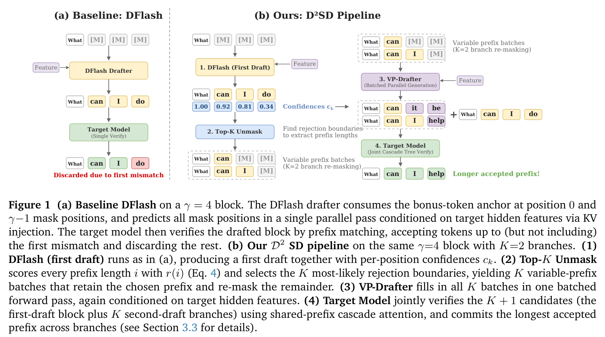
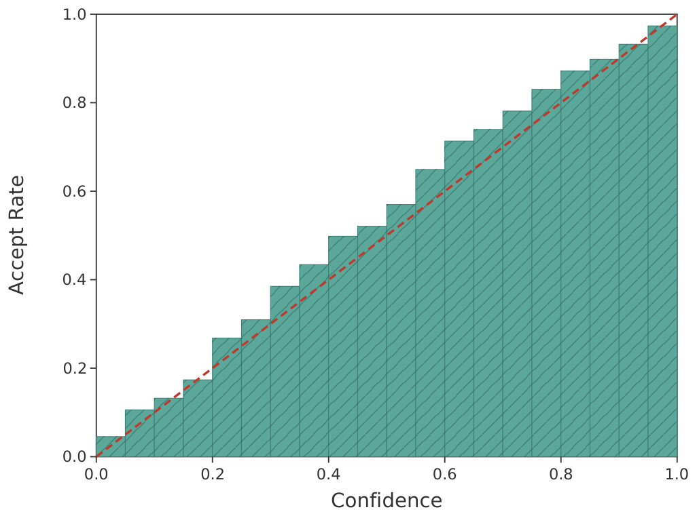
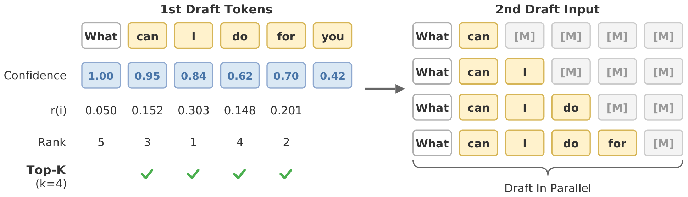
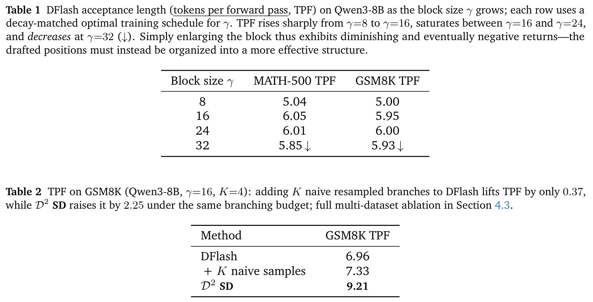
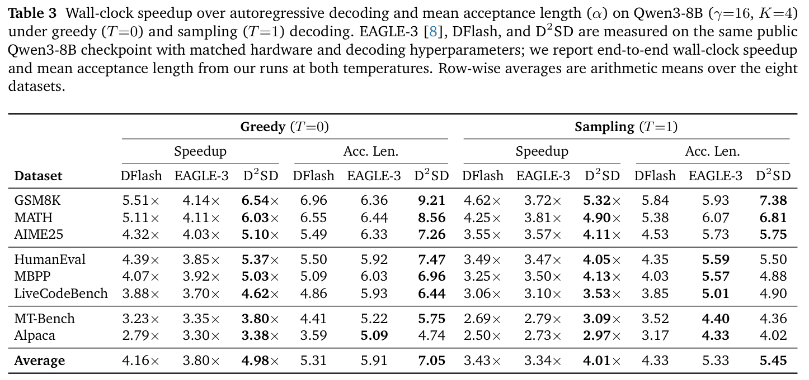
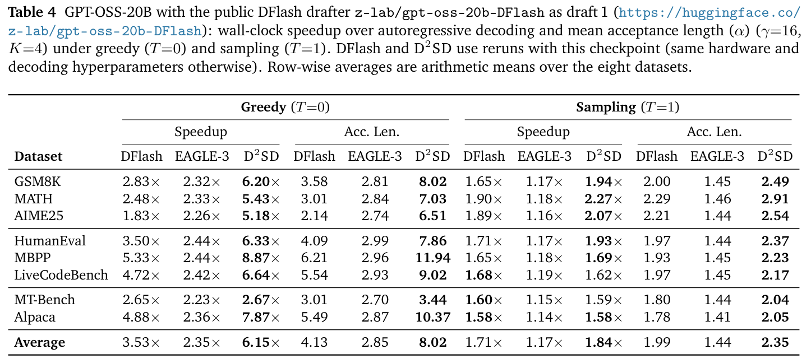
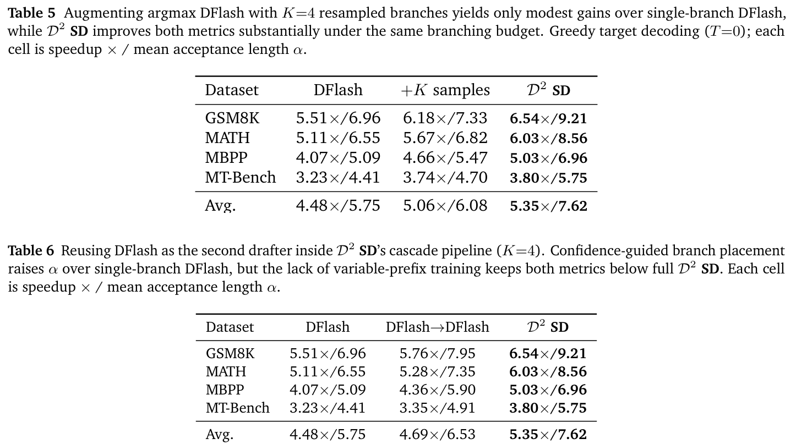

# D^2SD: Accelerating Speculative Decoding with Dual Diffusion Draft Models 精读分析

> 资料状态：已下载 arXiv:2606.04446v1 PDF、arXiv source archive 和 LaTeX 源文件。本文档中的 Figure 1/2 来自 LaTeX source 中的原始 PDF 图转 PNG；主结果表和消融表使用 PDF 页面截图作为证据。论文给出开源仓库 `https://github.com/catnanami/D2-SD`，`git ls-remote` 确认 HEAD 为 `6334b256d2f5294d61617453d1407bb3df06990f`，但本地浅克隆因 GitHub 443 连接超时失败，因此未完成代码文件级交叉验证。

## 0. 资料与配图索引

- 原始论文页面：[https://arxiv.org/abs/2606.04446v1](https://arxiv.org/abs/2606.04446v1)
- 原始论文 PDF：https://arxiv.org/pdf/2606.04446v1
- 原始论文源码：https://arxiv.org/e-print/2606.04446v1
- 论文 PDF：`../../_artifacts/source/2606.04446v1_D2SD_Accelerating_Speculative_Decoding_with_Dual_Diffusion_Draft_Models/paper.pdf`
- arXiv source：`../../_artifacts/source/2606.04446v1_D2SD_Accelerating_Speculative_Decoding_with_Dual_Diffusion_Draft_Models/source/`
- LaTeX 主文件：`../../_artifacts/source/2606.04446v1_D2SD_Accelerating_Speculative_Decoding_with_Dual_Diffusion_Draft_Models/source/main.tex`
- 提取文本：`../../_artifacts/source/2606.04446v1_D2SD_Accelerating_Speculative_Decoding_with_Dual_Diffusion_Draft_Models/extracted_text/full_text.txt`
- 页面截图：`../../_artifacts/source/2606.04446v1_D2SD_Accelerating_Speculative_Decoding_with_Dual_Diffusion_Draft_Models/figures/page_png/`
- 代码仓库：[https://github.com/catnanami/D2-SD](https://github.com/catnanami/D2-SD)，远端 HEAD `6334b256d2f5294d61617453d1407bb3df06990f`；本地 clone 未完成。

| 图表        | 本文档用途                                               | 文件                                                |
| --------- | --------------------------------------------------- | ------------------------------------------------- |
| Figure 1  | DFlash 与 D^2SD pipeline 对比                          | `assets/d2sd_pipeline_contrast.png`            |
| Figure 2a | confidence 与真实 accept rate 的校准关系                    | `assets/d2sd_confidence_accuracy.png`          |
| Figure 2b | Top-K unmask / variable-prefix branch 构造            | `assets/d2sd_topk_unmask.png`                  |
| Page 2    | Table 1/2：block size scaling wall 与 naive branch 对比 | `assets/d2sd_page02_tables_scaling_naive.png`  |
| Page 8    | Table 3：Qwen3-8B 主结果                                | `assets/d2sd_page08_table_qwen3_main.png`      |
| Page 8    | Table 4：GPT-OSS-20B 主结果                             | `assets/d2sd_page08_table_gptoss_main.png`     |
| Page 9    | Table 5/6：resampling 与 DFlash 复用消融                  | `assets/d2sd_page09_table_gptoss_ablation.png` |

## 1. 论文基本信息

- 研究领域：大语言模型推理加速，具体是 speculative decoding、block diffusion drafter、tree/cascade verification。
- 核心问题：扩散式并行 drafter 能一次生成 block，但单条 draft sequence 受 longest-correct-prefix rule 限制，早期错一个 token 后续全部作废；而树状 speculative decoding 能提高接受长度，但自回归 draft tree 有明显 drafting tax。
- 研究目标：在保留 DFlash 并行草稿低延迟的同时，引入结构化分支恢复，把额外 draft 预算集中到第一阶段最可能被拒绝的位置。
- 默认设置：目标模型 Qwen3-8B / GPT-OSS-20B；默认 $\gamma=16, K=4$；H200 GPU；BF16；FlashAttention-2；cascade attention 使用 flashinfer；CUDA graph 预热。

## 2. 核心贡献与创新点

1. **把扩散草稿从单链改造成 confidence-guided prefix tree。** 第一阶段 DFlash 生成一个 block 和每位置 confidence；D^2SD 不盲目增加 block 长度，而是估计拒绝边界并选择 top-$K$ prefix ranges，再从这些 prefix 重新生成后缀。证据：Section 3.1-3.3，Figure 1。

2. **引入第二个 variable-prefix diffusion drafter。** VP-Drafter 架构与 DFlash 类似，都是轻量 Qwen-based block diffusion model，并通过 KV 注入 target hidden features；区别在训练：VP-Drafter 被训练为能从任意 prefix length 继续补 mask，而不是只从固定 anchor 预测全 block。证据：Section 3.4。

3. **使用第一阶段 confidence 建模拒绝边界。** 论文定义 $c_k=\max_v p_k(v)$，并用 Figure 2a 显示 DFlash confidence 在 GSM8K 上接近校准，因此把它当作条件接受概率的近似。再用

$$
r(i)=\prod_{k=1}^{i}c_k\cdot(1-c_{i+1}),\quad i=0,1,\dots,\gamma-2
$$

估计“恰好接受 $i$ 个 token 后被拒绝”的概率。证据：Eq. 3/4，Figure 2a。

4. **Top-K unmask 将 posterior 转成可验证的共享前缀分支。** 选择

$$
\mathcal{S}=\operatorname*{Top\text{-}K}_{i\in\{0,\dots,\gamma-2\}} r(i)
$$

每个 $i\in\mathcal{S}$ 保留 anchor 和前 $i$ 个 DFlash token，只重新 mask 后续位置。这样得到的 $K+1$ 个候选天然共享前缀，适合 cascade attention 联合验证。证据：Eq. 5，Figure 2b。

5. **用实验拆开三类失败模式。** Table 1 显示 DFlash 单纯增大 $\gamma$ 到 24 后收益饱和，$\gamma=32$ 反而下降；Table 2/5 显示同一 drafter 上 $K$ 次 naive resampling 只带来小幅收益；Table 6/7 说明复用 DFlash 或加第三层级都不是最优。

## 3. 研究方法

### 3.1 问题到方案的逻辑链

论文的逻辑链是：

1. speculative decoding 的延迟由每轮 draft/verify 成本和接受长度共同决定；
2. DFlash 将 draft block 并行化，降低 $T_{\text{draft}}$，但仍只提交最长正确前缀；
3. 早期 mismatch 的代价最大，因此额外预算应投到可能拒绝边界附近，而不是平均分给所有位置；
4. 第一阶段 confidence 能提供拒绝边界 posterior；
5. 第二阶段 VP-Drafter 在 top-$K$ prefix 处重新 anchor 并补后缀；
6. 最后通过 cascade attention 一次联合验证共享前缀候选，减少重复 target verification 计算。

### 3.2 关键公式

speculative decoding 平均 token 延迟：

$$
L=\frac{T_{\text{draft}}+T_{\text{verify}}}{\alpha}
$$

wall-clock speedup：

$$
\eta=\frac{L_{\text{target}}}{L}
=\frac{\alpha\cdot L_{\text{target}}}{T_{\text{draft}}+T_{\text{verify}}}
$$

这里 $\alpha$ 是每轮平均提交 token 数，包括 rejection boundary 处 target 返回的 bonus token。D^2SD 的目标是提高 $\alpha$，同时只增加一个 batched VP-Drafter pass 和一次共享前缀 verify，避免 $T_{\text{draft}}+T_{\text{verify}}$ 线性膨胀。

第一阶段 confidence：

$$
c_k=p_k(\hat{t}_k)=\max_v p_k(v)
$$

拒绝边界 posterior：

$$
r(i)=\left(\prod_{k=1}^{i}c_k\right)(1-c_{i+1})
$$

这个公式隐含一个近似：给定 prefix 后，各位置 confidence 可累乘为 prefix survival probability。论文用 Figure 2a 支持 confidence 校准，但没有系统报告跨任务、跨温度的 calibration 误差。

VP-Drafter prefix prior：

$$
\Pr(l=j)\propto\beta^j,\quad j=0,1,\dots,\gamma-2
$$

VP-Drafter 加权交叉熵：

$$
\mathcal{L}_{\text{VP}}
=-\frac{\sum_{k=l+1}^{\gamma-1}w_k\log p_k(t_k^\star)}
{\sum_{k=l+1}^{\gamma-1}w_k},
\qquad
w_k=\exp\left(-\frac{k-l-1}{\tau}\right)
$$

这让离 anchor 更近的位置权重更大，因为这些位置一旦错，后续 token 会被 longest-correct-prefix rule 丢弃。

### 3.3 推理流程

每个 decoding cycle 分四步：

1. **First draft。** DFlash 输入 anchor + $\gamma-1$ 个 mask，利用 target hidden features 的 KV injection，一次 forward 输出 $\hat{t}_1,\dots,\hat{t}_{\gamma-1}$ 和 $c_1,\dots,c_{\gamma-1}$。
2. **Top-K unmask。** 根据 $r(i)$ 选出 top-$K$ prefix lengths $\mathcal{S}$。
3. **Second draft。** 对每个 $i\in\mathcal{S}$，保留 anchor 和前 $i$ 个 DFlash token，重新 mask 后缀；$K$ 个分支堆成 batch，由 VP-Drafter 一次并行 forward 补全。
4. **Joint verification。** target model 同时验证原始 DFlash 分支和 $K$ 个 VP-Drafter 分支，使用共享前缀 cascade attention，最后提交所有分支中最长 accepted prefix。

## 4. 关键结论

### 4.1 DFlash 扩大 block 的 scaling wall

Table 1 报告 Qwen3-8B 上 DFlash 随 block size $\gamma$ 变化的 TPF：MATH-500 从 $\gamma=8$ 的 5.04 上升到 $\gamma=16$ 的 6.05，但 $\gamma=24$ 为 6.01，$\gamma=32$ 降到 5.85；GSM8K 从 5.00 上升到 5.95/6.00 后，$\gamma=32$ 为 5.93。结论是：单链扩散 block 并不是越长越好，早期错误会让后续预算失效。

### 4.2 Qwen3-8B 主结果

Table 3 在 Qwen3-8B 上比较 DFlash、EAGLE-3、D^2SD。greedy decoding 平均值：

- DFlash：4.16x speedup，$\alpha=5.31$
- EAGLE-3：3.80x speedup，$\alpha=5.91$
- D^2SD：4.98x speedup，$\alpha=7.05$

sampling decoding 平均值：

- DFlash：3.43x，$\alpha=4.33$
- EAGLE-3：3.34x，$\alpha=5.33$
- D^2SD：4.01x，$\alpha=5.45$

这里的关键不是 D^2SD 在每个单项 $\alpha$ 都最高。比如 sampling 下 HumanEval/MBPP/LiveCodeBench/MT-Bench/Alpaca 的 EAGLE-3 接受长度更长，但 D^2SD 的 wall-clock speedup 仍更高，说明并行 block drafting 的低 draft latency 抵消了部分接受长度差距。

### 4.3 GPT-OSS-20B 主结果

Table 4 显示在 GPT-OSS-20B 上，greedy 平均：

- DFlash：3.53x，$\alpha=4.13$
- EAGLE-3：2.35x，$\alpha=2.85$
- D^2SD：6.15x，$\alpha=8.02$

sampling 平均：

- DFlash：1.71x，$\alpha=1.99$
- EAGLE-3：1.17x，$\alpha=1.44$
- D^2SD：1.84x，$\alpha=2.35$

但 sampling 下也有边界：LiveCodeBench 的 DFlash speedup 1.68x 高于 D^2SD 1.62x，MT-Bench 的 DFlash 1.60x 高于 D^2SD 1.59x，Alpaca 两者均为 1.58x。所以论文“平均领先”的结论成立，但开放式/采样场景下并非每个任务都严格领先。

### 4.4 消融结论

Table 5：在四个任务平均上，DFlash 是 4.48x / $\alpha=5.75$，$+K$ naive samples 是 5.06x / $\alpha=6.08$，D^2SD 是 5.35x / $\alpha=7.62$。这支持“同分布重复采样无法提供足够新信息”的判断。

Table 6：DFlash$\to$DFlash 复用原模型作为第二 drafter，平均 4.69x / $\alpha=6.53$，低于 D^2SD 的 5.35x / $\alpha=7.62$。这说明 top-K re-anchor 有用，但 VP-Drafter 的 variable-prefix 训练是额外收益来源。

Table 7：加第三层 VP-Drafter 后，平均 $\alpha$ 从 7.62 到 8.24，但 speedup 从 5.35x 降到 5.13x。论文解释为第三层 marginal accepted tokens 不足以覆盖额外 drafting 和 verification 成本。

## 5. Related Work 对比

| 类别/论文 | 方法核心 | 优点 | 局限 | 与本文关系 |
|---|---|---|---|---|
| 原始 speculative decoding | 小 drafter 生成多个 token，target 一次验证 | lossless，概念简单 | 单链 longest-correct-prefix 限制明显 | D^2SD 仍遵守此 verification rule，但增加共享前缀分支 |
| SpecInfer / Sequoia / EAGLE-2 / Medusa-2 | tree-structured candidates + tree/cascade verification | 能提高接受长度、复用共享前缀 | tree 构造通常依赖自回归或多头顺序生成 | D^2SD 借鉴 tree verification，但用扩散 drafter 并行构造分支 |
| EAGLE 系列 | 使用 target hidden states 的 autoregressive drafter | draft 质量强，接受长度可高 | draft tree 有 serial drafting tax | D^2SD 在若干任务 $\alpha$ 不一定更高，但 wall-clock 更好 |
| DFlash | block diffusion drafter，一次生成整个 block | draft latency 低 | 单链，早期 mismatch 后后缀全废；$\gamma$ 扩大有 scaling wall | D^2SD 直接以 DFlash 为第一阶段，并修复单链预算分配 |
| DiffuSpec / PARD | 用 diffusion 或 parallel draft model 做 speculative decoding | 缓解自回归 draft 成本 | 仍多为单序列或容量受限 | D^2SD 的新点是 confidence-guided shared-prefix recovery |
| Block diffusion draft trees concurrent work | 用扩散生成 draft trees | 与本文方向接近 | 论文称其通过 uniform resampling 生成大量分支，容易把 verify 预算花在本来正确的位置 | D^2SD 强调在拒绝边界处 re-anchor |

## 6. Infra 需求分析

### 6.1 算力

D^2SD 每轮相比 DFlash 多一个 batched VP-Drafter forward，并把 target verification 从单序列改成 $K+1$ 个共享前缀候选联合验证。粗略写成：

$$
T_{\text{cycle}}
\approx T_{\text{DFlash}}
+T_{\text{VP}}(K,\gamma)
+T_{\text{verify}}^{\text{cascade}}(K,\gamma,\text{shared-prefix})
$$

速度提升要求：

$$
\frac{\alpha_{\text{D2SD}}}
{T_{\text{DFlash}}+T_{\text{VP}}+T_{\text{verify}}^{\text{cascade}}}
>
\frac{\alpha_{\text{baseline}}}
{T_{\text{draft}}^{\text{baseline}}+T_{\text{verify}}^{\text{baseline}}}
$$

Table 7 说明第三层级未满足这个边际收益条件。

### 6.2 显存与 KV cache

需要同时维护 target model KV cache、DFlash drafter cache、VP-Drafter cache，以及联合验证时的 branch attention metadata。论文没有给显存峰值，但从实现描述看，关键不是复制完整 prefix KV，而是依赖 cascade attention 复用共享前缀。

若朴素复制分支，verification token 计算量近似与 $(K+1)\gamma$ 成正比；共享前缀后，有效开销更接近：

$$
\mathrm{VerifyTokens}
\approx |\mathrm{unique\ nodes\ in\ prefix\ tree}|
$$

其中 prefix overlap 越高，cascade attention 越划算。

### 6.3 带宽与互联

单机 H200 场景下，关键瓶颈是 decode 阶段的 memory bandwidth 与 attention/KV 访问。D^2SD 的收益依赖两个条件：

- target verification 足够昂贵，使多接受一个 token 的 wall-clock 节省明显；
- VP-Drafter 足够轻，且 batch $K$ 个分支不会把 draft pass 变成新的瓶颈。

跨机互联不是本文实验重点；论文没有提供 tensor parallel / pipeline parallel / 多节点通信量。

### 6.4 调度、Serving 与自定义算子

论文明确依赖：

- BF16 serving；
- FlashAttention-2；
- flashinfer cascade attention kernels；
- VP-Drafter 和 target verification 的 pre-warmed CUDA graphs；
- HuggingFace Transformers backbone；
- SpecForge 训练。

这意味着 D^2SD 不是只改采样逻辑的小 patch。生产落地需要推理引擎支持 variable-prefix batch 构造、prefix-tree metadata、cascade attention、以及 $K+1$ candidate 的 longest-prefix acceptance search。

## 7. 开源代码对照

| 论文机制 | 本地路径 | GitHub commit 链接 | 一致性判断 |
|---|---|---|---|
| D^2SD pipeline | 未克隆成功 | `https://github.com/catnanami/D2-SD/tree/6334b256d2f5294d61617453d1407bb3df06990f` | 未验证 |
| VP-Drafter training | 未克隆成功 | 同上 | 未验证 |
| cascade attention / flashinfer integration | 未克隆成功 | 同上 | 未验证 |
| 实验脚本与配置 | 未克隆成功 | 同上 | 未验证 |

代码状态说明：本次可以确认论文 PDF 中的代码链接与远端 HEAD，但 `git clone --depth 1` 因 GitHub 443 连接超时失败，工作目录只留下 `.git` 部分文件，没有可审阅的实现文件。因此本文所有方法和实验判断均基于论文 PDF 与 LaTeX source，不包含源码级验证。

## 8. 优点与局限

### 优点

- 论文抓住了 diffusion drafter 的关键短板：不是 draft 不够快，而是单链验证规则让早期错误代价过大。
- confidence-guided top-K prefix selection 比 naive resampling 更符合 longest-correct-prefix rule 的损失结构。
- VP-Drafter 的训练目标与推理时 variable-prefix 输入一致，消融显示这不是可有可无的细节。
- 主实验同时报告 acceptance length 与 wall-clock speedup，避免只用 $\alpha$ 夸大系统收益。

### 局限

- confidence 校准主要用 Figure 2a 展示 GSM8K 结果，没有系统展示不同任务、温度、模型规模下的 ECE 或边界预测准确率。
- 代码未能本地审阅，无法确认论文中的 cascade attention、CUDA graph、SpecForge 训练配置是否完整开源。
- 主表缺少显存占用、吞吐-延迟曲线、batch/concurrency 变化下的 serving 指标。
- sampling 场景下增益显著下降，GPT-OSS-20B 的部分 chat/code 单项 speedup 并不高于 DFlash。
- 训练成本没有充分量化：EAGLE-3、DFlash、VP-Drafter 都用 target-generated PerfectBlend responses，生产迁移到其他 target 需要重新训练或蒸馏。

### 可改进之处

- 把 $K$ 从固定值改为基于 $r(i)$ entropy、serving load 和 target batch capacity 的动态选择。
- 报告 per-task confidence calibration，并研究 temperature / nucleus sampling 下的校准退化。
- 将 top-K prefix selection 与 Sequoia 式预算优化结合，用 expected accepted tokens per verify node 来决定 tree shape。
- 开源最小复现实验：只跑 Qwen3-8B + GSM8K/MBPP 的 inference benchmark，包含 flashinfer kernel 配置。

## 9. 研究启发

- **边界恢复比 block 扩展更重要。** 对 speculative decoding 来说，额外 compute 不应平均投给后缀，而应投给影响 longest-prefix 的边界附近。
- **draft confidence 可以转成系统调度信号。** 只要校准足够好，confidence 不只是质量分数，还能决定 verification budget 的布局。
- **第二 drafter 的 inductive bias 很关键。** 同一个 drafter 多采样只是在同分布内找样本，未必能覆盖第一 drafter 缺失的模式；专门训练的 variable-prefix drafter 更像“边界修复器”。
- **接受长度不是唯一指标。** 第三层级消融提醒：$\alpha$ 上升但 speedup 下降，说明任何 speculative decoding 方法都要用端到端延迟评估。

## 10. 解读问题/待验证清单

1. Figure 2a 的 confidence calibration 是否能在 MATH、code、chat 和 sampling 温度下保持？
2. $r(i)$ 的 conditional independence 近似误差有多大？实际 rejection boundary top-K recall 是多少？
3. VP-Drafter 的参数量、训练 token 数、训练时长和显存成本是多少？
4. D^2SD 在长上下文、高 batch serving、多用户请求混合下是否仍保持 speedup？
5. flashinfer cascade attention 的 metadata 构造和 CUDA graph capture 是否会限制动态 $K$ 或动态 prefix lengths？
6. Qwen3-8B 与 GPT-OSS-20B 的 DFlash/VP-Drafter 是否同规模、同训练预算？
7. 与 EAGLE-3 比较时，draft model 大小、训练数据、训练预算是否严格公平？
8. GPT-OSS-20B sampling 下部分任务 DFlash speedup 不低于 D^2SD，原因是 confidence posterior 扩散、VP-Drafter 成本、还是 sampling 接受率下降？
9. 若 target model 升级或 tokenizer 变化，VP-Drafter 是否必须重新训练？
10. 开源仓库是否完整实现论文所有实验，尤其是 cascade attention 和 H200 benchmark？

## 11. 一句话总结

D^2SD 的核心价值是把 DFlash 的“单条并行草稿”升级成“confidence-guided 共享前缀候选树”，用第二个 variable-prefix diffusion drafter 在最可能拒绝的位置修复后缀，从而在多数任务上同时提升接受长度和 wall-clock speedup；最大不确定性在于 confidence 校准、serving 资源开销和开源实现完整性尚需源码与系统 benchmark 进一步验证。
