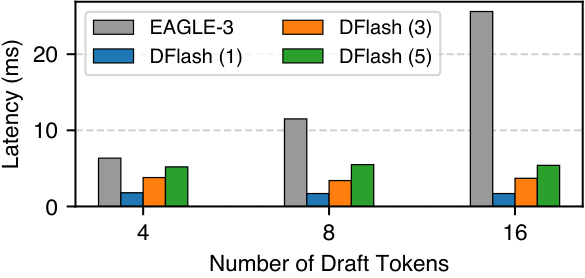
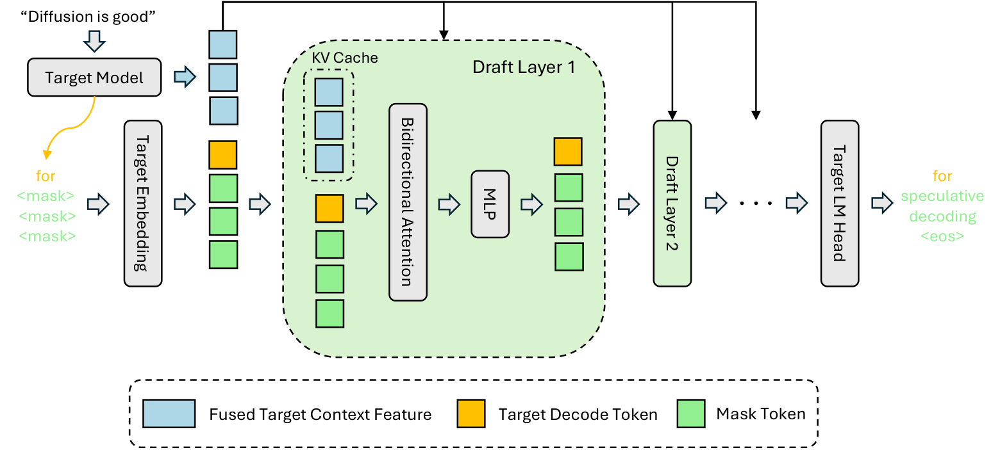
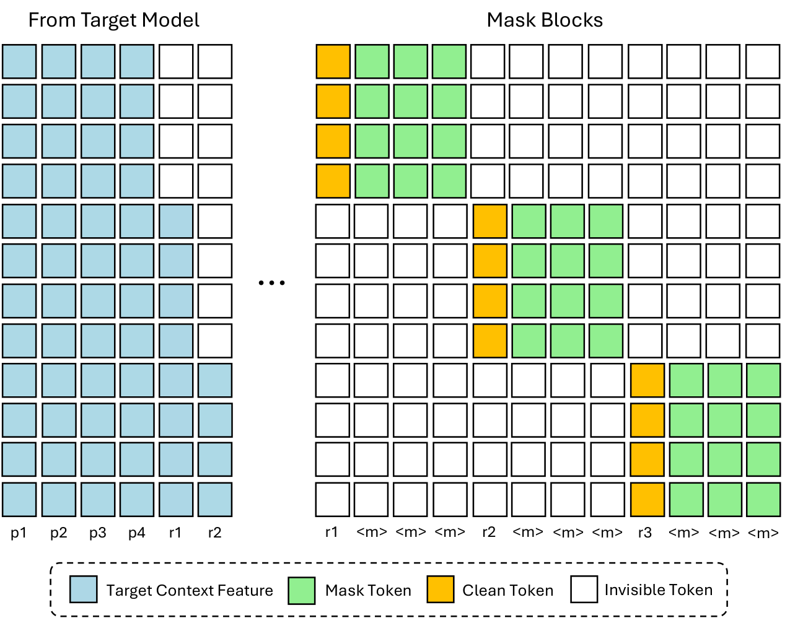
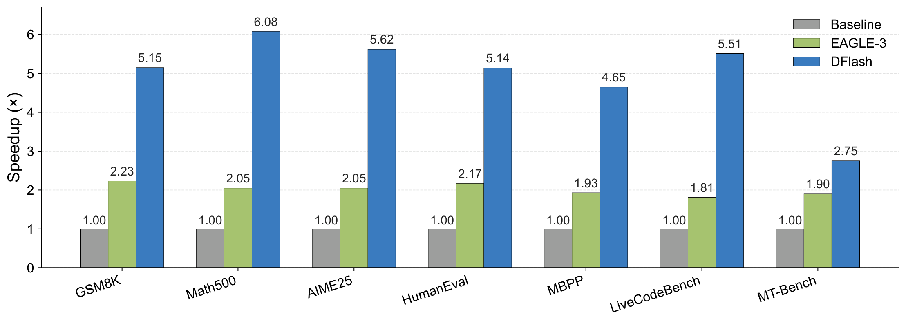
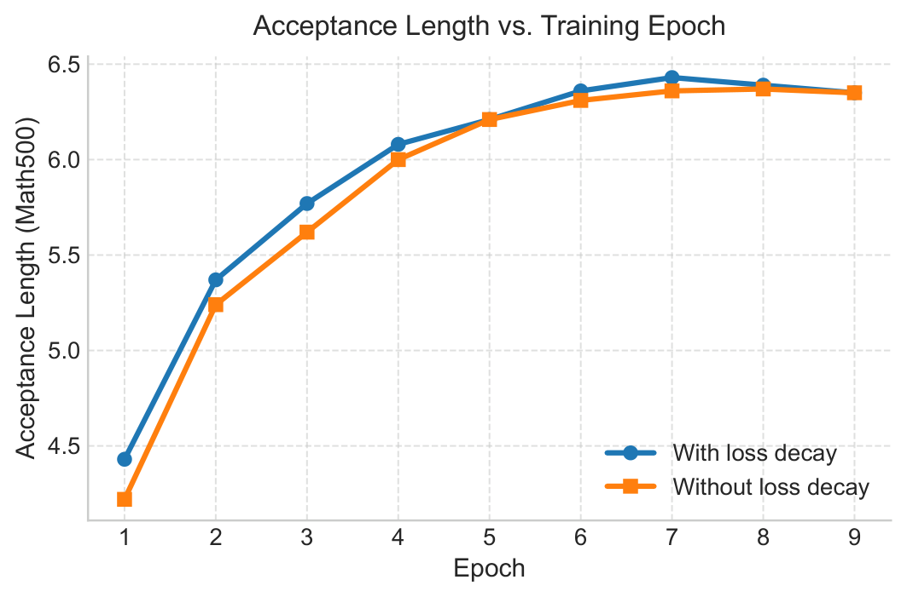

## 0. 资料归档与图像元素

本目录已归档：

- 论文 PDF：`2602.06036v2.pdf`（本地 artifacts 中未保留）
    
- arXiv 摘要页：`arxiv_abs.html`（本地 artifacts 中未保留）
    
- arXiv LaTeX 源码：`source/`（本地 artifacts 中未保留）
    
- 从 LaTeX 源码中抽取的原始 PDF 图：`extracted_figures/`（本地 artifacts 中未保留）
    
- 从原始 PDF 图转换得到的 Markdown 配图 PNG：已复制到本目录的 `assets/`
    
- 官方代码仓库快照：`code/dflash/`（本地 artifacts 中未保留），remote 为 `https://github.com/z-lab/dflash`，当前提交 `94e4abc update model list`
    
- 本分析文件：当前 Markdown 笔记
    

论文与代码链接：

- arXiv: [https://arxiv.org/abs/2602.06036v2](https://arxiv.org/abs/2602.06036v2)
    
- GitHub: [https://github.com/z-lab/dflash](https://github.com/z-lab/dflash)
    
- Hugging Face models: [https://hf.co/collections/z-lab/dflash](https://hf.co/collections/z-lab/dflash)
    
- Project page: [https://dflash.z-lab.ai](https://dflash.z-lab.ai/)
    

已从原始 LaTeX 源码抽取图像，并转换为可在 Markdown 中直接显示的 PNG。正文的关键论证段落已经嵌入对应示意图；PDF 原图也保留，便于后续做 PPT 或高精度复用。

|论文图|PNG 配图|PDF 原图|所在 section|用途|
|---|---|---|---|---|
|Figure 1: speedup comparison|[`png/dflash_speedup.png`](assets/dflash_speedup.png)|`dflash_speedup.pdf`|Introduction|DFlash 与 EAGLE-3 / AR decoding 的总体速度对比|
|Figure 2: inference design|[`png/dflash_inference_design.png`](assets/dflash_inference_design.png)|`dflash_inference_design.pdf`|Preliminaries|目标模型 hidden features 融合并注入 draft KV cache 的推理结构|
|Figure 3: draft latency bar|[`png/draft_latency_bar.png`](assets/draft_latency_bar.png)|`draft_latency_bar.pdf`|Preliminaries|1/3/5 层 DFlash 与 1 层 EAGLE-3 的 draft cost 对比|
|Figure 4: training attention|[`png/dflash_attn.png`](assets/dflash_attn.png)|`dflash_attn.pdf`|Method|训练时 block diffusion attention mask、anchor、mask token、跨 block 隔离|
|Figure 5: acceptance vs epoch|[`png/acceptance_length_vs_epoch.png`](assets/acceptance_length_vs_epoch.png)|`acceptance_length_vs_epoch.pdf`|Appendix|loss decay 对收敛速度和 acceptance length 的影响|

## 1. 论文基本信息

**研究领域。** 该论文属于大语言模型推理加速，具体交叉在 speculative decoding、diffusion language model、LLM serving system 和硬件友好的 decoding 算法。

**核心问题。** 自回归 LLM 解码每次只能生成一个 token，低 batch / 长输出场景下经常受内存带宽和串行依赖限制，GPU 利用率低。Speculative decoding 通过 draft model 先猜多个 token、target model 并行验证来降低平均每 token 延迟，但现有强方法如 EAGLE-3 仍以自回归方式 draft，draft 阶段本身仍串行，且小 draft model 容量不足会使 acceptance length 很快饱和。Diffusion LLM 能并行预测 masked tokens，但独立生成质量通常弱于自回归 LLM，且需要多步 denoising 才能保质量，直接替代 target model 不现实。

**研究目标。** DFlash 试图把 diffusion model 从“独立生成器”重新定位为“speculative drafter”：用小型 block diffusion drafter 在单次 forward 中并行预测一段 future tokens，再由高质量 frozen autoregressive target model 验证，从而同时得到：

- 目标模型分布不变的 lossless decoding；
    
- draft 阶段低延迟和更高 GPU 并行度；
    
- 相比 EAGLE-3 更高的 acceptance length 与端到端 speedup；
    
- 可落地到 Transformers、SGLang、vLLM 等 serving backend。
    

## 2. 核心贡献与创新点

**1. 将 block diffusion 放到 speculative drafting，而不是端到端生成。** 论文的关键判断是：diffusion LLM 独立生成质量不足不是致命问题，因为 speculative decoding 的最终 token 由 target model 验证。这样 diffusion 的并行 denoising 优势被保留，质量风险由 target verification 吸收。

**2. 目标模型 hidden features 作为 draft model 的强条件。** DFlash 不让小 diffusion drafter “从零预测未来 token”。它在 target prefill / verification 中抽取多个 target layers 的 hidden states，拼接后投影为 target context feature，作为 draft model 的条件输入。论文的逻辑链是：target hidden states 含有多 token 预测信息 -> small drafter 只需学习把这些上下文特征转换成 block token proposal -> acceptance length 提升。

**3. KV injection 替代一次性 input fusion。** EAGLE-3 类方法主要把 target features 融到 draft input；DFlash 将融合后的 target features 注入每一层 draft attention 的 Key/Value，并通过 draft KV cache 复用。这样 target information 在每层都可被注意力访问，避免随着 draft depth 加深而被稀释。

**4. 单步 block diffusion draft，draft latency 不随 draft token 数线性增长。** 自回归 draft 的成本近似为 `draft_steps * single_step_latency`；DFlash 在一个 block 内并行预测 masked positions，因此可使用更深 draft model，同时保持 draft latency 较低。论文声称 5-layer DFlash draft 16 tokens 比 EAGLE-3 draft 8 tokens 仍有更低 draft cost，并有更高 acceptance length。

**5. 训练过程对 speculative decoding 场景做了专门对齐。** 论文没有直接照搬标准 block diffusion training，而是引入随机 anchor sampling、跨 block 隔离的稀疏 attention mask、早期 token loss decay、共享且冻结 target embedding / LM head。这些设计都围绕一个目标：提升一个 speculative cycle 中靠前 token 的命中率，因为第一个错误会截断整个 block 的接受长度。

## 3. 研究方法：问题、思路与技术路线

### 3.1 速度模型与设计动机

论文在 Preliminaries 中采用 speculative decoding 的平均 per-token latency：

$$  
L = \frac{T_{\text{draft}} + T_{\text{verify}}}{\tau},  
$$

  

其中：

- T_{\text{draft}}：每个 speculative cycle 的 draft 时间；
    
- T_{\text{verify}}：target model 并行验证 draft block 的时间；
    
- \tau \in [1,\gamma+1]：每个 cycle 平均接受 token 数，包括 target 产生的 bonus token；
    
- speedup 为
    

$$  
\eta = \frac{L_{\text{target}}}{L}.  
$$

  

由此直接推出 DFlash 的优化方向：要么降低 T_{\text{draft}}，要么提高 \tau。自回归 draft 的成本为：

$$  
T_{\text{draft}} = \gamma \cdot t_{\text{step}},  
$$

  

而 block diffusion draft 近似为：

$$  
T_{\text{draft}} = t_{\text{parallel}}.  
$$

  

因此，DFlash 的方法不是单纯“让 draft model 更准”，而是同时改变两个变量：通过 block diffusion 降低 draft 串行成本，通过 target hidden conditioning 提高 $\tau$。

图 3 对应这一段的关键证据：DFlash 用 block diffusion 后，draft cost 不随 draft token 数按自回归方式线性累积，因此即使 draft model 加深到 3 或 5 层，仍能保持低 draft latency。它支撑的不是最终准确率结论，而是“DFlash 有空间使用更强 drafter 而不把 draft 阶段拖慢”的系统假设。

### 3.2 推理流程

DFlash 的一个 decoding cycle 可以拆成以下步骤。

这张图对应 DFlash 推理主路径：target model 先给出 token 与 hidden context features；这些 features 经过融合后进入 draft model 的 KV cache；draft model 对 masked block 并行出 proposal；target model 再并行 verify。理解 DFlash 时要抓住图中的两个方向：横向是 speculative decoding cycle，纵向是 target features 被注入每层 draft attention。

**Step 1: target prefill / verification 输出 hidden features。** 对输入 prompt，target model 标准 prefill 并生成第一个 token；同时从若干 target layers 抽取 hidden states。论文实验中通常从第 2 层到倒数第 3 层之间均匀选 5 层。

**Step 2: 多层 hidden states 融合。** Appendix 中给出 KV injection 前的融合公式：

$$  
\mathbf{H}_{t} = \mathrm{RMSNorm} \left( W_c[\mathbf{H}^{(l_1)};\ldots;\mathbf{H}^{(l_5)}] \right).  
$$

  

其中 W_c 将拼接后的多层 target hidden states 投影回 draft hidden dimension。

**Step 3: draft block 构造。** Draft block 的第一个 token 是干净 anchor token，后面 b-1 个位置是 mask token。DFlash 使用 target embedding layer 将这些 token 转成 embedding，并由小型 draft Transformer 在单次 forward 中预测后续 b-1 个 token。

**Step 4: KV injection。** 在 draft layer i，draft token 产生 query；target context feature 和 draft token 一起产生 key/value：

$$  
\begin{aligned} \mathbf{Q}_i &= W_i^Q \mathbf{H}_d, \\ \mathbf{K}_i &= [W_i^K \mathbf{H}_t;\, W_i^K \mathbf{H}_d]_{\mathrm{seq}}, \\ \mathbf{V}_i &= [W_i^V \mathbf{H}_t;\, W_i^V \mathbf{H}_d]_{\mathrm{seq}}. \end{aligned}  
$$

  

注意这里 target features 不经过 draft 的 Q projection、output projection 和 FFN，而是作为额外 KV entries 被每一层 draft attention 使用。

**Step 5: target parallel verification。** Target model 对整段 draft block 并行算 posterior token。若 draft token 与 target posterior token 连续一致，则接受；遇到第一个不一致位置后，使用 target posterior token 作为 bonus token，进入下一个 cycle。可写为：

$$  
a = \sum_{j=1}^{b-1} \prod_{k=1}^{j}\mathbb{1}[d_k=\hat{y}_k],  
$$

  

其中 a 是被接受的 draft token 数，单 cycle 贡献 a+1 个 token，后面的 +1 是 target 的 bonus token。因此实验报告的$\tau$对应平均 a+1。
### 3.3 训练设计

论文 Method 的训练设计围绕“推理时会发生什么”来做对齐：

图 4 是训练部分最重要的示意图。蓝色 target context features 是条件信息；黄色 clean response tokens 是随机采样的 anchors；绿色 mask tokens 是 block 内要并行预测的位置；白色 invisible tokens 表示 attention mask 隔离跨 block 信息。它说明 DFlash 的训练不是普通 next-token LM，也不是标准全序列 diffusion，而是把多个 speculative draft blocks 拼在一起，用稀疏 mask 一次训练多个局部 denoising 任务。

- **Target frozen。** Draft model 学习匹配 frozen autoregressive target model 的 block-level diffusion prediction。
    
- **Random anchor sampling。** 不固定划分 response blocks，而是在 response 中随机采样 anchor tokens，每个 anchor 作为 block 第一个 token，后续位置 masked。这样更贴近推理时“上一轮 target bonus token 作为新 anchor”的行为。
    
- **Sparse attention / Flex Attention。** 多个 sampled blocks 拼到一个 sequence 中训练；同一 block 内可双向 attention，跨 block 不可见，防止信息泄露。
    
- **Loss decay。** 对 block 内第 k 个位置使用指数衰减权重：
    

$$  
w_k = \exp\!\left(-\frac{k-1}{\gamma}\right).  
$$

  

逻辑是 speculative decoding 中早期 token 更重要：第 1 个错误会导致后续 draft token 全部不能被接受。

- **共享 embedding 和 LM head。** Draft model 共享 target token embedding 和 LM head，并保持 frozen；只训练 draft Transformer 层，使 draft 更像目标模型表示空间上的 lightweight diffusion adapter。
    

### 3.4 实验设计

数据和设置主要来自 Experiments 与 Appendix：

- **Target models：** LLaMA-3.1-Instruct-8B，Qwen3-4B，Qwen3-8B，Qwen3-Coder-30B-A3B-Instruct；Appendix 还报告 Qwen3.5、Qwen3-Coder-Next、GPT-OSS 等更多模型。
    
- **训练数据：** 约 800K samples，来自 NVIDIA Nemotron Post-Training Dataset V2 与 CodeAlpaca；论文强调使用 target model 生成 response 以提升 target alignment。
    
- **主评测任务：** Math: GSM8K、MATH/MATH-500、AIME25；Code: HumanEval、MBPP、LiveCodeBench；Chat: MT-Bench、Alpaca。
    
- **硬件：** 主实验为 NVIDIA H200；SGLang serving 实验为单 B200 + FA4 backend；LLaMA-3.1 SGLang 实验为单 B200 + Flashinfer。
    
- **Baselines：** autoregressive decoding 与 EAGLE-3。论文没有与 DiffuSpec、SpecDiff-2、TiDAR 等 diffusion-based speculative decoding 方法实测对比，理由是缺少开源实现。
    

## 4. 关键结论与证据链

### 4.1 主结论：DFlash 显著提升 Qwen3 non-thinking 解码速度

数据来源：Experiments / `tab:main-results`，Qwen3 models，thinking disabled，Transformers backend，最大生成 2048 tokens。

图 1 是论文主张的视觉摘要：在 Qwen3-8B + Transformers backend 上，DFlash 在多个任务上显著高于 EAGLE-3。图只展示速度结果，真正解释原因需要结合下表的 \tau：DFlash 不只是 draft 快，还把平均接受长度从 EAGLE-3 的约 3 提升到约 5.5-6.5。

|Model / Temp|EAGLE-3(16) avg speedup / \tau|EAGLE-3(60) avg speedup / \tau|DFlash(16) avg speedup / \tau|
|---|---|---|---|
|Qwen3-4B, temp=0|1.81x / 3.05|2.08x / 3.48|**4.91x / 6.54**|
|Qwen3-8B, temp=0|1.76x / 2.96|2.02x / 3.40|**4.86x / 6.49**|
|Qwen3-4B, temp=1|1.72x / 2.95|1.93x / 3.36|**4.24x / 5.69**|
|Qwen3-8B, temp=1|1.68x / 2.83|1.88x / 3.26|**4.03x / 5.48**|

**导出逻辑。** EAGLE-3(60) 增大 tree size 后 \tau 只从约 3 提到约 3.3-3.5，speedup 仍约 2x，说明自回归 tree drafting 与 verification overhead 限制明显。DFlash 的 \tau 提到约 5.5-6.5，同时 draft block 并行，因而 speedup 到 4-5x。这个结果同时支持论文两个假设：target-feature conditioning 提高 draft quality；block diffusion 降低 draft latency。

### 4.2 Reasoning mode 仍有较高收益

数据来源：Experiments / `tab:reasoning-results`，Qwen3 thinking mode enabled，Transformers backend。

|Model / Temp|GPQA speedup / \tau|MATH-500 speedup / \tau|AIME25 speedup / \tau|
|---|---|---|---|
|Qwen3-4B, temp=0|4.23x / 5.23|4.59x / 5.74|4.39x / 5.54|
|Qwen3-4B, temp=1|3.67x / 4.55|3.93x / 4.89|3.64x / 4.68|
|Qwen3-8B, temp=0|4.17x / 5.17|4.64x / 5.82|4.51x / 5.74|
|Qwen3-8B, temp=1|3.75x / 4.65|4.03x / 5.06|3.70x / 4.69|

**导出逻辑。** Reasoning traces 通常输出更长，串行 decode 成本更突出；DFlash 在 reasoning mode 仍保持 \tau\approx 4.5-5.8，因此端到端 speedup 约 3.6-4.6x。该证据说明 DFlash 不只适用于短回答或固定格式任务，也适用于长 CoT 解码。

### 4.3 Serving backend 中收益真实存在，但高并发下下降

数据来源：Experiments / `tab:sglang-all`，SGLang，单 B200，FA4 backend，concurrency 1/4/8/16/32。

典型结果：

- Qwen3-8B / Math500：baseline 230 tok/s at concurrency 1，DFlash 1175 tok/s，5.1x；concurrency 32 时 baseline 5694 tok/s，DFlash 16076 tok/s，2.8x，\tau=8.01。
    
- Qwen3-8B / HumanEval：concurrency 1 为 4.2x，concurrency 32 为 2.4x，\tau=6.50。
    
- Qwen3-Coder-30B-A3B / HumanEval：concurrency 1 为 3.5x，concurrency 32 为 3.1x，\tau=8.09。
    

**导出逻辑。** 低并发时 target autoregressive decoding 更接近 latency / memory-bound，DFlash 用较大的 parallel verification block 提高 GPU 利用率，所以 speedup 最大。高并发时 baseline 本身吞吐上升、target verification 更 compute-bound，DFlash 的相对 speedup 下降。这说明 DFlash 是有效 serving 优化，但不是在所有 batch/concurrency regime 下都固定 5-6x。

### 4.4 LLaMA-3.1 上也优于 EAGLE-3，但增益低于 Qwen3 主实验

数据来源：Experiments / `tab:dflash_vs_eagle3_llama31_acc`，LLaMA-3.1-8B-Instruct，SGLang，单 B200，DFlash block size 10。

- GSM8K：DFlash concurrency 1/32 为 2.4x/1.6x，\tau=4.32；EAGLE-3(10) 为 1.6x/1.0x，\tau=3.49；EAGLE-3(60) 为 1.9x/0.6x，\tau=4.55。
    
- HumanEval：DFlash concurrency 1/32 为 2.8x/1.8x，\tau=4.91。
    
- Alpaca：DFlash concurrency 1/32 为 2.2x/1.4x，\tau=3.73。
    

**导出逻辑。** DFlash 在 LLaMA 上仍优于 EAGLE-3，但 speedup 明显低于 Qwen3 的 4-6x。原因可能包括 block size 更小、模型/数据对齐差异、backend 设置不同，以及 \tau 较低。该结果支持“方法可迁移”，但也提示每个 target family 都需要重新训练并调参。

### 4.5 消融验证：每个关键设计都有贡献

**无 target features 的 naive diffusion drafter 不够强。** 数据来源：Appendix / `tab:naive_diffusion`。5-layer block diffusion drafter 如果不接 target context features，在 math benchmarks 上 speedup 大多约 2.65-3.73x，\tau 约 3.23-4.61。这个结果低于主结果的 \tau\approx 5.5-6.5，说明 block diffusion parallelism 只能解决 latency，不能单独解决 draft quality。

**Draft layers 增加会提升 \tau，但 5 层速度最好。** 数据来源：Experiments / `tab:ablation_draft_layers`。3/5/8 层在 Math500 上 \tau=5.64/5.99/6.33，但 speedup 为 4.69x/4.71x/4.64x。8 层质量更高但 draft latency 更高，5 层是质量和成本的折中点。

**更多 target hidden features 有收益。** 数据来源：Experiments / `tab:ablation_target_hiddens`。3-H 到 5-H 在 Math500 上从 4.49x/\tau=5.38 提升到 4.69x/\tau=5.64，HumanEval 从 3.80x/\tau=4.47 提升到 3.90x/\tau=4.61。这直接支持“target hidden feature 是质量来源”的主张。

**Block size 训练/推理存在非对称泛化。** 数据来源：Experiments / `tab:ablation_block_size`。b16->b16 在 Math500 / HumanEval 上为 4.64x/\tau=6.33、3.96x/\tau=5.29，优于 b8->b8。b16 训练的模型能较好退化到 b8 推理，但 b8 训练的模型泛化到 b16 较差。这支持未来做 adaptive block-size scheduling。

**KV injection 优于 input fusion。** 数据来源：Experiments / `tab:ablation_kv_injection`。在 block-diffusion drafting 下，DFlash input fusion 到 KV injection：

- GSM8K：3.5/2.9x -> 4.2/3.3x；
    
- HumanEval：3.5/2.9x -> 4.0/3.2x；
    
- MT-Bench：2.6/2.0x -> 3.0/2.2x。
    

这说明目标特征持续作为每层 KV 被访问，比只在输入层融合更有效。

**随机 anchor sampling 和 loss decay 改善训练。** 数据来源：Appendix / `tab:ablation_sample_block` 与 Figure 5。随机 anchor sampling 相比 standard block construction，在 Math500 从 4.13x/\tau=4.94 提升到 4.69x/\tau=5.64，HumanEval 从 3.29x/\tau=3.86 提升到 3.90x/\tau=4.61。loss decay 图显示更快、更好的 convergence。二者共同证明训练目标确实应按 speculative acceptance 机制重写，而不是直接套标准 diffusion objective。

图 5 对应上面的 loss decay 结论。它表达的是训练动态，而不是最终 benchmark speedup：对 block 内靠前位置加更高权重后，acceptance length 更快上升，最终也更高。原因和 speculative verification 的截断机制一致：越早出错，后续 token 越没有机会被接受。

### 4.6 长上下文适配：可行但需要轻量 fine-tuning

数据来源：Experiments / `tab:long-context`。基础 Qwen3.5-27B drafter 在超过 4K context 后 acceptance length 下降；用 LongAlign-10K 的 1.6K samples fine-tune 3 epochs 后明显改善：

- hotpotqa 16K：3.61 -> 6.05；
    
- qasper 16K：3.57 -> 6.00；
    
- gov_report 32K：2.09 -> 3.56。
    

**导出逻辑。** Target hidden features 在长上下文仍有可用信息，但 draft model 需要见过长上下文模式才能稳定利用这些信息。DFlash 的长上下文能力不是零成本泛化，而是低数据量适配。

## 5. Related Work 对比

|方法线|代表工作|优点|局限|DFlash 的区别|
|---|---|---|---|---|
|标准 speculative decoding|Leviathan et al. 2023|理论上 lossless，工程简单|小 draft model 自回归生成，draft latency 随 token 数线性增长|用 block diffusion 单步并行 draft|
|Multi-head / tree decoding|Medusa|不需要外部 draft model，多个 head 并行预测|head 容量有限，tree verification overhead 明显|使用独立轻量 diffusion adapter，target hidden 强条件|
|Feature-level speculative decoding|EAGLE/EAGLE-2/EAGLE-3|利用 frozen target feature，提高 acceptance|仍是自回归/tree draft；target feature 多为 input fusion，深层信息可能稀释|KV injection 到每个 draft layer；block 内并行预测|
|Standalone diffusion LLM|LLaDA、Block Diffusion、Fast-dLLM v2、SDAR|masked tokens 并行生成，可双向建模|端到端质量弱于强 AR LLM；多步 denoising 降低速度；KV cache 支持弱|不独立生成最终答案，只做 proposal，target verification 保证最终输出|
|Diffusion-style parallel drafter|PARD|低成本 parallel draft adaptation|小模型缺 target 内部表示，接受长度有限|用 target hidden features 作为核心信息源|
|利用 AR hidden 的未来预测潜力|Your LLM Knows the Future|证明 AR hidden states 含多 token 信息，可用 LoRA 做并行 draft|仍依赖原模型/adapter 方案，系统目标不同|将该现象系统化为 target-conditioned diffusion drafter|
|Diffusion-based speculative decoding|DiffuSpec、SpecDiff-2|大 diffusion drafter 可给较长 proposal|常用 7B 级 drafter，内存和 draft latency 高|小型 5/8 层 drafter，依赖 target features 补质量|
|Diffusion + AR 混合生成|TiDAR|“think in diffusion, talk in AR” 的范式有启发|论文 related work 称最终生成质量尚非 lossless|DFlash 由 target verification 保证 lossless speculative decoding|

务实判断：DFlash 的真正定位不是“diffusion LLM 终于替代 AR LLM”，而是“diffusion 的并行预测特性在 speculative decoding 这个受验证保护的子任务中更实用”。

## 6. Infra 需求分析

### 6.1 算力需求

DFlash 的理论 speedup 来自：

$$  
\eta = \frac{L_{\text{target}}}{(T_{\text{draft}} + T_{\text{verify}})/\tau}.  
$$

  

要落地，必须同时满足：

$$  
T_{\text{draft}} + T_{\text{verify}} < \tau \cdot L_{\text{target}}.  
$$

  

Draft 端可粗略写为单层成本：

$$  
F_{\text{draft-layer}} \approx F_{\text{proj}}(b,D) +F_{\text{mlp}}(b,D,D_{\text{ff}}) +F_{\text{ctx-kv}}(c,D) +F_{\text{attn}}(b,c,D),  
$$

  

其中 b 为 block size，c 为 target context feature length，D 为 hidden size。若用 gated MLP，主要项可近似为：

$$  
F_{\text{draft-layer}} \approx 4bD^2 + 3bDD_{\text{ff}} + 2cD^2 + 2b(c+b)D.  
$$

  

这里 2cD^2 来自 target context 的 K/V projection，2b(c+b)D 是 attention score/value 聚合量级。实际常数会随 GQA、FlashAttention 实现和 FLOP 计数口径变化。

关键 infra 含义：

- DFlash draft 是小模型，但不是零成本；如果 target context 很长，context KV projection 与 attention 也会增长。
    
- 单步 block draft 增加了每次 forward 的 token 并行度，低并发场景能明显提高 GPU utilization。
    
- 高并发时 target verification 本身变成 compute-bound，增大 block size 会增加 verification tokens，speedup 会下降；论文 SGLang 高并发结果已经体现这一点。
    

### 6.2 显存与存储

**额外参数内存。** Appendix 给出 DFlash 额外投影矩阵：

$$  
W_c \in \mathbb{R}^{D \times 5D}.  
$$

  

BF16 权重大小：

$$  
M(W_c) = 5D^2 \times 2\ \text{bytes}.  
$$

  

论文例子 D=2048：

$$  
5 \times 2048 \times 2048 \times 2 = 41{,}943{,}040\ \text{bytes} \approx 40\ \text{MiB} \approx 42\ \text{MB}.  
$$

  

这相对 70 GB 级 target model 很小。

**训练离线 hidden cache。** 如果离线缓存 target hidden states，原始存储量为：

$$  
M_{\text{hidden-cache}} = N \times S \times K \times D \times s,  
$$

  

其中 N 是样本数，S 是最大 sequence length，K 是抽取 target layers 数，D 是 hidden size，s 是每元素字节数。按论文 800K samples、S=3072、K=5、BF16 s=2 粗估：

- 若 D=4096：约 100.7 TB decimal，约 91.6 TiB；
    
- 若 D=2048：约 50.3 TB decimal，约 45.8 TiB。
    

因此离线训练会对存储和数据加载带宽提出很高要求；在线计算可省存储，但训练算力更高。

**运行时 activation overhead。** Appendix 给出 batch size 1、sequence length 2048、K=5、D=2048、BF16：

$$  
M_{\text{proj-input}} = 1 \times 2048 \times 5 \times 2048 \times 2 \approx 40\ \text{MiB},  
$$

  

$$  
M_{\text{proj-output}} = 1 \times 2048 \times 2048 \times 2 \approx 8\ \text{MiB}.  
$$

  

论文还称 decoding block size 16 时 temporary activation 低于 400 KB。也就是说推理时主要新增显存不是 W_c，而是 draft model weights、draft KV cache、以及框架为 hidden extraction / verification 保留的中间状态。

**Draft KV cache overhead。** target context 被作为每层 draft KV entries 存储时，可按下式估计：

$$  
M_{\text{draft-KV-ctx}} = L_d \times B \times C \times 2 \times H_{\text{kv}} \times d_{\text{head}} \times s,  
$$

  

其中 L_d 是 draft layers，B 是 batch size，C 是上下文长度，H_{\text{kv}}d_{\text{head}} 是 GQA 后的 KV hidden width。因为 L_d 只有 5 或 8，通常远小于 target KV cache，但在长上下文、高 batch、多并发 serving 下仍需要纳入 capacity planning。

### 6.3 内存带宽

低 batch decode 通常受权重读取和 KV cache 读写限制。可以用每输出 token 平均权重读近似理解：

自回归 target baseline：

$$  
B_{\text{per-token}}^{\text{AR}} \approx B_{\text{target-weights}} + B_{\text{target-KV}}.  
$$

  

自回归 speculative draft：

$$  
B_{\text{per-cycle}}^{\text{AR-draft}} \approx B_{\text{target-verify}} + \gamma B_{\text{draft-weights}} + B_{\text{KV}}.  
$$

  

DFlash：

$$  
B_{\text{per-cycle}}^{\text{DFlash}} \approx B_{\text{target-verify}} + B_{\text{draft-weights}} + B_{\text{draft-KV-inject}} + B_{\text{KV}}.  
$$

  

每 token 再除以 \tau。关键差异是 DFlash 不需要为 \gamma 个 draft tokens 串行读取 \gamma 次 draft weights；它把 block tokens 合并到一次 forward，提升矩阵乘法的算术强度。

### 6.4 互联与组网

论文主结果多为单 H200/B200，因此没有系统评估多机多卡互联。但从算法形态可推出以下需求。

**同卡部署更简单。** 若 target 与 draft 在同一 GPU 或同一 tensor-parallel group，target hidden features 可本地传给 draft，避免跨设备传输。

**target/draft 分离部署时 hidden transfer 不大但频繁。** 每 cycle 传输 target hidden features 的上界可估为：

$$  
M_{\text{transfer}} = B \times b \times K \times D \times s.  
$$

  

例如 B=1、b=16、K=5、D=4096、BF16：

$$  
1 \times 16 \times 5 \times 4096 \times 2 = 655{,}360\ \text{bytes} \approx 0.625\ \text{MiB}.  
$$

  

单次不大，但 cycle 频繁，且延迟敏感；跨 PCIe 或跨节点 RPC 会吃掉低延迟收益。生产部署更适合让 draft adapter 与 target colocate，或至少使用 NVLink/NVSwitch 级互联。

**Tensor parallel / MoE 会放大同步需求。** Target verification 对 block tokens 并行计算，TP all-reduce 的消息形态从单 token 变成 block tokens；MoE target 还可能触发 expert all-to-all。DFlash 能减少 cycle 数，但每 cycle 的 target verify 更“宽”，需要 serving scheduler 正确 overlap。

### 6.5 新算子与框架需求

DFlash 对 infra 的主要要求不是新硬件，而是 decoding path 上的定制调度与 attention 支持：

- **KV injection attention。** 需要高效支持 `[target-context KV; draft-token KV]` 拼接后的 attention，以及 cache crop/rollback。
    
- **Block verification scheduler。** Target 每轮验证一个 block，并根据 acceptance length 裁剪 target KV cache；框架需要避免频繁同步和 Python overhead。
    
- **Sparse training attention。** 论文训练使用同 block bidirectional、跨 block 不可见的稀疏 mask，并提到 Flex Attention。
    
- **Serving backend 集成。** README 显示 SGLang 需要 DFLASH speculative algorithm、draft attention backend FA4、Spec-v2 schedule overlap；vLLM v0.20.1+ 包含 core DFlash support，但部分模型仍依赖特定 PR/branch。
    
- **可优化 fused ops。** 适合进一步融合：target hidden concat + W_c projection + RMSNorm；context K/V projection + cache update；draft logits sampling + verify compare；accepted-length scan + KV crop。
    

## 7. 开源代码对照分析

### 7.1 仓库状态

官方仓库：`https://github.com/z-lab/dflash`。本地快照提交为 `94e4abc update model list`，许可证 MIT。

README 明确写到 “training recipe soon”，因此当前开源内容主要覆盖 inference、benchmark、Transformers/MLX wrapper 与 serving 使用说明，不包含论文训练 recipe 的完整实现。也就是说，随机 anchor sampling、Flex Attention training mask、loss decay 等训练细节只能从论文源码核对，当前 GitHub 仓库不能直接复现训练过程。

### 7.2 与论文一致的实现点

**target layer 均匀选择与 hidden concat。** `dflash/model.py` 中 `build_target_layer_ids` 从 shallow 到 deep 选择 target layers，`extract_context_feature` 拼接 hidden states。对应论文 Method 中“uniformly sampled target layers”。代码位置：

- GitHub: [https://github.com/z-lab/dflash/blob/94e4abc/dflash/model.py#L27-L45](https://github.com/z-lab/dflash/blob/94e4abc/dflash/model.py#L27-L45)
    
- 本地：`code/dflash/dflash/model.py`（本地 artifacts 中未保留）
    

**推理时 target prefill、抽 hidden、生成第一个 token。** `dflash_generate` 在 prefill 中调用 target，设置 `output_hidden_states=block_size > 1`，并将 target logits 采样结果作为第一个 token。对应论文 Inference pipeline。代码位置：

- [https://github.com/z-lab/dflash/blob/94e4abc/dflash/model.py#L86-L100](https://github.com/z-lab/dflash/blob/94e4abc/dflash/model.py#L86-L100)
    

**block diffusion draft。** 每轮构造 `block_output_ids`，mask-filled output buffer 中第一个 token 为 anchor，后续位置由 draft logits 一次性采样填入。代码中 `target.model.embed_tokens(block_output_ids)` 体现共享 target embedding，`target.lm_head(model(...))` 体现共享 target LM head。代码位置：

- [https://github.com/z-lab/dflash/blob/94e4abc/dflash/model.py#L107-L121](https://github.com/z-lab/dflash/blob/94e4abc/dflash/model.py#L107-L121)
    

**KV injection。** `Qwen3DFlashAttention.forward` 对 draft hidden 做 Q，对 target_hidden 和 draft hidden 分别做 K/V，然后按 sequence 维拼接。对应 Appendix 的公式。代码位置：

- [https://github.com/z-lab/dflash/blob/94e4abc/dflash/model.py#L211-L238](https://github.com/z-lab/dflash/blob/94e4abc/dflash/model.py#L211-L238)
    

**target verification 与 acceptance length。** target 对 `block_output_ids` 做 forward，posterior sampled 后，代码用连续相等的 token 数计算 accepted draft tokens，再写入 target posterior bonus token。代码位置：

- [https://github.com/z-lab/dflash/blob/94e4abc/dflash/model.py#L126-L143](https://github.com/z-lab/dflash/blob/94e4abc/dflash/model.py#L126-L143)
    

**benchmark 统计方式。** `benchmark.py` 用 baseline 与 DFlash 的 time-per-output-token 比值得到 speedup，并统计 average acceptance length。代码位置：

- [https://github.com/z-lab/dflash/blob/94e4abc/dflash/benchmark.py#L120-L132](https://github.com/z-lab/dflash/blob/94e4abc/dflash/benchmark.py#L120-L132)
    

### 7.3 与论文不完全一致或不明确的地方

**训练代码未开源。** README 当前称会在未来开源 training recipe。论文训练设计无法从仓库验证，包括 anchor sampling、loss decay、Flex Attention sparse mask、offline hidden cache pipeline。

**Transformers backend 支持范围有限。** README 写明 Transformers backend 只支持 Qwen3 和 LLaMA-3.1；更多模型依赖 SGLang/vLLM/MLX。论文的 serving 结果与当前仓库 README 中更新后的模型列表不完全一一对应，可能因为仓库在论文后继续扩展。

**随机采样 verification 的细节论文没有展开。** 代码在 `temperature > 0` 时分别从 draft logits 和 target logits sample，然后以 token equality 决定 acceptance。该过程可保持输出 token 来自 target posterior，但论文没有详细说明与标准 speculative sampling acceptance-ratio 形式的关系。

**性能关键路径分散在外部 backend。** README 显示 SGLang 使用 PR branch，vLLM v0.20.1+ 有 core DFlash support，部分模型还需要特定 vLLM PR。仓库本身不能完整体现论文 SGLang FA4 / Spec-v2 scheduling overlap 的底层实现。

## 8. 优点与局限

### 优点

- **问题切入务实。** 不试图证明 diffusion LLM 独立生成比 AR 更强，而是把 diffusion 的并行性放到 speculative drafting 这个更适合的位置。
    
- **方法和 speedup 公式一致。** Block diffusion 降 T_{\text{draft}}，target feature conditioning 提 \tau，二者都能从 latency model 直接解释。
    
- **关键设计有消融支撑。** 无 target feature、target hidden 数、draft depth、block size、KV injection、anchor sampling、loss decay 都有对应实验。
    
- **工程落地意识强。** 论文报告 SGLang/B200、vLLM appendix、并发吞吐，不只给离线 Transformers latency。
    
- **额外参数较小。** W_c 约 40 MiB 级；draft model 比 7B diffusion drafter 轻得多。
    

### 局限

- **训练 recipe 未开源。** 当前 GitHub 无法复现训练核心设计，这限制了第三方验证和迁移到新 target model。
    
- **每个 target / mode 基本都要专门训练。** README 也提示 Qwen3-4B/8B draft 未用 thinking traces 训练，启用 thinking 会性能不佳；这说明 draft 与 target 输出分布高度绑定。
    
- **与 diffusion-based baselines 缺少实测。** 论文未对 DiffuSpec、SpecDiff-2、TiDAR 等做实验对比，理由是缺少开源实现；因此 related work 的部分比较主要是定性和基于报告数字。
    
- **高并发 speedup 会下降。** SGLang 表显示 concurrency 32 下 speedup 明显低于 concurrency 1；部署需要动态 block size / scheduling，否则大 block verification 可能在 compute-bound 区间不划算。
    
- **长上下文需要额外适配。** Base drafter 在超过 4K 后 acceptance length 下降，需要少量 long-context fine-tuning。
    
- **隐藏状态缓存训练成本高。** 若离线缓存 target hidden states，原始存储可能达到数十 TB 到百 TB 量级。
    
- **框架集成复杂。** 需要 hidden state extraction、draft KV injection、verification cache crop、scheduler overlap、定制 attention backend；不是简单加载一个小模型就能稳定复现论文速度。
    

## 9. 研究启发与可延伸方向

**1. 把强模型 hidden states 作为“可复用未来信息”。** DFlash 证明 target hidden states 不只是中间表示，也可以作为加速器的条件信号。后续可研究动态选择 target layers、压缩 hidden features、只传低秩 context feature。

**2. Draft model 可以是任务化 adapter，而不是通用小模型。** 与训练小 AR draft model 相比，DFlash 更像 target model 的 decoding adapter。这个思路可扩展到 retrieval-augmented decoding、tool-call drafting、structured output drafting。

**3. Adaptive block size 是自然下一步。** 论文已观察 b16 训练可较好泛化到 b8 推理，高并发下大 block verification 可能不划算。可设计 scheduler 按 batch size、KV cache pressure、acceptance histogram 动态选择 block size。

**4. 训练目标应直接优化 acceptance length。** Loss decay 的启发是：生成质量指标不是 token 平均 CE，而是“第一个错误出现得多晚”。后续可尝试 listwise / survival-style objective、expected accepted length surrogate loss。

**5. Infra 上值得做 fused KV-injection kernels。** 当前算法有明确的数据流：target hidden concat -> projection -> per-layer K/V -> attention -> LM head -> verify compare。将这些环节融合或图编译，对低 latency serving 很关键。

**6. 多模态或代码模型也可用同范式。** 只要 target hidden states 对未来输出有强预测信息，block proposal + target verification 都可能成立。代码生成尤其适合，因为局部结构强、acceptance length 可能更长。

## 11. 当前开源 DFlash 草稿模型结构规格补充

数据来源：官方 README 的 Supported Models 列表、Hugging Face 各 `z-lab/*-DFlash` 仓库的 `config.json` 与文件元数据。只下载配置文件和元数据，未下载 safetensors 权重。仓库已刷新到 `94e4abc update model list`，README 当前列出 20 个 draft 模型。

### 11.1 结构共性

从可读取的 17 个配置看，当前公开 DFlash draft 基本都沿用同一类 `DFlashDraftModel`，`model_type` 标为 `qwen3`，但并不表示 target 都是 Qwen；它更多是复用 Qwen3 风格的 decoder block 实现。共同结构是：

- 小型 decoder-only Transformer drafter，层数通常 5、6 或 8 层。
    
- 使用 target hidden states 的若干层作为条件，`target_layer_ids` 通常为 5、6 或 8 个。
    
- 多数模型 block size 为 16；LLaMA3.1 为 10，GPT-OSS-20B 为 8，GPT-OSS-120B 为 10，Kimi-K2.5 为 8。
    
- 大部分新模型使用 sliding-window draft attention：前几层 `sliding_attention`，最后 1 层 `full_attention`；早期 Qwen3 / LLaMA / GPT-OSS / Kimi-K2.5 配置是全 full attention。
    
- `mask_token_id` 随 target tokenizer 不同而变化；这是 block diffusion 中 masked positions 的输入 token。
    

### 11.2 规格总表

|Target model|HF draft repo|L|D|FFN|Heads/KV|Block|Attention|SW|Target hidden ids|Weights|粗估 core params|
|---|---|---|---|---|---|---|---|---|---|---|---|
|gemma-4-31B-it|[z-lab/gemma-4-31B-it-DFlash](https://huggingface.co/z-lab/gemma-4-31B-it-DFlash)|5|5376|10752|64/8|16|4 SWA + 1 full|2048|[1,12,23,35,46,57] / 60|2.86 GiB/1 file|1.54B|
|gemma-4-26B-A4B-it|[z-lab/gemma-4-26B-A4B-it-DFlash](https://huggingface.co/z-lab/gemma-4-26B-A4B-it-DFlash)|5|2816|5632|32/8|16|4 SWA + 1 full|2048|[1,6,11,17,22,27] / 30|0.80 GiB/1 file|0.43B|
|Kimi-K2.5|[z-lab/Kimi-K2.5-DFlash](https://huggingface.co/z-lab/Kimi-K2.5-DFlash)|6|7168|18432|64/8|8|6 full|-|[1,12,24,35,47,58] / 61|6.48 GiB/2 file|3.48B|
|Qwen3.6-27B|[z-lab/Qwen3.6-27B-DFlash](https://huggingface.co/z-lab/Qwen3.6-27B-DFlash)|5|5120|17408|32/8|16|4 SWA + 1 full|2048|[1,16,31,46,61] / 64|3.22 GiB/1 file|1.73B|
|Qwen3.6-35B-A3B|[z-lab/Qwen3.6-35B-A3B-DFlash](https://huggingface.co/z-lab/Qwen3.6-35B-A3B-DFlash)|6|2048|6144|32/8|16|5 SWA + 1 full|4096|[1,6,11,16,22,27,32,37] / 40|0.72 GiB/1 file|0.39B|
|Qwen3.5-4B|[z-lab/Qwen3.5-4B-DFlash](https://huggingface.co/z-lab/Qwen3.5-4B-DFlash)|6|2560|9216|32/8|16|5 SWA + 1 full|4096|[1,5,9,13,17,21,25,29] / 32|1.18 GiB/1 file|0.63B|
|Qwen3.5-9B|[z-lab/Qwen3.5-9B-DFlash](https://huggingface.co/z-lab/Qwen3.5-9B-DFlash)|6|4096|12288|32/8|16|5 SWA + 1 full|4096|[1,5,9,13,17,21,25,29] / 32|2.41 GiB/1 file|1.29B|
|Qwen3.5-27B|[z-lab/Qwen3.5-27B-DFlash](https://huggingface.co/z-lab/Qwen3.5-27B-DFlash)|6|5120|17408|32/8|16|5 SWA + 1 full|4096|[1,10,18,27,35,44,52,61] / 64|3.96 GiB/1 file|2.13B|
|Qwen3.5-35B-A3B|[z-lab/Qwen3.5-35B-A3B-DFlash](https://huggingface.co/z-lab/Qwen3.5-35B-A3B-DFlash)|6|2048|6144|32/8|16|5 SWA + 1 full|4096|[1,6,11,16,22,27,32,37] / 40|0.72 GiB/1 file|0.39B|
|Qwen3.5-122B-A10B|[z-lab/Qwen3.5-122B-A10B-DFlash](https://huggingface.co/z-lab/Qwen3.5-122B-A10B-DFlash)|6|3072|9216|32/8|16|5 SWA + 1 full|4096|[1,7,14,20,26,32,39,45] / 48|1.44 GiB/1 file|0.77B|
|gpt-oss-20b|[z-lab/gpt-oss-20b-DFlash](https://huggingface.co/z-lab/gpt-oss-20b-DFlash)|8|2880|7680|64/8|8|8 full|-|[1,6,11,16,21] / 24|1.46 GiB/1 file|0.78B|
|gpt-oss-120b|[z-lab/gpt-oss-120b-DFlash](https://huggingface.co/z-lab/gpt-oss-120b-DFlash)|8|2880|7680|64/8|10|8 full|-|[1,9,17,25,33] / 36|1.46 GiB/1 file|0.78B|
|Qwen3-Coder-Next|[z-lab/Qwen3-Coder-Next-DFlash](https://huggingface.co/z-lab/Qwen3-Coder-Next-DFlash)|8|2048|6144|32/4|16|8 full|-|[3,11,23,35,43] / 48|0.88 GiB/1 file|0.47B|
|Qwen3-4B (non-thinking)|[z-lab/Qwen3-4B-DFlash-b16](https://huggingface.co/z-lab/Qwen3-4B-DFlash-b16)|5|2560|9728|32/8|16|5 full|-|[1,9,17,25,33] / 36|1.00 GiB/1 file|0.54B|
|Qwen3-8B (non-thinking)|[z-lab/Qwen3-8B-DFlash-b16](https://huggingface.co/z-lab/Qwen3-8B-DFlash-b16)|5|4096|12288|32/8|16|5 full|-|[1,9,17,25,33] / 36|1.95 GiB/1 file|1.05B|
|Qwen3-Coder-30B-A3B|[z-lab/Qwen3-Coder-30B-A3B-DFlash](https://huggingface.co/z-lab/Qwen3-Coder-30B-A3B-DFlash)|8|2048|6144|32/4|16|8 full|-|[1,12,23,34,45] / 48|0.88 GiB/1 file|0.47B|
|Llama-3.1-8B-Instruct|[z-lab/LLaMA3.1-8B-Instruct-DFlash-UltraChat](https://huggingface.co/z-lab/LLaMA3.1-8B-Instruct-DFlash-UltraChat)|5|4096|12288|32/8|10|5 full|-|[1,8,15,22,29] / 32|1.95 GiB/1 file|1.05B|

表中 `粗估 core params` 按 decoder block + target hidden projection 估计，不把共享 target embedding / LM head 当作新增 draft 参数；实际 safetensors 体积还会受到 dtype、是否保存 embedding/head、配置实现差异影响。因此部署容量规划应优先看 `Weights`，结构分析看 `L/D/FFN/Attention/Block`。

### 11.3 README 已列出但当前无法读取 config 的 gated/preview 模型

|Target model|HF draft repo|Gated|权重元数据|说明|
|---|---|---|---|---|
|MiniMax-M2.7 (Preview)|[z-lab/MiniMax-M2.7-DFlash](https://huggingface.co/z-lab/MiniMax-M2.7-DFlash)|manual|1.04 GiB/1 file|config.json 存在，但未认证访问返回 401 gated repo|
|MiniMax-M2.5 (Preview)|[z-lab/MiniMax-M2.5-DFlash](https://huggingface.co/z-lab/MiniMax-M2.5-DFlash)|manual|3.33 GiB/1 file|config.json 存在，但未认证访问返回 401 gated repo|
|Kimi-K2.6 (Preview)|[z-lab/Kimi-K2.6-DFlash](https://huggingface.co/z-lab/Kimi-K2.6-DFlash)|manual|6.48 GiB/1 file|config.json 存在，但未认证访问返回 401 gated repo|

### 11.4 结构规模的几个结论

**1. DFlash draft 并不固定是论文里的 5-layer/b16。** 论文主设置里 Qwen3-4B/8B 是 5 层、block size 16；现在仓库里的新模型已经扩展到 6 层 SWA、8 层 full attention、block size 8/10/16 等多种规格。

**2. Draft hidden size 往往跟 target 表示宽度或 active hidden size 对齐。** 例如 Qwen3.5-35B-A3B 与 Qwen3-Coder-30B-A3B 使用 `D=2048`，Qwen3.5-27B 使用 `D=5120`，Gemma-4-31B 使用 `D=5376`。这说明 DFlash 不是一个通用小模型复用到所有 target，而是按 target family 定制。

**3. 新模型明显偏向 sliding-window draft attention。** Qwen3.5、Qwen3.6、Gemma-4 系列多为前 4-5 层 SWA + 最后一层 full attention，window 2048 或 4096。这是在长上下文 serving 中控制 draft KV/attention 成本的工程取舍。

**4. Target hidden ids 数量从 5 增至 8。** Qwen3.5 系列常使用 8 个 target hidden layers，而论文 Qwen3 主实验是 5 个。结合论文消融“更多 target hidden features 提高 acceptance length”，这可能是新版本为了提高 draft 质量付出的额外 feature extraction / projection 成本。

**5. 可读取配置的权重体积从约 0.72 GiB 到 6.48 GiB 不等。** 这比 7B 级 diffusion drafter 通常小，但已经不是“极小 adapter”。生产部署要把 draft weights、draft KV cache、target hidden extraction 和 verification block 开销一并计入显存预算。

### 11.5 规格字段和参数估算公式

对 Qwen3-style DFlash decoder，单层 core 参数可粗略拆成：

$$  
P_{\text{attn}} = D(Hd_h) + 2D(H_{kv}d_h) + (Hd_h)D,  
$$

  

$$  
P_{\text{mlp}} \approx 3DI,  
$$

  

其中 D 是 hidden size，I 是 FFN intermediate size，H 是 attention heads，H_{kv} 是 KV heads，d_h 是 head dim。target hidden projection 为：

$$  
P_{W_c}=K D^2,  
$$

  

其中 K=|\text{target\_layer\_ids}|。因此粗估 core 参数为：

$$  
P_{\text{core}} \approx L(P_{\text{attn}} + P_{\text{mlp}} + 2D) + KD^2 + D.  
$$

  

这个公式用于比较不同 draft 规格大小，不能替代实际权重文件大小；实际发布权重是否包含 embedding/head、dtype 和 checkpoint shard 都会影响文件体积。

## 10. 一句话判断

DFlash 的核心价值不是“提出了一个更强的 diffusion LLM”，而是找到了 diffusion 并行生成在 LLM serving 中更可靠的使用位置：让小型 target-conditioned block diffusion model 负责快速 propose，让 frozen autoregressive target model 负责最终分布正确性。实验上，DFlash 在 Qwen3 主设置中确实把 EAGLE-3 约 2x 的速度上限推到约 4-5x，并在 serving backend 中保持可观收益；但其可复现性和生产迁移仍依赖训练 recipe 开源、backend 深度集成、以及高并发下的动态调度。
