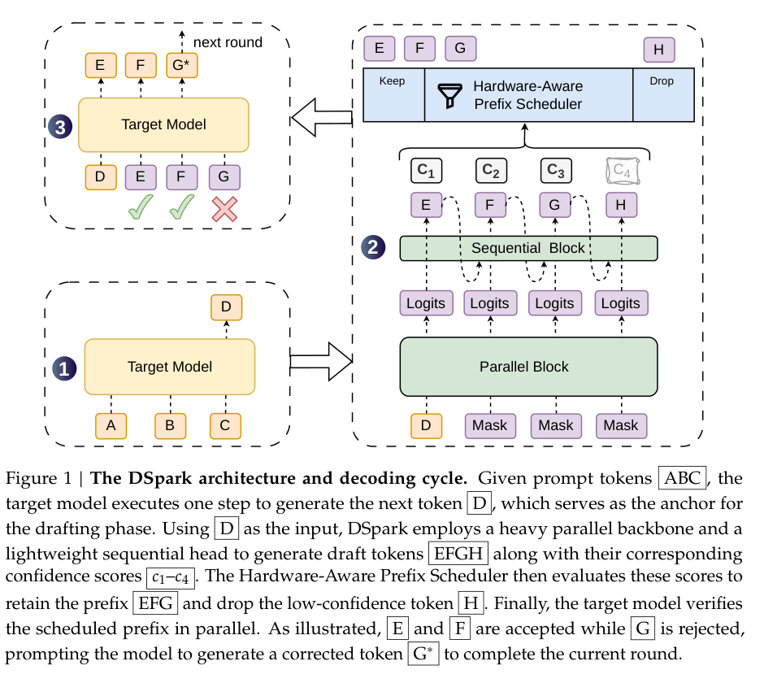
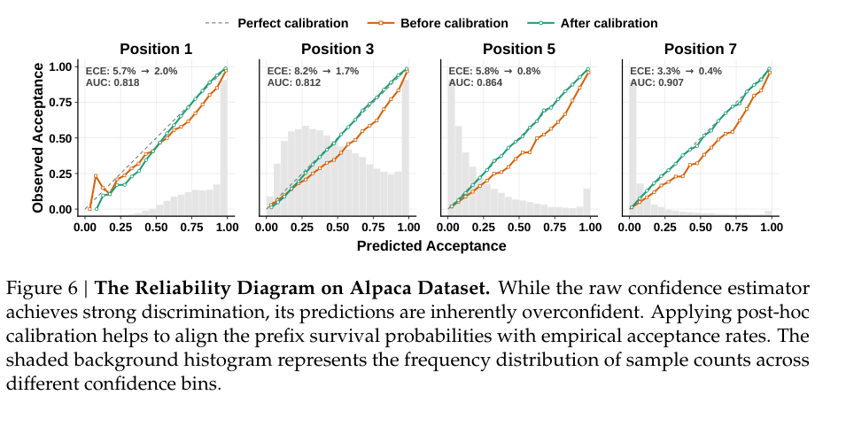
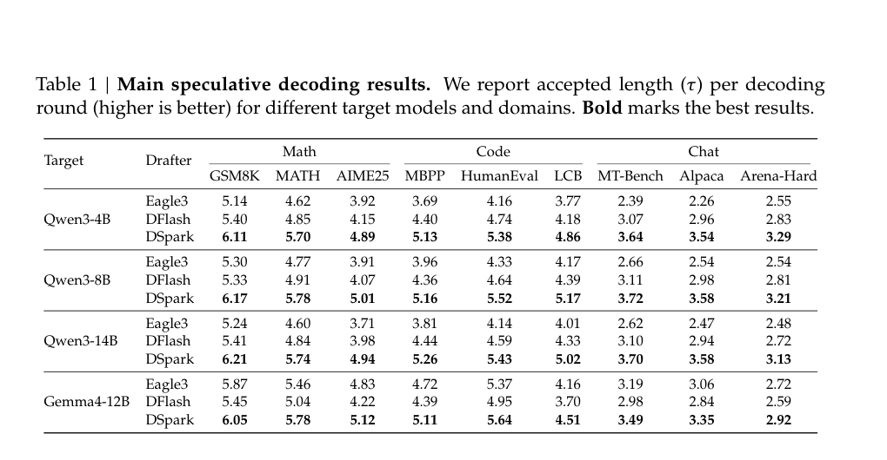
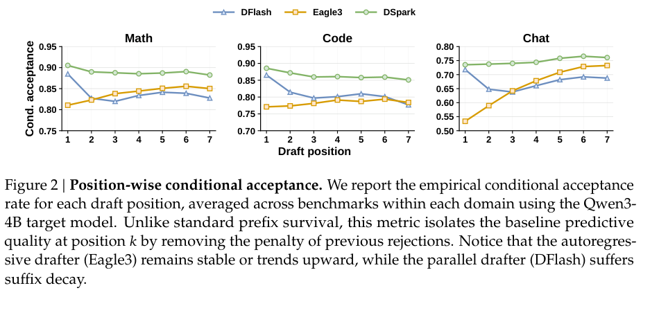
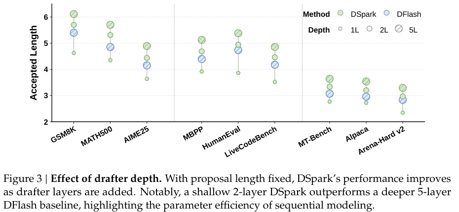
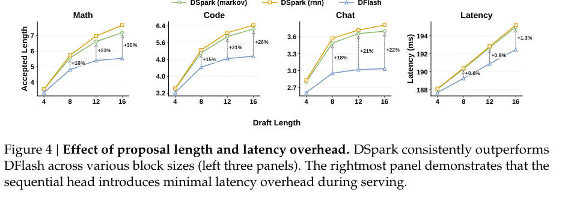
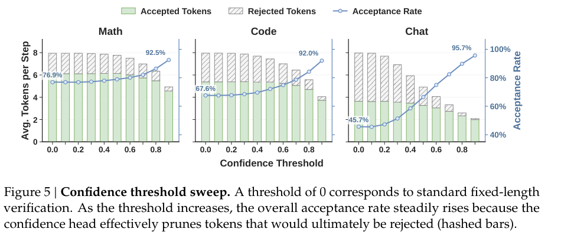
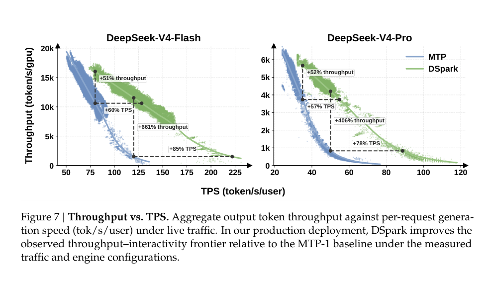
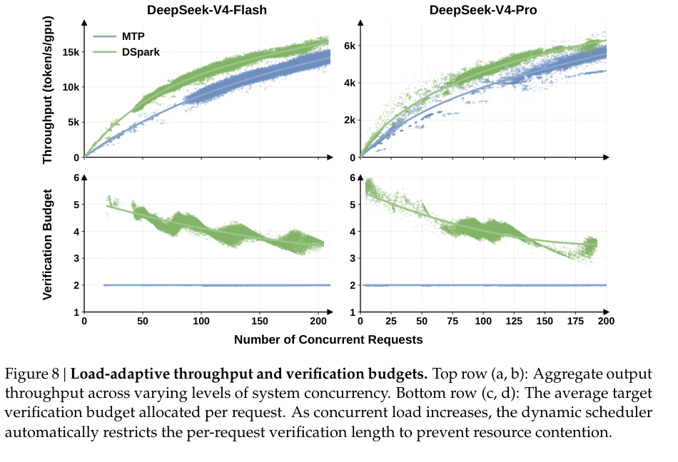

# DSpark: Confidence-Scheduled Speculative Decoding with Semi-Autoregressive Generation 精读分析

> 资料状态：本目录只有离线 PDF `DSpark_paper.pdf`；用户说明当前 arXiv 还没有，因此本次没有 LaTeX 源码可用。本文档中的示意图来自对 PDF 的整页渲染和裁剪，非原始矢量素材。若后续拿到 LaTeX 源码，建议用 `pdfimages`/源文件替换 `figures/crops/` 下的截图。

## 0. 资料与配图索引

- 论文 PDF：`./DSpark_paper.pdf`，共 33 页；PDF metadata 显示 `LaTeX with hyperref`、`pdfTeX-1.40.27`，生成时间为 `2026-06-27 04:08:49 UTC`。
    
- PDF 文本：`./extracted_text/full_text.clean.txt`，逐页文本在 `./extracted_text/page_XX.clean.txt`。
    
- 截图素材：整页截图在 `./figures/page_png/`，核心图表裁剪在 `./figures/crops/`。
    
- 开源代码：`./code/DeepSpec_shallow/`，remote 为 `https://github.com/deepseek-ai/DeepSpec`，当前本地浅克隆 commit 为 `0a03e19`。
    

> 截图工具说明：当前环境没有直接可用的 `pdfinfo/pdftoppm`，因此使用 PyMuPDF 将 PDF 渲染为 PNG 后按坐标裁剪。可替代工具包括 Poppler 的 `pdftoppm`/`pdftocairo`、ImageMagick + Ghostscript、浏览器/Playwright PDF 截图。没有 LaTeX 源码时，这类截图是最务实的配图方案。

|图表|本文档用途|文件|
|---|---|---|
|Figure 1|方法总览：parallel backbone + sequential head + scheduler + target verification|`./figures/crops/fig1_architecture.png`|
|Table 1|离线 accepted length 主结果|`./figures/crops/table1_main_results.png`|
|Figure 2|位置条件接受率，解释为什么半自回归有效|`./figures/crops/fig2_cond_acceptance.png`|
|Figure 3|draft 层数消融|`./figures/crops/fig3_depth.png`|
|Figure 4|proposal length 与延迟开销|`./figures/crops/fig4_proposal_latency.png`|
|Figure 5|confidence threshold sweep|`./figures/crops/fig5_conf_threshold.png`|
|Figure 6|confidence calibration reliability diagram|`./figures/crops/fig6_reliability.png`|
|Figure 7|生产流量 throughput-TPS frontier|`./figures/crops/fig7_live_frontier.png`|
|Figure 8|并发负载下的 throughput 与 verification budget|`./figures/crops/fig8_load_adaptive.png`|

---

## 1. 论文基本信息

**研究领域。** 大语言模型推理加速，具体是 speculative decoding、parallel/blockwise draft model、系统感知的在线 serving 调度。

**核心问题。** speculative decoding 的端到端延迟可抽象为：

$$  
L=\frac{T_{\mathrm{draft}}+T_{\mathrm{verify}}}{\tau}  
$$

  

其中 $\tau$ 是每轮平均接受长度。现有路线有两个结构性矛盾：

1. 自回归 drafter（如 Eagle 系列）能建模 token 间依赖，但 draft 阶段随 proposal 长度 $\gamma$ 线性变慢，即 $T_{\mathrm{draft}}\propto \gamma$。
    
2. 并行 drafter（如 DFlash）能一次 forward 生成整个 block，使 $T_{\mathrm{draft}}$ 近似与 $\gamma$ 无关，但 block 内各位置缺少对已采样 token 的条件依赖，后缀接受率快速衰减。
    
3. 固定长度 verification 在高并发 serving 下会把低置信后缀也送进 target model，占用 batch/token capacity，损害系统吞吐。
    

**研究目标。** DSpark 想同时提高 $\tau$、控制 $T_{\mathrm{draft}}$、并减少无价值的 $T_{\mathrm{verify}}$：算法上用“并行主干 + 轻量顺序头”缓解并行草稿的后缀衰减；系统上用 calibrated confidence + hardware-aware prefix scheduler 动态选择每个请求送 target model 验证的 prefix 长度。

---

## 2. 核心贡献与创新点

1. **半自回归 draft 架构。** DSpark 保留 DFlash 式单次并行 backbone 生成 $U_1,\dots,U_\gamma$，再用轻量 sequential block 给每个位置加入 prefix-dependent bias，从而在几乎不牺牲并行主干延迟的情况下恢复 block 内局部依赖。来源：Section 3.1，Figure 1。
    

2. **低秩 Markov head 是默认实现。** 论文默认用 first-order transition bias：
    

$$  
B(x_{k-1},\cdot)=W_1[x_{k-1}]W_2,\quad W_1\in\mathbb{R}^{V\times r},\;W_2\in\mathbb{R}^{r\times V}  
$$

  

默认 $r=256$。这个设计比 RNN head 简单，deployment 更友好；论文 Figure 4 显示 RNN head 主要在长 proposal 下只有小幅增益，因此默认采用 Markov head。来源：Section 3.1、Section 4.3.2。

3. **confidence head 预测条件接受概率，而不是只做 token quality 排序。** 对第 $k$ 个 draft token，预测：
    

$$  
c_k=P(\text{token }k\text{ survives}\mid \text{tokens }1,\dots,k-1\text{ accepted})  
$$

  

训练软标签来自 draft/target 分布的 total variation：

$$  
c_k^*=1-\frac{1}{2}\lVert p_k^d-p_k^t\rVert_1  
$$

  

来源：Section 3.2.1。

4. **将 verification length 选择建模为系统吞吐最大化。** 对 $R$ 个请求，令 $\ell_r$ 为请求 $r$ 的验证长度，$a_{r,j}=\prod_{i\le j}c_{r,i}$ 为 prefix survival probability，则：
    

$$  
B=\sum_{r=1}^{R}(1+\ell_r)  
$$

  

$$  
\tau=\sum_{r=1}^{R}\left(1+\sum_{j=1}^{\ell_r}a_{r,j}\right)  
$$

  

$$  
\Theta=\tau\cdot \mathrm{SPS}(B)  
$$

  

这里 $\mathrm{SPS}(B)$ 是初始化时 profiling 的 engine steps-per-second 曲线。scheduler 按 $a_{r,j}$ 全局排序并沿 greedy admission path 搜索吞吐最大点。来源：Section 3.2.2，Algorithm 1。

5. **从离线 benchmark 到生产系统闭环验证。** 离线部分验证 draft 质量；生产部分在 DeepSeek-V4-Flash / V4-Pro preview serving 中与 MTP-1 对比，展示吞吐和 per-user TPS frontier 改善。来源：Section 4、Section 5。
    

---

## 3. 研究方法：问题到方案的逻辑链

### 3.1 技术路线总览

论文的推理链是：

1. speculative decoding 的收益来自每轮接受长度 $\tau$，但 draft 和 verify 都有成本。
    
2. 只增大 draft block 不够，因为并行 draft 的后缀容易错；只用自回归 draft 又会让 $T_{\mathrm{draft}}$ 随长度增长。
    
3. 因此先用并行 backbone 生成全 block 的 hidden/logits，获得高容量和低 draft latency。
    
4. 再用极轻的 sequential head 按已采样 prefix 修正 logits，解决多模态 continuation 混合问题。
    
5. 最后用 confidence head 预测 prefix survival，结合当前 engine 的 $\mathrm{SPS}(B)$ 曲线，选择值得送 target model 验证的 prefix。
    

### 3.2 Semi-Autoregressive Generation

并行阶段使用 DFlash-like backbone，一次 forward 产生隐藏状态 $h_k$ 和 base logits $U_k$。论文强调相对 DFlash 的小改动：不是“anchor + $\gamma$ masks，只预测 masks”，而是把 anchor 也视为第一个 prediction position，因此 $\gamma$ 个输入 token（anchor + $\gamma-1$ masks）产生 $\gamma$ 个 draft logits。来源：Section 3.1。

顺序阶段定义 causal block distribution：

$$  
P(X\mid x_0)=\prod_{k=1}^{\gamma}p_k(x_k\mid x_0,x_{<k})  
$$

  

$$  
p_k(v\mid x_0,x_{<k})= \frac{\exp\left(U_k(v)+B_k(x_0,x_{<k},v)\right)} {\sum_{u\in V}\exp\left(U_k(u)+B_k(x_0,x_{<k},u)\right)}  
$$

  

导出结论的逻辑链：并行 backbone 负责“当前位置在 target context 下像什么”，Markov/RNN head 负责“给定已经采样的 prefix，后续 token 应该沿哪个 mode 走”。这正对 Figure 2 中 DFlash 后缀条件接受率衰减的问题。

### 3.3 Confidence-Scheduled Verification

confidence head 不是独立预测每个 token 的无条件正确率，而是预测 prefix 已通过前提下的条件生存率。prefix probability 用链式法则累乘：

$$  
a_{r,j}=\prod_{i\le j}c_{r,i}  
$$

  

由于吞吐目标中直接使用 $a_{r,j}$ 的数值，论文引入 Sequential Temperature Scaling（STS）做 post-hoc calibration，逐位置校准 cumulative product 的 ECE。来源：Section 3.2.1，Figure 6。

调度阶段把 verification token 看成全局候选池，边增加 batch token 数 $B$，边估计 $\Theta=\tau\cdot \mathrm{SPS}(B)$。这里的 $\mathrm{SPS}(B)$ 是 **Steps Per Second**：当 target model 一次 verification forward 需要处理 $B$ 个 token 时，serving engine 每秒能完成多少个 decode/verification step。它不是模型质量指标，而是硬件和 serving engine 的容量曲线，通常在 engine 初始化或部署压测时 profiling 成一张查表。

直观理解：$B$ 越大，每个 step 放进 target model 的 token 越多，但单个 step 可能变慢，因此 $\mathrm{SPS}(B)$ 通常随 $B$ 增大而下降。系统真正关心的是每秒产出多少“期望被接受的 token”：

$$  
\Theta=\tau\cdot \mathrm{SPS}(B)  
$$

  

所以这一设计的本质不是“越高置信越验证”这么简单，而是在“多验证一个 token 的 expected accepted token gain”和“增加 target batch size 导致 $\mathrm{SPS}(B)$ 下降”之间做边际权衡。

### 3.4 STS：Sequential Temperature Scaling

STS 是 DSpark 把 confidence head 输出从“排序分数”变成“可用于系统吞吐计算的概率”的校准机制。它解决的问题不是 draft token 本身怎么生成，而是：scheduler 后续要用 confidence 的绝对数值计算 prefix survival probability，如果这个概率不准，调度器会做错边际收益判断。

confidence head 对第 $k$ 个 draft token 输出的是条件接受概率：

$$  
c_k=P(\text{token }k\text{ accepted}\mid \text{tokens }1,\dots,k-1\text{ accepted})  
$$

  

因此长度为 $j$ 的 draft prefix 全部通过 target verification 的概率是：

$$  
a_j=\prod_{k=1}^{j}c_k  
$$

  

hardware-aware scheduler 直接使用 $a_j$ 来估计多验证一个 token 能带来的 expected accepted tokens，并代入：

$$  
\Theta=\tau\cdot \mathrm{SPS}(B)  
$$

  

所以这里要求 confidence 不只是“高分 token 排在低分 token 前面”，而是要求 $\prod_k c_k$ 的数值接近真实 prefix acceptance rate。若 raw confidence 过度自信，scheduler 会把太多低价值后缀送进 target model，浪费高并发时最稀缺的 batch capacity；若过度保守，则会提前剪掉本来可能通过的 draft tokens，降低 $\tau$。

Temperature scaling 假设 confidence head 的 logit 为 $z_k$，原始概率为：

$$  
c_k=\sigma(z_k)  
$$

  

校准后为：

$$  
\tilde c_k=\sigma(z_k/T_k)  
$$

  

其中 $T_k>0$ 是位置 $k$ 的温度。通常 raw model 过度自信时，$T_k>1$ 会把概率往中间区间拉回。

STS 的“Sequential”体现在逐位置校准 cumulative prefix probability，而不是一次性校准所有 token：

1. 在 held-out validation set 上，先搜索 $T_1$，使 $\tilde a_1=\tilde c_1$ 与真实“第 1 个 token 被接受”的频率最匹配。
    
2. 固定 $T_1$ 后，搜索 $T_2$，使 $\tilde a_2=\tilde c_1\tilde c_2$ 与真实“前 2 个 token 都被接受”的频率最匹配。
    
3. 继续固定已校准的 $T_1,\dots,T_{k-1}$，只搜索 $T_k$，使：
    

$$  
\tilde a_k=\prod_{i=1}^{k}\tilde c_i  
$$

  

与真实 prefix acceptance rate 匹配，直到 block 末尾。

每一步的搜索目标是降低 Expected Calibration Error（ECE）：

$$  
\mathrm{ECE}=\sum_b \frac{|B_b|}{N} \left|\mathrm{acc}(B_b)-\mathrm{conf}(B_b)\right|  
$$

  

这里 $B_b$ 是按预测概率分桶后的样本集合，$\mathrm{acc}(B_b)$ 是该桶真实接受率，$\mathrm{conf}(B_b)$ 是该桶平均预测概率。论文强调 temperature scaling 是 order-preserving transformation：它改变概率刻度，但不改变 token confidence 的相对排序。因此 STS 不会破坏 confidence head 学到的 token quality ranking，只是把概率值校准到更适合做吞吐估计。

和普通 threshold 的区别是：static threshold 只决定“单个请求的 draft prefix 截到哪里”，而 STS 为全局 scheduler 提供可信的 $a_{r,j}$。DSpark 的 scheduler 之后才能在不同请求、不同位置之间比较“多验证这个 token 是否值得”，并计算 $\Theta=\tau\cdot\mathrm{SPS}(B)$。

### 3.5 训练目标

训练时 target model 冻结；draft model 共享 target 的 embedding 和 LM head 并冻结，训练 backbone、sequential block、confidence head。目标函数为：

$$  
\mathcal{L}=\alpha_{\mathrm{ce}}\mathcal{L}_{\mathrm{ce}} +\alpha_{\mathrm{tv}}\mathcal{L}_{\mathrm{tv}} +\alpha_{\mathrm{conf}}\mathcal{L}_{\mathrm{conf}}  
$$

  

默认：

$$  
\alpha_{\mathrm{ce}}=0.1,\quad \alpha_{\mathrm{tv}}=0.9,\quad \alpha_{\mathrm{conf}}=1.0  
$$

  

其中：

$$  
\mathcal{L}_{\mathrm{ce}}=-\sum_{k=1}^{\gamma}w_k\log p_k^d(x_k^*)  
$$

  

$$  
\mathcal{L}_{\mathrm{tv}}=\sum_{k=1}^{\gamma}w_k\lVert p_k^d-p_k^t\rVert_1  
$$

  

$$  
\mathcal{L}_{\mathrm{conf}}=-\sum_{k=1}^{\gamma}w_k \left[c_k^*\log c_k+(1-c_k^*)\log(1-c_k)\right]  
$$

  

$$  
w_k=\exp\left(-\frac{k-1}{\gamma}\right)  
$$

  

来源：Section 3.3。注意开源代码实现里位置从 0 开始，`loss.py` 使用 `exp(-positions / loss_decay_gamma)`，默认 `loss_decay_gamma=4.0`，与论文“位置越靠前权重越高”的原则一致。

---

## 4. 关键结论与数据链

### 4.1 实验设置

来源：Section 4.1。

- target models：Qwen3-4B、Qwen3-8B、Qwen3-14B、Gemma4-12B。
    
- baselines：DFlash（parallel drafter）、Eagle3（autoregressive drafter / TTT）。
    
- 公平性设置：所有 drafter 用同一训练框架和数据重训；Eagle3 的 TTT horizon 与 DFlash/DSpark block size 对齐为 7；target feature layers 相同；Eagle3 1 层 draft，DFlash/DSpark 5 层 draft。
    
- 训练数据：Open-PerfectBlend，1.3M samples；只用 prompts，responses 由对应 target model 按推荐采样参数重新生成；训练 10 epochs；non-thinking mode。
    
- 评测：Math（GSM8K、MATH500、AIME25）、Code（MBPP、HumanEval、LiveCodeBench）、Chat（MT-Bench、Alpaca、Arena-Hard v2）；temperature=1；指标为每轮 accepted length $\tau$，包含 target-generated bonus token。
    

### 4.2 主结果：DSpark 提高 accepted length

来源：Table 1、Section 4.2。离线评测关闭 confidence scheduler，所有方法固定 propose 一个 token block，以隔离 draft model 质量。

|Target|DSpark avg $\tau$|vs Eagle3|vs DFlash|Math / Code / Chat 平均|
|---|---|---|---|---|
|Qwen3-4B|4.727|+30.9%|+16.3%|5.567 / 5.123 / 3.490|
|Qwen3-8B|4.813|+26.7%|+18.4%|5.653 / 5.283 / 3.503|
|Qwen3-14B|4.779|+30.0%|+18.3%|5.630 / 5.237 / 3.470|
|Gemma4-12B|4.663|+6.6%|+16.1%|5.650 / 5.087 / 3.253|

导出逻辑：在固定验证长度下，DSpark 的 $\tau$ 更高，说明提升不是 scheduler 带来的 token pruning 假象，而是 draft distribution 本身更接近 target distribution。Chat 的 $\tau$ 明显低于 Math/Code，进一步说明固定验证长度会在开放式场景浪费 target compute，这正是 Section 3.2 scheduler 的动机。

### 4.3 为什么 DSpark 能超过纯并行和纯自回归

来源：Section 4.3.1、Figure 2。

- position 1：DFlash/DSpark 的并行 backbone 可以更深，第一 token 条件接受率高于 Eagle3；论文给出例子：Math 上 DFlash 约 0.88 vs Eagle3 约 0.81，Chat 上 0.72 vs 0.53。
    
- suffix positions：DFlash 因独立并行预测，Code 从约 0.87 降到 0.78，Chat 从约 0.72 降到 0.63；Eagle3 能利用 prefix，Chat 可从 0.53 升到 0.74。
    
- DSpark：继承并行 backbone 的高初始接受率，又用 sequential head 抑制 suffix decay；因此整体 $\tau$ 最好。
    

这个图是全文最关键的机制证据：它把“为什么不是简单加深 DFlash 或换 Eagle3”解释清楚了。

### 4.4 模型深度与 proposal length 消融

来源：Section 4.3.2、Figure 3。

结论：DSpark 随 draft layers 增加而提升，且 2-layer DSpark 已超过 5-layer DFlash。导出逻辑是：局部顺序依赖建模比单纯堆并行层更高效，Markov head 的参数/延迟开销换来了更好的 sequence coherence。

来源：Section 4.3.2、Figure 4。

- 当 proposal length 从 4/8/12/16 扩展时，DSpark 始终优于 DFlash。
    
- 在 $\gamma=7$ 时，DSpark accepted length 相对 DFlash 提升：Math +16%、Code +15%、Chat +18%。
    
- 在 $\gamma=15$ 时，提升扩大为：Math +30%、Code +26%、Chat +22%。
    
- 延迟方面，在 batch size 128、context lengths `{512,1024,2048,4096}` 平均下，sequential sampling loop 相对 DFlash 的 full-round latency 仅增加 0.2% 到 1.3%。
    

导出逻辑：block 越长，纯并行后缀衰减越严重，DSpark 的局部顺序修正收益越大；而 target verification 主导 full-round latency，Markov head 的顺序开销相对较小。

### 4.5 Confidence head 与调度证据

来源：Section 4.3.3、Figure 5。

固定 threshold sweep 显示 confidence head 能识别低价值后缀：

- threshold=0 等价固定长度验证。
    
- Chat 接受率从 45.7% 升到 95.7%，同时 rejected tokens 大幅减少。
    
- Math 从 76.9% 升到 92.5%，Code 从 67.6% 升到 92.0%。
    

这并不直接等于生产最优策略，因为 static threshold 不感知系统负载；但它证明了 confidence score 有可用的排序和 pruning 信号。Figure 6 进一步显示 raw confidence 过度自信，ROC-AUC 约 0.81-0.90，ECE 约 3%-8%；STS 后平均 ECE 降到约 1%。导出逻辑是：ROC-AUC 说明模型能区分“更可能被接受”和“更可能被拒绝”的 token，ECE 下降说明预测概率的绝对刻度更接近真实 prefix acceptance rate；两者结合，才足以支撑 hardware-aware scheduler 用 $a_{r,j}=\prod_i c_{r,i}$ 计算 $\Theta$。

### 4.6 生产部署结果

来源：Section 5.4、Figure 7。生产环境对比 DSpark-5 与 MTP-1，部署在 DeepSeek-V4-Flash preview 和 DeepSeek-V4-Pro preview。

- 生产 DSpark-5 规格来自 Section 5.1：parallel backbone 为 3 个 MoE layers，带 mHC 和 sliding window attention 128；最大 block size $\gamma=5$；sequential modeling 使用 Markov head；confidence head 端到端训练后用 STS 校准。
    
- V4-Flash：80 tok/s/user SLA 下 aggregate throughput +51%；120 tok/s/user 严格 SLA 下名义 throughput +661%。论文明确提醒，+661% 主要说明 DSpark 扩展了可行 frontier，不应当当作常规 multiplicative speedup。
    
- V4-Pro：35 tok/s/user SLA 下 aggregate throughput +52%；50 tok/s/user 严格 SLA 下名义 throughput +406%。
    
- 在 matched practical throughput 下，DSpark 使 per-user generation speed 提升：V4-Flash +60%-85%，V4-Pro +57%-78%。
    

来源：Section 5.4、Figure 8。

并发较低时 scheduler 把 MTP-1 静态 2-token verification budget 扩展到约 4-6 tokens/request，以利用空闲 target compute；并发升高、target capacity 饱和时，verification budget 平滑下降，避免低置信后缀占用关键 batch capacity。

---

## 5. Related Work 对比

来源：Section 6 以及论文实验 baseline 设置。

|方法类别|代表|优点|局限|与 DSpark 的关系|
|---|---|---|---|---|
|标准 speculative sampling|Chen et al. 2023、Leviathan et al. 2023|lossless，严格保持 target 分布|需要高质量且低成本 drafter|DSpark 仍使用 rejection sampling verification，保持 lossless 前提|
|小模型 / feature extrapolator drafter|EAGLE、EAGLE-2/3、Medusa、Hydra、MTP、FastMTP|实现相对成熟，可利用 target hidden feature|autoregressive/tree/multi-head 常有 draft latency 或 verification overhead 问题|DSpark 与 Eagle3 对比，核心优势是并行 backbone + 局部顺序头|
|并行 / diffusion-inspired drafter|P-EAGLE、PARD、DART、DFlash、DDTree|单次 forward 产生 block，draft latency 低，可加深 drafter|token 间独立或弱条件化导致 suffix acceptance decay|DSpark 直接继承 DFlash backbone，并用 Markov/RNN head 修复 suffix decay|
|DFlash 改进|Domino、DFlare|针对并行 drafter 的 conditioning bottleneck 做增强|需要看具体实现是否保留 exact token probability 和 serving 友好性|DSpark 的 Markov/RNN head 与 Domino 的 CausalEncoder 思路相近，但强调可部署和概率可验证|
|confidence/adaptive length|SpecDec++、EAGLE-2、Talon、SpecBound 等|能减少无价值 verification|多数是静态 threshold 或单请求视角|DSpark 把调度目标显式写成 $\Theta=\tau\cdot\mathrm{SPS}(B)$，引入系统负载曲线|
|系统 goodput/scheduler|TurboSpec、SpecInfer、MagicDec、AdaSpec、Echo、D-Cut 等|面向 serving goodput/SLO/负载|通常不同时改变 drafter 架构|DSpark 同时改 drafter 和 scheduler，并在生产流量中验证|
|parallel generation / NAT|NAT、CRF-NAT、CTC drafter|可并行生成|全局归一化/latent alignment 往往不易给出 exact per-token probabilities|DSpark 的 sequential correction 是局部 softmax，仍可用于 rejection sampling|

务实判断：本文不是第一个提出“并行生成 + 局部顺序建模”或“confidence pruning”的工作，创新点在于把这两件事放进 lossless speculative decoding 的概率约束和高并发 serving 的 batch capacity 约束下，并给出生产部署证据。

---

## 6. Infra 需求分析

### 6.1 训练侧存储与带宽

DeepSpec README 明确提示：默认 Qwen3-4B target cache 约 38 TB。源码 `target_cache_dataset.py` 显示 target cache 存储：

- `input_ids`：int32
    
- `attention_mask` / `loss_mask`：uint8
    
- `target_hidden_states`：bf16，形状约为 `[seq_len, num_target_layers, hidden_size]`
    
- `target_last_hidden_states`：bf16，形状约为 `[seq_len, hidden_size]`
    

单样本长度 $S$、捕获层数 $K$、hidden size $D$ 时，主要存储量为：

$$  
\mathrm{Bytes}_{\mathrm{sample}} =4S+S+S+2SKD+2SD  
$$

  

主导项是：

$$  
\mathrm{Bytes}_{\mathrm{hidden}}\approx 2SD(K+1)  
$$

  

训练集总量 $N$ 时：

$$  
\mathrm{Bytes}_{\mathrm{total}}\approx N\cdot 2SD(K+1)  
$$

  

DeepSpec 默认 `target_layer_ids` 数量 $K=5$、`max_length=4096`，因此缓存规模随 $N,S,D,K$ 线性放大。论文 Section 5.1 也指出 full-vocabulary logits 通信会造成严重带宽瓶颈，因此内部训练框架采用“传 hidden states 而非 logits，本地 LM head 投影”的优化，把每 token 通信复杂度从 $O(V)$ 降到 $O(D)$。

通信量对比公式：

$$  
\mathrm{Bytes}_{\mathrm{logits/token}}\approx 2V  
$$

  

$$  
\mathrm{Bytes}_{\mathrm{hidden/token}}\approx 2D  
$$

  

当 $V\approx 10^5$ 且 $D$ 为几千时，隐藏态通信通常比 logits 通信小一个数量级以上。

### 6.2 Draft 模型参数与显存

Markov head 默认低秩参数量：

$$  
P_{\mathrm{markov}}=V r + rV=2Vr  
$$

  

Qwen 系列配置中 `mask_token_id=151669`，结合代码注释和 Qwen3 vocab 可按 $V=151936$ 估算，默认 $r=256$：

$$  
P_{\mathrm{markov}}=2\times151936\times256=77{,}791{,}232  
$$

  

bf16 权重显存：

$$  
\mathrm{Mem}_{\mathrm{markov}}\approx 77{,}791{,}232\times2\text{ bytes}\approx148.4\text{ MiB}  
$$

  

这对 serving 显存是可见开销，但相比 target model KV cache 和 MoE/Transformer 主体仍属于可控级别。更重要的是 Markov head 每步要做 rank-to-vocab projection，因此每个 proposal position 的额外计算量大约：

$$  
\mathrm{FLOPs}_{\mathrm{markov/step}}\approx 2Vr  
$$

  

block 长度为 $\gamma$ 时：

$$  
\mathrm{FLOPs}_{\mathrm{markov/block}}\approx 2\gamma Vr  
$$

  

它是顺序执行，但论文 Figure 4 显示在 batch=128 的 full-round latency 中只增加 0.2%-1.3%，原因是 target verification pass 主导时间。

### 6.3 Serving 侧 batch capacity 与调度

DSpark 的 scheduler 需要 engine 初始化时 profiling $\mathrm{SPS}(B)$，并在每个 step 根据当前 active requests 和 calibrated confidence 选择 prefix lengths。关键计算式：

$$  
B=\sum_r(1+\ell_r)  
$$

  

其中 $1$ 是每个请求必须送入 target model 的当前/bonus token，$\ell_r$ 是请求 $r$ 额外送去验证的 draft prefix 长度。因此 $B$ 是本轮 target verification forward 的物理 token batch size。

$$  
\tau=\sum_r\left(1+\sum_{j=1}^{\ell_r}a_{r,j}\right)  
$$

  

$$  
\Theta(B,\ell)=\tau\cdot\mathrm{SPS}(B)  
$$

  

$\mathrm{SPS}(B)$ 的单位是 `steps/s`。它回答的问题是：在当前模型、GPU、kernel、KV cache、batching 策略下，如果一次 verification step 的 token batch size 是 $B$，engine 每秒能跑多少个这样的 step。它通常不是解析公式，而是通过 profiling 得到的离散表，例如：

|$B$|$\mathrm{SPS}(B)$|含义|
|---|---|---|
|64|120 steps/s|batch 小，单步快|
|128|90 steps/s|batch 变大，单步变慢但可能更高效|
|256|45 steps/s|接近/超过容量区，step 明显变慢|

调度器比较的是 $\Theta$，不是单独比较 $\tau$ 或 $\mathrm{SPS}$。一个简化例子：

|策略|期望接受 token 数 $\tau$|$B$|$\mathrm{SPS}(B)$|$\Theta=\tau\cdot\mathrm{SPS}(B)$|
|---|---|---|---|---|
|保守验证|100|128|90|9000 token/s|
|多验证一些高置信 token|125|160|80|10000 token/s|
|盲目验证长后缀|135|256|45|6075 token/s|

导出结论：如果新增 draft tokens 的 prefix survival probability 足够高，$\tau$ 的增加能抵消 $\mathrm{SPS}(B)$ 的下降，应该验证；如果后缀低置信，$\tau$ 增幅很小但 $B$ 变大导致 SPS 明显下降，就应该剪掉。Figure 8 展示的 load-adaptive verification budget，本质就是 scheduler 在不同并发负载下沿这条 trade-off 曲线移动。

infra 含义：

- target model 的 decode kernel 必须支持 variable-length query/prefix，否则 padding 会抵消 scheduler 的收益。
    
- scheduler 要低延迟，不能阻塞 GPU pipeline。
    
- confidence calibration 需要稳定，否则 $\tau$ 估计偏差会把 scheduler 推向过度验证或过度保守。
    

### 6.4 互联组网与带宽

训练侧如果 target 和 draft 分布在不同 worker，最重的是 target hidden/logits 的跨 worker 传输。按每 step sampled anchor 数 $A$、block size $\gamma$、捕获层 $K$、hidden size $D$、bf16 估算，隐藏态传输为：

$$  
\mathrm{Bytes}_{\mathrm{transfer}}\approx 2\cdot A\cdot \gamma\cdot K\cdot D  
$$

  

如果传 logits，则约为：

$$  
\mathrm{Bytes}_{\mathrm{logits}}\approx 2\cdot A\cdot \gamma\cdot V  
$$

  

当 $V\gg KD$ 或需要完整序列 logits 时，logits 传输会成为网络瓶颈。因此论文 Section 5.1 的 hidden-state communication 是必要工程优化，而不仅是实现细节。

### 6.5 新型自定义算子与 serving engine 改造

Section 5.2-5.3 指出生产落地的困难不在 Markov head 本身，而在动态 verification prefix 与连续 CUDA graph/ZOS 的冲突：

- 理论 Algorithm 1 假设平滑、单峰 $\mathrm{SPS}(B)$；真实硬件曲线是离散、阶梯状、可能有 jagged cliffs。
    
- ZOS/continuous CUDA graph 要求下一 step batch size 预先确定，不能等当前 step 完全结束后同步调度。
    
- 论文内部方案使用两步前 confidence 预测近似下一步 capacity $K$，当前 step 仍按最新 confidence 排序，形成 asynchronous dynamic top-$K$。
    
- variable-length verification 需要把不同请求 token flatten 成物理 token batch，并用 marker tensor 表示逻辑依赖。
    
- DeepSeek-V4 架构中，论文称只需修改 index-attention 和 compress kernels 来支持这种 variable-length routing。
    

这意味着 DSpark 对 infra 的要求高于普通 offline speculative decoding：需要 serving engine、调度器、attention kernel 和 KV/cache 管理配合，而不是只加载一个 draft checkpoint。

---

## 7. DeepSpec 开源代码对照分析

### 7.1 仓库范围

仓库 README 称 DeepSpec 是用于训练和评测 speculative decoding draft models 的 full-stack codebase，包含 DSpark、DFlash、Eagle3。当前公开仓库覆盖 Qwen3/Gemma4 的训练、评测和数据准备；论文 Section 5 的 DeepSeek-V4 生产 scheduler/kernel 改造并未在仓库中完整开源。

GitHub 链接：`https://github.com/deepseek-ai/DeepSpec`。本地克隆：`./code/DeepSpec_shallow/`。

### 7.2 DSpark 配置规格

|配置文件|Target|block_size|draft layers|target_layer_ids|Markov|confidence|training|
|---|---|---|---|---|---|---|---|
|`config/dspark/dspark_qwen3_4b.py`|`Qwen/Qwen3-4B`|7|5|`[1,9,17,25,33]`|rank 256, vanilla|enabled, with Markov|bf16, batch 512, 10 epochs|
|`config/dspark/dspark_qwen3_8b.py`|`Qwen/Qwen3-8B`|7|5|`[1,9,17,25,33]`|rank 256, vanilla|enabled, with Markov|bf16, batch 512, 10 epochs|
|`config/dspark/dspark_qwen3_14b.py`|`Qwen/Qwen3-14B`|7|5|`[1,10,19,28,37]`|rank 256, vanilla|enabled, with Markov|bf16, batch 512, 10 epochs|
|`config/dspark/dspark_gemma4_12b.py`|`google/gemma-4-12B-it`|7|5|`[5,17,29,41,46]`|rank 256, vanilla|enabled, with Markov|bf16, batch 512, 10 epochs|

这与论文 Section 4.1 的离线实验设置一致：DFlash/DSpark 使用 5 层 draft、block size 7、同一 target feature layers，训练 10 epochs。

### 7.3 架构实现映射

关键源码定位如下，GitHub 链接固定到本地浅克隆对应的 `0a03e19` commit：

|论文机制|本地文件|GitHub 对应位置|
|---|---|---|
|Qwen3 DSpark config 默认规格|`./code/DeepSpec_shallow/config/dspark/dspark_qwen3_4b.py`|`https://github.com/deepseek-ai/DeepSpec/blob/0a03e19/config/dspark/dspark_qwen3_4b.py#L9-L29`|
|DFlash-like KV/context injection|`./code/DeepSpec_shallow/deepspec/modeling/dspark/qwen3/modeling.py`|`https://github.com/deepseek-ai/DeepSpec/blob/0a03e19/deepspec/modeling/dspark/qwen3/modeling.py#L44-L135`|
|DSpark model modules：fc、Markov、confidence head|`./code/DeepSpec_shallow/deepspec/modeling/dspark/qwen3/modeling.py`|`https://github.com/deepseek-ai/DeepSpec/blob/0a03e19/deepspec/modeling/dspark/qwen3/modeling.py#L202-L335`|
|训练 forward：anchor sampling、mask block、target logits 对齐|`./code/DeepSpec_shallow/deepspec/modeling/dspark/qwen3/modeling.py`|`https://github.com/deepseek-ai/DeepSpec/blob/0a03e19/deepspec/modeling/dspark/qwen3/modeling.py#L362-L525`|
|Vanilla Markov head|`./code/DeepSpec_shallow/deepspec/modeling/dspark/markov_head.py`|`https://github.com/deepseek-ai/DeepSpec/blob/0a03e19/deepspec/modeling/dspark/markov_head.py#L8-L90`|
|TV acceptance soft label 与 loss 加权|`./code/DeepSpec_shallow/deepspec/modeling/dspark/loss.py`|`https://github.com/deepseek-ai/DeepSpec/blob/0a03e19/deepspec/modeling/dspark/loss.py#L60-L70`、`https://github.com/deepseek-ai/DeepSpec/blob/0a03e19/deepspec/modeling/dspark/loss.py#L231-L252`|
|Confidence-threshold proposal 截断|`./code/DeepSpec_shallow/deepspec/eval/dspark/draft_ops.py`|`https://github.com/deepseek-ai/DeepSpec/blob/0a03e19/deepspec/eval/dspark/draft_ops.py#L96-L153`|
|Lossless rejection sampling verification|`./code/DeepSpec_shallow/deepspec/eval/base_evaluator.py`|`https://github.com/deepseek-ai/DeepSpec/blob/0a03e19/deepspec/eval/base_evaluator.py#L186-L305`|
|target cache 大小公式与 dtype|`./code/DeepSpec_shallow/deepspec/data/target_cache_dataset.py`|`https://github.com/deepseek-ai/DeepSpec/blob/0a03e19/deepspec/data/target_cache_dataset.py#L42-L74`|
|38 TB cache warning|`./code/DeepSpec_shallow/scripts/data/README.md`|`https://github.com/deepseek-ai/DeepSpec/blob/0a03e19/scripts/data/README.md#L121-L127`|

**DFlash-like hidden injection。** `deepspec/modeling/dspark/qwen3/modeling.py` 中 `Qwen3DSparkAttention` 将 target hidden states 和 draft/noise hidden states 分别投影为 KV 后 concat，query 来自 draft hidden。对应论文的 injected target context + parallel block。

**Backbone。** `Qwen3DSparkModel._forward_backbone` 先用 `fc` 把多层 target hidden states 拼接投影回 hidden size，再经过 draft decoder layers。对应论文 Section 3.1 的 parallel backbone。

**Markov head。** `deepspec/modeling/dspark/markov_head.py` 的 `VanillaMarkov` 实现：

$$  
\mathrm{logits}'=\mathrm{logits}+W_2(W_1[x_{k-1}])  
$$

  

`sample_block_tokens` 按 step 左到右采样，并把上一步采样 token 作为下一步 bias 输入。这与论文 Equation 5 一致。

**Confidence head。** `Qwen3DSparkModel.predict_confidence_step` 在 `confidence_head_with_markov=True` 时 concat backbone hidden 和 previous-token Markov embedding，送 `AcceptRatePredictor`。这与论文 Equation 7 一致。

**Loss。** `deepspec/modeling/dspark/loss.py` 计算：

$$  
c_k^*=1-\frac{1}{2}\lVert p_k^d-p_k^t\rVert_1  
$$

  

并把 confidence BCE、CE、L1/TV matching 加权求和；默认权重来自 config：`ce_loss_alpha=0.1`、`l1_loss_alpha=0.9`、`confidence_head_alpha=1.0`。

**Evaluation。** `deepspec/eval/base_evaluator.py` 使用标准 rejection sampling：

$$  
P(\mathrm{accept})=\min\left(1,\frac{p_t(x)}{p_d(x)}\right)  
$$

  

若拒绝则从 residual distribution 采样，保证 lossless。`deepspec/eval/dspark/draft_ops.py` 根据 confidence threshold 截断 prefix；这对应论文 Section 4.3.3 的 static threshold 诊断，而不是 Section 3.2.2/5.2 的完整硬件感知生产 scheduler。

### 7.4 与论文一致和不明确之处

一致之处：

- 公开代码实现了 DSpark 的 parallel backbone、Markov/RNN/Gated Markov head、confidence head、CE+TV+confidence loss、target cache 数据管线和 standard speculative verification。
    
- 配置与论文离线实验基本一致，特别是 block size、draft layers、target layer ids、训练 epochs、loss weights。
    
- 代码的 confidence recorder 支持 ECE/AUC/Brier 和 reliability diagram，能支撑 Figure 6 类分析。
    

未完全开源或需谨慎处：

- 论文 Section 5 的 DeepSeek-V4 production serving 集成、ZOS 异步 scheduler、index-attention/compress kernel 修改，在公开仓库中没有完整实现。
    
- 公开 evaluator 主要是单样本/benchmark 评测，confidence pruning 是 threshold-based；没有看到完整 $\Theta=\tau\cdot\mathrm{SPS}(B)$ 全局 batch scheduler。
    
- 仓库 README 没有显式列出论文中 DeepSeek-V4 production DSpark checkpoint 的下载入口；当前 repo 更像训练/评测框架而非生产 serving engine。
    

---

## 8. 优点与局限

### 优点

1. **问题拆解准确。** 论文没有只追求 draft acceptance，也没有只做系统调度，而是明确把 $T_{\mathrm{draft}}$、$T_{\mathrm{verify}}$、$\tau$ 放在同一个目标下分析。
    
2. **架构增量务实。** Markov head 是很小的 sequential correction，不破坏 DFlash-like parallel backbone 的主要效率优势。
    
3. **实验链条较完整。** Section 4 先隔离 draft quality，Section 5 再验证 production serving frontier，避免把 scheduler 效果和模型质量混在一起。
    
4. **代码可对照。** DeepSpec 开源了训练、target cache、loss、eval 和多模型配置，足以复现实验框架层面的 DSpark/DFlash/Eagle3 对比。
    
5. **infra 视角强。** 论文明确讨论 CUDA graph/ZOS、variable-length verification、kernel 改造和 target cache 存储，符合生产推理真实瓶颈。
    

### 局限

1. **生产系统关键代码未完全公开。** 最有价值的 hardware-aware scheduler 与 kernel path 主要停留在论文描述，难以用 DeepSpec 直接复现 Figure 7/8。
    
2. **固定 draft-side cost 仍存在。** 论文 Limitations 也承认，对于低接受率复杂请求，先生成完整 $\gamma$-token block 的 draft compute 可能无法回收。
    
3. **Markov head 参数随词表线性增长。** $P=2Vr$，大词表下 1.5e8 bytes 级 bf16 权重开销可接受但不能忽略；多 target / 多 tenant deployment 会放大显存压力。
    
4. **calibration 对分布漂移敏感。** STS 在 held-out set 上校准，如果线上请求分布变化，$\Theta$ 估计可能偏移，需要在线监控和重新校准机制。
    
5. **算法最优性依赖硬件曲线假设。** Algorithm 1 的早停全局最优要求吞吐目标沿 greedy path 近似单峰；论文生产实现用异步 top-$K$ 绕过 jagged curve，但严格理论与工程实现之间仍有 gap。
    

---

## 9. 研究启发与可延伸方向

1. **drafter 不必在“全并行”和“全自回归”之间二选一。** 对 speculative decoding，局部顺序 correction 只要能显著提升 prefix survival，就可能比增加并行层更划算。
    
2. **accepted length 应按位置和条件概率拆开看。** Figure 2 的 conditional acceptance 比单个平均 $\tau$ 更能解释模型行为，后续评测 draft model 应常规报告 position-wise conditional acceptance。
    
3. **调度目标应绑定 serving engine 曲线。** 固定 threshold 在不同负载下没有统一最优，实际系统应使用 $\mathrm{SPS}(B)$ 或 goodput/SLO 曲线做调度。
    
4. **calibration 是系统优化变量。** confidence 不仅是分类器分数，而是吞吐估计输入；ECE/AUC/Brier 应纳入 serving 监控。
    
5. **可探索 difficulty-aware drafting。** 对低可预测请求，在 parallel backbone 内做 early-exit 或直接回退 MTP-1/target-only，能解决论文 Limitations 中的固定 draft cost。
    
6. **可探索更小的 transition bias。** Markov head 的 $2Vr$ 对大词表仍较大，可研究 vocab clustering、adaptive softmax、top-k transition、token-type-specific rank 等方式减小显存和 projection bandwidth。
    

---

## 10. 一句话总结

DSpark 的核心不是“又一个 draft model”，而是把并行草稿模型的高容量/低 draft latency、局部自回归的 prefix coherence、以及 serving engine 的动态 batch capacity 放到同一个 lossless speculative decoding 框架里；离线数据证明它提高 draft quality，生产数据证明 calibrated confidence scheduler 能把额外 draft tokens 转化为真实 throughput/TPS frontier 改善。
