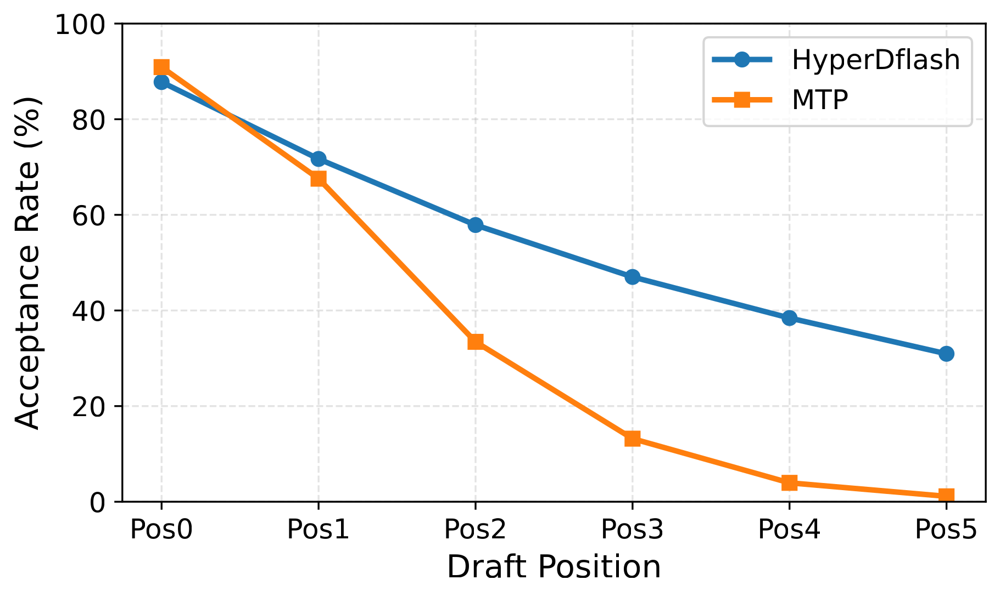
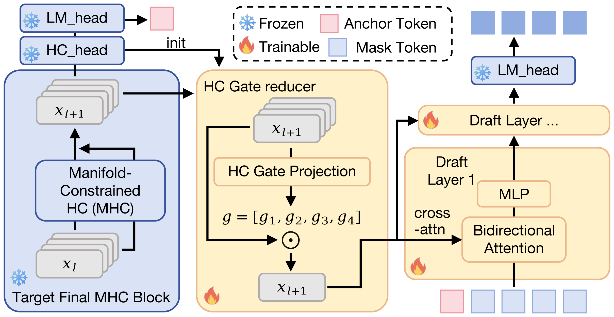

# HyperDFlash: MHC-Aligned Block Speculative Decoding with Gated Residual Reduction 精读分析

> 资料状态：已下载 arXiv:2606.26744v1 PDF、arXiv source archive、LaTeX 主文件、正文提取文本和 7 页 PDF 渲染图。本文档嵌入的两张 Figure 均来自 arXiv source 中的原始 PDF 图转换为 PNG，并已裁剪白边；caption 以 Markdown 文本紧贴图片保留。Table 不使用页面截图，改用 LaTeX 表格源码整理成 Markdown 摘录。论文没有给出 HyperDFlash drafter 的 GitHub/权重链接；LaTeX bibliography 只给出目标模型 `DeepSeek-V4-Flash` 的 Hugging Face model card。当前环境对 Hugging Face `config.json`/model card 的本地 `curl` 请求被 reset，因此权重配置核查状态写为“未本地验证”。

## 0. 资料与配图索引

- arXiv 摘要页：[https://arxiv.org/abs/2606.26744v1](https://arxiv.org/abs/2606.26744v1)
- arXiv PDF：[https://arxiv.org/pdf/2606.26744v1](https://arxiv.org/pdf/2606.26744v1)
- arXiv source：[https://arxiv.org/e-print/2606.26744v1](https://arxiv.org/e-print/2606.26744v1)
- 论文 PDF：`../../_artifacts/source/2606.26744v1_HyperDFlash_MHC-Aligned_Block_Speculative_Decoding_with_Gated_Residual_Reduction/paper.pdf`
- LaTeX 主文件：`../../_artifacts/source/2606.26744v1_HyperDFlash_MHC-Aligned_Block_Speculative_Decoding_with_Gated_Residual_Reduction/source/main.tex`
- 原始图文件：`../../_artifacts/source/2606.26744v1_HyperDFlash_MHC-Aligned_Block_Speculative_Decoding_with_Gated_Residual_Reduction/source/position_acceptance_rate.pdf`、`../../_artifacts/source/2606.26744v1_HyperDFlash_MHC-Aligned_Block_Speculative_Decoding_with_Gated_Residual_Reduction/source/dpsk_dflash.pdf`
- 提取文本：`../../_artifacts/source/2606.26744v1_HyperDFlash_MHC-Aligned_Block_Speculative_Decoding_with_Gated_Residual_Reduction/extracted_text/paper_layout.txt`
- PDF 页面截图：`../../_artifacts/source/2606.26744v1_HyperDFlash_MHC-Aligned_Block_Speculative_Decoding_with_Gated_Residual_Reduction/figures/page_png/`

| 图表       | 本文档用途                                                                                 | 文件                                                                                                   |
| -------- | ------------------------------------------------------------------------------------- | ---------------------------------------------------------------------------------------------------- |
| Figure 1 | MTP 与 HyperDFlash 六个 draft positions 的 acceptance rate 趋势                             | `assets/hyperdflash_fig1_position_acceptance_source.png`，来自 `source/position_acceptance_rate.pdf` |
| Figure 2 | HyperDFlash 主流程裁剪图：MHC pre-collapse residual、Inherited HC-Gate Reducer、DFlash drafter | `assets/hyperdflash_fig2_overview_source.png`，来自 `source/dpsk_dflash.pdf`，已去除原始 WPS 图中游离箭头和大块空白   |
| Table 1  | Generic `fc` reducer 与 Inherited HC-Gate Reducer 的机制/参数量对比                            | Markdown 摘录；完整来源 `source/main.tex`                                                                   |
| Table 2  | Non-thinking mode 主结果                                                                 | Markdown 摘录；完整来源 `source/main.tex`                                                                   |
| Table 3  | Think-high mode 主结果                                                                   | Markdown 摘录；完整来源 `source/main.tex`                                                                   |

## 0.1 符号表

| 符号                           | 含义                                                 | 作用域/索引                     | 单位/取值                                             | 来源                                 | 易混点                                                                                         |
| ---------------------------- | -------------------------------------------------- | -------------------------- | ------------------------------------------------- | ---------------------------------- | ------------------------------------------------------------------------------------------- |
| $m$ / `\hcmult`              | MHC 中每个 token 的并行 residual paths 数                 | per token                  | DeepSeek-V4-Flash source 注释中为 4                   | Section 1/2.2，source comments      | 不等于 CSA/HCA 的 compression ratio，本文只讨论 MHC path 数                                            |
| $d$                          | 单条 residual path / hidden state 维度                 | per path                   | DeepSeek-V4-Flash source 注释中为 4096                | source comments / DeepSeek-V4 配置引用 | 与 DFlash 论文中的 draft hidden width 不一定相同                                                      |
| $\mathbf{H}_t$               | token $t$ 的多路径 MHC residual                        | token $t$                  | $\mathbb{R}^{m\times d}$                          | Eq. 1 前后                           | 这是 collapse 前的多路径状态，不是最终 LM head 输入                                                         |
| $\mathrm{vec}(\mathbf{H}_t)$ | 将 $m$ 条 path 展平成一个向量                               | token $t$                  | $\mathbb{R}^{md}$                                 | Eq. 1                              | Generic `fc` reducer 会直接处理这个向量                                                              |
| $\tilde{\mathbf{x}}_t$       | RMSNorm 后的 flattened MHC residual                  | token $t$                  | $\mathbb{R}^{md}$                                 | Eq. 1                              | 论文公式抽象了实现中的 inverse-RMS scaling、scale factor 和小 offset                                      |
| $W_f,b$                      | HC gate 的线性投影参数                                    | reducer / target `hc_head` | $W_f\in\mathbb{R}^{m\times md}$                   | Eq. 1                              | 不是 $md\times d$ 的 dense projection                                                          |
| $\boldsymbol{\alpha}_t$      | 每条 MHC path 的 gate                                 | token $t$，path index $j$   | $m$ 个 sigmoid scalar                              | Eq. 1                              | 是独立 sigmoid gate，不是 path softmax                                                            |
| $\alpha_{t,j}$               | 第 $j$ 条 path 的 gate 标量                             | token $t$, path $j$        | $[0,1]$                                           | Eq. 1                              | 不等于 KL loss 权重 $\alpha$                                                                     |
| $\mathbf{y}_t$               | collapse 后的单路径 conditioning vector                 | token $t$                  | $\mathbb{R}^{d}$                                  | Eq. 1                              | 送入 drafter 的 target-side feature                                                            |
| `pre_hc_head` / `\prehc`     | target 最后一层 MHC collapse 前的 residual source        | target-side conditioning   | $T\times m\times d$ 或 flatten 后 $T\times md$      | Section 2.1/source comments        | 不是 `hc_head` 之后的 target feature；不是多层 hidden concatenation                                   |
| `hc_head` / `\hchead`        | DeepSeek-V4 target 自带的 MHC path aggregation head   | target prediction path     | input-dependent path gating                       | Section 1/2.2                      | HyperDFlash 的 reducer 继承其 gate 参数，但 drafter-side reducer仍可训练                                |
| `fc`                         | Generic DFlash reducer 的 dense collapse projection | reducer baseline           | $\mathbb{R}^{md}\rightarrow\mathbb{R}^d$，约 67M 参数 | Table 1/Section 2.2                | 能做形状转换，但与 target 的 input-dependent MHC collapse 机制不一致                                       |
| $\mathbf{h}_p$               | target hidden state at position $p$                | KL teacher                 | context $[0{:}p]$                                 | Section 2.3                        | 对 $p+1$ 做 next-token prediction                                                             |
| $a$                          | block anchor position                              | draft block                | token index                                       | Section 2.3                        | 不等于 accepted tokens 数；DFlash block 从 anchor 后预测 future tokens                               |
| $k$                          | draft position                                     | block 内 future token index | $k=1,\dots$                                       | Section 2.3                        | $k=1$ 与 teacher context 完全对齐，$k\ge2$ 会有 teacher/student 条件信息不一致                             |
| $\mathbf{z}_k$               | drafter 在第 $k$ 个 draft position 输出的 logits         | draft block                | vocabulary logits                                 | Section 2.3                        | 是 student logits，不是 target logits                                                           |
| $P$                          | 接受 KL distillation 的前几个 draft positions            | KL loss                    | 本文采用前 2 个 positions                               | Section 2.3                        | 不等于 drafted steps per verification round；主实验 draft steps 是 6                                |
| $T_{\mathrm{KD}}$            | distillation temperature                           | KL soft targets            | temperature scalar                                | Eq. 2                              | 与 decoding temperature 0/1 不同                                                               |
| $p_k^{T_{\mathrm{KD}}}$      | teacher softmax distribution                       | draft position $k$         | probability distribution                          | Eq. 2                              | teacher 来自 target LM head；当前实现对 MHC paths 做 mean-pooling 而非 gated collapse                  |
| $q_k^{T_{\mathrm{KD}}}$      | drafter/student softmax distribution               | draft position $k$         | probability distribution                          | Eq. 2                              | 与 speculative decoding 中 target posterior 不同                                                |
| $\mathcal{L}_{\mathrm{KL}}$  | auxiliary KL distillation loss                     | training                   | loss                                              | Eq. 2                              | 只用于早期 draft positions，不是全部 block positions                                                  |
| $\mathcal{L}_{\mathrm{CE}}$  | standard cross-entropy loss                        | training                   | loss                                              | Eq. 3                              | one-hot token supervision                                                                   |
| $\alpha$ in Eq. 3            | KL loss weight                                     | training hyperparameter    | 通常 0.1 到 0.2                                      | Section 2.3                        | 不等于 path gate $\alpha_{t,j}$                                                                |
| $\tau$                       | mean accepted length                               | evaluation metric          | 每轮 verification 平均接受 draft token 数                | Section 3.4/Tables 2-3             | 论文定义为 accepted draft tokens per verification round，不包含是否另计 target bonus token 的 DFlash 旧文写法 |
| Speedup                      | 相对 target-only autoregressive decoding 的吞吐加速       | evaluation metric          | 倍数                                                | Tables 2-3                         | 混合了 draft cost、verification cost、vLLM runtime 和 accepted length，不只等价于 $\tau$                |

## 0.2 术语与数据构造说明

| 术语 | 本文含义 | 不等于/易混项 | 证据来源 |
|---|---|---|---|
| HyperDFlash | 面向 DeepSeek-V4 MHC 架构的 block-parallel speculative drafter | 不是新的 target LLM，也不是 tree speculative decoding | Abstract/Section 2 |
| MHC | Multi-Hyper-Connection，DeepSeek-V4 中每个 token 保留多条 residual paths 后再 collapse | 不等于 MoE expert path，也不等于注意力 head | Section 1/2.1 |
| pre-collapse residual conditioning | 使用 target 最终 `hc_head` collapse 前的 MHC residual 作为 drafter conditioning feature | 不是 EAGLE-3/DFlash 风格的 multi-layer intermediate feature capture | Section 2.1 |
| Inherited HC-Gate Reducer | drafter-side reducer 采用 target `hc_head` 的 input-dependent path-gating 形式，并从 target `hc_head` 初始化参数 | 不是普通 $md\rightarrow d$ dense projection | Section 2.2/Table 1 |
| Vanilla DFlash (6) | 将 generic DFlash block drafter 直接适配到 DeepSeek-V4-Flash 的 6-step baseline | 不是原 DFlash 论文中的所有模型配置；这里是本文作者定义的 DeepSeek-V4 adaptation baseline | Section 3.3/Tables 2-3 |
| MTP (3) / MTP (6) | DeepSeek-V4 native Multi-Token Prediction baseline，括号中为每轮 draft steps | MTP(6) 不是 HyperDFlash，只是把 native MTP draft budget 拉到 6 | Section 3.3 |
| Non-thinking / Think-high | DeepSeek-V4-Flash 的两类生成模式，分别以 temperature 0 和 1 评估 | 不是不同 target architecture | Section 3.2/Tables 2-3 |
| LM-head KL distillation | 对前 $P=2$ 个 draft positions 用 target LM-head soft distribution 做辅助 KL | 不是对全部 draft positions 强行模仿 teacher；也不是额外 target forward | Section 2.3 |
| teacher mean-pools MHC paths | 当前实现中 KL teacher 对 MHC paths 做 mean pooling，而非 gated `hc_head` collapse | 不代表最终 target prediction path 完全一致；这是论文自己列出的限制 | Section 2.3/Limitations |
| source comments ablation | LaTeX source 中被注释掉的 GSM8K 消融表 | 不是正式 PDF 主文报告结果，不能当作 peer-review-ready evidence | source `main.tex` comments |
| HyperDFlash 权重/代码 | 本文没有在 PDF/source 中给出公开链接 | 不能把目标模型 `DeepSeek-V4-Flash` 的 HF model card 等同为 HyperDFlash drafter 权重 | `rg` source/bib |

## 1. 论文基本信息

- 研究领域：大语言模型推理加速，具体是 speculative decoding、block-parallel drafter、DFlash adaptation、DeepSeek-V4 MHC residual stream alignment。
- 论文对象：ByteDance 作者提出的 HyperDFlash，目标模型为 DeepSeek-V4-Flash。
- 核心问题：DeepSeek-V4 原生 MTP 对第一个 draft token 命中率较高，但后续 draft positions 因为依赖未验证 token 而快速退化；DFlash 能一次预测一个 block，但原始 DFlash 假设 target 提供单路径 hidden features，直接移植到 DeepSeek-V4 的多路径 MHC residual stream 会出现 feature alignment mismatch。
- 研究目标：保留 DFlash 一次 forward block drafting 的低串行成本，同时让 conditioning source、path reducer 和训练目标对齐 DeepSeek-V4 target 的 MHC prediction path，从而提高 average accepted length $\tau$ 和 decoding speedup。
- 关键约束/假设：主结果全部基于单一 target `DeepSeek-V4-Flash`；评测在 vLLM stack 上完成；论文未给出 HyperDFlash 公开代码、drafter checkpoint、完整 serving telemetry 或组件级 latency 分解。

## 2. 核心贡献与创新点

1. **把 DFlash 的 target conditioning source 改成 MHC pre-collapse residual。** 原 DFlash/EAGLE-style 方案常从多层 intermediate hidden states 抽取条件信息；HyperDFlash 认为对于 DeepSeek-V4，最贴近 target next-token path 的信号是最后一次 MHC path mixing 之后、`hc_head` collapse 之前的 residual。这个信号保留 $m$ 条 path 的结构信息，也复用 DeepSeek MTP 已维护的 buffer。证据：Section 2.1。

2. **用继承式 HC gate reducer 替代 67M 参数 dense reducer。** Generic DFlash reducer 把 $md$ 维 flatten residual 映射到 $d$ 维，参数量约 $md^2$。HyperDFlash 改用与 target `hc_head` 同形的 input-dependent path gating：先对 flatten residual 做 RMSNorm，再为每条 path 产生一个 sigmoid gate，最后按 path 加权求和。对于 $m=4,d=4096$，gate 参数约 $m^2d=65{,}536$，比 67M dense reducer 小约 $1031\times$。证据：Eq. 1/Table 1。

3. **KL distillation 只约束早期 draft positions。** 论文明确指出 teacher/student 在 $k=1$ 时 context 一致；但 $k\ge2$ 时 teacher LM head 条件在 ground-truth intermediate tokens 上，而 drafter 看到的是 mask tokens，应建模 marginal distribution。于是只给前两个 positions 加较小权重的 KL，避免后续 positions 的高方差冲突梯度。证据：Section 2.3。

4. **用同预算对比说明 MHC-aware adaptation 是必要的。** 在 Non-thinking、temperature 0 下，MTP(6) 的 $\tau=3.08$/speedup 1.76x，Vanilla DFlash(6) 的 $\tau=2.14$/1.73x，而 HyperDFlash(6) 达到 $\tau=3.69$/2.80x。因为三者都是 6-step draft budget，差异不能简单归因于“draft 更多 token”。证据：Table 2。

5. **给出 position-wise failure mode 的直观图。** Figure 1 显示 MTP 在后续 draft positions 的 acceptance rate 快速下滑，HyperDFlash 虽然也随位置下降，但曲线更平滑。这支持论文的核心动机：block-parallel draft 不沿未验证 token 自回归滚动，能缓解错误累积。证据：Figure 1/Section 1。

*Figure 1 caption：Per-position acceptance rates over six drafted positions. Native MTP achieves high acceptance at the first position but degrades rapidly at later positions, while HyperDFlash maintains a smoother acceptance profile.*

## 3. 研究方法

### 3.1 问题到方案的逻辑链

论文的逻辑链可以压缩成：

1. speculative decoding 的吞吐收益取决于每轮能连续接受多少 draft tokens；
2. DeepSeek-V4 的 native MTP 是 sequential drafting，后续位置依赖未验证 token，position-wise acceptance 快速塌陷；
3. DFlash 的 block-parallel drafter 能一次预测多个 masked future positions，降低 draft 串行依赖；
4. 但 DeepSeek-V4 的 target hidden state 不是单一路 residual，而是 MHC 多路径 residual，直接把 flatten residual 交给 generic dense reducer 会偏离 target 的原生 collapse path；
5. HyperDFlash 让 drafter 使用 `pre_hc_head` source，并用继承自 target `hc_head` 的 gate reducer collapse 多路径 residual；
6. 训练上再用早期位置 KL 让 draft logits 更接近 target full distribution，但避免在条件信息不一致的后续 positions 强行蒸馏。

### 3.2 模型/系统架构

Figure 2 的原始 PDF 由 WPS 导出，画布里包含若干游离浅灰箭头和大量空白。这里使用从原始 Figure 2 裁出的主流程图，保留三个关键数据流：

- 左侧 target final MHC block 输出多路径 residual；
- 中间 Inherited HC-Gate Reducer 用 target `hc_head` 初始化的 gate projection 将多路径 residual collapse 成单向量；
- 右侧轻量 DFlash drafter 仍使用 anchor token + mask tokens 的 block input，一次 forward 输出多个 draft positions。

注意：本文 draft 阶段不是 tree drafting，图里也没有 tree attention。它是 DFlash-style block drafting：anchor 后的 masked positions 在 drafter 内并行预测，然后由 target 按 speculative verification 接受前缀。

*Figure 2 caption 摘要：Overview of HyperDFlash. 这里嵌入的是原图主流程裁剪版，重点保留 target final MHC block、Inherited HC-Gate Reducer 和 lightweight DFlash drafter；原始图还包含上方 target feature / `pre HC_head` 辅助支路。*

### 3.3 关键公式：Inherited HC-Gate Reducer

Generic reducer 是：

$$
\mathrm{fc}:\mathbb{R}^{md}\rightarrow\mathbb{R}^{d}.
$$

如果 $m=4,d=4096$，dense 参数量约为：

$$
md^2=4\times4096^2=67{,}108{,}864.
$$

HyperDFlash 使用 target `hc_head` 的 input-dependent path-gating 形式：

$$
\tilde{\mathbf{x}}_t=\mathrm{RMSNorm}(\mathrm{vec}(\mathbf{H}_t)),
$$

$$
\boldsymbol{\alpha}_t=\sigma(W_f\tilde{\mathbf{x}}_t+b),
$$

$$
\mathbf{y}_t=\sum_{j=1}^{m}\alpha_{t,j}\mathbf{H}_{t,j}.
$$

其中 $W_f\in\mathbb{R}^{m\times md}$。若 $m=4,d=4096$，则 $W_f$ 只有：

$$
m^2d=4^2\times4096=65{,}536
$$

个参数，对应论文 Table 1 的 65K。这个 reducer 的意义不是单纯“参数更少”，而是它与 target 自身 collapse path 同形，并且从 target `hc_head` 参数初始化。

Table 1 摘录：

| Reducer | Collapse Mechanism | Trainable Parameters | Initialization | Target Alignment |
|---|---|---:|---|---|
| Generic `fc` Reducer | Dense Linear Projection | 67M | Random | Learned from scratch |
| Inherited HC-Gate Reducer | Gated Path-wise Aggregation | 65K | Inherited from target `hc_head` | Inherently aligned |

### 3.4 关键公式：LM-head KL distillation

对于 block anchor 位置 $a$，第 $k$ 个 draft position 预测 token $a+k$。target hidden state $\mathbf{h}_p$ 在位置 $p$ 编码上下文 $[0{:}p]$，所以：

$$
\text{teacher}_k=\mathrm{LMHead}(\mathbf{h}_{a+k-1}),\quad
\text{student}_k=\mathbf{z}_k.
$$

带 temperature 的 KL loss：

$$
\mathcal{L}_{\mathrm{KL}}
=
\frac{T_{\mathrm{KD}}^2}{P}
\sum_{k=1}^{P}
\mathbb{E}\left[
\mathrm{KL}\left(p_k^{T_{\mathrm{KD}}}\Vert q_k^{T_{\mathrm{KD}}}\right)
\right].
$$

总 loss：

$$
\mathcal{L}=\mathcal{L}_{\mathrm{CE}}+\alpha\mathcal{L}_{\mathrm{KL}}.
$$

论文的关键解释是：$k=1$ 时 teacher/student 都看同一上下文 $[0{:}a]$，KL 只是把 CE 的 one-hot label 扩展为 target full distribution；$k\ge2$ 时 teacher 看到 ground-truth intermediate tokens，而 drafter 看到 mask tokens，此时 teacher 是更强条件分布，直接匹配会让 drafter 学到不应有的信息条件。因此论文只对前两个 positions 做 KL，且 $\alpha$ 通常取 0.1 到 0.2。

还有一个重要限制：论文称当前实现中的 KL teacher 是 mean-pooling MHC paths，而不是使用 gated `hc_head` collapse。这意味着 KL teacher 和最终 target prediction path 仍有轻微不一致，论文用较小 $\alpha$ 缓解，但没有给出独立消融。

### 3.5 训练与评测设计

- Stage 1：约 300K examples，public portion 主要基于 EagleChat，训练 general-purpose drafter。
- Stage 2：约 150K task-oriented examples，包括 Evol-CodeAlpaca 等 code/instruction 数据，继续训练并适配 math/code/chat 评测。
- 训练硬件：两个阶段均为 8 张 NVIDIA H20，每卡 batch size 4，各训练 5 epochs。
- 学习率：Stage 1 为 $8\times10^{-4}$，Stage 2 为 $1\times10^{-4}$。
- Target：单一 DeepSeek-V4-Flash。
- Benchmarks：GSM8K、MATH-500、AIME25、HumanEval、MBPP、LiveCodeBench、MT-Bench。
- Decoding modes：Non-thinking 与 Think-high；temperature 0 和 1。
- Runtime：speedup/throughput 在 vLLM inference stack 上测量。
- Baselines：MTP(3)、MTP(6)、Vanilla DFlash(6)、HyperDFlash(6)。

## 4. 关键结论

### 4.1 主结果：同为 6-step budget，HyperDFlash 明显优于 MTP 和 Vanilla DFlash

Table 2/3 的平均结果摘录：

| Mode / Temperature | MTP(3) speedup / $\tau$ | MTP(6) speedup / $\tau$ | Vanilla DFlash(6) speedup / $\tau$ | HyperDFlash(6) speedup / $\tau$ |
|---|---:|---:|---:|---:|
| Non-thinking, T=0 | 2.25x / 2.93 | 1.76x / 3.08 | 1.73x / 2.14 | **2.80x / 3.69** |
| Non-thinking, T=1 | 2.05x / 2.76 | 1.54x / 2.89 | 1.59x / 2.07 | **2.46x / 3.45** |
| Think-high, T=0 | 2.11x / 2.76 | 1.60x / 2.89 | 1.57x / 2.01 | **2.53x / 3.36** |
| Think-high, T=1 | 1.96x / 2.56 | 1.46x / 2.65 | 1.49x / 1.91 | **2.25x / 2.97** |

几个直接结论：

- 对比 MTP(3)，HyperDFlash 在四种设置中 $\tau$ 都更高，speedup 也更高。Non-thinking T=0 下，$\tau$ 从 2.93 到 3.69，提升 0.76，约 25.9%；speedup 从 2.25x 到 2.80x，提升约 24.4%。
- 对比 MTP(6)，HyperDFlash 在同样 6-step draft budget 下仍明显更好。Non-thinking T=0 下，$\tau$ 从 3.08 到 3.69，提升约 19.8%；speedup 从 1.76x 到 2.80x，提升约 59.1%。
- MTP(6) 的 $\tau$ 高于 MTP(3)，但 speedup 低于 MTP(3)。这说明简单增加 native MTP draft steps 会增加 verification/draft overhead，并不能自动转化为吞吐。
- Vanilla DFlash(6) 在 DeepSeek-V4-Flash 上甚至弱于 MTP(6)。这支撑论文的核心 claim：DFlash block drafting 的接口本身不够，必须解决 MHC residual alignment。

### 4.2 分任务观察

Non-thinking T=0 中，HyperDFlash 在所有列都超过 baseline。几个代表性数字：

| Benchmark | MTP(6) speedup / $\tau$ | Vanilla DFlash(6) speedup / $\tau$ | HyperDFlash(6) speedup / $\tau$ |
|---|---:|---:|---:|
| GSM8K | 2.38x / 3.25 | 2.41x / 2.41 | **3.80x / 4.04** |
| MATH-500 | 1.88x / 3.39 | 1.82x / 2.35 | **2.93x / 3.95** |
| HumanEval | 1.63x / 3.20 | 1.69x / 2.24 | **2.74x / 4.29** |
| MBPP | 1.71x / 3.05 | 1.70x / 2.16 | **3.02x / 4.01** |
| MT-Bench | 1.39x / 2.53 | 1.39x / 1.76 | **2.07x / 2.72** |

HumanEval/MBPP 上的 $\tau$ 较高，说明代码任务中 HyperDFlash 的 early block predictions 更容易被 target 连续接受；MT-Bench 上绝对 $\tau$ 较低，但仍比 MTP 和 Vanilla DFlash 高。

### 4.3 是否验证了核心假设

| 假设 | 证据 | 支持程度 |
|---|---|---|
| MTP 后续位置 acceptance 快速退化 | Figure 1 position-wise acceptance curve | 支持。图形证据清晰，但没有给出精确数值表 |
| Direct DFlash adaptation 与 MHC target 不对齐 | Vanilla DFlash(6) 在四种设置中 $\tau$ 只有 1.91 到 2.14，明显低于 HyperDFlash | 支持。它说明 generic adaptation 不够，但没有单独分离 conditioning source 与 reducer |
| `pre_hc_head` source 更适合 DeepSeek-V4 | 正式 PDF 没有公开消融；source comments 中有 GSM8K source ablation | 弱支持。source 注释不能等同正式结果 |
| Inherited reducer 比 dense `fc` 更有效且更省参 | Table 1 给出机制和参数量；source comments 有 reducer ablation | 参数效率强支持，效果归因弱到中等支持 |
| KL early-position distillation 有帮助 | 论文给出理论解释和实现限制 | 未直接验证。Limitations 明确说 KL 没有单独消融 |
| 端到端 speedup 来自 accepted length 与 runtime 共同作用 | Tables 2-3 同时报告 speedup 和 $\tau$ | 部分支持。缺少 drafter/verification/batching latency 分解 |

### 4.4 收益来源归因

| 组件/变化 | 对比基线 | 指标变化 | 影响路径 | 证据强度 |
|---|---|---|---|---|
| Block-parallel DFlash-style drafter + MHC alignment | MTP(3) -> HyperDFlash(6) | Non-thinking T=0：speedup +0.55x，$\tau$ +0.76 | 减少 MTP sequential error accumulation，提高连续接受长度 | 粗归因，draft budget 也从 3 变 6 |
| 同 6-step budget 下替换 native MTP 为 HyperDFlash | MTP(6) -> HyperDFlash(6) | Non-thinking T=0：speedup +1.04x，$\tau$ +0.61 | 更好的 candidate quality，同时避免 MTP(6) 的低吞吐 | 较强，同 budget 但机制不同 |
| MHC-aware adaptation | Vanilla DFlash(6) -> HyperDFlash(6) | Non-thinking T=0：speedup +1.07x，$\tau$ +1.55 | conditioning source、reducer、KL 共同作用 | 强说明“整体适配有效”，弱说明单组件贡献 |
| Inherited HC-Gate Reducer 参数压缩 | Generic `fc` -> HC gate | reducer 参数 67M -> 65K，约 1031x 更小 | 降低参数/内存/计算，且对齐 target collapse | 参数结论强；效果提升依赖 source comments |
| KL distillation | CE only -> CE+KL | 无正式 ablation | 早期 logits 更接近 target full distribution | 理论动机强，实验归因弱 |

Source comments 中出现过两组被注释掉的 GSM8K ablations：

| 消融 | Standard | Reasoning | 状态 |
|---|---:|---:|---|
| `multi_layer` source + `fc` reducer | 3.11 | 3.03 | LaTeX 注释，不在正式 PDF |
| `pre_hc_head` source + `fc` reducer | **3.83** | **3.55** | LaTeX 注释，不在正式 PDF |
| `fc` reducer + `pre_hc_head` source | 4.05 | 3.95 | LaTeX 注释，不在正式 PDF |
| `hc_head` reducer + `pre_hc_head` source | **4.06** | **4.13** | LaTeX 注释，不在正式 PDF |

这些数字如果可信，说明主要增益可能来自 `pre_hc_head` conditioning source；reducer 在 standard mode 几乎持平，在 reasoning mode 有提升，同时参数量大幅下降。但因为它们在 source 中被注释掉，没有进入正式 PDF，本文档只把它们作为“作者曾准备报告的内部线索”，不能作为正式消融证据。

## 5. Related Work 对比

| 类别/论文 | 方法核心 | 优点 | 局限 | 与 HyperDFlash 的关系 |
|---|---|---|---|---|
| Speculative Decoding | 小 draft model 提议，target 并行验证 | lossless/分布保持，推理加速通用 | speedup 受 draft quality 与 draft cost 双约束 | HyperDFlash 仍遵循 draft-and-verify 框架 |
| MTP | target 内置多 token prediction module | 与 target 结构接近，部署自然 | 后续 token 依赖未验证 token，acceptance 退化 | HyperDFlash 直接针对 MTP 后续位置退化问题 |
| DFlash | block diffusion drafter 一次 forward 预测多个 masked tokens | draft 串行成本低，适合 block parallel | 原设计假设常规 hidden features，直接适配 MHC 会 mismatch | HyperDFlash 是 DFlash 在 DeepSeek-V4 MHC 上的 architecture-aware adaptation |
| EAGLE/EAGLE-2/3 | feature-level drafter / dynamic tree | draft quality 高，可构造多候选 | feature extraction 与 tree/runtime 成本复杂 | HyperDFlash 没做 tree，而是保留 DFlash block interface |
| Medusa/Hydra | 多 draft heads 并行/顺序预测 future tokens | 简单、head-based | 深度位置质量和条件化受限 | MTP 类似 head-based，多位置退化是本文动机 |
| SpecInfer/Lookahead/REST/LayerSkip | tree/retrieval/lookahead/early-exit variants | 提升候选覆盖或复用 target 子结构 | 需要额外 serving/runtime 机制或检索资源 | HyperDFlash 更关注 DeepSeek-V4 target internal feature alignment |

## 6. Infra 需求分析

### 6.1 算力

Inherited reducer 对比 dense reducer 的 per-token 主要计算量可粗略估计为：

$$
\mathrm{MACs}_{\mathrm{fc}}\approx md^2.
$$

$$
\mathrm{MACs}_{\mathrm{gate}}\approx m^2d+md.
$$

当 $m=4,d=4096$：

$$
\mathrm{MACs}_{\mathrm{fc}}\approx 67.1\mathrm{M},
\quad
\mathrm{MACs}_{\mathrm{gate}}\approx 65.5\mathrm{K}+16.4\mathrm{K}.
$$

这是 collapse reducer 层面的理论差异，不等于端到端 speedup。端到端还包括 target verification、drafter transformer layers、KV/cache、batching、vLLM scheduler 等因素。论文没有分解这些 latency。

### 6.2 显存与参数

如果按 BF16 存储参数：

$$
\mathrm{Bytes}_{\mathrm{fc}}\approx 67\mathrm{M}\times2 \approx 134\mathrm{MB}.
$$

$$
\mathrm{Bytes}_{\mathrm{gate}}\approx 65\mathrm{K}\times2 \approx 130\mathrm{KB}.
$$

如果缓存 `pre_hc_head` residual，单 token 多路径 residual 的 BF16 体积约为：

$$
\mathrm{Bytes}_{\mathrm{pre\_hc/token}}=m d \times 2.
$$

当 $m=4,d=4096$ 时约为 32KB/token。论文称这个 buffer 已为 MTP 维护，因此 HyperDFlash 的额外开销取决于实现是否真正复用已有 buffer；如果 serving stack 原本没有暴露该 buffer，就需要改 target runtime。

### 6.3 带宽与互联

HyperDFlash 不是跨卡通信论文，主文没有给出通信量公式。但工程上有两个带宽点：

- target verification 仍需要 DeepSeek-V4-Flash 的常规 MoE/attention runtime；
- drafter 需要读取 `pre_hc_head` 多路径 residual，并将 collapse 后的 target feature 注入 DFlash drafter。

若 batch 内共有 $B_{\mathrm{tok}}$ 个 anchor/context tokens 需要取 `pre_hc_head`，读取量近似：

$$
\mathrm{Bytes}_{\mathrm{read}}
=B_{\mathrm{tok}}\cdot m d \cdot s,
$$

其中 $s$ 是每元素字节数。这个读取量是否成为瓶颈取决于 target/drafter 是否同 GPU、是否复用 MTP buffer、是否需要跨设备搬运。论文未报告相关 telemetry。

### 6.4 调度、Serving 与自定义算子

论文报告所有 speedup 在 vLLM stack 上测量，但没有说明：

- drafter 与 target 是否共 batch/scheduler；
- `pre_hc_head` buffer 如何从 target runtime 暴露给 drafter；
- verification kernel 是否改动；
- MTP 与 HyperDFlash 的 production-level latency 是否同负载、同 batching、公平对比；
- CUDA graph、paged KV、MoE dispatch、draft cache 是否单独优化。

因此 speedup 表可以说明 end-to-end evaluation result，但不能把增益完全归因于某个 kernel 或 scheduler 设计。更稳妥的说法是：论文证明了 MHC-aware candidate generation 在 vLLM 实验栈中带来更高 $\tau$ 和吞吐，但 runtime 贡献没有被充分拆解。

## 7. 开源代码与权重配置对照

### 7.1 代码/仓库

本地对 arXiv source 和 PDF 文本搜索 `github/repo/code/open source/weights/checkpoint` 后，没有发现 HyperDFlash 官方 GitHub 或 drafter checkpoint 链接。`sample.bib` 中的 Hugging Face 链接指向的是目标模型 `deepseek-ai/DeepSeek-V4-Flash` 和训练数据集，而不是 HyperDFlash drafter。

| 论文机制 | 本地证据路径 | 公开实现状态 | 一致性判断 |
|---|---|---|---|
| `pre_hc_head` conditioning | `source/main.tex` Section 2.1 | 未见代码 | 只由论文描述支持 |
| Inherited HC-Gate Reducer | `source/main.tex` Eq. 1/Table 1 | 未见代码 | 公式清楚，但实现细节未公开 |
| LM-head KL distillation | `source/main.tex` Section 2.3 | 未见训练脚本 | loss 公式清楚；teacher mean-pooling 细节只在论文中说明 |
| vLLM evaluation | `source/main.tex` Section 3.2 | 未见 benchmark scripts | 无法复核 scheduler/runtime 设置 |

### 7.2 开源权重/配置对照

| 权重/Checkpoint | 公开状态 | 本地核查状态 | 参数/架构 | 与本文关系 |
|---|---|---|---|---|
| `deepseek-ai/DeepSeek-V4-Flash` | 论文 bibliography 给出 HF model card URL | 本地 `curl` 到 `config.json` 和 model card 均 connection reset，未保存成功 | 未本地读取 config；架构细节主要依赖 DeepSeek-V4 论文与本文 source comments | Target model，不是 HyperDFlash drafter |
| HyperDFlash drafter checkpoint | 论文/PDF/source 未给出链接 | 未发现 | 未公开 | 本文核心 drafter 权重无法复现验证 |
| EagleChat dataset | bibliography 给出 HF dataset card | 未本地读取 | Stage 1 public portion mainly based on EagleChat | 训练数据来源之一 |
| Evol-CodeAlpaca-v1 | bibliography 给出 HF dataset card | 未本地读取 | Stage 2 task-oriented examples include Evol-CodeAlpaca | 训练数据来源之一 |

结论：截至本次解读，公开材料足以理解方法和主结果，但不足以做代码级复现、权重配置比对或 serving pipeline 审计。尤其不能把 DeepSeek-V4-Flash target model 的公开状态误读成 HyperDFlash drafter 已公开。

## 8. 优点与局限

### 优点

- 问题定位具体：不是泛泛说 DFlash 更快，而是抓住 DeepSeek-V4 的 MHC residual stream 与 generic DFlash feature reducer 不匹配。
- Reducer 设计很干净：继承 target `hc_head` 形式，既减少参数，又让 collapse mechanism 与 target prediction path 同形。
- KL 部分解释了 teacher/student 条件信息错位，因此只做 early-position distillation，这比盲目对整段 block 蒸馏更合理。
- 同 6-step budget 对比完整：MTP(6)、Vanilla DFlash(6)、HyperDFlash(6) 能说明“只增加 draft length”与“只直接套 DFlash”都不够。

### 局限

- 没有公开 HyperDFlash 代码和 drafter checkpoint。
- 正式 PDF 没有组件级消融；conditioning source、reducer、KL 三者对最终 gain 的占比无法严格分解。
- KL 目标没有独立 ablation，且 teacher 使用 mean-pooling MHC paths 而非 target gated collapse。
- 主结果只在 DeepSeek-V4-Flash 单一 target 上报告，不能直接推广到其他 MHC target 或非 MHC target。
- speedup 没有拆成 drafter cost、verification cost、batching effects、vLLM scheduler effects 和 end-to-end latency。
- 训练数据含内部/任务导向数据，完整数据配方和 final checkpoint selection 无法复现。

### 可改进之处

- 发布最小可复现代码：target hook、`pre_hc_head` capture、HC-gate reducer、KL loss、vLLM verification integration。
- 给出 matched ablations：`multi_layer` vs `pre_hc_head`、`fc` vs inherited reducer、CE vs CE+KL、teacher mean-pooling vs gated `hc_head` teacher。
- 报告 latency breakdown：draft forward、target verification、feature capture/copy、scheduler overhead。
- 扩展到 DeepSeek-V4-Pro 或其他 MHC models，验证是否只适用于 Flash。

## 9. 研究启发

- 对带特殊 residual/attention 结构的 target，drafter 不应只追求通用小模型能力，还应对齐 target 的最后预测路径。
- 参数更少的 adapter/reducer 未必是弱模型；如果它继承了 target 的结构先验，可能比大 dense projection 更合适。
- 在 block-parallel drafting 中，teacher distillation 的信息条件必须逐位置检查。后续位置 teacher 看到 ground-truth intermediate tokens，而 drafter 看到 mask tokens，这类 mismatch 会让“全位置蒸馏”变成噪声来源。
- 对 MTP 类 native drafter，position-wise acceptance curve 是非常有用的诊断工具；只看平均 $\tau$ 容易掩盖“前两位很好、后面崩掉”的结构性问题。

## 10. 解读问题/待验证清单

1. HyperDFlash 的 drafter 具体有几层、hidden width、attention heads、参数量多少？论文没有在正式配置表中给出。
2. `pre_hc_head` buffer 在 vLLM/DeepSeek-V4-Flash runtime 中如何暴露？是否零拷贝复用 MTP buffer？
3. KL teacher 为什么不直接用 target gated `hc_head` collapse？是实现成本、缓存限制，还是实验上 mean-pooling 更稳？
4. CE-only vs CE+KL 的增益有多少？KL 的 $\alpha=0.1/0.2$ 和 $P=2$ 是否经过系统 sweep？
5. source comments 中的 ablations 为什么没有进入正式 PDF？是否因为篇幅、稳定性、还是结果尚未定稿？
6. MTP(6) speedup 低于 MTP(3) 的具体 runtime 原因是什么？verification length、draft overhead、还是 scheduler inefficiency？
7. Vanilla DFlash(6) 的 adaptation 细节是什么？它用哪些 target features、几层 drafter、是否同训练数据？
8. HyperDFlash 是否保持 exact speculative sampling distribution，还是主要在 greedy/temperature 评测下验证 output equivalence？
9. 主结果是否包含长输出、batch serving、多并发流量下的 SLA？当前表格更像 benchmark throughput。
10. 是否能将 inherited reducer 思路推广到 CSA/HCA compressed states、mHC residual path 之外的其他 target-specific internal states？

## 11. 一句话总结

HyperDFlash 的核心价值不是“再做一个 DFlash”，而是把 DFlash 的 block-parallel drafting 对齐到 DeepSeek-V4 的 MHC pre-collapse prediction path：`pre_hc_head` source、继承式 HC-gate reducer 和早期 KL 蒸馏共同把 Vanilla DFlash(6) 的 $\tau$ 从约 2 提高到 3 到 4 区间。最大不确定性是缺少公开代码、权重和正式组件消融，因此目前只能确认整体方法有效，不能严格拆出每个模块的独立贡献。
