# JetSpec: Breaking the Scaling Ceiling of Speculative Decoding with Parallel Tree Drafting 精读分析

> 资料状态：已下载 arXiv:2606.18394v3 PDF、arXiv source archive、LaTeX 源文件、PDF 页面截图，并浅克隆开源仓库 `https://github.com/hao-ai-lab/JetSpec`。本文档中的 Figure/Table 证据图均为 PDF 页面裁剪，已包含完整 caption；source 原始图也已转换或复制到 `assets` 作为可追溯素材。代码仓库 HEAD 为 `2c7b3fae75690dfe9a188a37d7fdfd43ee0e032f`。注意：开源仓库主要覆盖推理、tree construction、tree attention 和 benchmark；未看到完整训练脚本，因此训练目标/数据构造主要依据论文与 LaTeX source。

## 0. 资料与配图索引

- 原始论文页面：[https://arxiv.org/abs/2606.18394v3](https://arxiv.org/abs/2606.18394v3)
- 原始论文 PDF：[https://arxiv.org/pdf/2606.18394v3](https://arxiv.org/pdf/2606.18394v3)
- 原始论文源码：[https://arxiv.org/e-print/2606.18394v3](https://arxiv.org/e-print/2606.18394v3)
- 论文 PDF：`../../_artifacts/source/2606.18394v3_JetSpec_Breaking_the_Scaling_Ceiling_of_Speculative_Decoding_with_Parallel_Tree_Drafting/paper.pdf`
- arXiv source：`../../_artifacts/source/2606.18394v3_JetSpec_Breaking_the_Scaling_Ceiling_of_Speculative_Decoding_with_Parallel_Tree_Drafting/source/`
- LaTeX 主文件：`../../_artifacts/source/2606.18394v3_JetSpec_Breaking_the_Scaling_Ceiling_of_Speculative_Decoding_with_Parallel_Tree_Drafting/source/ptd.tex`
- 提取文本：`../../_artifacts/source/2606.18394v3_JetSpec_Breaking_the_Scaling_Ceiling_of_Speculative_Decoding_with_Parallel_Tree_Drafting/extracted_text/full_text.txt`
- 页面截图：`../../_artifacts/source/2606.18394v3_JetSpec_Breaking_the_Scaling_Ceiling_of_Speculative_Decoding_with_Parallel_Tree_Drafting/figures/page_png/`
- 裁剪图表：`../../_artifacts/source/2606.18394v3_JetSpec_Breaking_the_Scaling_Ceiling_of_Speculative_Decoding_with_Parallel_Tree_Drafting/figures/crops/`
- 开源代码：`../../_artifacts/source/2606.18394v3_JetSpec_Breaking_the_Scaling_Ceiling_of_Speculative_Decoding_with_Parallel_Tree_Drafting/code/JetSpec/`
- GitHub：`https://github.com/hao-ai-lab/JetSpec`，commit `2c7b3fae75690dfe9a188a37d7fdfd43ee0e032f`

| 图表 | 本文档用途 | 文件 |
|---|---|---|
| Figure 1 | H100 上 DFlash/DDTree/JetSpec 端到端 speedup 对比 | `assets/jetspec_fig1_speedup_caption.png` |
| Figure 2 | speculative decoding 随 draft length、acceptance、draft cost 的理论 scaling | `assets/jetspec_fig2_scaling_caption.png` |
| Figure 3 | JetSpec causal-parallel draft head 和 tree verification 总览 | `assets/jetspec_fig3_architecture_caption.png` |
| Table 1 | low-budget 16/32 token 结果 | `assets/jetspec_table1_low_budget_caption.png` |
| Table 2 | high-budget 64/128/256 tree 结果 | `assets/jetspec_table2_high_budget_caption.png` |
| Table 3 | learning-rate 消融 | `assets/jetspec_table3_lr_ablation_caption.png` |
| Table 4-6 | loss、MoE 泛化、训练数据消融 | `assets/jetspec_tables4_6_training_ablation_caption.png` |
| Table 7 | causal head vs diffusion head 对 $\gamma$ 的鲁棒性 | `assets/jetspec_table7_head_gamma_caption.png` |
| Figure 4 | tree-quality failure mode 案例 | `assets/jetspec_fig4_tree_quality_caption.png` |
| Table 8-9 | top-5 branch 与 50 prompt gap 分布 | `assets/jetspec_tables8_9_tree_gap_caption.png` |
| Algorithm 1 | Parallel Tree Drafting 伪代码 | `assets/jetspec_algorithm1_tree_drafting_caption.png` |
| Table 10 | tree construction scoring 消融 | `assets/jetspec_table10_tree_algo_caption.png` |
| Table 11 | vLLM serving batch/budget sweep | `assets/jetspec_table11_vllm_caption.png` |
| Table 12 | per-draft-token cost ratio $c$ | `assets/jetspec_table12_draft_cost_caption.png` |

## 0.1 符号表

| 符号 | 含义 | 作用域/索引 | 单位/取值 | 来源 | 易混点 |
|---|---|---|---|---|---|
| $M_p$ / $p$ | target model 及其条件分布 | verification / teacher | 概率分布 | Section 2.2/2.3 | speculative decoding 的最终接受标准来自 $M_p$，不是 corpus answer |
| $M_q$ / $q$ | draft model/head 及其分布 | drafting | 概率分布 | Section 2.2 | JetSpec 中 $M_q$ 是附加 draft head，不是独立大模型 |
| $x$ | 已验证 prefix / 当前上下文 | 每轮 decoding | token 序列 | Eq. 3-6 | training 中还会从序列里采样 anchor，不能混同整条样本 |
| $y_i$ | 第 $i$ 个候选 continuation token | path/depth index | token id | Eq. 3/4 | 在 tree 中也可写成节点 token $y_v$ |
| $y_{<i}$ | 第 $i$ 个 token 前的 continuation prefix | autoregressive path | token 序列 | Eq. 3 | DFlash per-depth marginal 不显式条件化这部分 |
| $v,u$ | tree node | candidate tree | 节点 | Eq. 5 | draft head 内没有显式 tree；tree node 主要出现在 construction/verification |
| $\pi(v)$ | 从 root 到节点 $v$ 的候选路径 | tree branch | token 序列 | Eq. 6/Algorithm 1 | 论文写法有 branch-conditioned 含义，但开源实现中 per-depth logits 先产生再构树 |
| $\pi_{<u}$ | 节点 $u$ 的祖先 token 序列 | branch prefix | token 序列 | Eq. 6/Algorithm 1 | off-argmax branch 仍可能继承 anchored marginal 偏差 |
| $r_i(\cdot\mid x)$ | diffusion/DFlash 第 $i$ 个位置的 branch-agnostic marginal | draft depth $i$ | 概率分布 | Eq. 4 | 不是 target AR 条件分布 |
| $q_{\mathrm{sur}}$ | DDTree/DFlash-style 构树 surrogate 分布 | tree scoring | 非真实 joint | Eq. 4 | 可能把单点合理但互相矛盾的 token 拼成高分 branch |
| $h_x^o$ | 从 frozen target 多层 hidden state 融合得到的 draft-head context | 每轮 prefix | hidden tensor | Section 2.2/Appendix | 不是新生成 token embedding；被注入 draft layers 的 K/V context |
| $N$ | draft length / 最大 draft depth | per speculative iteration | token 数 | Eq. 1/2, Table 12 | 有时与 block size 相关；论文中 block size 16 对应最多约 16 个 future positions |
| $B$ | tree node budget | tree construction | 节点数 | Algorithm 1/Table 2 | 不是 batch size；serving 中 batch size 另有含义 |
| $W$ | branching width / 每层 top-$W$ 候选 | tree construction | token 数 | Algorithm 1/Table 10 | 与 tree budget $B$ 共同决定候选覆盖 |
| $\alpha$ | 平均 acceptance rate | theoretical SD analysis | $[0,1]$ | Eq. 1/2/Figure 2 | 是理论简化中的平均接受概率，不等同表中的 $\tau$ |
| $c$ | draft 单 token 成本相对 target 单步成本的比例 | speedup model | 无量纲比例 | Eq. 2/Table 12 | Table 12 的 $c$ 是 profile 得到的 cost ratio，不是 acceptance |
| $\tau$ | 平均 accepted length / tokens per speculative round | evaluation metric | token 数 | Tables 1/2/4-11 | 直接反映每轮 target verification 后平均前进多少 token |
| $\gamma$ | DFlash-style depth loss weighting 参数 | training ablation | 非负超参 | Table 7 | 不是 draft length；调 $\gamma$ 可给 diffusion head 人为注入 left-to-right 偏置 |
| $M_{i,j}^{\mathrm{draft}}$ | draft head block-causal mask | draft slot/depth | 0 或 $-\infty$ | 代码/训练 mask | 不是 tree ancestor mask |
| $M_{v,u}$ | tree-causal attention mask | target verification tree | 0 或 $-\infty$ | Eq. 5 | 用于 tree node 之间祖先可见性，主要对应 target verification |

## 0.2 术语与数据构造说明

| 术语 | 本文含义 | 不等于/易混项 | 证据来源 |
|---|---|---|---|
| regenerated target-model continuations | 用 frozen target model $M_p$ 对原始 prompt 重新生成 continuation，再用 $(x,y_{\mathrm{target}})$ 训练 draft head | 不是 paraphrase，也不是直接使用数据集原始答案 | Section 3.1/Table 6 |
| JetSpec-Corpus | 直接用原始 training corpus continuation 训练的对照版本 | 不是未训练 baseline；只是训练目标数据不同 | Table 6 |
| causal head | 同容量 DFlashDraftModel 上启用 `dflash_config.causal_head=true`，让 draft slots 使用 block-causal/causal-parallel mask | 不是更深/更宽 head；Qwen3-8B 配置与 DFlash b16 容量一致 | HF config / code `draft_head.py` |
| draft head 内的 block-causal mask | 第 $i$ 个 draft slot 可看 prefix/anchor 与更早 slots，不能看未来 slots | 不是显式 tree mask，draft 阶段还没有构造候选树 | Figure 3 / code |
| tree-causal attention mask | 构树后 target verification 使用的 ancestor mask，同 branch 祖先可见，兄弟/后代不可见 | 不应直接说成 draft head 内部有 tree | Eq. 5 / paged tree attention code |
| tree attention / paged tree attention | 低开销并行验证候选树的 runtime/kernel 机制 | 不直接改变候选质量；主要影响 latency / TPS | Section 2.3 / code `paged_tree_attn.py` |
| DDTree | 用 DFlash per-depth marginal 构候选树的 baseline | 不是 JetSpec 的 causal head；主要差异是 branch-agnostic surrogate scoring | Table 2/Figure 4 |
| budget | 论文中可指 draft token budget 或 tree node budget，需按表格上下文判断 | 不等于 batch size，也不等于 $\gamma$ | Tables 1/2/11 |

## 1. 论文基本信息

- 研究领域：大语言模型推理加速，具体是 speculative decoding、head-based drafter、tree speculative decoding、tree attention serving。
- 核心问题：speculative decoding 想靠更大的 draft budget 提升吞吐，但收益同时受 acceptance rate $\alpha$ 和 per-token drafting cost $c$ 限制。自回归 tree drafter 有路径条件化但深度越大 drafting 成本越高；block-diffusion drafter 能一次并行出多个位置，但各位置分布缺少分支条件化，构树时容易拼出“每个 token 单独合理、整条路径不合理”的 branch。
- 研究目标：在一个 draft-head forward 内生成用于 tree construction 的多 depth logits，再由这些 logits 构造候选树；同时用 depth-wise causal conditioning 让候选路径更接近 branch-conditioned joint，使更大的 tree budget 能转化为更长 accepted prefix 和更高 wall-clock speedup。
- 评估对象：Qwen3-8B dense target 和 Qwen3-30B-A3B MoE target；基准覆盖 GSM8K、MATH-500、AIME25、HumanEval、MBPP、LiveCodeBench、MT-Bench。
- 主要硬件/系统设置：论文主表报告 H100，部分消融为 4xB200；offline inference 使用 Triton tree attention；serving 部分集成 vLLM，并涉及 paged KV、tree mask、custom kernel、CUDA graph 等。

## 2. 核心贡献与创新点

1. **把适合 tree construction 的因果条件化提前到并行 draft head 的 depth 维。** JetSpec 不再像 DFlash/DDTree 那样完全用 branch-agnostic per-position marginal 构树；draft head 内使用 block-causal/causal-parallel mask，让第 $i$ 个 draft slot 只能看 prefix/anchor 和更早的 draft slots。随后 tree construction 再用这些 per-depth logits 取 top-$W$ 并组合成候选树。严格说，draft head 内没有显式 tree；tree-causal mask 更准确地对应 target verification 或论文的树状验证视角。证据：Section 2.2，Figure 3，Eq. 3-6。

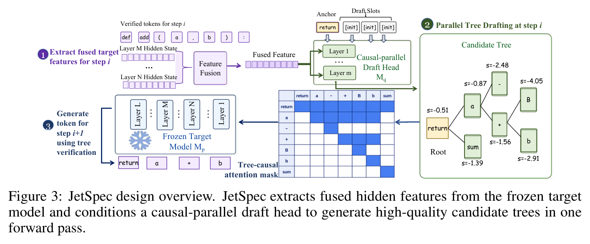

2. **给出 speculative decoding scaling 的明确瓶颈表达。** 论文用 i.i.d. acceptance 假设说明，draft length $N$ 增大只有在 $\alpha$ 高且 $Nc$ 低时才有效。JetSpec 的定位就是同时压低 $c$ 和提升树路径的 effective acceptance。证据：Eq. 1/2，Figure 2。

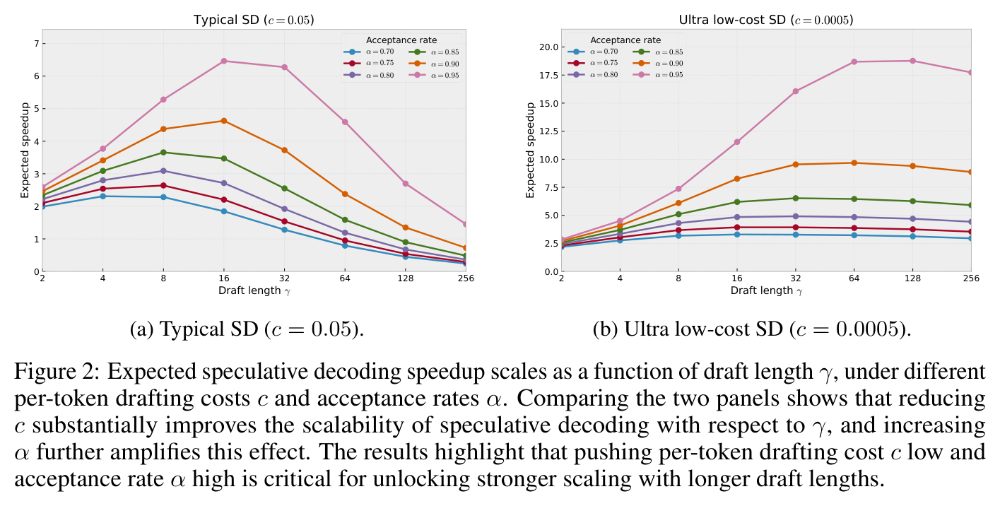

3. **用 causal parallel tree drafting 替代 diffusion tree 的 surrogate scoring。** Diffusion head 构树时优化的是

$$
q_{\mathrm{sur}}(y_{1:k}\mid x)
\propto
\prod_{i=1}^{k} r_i(y_i\mid x),
$$

而目标模型验证遵循

$$
p(y_{1:k}\mid x)
=
\prod_{i=1}^{k}p(y_i\mid x,y_{<i}).
$$

两者的差距就是 DDTree/DFlash-style tree 的结构性问题。JetSpec 的目标是通过 causal-parallel draft slots 让候选路径分布近似为

$$
q(\pi(v)\mid x)
=
\prod_{u\in\pi(v)}
q(y_u\mid x,h_x^o,\pi_{<u}),
$$

从而让树分支评分更接近 target 的 autoregressive factorization。

4. **给出高预算下的端到端证据。** 在 Qwen3-8B、temperature 0、tree budget 256 下，JetSpec 在 MATH-500 达到 9.64x speedup / $\tau=10.76$，MT-Bench 达到 4.58x / $\tau=5.94$；比 DDTree 的 8.78x / 9.81 和 4.26x / 5.41 更高。证据：Table 2，Figure 1。

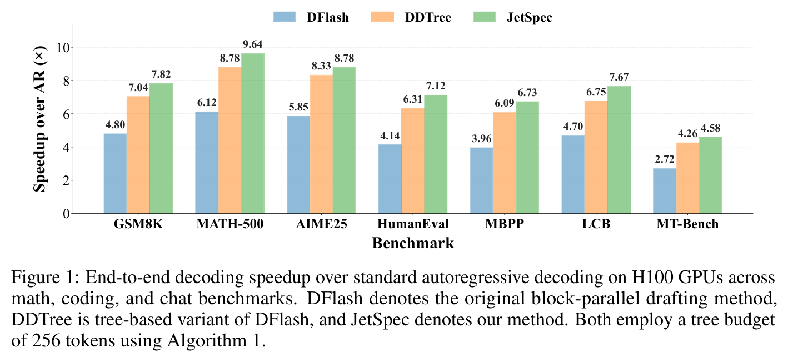

5. **给出机制失败案例和统计分布。** MATH-500 prompt 0 decode step 0 中，diffusion head 的 rank-1 branch 是 `given told that`，surrogate $\sum\log r=-3.76$，但 target conditional $\sum\log p=-63.32$ nats；causal head 的 rank-1 branch `are told that` gap 只有 -0.34。50 个 prompt 统计中，$\gamma=0$ 时 diffusion 的 median gap 为 +62.81 nats，causal 为 +12.36 nats。证据：Figure 4，Table 8/9。

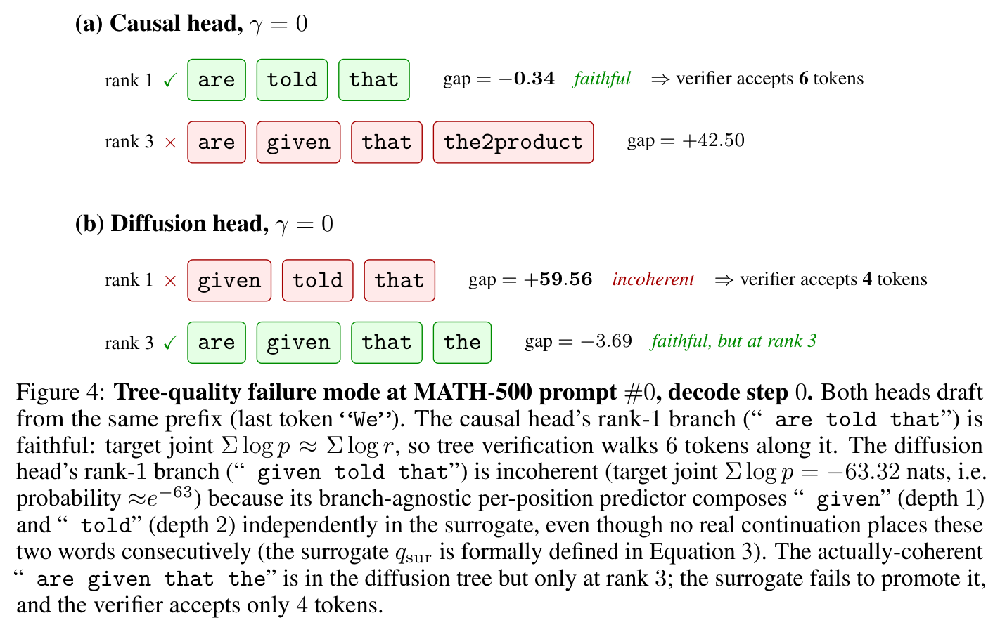

## 3. 研究方法

### 3.1 问题到方案的逻辑链

论文的逻辑链是：

1. speculative decoding 一轮先 draft 多个 token，再由 target 并行 verify；
2. 吞吐收益由每轮 accepted length 和 draft/verify 成本共同决定；
3. 单纯增大 draft length 会遇到 scaling ceiling，因为 $Nc$ 上升或 $\alpha$ 下降都会吞掉收益；
4. tree verification 能提高候选覆盖，但自回归 tree drafter 成本随深度增长；
5. block-diffusion head 成本低，但每个 depth 的预测不依赖具体 branch prefix，构出来的树可能内部不一致；
6. JetSpec 用 causal-parallel draft head 在一次 forward 中得到多 depth logits，同时通过 block-causal mask 保留 depth-wise 因果依赖，为后续 tree construction 提供比纯 diffusion marginal 更接近 AR joint 的 logits；
7. tree construction 用 cumulative log-prob best-first heap 填满 budget，target 用 tree attention 一次验证所有节点，提交最长 accepted path。

### 3.2 关键公式

speculative decoding 的期望前进 token 数：

$$
\mathbb{E}[\#\mathrm{tokens}]
=
\frac{1-\alpha^{N+1}}{1-\alpha}.
$$

对应 walltime speedup：

$$
\mathrm{Speedup}
=
\frac{1-\alpha^{N+1}}
{(1-\alpha)(Nc+1)}.
$$

这里 $N$ 是 draft token 数，$\alpha$ 是平均 acceptance rate，$c$ 是 drafter 单步相对 target 单步的成本系数。这个式子解释了为什么长 draft 只有在 $c$ 足够低、$\alpha$ 足够高时才有意义。

draft head 内的 block-causal mask 可抽象为：

$$
M_{i,j}^{\mathrm{draft}}
=
\begin{cases}
0, & j\le i,\\
-\infty, & j>i,
\end{cases}
$$

其中 prefix/anchor 对所有 draft slots 可见，而未来 slots 不可见。这个 mask 只约束 draft head 的 depth/slot 顺序，并不表示 draft head 内已经存在一棵显式 tree。

target verification 阶段的 tree-causal attention mask 可写为：

$$
M_{v,u}
=
\begin{cases}
0, & u\in \mathrm{Anc}(v)\cup\{v\},\\
-\infty, & \text{otherwise}.
\end{cases}
$$

节点 $v$ 的 masked attention：

$$
\mathrm{Attn}(Q_v,K,V)
=
\mathrm{softmax}
\left(
\frac{Q_vK^\top}{\sqrt{d}}+M_v
\right)V.
$$

这个 tree mask 的系统含义很直接：同一 branch 的祖先可见，兄弟 branch 与后代不可见，因此候选树节点仍能并行验证。也就是说，draft 阶段是 depth-wise block-causal，tree construction 之后的 target verification 才使用真正的 tree ancestor mask。

训练的 forward KL distillation：

$$
\mathcal{L}_{\mathrm{FKL}}^{(m)}
=
D_{\mathrm{KL}}
\left(
\tilde{p}^{(m)}\middle\|\tilde{q}^{(m)}
\right),
$$

$$
\mathcal{L}_{\mathrm{train}}
=
T_{\mathrm{KD}}^2
\frac{\sum_m w_m \mathcal{L}_{\mathrm{FKL}}^{(m)}}{\sum_m w_m}.
$$

论文选择 forward KL 的理由是 tree drafting 需要保留多个 plausible continuation 的相对偏好；reverse KL 更 mode-seeking，容易把概率质量压到单一模式上。Table 4 中 reverse KL 在 GSM8K/MATH-500/AIME25/AIME24 上明显掉速，支持这个判断。

tree construction 默认 branch score：

$$
s(\pi(v))
=
\sum_{u\in\pi(v)}
\log q(y_u\mid x,h_x^o,\pi_{<u}).
$$

Algorithm 1 用 priority queue 反复弹出最高分可扩展节点，并添加最多 $W$ 个 child，直到 node budget $B$ 用完。

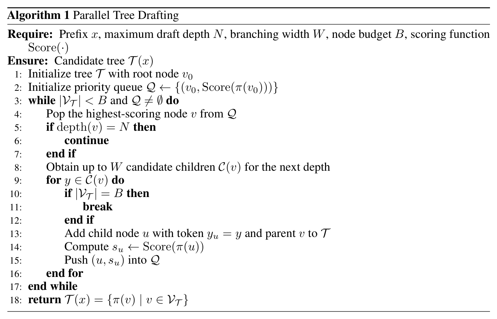

### 3.3 推理流程

每轮 decoding 可以拆成四步：

1. **target prefill / hidden extraction。** 冻结 target model，抽取多层 hidden states 并做 feature fusion，得到 $h_x^o$。
2. **causal-parallel draft。** draft head 输入 anchor 和 mask/fill slots，一次 forward 输出各 depth logits；不同 depth 之间通过 block-causal mask 约束可见性，此时还没有显式候选树。
3. **budgeted tree construction。** 对每个 depth 取 top-$W$ token/logprob，并按 cumulative log-prob 通过 heap 构造 $B$ 个节点的候选树。
4. **tree verification。** target model 用 tree attention 并行计算所有节点 logits；greedy 时沿 child map 找 target argmax 能匹配的最长 root-to-node path；non-greedy 时论文用 rejection sampling rule：

$$
\alpha_t
=
\min\left(
1,
\frac{p(y_t\mid x,y_{<t})}
{q(y_t\mid x,y_{<t})}
\right).
$$

开源代码在当前 commit 中主要实现 greedy/tree-argmax acceptance；`tree_accept` 沿 `child_maps[current_node][target_pred_token]` 走最长路径。

## 4. 关键结论

### 4.1 low-budget 下 JetSpec 与 DFlash 接近，但 32 token 时更稳定

Table 1 中 Qwen3-8B、temperature 0、budget 16 时，DFlash 与 JetSpec 很接近：例如 GSM8K 都是 4.80x，MATH-500 为 6.12x vs 6.06x，AIME25 为 5.85x vs 5.78x。原因是短线性 draft 已经覆盖很多高概率 continuation，causal tree 的额外结构优势还没有充分释放。

当 budget 从 16 增到 32，DFlash 常下降，例如 GSM8K 4.80x 降到 4.21x，MATH-500 6.12x 降到 5.39x；JetSpec 则在多数任务小幅提升或保持，例如 GSM8K 4.80x 到 4.89x，MATH-500 6.06x 到 6.35x。这个现象支持论文的核心说法：额外 draft budget 只有在 tree 分支有效时才会变成 accepted tokens。

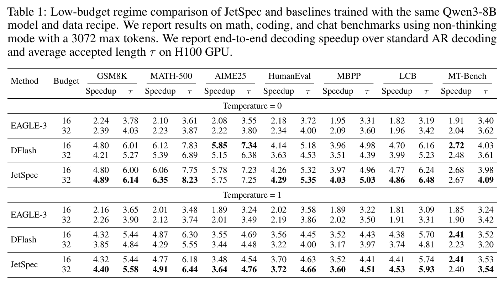

### 4.2 high-budget 是 JetSpec 的主要优势区

Table 2 中 temperature 0、budget 256 的关键数字：

- GSM8K：JetSpec 7.82x / $\tau=8.62$；DDTree 7.04x / 7.77。
- MATH-500：JetSpec 9.64x / 10.76；DDTree 8.78x / 9.81。
- AIME25：JetSpec 8.78x / 9.82；DDTree 8.33x / 9.24。
- HumanEval：JetSpec 7.12x / 7.78；DDTree 6.31x / 6.96。
- MBPP：JetSpec 6.73x / 7.43；DDTree 6.09x / 6.70。
- LiveCodeBench：JetSpec 7.67x / 8.79；DDTree 6.75x / 7.72。
- MT-Bench：JetSpec 4.58x / 5.94；DDTree 4.26x / 5.41。

temperature 1 下 JetSpec 仍领先 DDTree，但 AIME25 等更随机/困难任务的绝对 speedup 和 $\tau$ 会下降，例如 AIME25 budget 256 从 8.78x / 9.82 变为 5.94x / 7.06。结论是：causal tree drafting 对 sampling 有帮助，但 acceptance 仍受目标分布熵和采样温度限制。

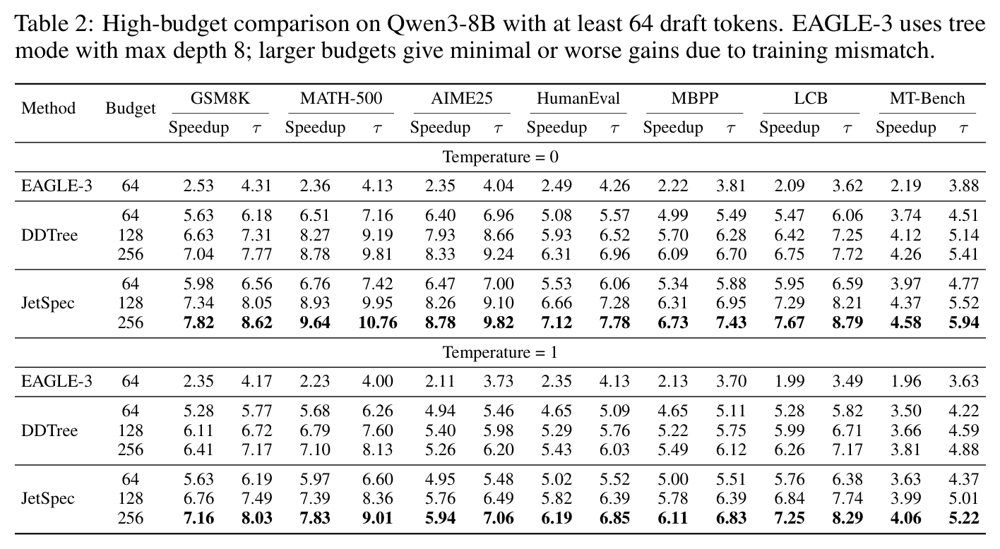

### 4.3 loss 和训练数据决定 tree 分支是否“覆盖多模态”

Table 4 显示 forward-KL 与 SFT 接近，reverse-KL 明显失败。MATH-500 上 SFT 为 8.42x / 9.98，forward-KL 为 8.46x / 10.01，reverse-KL 只有 5.25x / 6.59。这个结果与论文解释一致：tree drafting 需要保留多个备选分支，mode-seeking 的 reverse KL 会让候选覆盖变差。

Table 6 显示 regenerated target-model continuations 很重要。这里的 regenerated 不是普通数据增强，而是：给定原始样本的 prompt $x$，套用对应 chat template 后，让 frozen target model $M_p$ 自己继续生成一段 continuation $y_{\mathrm{target}}$，再用 $(x,y_{\mathrm{target}})$ 作为 draft head 的训练轨迹。JetSpec-Corpus 则直接使用原始训练语料中的 continuation $y_{\mathrm{corpus}}$。

这个区别对 speculative decoding 很关键：验证阶段接受 token 的标准是 target model 在同一上下文下是否会给出这些 token，而不是 corpus answer 是否合理或正确。因此，直接学 $y_{\mathrm{corpus}}$ 可能学到“人类/数据集答案分布”，但 target verification 看的是“目标模型生成分布”；用 $M_p$ regenerated continuation 能更好对齐 draft-target 分布。budget 256 时，JetSpec 在 GSM8K/AIME25/HumanEval/MBPP/LCB/MT-Bench 分别为 7.82/8.78/7.12/6.73/7.67/4.58x；JetSpec-Corpus 分别只有 3.36/3.66/3.53/3.27/4.42/2.63x。论文没有完整公开 regeneration 的采样温度、长度、过滤规则等细节，这是复现时需要补问的关键项。

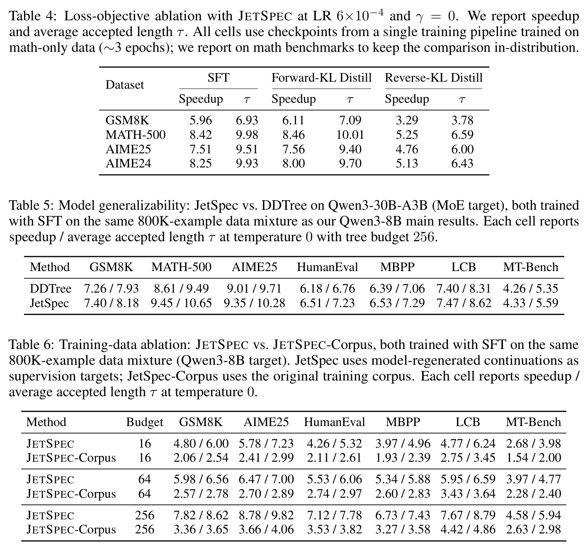

### 4.4 causal head 的收益不是只来自调 $\gamma$

Table 7 比较 causal head 和 diffusion head 在不同 DFlash-style depth weighting $\gamma$ 下的表现。causal head 从 $\gamma=0$ 到 15 都在 8.29-8.50x、$\tau\approx 9.8-10.0$；diffusion head 对 $\gamma$ 很敏感，$\gamma=0$ 只有 5.46x / 6.45，$\gamma=7$ 才到 8.36x / 9.72，$\gamma=15$ 又降到 6.17x / 7.19。

这说明 diffusion head 可以靠 loss weighting 被“推”出一定左到右偏置，但 causal head 的鲁棒性来自结构约束，而不是超参偶然调优。

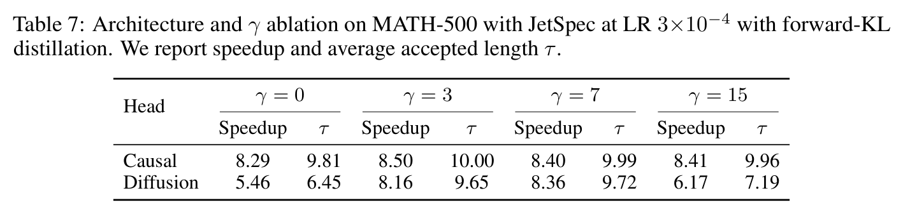

### 4.5 收益来源归因：tree 覆盖是大头，causal head 是高预算边际增益

这里需要把三个概念拆开：

- **tree candidate budget** 改变候选集合，能提高 target 正确 continuation 被覆盖的概率，因此直接影响 accepted length $\tau$。
- **tree attention / paged tree attention** 是 target verification 的执行机制，负责把一棵树低开销地并行验证；它主要影响 latency 和 wall-clock speedup，本身不改变候选质量。
- **causal head** 改变 per-depth logits 的条件化方式，让 tree construction 的高分路径更接近 target autoregressive joint，减少把边缘概率高但互相不一致的 token 拼成高分 branch。

用 Table 1/2 的 Qwen3-8B、temperature 0、7 个任务平均 $\tau$ 做一个粗分解，可以看到主收益来自“从线性候选变成大预算树”，JetSpec 相对 DDTree 的收益更像 causal head 的边际贡献。这个分解不是论文正式方差分解，只是基于表格数值的近似归因：

| 对比 | 平均 $\tau$ 变化 | 相对上一项 | 解释 |
|---|---:|---:|---|
| DFlash linear budget 16 $\rightarrow$ DDTree budget 256 | $5.93 \rightarrow 7.66$，$+1.73$ | $+29.1\%$ | 大预算树候选覆盖带来的主要 accepted length 提升 |
| DDTree budget 256 $\rightarrow$ JetSpec budget 256 | $7.66 \rightarrow 8.45$，$+0.79$ | $+10.3\%$ | 同样树验证框架下，causal head / 更好路径打分带来的增量 |
| DFlash linear budget 16 $\rightarrow$ JetSpec budget 256 | $5.93 \rightarrow 8.45$，$+2.52$ | $+42.4\%$ | tree coverage 与 causal head 叠加后的总效果 |

也就是说，如果按这个粗口径拆，DFlash 到 JetSpec 的 accepted-length 总增益中，约 $+1.73/+2.52\approx 69\%$ 来自 tree budget 覆盖，约 $+0.79/+2.52\approx 31\%$ 来自 JetSpec 相对 DDTree 的 causal/tree-quality 增量。更保守地说：**tree 是主增益，causal head 是让大树不浪费在 incoherent branch 上的增益**。

Table 7 则说明 causal head 的独立贡献有条件性：在 MATH-500 上，$\gamma=0$ 时 causal head 比 diffusion head 多 $+3.36$ accepted tokens（9.81 vs 6.45）；但 diffusion head 调到 $\gamma=7$ 后差距只剩 $+0.27$（9.99 vs 9.72）。因此 causal head 的关键价值不是“容量更大”，而是**不用靠 DFlash-style depth weighting 调参，也能稳定得到 left-to-right 兼容的高分路径**。

机制上，DFlash/DDTree 用 per-depth marginal 近似构树，容易出现 $r_1(y_1\mid x)$ 和 $r_2(y_2\mid x)$ 单独高、但 $p(y_2\mid x,y_1)$ 很低的组合。JetSpec 的 causal head 并不是对每个 tree branch 都重新 forward；它更像让第 2/3/... 个 draft slot 的 hidden state 沿 argmax/earlier-slot trunk 获得左到右条件化。论文附录也承认 off-argmax branch 仍可能继承 anchored marginal 偏差，所以 JetSpec 的收益应理解为“改善 tree head 的 rank-1 / high-rank branch quality”，而不是完整的 branch-conditional tree drafter。

### 4.6 tree construction scoring 的最佳默认值很朴素

Table 10 中 default `accum_logp` 在 MATH-500 达到 8.15x / 9.81；entropy-guided 只有 4.76x / 5.52；hybrid 在 $\alpha \le 1$ 时与 accum-logp 接近，但 $\alpha$ 越大越差。论文的实用结论是：在 drafter logits 已经较好时，按 cumulative log-prob 做 best-first expansion 足够稳健；单看 entropy 会把 budget 花在“不确定但不一定可接受”的区域。

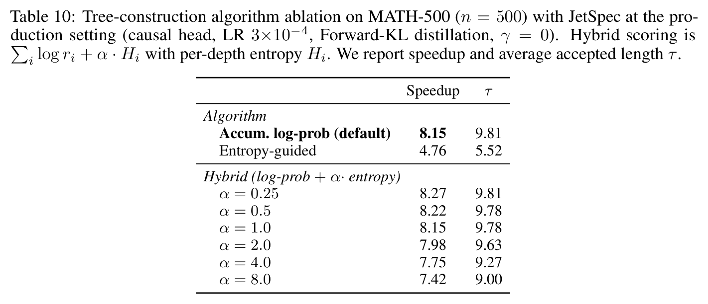

### 4.7 serving 中 tree budget 是负载相关旋钮

Table 11 的表格数字显示，batch size 1 时 budget 16/32/64/128 的 TPS 为 224.0/312.0/447.3/553.3，对 AR 的 speedup 为 1.75x/2.44x/3.50x/4.33x；batch size 16 时对应为 891.8/1094.6/995.8/803.1，speedup 为 3.10x/3.81x/3.47x/2.80x。

这说明低 batch/低负载下更大 tree budget 更有价值；高 batch 下 verification 和 memory pressure 变重，过大 budget 会降低吞吐。这里还要注意一个论文内不一致：正文 Section 3.3 说 batch size 1 从 budget 16 到 128 是 443.3 到 968.2 TPS、3.09x 到 6.75x，但 Table 11 实际显示 224.0 到 553.3 TPS、1.75x 到 4.33x；附录文字还一处写 HumanEval，而表 caption 写 Math-500。解读时应以表格为准，并把该不一致列为复现前的待确认项。

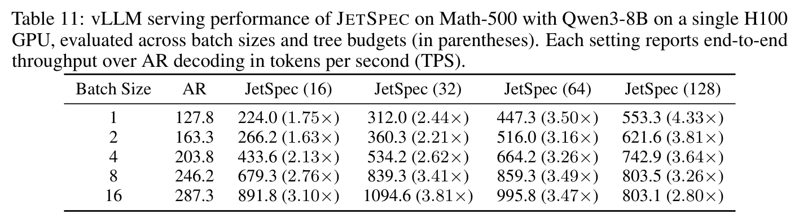

## 5. Related Work 对比

| 类别/论文 | 方法核心 | 优点 | 局限 | 与本文关系 |
|---|---|---|---|---|
| 原始 speculative decoding | 小 drafter 生成线性候选，target 并行验证 | lossless，部署概念简单 | accepted length 受 longest-prefix 限制；大 draft 不一定带来收益 | JetSpec 仍遵守 target verification，只把线性候选换成 causal tree |
| Medusa / SpecInfer / EAGLE tree mode | 多分支 token tree + tree attention verification | 提高候选覆盖，能提升 accepted length | 许多方法的 draft 过程仍有自回归或多 head 依赖，draft cost 随深度/分支上升 | JetSpec 借鉴 tree verification，但强调 one-forward causal-parallel drafting |
| EAGLE-3 | 使用 target 多层 feature fusion，直接预测 token | draft 质量强，路径条件化更自然 | tree/深度扩展有 sequential drafting overhead | Table 1/2 中 EAGLE-3 speedup 明显低于 JetSpec，尤其 high-budget |
| DFlash | block-diffusion draft head，一次生成多个位置 | per-token draft cost 极低 | per-position marginal branch-agnostic，构树时可能内部不一致 | JetSpec 继承低成本 draft head 思路，但加入 block-causal/causal-parallel mask |
| DDTree | 用 DFlash per-depth distribution 构 draft tree | 能把 DFlash 从线性扩成 tree | surrogate $\prod_i r_i(y_i\mid x)$ 与 target AR joint 不一致 | JetSpec 主要对比对象；Figure 4/Table 8-9 直接解释 DDTree 式失败 |
| Jacobi / diffusion LLM / self-speculative | 改变目标模型自身的并行生成或提前层 draft | 可能减少 decoding round | 常涉及模型训练/结构改变，或作用在 target 本身 | JetSpec 是 head-based post-training，加在冻结 target 上 |

## 6. Infra 需求分析

### 6.1 算力

JetSpec 每轮成本可以抽象为：

$$
T_{\mathrm{cycle}}
\approx
T_{\mathrm{draft\_head}}(N)
+T_{\mathrm{tree\_build}}(B,W)
+T_{\mathrm{verify}}^{\mathrm{tree}}(B,L)
+T_{\mathrm{accept/commit}}.
$$

相比线性 DFlash，新增的主要不是 draft head forward 次数，而是：

- tree construction 的 CPU/GPU top-k + heap 构造；
- target verify 从线性 block 变成 $B$ 个 tree node；
- tree attention mask / ancestor relation / KV compaction 的系统开销。

速度提升成立的条件是：

$$
\frac{\tau_{\mathrm{JetSpec}}}{T_{\mathrm{cycle,JetSpec}}}
>
\frac{\tau_{\mathrm{baseline}}}{T_{\mathrm{cycle,baseline}}}.
$$

Table 12 说明低 $c$ 是现实可达的。在 H200 NVL、Qwen3-8B + DFlash b16 配置下，$L=1024,N=16$ 时 $c=0.845\%$，$N=256$ 时 $c=0.054\%$。这支持 Figure 2 的 ultra-low-cost 假设，但只说明 draft head 成本可被摊薄；tree verification 是否划算仍依赖 accepted length。

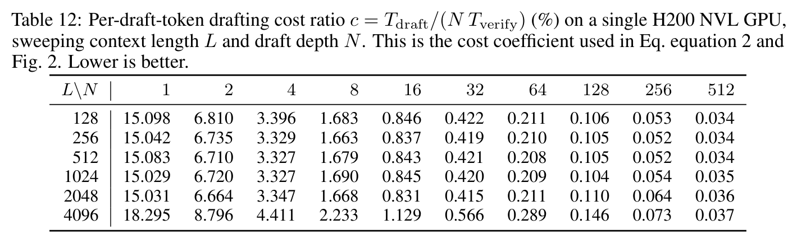

### 6.2 显存与 KV cache

每轮 tree verification 至少需要为 $B$ 个候选节点临时写入 target KV。粗略估计单层 KV 字节数：

$$
\mathrm{KVBytes}_{\mathrm{layer}}
=
2\cdot B\cdot H_{\mathrm{kv}}\cdot d_{\mathrm{head}}\cdot s,
$$

其中 $2$ 表示 K/V，$s$ 是 dtype bytes。全模型乘以层数 $L_{\mathrm{layer}}$。如果 naïve 保存全部未接受节点，会造成浪费；因此实现需要在 verify 后只保留 accepted path 的 KV，丢弃 rejected nodes。

开源代码的 reference path 在 `jetspec/core/llm.py` 中用 `_select_kv_cache` 根据 accepted tree indices 选择/压缩 KV；高吞吐 engine path 在 `inference_engine` 中使用 paged KV 与 logical KV slots，减少每轮 gather/拷贝开销。

### 6.3 带宽与互联

单机单卡 serving 主要是 HBM 带宽和 kernel launch/调度问题；多卡场景还会叠加 tensor parallel 的 KV/attention 通信。tree verification 的附加通信/带宽压力可粗略写成：

$$
\mathrm{Bytes}_{\mathrm{verify}}
\propto
B\cdot L_{\mathrm{layer}}\cdot
\left(\mathrm{ReadKV}_{\mathrm{prefix}}+\mathrm{WriteKV}_{\mathrm{nodes}}\right).
$$

当 batch size 增大，target verification 更接近 compute/memory bound，Table 11 中大 budget 收益下降，说明“更大树”在高负载下可能不如中等树。

### 6.4 调度、Serving、自定义算子

JetSpec 的工程关键点：

- **tree attention mask。** 每个 tree node 只看 prefix 与祖先；reference path 可以用 SDPA/4D mask 或 Triton hook。
- **paged KV。** serving path 不能每轮重排大段 KV；需要 block table、logical slots 或低成本 gather。
- **shape bucketing / CUDA graph。** tree node 数 $B$ 变化会导致编译/捕获形状爆炸；代码里 `_TREE_BUCKETS=(16,32,64,128,192,256)` 用 padding 将节点数对齐到少数 bucket。
- **accept/commit 逻辑。** target verify 后需要快速找到最长 accepted path，并将 correction token 作为下一轮 anchor。
- **动态 budget 策略。** 论文当前主要报告 static budget；Table 11 暗示实际 serving 应根据 batch size/request rate 动态选择 budget。

## 7. 开源代码对照

仓库：`https://github.com/hao-ai-lab/JetSpec`  
commit：`2c7b3fae75690dfe9a188a37d7fdfd43ee0e032f`  
本地路径：`../../_artifacts/source/2606.18394v3_JetSpec_Breaking_the_Scaling_Ceiling_of_Speculative_Decoding_with_Parallel_Tree_Drafting/code/JetSpec/`

| 论文机制 | 本地路径 | GitHub commit 链接 | 一致性判断 |
|---|---|---|---|
| causal parallel draft head / block-causal mask | `jetspec/models/draft_head.py:97`, `:113`, `:125`, `:188` | `https://github.com/hao-ai-lab/JetSpec/blob/2c7b3fae75690dfe9a188a37d7fdfd43ee0e032f/jetspec/models/draft_head.py#L97-L204` | 一致。代码通过 `dflash_config.causal_head` 和 `_build_dflash_causal_attention_mask` 控制 causal head，并将 `target_hidden` 注入 K/V。 |
| draft head 输出 per-depth logits | `jetspec/draft_head_adapter.py:164`, `:184`, `:194` | `https://github.com/hao-ai-lab/JetSpec/blob/2c7b3fae75690dfe9a188a37d7fdfd43ee0e032f/jetspec/draft_head_adapter.py#L164-L202` | 一致。`DraftHeadTreeDrafter.propose_logits` 一次返回 `(1, depth, V)` logits；也有 conditioned rerun 接口。 |
| cumulative-logprob tree construction | `jetspec/tree/baselines/accum_logp.py:43`, `:74`, `:93`, `:118`, `:131` | `https://github.com/hao-ai-lab/JetSpec/blob/2c7b3fae75690dfe9a188a37d7fdfd43ee0e032f/jetspec/tree/baselines/accum_logp.py#L43-L143` | 一致。代码先 `log_softmax` 和 `topk`，再用 heap 按 cumulative logprob 扩展。 |
| tree accept / greedy verification | `jetspec/tree/_core/accept.py:144`, `:166`, `:175`, `:181` | `https://github.com/hao-ai-lab/JetSpec/blob/2c7b3fae75690dfe9a188a37d7fdfd43ee0e032f/jetspec/tree/_core/accept.py#L144-L183` | 部分一致。代码覆盖 greedy target-argmax 路径；论文还给出 non-greedy rejection sampling 公式。 |
| reference tree generation loop | `jetspec/core/llm.py:320`, `:389`, `:489`, `:512`, `:572`, `:589` | `https://github.com/hao-ai-lab/JetSpec/blob/2c7b3fae75690dfe9a188a37d7fdfd43ee0e032f/jetspec/core/llm.py#L320-L589` | 一致。每轮 propose logits、build tree、tree attention verify、accept path、KV select。 |
| paged tree attention kernel | `jetspec/inference_engine/paged_tree_attn.py:17`, `:55`, `:234`, `:282` | `https://github.com/hao-ai-lab/JetSpec/blob/2c7b3fae75690dfe9a188a37d7fdfd43ee0e032f/jetspec/inference_engine/paged_tree_attn.py#L1-L360` | 一致。`qq_bias` 是 tree ancestor mask，kernel 直接从 paged KV block pool 读取 K/V。 |
| serving engine / bucket / logical KV | `jetspec/inference_engine/engine.py:36`, `:54`, `:234`, `:465`, `:673`, `:929` | `https://github.com/hao-ai-lab/JetSpec/blob/2c7b3fae75690dfe9a188a37d7fdfd43ee0e032f/jetspec/inference_engine/engine.py#L36-L1057` | 一致。实现包含 tree-N bucket、compiled/cudagraph backends、logical KV path。 |

### 7.1 开源权重与 HF 配置对比

JetSpec README 明确列出公开 draft-head 权重，HF model API 显示 `JetSpec/jetspec-qwen3-8b` 为 `private=false`、`gated=false`，包含 `config.json`、`dflash.py`、`model.safetensors`、`training_state.pt`；`safetensors` 参数量为 1,048,626,432 BF16。当前环境直连 Hugging Face 超时，以下配置字段通过 `hf-mirror.com` 的同名 raw/API 端点读取。

| 权重 | 参数量 | block size | draft 层数 | hidden/intermediate | heads/KV heads | target layer ids | causal 标志 |
|---|---:|---:|---:|---|---|---|---|
| `JetSpec/jetspec-qwen3-8b` | 1.048B BF16 | 16 | 5 | 4096 / 12288 | 32 / 8 | `[1,9,17,25,33]` | `dflash_config.causal_head=true` |
| `z-lab/Qwen3-8B-DFlash-b16` | 1.048B BF16 | 16 | 5 | 4096 / 12288 | 32 / 8 | `[1,9,17,25,33]` | 无 `causal_head` 字段 |
| `JetSpec/jetspec-qwen3-30b-a3b` | 474M BF16 | 16 | 8 | 2048 / 6144 | 32 / 4 | `[1,12,23,34,45]` | `dflash_config.causal_head=true` |

这对前面的归因很重要：Qwen3-8B 上 JetSpec 和 DFlash b16 的 draft head 容量基本相同，都是 `DFlashDraftModel`，参数量、层数、宽度、block size、target feature layers 一致。JetSpec 的结构差异集中在 `causal_head=true` 触发的 block-causal attention mask，以及与之匹配的训练方式；因此不能把收益解释为“比原始 DFlash 加深/加宽”，更应解释为同等容量 head 下的 causal conditioning 与 tree-quality 改善。

代码没有完整覆盖的部分：

- 论文中的训练数据生成、forward-KL/reverse-KL 训练脚本未在当前浅克隆仓库中看到；仓库更偏推理与 benchmark。
- README 提到独立 vLLM integration 仓库 `https://github.com/JetSpec-project/vllm-jetspec`；本文未克隆该仓库，因此 vLLM fork 级别的代码未验证。
- 当前代码的 `tree_accept` 主要是 greedy acceptance；论文的 non-greedy rejection sampling 公式需要进一步查实现或复现实验脚本。

## 8. 优点与局限

### 优点

- 把 speculative decoding 的 scaling ceiling 讲清楚了：不是“draft 越长越好”，而是必须同时满足低 $c$ 和高 $\alpha$。
- JetSpec 的结构改动很聚焦：在 low-cost parallel draft head 内加入 block-causal mask，尽量不牺牲 one-forward drafting。
- 实验不只给主结果，还用 Figure 4 / Table 8-9 解释 diffusion tree 为什么会构出 incoherent branch。
- 代码开源质量较好，tree algorithm、reference engine、paged tree attention、compiled/cudagraph serving path 都能对应论文机制。

### 局限

- 训练代码不完整公开，forward-KL、数据 regeneration、teacher logits 对齐等训练细节难以代码级复现。
- high-budget 结果依赖 tree attention kernel、CUDA graph、paged KV 等系统优化；没有这些优化时，accepted length 提升不必然转成 wall-clock speedup。
- Table 11 的正文描述、表 caption 和表格数值存在不一致，serving 结果需要进一步核验原始日志。
- 主体评估集中在 Qwen3 系列；对 Llama、Gemma、DeepSeek、长上下文、多轮 tool-call 等场景的泛化还不清楚。
- greedy 与 non-greedy decoding 的实现覆盖程度不同。论文主表同时报告 temperature 0/1，但开源核心 acceptance 代码更明确覆盖 greedy argmax path。
- tree budget 是静态 sweep；实际在线 serving 需要动态 budget scheduler，否则高负载下大树可能反而损害吞吐。

### 可改进之处

- 开源完整训练 pipeline：数据 regeneration、teacher logits 缓存、forward-KL/reverse-KL、loss weighting、checkpoint 配置。
- 给出 per-round telemetry：draft head latency、tree build latency、verify latency、KV gather/commit latency、accepted length 分布。
- 增加动态 budget policy：根据 batch size、queue length、prompt/task 类别、最近 acceptance 率调节 $B$ 和 $W$。
- 给出多模型、多硬件、多服务负载的统一 profiling 表，特别是 H100/B200/H200 和不同 TP size。

## 9. 研究启发

- **并行 draft 不应只看位置边缘概率。** 只要最终 verification 是 autoregressive，候选树的 scoring 就应该尽量贴近 branch-conditioned joint。
- **tree budget 是资源分配问题。** 更多 node 不一定更好，关键是把 node 放在 target 可能接受的路径附近。
- **draft training 目标要保留多候选信息。** forward KL 或软标签 distillation 对 tree drafting 比 reverse KL 更合理，因为树需要多个候选分支。
- **系统优化与算法同等重要。** JetSpec 的接受长度提升需要 tree attention、paged KV、CUDA graph 等把 overhead 压下来，才能变成真实 speedup。
- **可做复现实验。** 最小闭环可以从 Qwen3-8B + JetSpec draft head + `examples/tree/jetspec_tree_generate.py` 或 `bench/reference/benchmark.py` 开始，先验证 $\tau$，再换 engine path 测 TPS。

## 10. 解读问题/待验证清单

1. Table 11 的正文数值、caption 数据集和表格数值为什么不一致？最终应以哪份日志为准？
2. temperature 1 的 non-greedy acceptance 在开源仓库中对应哪条代码路径？是否完整实现 rejection sampling correction？
3. forward-KL distillation 的 teacher logits 是全 vocab 还是 top-k 近似？温度 $T_{\mathrm{KD}}$ 具体是多少？
4. regenerated training sequences 的采样温度、长度、chat template、过滤规则是什么？
5. causal head 对非 Qwen3 架构是否仍稳定？尤其是不同 RoPE、GQA/MQA、MoE routing 下的实现成本。
6. draft head 的 block-causal mask 与 verification 阶段的 tree-causal mask 如何对应？off-argmax branch 是否仍存在一定“argmax anchored marginal”偏差？
7. high-budget 256 下 tree verification 的单轮 latency 构成是什么？tree build 和 accept/commit 占比多少？
8. 在高并发 serving 中，动态 budget 是否比静态 64/128/256 有明显收益？
9. 代码的 `inference_engine` 与论文提到的 vLLM integration、README 指向的 `vllm-jetspec` 仓库之间差异是什么？
10. 如果要复现 Table 2，需要哪些公开 checkpoint？Hugging Face 上的 draft head 是否对应论文最终版本？

## 11. 一句话总结

JetSpec 的核心价值是把低成本 block-parallel drafting 和 depth-wise causal conditioning 合在一个 head 里，再通过 tree construction 与 tree verification 把大 tree budget 更稳定地转化为 accepted length；最大不确定性在于训练 pipeline 未完整开源、serving 表存在数值不一致，系统级 speedup 需要按具体 engine 与负载重新验证。
