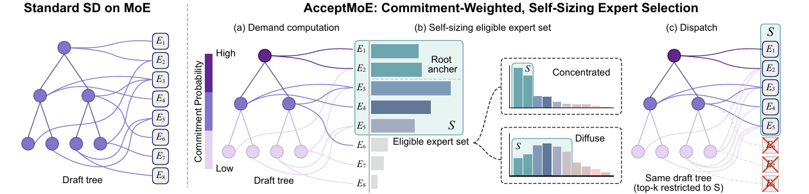
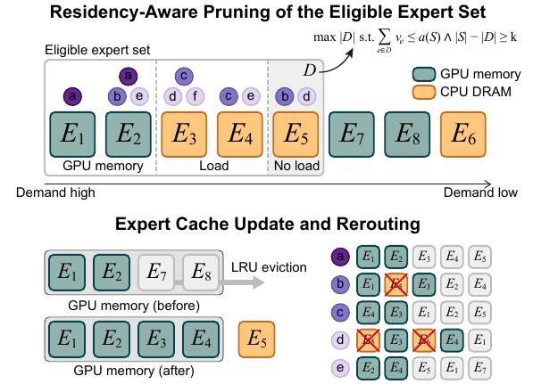
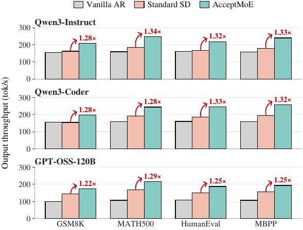
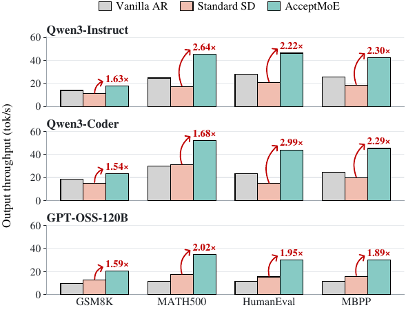
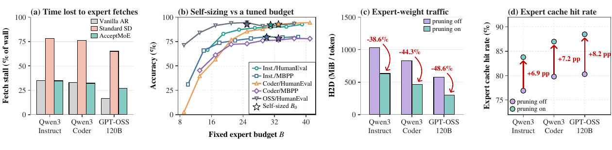

---
tags:
  - paper
  - collection/speculative-decoding
  - domain/model-systems
  - status/deep-review
  - topic/moe-speculative-decoding
  - method/commitment-weighted-expert-selection
---

# AcceptMoE 精读分析

> [!info] 文档关系
> - 文档类型：Paper
> - 领域入口：[README](../README.md)
> - 上位汇总：[Evolution](../surveys/evolution.md)
> - 证据资产：`../assets/papers/acceptmoe/`
> - 相关文档：[Figure inventory](../evidence/acceptmoe-figure-inventory.md)

> 资料状态：已核验 arXiv `2608.02989v1` PDF、TeX 源码和 10 页文本；图表由源码中的 vector PDF 转为 PNG。未发现公开代码仓库或 OpenReview 评审记录，因此实现与评审结论只按论文证据表述。

## 修订信息

- 当前文档版本：`1.1.0`
- 当前修订 ID：`rev-acceptmoe-visual-completeness-20260901`
- 当前修订时间：`2026-09-01T21:10:00+08:00`
- 替代版本：`rev-acceptmoe-initial-20260901` / `1.0.0`

| 修订 ID | 文档版本 | 时间 | 类型 | 替代修订 | 变更摘要 | 依据 | 对结论影响 |
|---|---|---|---|---|---|---|---|
| `rev-acceptmoe-initial-20260901` | `1.0.0` | `2026-09-01T12:00:00+08:00` | `initial` | 无 | 建立单篇因果闭环、公式卡、图表证据、基础设施分析和发布链路 | arXiv v1 PDF/TeX；结构与语义校验 | none |
| `rev-acceptmoe-visual-completeness-20260901` | `1.1.0` | `2026-09-01T21:10:00+08:00` | `evidence-update` | `rev-acceptmoe-initial-20260901` / `1.0.0` | 将 Figure 2–5 嵌入正文并固化示意图完整性要求 | 用户反馈；Figure inventory；发布器校验 | minor |

## 0. 资料与配图索引

- 论文：`arXiv:2608.02989v1`，arXiv `2608.02989v1`。
- 源码/LaTeX：`arXiv source archive`，归档为 `source.tar.gz`。
- 开源代码：未找到；代码状态为 unavailable，不据 README 推断。
- OpenReview：未找到；公开评审/decision/rebuttal 不适用。
- 提取文本：`PDF/TeX extraction`。
- 原始图：Figure 1（算法总览）、Figure 2（驻留感知剪枝）、Figure 3（全驻留吞吐）、Figure 4（offload 吞吐）、Figure 5（消融）；正式 PNG 位于 `../assets/papers/acceptmoe/`，完整 bbox/caption/QA 见 [figure_inventory](../evidence/acceptmoe-figure-inventory.md)。
- AI 生成分析图：不需要；原始 Figure 1 已显示输入、阶段、输出和推理边界。

## 0.1 术语与符号解释

### 0.1.1 术语表

| 术语 | 本文含义 | 不等于/易混项 | 来源 |
|---|---|---|---|
| MoE | 混合专家目标模型；每个 token 只路由到 top-k 专家 | 不等于所有专家同时计算 | §1, §3 |
| verification block | 一次 target 前向中并行验证的 draft tree 节点集合 | 不等于最终接受前缀 | Eq. 1 前 |
| commitment probability | 某 draft 位置节点最终落在已接受输出前缀上的边际概率 | 不等于条件 acceptance rate | §3.2 |
| eligible expert set | 验证块中允许被 router 选择的专家集合 | 不等于自然路由 union | Eq. 2 |
| effective rank | 需求分布熵的指数，用于自动决定集合大小 | 不等于参数量或固定 budget | Eq. 5 |
| residency-aware pruning | 根据 GPU expert cache 当前驻留状态删除低需求非驻留专家 | 不等于预测自然 route 后预取 | §3.4 |
| rerouting budget | 形成集合 S 已造成的自然 token assignment 位移数量，允许剪枝再增加同等位移 | 不等于传输字节预算 | Eq. 6 |
| Standard SD | EAGLE-3 draft + target natural top-k routing | 不等于 Vanilla AR | §4 |

### 0.1.2 符号表

| 符号 | 含义 | 性质 | 作用域/单位 | 来源 |
|---|---|---|---|---|
| $E,k$ | 专家总数、每 token 路由专家数 | author-defined | layer / count | §3.1 |
| $\mathcal V,K_t$ | 验证块、token 的自然 top-k 专家集合 | author-defined | block/token | Eqs. 1–2 |
| $\mathcal V,T,t,d_t$ | 验证块、块中 token 数、token 索引、draft 位置 | author-defined | block/token | §3.1 |
| $z_t,r_t,K_t$ | router logits、softmax 概率、自然 top-k 集合 | author-defined | token/expert | Eqs. 1–2 |
| $S,A,R$ | eligible 集合、root anchor 集合、非 anchor 专家 | author-defined | layer/block | §3.1–3.3 |
| $\widehat p_d,N_d,\beta,\alpha_t$ | 位置 commitment 估计、该位置节点数、权重指数、token importance | author-defined | position/token | Eq. 3 |
| $u_e,q_e,n_{er}$ | 专家 utility、归一化需求、effective-rank cardinality | author-defined | expert | Eqs. 4–5 |
| $\mathcal H,C,D,v_e,a(S),X$ | 驻留集合、非驻留集合、删除集合、自然 assignment 数、位移预算、GPU 槽位数 | author-defined | layer/runtime | §3.4, Eq. 6 |

## 0.2 算法总览

> 图注：原论文 Figure 1，展示 demand computation、self-sizing eligible set 和 constrained dispatch；原始 caption 及 bbox 见 `../evidence/acceptmoe-figure-inventory.md`。

## 1. 论文基本信息

- 标题：AcceptMoE: Commitment-Weighted Self-Sizing Verifier Expert Sets for Efficient MoE Speculative Decoding
- arXiv：2608.02989v1，2026；10 页，5 个 figure。
- 作者（按顺序）：Shuang Liang；Hao (Mark) Chen；Zhiwen Mo；Qianzhou Wang；Guoyu Li；Lingxiao Ma；Wayne Luk。
- 第一作者：Shuang Liang（first listed author），机构 1 Imperial College London。
- 通讯作者：论文标题页以邮箱 `shuang.liang@imperial.ac.uk` 标示 Shuang Liang（title-page contact email）；机构 1 Imperial College London。
- 其余作者机构（去重）：Imperial College London；Tile-AI。
- 机构证据：PDF 标题页的上标 1/2 与 affiliations 行；未推断未标注身份。
- 角色证据短语：first listed author；title-page contact email；PDF title block, affiliation 1；PDF title block email and affiliation 1；paper.pdf first page title block and affiliations。
- 研究领域：MoE 推理、speculative decoding、专家 offloading。
- 核心问题：树验证中的专家 union 和 offload 传输成本不随 token 数同步下降。
- 关键约束：验证块固定后才选专家；约束路由会改变 target 分布；batch size=1、单卡评测。

## 2. 研究动机与问题—方案闭环

自回归模型每个输出 token 都需要一次完整 target 前向。Speculative decoding 用 EAGLE-3 先提出树，再一次验证多个节点；但 MoE target 的成本由“所有节点自然 top-k 专家的 union”决定。被拒绝分支仍会触发专家权重访问。作者引用的 Qwen3-30B-A3B 例子显示，EVICT 可减少 74.7% verified tokens，却只减少 32.5% activated experts，说明减少节点不是减少专家访存的充分条件（Introduction）。

第二个痛点是固定 expert budget：MoE-Spec 必须预先给每层预算 B，而论文的五组 sweep 表明最佳 B 随模型—任务变化。第三个痛点是 offload：同样大小的集合，如果成员不在 GPU cache，仍会产生 H2D 权重加载。AcceptMoE 的目标是把“预计会提交的节点需求”和“当前 cache 驻留”纳入 verifier-side eligibility。

### 2.1 现有方案为何不够

具体场景：根节点和兄弟节点选择不同专家，最终只接受一条路径但 union 仍很大。简单修补失败：只减少节点不保证路由集中。

| 旧做法 | 可观察失败 | 具体场景 | 根因 | 为什么简单修补不够 | 证据 |
|---|---|---|---|---|---|
| Natural routing | 拒绝分支也加载专家，union 大 | 本文构造说明例：根节点和 63 个 sibling 各选不同专家；最终只接受一条路径，但一次验证仍触碰几十个专家 | token 数与 expert union 是不同量 | 只减少 draft 节点可能保留高分散路由；需要改变 verifier eligibility 或预取策略 | §1；引用 EVICT 数据 |
| 固定 B 的 MoE-Spec | B 跨任务不稳 | GPT-OSS HumanEval 的最佳 B=25；把它用于 Qwen3-Coder 同任务比该模型最佳固定 B 低 9.1 个百分点 | 需求分布随模型/任务/块变化 | 调一个全局 B 保护最坏任务会浪费其他任务的计算 | Fig. 5b，§5.3 |
| 自然 route + prefetch | cache miss 仍造成传输等待 | §5.2 中 Standard SD 65%–78% wall time 等待 expert fetch | 成本取决于 nonresident 成员而非 cardinality | 预测 route 只改变加载时序，不减少被请求的 union | Fig. 5a,c,d |

### 2.2 目标与成功标准

目标：每个 layer/block 构造小而覆盖关键提交路径的专家集合，并在 offload 时适配 resident cache。成功标准是准确率接近 Standard SD，同时提高 tok/s、降低 H2D bytes/token 和 fetch-wait share。明确不保证 target distribution-preserving：Eq. 2 的 mask 会改变 router 分布。

### 2.3 方案如何改变变量

| 问题 | 设计 | 改变的变量/行为 | 预期指标 | 判断 |
|---|---|---|---|---|
| 分支需求被等权计数 | $\widehat p_d^\beta$ commitment weighting | token utility 权重 $\alpha_t$ | 更高准确率/相同 accepted length | 直接 matched-budget 支持 |
| budget 需人工给定 | effective rank | $|S|$ 随 block demand 熵变化 | 免 sweep，平均损失小 | 部分支持 |
| nonresident 专家拖慢 offload | residency pruning | $S\to S'$，减少 nonresident eligibility | H2D、cache hit、吞吐 | 直接消融支持；准确率代价存在 |

因果链是：MoE 树验证产生分散 expert union -> 拒绝分支造成无效访存 -> 用提交概率重加权 router demand 并约束 $S$ -> 限制执行专家数；offload 再用 cache 状态剪枝 -> 减少 fetch stall。准确率和吞吐测量支持这条链，但“约束路由本身不会伤害更广泛任务分布”没有被验证。

## 3. 核心贡献与创新点

1. commitment-weighted demand：在 matched $B_0$ 下，AcceptMoE-fix 比 MoE-Spec 平均高 2.45 个百分点（Table 1）。
2. self-sizing：用需求熵的 effective rank 自动定大小；五个 sweep 点平均比最佳测量固定 B 低 0.97 个百分点，最坏低 1.83。
3. residency-aware pruning：相对关闭 pruning，流量下降 38.6%–48.6%，平均准确率变化 -0.27 个百分点。

## 4. 研究方法

### 4.1 方法流程

EAGLE-3 先生成 5-step、最多 64 节点的 draft tree。对每个 MoE layer，target router 输出 logits；AcceptMoE 根据节点位置 commitment 估计加权，保留 root natural top-k anchor，再按 utility 排名和 effective rank 选择非 anchor 专家。验证时所有 token 的 top-k 被限制在 S 内。offload 时读取当前 LRU resident set，按低 utility 顺序删除可删除的 nonresident 专家，得到 $S'$。

> 图注：原论文 Figure 2，展示驻留感知剪枝如何按需求排序删除非驻留专家，并通过 rerouting 更新 GPU expert pool。

### 4.2 关键公式与解释卡

$$U_{\mathrm{nat}}(\mathcal V)=\bigcup_{t\in\mathcal V}K_t$$

**这条公式在算什么？** 计算专家 union：一次验证会触碰多少个不同专家。

**怎么读？** 把块内每个 token 的自然 top-k 集合取并集。

**输入与输出。** 输入是 token 集合和每 token 的 $K_t$；输出是专家集合。

**变量在这里各做什么？** $\mathcal V$ 是验证节点，$K_t$ 是 token 的自然专家集合。

**直觉。** 分支越多且路由越分散，union 越大。

**边界。** 这是自然路由的逻辑 union，不等于实际 waves、cache miss 或 H2D bytes。

**小例子。** 4 个 token、每个 top-2 且无重叠时，union=8；最终只接受 1 条路径也不会自动把 union 变成 2。

$$\widetilde K_t(S)=\mathrm{TopK}_k(z_t+M_S)$$

**这条公式在算什么？** 在允许集合 S 内重新路由 token。

**怎么读？** 非 S 专家的 logit 设为 $-\infty$，再取 top-k。

**输入与输出。** 输入是 logits $z_t$、集合 S；输出是受限 top-k 集合。

**变量在这里各做什么？** $M_S$ 在 S 内为 0，外部为 $-\infty$；$k$ 是路由数量。

**直觉。** S 越小，专家计算和访存上限越低，但被迫 reroute 的 token 越多。

**边界。** 这会改变 target router 分布，因此不是 lossless 优化；S=[E] 才恢复 Standard SD。

**小例子。** 若自然 top-2 是 {E1,E7} 而 S={E1,E2}，E7 会被 E2 替代，输出分布可能改变。

$$\alpha_t=\widehat p_{d_t}^{\,\beta}N_{d_t}^{-1/2},\qquad u_e=\sum_t\alpha_t r_{t,e}\mathbf1[e\in K_t]$$

**这条公式在算什么？** 估计专家 e 对“最终可能提交”的需求。

**怎么读？** router 概率乘位置提交概率，再对块内 token 求和。

**输入与输出。** 输入是离线 $\widehat p_d$、层宽 $N_d$、router 概率；输出是每专家 utility $u_e$。

**变量在这里各做什么？** $\beta=0.5$ 控制 commitment 强度；$N_d^{-1/2}$ 抑制宽树层级；指示函数只计自然 top-k 内专家。

**直觉。** 越可能被提交的位置权重越大；兄弟分支多时每个节点被降权。

**边界。** $\widehat p_d$ 来自训练 trace，评估前固定；它是边际概率，不是条件接受率。

**小例子。** 位置 1 的 $\widehat p=.8$、位置 4 为 .2，$\beta=.5$ 时权重因子分别约 .894 和 .447，早期位置约为后期两倍。

$$n_{\mathrm{er}}=\left\lceil\exp\left(-\sum_{e\in R}q_e\log q_e\right)\right\rceil$$

**这条公式在算什么？** 把 residual demand 的分散程度转换为要保留的非 anchor 专家数。

**怎么读？** 需求集中时接近 1，均匀分布在 m 个专家时接近 m。

**输入与输出。** 输入归一化需求 $q_e$；输出整数 $n_{er}$。

**变量在这里各做什么？** $R$ 是非 anchor 专家；$q_e=u_e^+/Z$；$Z$ 是正 utility 总和。

**直觉。** 熵高意味着需要更宽集合覆盖需求，熵低意味着可缩小集合。

**边界。** 需满足 $|S|\ge k$；全零 utility 时只保留满足最小大小的专家。

**小例子。** 若 q=(0.9,0.1)，effective rank=$e^{0.325}\approx1.38$，向上取整为 2；均匀 q=(.5,.5) 时为 2。

$$m^\star=\max\{m:\sum_{j=1}^{m}v_{\pi(j)}\le a(S),\ |S|-m\ge k\},\quad D^\star=\{\pi(1),...,\pi(m^\star)\}$$

**这条公式在算什么？** 在不超过 rerouting budget 且不低于 k 个专家的条件下，最多删除多少 nonresident 专家。

**怎么读？** 按 utility 从低到高删，直到下一次删除会超预算或破坏最小集合。

**输入与输出。** 输入自然 assignment 数 $v_e$、预算 $a(S)$、排序 $\pi$；输出删除集合 $D^\star$。

**变量在这里各做什么？** $X$ 只限制 GPU 槽位；$\mathcal H$ 是 resident set；$C=S\setminus\mathcal H$ 是可剪枝候选。

**直觉。** 低需求且不在 cache 的专家最适合删除，减少加载和驱逐。

**边界。** 被保留但不驻留的专家仍会按需加载；多 waves 可能仍发生。

**小例子。** 若预算允许移动 3 个 assignments，候选专家 assignment 数为 (1,2,4)，只能删前两个。

### 4.3 组件级设计动机矩阵

| 设计项 | why 状态 | 目标问题 | 因果机制 | 替代/权衡 | 验证 |
|---|---|---|---|---|---|
| commitment weight | author-stated (§3.2) | 拒绝 sibling 等权污染 | 早期/高提交概率节点支配 utility | 直接 router mass 更简单但失真 | matched B 消融，direct |
| root anchor | author-stated (§3.3) | 保证必提交根节点覆盖 | 固定加入 root natural top-k | 不加 anchor 可能更小但伤首 token | 组件未单独 ablate，partial |
| effective rank | author-stated (§3.3) | 去掉人工 B | 熵映射集合 cardinality | 固定 B 可调到更高点但需 sweep | 五组 sweep，partial |
| residency pruning | author-stated (§3.4) | nonresident fetch stall | cache 条件化 eligibility | route prediction+prefetch 保持分布但 union 不减 | traffic/cache/throughput ablation，direct |
| rerouting budget | author-stated (§3.4) | 防止过度改变路由 | 约束额外 displacement | 可用字节成本更精确但需运行时模型 | 未单独敏感性，partial |

## 5. 关键结论与技术 claim 证据矩阵

| 技术点 | 论文声称 | 证据 | 控制性 | 判断 |
|---|---|---|---|---|
| commitment utility | matched B 平均 +2.45pp vs MoE-Spec | Table 1，$\tau$ 近似不变 | matched membership policy | direct |
| self-sizing | 平均 -0.97pp 于最佳固定点 | Fig. 5b，5 对 | measured sweep，不是全空间最优 | partial |
| constrained routing | 速度收益 | Fig. 3/4、Table 1 | bundle 含集合限制与 SGLang | confounded but consistent |
| residency pruning | traffic -38.6%–48.6%，吞吐 +4.6%–15.1% | Fig. 5c,d、§5.3 | 同一 selector 开关 pruning | direct |
| accuracy boundary | 全 12 对平均 -0.27pp vs Standard SD | Table 1 | 12 pair mean，非 KL/长尾质量 | direct but narrow |

### 5.1 主结果

12 个 model-task pair（Qwen3-Instruct/Coder、GPT-OSS-120B × GSM8K/MATH500/HumanEval/MBPP）中，AcceptMoE 平均准确率 90.63%，Standard SD 90.90%，差 -0.27pp；最大单对下降 1.22pp。全驻留 RTX PRO 6000 Blackwell、SGLang 0.5.12.post1、batch=1 下平均吞吐 1.290×，范围 1.217–1.339×，accepted length 均约 4.39，故收益主要归因于专家计算/访存减少而非接受长度增加。RTX 5090、48 slots offload 下平均 2.06×；H2D bytes/token 相对 Standard SD 降 73.6%–77.1%，cache hit 提升 10.8–14.2pp（Table 2）。

> 图注：原论文 Figure 3，全专家驻留于 GPU 时的端到端吞吐；测试硬件为 RTX PRO 6000 Blackwell。

> 图注：原论文 Figure 4，物理专家 offloading 下的端到端吞吐；测试硬件为 RTX 5090、每层 48 个 expert slots。

### 5.2 归因边界

直接证据支持“集合限制减少 union/传输”与“commitment weighting 优于等预算 MoE-Spec”。但吞吐还受 SGLang kernel、CUDA Graph（全驻留开、offload 关）、模型路由 fan-out、BF16 vs packed MXFP4 影响；论文没有跨 backend 或 batch sweep，因此不能把 1.290×/2.06× 外推为通用系统收益。约束 router 改变 target 分布，论文只测准确率，未报告 KL、perplexity、router load balance、长尾任务或安全拒答。

> 图注：原论文 Figure 5，包含 fetch-wait、固定预算准确率 sweep、expert-weight traffic 和 cache hit 的消融与机制结果。

## 6. 相关工作比较

| 家族 | 机制 | 优点 | 局限/与本文差异 |
|---|---|---|---|
| EAGLE-3/Standard SD | draft tree + natural target routing | 分布保持 | MoE union 和 offload traffic 高 |
| EVICT/EcoSpec | draft-side 节点筛选、保留 natural routing | lossless 语义 | 不直接改变 verifier expert union |
| MoE-Spec | verifier-side 固定 B、router mass | 简单可部署 | budget 外部给定、位置等权 |
| SP-MoE/MoESpeQ | 预测 natural route + prefetch | 保持路由分布 | 预测/预取不能压缩 union |
| AcceptMoE | commitment-weighted、self-sizing、cache-aware eligibility | 不需 learned predictor 或固定 B | 近似 target 分布，batch=1 证据有限 |

## 7. 基础设施与部署分析

- 计算：每层 router logits 已由 verifier 产生，选择器额外计算为 $O(TE)$ 排序/熵；主要收益来自减少 expert FFN 执行。
- 显存：offload 用每层 $X=48$ GPU slots，非专家权重、draft、KV cache 常驻 GPU；GPT-OSS 峰值 28.60 GiB/32 GB。
- 带宽：有效 H2D 带宽应按 `bytes_moved / runtime` 计算；论文只报 MiB/token，未报秒级带宽和 PCIe 利用率，因此无法判断是否带宽饱和。resident pruning 将 Qwen H2D 降至 633/464 MiB/token、GPT-OSS 298 MiB/token（Inst./Coder/OSS 聚合表）。
- 数据类型：Qwen experts 为 BF16；GPT-OSS 为 packed MXFP4，字节不可直接跨模型比较。
- runtime：全驻留启用 CUDA Graph、关闭 overlap；offload 禁用二者以支持 eager slot cache。结论依赖 SGLang 0.5.12.post1 和单请求调度。
- 异构：GPU 执行非专家和已驻留专家，CPU pinned host memory 保存 offloaded experts，按需 H2D；未评估 NPU、NVLink/RDMA 或多卡 all-to-all。

## 8. 代码、复现与证据缺口

未发现作者公开 Git 仓库、commit、checkpoint config 或运行脚本；因此算法实现细节（mask backend、LRU 更新、waves 调度、计数器定义）只能按 TeX 描述。复现至少需要三种 target checkpoint、EAGLE-3 draft、SGLang 版本、CUDA/驱动、20/50 prompt 列表和 pinned-memory offload 实现。公开评审不可得，不能判断审稿人是否质疑分布变化或预算选择。

## 9. 局限、研究启发与待验证问题

1. AcceptMoE 通过改变 verifier 路由换取系统收益，因此不是严格 lossless SD；应补充 token-level KL、perplexity、最坏任务和长尾领域评测。
2. self-sizing 仅与有限五点 budget sweep 比较，不能证明 effective rank 是全局最优；应做更多 entropy/β/最小集合敏感性。
3. 所有端到端结果 batch=1、单卡、固定 256 token；应测试 batch、并发、不同 cache 容量和多卡互联。
4. residency pruning 的 rerouting budget 以 assignment 数近似传输成本；BF16/MXFP4 权重大小和 cache eviction 代价未进入目标函数。
5. 一个保持 natural route 的对照（只用 commitment 做 prefetch/cache）可分离“算法收益”和“改分布风险”。

总体判断：论文对 MoE speculative verification 的成本分解很有用，commitment-weighted utility 和 cache-conditioned eligibility 有直接实验支持；但准确率只用任务分数近似分布保真，代码缺失且部署范围窄，因此结论应限定为“单卡 batch=1 serving 的有效近似优化”，而不是普适无损加速。
