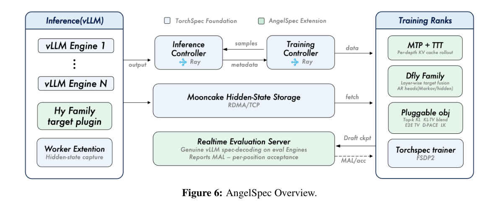
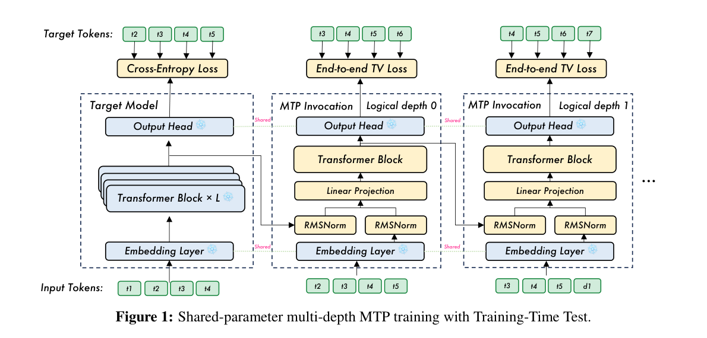
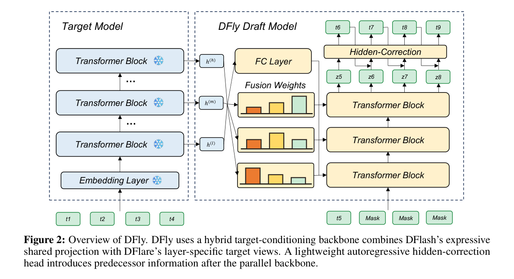
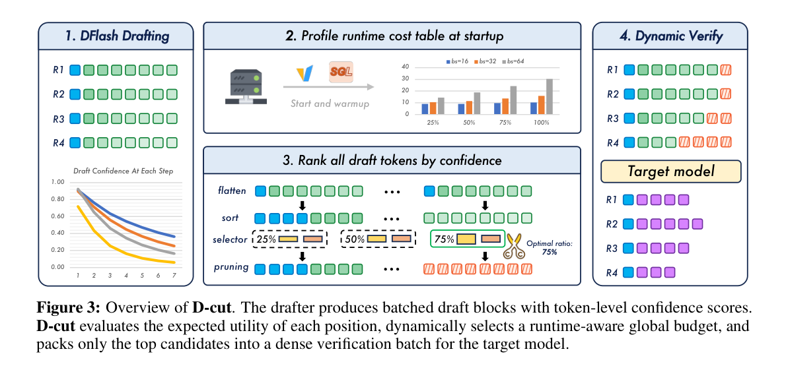
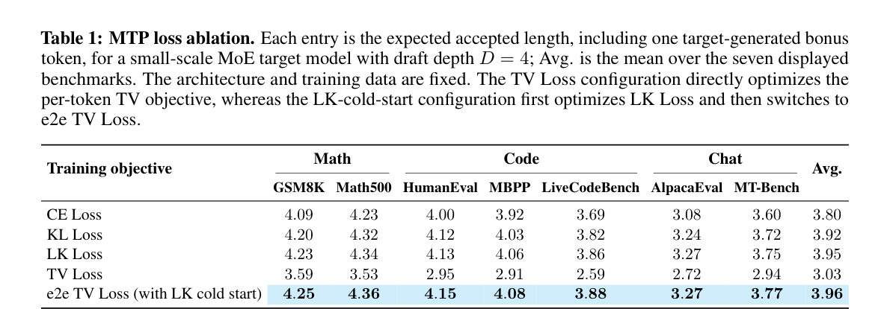
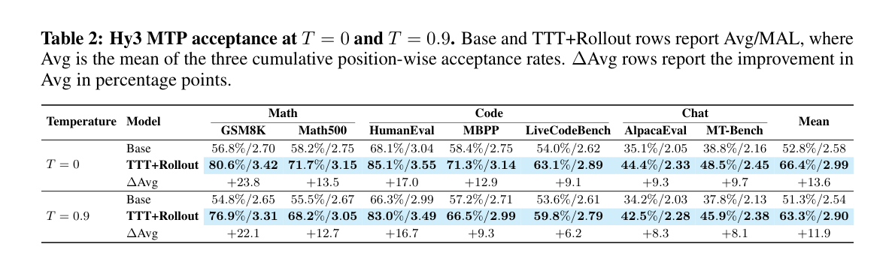
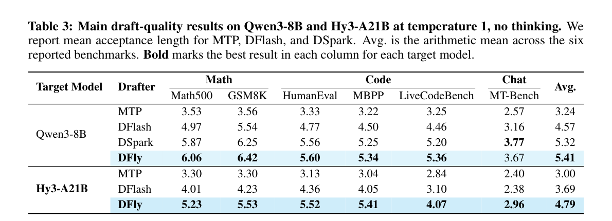
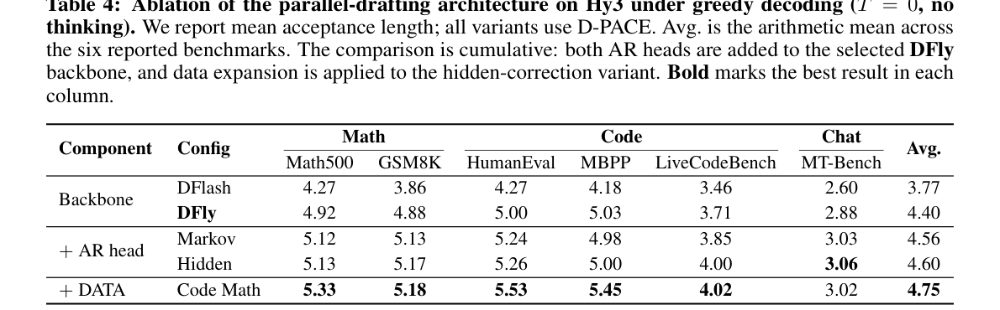
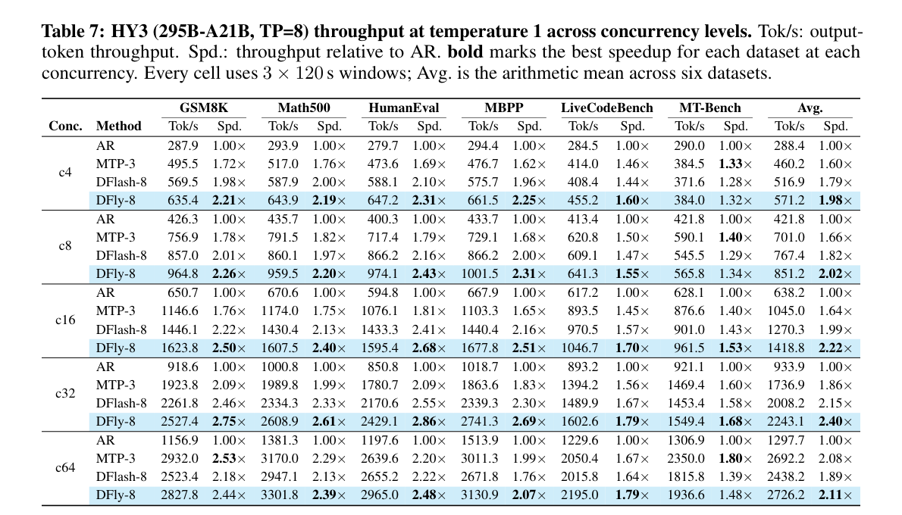
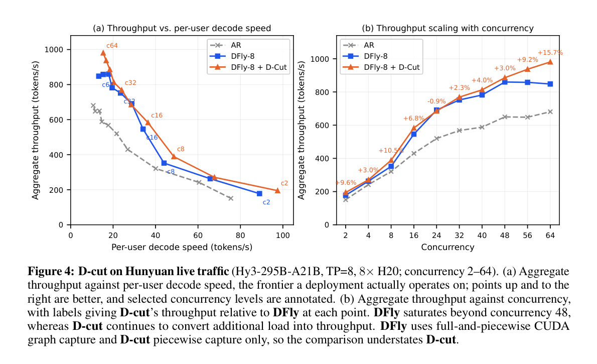

---
tags:
  - paper
  - collection/speculative-decoding
  - domain/model-systems
  - status/deep-review
  - topic/workload-aware-speculative-decoding
  - method/hybrid-parallel-drafting
document_type: paper
domain: 02_model_systems/speculative_decoding
collection: speculative-decoding
review_status: deep-review
canonical: true
---

> [!info] 文档关系
> - 领域入口：[README](../README.md)
> - 父级 Survey：[Evolution](../surveys/evolution.md)
> - 正式资产：`../assets/papers/angelspec/`
> - 证据清单：[Figure inventory](../evidence/figure-inventory.md)

# AngelSpec: Towards Real-World High Performance Inference with Speculative Decoding 精读分析

AngelSpec 不是单一 drafter，而是把投机解码拆成“按负载选择训练对象、用 DFly 提高长块候选质量、用 D-cut 按运行时成本分配验证预算”三层。论文最有价值的地方是承认一种 drafter 无法同时统治开放对话与代码/数学；最大不确定性则是 D-cut 尚未随仓库开源，且 Hy3 与生产流量结果无法由外部复现。

> 资料状态：已核验 arXiv:2607.25852v2 PDF、LaTeX source、官方仓库 commit `d3412bed231025ea85d35dbf5e0af44f1ac62a5b`、四个带完整 caption 的 PDF crop。未发现公开 OpenReview forum；匿名 API 查询返回 403。

## 修订信息

- 当前文档版本：`1.1.0`
- 当前修订 ID：`rev-angelspec-20260807-method-evidence-expansion`
- 当前修订时间：`2026-08-07T12:00:00+08:00`
- 替代版本：`rev-angelspec-20260804-initial` / `1.0.0` / deliverable manifest SHA-256 `ecff8437e9fe0f80d925dba07199082cb6134853e4032f93d6c969d480bbeadb`

| 修订 ID | 文档版本 | 时间 | 修订者 | 类型 | 替代修订 | 迁移问题/解析 | 变更摘要 | 原因 | 影响位置 | 依据 | 对结论影响 |
|---|---|---|---|---|---|---|---|---|---|---|---|
| `rev-angelspec-20260804-initial` | `1.0.0` | `2026-08-04T21:30:00+08:00` | Codex | initial | 无 | 无 | 建立 PDF/source/code/视觉证据完整精读 | 用户要求分析 AngelSpec | `analysis.md`、`figure_inventory.md`、代码快照 | arXiv v2、官方仓库与逐图 QA | material |
| `rev-angelspec-20260807-method-evidence-expansion` | `1.1.0` | `2026-08-07T12:00:00+08:00` | Codex | content-update | `rev-angelspec-20260804-initial` / manifest `ecff843...adb` | 无 | 按原论文小节展开 MTP、DFly、D-cut 与框架细节；新增六个原始证据对象和逐图解读 | 用户指出方法、架构图解和就地证据不足 | Sections 0、4、5；figure inventory；正式资产 | arXiv v2 Sections 2-6、Figures 1/4、Tables 1-4 | material |

## 0. 资料与配图索引

- 论文：arXiv:2607.25852v2；官方代码 commit：`d3412bed231025ea85d35dbf5e0af44f1ac62a5b`
- 视觉证据：[Figure inventory](../evidence/figure-inventory.md)
- 方法图：`../assets/papers/angelspec/mtp-ttt-overview.png`、`../assets/papers/angelspec/dfly-overview.png`、`../assets/papers/angelspec/dcut-overview.png`
- 系统与结果：`../assets/papers/angelspec/framework-overview.png`、`../assets/papers/angelspec/mtp-loss-ablation.png`、`../assets/papers/angelspec/mtp-acceptance.png`、`../assets/papers/angelspec/drafter-quality.png`、`../assets/papers/angelspec/dfly-ablation.png`、`../assets/papers/angelspec/throughput-table7.png`、`../assets/papers/angelspec/dcut-live-traffic.png`
- AI 生成图：未生成。论文 Figure 6 已覆盖输入、控制面、Mooncake 数据面、训练 ranks 与评估回路。

## 0.1 术语与符号解释

### 0.1.1 术语表

| 术语 | 本文含义 | 别名 | 不等于/易混项 | 证据来源 |
|---|---|---|---|---|
| MTP drafter | 复用 target 隐状态、embedding 与 LM head，并递归调用一个共享 MTP block 的短候选生成器 | multi-token prediction | 不是一次并行生成整块；推理时仍逐深度递归 | Section 2；`angelspec/models/mtp.py` |
| TTT | 训练时让后续 MTP 深度吃前一深度自己的预测，以逼近推理时状态分布 | Training-Time Test | 不是测试时更新 target 权重 | Section 2.2 |
| DFly | DFlash 共享非线性 FC context、每 draft layer 的 target-layer fusion residual，以及 predecessor-conditioned hidden correction 的并行 drafter | DFlareV2 | 不是 DSpark；仓库测试明确不带 Markov/confidence head | Section 3；`models/draft/dfly.py` |
| hidden correction | 用前一 draft token embedding 修正当前位置 parallel hidden state 的轻量 SwiGLU residual | predecessor-conditioned AR head | backbone 仍一次并行；只在输出头加入前驱条件 | Eq. 13；`HiddenStatesCorrection` |
| D-cut | 把 batch 内验证位置看成共享预算，按 prefix-survival score 和启动时 profile 的成本选择保留比例 | dynamic verification budgeting | 不改变 drafter 权重；不是每请求独立固定截断 | Section 4 |
| accepted length | 每次 target 验证后实际提交的 token 数，通常含 bonus token | committed length / MAL（上下文中） | 不是单位置接受率，也不是吞吐 | Tables 3-7 |

### 0.1.2 符号表

| 符号 | 含义 | 性质 | 作用域/索引 | 单位/取值 | 来源 | 易混点 |
|---|---|---|---|---|---|---|
| $D$ | MTP logical depths；在 D-cut 章节又表示每请求 draft token 数 | author-defined | per training/inference setup | positive integer | Sections 2, 4 | 两章同符号不同对象，需按阶段读 |
| $h^{(k)}$ | 共享 MTP block 在逻辑深度 $k$ 的 hidden state | author-defined | per depth/token | vector | Eq. 1-2 | 不是 target 的第 $k$ 层 hidden state |
| $u^{(k)}$ | 第 $k$ 次 MTP 调用的融合输入 | author-defined | per logical depth/token | vector | Eq. 1 | 由上一 hidden 与最新 token embedding 拼接投影得到 |
| $p_{i,k},q_{i,k}$ | target teacher 与 drafter student 分布 | author-defined | token position x draft depth | vocabulary distribution | Section 2.3 | $p$ 冻结；$q$ 由 MTP/DFly 学习 |
| $\alpha(p,q)$ | target/draft 概率质量重叠，对应单位置期望接受率 | author-defined | per token/depth | $[0,1]$ | Eq. 5 | 不等同于贪心 exact-match 的经验接受率 |
| $W_{\mathrm{fuse}}$ | 每个 DFly draft layer 对选定 target layers 的可学习融合 logits | author-defined | draft layer x target layer | scalar matrix | Eq. 11；code `layer_fusion_weights` | softmax 后才是权重 |
| $z^{\mathrm D}_{t+i},e_{t+i-1}$ | DFly 并行 hidden 与前驱 token embedding | author-defined | block position | vectors | Eq. 14 | 前者来自并行 backbone，后者来自已选 draft 路径 |
| $c_{i,t}$ | 请求 $i$ 在 draft 位置 $t$ 的 token confidence | author-defined | per request/position | $[0,1]$ | Eq. 20 | 论文未证明它是校准后的真实接受概率 |
| $s_{i,k}$ | 前 $k$ 个位置全部存活的估计分数 | author-defined | per request/prefix | $[0,1]$ | Eq. 20 | 是 confidence product，不是真实 survival probability |
| $K_\rho(B)$ | batch size $B$、比例 $\rho$ 下的验证位置预算 | author-defined | per batch | token positions | Eq. 22 | 至少为 $B$，保留每请求 bonus slot |
| $U(B,\rho)$ | 该预算下估计的 batch token progress | author-defined | per batch/ratio | tokens per step | Eq. 23 | 是期望进展估计，不是实测吞吐 |
| $C(B,\rho)$ | 启动 profile 得到的整轮延迟 | author-defined | per hardware/batch/ratio | seconds | Eq. 24 | 硬件与软件版本相关，不能跨部署复用 |

## 0.2 原论文算法/系统总览

> 原论文 Figure 6。灰色部分来自 TorchSpec 基础：推理 engine 生成 target hidden states，经 Mooncake RDMA/TCP 送到训练 ranks；绿色部分是 AngelSpec 增量：Hy target plugin、MTP+TTT、DFly family、可组合目标与实时接受率评估。

## 1. 论文基本信息

- 标题：*AngelSpec: Towards Real-World High Performance Inference with Speculative Decoding*
- 版本：arXiv:2607.25852v2，2026-07-29 更新
- 完整作者列表：Hong Liu, Rui Cen, Junhan Shi, Guangshuo Qin, Jiebin Zhang, Tianyu Liu, Runzhi Fan, Guoliang Zhao, Ruobing Xie, Kai Zhang, Song Liu, Guanghua Yu, Jianchen Zhu
- 第一作者/共同一作及机构：Hong Liu；身份依据 `first listed`；Tencent Inc.；证据 `paper source main.tex author block`
- 通讯作者及机构：Guanghua Yu；身份依据 `superscript * and *Corresponding author legend`；Tencent Inc.；证据 `paper source main.tex author block`
- 其余作者涉及机构：Tencent Inc.
- 作者核验：论文未标 equal contribution，因此只把首位作者视为第一作者。
- 核心问题：真实 workload 异质性下，如何同时提高 drafter 质量、训练可扩展性和高并发验证效率。

## 2. 研究动机与问题—方案闭环

### 2.1 出发点与背景痛点

作者明确指出，开放对话、代码和数学的条件熵与续写结构不同。高熵对话有许多语义可接受的分支，但 target 只采样其中一条，长 block 很快失配；代码与数学受语法、标识符和推导约束，较长前缀更可预测。把全部数据平均混合并训练一个“万能 drafter”，会在短 horizon 的稳定性与长 block 的并行摊销之间折中，却不一定在任何域达到最好。

此外，accepted length 不是部署目标本身。每个保留位置仍要由 target 验证；并发升高后，大块验证会占满 target 计算，即使 drafter 很快也可能降低吞吐。论文因此把成功标准从单一 MAL 扩展为不同域、并发和硬件上的 end-to-end tok/s。

### 2.2 现有方案为何不够

| 现有方案 | 可观察失败 | 具体场景 | 来源 | 根因 | 为什么简单修补仍不够 | 证据 |
|---|---|---|---|---|---|---|
| 一个 drafter + 均匀数据混合 | chat 与 code/math 不能同时拿到最佳 accepted length | 论文 Hy3 结果中 MTP-3 在 MT-Bench 更强，而 DFly-8 在结构化任务更强；强行只部署 DFly 会牺牲 chat | paper-provided | workload 条件熵与可预测跨度不同 | 只调 block size 仍用同一表示和数据分布，不能同时解决域差异 | Intro；Table 7 |
| DFlash position-wise parallel block | 后缀缺少已选前驱 token 条件，接受率随位置衰减 | 本文构造的说明例，不是论文实验：第 2 位在“for”路径下选“i”，第 3 位却采用另一分支的边际高频 token，组合后语法不一致 | reviewer-created | 各位置看到 accepted context，却看不到本 block 已选路径 | 单纯加深 backbone 不注入 realized predecessor；更长 block 反而放大缺口 | Section 3.2；Table 4 |
| 固定每请求验证深度 | 高并发时大量低置信 suffix 占 target slots | live traffic c64：DFly 848 tok/s，D-cut 981 tok/s，而 MAL 仅从 2.50 降到 2.43 | paper-provided | verification cost 随 batch/hardware/CUDA graph 路径变化，并且请求间 useful depth 不同 | 统一缩短会同时裁掉高置信请求；只看 confidence 又忽略硬件成本拐点 | Section 4；Figure 4 |

### 2.3 目标与成功标准

- draft quality：不同 workload 上提高 mean accepted length。
- serving：并发 4-64 的平均 tok/s 优于 AR、MTP 与 DFlash。
- training：支持大 MoE target hidden-state 流、MTP on-policy rollout、128k 长上下文、packing 和实时 acceptance evaluation。
- 正确性：保留 token 仍由 target 原始验证；论文将 deterministic draft + target-only verification 的 D-cut 路径表述为分布保持。

### 2.4 核心方案如何解决并优化问题

| 问题                                | 方案                                                    | 改变的变量/行为                    | 机制                                        | 预期指标                     | 证据                          | 判断                                 |
| --------------------------------- | ----------------------------------------------------- | --------------------------- | ----------------------------------------- | ------------------------ | --------------------------- | ---------------------------------- |
| workload 异质                       | ==对话数据训练 MTP；代码/数学数据强化 DFly==                         | drafter structure 与训练分布按域分工 | 短 horizon 避免 chat 过度投机；长 block 利用结构化续写    | MAL、tok/s                | Intro；Tables 3,7            | partially-supported：只展示有限域与 target |
| DFlash target conditioning 与块内依赖弱 | hybrid FC + layer-specific fusion + hidden correction | 每层 target view、前驱条件         | 保留并行 backbone，再轻量修正路径一致性                  | suffix acceptance/MAL    | Table 4 cumulative ablation | supported，但组件消融是累积式                |
| 固定验证预算浪费                          | D-cut top-K prefix scores + profiled cost             | 每请求 keep depth、全局 ratio     | 把 target slots 给高预期收益 prefix，并按 $U/C$ 选形状 | high-load tok/s          | live traffic Figure 4       | paper-supported；代码未开源              |
| target 与 training 抢 GPU/数据流       | TorchSpec/Mooncake 解耦 + FSDP2/USP                     | 资源配比、数据驻留与序列切分              | inference/training 独立扩展，避免磁盘中转            | train throughput/context | Section 6/code              | implementation-supported；论文少量量化    |

### 2.5 完整因果链与证据边界

真实流量异质且验证成本随负载变化，导致统一 drafter 与固定深度无法同时优化 chat、结构化生成和高并发。AngelSpec 先把结构/数据按 workload 分工，再用 DFly 提升 block 的 target feature 利用与前驱一致性，最后用 D-cut 把验证位置按预测收益和 profile 成本重分配。Table 4 直接支持 DFly 累积组件带来的 MAL 增益，Table 7 支持完整 DFly 在给定 Hy3/H20 设置下的吞吐优势，live traffic 支持 D-cut 高负载收益。

边界是：架构与数据在 Table 4 中按累积顺序加入，不能把最终收益完全独立归因；D-cut confidence calibration、profile 迁移和实现均未公开；Hy3、生产流量和 H20 环境不可外部检查。

## 3. 核心贡献

1. 将 workload heterogeneity 明确纳入 drafter 结构与数据选择，而非只报告混合平均分。
2. DFly 用共享非线性 target context + per-layer fusion + predecessor correction 组合 parallel drafting 与路径条件。
3. D-cut 将 batched verification 视为共享资源，以期望进展/实测成本选择预算。
4. 发布统一的 torch-native 训练框架，代码覆盖 DFly、MTP/TTT、DFlash/DFlare/DSpark/Eagle3、packing、FSDP2 和多 backend。

## 4. 具体方案与方法细节

### 4.1 端到端方案：训练、路由、验证三层分工

AngelSpec 的关键不是把 MTP、DFly 和 D-cut 串成每个请求都必须经过的单一路径，而是三层分工：训练层为不同负载准备 MTP 和 DFly；服务层按 workload 选择短 horizon 或长 block drafter；验证层只在长 block、高并发下用 D-cut 缩减 target 要评分的位置。最终 token 仍由 target 验证，因此模型训练改变候选质量，D-cut 改变验证形状，两者不能混为同一种收益。

### 4.2 MTP：让共享预测块学会递归使用自己的输出

#### 4.2.1 共享参数的多深度 MTP

Figure 1 从左到右分别是冻结的 target、逻辑深度 0 和逻辑深度 1。图中多个 MTP 方框不是多套参数：embedding、output head、projection 和 Transformer block 都共享；变化的是每次调用的输入 token、累计的 draft KV，以及右移一位的监督目标。雪花表示 target 侧冻结，红色 `Shared` 线表示参数复用。这样只增加一个物理 MTP block，却能在推理时递归提出 $D$ 个 token。

在第 $k$ 个逻辑深度，MTP 把前一轮隐状态和最新 token embedding 拼接、归一化并投影：

$$
u^{(k)}=W_{\mathrm{proj}}
\left[\operatorname{RMSNorm}(h^{(k-1)});\operatorname{RMSNorm}(E(\widetilde{x}_k))\right],
$$

再用同一个 Transformer block 和已累计的 draft KV 得到下一分布：

$$
h^{(k)}=F_\theta\!\left(u^{(k)},\mathcal K^{(<k)}\right),\qquad
q_k=\operatorname{softmax}(W_{\mathrm{lm}}h^{(k)}).
$$

**这组公式在算什么？** 它描述一次共享 MTP block 调用如何把“上一深度的状态 + 最新预测 token”变成下一深度的 token 分布。

**怎么读？** 每走深一层，参数不变，但输入 token 和 KV 状态已经包含前一层自己的选择，因此这是递归展开，不是多个独立 head 并行猜未来。

**输入与输出。** 输入是 target/上一深度隐状态 $h^{(k-1)}$、token $\widetilde{x}_k$ 和历史 draft KV；输出是深度 $k$ 的学生分布 $q_k$。

**变量在这里各做什么？** $E$ 和 $W_{\mathrm{lm}}$ 复用 target embedding/head；$W_{\mathrm{proj}}$ 对齐拼接维度；$F_\theta$ 是唯一可训练 MTP block；$\mathcal K^{(<k)}$ 保留此前递归状态。

**直觉。** 参数共享控制额外模型大小，递归状态则允许后续预测看到已经选择的 draft 路径。

**边界。** 递归调用仍带来随深度增长的 draft latency；因此论文只把它用于 $D=3$ 的短 horizon，而非 DFly 的 8-token 长 block。

**小例子。** 深度 0 预测出 `for` 后，深度 1 的输入 embedding 就是 `for`，而不是训练语料中的标准答案 token；它必须从自己真实会遇到的状态继续预测。

#### 4.2.2 Training-Time Test：消除 teacher forcing 与推理轨迹错配

普通训练在深度 $k\ge1$ 继续喂真值 token，推理却只能喂 $\arg\max q_{k-1}$ 或采样结果。TTT 在训练中真正递归展开 MTP，让下一深度消费上一深度的预测，同时维护增长的 draft KV 和“因果前缀 + 同位置历史深度”的注意力结构。它重点修复的是后缀位置：第一 draft token 原本就有干净 target state，第二、第三个才承受误差累积。

长上下文下，每个深度都要保存 rollout activation 并匹配一份错位的 teacher logits。框架以 Ulysses 切分 sequence，并为每个 shard 保留 $D$ token halo，使右移监督在本 rank 内可取；packed sample 的 shift/mask 必须受 document boundary 限制，避免上一文档的末尾预测下一文档开头。

#### 4.2.3 接受率对齐损失：先稳定对齐，再优化整段存活

对 target 分布 $p$ 与 draft 分布 $q$，单位置 speculative sampling 的期望接受概率等于二者重叠质量：

$$
\alpha(p,q)=\sum_{v\in\mathcal V}\min(p(v),q(v))
=1-\frac12\sum_{v\in\mathcal V}|p(v)-q(v)|.
$$

**这条公式在算什么？** 它把 distribution mismatch 直接换算成单个 draft token 被 target 接受的概率。

**怎么读？** 两个分布共有的概率质量越多，接受率越高；右侧就是 $1-\mathrm{TV}(p,q)$。

**输入与输出。** 输入是冻结 target 的 $p$ 和 MTP 的 $q$；输出 $\alpha\in[0,1]$。

**变量在这里各做什么？** $v$ 遍历词表；$\min(p(v),q(v))$ 只累计双方都能覆盖的质量；TV 计算必须搬动多少质量才能让两分布一致。

**直觉。** KL 能提供平滑梯度，但 KL 数值本身不是接受率；TV/overlap 才与 rejection sampling 的接受事件直接对应。

**边界。** 这条等式针对论文采用的 speculative-sampling 接受规则；贪心 exact-match 的经验接受率不能直接由该式等同推出。

**小例子。** 若 $p=(0.7,0.3)$、$q=(0.5,0.5)$，重叠为 $0.5+0.3=0.8$，对应 TV 为 $0.2$。

整段接受长度取决于所有前缀是否连续存活，因此第二阶段目标是：

$$
\mathcal L_{\mathrm{e2e}}
=1-\frac{1}{|\mathcal I|D}
\sum_{i\in\mathcal I}\sum_{m=0}^{D-1}\prod_{k=0}^{m}\alpha_{i,k}.
$$

**这条公式在算什么？** 它最大化不同前缀长度的存活概率总和，也就是 expected accepted draft length 的替代目标。

**怎么读？** 第 $m$ 个 token 有价值的前提是 $0\ldots m$ 全部被接受，所以使用乘积；早期位置会出现在更多乘积中，自动获得更大影响。

**输入与输出。** 输入是每个样本位置、每个递归深度的 overlap $\alpha_{i,k}$；输出是一个待最小化的 batch loss。

**变量在这里各做什么？** $\mathcal I$ 是拥有全部深度监督的训练位置；$D$ 是 draft 深度；$m$ 枚举前缀终点。

**直觉。** 只提高第 3 位而不提高前两位没有用；乘积结构把梯度集中到真正能延长 accepted prefix 的位置。

**边界。** 初始化较差时多项乘积很小，直接训练不稳定。论文因此先用 LK loss cold start，再切到 e2e TV；Table 1 支持这个组合，但没有把 cold-start 轮数做独立敏感性扫描。

**小例子。** 三个位置的接受率为 $(0.9,0.8,0.5)$，三段前缀存活分别是 $0.9,0.72,0.36$；提高第一位会同时改善三项。

#### 4.2.4 训练数据策略

论文给出三个独立的数据设计点。第一，混合 chat、知识问答、数学、代码、instruction following 和 agent trajectory，避免共享 MTP 只学低熵任务。第二，加入长上下文 code-agent 轨迹，让训练真实包含 repository context、tool interaction、重复标识符和延迟约束；仅把 max sequence length 调大并不会凭空产生这些状态。第三，用冻结 target 重新生成 response，再训练 MTP 拟合这些 token/hidden trajectory；这样减少“原答案由人或另一模型生成”造成的 teacher-data mismatch。

这部分的证据边界要分开看：Table 2 测的是 TTT + target rollout + diverse mixture 的组合效果，不能单独归因给某一条数据原则。

### 4.3 DFly：并行 backbone 后补回层特化和块内因果依赖

Figure 2 左侧 target 输出多个层级的 hidden states；中间有两条 conditioning 路径：FC layer 对多层特征做共享非线性投影，柱状 fusion weights 为每个 draft layer 选择不同 target-layer view；右侧黄色 Transformer blocks 仍一次并行处理全部 mask 位置。顶部 hidden-correction 只在输出阶段顺序读入前一个已选 token，因此串行部分比完整 AR drafter 小得多。

#### 4.3.1 Hybrid target conditioning

DFlash 的优点是把多层 target hidden 拼接后经 FC 做非线性交互，但所有 draft layers 共用同一个 context；DFlare 的优点是每层有自己的 target-layer 权重，但只是标量加权和。DFly 将二者相加：

$$
c_t=W_{\mathrm{fc}}[h_t^{(1)};\ldots;h_t^{(T)}]+b_{\mathrm{fc}},\qquad
g_t^{(i)}=\operatorname{RMSNorm}\left(c_t+\sum_{j=1}^{T}\alpha_j^{(i)}h_t^{(j)}\right),
$$

$$
\alpha^{(i)}=\operatorname{softmax}(W_{\mathrm{fuse},i,:}).
$$

**这组公式在算什么？** 为第 $i$ 个 draft layer 构造“共享跨层语义 + 本层专属 target view”的条件序列。

**怎么读？** $c_t$ 负责所有 target layers 的非线性交互；$\alpha^{(i)}$ 决定当前 draft layer 更关注哪些 target layers；两者相加后归一化。

**输入与输出。** 输入是 token 位置 $t$ 上选定的 $T$ 个 target hidden states；输出是 draft layer $i$ 使用的 $g_t^{(i)}$。

**变量在这里各做什么？** $W_{\mathrm{fc}}$ 学共享变换；$W_{\mathrm{fuse}}\in\mathbb R^{D\times T}$ 每行对应一个 draft layer；softmax 保证同一行权重可比较。

**直觉。** 一个统一 context 容易让所有 draft layers 做相似的事；只做标量融合又可能丢失跨层组合。相加让共享表达和层间分工同时存在。

**边界。** Table 4 的 backbone 行直接比较 DFlash 和 DFly，但后续 head/data 行是累计加入，不能把最终 4.75 全归给该公式。

**小例子。** 浅 draft layer 可以更偏 target 浅层的局部模式，深 draft layer 更偏高层语义，同时二者都保留 FC context。

#### 4.3.2 AR head：从并行边际分布变成已选路径条件分布

并行 backbone 在一个 forward 中产生 $B$ 个位置的 hidden/logits，但第 $i$ 位只近似 $q(x_{t+i}\mid x_{\le t})$，看不到同一 block 已经选出的 $x_{t+1:t+i-1}$。论文先把目标写成因果分解：

$$
q(X_{t+1:t+B}\mid x_{\le t})
=\prod_{i=1}^{B}q_i(x_{t+i}\mid x_{\le t},x_{t+1:t+i-1}).
$$

**这条公式在算什么？** 它规定长 block 应如何沿已选择路径逐位置条件化，而不是把各位置独立边际拼起来。

**怎么读？** backbone 可以并行准备各位置表示，但最终第 $i$ 个 token 的分布仍应知道此前实际选了什么。

**输入与输出。** 输入是 accepted context 和 block 内已选 prefix；输出是整段 draft 的联合分布。

**变量在这里各做什么？** $B$ 是 block 长度；$q_i$ 是第 $i$ 位条件分布；乘积把这些条件分布组成一条候选路径。

**直觉。** `for` 后选择了 `i`，下一位就应按 `for i` 这条路径修正，而不是继续使用与前驱无关的高频边际 token。

**边界。** 完整 AR factorization 会重新引入较大串行成本，所以 DFly 只让轻量 head 顺序执行，backbone 仍并行。

**小例子。** 若第 2 位在 `range` 和 `each` 间选择了 `range`，第 3 位需要提高 `(` 的概率；独立并行 logits 无法利用这次选择。

最终采用的 hidden-correction head 将前驱 embedding 与当前并行 hidden 一起送入 SwiGLU residual：

$$
\widehat z^{\mathrm D}_{t+i}=z^{\mathrm D}_{t+i}
+\operatorname{SwiGLU}([\widetilde z^{\mathrm D}_{t+i};e_{t+i-1}]),\qquad
q_i=\operatorname{softmax}(\operatorname{LMHead}(\widehat z^{\mathrm D}_{t+i})).
$$

它比 Markov head 多使用当前位置的上下文化 hidden，而不是仅由 predecessor token 查一个低秩 transition bias。代码把 output projection 零初始化，因此训练起点等价于“不修正 backbone”，再逐渐学残差；Table 4 中 hidden head 平均仅比 Markov 高 0.04，优势存在但幅度不大。

#### 4.3.3 两阶段 loss：D-PACE cold start 到 e2e TV

DFly 复用 MTP 的 LK/TV 思路，但 cold start 还按位置的潜在贡献加权。对监督 token 的置信度 $s_{i,k}=\exp(-\mathrm{CE}_{i,k})$ 先平滑为 $\widetilde s_{i,k}=(1-\rho)s_{i,k}+\rho$，再计算：

$$
\bar w_{i,k}=\sum_{m=k}^{D-1}\prod_{r=0}^{m}\widetilde s_{i,r}.
$$

**这条公式在算什么？** 它估计训练位置 $(i,k)$ 会影响多少条可存活前缀，并据此加权 LK loss。

**怎么读？** 越靠前、越可能处在高置信前缀中的位置，$\bar w_{i,k}$ 越大；低置信深后缀权重较小。

**输入与输出。** 输入是各深度对真值 token 的 confidence；输出是 detached loss weight。

**变量在这里各做什么？** $m$ 枚举所有包含深度 $k$ 的前缀终点；乘积近似该前缀存活；$\rho$ 防止初期权重全部塌到零。

**直觉。** 第一个 token 出错会让所有后续 token 失效，因此它应影响更多前缀项。

**边界。** $s_{i,k}$ 是模型对监督 token 的置信度，不是校准后的真实接受概率；权重 stop-gradient，只决定 loss 比例。

**小例子。** 对 $D=3$，深度 0 进入长度 1/2/3 三个前缀，深度 2 只进入长度 3 前缀，所以前者通常权重更高。

对齐稳定后丢弃 D-PACE/LK cold-start 目标，转用 4.2.3 的 e2e TV，直接优化整段 accepted length 替代目标。

#### 4.3.4 数据扩展、draft depth 与 block size

Hy3 最终 DFly 加入 code/math target-generated samples，使结构化任务继续上升，但 MT-Bench 从 3.06 降到 3.02。这不是“数据越多越好”，而是有意把长 block drafter 专门化；开放对话交给短 horizon MTP。论文还分别扫描 draft model depth 和 inference block size：更深 drafter 提高 proposal quality 却增加 draft latency，更长 block 增加理论可提交 token 也扩大 verification cost，二者必须通过后续吞吐测量而非只看 MAL 选择。

### 4.4 D-cut：把 target verification 当成 batch 共享预算

Figure 3 给出四步：drafter 先输出每请求的 block/confidence；启动时 profile 不同 batch/ratio 的整步成本；运行时把所有 prefix positions 按收益排序；最终只把选中的连续 prefix pack 成 dense verification batch。图中的 25%/50%/75%/100% 是候选全局预算，不是单请求固定截断比例。

#### 4.4.1 每请求进展与 prefix survival

若请求 $i$ 完整验证会接受 $L_i$ 个 draft，而系统只保留 $n_i$ 个，则提交进展（含一定会生成的 bonus token）为 $A_i(n_i)=1+\min(L_i,n_i)$。其期望可写为：

$$
\mathbb E[A_i(n_i)]=1+\sum_{k=1}^{n_i}\Pr(L_i\ge k).
$$

未知的真实存活概率用 confidence product 近似：

$$
s_{i,k}=\prod_{t=1}^{k}c_{i,t},\quad s_{i,0}=1,\qquad
\widehat A_i(n_i)=\sum_{k=0}^{n_i}s_{i,k}.
$$

**这组公式在算什么？** 估计给请求 $i$ 多保留一个位置能增加多少期望 token progress。

**怎么读？** 第 $k$ 位只有在前 $k$ 位都存活时有用，所以把各位置 confidence 相乘；所有可提交前缀概率相加得到期望进展。

**输入与输出。** 输入是每位置 confidence $c_{i,t}$ 和 keep depth $n_i$；输出是 prefix score $s_{i,k}$ 与估计进展 $\widehat A_i$。

**变量在这里各做什么？** $i$ 索引请求；$t/k$ 索引 block 位置；$s_{i,0}=1$ 表示 bonus token。

**直觉。** 即使第 8 位自身 confidence 高，只要前缀 survival 已很低，它也不值得占一个 target slot。

**边界。** 乘积把 token confidence 当作 survival 的替代量；论文未给 calibration error，也未开源 D-cut 实现。

**小例子。** 两位置 confidence 为 $(0.9,0.2)$ 时，第二前缀 score 是 $0.18$，远低于第一位置的 $0.9$。

#### 4.4.2 全局预算与硬件成本联合选择

候选 ratio $\rho\in\{0.25,0.5,0.75,1\}$ 对应验证位置数：

$$
K_\rho(B)=\max\left(B,\left\lceil\rho B(D+1)\right\rceil\right).
$$

跨请求选 top-$K_\rho$ prefix scores 后会得到不同 $n_i^{(\rho)}$；估计总进展与决策规则为：

$$
U(B,\rho)=\sum_{i=1}^{B}\widehat A_i(n_i^{(\rho)}),\qquad
\rho^*=\arg\max_\rho\frac{U(B,\rho)}{C(B,\rho)}.
$$

**这组公式在算什么？** 在多个可 CUDA-graph 化的验证形状中，选择预计单位时间提交 token 最多的一个。

**怎么读？** 分子是 confidence 预测的进展，分母是该硬件、batch 和 shape 在启动 profile 中测得的完整 step latency。

**输入与输出。** 输入为 batch size $B$、draft depth $D$、候选 ratio、prefix scores 和成本表 $C$；输出为全局 ratio $\rho^*$ 及每请求 keep depth。

**变量在这里各做什么？** $K_\rho$ 控制 target 总位置数；下限 $B$ 保留每请求 bonus slot；$U$ 汇总收益；$C$ 包含 drafting、selection、packing 和 verification。

**直觉。** 轻载时多验证几个位置成本小，$\rho=1$ 可能最好；高并发进入 compute-bound 后，少量低价值后缀会显著拉长 step，此时较小 ratio 胜出。

**边界。** profile 只对当前 GPU、TP、engine、CUDA graph 路径有效；shape 或软件版本变化后必须重测。

**小例子。** 若 100% 预算预计提交 20 token/20 ms，而 75% 预算预计提交 19 token/16 ms，后者的 1.19 token/ms 高于前者的 1.0。

#### 4.4.3 Packing、正确性与适用范围

因为同一请求的 $s_{i,k}$ 随深度不增，top-K 并在同分时优先浅位置会自然形成连续 prefix，不会出现保留第 5 位却丢第 3 位的洞。系统将不等长 prefix pack 成 dense batch，再交给原 target verification。论文部署采用 deterministic draft + target-only verification，因此裁剪只决定“验证多远”，不直接接受未经 target 检查的 token。

D-cut 与 drafter weights 正交，但对 DFly-8 更有价值：8-token block 有较大的低收益 suffix；MTP-3 可裁剪面小。当前 DFly 可使用更完整的 CUDA graph，而 D-cut 只有 piecewise capture，selector 也仍在 critical path，因此 Figure 4 的比较包含对 D-cut 不利的工程差异，同时也说明公开实现尚不足以外部验证。

### 4.5 AngelSpec 训练框架：逐块解读 Figure 6

Figure 6 可按数据流分成四块：

1. **Inference/LLM。** 左侧多个 vLLM engines 运行冻结 target；Hy family target plugin 负责模型接入，worker extension 在 engine 内抓取指定层 hidden states，避免用 Hugging Face 路径重算一遍 target。
2. **控制面与数据面。** 中间上方两个 Ray controller 只传 sample metadata 和 Mooncake key；大 tensor 进入 Mooncake hidden-state storage，经 RDMA/TCP 直接被 training ranks fetch。控制信息和 hidden tensor 分离，避免 Ray 序列化大对象。
3. **Training ranks。** 右侧绿色块是 AngelSpec 新增能力：MTP+TTT 的 AR rollout、DFly family 的 parallel/AR-aware 模型、可插拔 CE/KL/LK/TV/e2e loss；底层 TorchSpec trainer 用 FSDP2 组织参数和 optimizer state。
4. **Realtime evaluation。** 中下方 evaluation server 周期性加载 draft checkpoint，在真实 serving engine 中测 MAL 和逐位置 acceptance，而不是只用 training loss/top-k accuracy 代替部署指标。

图中绿色是 AngelSpec 增量，灰色是 TorchSpec 基础。论文正文还补充了图里没有展开的三点：MTP 长序列用 Ulysses + $D$-token halo；document-aware packing 同时隔离 attention、depth-shift label 和 position IDs；Hy target 通过 runtime plugin 接入而非维护 vLLM fork。架构上的核心取舍是获得独立扩展和真实在线评估，但代价是 Ray、Mooncake、网络注册 buffer、评估 GPU 和 checkpoint reload 的运维复杂度。

### 4.6 组件级设计动机汇总

| 设计 | 论文给出的原因 | 直接改变 | 代价/替代方案 | 证据判断 |
|---|---|---|---|---|
| MTP shared-depth + TTT | teacher forcing 不覆盖递归自生成状态 | 后续深度输入 token/KV | 多深度 activation/logits；可改用独立小 drafter | Table 2 支持组合方案 |
| LK cold start -> e2e TV | 直接 TV 在低 overlap 初始化下梯度弱 | 从稳定分布对齐切到前缀接受目标 | 多阶段 schedule | Table 1 为控制消融 |
| DFly hybrid context | DFlash 不分 draft layer，DFlare 融合表达弱 | 每层 target view + 共享非线性交互 | 多 $D\times T$ 权重和 context path | Table 4 backbone 行直接支持 |
| Hidden correction | 并行位置看不到已选前驱 | 输出分布条件于 realized predecessor | 顺序 head latency | Table 4 仅比 Markov +0.04 |
| Code/math data expansion | 长结构化 continuation 更可预测 | proposal distribution 专门化 | MT-Bench 轻微下降 | Table 4 直接显示 trade-off |
| D-cut | 固定深度浪费 batch verification slots | 每请求 keep depth 和 target shape | calibration/profile/packing 开销 | Figure 4 支持 whole-stack 结果 |
| TorchSpec/Mooncake + FSDP2 | target generation 与 draft training 资源耦合 | GPU ownership、tensor transport、parallel mesh | 网络与多控制器运维 | 代码/架构支持，缺 matched cost |

## 5. 关键结论、原始证据与归因

### 5.1 MTP：loss 选择与后缀接受率

Table 1 固定 small-scale MoE target、$D=4$、architecture 和 data，只改 loss。CE/KL/LK 平均 accepted length 分别为 3.80/3.92/3.95；直接 TV 从初始 checkpoint 训练反而降到 3.03；LK cold start 后切 e2e TV 达到 3.96。它直接支持“两阶段比直接 TV 稳定”，但 LK 到 e2e TV 只比 LK 单独高 0.01，不能宣称 e2e 阶段贡献很大。

Table 2 是完整配方对 base MTP 的比较。$T=0$ 时 Avg/MAL 从 52.8%/2.58 升到 66.4%/2.99；$T=0.9$ 从 51.3%/2.54 升到 63.3%/2.90。正文进一步给出后缀位置：$T=0$ 的 $p_3$ 聚合值由 0.266 升至 0.524，而 $p_1$ 仅由 0.799 到 0.814，符合 TTT 主要修复递归后缀的机制。但这一表同时改变 TTT、rollout data 和训练配方，不能拆出单项贡献。

### 5.2 DFly：主结果与累计消融

Table 3 显示 Qwen3-8B 上 DFly 平均 MAL 5.41，略高于 DSpark 5.32；但 MT-Bench 是 3.67，低于 DSpark 3.77。Hy3-A21B 上 DFly 为 4.79，对 DFlash 3.69 是 $+29.8\%$，对 MTP 3.00 是 $+59.7\%$。这支持 workload routing：DFly 在 code/math 的长可预测前缀上更强，不等于 chat 全面占优。

Table 4 必须按累计路径读：DFlash backbone 3.77 -> DFly backbone 4.40，是替换 target-conditioning 的 $+0.63$；在 DFly 上加 Markov/hidden head 为 4.56/4.60；再给 hidden variant 加 code/math data 到 4.75，同时 MT-Bench 3.06 -> 3.02。只有第一步接近单变量 replacement，后续是“在已选配置上继续加组件”，不能把差值当作完全独立贡献。

### 5.3 End-to-end throughput：DFly 与 D-cut

Table 7 在 Hy3-295B-A21B、TP=8、8x H20、temperature 1 下比较 AR、MTP-3、DFlash-8 和 DFly-8。DFly 在六个数据集、c4/c8/c16/c32/c64 的平均 speedup 约 1.98x-2.40x over AR，并比 DFlash 高约 10.5%-11.8%。但该表测的是完整 engine：MAL、draft latency、target verification、batching 和 kernel/graph 共同决定 tok/s；它不能把吞吐差全部归给 hidden correction。

Figure 4 左图是 aggregate throughput 与每用户 decode speed 的运行边界，右图是并发扩展。DFly 在 c48/c56/c64 分别为 860/858/848 tok/s，已经饱和；D-cut 为 886/937/981 tok/s，对应 +3.0%/+9.2%/+15.7%。约 15.3 tok/s/user 时，D-cut c64 的 981 tok/s 比 DFly c56 的 858 tok/s 高约 14%。与此同时 c64 MAL 仅从 2.50 降到 2.43（-2.8%），说明裁掉的多数是低价值后缀。

该图仍只是官方 production replay：流量不可获得、D-cut 代码未发布、confidence calibration 未给出，而且两者 CUDA graph capture 能力不一致。因此它支持“这套完整部署在高负载下有效”，不构成对 D-cut selector 单模块的外部可复现实验。

### 5.4 技术主张证据矩阵

| 技术点 | 主要读数 | 证据 | 控制程度 | 可下结论 |
|---|---|---|---|---|
| LK cold start + e2e TV | Avg 3.96 vs LK 3.95；直接 TV 3.03 | Table 1 | architecture/data fixed | cold start 必要；e2e 增量很小 |
| TTT + target rollout | $T=0$ MAL 2.58 -> 2.99 | Table 2 | 多项配方同时变化 | 组合有效，单项不可拆 |
| DFly backbone | 3.77 -> 4.40 | Table 4 | replacement baseline | target conditioning 直接受支持 |
| Hidden correction | 4.40 -> 4.60；Markov 4.56 | Table 4 | 同 backbone，head 替换较匹配 | 有益，但相对 Markov 仅 +0.04 |
| Code/math data | 4.60 -> 4.75；chat 3.06 -> 3.02 | Table 4 | 累计最后一步 | 结构化任务收益伴随 chat trade-off |
| Complete DFly | Hy3 4.79 vs DFlash 3.69 | Table 3 | Hy3 训练数据并非跨方法完全一致 | 整体质量提升，不做纯架构归因 |
| Serving throughput | 1.98x-2.40x over AR | Table 7 | 同表/协议，完整 engine | 支持给定 H20 环境的 whole-stack 结果 |
| D-cut live traffic | c64 +15.7% tok/s，MAL -2.8% | Figure 4 | 私有流量、无实现、graph 不完全匹配 | 官方部署支持，外部复现受阻 |

## 6. Related Work 对比

| 路线 | 核心 | 优点 | 局限 | AngelSpec 关系 |
|---|---|---|---|---|
| EAGLE/MTP | target feature + AR draft | 高接受、短 horizon 稳定 | draft 随深度串行 | AngelSpec 保留为 chat drafter |
| DFlash | 一次 parallel block | draft latency 低 | suffix dependency 弱 | DFly 继承 backbone 并修正 conditioning |
| DSpark/TreeFlash | parallel backbone + causal head | 改善块内路径 | head/runtime 更复杂 | hidden correction 同类，但 DFly backbone 不等于 DSpark |
| request-local adaptive depth | confidence/policy 调每请求长度 | 避免局部浪费 | 忽略 batch 共享 target 容量 | D-cut 做跨请求全局预算 |
| TorchSpec | 解耦 hidden-state generation/training | 系统扩展性 | 本身不决定最优 drafter | AngelSpec 在其上扩展 MTP/DFly/评估 |

## 7. OpenReview 交叉核验

未发现公开 OpenReview 评审。`openreview_reviews.md` 记录了检索位置与 HTTP 403 限制；本分析没有使用匿名 reviewer 意见。

## 8. Infra 需求分析

- 训练控制面：Ray inference controller 与 training controller 只传 samples/metadata/Mooncake keys。
- 数据面：target hidden tensors 经 Mooncake RDMA/TCP；GPU Direct 可绕 CPU staging，TCP fallback 会提高 CPU/内存带宽压力。
- 训练并行：FSDP2 支持 `REPLICATE`/`FULL_SHARD`；MTP 长序列使用 Ulysses，并为深度 shift 保留 $D$-token halo。
- 数据类型：默认训练配置/代码以 bf16 参数为主，FSDP reduce 可 fp32/bf16；input IDs 为整数；论文未报告 D-cut confidence 与 profile table 的具体精度。
- serving：Hy3-295B-A21B 使用 TP=8、8x H20。D-cut 依赖离散 verification shapes 与 CUDA graph capture；论文承认当前仅 piecewise capture，selector 仍在 critical path。

隐藏状态通信量可写为：

$$
\mathrm{Bytes}=N\,L\,T\,H\,b,
\qquad \mathrm{EffectiveBandwidth}=\frac{\mathrm{Bytes}}{t},
\qquad \eta=\frac{\mathrm{EffectiveBandwidth}}{\mathrm{PeakBandwidth}}.
$$

其中 $N$ 是 batch 样本数，$L$ 是 token 数，$T$ 是 target layer 数，$H$ 是 hidden width，$b$ 是每元素字节数。论文/仓库未给 transfer runtime，所以无法计算有效带宽利用率；只声称 RDMA/TCP 与预注册 buffer 可减少复制。

## 9. 开源代码对照

- commit：`d3412bed231025ea85d35dbf5e0af44f1ac62a5b`
- DFly：`angelspec/models/draft/dfly.py`、`angelspec/models/dfly.py`、`angelspec/training/dfly_trainer.py`
- MTP/TTT：`angelspec/models/mtp.py`、`angelspec/models/draft/mtp.py`、`angelspec/training/mtp_trainer.py`
- packing/隔离：`angelspec/data/`、`tests/test_packing_safety.py`
- backend/Mooncake：`angelspec/inference/engine/`、`angelspec/transfer/mooncake/`
- D-cut：仓库全局检索无实现；论文只引用 companion paper，故 serving selector 不可由此快照复现。

测试：`pytest tests/test_dfly.py tests/test_packing_safety.py` 在 collection 阶段因当前 Transformers/`PreTrainedModel` 与 ABC 的 metaclass conflict 失败，未进入模型断言。这是环境兼容性阻塞，不足以判定仓库测试本身失败。

## 10. 优点与局限

### 优点

- 把“哪种 workload 用哪种 drafter”从经验选择提升为系统设计变量。
- 组件与系统指标分开：MAL、component latency、end-to-end throughput、live traffic 都有对应位置。
- 代码的 DFly 结构、zero-init correction、FSDP2、packing 和 backend 路径可定位。

### 局限

- D-cut 未随仓库发布；线上流量、profile table 和调度代码不可复现。
- Table 4 是 cumulative ablation，backbone/head/data 不是完整 factorial design。
- Hy3 主结果依赖私有 target、数据生成与硬件环境；论文 Conclusion 还出现 `A20B`，而正文/表格为 `A21B`，应视为编辑错误。
- workload routing 的实际策略没有给出：论文证明两类 drafter 互补，但没有展示在线 router 的准确性、切换成本与混合流量资源占用。
- 测试未在当前环境跑通；checkpoint metadata 未逐个下载核验。

## 11. 研究启发

1. 把 speculative decoding 优化目标写成 workload-conditioned policy，而非固定 architecture leaderboard。
2. 将 candidate quality、verification shape、runtime cost model 分开消融，避免 MAL 代理吞吐。
3. 后续最小实验应公开 D-cut implementation、confidence calibration curve、profile stale sensitivity，以及 MTP/DFly 在线 routing。

## 12. 待验证清单

1. $c_{i,t}$ 在不同域、温度与模型版本上是否校准？
2. D-cut profile 在 CUDA/driver/engine 更新后多久失效？
3. DFly hidden correction 的 +0.04 average 是否覆盖所有并发下的 sampler overhead？
4. 统一部署两套 drafter 的显存与调度成本是否抵消 workload specialization 收益？
5. 分布保持声明在随机 drafter/temperature sampling 路径是否仍成立？

## 13. 一句话总结

AngelSpec 的核心不是“又一个更强 drafter”，而是将 drafter 结构、训练数据和 batched verification budget 按 workload 与运行时分工；DFly 的公开证据较扎实，D-cut 的生产收益则仍受未开源实现和私有流量限制。
