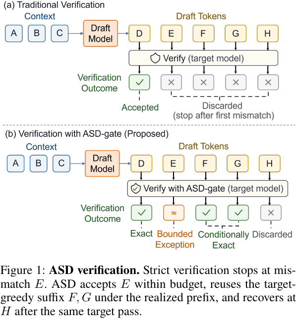
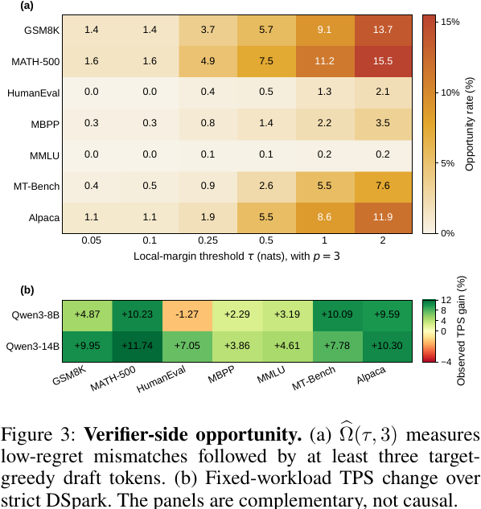
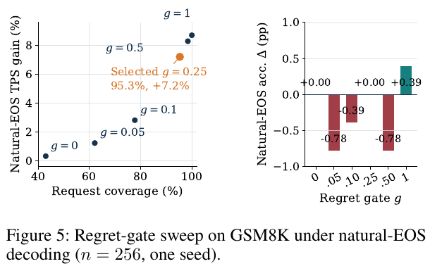
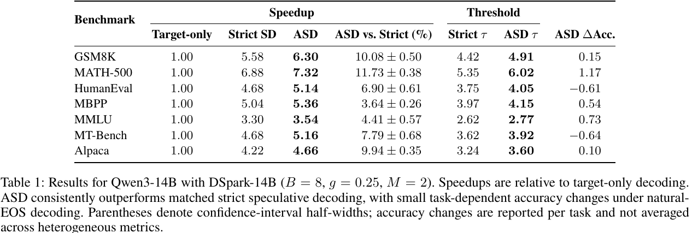
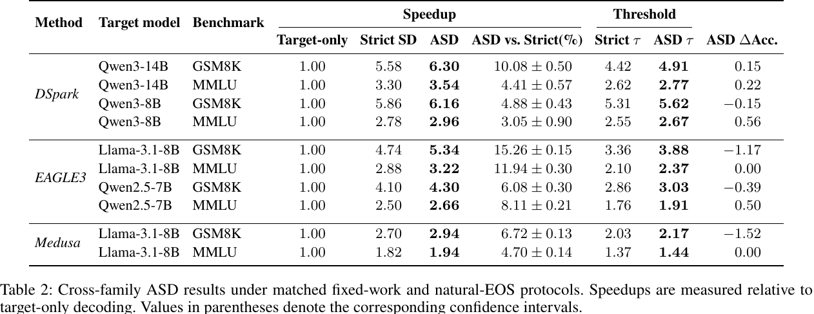
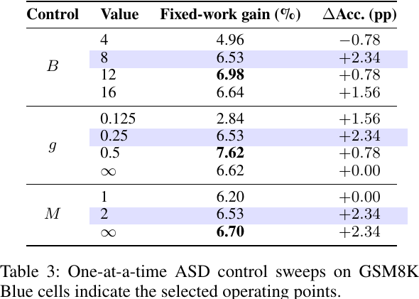
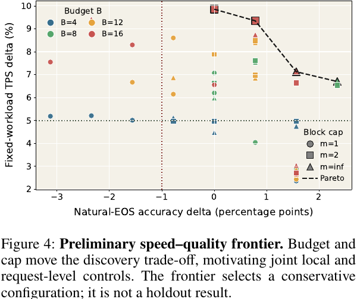
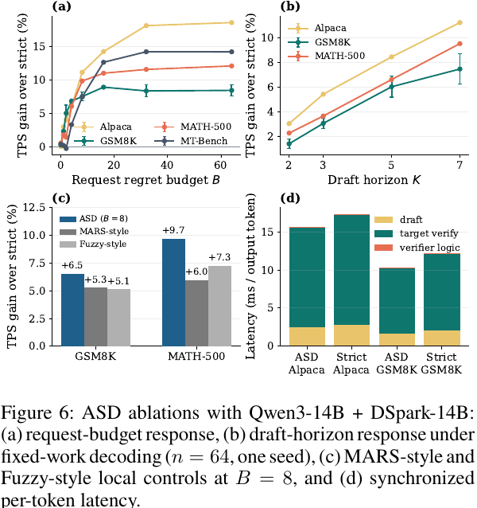
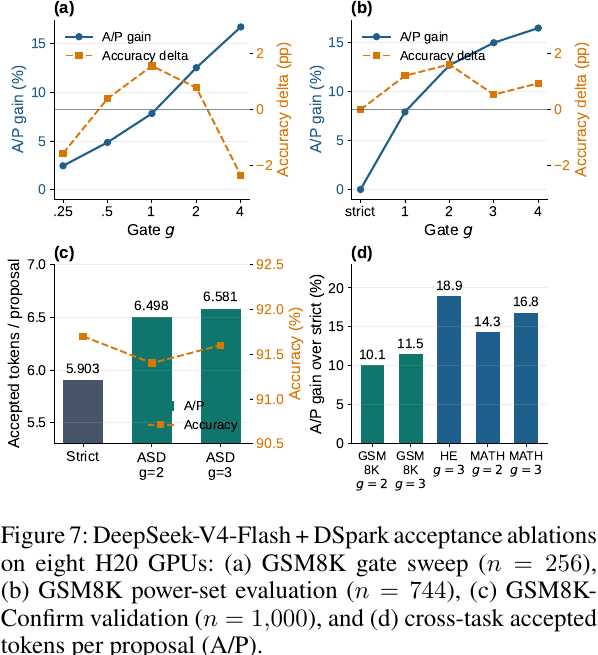

---
tags:
  - paper
  - collection/speculative-decoding
  - domain/model-systems
  - status/deep-review
  - topic/relaxed-verification
  - method/budgeted-prefix-selection
---

# Approximate Speculative Decoding 精读分析

> [!info] 文档关系
> - 文档类型：Paper
> - 领域入口：[README](../README.md)
> - 上位汇总：[Evolution](../surveys/evolution.md)
> - 证据资产：`../assets/papers/approximate-speculative-decoding/`
> - 相关文档：[Figure inventory](../evidence/approximate-speculative-decoding-figure-inventory.md)
> - 论文版本：[arXiv:2608.03447v3](https://arxiv.org/abs/2608.03447v3)
> - 官方代码：[Kissmetothemoon/ASD，固定提交 631fe172](https://github.com/Kissmetothemoon/ASD/tree/631fe172c5f5fbb1f4b80734f21594fb1bdc2d38)

## 修订信息

- 当前文档版本：`1.0.0`
- 当前修订 ID：`rev-asd-initial-20260909`
- 当前修订时间：`2026-09-09T00:20:00+08:00`
- 替代版本：无，首次交付

| 修订 ID | 文档版本 | 时间 | 类型 | 替代修订 | 变更摘要 | 依据 | 对结论影响 |
|---|---|---|---|---|---|---|---|
| `rev-asd-initial-20260909` | `1.0.0` | `2026-09-09T00:20:00+08:00` | `initial` | 无 | 建立单篇因果闭环、公式卡、图表证据、实现与基础设施审计 | arXiv v3 PDF/TeX、官方代码固定提交、逐图视觉检查 | material |

## 0. 资料、作者与配图索引

### 0.1 资料状态

- 主资料：arXiv v3 PDF、TeX 源码与 9 页正文，版本日期为 2026-08-30。[1]
- 开源实现：官方仓库固定到提交 `631fe172c5f5fbb1f4b80734f21594fb1bdc2d38`。[2]
- 代码验证：执行 `PYTHONPATH=src python3 -m unittest discover -s tests -v`，83 项测试中 72 项通过、11 项因本机未安装 PyTorch 跳过。通过项覆盖纯 Python 前缀规则、请求预算持久化、零预算严格一致性、复现实验协议和资产一致性；未覆盖 GPU 张量路径、真实模型推理与论文吞吐复现。
- OpenReview：检索未发现本论文对应页面，无法进行公开审稿意见、作者回复和决定的交叉核验。
- SGLang 集成状态：公开 PR 仍提供额外实现证据，但不是已合入主线的事实依据。[3]

### 0.2 作者与机构核验

完整作者顺序为：Yuannuo Feng、Zegang Peng、Yuxin Xie、Yubing Ye、Yizhe Chen、Wenshuai Yao、Wenyong Zhou、Wang Kang。

- 共同第一作者：Yuannuo Feng（北京航空航天大学集成电路科学与工程学院）、Zegang Peng（清华大学精密仪器系）。依据是标题块的 `*` 与 “These authors contributed equally”。
- 通讯作者：Wenyong Zhou（香港大学电机电子工程系）、Wang Kang（北京航空航天大学集成电路科学与工程学院）。依据是标题块的 `†` 与通讯作者图例。
- 其余作者机构去重后包括：北京航空航天大学集成电路科学与工程学院、香港大学工程学院、北京大学集成电路学院。

### 0.3 图表索引与算法总览

本文嵌入 9 个论文对象：3 个方法/机制图、3 个结果表、3 个消融或系统图。所有裁剪均包含完整原始 caption，并经过联系表和逐图原分辨率检查；边界与来源见 `figure_inventory.md`。

> 图 1（原论文 Figure 1）是本文采用的算法总览：严格验证在第一个不匹配 token `E` 处停止；ASD 在预算内接受 `E`，随后复用在该已实现前缀下仍为目标模型贪心选择的 `F,G`，并在 `H` 处恢复。它清楚呈现输入、验证阶段、状态改变和输出边界，因此不另造 AI 示意图。

## 1. 一页结论

**ASD 的核心不是“放宽一次匹配就多收一个 token”，而是“付出一次有界的局部偏离，解锁其后已经被目标模型打分、且在实际新前缀下仍然贪心正确的连续后缀”。** 它只改验证器的提交决策，不训练新 draft model，也不增加目标模型前向。

对 Qwen3-14B + DSpark-14B 的七项任务，论文报告 ASD 相对匹配的严格验证提高固定工作量吞吐 `3.64%–11.73%`，平均 `7.78%`；跨 DSpark、EAGLE3、Medusa 的十个配置报告 `3.05%–15.26%` 正收益。最强的因果证据来自 Figure 6(d)：ASD 的验证器逻辑只增加 `0.083/0.045 ms` 每输出 token，而目标验证耗时减少 `1.479/1.509 ms`，说明收益确实与减少昂贵验证轮次一致。

但它不是无损解码。论文明确报告 GSM8K 与 MATH-500 的输出哈希差异超过 95%，即使任务准确率没有下降。预算约束的是沿实际生成路径累积的**局部目标 logit 差**，不是完整序列概率比、语义差异、安全性或任务正确率。

综合判断：**机制成立、系统证据方向一致，但质量安全只能按模型、draft、任务和生成长度逐项校准。** 此外，v3 结果表存在数值口径冲突，公开仓库也未包含重建所有 Qwen/EAGLE3/Medusa 主表的原始逐次记录，因此 headline 数字应视为论文报告值，而非本次独立复算结果。

## 2. 研究动机与问题—方案闭环

### 2.1 为什么会有可利用的“后缀机会”

标准贪心式投机解码让 draft model 一次提出 $K$ 个 token，目标模型在 teacher forcing（把 draft 前缀作为已知输入）的条件下一次并行计算 $K+1$ 行 logits。严格验证从左到右检查，一旦 draft token 与对应行的 target argmax 不一致，就停止提交并丢掉后续 draft token。

关键浪费是：**停止提交不等于目标模型没有算后续位置。** 第 $j$ 行目标 logits 本来就是在 $(h_0,x_{<j})$ 上计算的。如果验证器接受了较早的不匹配 $x_i$，这个 draft-forced 历史就成为真实已提交历史；后面的 $x_j=y_j^*$ 因而已经是在正确历史下的目标贪心 token，不需要再跑一次目标前向。

### 2.2 现有方案为何不够：两个具体失败场景

**失败场景 A：严格 first-mismatch 丢掉已算好的结果。** 假设 draft 提出 `D,E,F,G,H`，目标验证结果是 `D` 精确匹配、`E` 仅比 top-1 低很小的 logit、`F,G` 在含 `E` 的前缀下都是 top-1。严格策略仍在 `E` 截断，只提交 `D`；下一轮还要重新计算本可直接提交的 `F,G`。把 draft 做得更强可以减少不匹配，却没有改变“任何不匹配都清空后缀”的二元规则。

**失败场景 B：只设局部阈值会让小偏离随长度累积。** 假设每个 block 都允许一个 $r_i=0.2$ 的不匹配。单次看都很小，但 100 个 block 后累计局部 regret 已达 20。每个 block 重置额度，无法表达同一请求早先已经偏离多少；单纯调紧局部阈值只能减少频率，仍不能给整条请求设置总上限。

> Figure 3(a) 显示“低 regret 不匹配后紧跟至少 3 个 target-greedy draft token”的机会确实存在，但任务差异很大；Figure 3(b) 给出吞吐变化。论文自己强调两者是互补证据，不构成逐任务因果映射。

### 2.3 问题、方案与证据闭环

| 环节 | 具体内容 | 改变的变量/行为 | 预期结果 | 证据与边界 |
|---|---|---|---|---|
| 痛点 | 第一个不匹配使已计算后缀失效 | 每轮提交 token 数偏低 | 更多目标验证轮次 | Introduction、Figure 1 |
| 根因 | 严格 verifier 只看 token-ID 相等性 | 近似并列与强烈反对被同等处理 | 有价值后缀无法复用 | Eqs. 1–3 |
| 目标 | 在可审计偏离下选择最长连续前缀 | 接受长度 $a$、累计支出 $s$ | 每次目标前向提交更多 token | Algorithm 1 |
| 局部控制 | $r_i/q_i\le g$ | 过滤昂贵不匹配 | 控制单次偏离 | Figure 5；单 seed |
| block 控制 | $N_t\le M$ | 限制一次 proposal 内的例外数 | 避免偏离集中 | Table 3；单变量 sweep |
| 请求控制 | $C_t\le B-s$ | 跨轮次持久记账 | 总局部 regret 不超预算 | 代码与单元测试直接支持 |
| 连续前缀 | 不跳过不可行位置 | cache 与验证行保持同一历史 | 后缀可无额外前向复用 | Proposition 1 |
| 系统结果 | 接受长度上升、验证轮次减少 | target verify 时间下降 | TPS 上升 | Tables 1–2、Figure 6(d) |
| 剩余边界 | 接受过不匹配后轨迹已改变 | 哈希、语义、正确率可能变化 | 必须按任务质量审计 | 自然 EOS 结果、Figure 5 |

## 3. 术语与符号解释

### 3.1 术语表

| 术语 | 本文含义 | 不等于/易混项 | 来源 |
|---|---|---|---|
| speculative decoding（投机解码） | 小型 draft model 先提议多个 token，目标模型并行验证后提交前缀 | 不等于跳过目标模型验证 | Introduction |
| strict greedy verification（严格贪心验证） | 只接受从开头连续、且 token ID 等于 target argmax 的最长前缀 | 不等于概率采样的 rejection sampling | Eq. 2 |
| teacher-forced target row（强制前缀下的目标行） | 目标模型第 $i$ 行 logits 在 draft 前缀 $x_{<i}$ 条件下计算 | 不一定属于原始 target-only 贪心轨迹 | Eq. 1 |
| realized prefix（已实现前缀） | ASD 实际接受并提交的连续 draft 前缀 | 不等于严格目标模型原本会生成的前缀 | Proposition 1 |
| local target-logit regret（局部目标 logit 遗憾） | target top-1 logit 与 draft token logit 的差 | 不是错误概率、语义距离或任务损失 | Eq. 3 |
| suffix value（后缀价值代理） | 从当前位置到 proposal 末尾的剩余长度，用于近似可能解锁的后缀价值 | 不是实际可复用 token 数或最优收益 | Eq. 6 |
| request ledger（请求级账本） | 跨所有解码轮次累计已接受不匹配的局部 regret | 不重置于每个 block；不是概率保证 | Eqs. 8–13 |
| bounded exception（有界例外） | 满足局部 gate、block cap 和请求预算的不匹配 token | 仍会改变生成轨迹 | Figure 1 |
| fixed-workload（固定工作量） | 各组生成相同完成 token 数，用于比较 TPS | 不评估自然停止后的任务质量 | Experimental Setup |
| natural-EOS（自然结束） | 允许模型按 EOS 结束，用于审计准确率、长度和输出哈希变化 | 与固定工作量速度实验分离 | Experimental Setup |
| A/P | 每个 proposal 被接受的 token 数，用于 DeepSeek 验证器侧分析 | 不是 TPS 或端到端时延 | Figure 7 |

### 3.2 符号表

| 符号 | 含义 | 性质 | 作用域/单位 | 来源与歧义 |
|---|---|---|---|---|
| $h_0$ | 当前已提交历史 | author-defined | 一次验证轮次 | Eq. 1 |
| $x_{1:K}$ | draft 提出的长度 $K$ 的 token block | author-defined | token 序列 | Eq. 1 |
| $z_i(v)$ | 在 $(h_0,x_{<i})$ 下 token $v$ 的目标 logit | author-defined | 第 $i$ 行/nat | Eq. 1 |
| $y_i^*$ | 第 $i$ 行的 target argmax token | author-defined | token ID | Eq. 1；依赖 draft-forced 历史 |
| $a_{strict}$ | 严格验证可提交的连续前缀长度 | author-defined | token 数 | Eq. 2 |
| $r_i$ | $z_i(y_i^*)-z_i(x_i)$ | author-defined | logit 差/nat | Eq. 3；不是校准风险概率 |
| $\widehat\Omega(\tau,p)$ | 低 regret 不匹配后有 $p$ 个连续精确 token 的经验比例 | author-defined | 比例 | Eq. 4 |
| $d_i$ | draft token 是否与 target argmax 不同 | author-defined | 0/1 | Eq. 5 |
| $q_i$ | $K-i+1$，剩余 proposal 长度 | author-defined | token 数 | Eq. 6；DeepSeek 复现代码另用归一化版本 |
| $g$ | 最大允许的 $r_i/q_i$ | author-defined | nat/token | Eq. 7；跨模型不可直接解释为同等质量风险 |
| $B,s$ | 请求总 regret 预算、已花费预算 | author-defined | nat | §Budgeted Prefix Verification |
| $C_t,N_t$ | 截止 $t$ 的累计 regret、例外个数 | author-defined | nat/count | Eq. 8 |
| $M$ | 单个 block 最多允许的不匹配数 | author-defined | count | Eq. 10 |
| $a_{ASD}$ | 满足全部约束的最长连续前缀长度 | author-defined | token 数 | Eq. 11 |
| $f_i$ | 第 $i$ 位置是否可行的布尔标记 | author-defined | boolean | Eq. 14 |
| $\tau$ | 平均每轮接受长度 | author-defined metric | token/round | Tables 1–2；不要与 Eq. 4 阈值 $\tau$ 混淆 |

## 4. 方法详解与公式解释卡

### 4.1 第一步：目标模型在 draft 前缀上并行打分

$$
z_i(\cdot)=\mathrm{Target}(h_0,x_{<i}),\qquad y_i^*=\arg\max_v z_i(v).
$$

> **公式卡 F1：它回答什么？** 第 $i$ 个 draft token 应该与哪个目标 token 比较。
>
> **通俗读法：** 目标模型假设前面的 draft token 已经发生，在这个条件下为当前位置所有词打分，最高分 token 是 $y_i^*$。
>
> **输入与输出：** 输入是历史 $h_0$ 和 draft 前缀 $x_{<i}$；输出是 logits 行 $z_i$ 与 top-1 token $y_i^*$。
>
> **直觉与边界：** 后续行不是在严格 target-only 轨迹上算的，而是在 draft-forced 历史上算的；只有 ASD 真正提交同一连续前缀时，这些行才与实际历史一致。
>
> **小例子：** 若接受 `E` 后，`F` 对应行本来就是在 `...E` 条件下计算，那么 `F=y_F^*` 可直接提交。

### 4.2 第二步：把不匹配的代价量化为局部 regret

**条件历史为什么重要**

目标模型第 $i$ 行不是在抽象的“正确答案”上打分，而是在具体的 draft 前缀 $x_{<i}$ 上打分。因此，ASD 一旦决定提交这段连续前缀，后续行的条件历史才真正成立；这也是可复用后缀的来源。

**严格规则浪费了什么**

严格验证把所有 token-ID 不匹配都视为相同事件，不使用目标模型“只略微偏好 top-1”这一强弱信息。它保住输出等价性，但也会在一个近似并列 token 后丢弃已经算好且条件有效的精确后缀。

**局部 regret 改变了什么**

ASD 用两个 logits 的差把不匹配从二元事件改成可记账的局部代价，使验证器能拒绝高代价例外、考虑低代价例外。这个量只改变提交策略，不把近似 token 重新定义成严格正确，也不等于语义风险。

$$
r_i=z_i(y_i^*)-z_i(x_i)\ge 0.
$$

> **公式卡 F2：它回答什么？** 目标模型在当前位置更偏好自己的 top-1，而不是 draft token 的程度有多大。
>
> **通俗读法：** 两者 logits 越接近，接受 draft token 牺牲的局部目标偏好越小。因为 softmax 的归一化项抵消，$r_i$ 也等于两者条件 log probability 的差。
>
> **输入与输出：** 输入是目标 top-1 logit 和 draft token logit；输出是非负的 logit 差，单位可视为 nat。
>
> **直觉与边界：** $r_i=0.1$ 不代表 10% 错误率，也不能保证语义接近；它只衡量单个已实现历史下的一步偏好差。
>
> **小例子：** top-1 logit 为 5.0、draft token logit 为 4.8，则 $r_i=0.2$。

### 4.3 第三步：把局部代价与潜在后缀价值配对

$$
q_i=K-i+1,\qquad \frac{r_i}{q_i}\le g.
$$

> **公式卡 F3：它回答什么？** 一个不匹配是否“值得”作为例外接受。
>
> **通俗读法：** 越靠前的不匹配，后面可能解锁的已打分位置越多，因此允许的绝对 regret 可以相对更大；靠近 block 末尾时，同样的 regret 换不来多少后缀。
>
> **变量角色：** $q_i$ 是剩余长度代理，$g$ 是局部门槛，$r_i/q_i$ 是每单位潜在后缀价值的代价。
>
> **边界：** $q_i$ 不是实际后缀长度的预测，论文也不声称该比例是最优决策规则。它偏向早期例外，但仍可能付出 regret 后没有解锁任何精确后缀。
>
> **小例子：** $K=7,i=2$ 时 $q_i=6$；若 $r_i=0.6,g=0.25$，则 $0.1\le0.25$，局部 gate 通过。

### 4.4 第四步：同时执行局部、block 与请求级约束

$$
C_t=\sum_{i=1}^{t}d_ir_i,\qquad N_t=\sum_{i=1}^{t}d_i,
$$

$$
C_t\le B-s,\qquad N_t\le M,\qquad r_i/q_i\le g\quad(\forall i\le t\text{ 且 }d_i=1).
$$

> **公式卡 F4：它回答什么？** 截止位置 $t$ 的连续前缀是否可以整体提交。
>
> **通俗读法：** 新前缀花费不能超过请求剩余预算，当前 block 的例外数不能超过 $M$，而且其中每个不匹配都必须单独通过局部 gate。
>
> **输入与输出：** 输入是每个位置的匹配状态与 regret、历史支出 $s$、预算 $B$、上限 $M$ 和 gate $g$；输出是“前缀可行/不可行”。
>
> **直觉：** 三个约束分别防止“单次太贵”“一次集中太多”“很多小偏离跨轮累积”。任一缺失都留下不同风险。
>
> **边界：** 预算度量仍是局部 logit regret 的和，不是完整序列的质量距离。

### 4.5 第五步：只提交最长连续可行前缀

$$
a_{\mathrm{ASD}}=\max\{t\in\{0,\ldots,K\}:x_{1:t}\text{ is feasible}\}.
$$

> **公式卡 F5：它回答什么？** 一次验证最终提交多少个 draft token。
>
> **通俗读法：** 从第一个 token 开始向右走，走到第一个不可行位置就停止，不能跳过它再接受后面的位置。
>
> **输入与输出：** 输入是各位置可行性；输出是接受长度 $a_{ASD}$。
>
> **为什么必须连续：** 跳过位置 $i$ 后再接受 $i+1$，会让 $z_{i+1}$ 使用的历史与真正提交的 cache 历史不同，破坏后缀复用依据。
>
> **恢复：** 若 $a<K$，提交 $x_{1:a}$ 再使用同一目标前向已给出的 $y_{a+1}^*$；若 $a=K$，附加第 $K+1$ 行 bonus token。

### 4.6 请求账本更新与理论保证

$$
s'=s+C_{a_{ASD}}\le B.
$$

> **公式卡 F6：它回答什么？** 当前轮接受的例外如何影响后续轮次。
>
> **通俗读法：** 每次只对实际提交前缀中的不匹配收费，并把花费持久保留到同一请求结束；预算耗尽后自然退化为严格验证。
>
> **保证：** 代码和公式共同保证已接受例外的累计局部 regret 不超过 $B$。Proposition 1 还保证：若已提交后缀位置满足 $x_j=y_j^*$，它确实是在当前 ASD 已实现历史下的 target-greedy token，不需要再次目标前向。
>
> **不保证：** 早先的例外已经改变历史，因此这不能恢复原始 target-only 贪心轨迹，也不能推出语义、准确率、安全或分布等价。

## 5. 组件级设计动机与具体问题映射

### 5.1 局部 regret gate

只看 token ID 会把“几乎并列”和“目标模型强烈反对”混为一谈；局部 gate 用 logit 差区分两者。它无需校准完整概率分布，但代价是 logit 尺度依模型而变，$g$ 不能跨模型直接复用。Figure 5 显示放宽 $g$ 会扩大请求覆盖和 TPS，同时准确率有非单调波动；这是趋势证据，不是单 token regret 到任务质量的校准证明。

> Figure 5 的选定 $g=0.25$ 覆盖 95.3% 请求并带来 7.2% TPS 增益，在这次 GSM8K、$n=256$、单 seed 审计中准确率变化为 0；更宽 gate 的波动说明仍需质量审计。

### 5.2 每 block 例外上限

即使每个不匹配都便宜，一次 proposal 内连续接受很多例外也可能使局部路径快速偏移。$M$ 限制单轮例外密度，简单、易实现；代价是它不感知例外的语义位置。Table 3 的单变量扫描表明 $M=\infty$ 比 $M=2$ 只多 `0.17 pp` 固定工作量增益，同时两者该次准确率变化相同；这支持“有限 cap 是保守控制”，但不足以证明 $M=2$ 普遍最优。

### 5.3 持久请求预算

请求账本解决 block-local 规则看不到历史偏离的问题。官方 `RequestRiskState` 保存 `spent`，只为真正提交的 mismatch 调用 `charge()`；单元测试验证预算跨 block 持久、不同请求不串账、预算耗尽后回到严格行为。它是 ASD 最明确的安全工程边界，但所谓“风险”只指局部 logit regret，不应扩展解读为业务风险。

### 5.4 最长连续前缀与同次前向恢复

连续性不是启发式，而是 cache 语义约束。目标行 $z_j$ 以 $x_{<j}$ 为历史；只要提交同一个 $x_{1:j-1}$，该行有效。跳过失败位置会造成历史空洞。这个设计限制了可接受集合，却换来无需再跑 target forward 的确定实现边界。

### 5.5 设计动机汇总

| 设计 | 动机来源 | 具体问题 | 因果机制 | 替代方案与权衡 | 验证证据 | 判断 |
|---|---|---|---|---|---|---|
| $r_i$ 局部 regret | author-stated | token-ID 规则过于二元 | 区分近似并列与高代价不匹配 | 概率/KL gate 更有统计含义但更贵或需分布 | Eq. 3、Figure 5 | 部分支持：任务质量未校准 |
| $r_i/q_i\le g$ | author-stated | 早期例外潜在解锁更多后缀 | 以剩余长度归一化局部代价 | 真实未来收益预测更准但需额外模型 | Figure 6(b) | 间接支持：horizon 趋势符合预期 |
| block cap $M$ | author-stated | 例外可能集中 | 限制每轮不匹配密度 | 无 cap 更快但路径偏离更集中 | Table 3 | 敏感性支持，非独立质量证明 |
| 请求预算 $B-s$ | author-stated | 小偏离跨轮累积 | 持久账本限制累计局部 regret | 每 block 重置无法约束全请求 | Eq. 9、代码测试 | 直接支持记账不变量 |
| 最长连续前缀 | author-stated | 跳过位置破坏 cache 历史 | 提交历史与目标行条件完全一致 | 非连续选择可能多收 token，但需重算 | Proposition 1 | 形式论证支持 |
| $B=0$ 严格旁路 | author-stated/code-defined | logit tie 时 $r=0$ 但 token ID 不同 | 直接走 token-ID 严格验证 | 仅按 regret 会错误接受 tie | `budget.py`、测试 | 直接支持 |

## 6. 实验：哪些结论站得住

### 6.1 主结果：Qwen3-14B + DSpark-14B

> Table 1 报告固定配置 $(B,g,M)=(8,0.25,2)$ 在七项任务上的结果。相对严格验证的论文报告 TPS 增益均为正，范围 `3.64%–11.73%`，算术平均 `7.78%`；平均接受长度从 3.85 增到 4.20。

质量列必须按任务分别解释：HumanEval 为 `-0.61 pp`、MT-Bench 为 `-0.64`，其余五行非负。论文同时披露 GSM8K 与 MATH-500 的完成哈希差异超过 95%，所以“任务得分未下降”不能写成“输出基本相同”。

**口径冲突：** Table 1 的 `Target-only/Strict SD/ASD` 是归一化 speedup，但 `ASD vs. Strict (%)` 无法由显示的两列直接复算。例如 MATH-500 的 $7.32/6.88-1\approx6.40\%$，而表中报告 `11.73%`。正文称百分比来自 B-C-B 的相邻 strict 角色配对，归一化列可能采用另一聚合口径；源码没有给出足够逐次数据来独立还原。因此本文保留两组数值，但不把它们互相推导。

### 6.2 跨 draft 家族迁移

> Table 2 在 DSpark、EAGLE3、Medusa 的十个配置上都报告正 TPS 增益，范围 `3.05%–15.26%`；接受长度每格都提高 `0.07–0.52` token。它支持“ASD 是 verifier-side、并不绑定某一种 draft 架构”。

质量变化并不单向：十格中四格下降，最差为 Medusa + Llama-3.1-8B/GSM8K 的 `-1.52 pp`。此外，同一 Qwen3-14B/MMLU 设置在 Table 1 报 `+0.73 pp`，Table 2 报 `+0.22 pp`；论文未解释差异，不能合并为单一确定值。

### 6.3 参数控制不是一个旋钮

> Table 3 分别改变 $B,g,M$，其余两项固定。最高速度点并非论文冻结点：$B=12$、$g=0.5$、$M=\infty$ 分别取得更高 gain，而冻结的 `8/0.25/2` 是速度—质量折中选择。

> Figure 4 是 discovery 数据上的初步 Pareto 前沿，不是 holdout 结果。它能说明预算与 cap 确实改变折中面，不能当作最终泛化证据。

### 6.4 最强的机制与系统归因证据

> Figure 6(a) 显示增加 $B$ 后收益先升后平台；(b) 显示 draft horizon $K$ 越长，ASD 相对 gain 越大，符合“早期例外解锁更多后缀”的机制预期；(c) 在匹配最大已实现 regret 的条件下优于 MARS-style/Fuzzy-style 局部控制；(d) 直接测得验证器额外开销远小于节省的 target verify 时间。

收益归因分级：

| 结论 | 证据类型 | 判断 |
|---|---|---|
| ASD 增加每次 target pass 提交的 token 数 | Tables 1–2 中接受长度同步上升 | 直接但由论文报告 |
| 更长 $K$ 增加后缀复用价值 | Figure 6(b)，$n=64$、单 seed | 中等趋势证据 |
| 请求预算优于只有局部 gate | Figure 6(c) 的 matched-regret 对照 | 较强，但只覆盖两任务 |
| TPS 来自 target verify 时间下降 | Figure 6(d) 同步时延拆分 | 最强直接系统证据 |
| 所有质量风险被 $B$ 控住 | 没有对应证明或全面实验 | 不支持 |

### 6.5 DeepSeek-V4-Flash：只能解读为接受率证据

> Figure 7 的 H20 八卡实验报告 A/P（每 proposal 接受 token 数）提升：独立 1,000 题 GSM8K-Confirm 中 $g\in\{2,3\}$ 提高约 `10.08%–11.48%`，准确率变化不超过 `0.30 pp`；HumanEval 与 MATH-500 也有正接受率变化。

这里**不能宣称端到端吞吐提升**。论文明确说明 DSpark 对 DeepSeek-V4-Flash 使用 FP4 混合精度，而 H20 原生支持 FP8、没有原生 FP4 路径，额外 Q/DQ（量化/反量化）破坏了干净的速度测量。因此 Figure 7 只证明 verifier-side acceptance 与任务准确率趋势。论文摘要还写 `284B`，Introduction 一处写 `285B`，本文保留为版本内部不一致。

官方代码仓库另附一组独立 DeepSeek 历史复现记录：500 个 GSM8K 请求中，TPS 从 `31.765` 到 `33.493`（复算 `+5.44%`），match rate 从 `478/500` 到 `474/500`（`-0.8 pp`），485 个请求的完整 token 序列变化。该记录与 Figure 7 不是同一实验，不能拼成一个结论。

## 7. 技术主张—证据矩阵

| 技术主张 | 论文证据 | 代码证据 | 证据等级 | 结论 |
|---|---|---|---|---|
| $B=0$ 精确退化为严格 token-ID 验证 | Algorithm 1 | `budget.py:125-149` 与零预算测试 | 直接 | 支持，包括 logit tie 情况 |
| 接受例外后可复用连续 target-greedy 后缀 | Proposition 1、Figure 1 | 连续前缀选择与 cache 集成补丁 | 形式论证 + 实现 | 支持，但仅相对已实现 ASD 历史 |
| 不增加 target forward | 算法位置在普通验证后 | `DeepSpecDSparkAdapter.decide()` 只读已有 logits | 直接 | 支持策略层；真实引擎未本机运行 |
| 额外规则复杂度为 $O(K)$ | Eq. 14 与 cumulative scan | `choose_prefix` 线性循环 | 直接 | 支持 CPU 参考实现 |
| 不需额外 $K\times|V|$ buffer | 论文实现建议 | 参考 adapter 实际接收 full logits 并复制 compact scores 到 CPU | 设计可行性 | 论文概念可行，公开参考实现未实现生产优化 |
| 三个约束各自必要 | Table 3、Figures 4–6 | 配置与测试覆盖 | 部分隔离 | 支持控制作用，不证明普遍最优值 |
| 跨 draft 家族普遍增益 | Table 2 | 仓库无全部原始记录 | 论文报告 | 尚未独立复现 |
| 任务质量可由 regret 预算保证 | 无 | 无 | 无证据 | 不支持；只能经验审计 |

## 8. 代码与实现审计

固定代码提交：`631fe172c5f5fbb1f4b80734f21594fb1bdc2d38`。[2]

### 8.1 论文到代码映射

| 论文机制 | 代码路径/函数 | 对照结论 |
|---|---|---|
| $r_i=\max z-z(x_i)$ | `src/asd/budget.py::choose_prefix` 116–123 | 与 Eq. 3 一致，浮点负差截为 0 |
| 默认 $q_i=K-i+1$ | `default_suffix_values` 87–89 | 与论文 Eq. 6 一致（Python 零索引写作 `length-index`） |
| 最长连续前缀 | `choose_prefix` 133–150 | 第一不可行位置立即 `break` |
| 请求预算持久化 | `RequestRiskState` 34–73 | `spent`、`remaining`、`charge` 明确建模 |
| 只对已提交 mismatch 收费 | `choose_prefix` 152–159 | 先定 accepted，再更新 state |
| 零预算严格一致 | `choose_prefix` 125–149 | $B=0$、$g=0$ 或 $M=0$ 都走 token-ID 严格分支 |
| full-logit 接入 | `src/asd/adapters/deepspec.py` | 在 target pass 后读取 `[K,V]`，支持额外 recovery row |
| 固定配置 | `configs/dspark_stable.json` | $B=8,g=0.25,M=2,T=0$ |
| 速度/质量分离 | `src/asd/metrics.py`、`docs/EVALUATION.md` | B-C-B 速度资格与 natural-EOS 质量门分开 |

### 8.2 两套实现语义不能混用

Qwen 主 API 使用未归一化 $q_i=K-i+1$，稳定配置是 `B=8,g=0.25,M=2`。DeepSeek 复现子模块 `src/asd/reproduce/dspark/` 使用归一化 suffix value $(K-i+1)/K$，配置为 `B=2.0625,g=2.0625,m=1`、block size 5。两者参数尺度不同；把 DeepSeek 的 $g$ 直接套到 Qwen 主实现会改变 gate 含义。

### 8.3 测试结果与未覆盖面

本机测试结果是 83 项中 72 项通过、11 项跳过。跳过原因是当前 Python 环境没有 PyTorch；因此 `FullLogitScoreProvider`、device-resident tensor rule 和 GPU parity 没有执行。更重要的是，单元测试不等于论文实验复现：模型权重、L20/H20、DeepSpec/SGLang 服务和所有 benchmark 原始记录没有在本机运行。

公开 SGLang patch 的单元测试主要检查文件/哈希和策略行为；本次未把公开 PR 状态当作主线集成。正式部署前还需在目标 engine 版本上做 patch apply、启动、B=0 token identity、batch/slot 生命周期和请求结束清理测试。[3]

## 9. 基础设施与性能分析

### 9.1 计算与显存

ASD 不改变目标模型或 draft model 参数量，也不增加目标前向。额外计算是长度 $K$ 上的 max/gather、减法、累计和、布尔前缀和状态更新，理论为 $O(K)$。其工作集是 $O(K)$ 紧凑分数与布尔量；相对于模型 KV cache 很小。

但参考 `FullLogitScoreProvider` 接收 `[K,V]` full logits，并把 top logits、top IDs、draft logits复制到 CPU tuple。若服务引擎本来不会物化完整 vocabulary logits，这种参考实现可能增加显存流量、设备同步和主机开销。论文提出的生产路径只需要三个紧凑值：每行 top token、top logit、draft-token logit；应在 GPU/NPU 上融合提取，并让请求预算留在设备侧。

### 9.2 带宽与 kernel

论文没有报告 bytes moved 或峰值带宽，因此无法计算有效带宽利用率。可以确定的是：若从 `[K,V]` 重新扫完整 logits，代价随词表 $V$ 放大；若 top-1 已由采样/验证 kernel 产生，只需额外 gather $K$ 个 draft token logit，代价接近 $O(K)$。Figure 6(d) 的同步 profile 说明所测实现 verifier logic 开销小，但不能自动外推到不同 engine、batch、tensor parallel 或 NPU 实现。

### 9.3 并行与通信

在 tensor parallel 下，target top-1 可能需要跨 rank 的最大值归约，draft-token logit 也要按 vocabulary shard 定位或归约。ASD 没有新增模型层通信，但若 verifier 现有路径不保留全局 top logit，就会增加小规模 collective。论文没有报告通信体积、NVLink/PCIe 利用率或多请求调度影响。

### 9.4 Cache 与调度生命周期

请求级 $s$ 必须与 request ID/slot 生命周期绑定：prefill 初始化、decode 每轮原子更新、请求完成或 slot 复用时清零。target cache、draft cache 与提交前缀必须同步裁剪，只能推进到实际输出序列。这里的状态错误比公式错误更危险：预算串请求或 cache 多推进一个 token 都会使后续目标行条件失真。

### 9.5 数据类型与异构硬件

局部 regret 是两个 logits 的差，对低精度量化和 tie 边界敏感。论文主实验使用 PyTorch 2.8.0+cu128、vLLM 0.11.0、单张 NVIDIA L20（46,068 MiB）；DeepSeek 接受率实验使用 8 张 H20。论文没有给出 Ascend/NPU kernel 或 CANN 集成。

若移植到 NPU，关键不是模型算子本身，而是 verifier 后处理：在设备上取得 top-1 和 draft logit、维护按请求索引的 $s$、生成连续前缀长度、避免 Host 同步，并与 KV cache rollback/commit 算子对齐。FP16/BF16/FP8 的 logit 差边界应做 B=0 identity 与阈值邻域回归测试。

## 10. 相关工作对照

| 路线 | 改变什么 | 优点 | 主要边界 | 与 ASD 的关系 |
|---|---|---|---|---|
| 严格 greedy SD | draft token 必须等于 target argmax | 保持目标贪心输出 | first mismatch 后丢弃后缀 | ASD 放弃输出等价换接受长度 |
| exact speculative sampling | rejection correction 保持目标分布 | 分布无损 | 校正与采样逻辑更复杂 | ASD 只支持 greedy，不保持分布 |
| 更强 drafter / EAGLE3 / Medusa | 提高 proposal 质量或并行候选 | 可提高基础接受率 | 仍受 verifier 规则限制 | ASD 与 proposal 改进互补 |
| MARS/Fuzzy 类局部 relaxed verifier | 用 margin、语义或局部不确定性放宽接受 | 简单、局部自适应 | 偏离可跨轮累积 | ASD 增加请求级账本与连续后缀语义 |
| 稀疏/部分 target verification | 减少 target 验证计算 | 可直接降低单轮成本 | 可能需 kernel/模型结构改变 | ASD 不减少一次 target pass 计算，而减少轮数 |

公平性注意：Figure 6(c) 对 MARS-style/Fuzzy-style 使用最大已实现 regret 匹配，这是比任意阈值更公平的对照，但实现细节与任务数有限；不能据此宣称 ASD 普遍优于所有 relaxed verification。

## 11. 数值一致性与可复现性审计

### 11.1 已确认的一致项

- Table 1 的七个 `ASD vs. Strict` 报告值算术平均为约 `7.78%`。
- Table 2 的十个正 gain 与正文 `3.05%–15.26%` 范围一致。
- Figure 6(d) 的 verifier logic 增量与 target verify 降幅方向符合“多提交 token、少跑轮次”的机制。
- 官方纯 Python 代码与 Algorithm 1 的连续前缀、预算和 cap 语义基本同构。

### 11.2 未能调和的冲突

1. Table 1 的归一化 Strict/ASD speedup 之比与 `ASD vs. Strict (%)` 不一致，论文没有给出足够原始运行记录解释聚合口径。
2. Qwen3-14B/MMLU 的准确率变化在 Table 1 为 `+0.73 pp`，Table 2 为 `+0.22 pp`。
3. DeepSeek-V4-Flash 规模在摘要为 `284B`，Introduction 为 `285B`。
4. 代码 README 的 Qwen 汇总快照与 v3 论文部分数字有版本漂移，不能用 README 反向“修正”论文。

这些问题不推翻局部算法，但削弱 headline 表格的独立可复算性。发布引用时应明确“论文报告”，不应写成复现实测。

## 12. 局限、适用条件与部署建议

### 12.1 论文层面的局限

- 只支持 greedy decoding；不保持采样分布。
- 局部 regret 的累计上限不是完整序列 likelihood ratio 上限。
- 任务准确率审计多数规模较小，部分敏感性图只有一个 seed。
- 高哈希差异说明路径变化广泛，未覆盖安全、事实性、风格约束和长文本一致性。
- 主结果集中在单卡、低 batch 条件；并发服务、尾延迟和 scheduler 交互未报告。
- Figure 7 的 DeepSeek 结果受 FP4-to-FP8 兼容路径影响，只能作为接受率证据。

### 12.2 代码层面的局限

- 参考 adapter 期望 batch size 1，并从 full logits 搬运紧凑分数到 CPU，不是融合生产 kernel。
- 本机未运行 PyTorch/GPU tensor 路径和真实 engine。
- 仓库没有足够原始记录重建论文全部 Qwen/EAGLE3/Medusa 表格。
- Qwen 与 DeepSeek 子模块的 suffix value 归一化不同，配置不可混用。

### 12.3 推荐的上线门槛

1. 先以 $B=0$ 做逐 token identity gate，覆盖 logit tie、不同 dtype、batch、tensor parallel 与 cache rollback。
2. 在独立 calibration 集上搜索 $B,g,M$，不要用测试集挑点。
3. 速度用同卡 B-C-B；质量用 natural-EOS，分别报告准确率、长度、hash divergence 和业务指标。
4. 对代码、数学、工具调用等脆弱任务设更严格预算，或默认严格模式。
5. 将 $s$、accepted length、例外数、预算耗尽位置作为线上观测项，但不要把 $s$ 命名为“安全分数”。
6. 评估 P50/P95/P99 延迟和并发吞吐，不只看离线 TPS。

## 13. 研究启发与待验证问题

### 13.1 可迁移启发

- verifier policy 本身是可优化面：proposal 已算出的信息是否被提交规则浪费，和 drafter 准确率同等重要。
- “局部允许 + 全局账本”是通用控制结构，可用于其他近似推理，但账本度量必须与实际风险校准。
- contiguous-prefix 约束展示了系统优化中的核心原则：只有计算图条件历史与 cache 提交历史一致，已计算结果才可安全复用。

### 13.2 待验证清单

- $r_i/q_i$ 是否优于直接 $r_i$、top-1/top-2 margin、entropy 或学习到的 suffix utility？
- 相同 $B$ 在不同模型 logit scale 下如何校准？是否需要温度或分位数归一化？
- 长生成中预算早耗尽与后耗尽的质量影响是否不同？
- 对 agent/tool-use、代码生成、结构化输出和安全约束，task accuracy 是否遗漏关键失败？
- batch>1、连续批处理、tensor parallel、CUDA Graph/NPU Graph 下，设备侧账本和 KV commit 如何避免同步？
- 能否把“可复用后缀长度”从剩余长度代理升级为低成本预测，而不抵消节省的 target pass？

## 14. 最终评价

ASD 找到了严格投机验证中的一个真实结构性浪费：目标模型已经在含早期 draft mismatch 的条件历史上算过后续行，而严格 first-mismatch 规则无条件丢弃它们。通过局部 gate、block cap、请求级账本和连续前缀约束，ASD 把这部分计算转成更多可提交 token；公式、参考代码与同步时延拆分形成了较完整的机制闭环。

它的正确定位是**可校准的近似 greedy verifier**，不是无损投机解码，也不是任务质量保证器。对受控离线任务，它展示了有意义的 `3%–15%` 级相对吞吐潜力；对生产系统，真正的准入条件应是 B=0 一致性、目标工作负载的自然结束质量审计、设备侧低开销实现，以及对论文数值口径冲突的独立复测。

## Sources

[1] [Approximate Speculative Decoding, arXiv:2608.03447v3](https://arxiv.org/abs/2608.03447v3)
[2] [ASD official repository, pinned commit 631fe172](https://github.com/Kissmetothemoon/ASD/tree/631fe172c5f5fbb1f4b80734f21594fb1bdc2d38)
[3] [SGLang PR #37402: ASD acceptance policy for DSpark](https://github.com/sgl-project/sglang/pull/37402)
