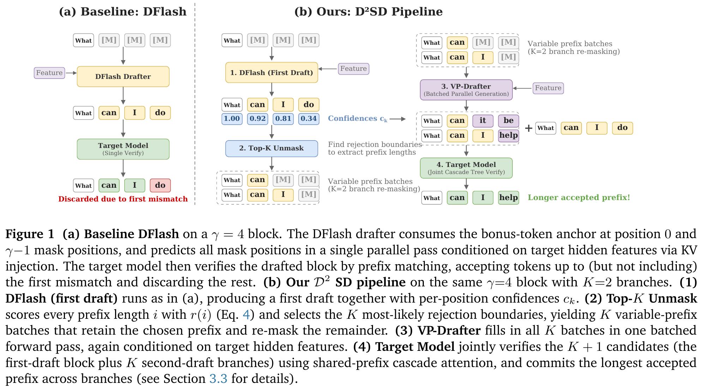
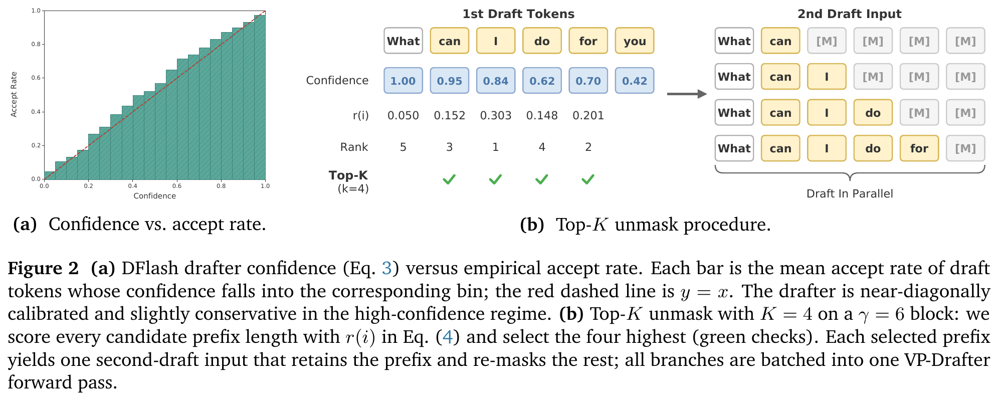
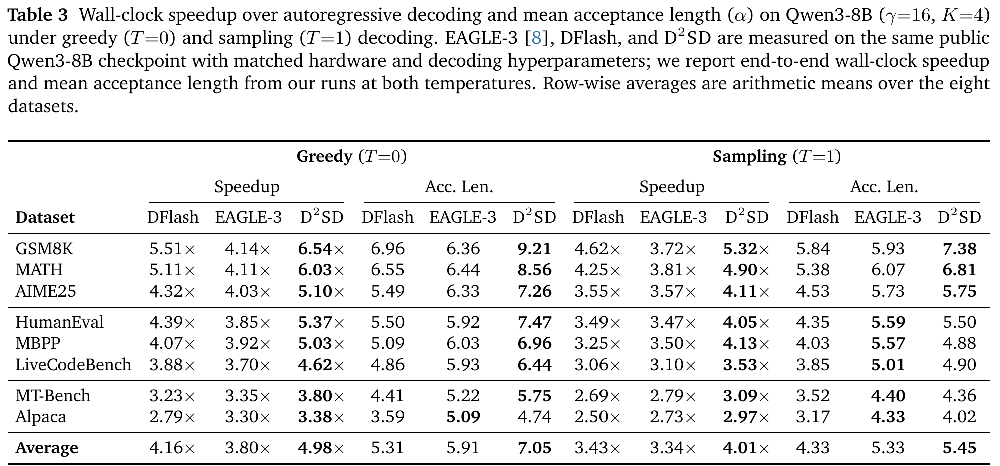
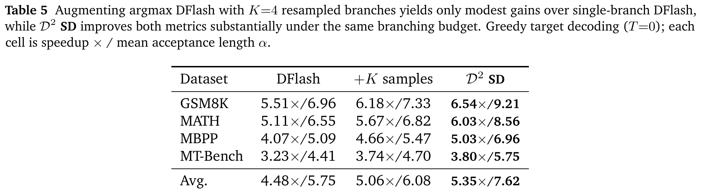

---
tags:
  - paper
  - collection/speculative-decoding
  - domain/model-systems
  - status/deep-review
  - topic/speculative-decoding
  - method/dual-diffusion-drafting
document_type: paper
domain: speculative_decoding
collection: Speculative Decoding
review_status: deep-review
canonical: true
---

# D²SD: Accelerating Speculative Decoding with Dual Diffusion Draft Models 精读分析

> [!info] 文档关系
> - 文档类型：Paper
> - 领域入口：[README](../README.md)
> - 上位汇总：[Evolution](../surveys/evolution.md)
> - 证据资产：`../assets/papers/d2sd/`
> - 相关文档：[Figure inventory](../evidence/figure-inventory.md)

> 资料状态：主证据为官方 arXiv:2606.04446v1 PDF 与 TeX source；已核验官方 D²SD 推理代码、SpecForge 训练代码和 Hugging Face checkpoint metadata。本文嵌入图均为 300 DPI PDF 裁剪，包含完整 caption，并经过 contact-sheet 与逐图原分辨率 QA。OpenReview 未发现匹配论坛且 notes API 返回 HTTP 403；未把公开评审当作可用证据。

## 修订信息

- 当前修订 ID：`rev-d2sd-obsidian-properties-20260731`
- 当前文档版本：`1.0.2`
- 当前修订时间：`2026-07-31T10:00:00+08:00`
- 替代版本：`rev-d2sd-affiliation-backfill-20260730` / `1.0.1`

| 修订 ID | 文档版本 | 时间 | 修订者 | 类型 | 替代修订 | 迁移问题/解析 | 变更摘要 | 原因 | 影响位置 | 依据 | 对结论影响 |
|---|---|---|---|---|---|---|---|---|---|---|---|
| `rev-d2sd-b1-initial` | `1.0.0` | `2026-07-25T15:15:25+08:00` | `delegated-paper-review-agent` | `initial` | 无 | 无 | 从官方 PDF/source、当前代码、checkpoint metadata 与重新裁剪视觉建立完整单篇审阅 | `d2sd-b1` 非 ICML paper-delivery remediation | `analysis.md`、`source_verification.md`、[Figure inventory](../evidence/figure-inventory.md)、过程侧公开评审记录 | `task_packet.yaml`；arXiv v1；D²SD commit `4c4b491…`；4 个 QA 视觉 | material |
| `rev-d2sd-affiliation-backfill-20260730` | `1.0.1` | `2026-07-30T23:30:00+08:00` | `/root` | `metadata-update` | `rev-d2sd-b1-initial` / `1.0.0` | 无 | 补充作者—机构元数据与角色证据边界 | 统一回填 affiliation 交付字段 | `作者与机构` | 论文 PDF 标题页、机构编号与角色脚注 | none：不改变方法、实验与归因结论 |
| `rev-d2sd-obsidian-properties-20260731` | `1.0.2` | `2026-07-31T10:00:00+08:00` | `/root` | `metadata-update` | `rev-d2sd-affiliation-backfill-20260730` / `1.0.1` | 无 | 增加 Obsidian YAML Properties 与层级标签 | 全量 canonical Paper 标签补齐 | 文件头 YAML frontmatter | 已验证的 ICML 2026 标签 schema；仓库覆盖矩阵 | none：不改变论文分析与证据结论 |

## 0. 资料与配图索引

- 论文：`paper.pdf`；官方页面 <https://arxiv.org/abs/2606.04446v1>；arXiv v1，2026-06-03。
- LaTeX/source：`source/arxiv_source.tar`；展开到 `source/extracted/`。
- 提取文本：`extracted_text/paper.txt`、`extracted_text/paper_layout.txt`。
- 官方推理代码：<https://github.com/catnanami/D2-SD>，commit `4c4b4917e56bf004a87eeed1e40af7f9f51af986`，本地 `code/D2-SD/`。
- 训练框架：<https://github.com/sgl-project/SpecForge>，commit `fec8f8586de51e6b6baf007861898e5c4e95df03`，本地 `code/SpecForge/`。
- OpenReview：未发现公开匹配论坛；核验记录 过程侧公开评审记录。
- Checkpoint metadata：`network_verification/hf_*`；D²SD 的 VP-Drafter/DTA 权重未公开。
- 视觉清单与 QA：[Figure inventory](../evidence/figure-inventory.md)；contact sheet `figures/contact-sheet.png`。
- AI 生成分析示意图：未生成。已安装 ICU 图像 CLI 只有 image generation/edit，缺少 paper-deep-review 强制要求的 `responses-doc --input-file analysis.md` 文档输入路径；没有用 prompt-only 图片代替。

| 图表 | 类型 | 用途 | 路径 |
|---|---|---|---|
| Figure 1 | 机制 | DFlash 单链与 D²SD 双 draft / cascade pipeline 对比 | `../assets/papers/d2sd/fig1_pipeline_caption.png` |
| Figure 2 | 机制与间接机制证据 | confidence calibration 与 Top-$K$ unmask | `../assets/papers/d2sd/fig2_confidence_topk_caption.png` |
| Table 3 | 主结果 | Qwen3-8B 的 greedy / sampling speedup 与 acceptance length | `../assets/papers/d2sd/table3_qwen_main_caption.png` |
| Table 5 | 消融结果 | naive resampling、DFlash 与 D²SD 的匹配 branching-budget 对比 | `../assets/papers/d2sd/table5_resampling_ablation_caption.png` |

## 0.1 术语与符号解释

### 0.1.1 术语表

| 术语 | 本文含义 | 别名 | 不等于/易混项 | 证据来源 |
|---|---|---|---|---|
| speculative decoding cycle | drafter 提议一组 token、target 并行验证、提交最长可接受前缀并返回 bonus token 的一次循环 | decoding iteration | 不等于一次普通 target token forward | Paper §2, Eq. (1)–(2) |
| target model | 定义最终输出分布并执行验证的 Qwen3-8B 或 GPT-OSS-20B | verifier、$\mathcal M_t$ | 不等于 teacher-generated training response 本身 | Paper §2, §4.1 |
| DFlash first drafter | 由 target hidden features 条件化、一次并行预测 block 中所有 mask 的第一阶段 diffusion drafter | draft 1、$\mathcal M_{d1}$ | 不等于 VP-Drafter；不执行 target verification | Paper §2; code `model/dflash.py` |
| VP-Drafter | 针对任意可见 prefix length 训练、在选择边界重新生成 suffix 的第二 drafter | Variable-Prefix Drafter、代码/README 中的 DTA | README 把 DTA 展开为 “Dual Token Anchor”，论文只定义 VP-Drafter；审阅不假设二者训练产物完全等价 | Paper §3.4; code README / `generation/d3_generator.py` |
| anchor / bonus token | 上一轮 target 在拒绝边界返回、作为下一 block 位置 0 的已验证 token | re-anchor token | 不等于任意 prefix 的最后一个 draft token；第二阶段的“re-anchor”是 branch construction 语义 | Paper §2, Figure 1 |
| longest-correct-prefix rule | 一条 candidate 在第一次 mismatch 前的 token 才能被连续提交；后缀即使逐点正确也不能越过 mismatch | longest accepted prefix | sampling 下不是简单比较固定 argmax；代码逐位置从 target logits 采样并保留仍匹配的 branch | Paper Introduction; code `generation/d3_generator.py` |
| drafter confidence | 第一 drafter 对其选中 token 的 softmax 概率 $c_k=\max_v p_k(v)$ | per-position confidence | 不等于 target 的接受概率真值；Figure 2 只展示分箱均值校准 | Paper Eq. (3), Figure 2a |
| rejection-boundary score | $r(i)$ 对“前 $i$ 个接受、位置 $i+1$ 拒绝”的近似质量/概率评分 | boundary posterior | 未包含全 block 全接受事件，未条件化归一；Top-$K$ 排序不受该遗漏影响 | Paper Eq. (4) |
| Top-$K$ unmask | 选取 $r(i)$ 最高的 $K$ 个 prefix length，保留 prefix 并重新 mask suffix | confidence-guided branch placement | 不等于选 $K$ 个最低单点 confidence；它使用 prefix survival product | Paper §3.2, Figure 2b; code `d3_generator.py:117-125` |
| shared-prefix candidate set | 原始 DFlash branch 加 $K$ 个在不同 prefix 处分叉的 VP branches | prefix-tree-like candidates | 不是显式逐节点自回归构树；分支后缀由一个 batched diffusion pass 生成 | Paper §3.2–3.3 |
| cascade attention | 将 shared prefix KV attention 与每个 branch local KV attention 分算并通过 log-sum-exp state merge 合并 | shared-prefix joint verification | 不改变 candidate 质量；是 target verification runtime 优化 | Paper §3.3; code `generation/verification.py`, `model/cascade_graph.py` |
| mean acceptance length | 每轮平均提交 token 数，论文包含 rejection boundary 的 bonus token | $\alpha$、TPF（早期小表的近似称谓） | 不等于仅由 drafter 命中的 token 数；论文 TPF/acceptance naming 略有混用 | Paper Eq. (1), Tables 1–7 |
| regenerated target responses | 用目标模型重新生成 PerfectBlend response 后训练 EAGLE-3、DFlash、VP-Drafter | target-generated responses | 不等于直接使用原数据集 response；温度、模板和过滤规则未报告 | Paper §4.1 |

### 0.1.2 符号表

| 符号 | 含义 | 性质 | 作用域/索引 | 单位/取值 | 来源 | 易混点 |
|---|---|---|---|---|---|---|
| $\mathcal M_t$ | target/verifier model | author-defined | 每个部署/实验 target | Qwen3-8B、GPT-OSS-20B | Paper §2 | 与生成训练 responses 的 teacher 角色同模型但阶段不同 |
| $\mathcal M_{d1},\mathcal M_{d2}$ | 第一 DFlash drafter 与第二 VP-Drafter | analysis-derived | 每个 decoding cycle | 两个独立 checkpoint | 本分析据 Paper §3 重记 | 论文只显式写通用 $\mathcal M_d$ |
| $\gamma$ | draft block length，含位置 0 anchor | author-defined | 每个 cycle / experiment | 默认 16；Table 1 为 8/16/24/32 | Paper §2, Tables 1/3/4 | 代码另有 `block_size_2`，README 默认 32，不能静默等同 |
| $K$ | 选择的第二阶段 prefix branch 数 | author-defined | 每个 cycle | 默认 4；Figure 1 示例 2 | Paper §3.2 | 代码固定为最多 4，非 CLI 参数 |
| $p_k(v)$ | 第一 drafter 在位置 $k$ 对 token $v$ 的 categorical probability | author-defined | $k=1,\ldots,\gamma-1$ | $[0,1]$ | Paper §3.1 | diffusion block 中各位置联合依赖未被此边缘量表达 |
| $\hat t_k$ | 第一 drafter 在位置 $k$ 的 greedy token | author-defined | 每位置 | vocabulary token | Paper Eq. (3) | sampling 实验 target 温度不改变第一 draft 代码的 greedy sampling |
| $c_k$ | $p_k(\hat t_k)=\max_vp_k(v)$ | author-defined | 每位置 | $[0,1]$ | Paper Eq. (3) | Figure 2 的校准不能证明跨任务条件校准 |
| $i$ | 假设被接受的第一 draft token 数 / 分叉 prefix length | author-defined | $0,\ldots,\gamma-2$ | token count | Paper Eq. (4)–(5) | branch 实际 visible length 还包含位置 0 anchor |
| $r(i)$ | $\prod_{k=1}^{i}c_k(1-c_{i+1})$ | author-defined | 每个候选边界 | 非负 score | Paper Eq. (4) | 省略全接受事件；“posterior”未显式归一 |
| $\mathcal S$ | $r(i)$ 的 Top-$K$ prefix-length 集合 | author-defined | 每个 cycle | $|\mathcal S|=K$（边界足够时） | Paper Eq. (5) | 代码排序后只影响 batch order，不改变集合 |
| $l$ | VP-Drafter 训练时可见 prefix 的最后索引/长度参数 | author-defined | 每个训练 block | $0,\ldots,\gamma-2$ | Paper Eq. (6)–(7) | 首 $l+1$ 个位置含 anchor/ground-truth |
| $\beta$ | truncated geometric prefix prior 的衰减底数 | author-defined | 训练超参 | $(0,1)$，数值未报告 | Paper Eq. (6) | 未做敏感性分析 |
| $t_k^\star$ | VP-Drafter 训练位置 $k$ 的 ground-truth token | author-defined | masked suffix | token ID | Paper Eq. (7) | ground truth 来自 target-regenerated response，但生成细节缺失 |
| $w_k$ | 距离 re-anchor 的指数衰减 loss weight | author-defined | $k=l+1,\ldots,\gamma-1$ | $\exp(-(k-l-1)/\tau)$ | Paper Eq. (7) | 与 boundary score $r(i)$ 不同 |
| $\tau$ | anchor-weighted loss 的 decay rate | author-defined | 训练超参 | 正数，数值未报告 | Paper Eq. (7) | 代码/公开 checkpoint 未提供可核验 VP 值 |
| $T_{\rm draft}$ | 一轮全部 drafting 时间 | author-defined | 每 cycle | seconds / ms | Paper Eq. (1) | D²SD 中包含 first+batched second draft |
| $T_{\rm verify}$ | target 对 candidate set 的一次验证时间 | author-defined | 每 cycle | seconds / ms | Paper Eq. (1) | branch 增多会增加 local verify work，并非恒定 |
| $\alpha$ | mean committed tokens per cycle，包含 bonus token | author-defined | 数据集平均 | tokens/cycle | Paper Eq. (1), Tables 3–7 | 代码变量 `acceptance_length` 已按提交数计 |
| $L,L_{\rm target}$ | speculative 与普通 autoregressive 的每 token latency | author-defined | steady-state decode | seconds/token | Paper Eq. (1)–(2) | 不含/如何处理 TTFT 要看 benchmark；代码将首轮 draft prefill 排除 |
| $\eta$ | wall-clock speedup $L_{\rm target}/L$ | author-defined | 数据集平均 | ratio $×$ | Paper Eq. (2) | 不能只从 $\alpha$ 推断，受 cycle cost 影响 |
| $T$ | target sampling temperature | author-defined | decoding regime | 0 或 1 | Tables 3–4 | 不等于总时间 $T_{\rm draft}$ |
| $S$ | 并发 request batch size | code-defined | benchmark runtime | 当前只实现 $S=1$ | `benchmark.py:11-13,87-89` | 与 prefix 集合 $\mathcal S$ 不同 |

## 1. 论文基本信息

### 作者与机构

- 第一作者（首位列名）：Liyuan Zhang → Peking University。
- 共同第一作者（仅含论文明确标注者）：论文未显式标注。
- 通讯作者/通讯联系人（仅含论文明确标注者）：论文未显式标注。
- 其他作者涉及的机构（去重列举，不作逐作者映射）：Peking University；Tsinghua University；Hong Kong University of Science and Technology；University of Illinois Urbana-Champaign；Ant Group。
- 对应依据：论文 PDF 标题页、作者机构编号与角色脚注（核验日期：2026-07-30）。

- 标题：D²SD: Accelerating Speculative Decoding with Dual Diffusion Draft Models。
- 作者：Liyuan Zhang 等 9 人；机构包括北京大学、清华大学、HKUST、UIUC、蚂蚁集团。
- 版本/venue：arXiv:2606.04446v1，2026；未发现 venue decision。
- 研究领域：LLM 推理、lossless speculative decoding、diffusion block drafter、tree/cascade verification。
- 核心问题：并行 diffusion drafter 虽降低 drafting latency，却把预算放在一条线性 block 上；第一次 mismatch 使全部后缀失效。自回归 tree drafter 能提升 acceptance length，却随 tree budget 支付串行 drafting tax。
- 研究目标：用第二个并行、variable-prefix drafter 在第一 draft 最可能失败的位置恢复 suffix，在近似固定的第二次 batched draft 和一次共享前缀 target verification 下提高 $\alpha$ 与端到端 speedup。
- 关键约束：依赖第一 drafter confidence 可用；两个 draft checkpoint 与 target 对齐；共享前缀 kernel 足够高效；实验以单请求、H200、BF16、固定 $K=4$ 为主。

## 2. 研究动机与问题—方案闭环

### 2.1 出发点与背景痛点

作者的出发点不是“让 draft 再快一点”，而是 speculative decoding 的两个变量已经失衡。DFlash 把 $\gamma-1$ 个 mask 一次并行预测，显著压低 $T_{\rm draft}$；但 target 仍按最长正确前缀提交。只要靠近 anchor 的位置出错，后面即使单点预测正确也无法越过这条边界，故一条更长的 block 可能只增加无效后缀与 verification work。这个痛点是 `author-stated`，见 Introduction、Table 1 与 §2。

另一条已有路线用 tree candidates 提高覆盖率，但 autoregressive drafter 构树要逐层生成。论文引用 DFlash 的测量称 token budget 从 4 到 16 时 drafting overhead 可由 7 ms 增至 24 ms。该跨论文数字不是本文重跑；它只支撑“串行构树成本随预算上升”的背景，不足以独立证明 D²SD 比所有 tree drafter 更好。

### 2.2 现有方案为何不够

第一种简单方案是增大 DFlash block。Table 1 的 matched schedule 实验显示 Qwen3-8B 上 MATH-500 TPF 从 $\gamma=16$ 的 6.05 到 24 的 6.01、32 的 5.85；GSM8K 为 5.95、6.00、5.93。这直接证明当前设置存在 scaling wall，但只覆盖两个任务，也没有把更长 block 的 drafter latency 与 verify latency拆开。

第二种简单方案是从同一个 DFlash categorical 多采 $K$ 个 branch。Table 5 在同一 $K=4$ budget 下只把四任务平均 $\alpha$ 从 5.75 提到 6.08，而 D²SD 达 7.62。结果直接成立；作者进一步把差异归因为 “error homogeneity / same distribution cannot add information”。这个机制解释只有 `partially-supported`：没有 branch diversity、boundary recall 或 distribution overlap 指标，且 Table 5 同时改变 branch placement 与 second-model inductive bias。

第三种方案是用 autoregressive prefix tree。它可能获得较长 $\alpha$，但 D²SD 认为串行 draft tax 会抵消收益。Table 3 对 EAGLE-3 的端到端结果支持这一方向性判断：sampling 的若干 code/chat 任务上 EAGLE-3 的 $\alpha$ 更长而 D²SD speedup 更高；但论文没有给 per-stage latency 或 matched drafter parameter/training cost，因此不能把差异唯一归给并行 drafting。

### 2.3 论文计划解决的问题与成功标准

- 核心研究问题：能否把 block-diffusion 的单链候选转成有效共享前缀候选集，同时不重新引入自回归 tree construction latency？
- 目标场景：Qwen3-8B / GPT-OSS-20B 单请求 decode，greedy 与 temperature-1 sampling，数学、代码、chat 八任务。
- 必须满足的约束：保持 target 分布；second draft 一次 batched forward；target 一次联合 verify；branch budget 与 naive baseline 匹配。
- 成功标准 1：相对 DFlash 提升 mean acceptance length $\alpha$。
- 成功标准 2：$\alpha$ 的增益覆盖额外 second-draft 与 cascade verify 成本，使 wall-clock speedup 同时提高。
- 成功标准 3：在 matched branch budget 下优于 naive resampling，并通过复用 DFlash、第三层 cascade 等消融解释设计选择。
- 明确未解决：训练成本、动态 $K$、并发 serving、跨硬件、多节点、calibration robustness、公开 VP checkpoint 的完整复现。

### 2.4 核心方案如何解决并优化问题

| 原始问题/失败模式 | 根因或约束 | 对应方案设计 | 改变的变量/系统行为 | 作用机制 | 预期优化及指标 | 证据来源 | 判断 |
|---|---|---|---|---|---|---|---|
| 早期 mismatch 使长后缀作废 | longest-correct-prefix 非均匀地放大靠近 anchor 的错误 | 用 $c_k$ 构造 $r(i)$ 并在高概率拒绝边界 re-anchor | 从固定线性 budget 改成请求级 boundary-aware branch placement | 把额外容量放在最可能阻断 acceptance 的位置 | $\alpha$、speedup | Eq. (3)–(5), Figure 2, Tables 5–6 | partially-supported：校准只测 GSM8K，无 boundary top-$K$ recall |
| 同 drafter naive samples 高度冗余 | branch 共享同一 per-position categorical 与相同 inductive bias | 独立 VP-Drafter 从各 prefix 生成新 suffix | 改变 continuation model 与条件可见 prefix | 引入第一 drafter 不具备的 variable-prefix 条件化 | $\alpha$、speedup | §3.4, Table 6 | supported at bundled design level；prior/loss 未拆开 |
| 自回归 tree draft 随深度串行 | tree construction latency 随 budget 增长 | $K$ 个 VP inputs 堆成一次 batch | second draft 从 $K$ 次/逐层变为一次并行 pass | GPU 利用 branch batch 并行 | 降低 $T_{\rm draft}$ | Figure 1, §3.3, Table 3 | plausible/indirect：无 per-stage matched latency 表 |
| 多 branch 若复制 prefix KV 会放大 verify 成本 | shared prefix 重复 attention/KV | cascade attention：shared 与 local attention 分算并 merge | target shared prefix KV 不按 branch 复制 | 复用 shared-prefix 计算与缓存 | 降低 $T_{\rm verify}$、显存 traffic | §3.3；code `verification.py` | code-supported，缺 isolated kernel ablation/telemetry |
| 继续堆 recovery 层可能提升 $\alpha$ 但拖慢系统 | marginal recovery 递减、draft/verify cost 增长 | 只保留一个 VP recovery level | 限制 candidate/cycle cost | 在 acceptance gain 与 cycle cost 间取端到端最优 | speedup 而非只看 $\alpha$ | Table 7, Eq. (2) | directly supported on four greedy tasks |

### 2.5 完整因果链与证据闭环

完整链条是：自回归 target decode 受串行、带宽约束 → speculative decoding 用便宜 drafter 换取一次 target 多 token verify → DFlash 已把线性 block drafting 并行化，但最长正确前缀让早期错误成为接受长度的 binding constraint → 单纯增加 $\gamma$ 或同分布采样不能有效移动拒绝边界 → 第一 drafter 的 confidence 估计边界，Top-$K$ 把额外 branch budget 投向高概率失败处 → 专门训练的 VP-Drafter 从这些 prefix 一次并行补 suffix → cascade attention 在一次 target pass 中验证 $K+1$ 个共享前缀候选 → 预期提高 $\alpha$，只要增量 cycle cost 小于所节省的 target token steps，就提高 $\eta$。

直接闭环部分：Table 1 验证长 block saturation；Tables 3–4 验证完整 D²SD 相对 DFlash 的 $\alpha$ 与 speedup；Table 5 验证 naive resampling 不足；Table 6 验证 branch placement 与 VP-specific training 的组合优于复用 DFlash；Table 7 验证第三层 $\alpha$ 增而 speedup 降。

间接/混杂部分：Figure 2 只在 GSM8K 以 confidence bin 展示 marginal calibration，没有验证条件概率、跨任务/温度或 top-$K$ boundary recall；Table 6 把 variable-prefix prior、anchor-decayed loss 与独立 checkpoint 打包，不能拆出各项贡献；cascade kernel 没有 runtime-only ablation；EAGLE-3 公平性缺参数量、训练 FLOPs、per-stage latency 与误差条。

剩余边界：当前官方代码与 paper config 不完全一致，VP checkpoint 未发布；GPT-OSS public DFlash config 的 `block_size=8` 与 Table 4 的 $\gamma=16$ 未被解释。因此论文级因果链总体判断为 `partially-supported`：算法方向和端到端现象一致，但关键中间机制与完整复现还未闭合。

## 3. 核心贡献与创新点

1. 把 diffusion block drafter 的 confidence 转为拒绝边界 score，再做 Top-$K$ prefix recovery，而不是平均扩 block 或均匀 resample。证据：§3.1–3.2, Eq. (3)–(5), Figure 2。
2. 引入与 DFlash 架构相同、训练条件不同的 VP-Drafter：truncated geometric prefix prior + anchor-distance decayed cross-entropy。证据：§3.4, Eq. (6)–(7)。
3. 将 $K$ 个 second-draft inputs 合成一次并行 pass，并以 shared/local cascade attention 一次 target verify。证据：§3.3、Figure 1、代码。
4. 同时报告 $\alpha$ 与 wall-clock speedup，并用 naive resampling、DFlash reuse、第三层 cascade 三组 bridge ablation 区分 candidate quality 与 runtime trade-off。证据：Tables 5–7。

## 4. 研究方法

### 4.1 方法总览

每轮输入是 target、DFlash、VP-Drafter 的已验证 cache，上一轮 bonus token，以及最近接受 token 的 target multi-layer hidden features。DFlash 在 position 0 放 anchor、其余位置放 mask，一次预测 $\gamma-1$ 个 token。随后从 token probability 得到 $c_k$ 和 $r(i)$，选择 $K$ 个 prefix length。每个 second-draft branch 保留 anchor 和前 $i$ 个 DFlash token，其余位置重新 mask；所有 branch 一次输入 VP-Drafter。target 联合验证原 branch 与 $K$ 个 alternative branch，提交最长可接受前缀并更新 cache。

阶段必须区分：

- drafting：DFlash/VP-Drafter 生成 token；
- branch construction：Top-$K$ 选择与 variable-prefix input assembly；
- target verification：target logits 与 candidate equality/acceptance；
- serving/runtime：FlashInfer cascade、CUDA graph、distributed sample sharding。

代码中的 `DTA` 仅指第二 draft checkpoint/路径；论文的正式机制名是 VP-Drafter。代码没有实现公开训练 recipe，也不能凭命名证明 DTA checkpoint 的 $\beta,\tau$ 与论文一致。

### 4.2 组件级设计动机与具体问题映射

| 设计项 | why 状态 | 原文证据 | 针对的具体问题 | 因果机制 | 替代方案/权衡 | 验证证据 | 判断 |
|---|---|---|---|---|---|---|---|
| 第一阶段 DFlash 并行 block | author-stated | §2 | autoregressive draft tax | 一次 forward 输出全 block，降低 draft latency | AR drafter 质量更高但串行 | Table 3 vs EAGLE-3（混杂） | partially-supported |
| target hidden feature KV injection | author-stated（继承 DFlash） | §2, Figure 1 | 小 drafter 与 target 分布不对齐 | 多层 target representation 条件化 draft attention | logits distillation/独立 drafter | 无 D²SD 独立消融；代码实现 | plausible |
| $c_k=\max p_k$ confidence | author-stated | §3.1, Eq. (3) | verify 前不知道拒绝位置 | 用 drafter 内生概率近似 conditional acceptance | entropy、margin、learned boundary head | Figure 2a 单任务机制图 | partially-supported |
| $r(i)$ prefix survival × rejection score | author-stated | Eq. (4) | 单点最低 confidence 不表达前缀生存 | 累乘前序 confidence，给早边界更高结构权重 | calibrated hazard model、直接 boundary classifier | 无 direct boundary-recall ablation | plausible |
| Top-$K$ boundary selection | author-stated | §3.2, Eq. (5) | 单个 argmax 丢掉 diffuse posterior 质量 | 覆盖多个高概率 rejection boundary | dynamic $K$、Sequoia-style budget optimization | Table 5/6 间接 | partially-supported |
| variable-prefix masking prior | author-stated | §3.4, Eq. (6) | DFlash 只见 position-0 anchor，无法泛化到任意 prefix | 训练时显式暴露所有 prefix length | uniform prefix、data-driven posterior sampling | Table 6 打包验证 | partially-supported |
| anchor-distance decayed CE | author-stated | §3.4, Eq. (7) | 靠近新 anchor 的错误更破坏 longest prefix | 对近 anchor token 提高 loss 权重 | uniform CE、expected acceptance surrogate | 无单独 loss ablation；$\tau$ 未报告 | unverified as isolated design |
| $K$ branches 单次 batched VP pass | author-stated | §3.3, Figure 1 | $K$ 次 second draft 会线性增加 launch/latency | batch parallelism 提高 GPU 利用 | sequential branch generation | 端到端表 + 代码，无 per-stage ablation | partially-supported |
| shared-prefix cascade target verify | author-stated | §3.3 | prefix KV/attention 按 branch 复制 | shared prefix 与 local suffix attention 分算后 LSE merge | expand KV/tree mask | code direct；无 kernel microbenchmark | code-supported |
| 单 recovery level | author-stated | Ablation 3 | deeper cascade marginal gain 递减 | 避免 extra draft 和约 2× local verification work | 3rd level/dynamic depth | Table 7 direct | supported within tested setting |
| target-regenerated PerfectBlend | author-stated | §4.1 | drafter-target distribution mismatch | 用 target response 对齐训练分布 | 原始 responses、online adaptation | 无数据生成消融/配置 | plausible |

### 4.3 模型/系统架构

Figure 1 展示四段 pipeline；Figure 2 展示 boundary score 到 variable-prefix batch 的具体构造。

一个值得强调的数学边界是：

$$
\sum_{i=0}^{\gamma-2}r(i)
=1-\prod_{k=1}^{\gamma-1}c_k
$$

仅在把 $c_k$ 当作链式 conditional survival 时成立。右侧缺少“全部 $\gamma-1$ 个 draft token 接受”的质量。因此 $r(i)$ 是 in-block rejection events 的未归一质量；若称“conditioned-on-rejection posterior”，还需除以上式。Top-$K$ 排序不受统一归一化影响，但论文的 calibration 图没有验证这些 $c_k$ 在“前序已接受”条件下仍校准。

### 4.4 关键公式与优化目标

论文把端到端目标写为：

$$
L=\frac{T_{\rm draft}+T_{\rm verify}}{\alpha},
\qquad
\eta=\frac{L_{\rm target}}{L}
=\frac{\alpha L_{\rm target}}{T_{\rm draft}+T_{\rm verify}}.
$$

这说明 D²SD 并不直接最小化一个训练 loss 等价于 speedup；它通过 VP loss 提高 candidate quality，再由系统实现控制 cycle cost。算法目标与系统指标存在中间层，必须用 end-to-end wall-clock 验证。

confidence 与 boundary score：

$$
\hat t_k=\arg\max_v p_k(v),\qquad
c_k=p_k(\hat t_k),
$$

$$
r(i)=\left(\prod_{k=1}^{i}c_k\right)(1-c_{i+1}),
\quad i=0,\ldots,\gamma-2,
\qquad
\mathcal S=\operatorname*{Top-K}_i r(i).
$$

VP-Drafter prefix prior 与 loss：

$$
\Pr(l=j)=\frac{\beta^j}{\sum_{u=0}^{\gamma-2}\beta^u},
\quad j=0,\ldots,\gamma-2,
$$

$$
\mathcal L_{\rm VP}
=-\frac{\sum_{k=l+1}^{\gamma-1}
\exp\!\left(-\frac{k-l-1}{\tau}\right)
\log p_k(t_k^\star)}
{\sum_{k=l+1}^{\gamma-1}
\exp\!\left(-\frac{k-l-1}{\tau}\right)}.
$$

论文没有报告 $\beta$、$\tau$、VP 参数量、训练 steps、学习率、训练 GPU 数或 wall time；公开训练代码当前也没有 paper-matched VP JSON。因此公式可审计，recipe 不可完整复现。

### 4.5 训练、实验与部署设计

- targets：Qwen3-8B、GPT-OSS-20B。
- datasets：GSM8K、MATH、AIME25、HumanEval、MBPP、LiveCodeBench、MT-Bench、Alpaca。
- training data：完整 PerfectBlend，responses 由 target 重新生成；prompt/chat template、temperature、top-p、过滤、样本数和泄漏检查未报告。
- baselines：DFlash、EAGLE-3；论文称同 public target checkpoint、hardware、decoding hyperparameters。
- metrics：mean acceptance length $\alpha$、相对普通 target decode 的 wall-clock speedup。
- runtime：NVIDIA H200、BF16、FlashAttention-2、FlashInfer cascade、预热 CUDA graphs；默认 paper config $\gamma=16,K=4$。
- 统计报告：只有算术平均，无样本方差、置信区间、重复次数、逐阶段 latency、峰值显存或能耗。

## 5. 关键结论

### 5.1 主结果

Qwen3-8B 八任务平均：

| regime | DFlash speedup | D²SD speedup | 绝对 / 相对变化 | DFlash $\alpha$ | D²SD $\alpha$ | 绝对 / 相对变化 |
|---|---:|---:|---:|---:|---:|---:|
| greedy $T=0$ | 4.16× | 4.98× | +0.82× / +19.7% | 5.31 | 7.05 | +1.74 / +32.8% |
| sampling $T=1$ | 3.43× | 4.01× | +0.58× / +16.9% | 4.33 | 5.45 | +1.12 / +25.9% |

Table 3 支持 D²SD 在所有八个 Qwen3 task 的 wall-clock speedup 高于 DFlash/EAGLE-3。它也显示 speedup 不等价于最高 $\alpha$：sampling 下 HumanEval、MBPP、LiveCodeBench、MT-Bench、Alpaca 的 EAGLE-3 $\alpha$ 高于 D²SD，但 D²SD speedup 仍更高。这与并行 drafting latency 假说一致，却仍是间接归因，因为没有逐阶段 timing。

GPT-OSS-20B 八任务平均（Paper Table 4）：

| regime | DFlash speedup | D²SD speedup | 绝对 / 相对变化 | DFlash $\alpha$ | D²SD $\alpha$ | 绝对 / 相对变化 |
|---|---:|---:|---:|---:|---:|---:|
| greedy $T=0$ | 3.53× | 6.15× | +2.62× / +74.2% | 4.13 | 8.02 | +3.89 / +94.2% |
| sampling $T=1$ | 1.71× | 1.84× | +0.13× / +7.6% | 1.99 | 2.35 | +0.36 / +18.1% |

GPT sampling 的外推边界明显：LiveCodeBench 上 D²SD 1.62× 低于 DFlash 1.68×；MT-Bench 1.59× 低于 1.60×；Alpaca 两者均 1.58×。因此“average lead”成立，“每任务严格领先”不成立。更严重的复现缺口是公共 `z-lab/gpt-oss-20b-DFlash` config 为 block size 8，而 Table 4 标 $\gamma=16$；论文/代码没有解释如何重配。

### 5.2 技术主张—证据矩阵

| 技术主张 | 声称收益 | 实验/控制 | 指标变化 | 证据强度 | 结论 |
|---|---|---|---|---|---|
| 增大 linear block 有 scaling wall | 更大 $\gamma$ 不能持续提高 TPF | Table 1 matched schedule | MATH 6.05→6.01→5.85；GSM 5.95→6.00→5.93（16→24→32） | direct sensitivity | supported on two tasks |
| confidence 可预测 target accept | 支撑 boundary allocation | Figure 2a | 分箱均值近 $y=x$，无 ECE/error bars | mechanism visualization | partially-supported |
| Top-$K$+VP 比 naive samples 有效 | 更高 branch information | Table 5 same $K=4$ | $\alpha$ 6.08→7.62；speed 5.06→5.35 | replacement baseline；仍同时改 placement/model | partially-supported |
| confidence re-anchor 本身有效 | branch 放置优于 uniform sampling | Table 6 DFlash→DFlash | vs DFlash：$\alpha$+0.78 (+13.6%)，speed +0.21× (+4.7%) | bridge baseline | supported as pipeline bundle |
| VP-specific training 增加收益 | 任意 prefix continuation 更强 | Table 6 full vs reuse | $\alpha$+1.09 (+16.7%)，speed +0.66× (+14.1%) | replacement baseline | supported for checkpoint bundle；prior/loss 未拆 |
| anchor-decayed loss 必要 | 优先修复近 anchor 错误 | 无 remove/replace loss ablation | 无 | none | unverified |
| cascade attention 降 verify cost | 多 branch 共享 prefix KV/compute | code + end-to-end results | 无 runtime-only delta | code-only/indirect | plausible, not isolated |
| 第三层不值得 | marginal acceptance 不覆盖 cost | Table 7 | $\alpha$ 7.62→8.24 (+8.1%)；speed 5.35→5.13 (-4.1%) | direct ablation | supported on four greedy tasks |
| sampling 保持 target 分布 | lossless acceleration | algorithm narrative + code sequential target sampling/matching | 无 distribution-equivalence test | code/theory-level | plausible; empirically unverified |
| D²SD 全面优于 strong AR baseline | 更高 speedup | Tables 3–4 | Qwen/GPT averages lead | end-to-end but fairness metadata incomplete | supported for reported runs, generalization bounded |

### 5.3 消融和机制证据

Table 5 的四任务平均粗分解：

- DFlash → $+K$ samples：speedup +0.58×（+12.9%），$\alpha$ +0.33（+5.7%）。
- DFlash → full D²SD：speedup +0.87×（+19.4%），$\alpha$ +1.87（+32.5%）。
- $+K$ samples → D²SD：speedup +0.29×（+5.7%），$\alpha$ +1.54（+25.3%）。

这证明 naive resampling 不足，但不能把最后一项全部叫作“VP training gain”，因为 full D²SD 同时改变 boundary placement 和 second model。

Table 6 提供第二条 bridge：DFlash → DFlash→DFlash → D²SD。第一步固定 full cascade pipeline、复用原 drafter，估计 branch placement/cascade bundle；第二步换成 VP checkpoint，估计 variable-prefix training bundle。它比 Table 5 更接近因果隔离，但仍没有单独控制 $\beta$、decayed loss 或 checkpoint training compute。

Table 7 的 cycle-cost 反推是 `analysis-derived`：

$$
\frac{T_{\rm cycle}^{(3)}}{T_{\rm cycle}^{(2)}}
=
\frac{\alpha_3/\eta_3}{\alpha_2/\eta_2}
=
\frac{8.24/5.13}{7.62/5.35}
\approx1.127.
$$

即第三层使平均 cycle cost 约增 12.7%，而 $\alpha$ 只增 8.1%，故 speedup 下降。这个反推依赖相同 $L_{\rm target}$，与论文“约 13%”一致。

### 5.4 收益来源归因

| 组件/变化 | 对比基线 | 指标变化 | 影响路径 | 证据强度 |
|---|---|---|---|---|
| naive branch budget | DFlash → $+K$ samples | +0.58× speed；+0.33 $\alpha$ | 主要增加 candidate coverage，也增加 verify work | matched Table 5 |
| confidence placement + cascade bundle | DFlash → DFlash→DFlash | +0.21×；+0.78 $\alpha$ | 改善分叉位置；额外 second forward 抵消部分收益 | rough bridge Table 6 |
| VP checkpoint/training bundle | DFlash→DFlash → D²SD | +0.66×；+1.09 $\alpha$ | variable-prefix continuation quality | replacement bridge Table 6 |
| third recovery level | D²SD → 3rd draft | -0.22×；+0.62 $\alpha$ | candidate quality增，draft/verify latency增更多 | direct Table 7 |
| FlashInfer/CUDA graph | 无 runtime-only baseline | 未报告 | 只影响 latency/traffic，不应解释 $\alpha$ | code-only |

这些是基于桥接 baseline 的近似归因，不是论文正式方差分解。尤其不能把 kernel credit 归到 acceptance length，也不能把 Table 6 全差值拆成某一个 loss 项。

### 5.5 是否验证了假设

- “linear block scaling wall”：验证，范围有限。
- “confidence 是可靠 boundary signal”：只验证 marginal calibration，未验证核心 conditional/boundary ranking 假设。
- “distinct VP inductive bias 优于同 drafter reuse”：以 checkpoint replacement 验证，具体 recipe 未拆。
- “shared-prefix runtime 保住端到端收益”：由端到端表和代码间接支持，无 isolate。
- “两层优于更深 cascade”：在四任务 greedy 下直接验证。
- “跨模型与 sampling 泛化”：平均方向验证；GPT sampling 单项失败与 checkpoint config mismatch 收窄结论。

## 6. Related Work 对比

| 类别/代表工作 | 方法核心 | 优点 | 局限 | 与 D²SD 的关系/公平性 |
|---|---|---|---|---|
| Leviathan/Chen speculative decoding | 小 drafter + target rejection sampling | 分布保持、框架通用 | 单链最长前缀 | D²SD 保留 target-defined output，扩大 candidate set |
| SpecInfer / Sequoia | 显式 draft tree + shared-prefix verification / topology optimization | 在固定 verify budget 下提高覆盖 | 构树可能依赖串行 draft，系统复杂 | D²SD 借 verification，branch placement 用 confidence；未直接重跑这些 baseline |
| EAGLE-2/3 | target hidden-state 条件化 autoregressive drafter，动态 tree | draft quality 高、$\alpha$ 可长 | serial drafting tax | Tables 3–4 比较；缺参数/训练预算/per-stage latency，公平性部分可核验 |
| Medusa | target 上多预测头产生 tree candidates | 无独立 draft model | 要改 target/训练 heads | D²SD 不改 target weights，但需要两个独立 drafter |
| DiffuSpec | 大预训练 dLLM drafter | 并行、可长 block | drafter memory/latency 大 | D²SD 用轻量 target-conditioned drafts |
| PARD | 小 AR 模型模拟并行/扩散 draft | 低成本 | capacity 限制 acceptance | D²SD 通过第二模型恢复 boundary |
| DFlash | target hidden KV injection + block diffusion | 第一 draft 极低延迟 | 单链、block scaling wall | D²SD 直接继承为 stage 1 |
| concurrent block-diffusion tree work | uniform resampling 构 draft tree | 并行多分支 | 可能在本来正确处浪费 verify budget | 论文仅文字比较；无 matched experiment，差异判断未充分验证 |

论文 Related Work 对机制分类清楚，但对 concurrent work 的“uniform resampling wastes budget”缺直接同设置重跑。Table 5 只测试自己的 DFlash naive samples，不等价于完整 concurrent system。

## 7. OpenReview 公开评审 × 论文内容交叉核验

- OpenReview 链接：未发现。
- 访问日期：2026-07-25。
- decision/meta-review：不可用。
- author response/rebuttal：不可用。

精确标题网页检索无匹配；OpenReview API v1/v2 都返回 HTTP 403。故没有 public reviewer claim 可与 paper/rebuttal/code 逐条交叉。venue 只能记为 arXiv preprint v1。这个 skip 不影响对 paper/source/code 的审阅，但无法借 public review 确认 baseline fairness、novelty dispute、rebuttal 修订或接受状态。

## 8. Infra 需求分析

### 8.1 算力与延迟

D²SD 每轮近似：

$$
T_{\rm cycle}
=T_{d1}(\gamma)
+T_{\rm boundary}
+T_{d2}(K,\gamma)
+T_{\rm verify}^{\rm cascade}(K+1,\gamma)
+T_{\rm accept}.
$$

$T_{\rm boundary}$ 只有 softmax gather、cumprod、Top-$K$ 和 tensor assembly，理论上较小；真正新增的是第二 drafter forward 与 branch-local target attention/MLP。target MLP 对每个 branch token 仍需执行，cascade 主要复用 attention 的 shared prefix，不会把整个 target forward 降为单 branch 成本。

代码用 `torch.cuda.synchronize()` 包围 timing，基线生成相同 output-token 数，steady-state decode 排除 first DTA prefill。优点是减少异步计时误差；局限是没有阶段 breakdown 实际实现，README 虽声称打印 draft1/draft2/verify/other，`benchmark.py` 当前只打印总 token time、speedup、acceptance length/histogram。

### 8.2 参数、显存与 KV cache

依据已检查的第一 drafter config 和 `DFlashDraftModel`，忽略 bias/norm、小量 buffer，且假设 VP 与 DFlash 架构相同：

$$
P_{\rm draft}\approx
N_\ell\left[
h(n_qd)+2h(n_{kv}d)+(n_qd)h+3hI
\right]+n_{\rm ctx}h^2.
$$

- Qwen3 DFlash：$h=4096,I=12288,N_\ell=5,n_q=32,n_{kv}=8,d=128,n_{\rm ctx}=5$，约 $1.049$B core parameters，BF16 约 1.95 GiB；两个 drafts 约 3.91 GiB，未含 target、KV cache、activation。第二 checkpoint 未公开，所以这是结构推算。
- GPT-OSS DFlash：$h=2880,I=7680,N_\ell=8,n_q=64,n_{kv}=8,d=64,n_{\rm ctx}=5$，约 0.785B，BF16 约 1.46 GiB；两个 drafts 约 2.92 GiB，仍是假设。

target KV cache 粗式：

$$
\mathrm{KVBytes}
=2\,N_\ell\,N_{kv}\,d\,L_{\rm context}\,b_{\rm dtype}.
$$

若朴素按 $B=K+1$ branch 复制 shared prefix，额外 KV/attention read 可近似乘 $B$。代码保持 `past_key_values` 为 batch 1，并将 shared attention 与各 branch local KV 分开，避免 shared KV cache 的显式 branch expansion；但 local candidate K/V 与所有 branch 的 MLP activation 仍随 $B\gamma$ 增长。

### 8.3 Data Types / 数值格式

| 对象 | 格式 | 阶段 | 硬件依赖 | 影响 | 证据 |
|---|---|---|---|---|---|
| target/draft weights、activation | BF16 | inference | H200 tensor cores / PyTorch | 相对 FP32 减半存储与 bandwidth | Paper §4.1; `benchmark.py:113-130` |
| attention LSE | FP32 | cascade merge | FlashInfer | 提高 softmax state merge 稳定性 | `cascade_graph.py:48-49` |
| token IDs / position IDs | int64 | branch construction | GPU tensors | 体积小但动态 gather/topk | code `d3_generator.py` |
| confidence/probabilities | model logits softmax dtype；未显式 upcast | boundary selection | GPU | 乘积可能在长 block 下下溢；默认 $\gamma=16$ 风险较低 | `model/utils.py:26-34`, `d3_generator.py:117-124` |
| quantized weights | 未使用/未报告 | inference | 不适用 | 论文收益不能外推到 FP8/INT8/INT4 | source/code absence |

### 8.4 带宽、互联与高效利用

共享前缀 attention 的数据移动可抽象为：

$$
\mathrm{BytesMoved}
\approx \mathrm{Bytes}(KV_{\rm shared})
+B\cdot\mathrm{Bytes}(KV_{\rm local})
+\mathrm{Bytes}(Q,O,\mathrm{LSE}),
$$

而朴素扩展是 $B\cdot \mathrm{Bytes}(KV_{\rm shared}+KV_{\rm local})$。代码用 FlashInfer `single_prefill_with_kv_cache` 分别计算 shared/local，再 `merge_state_in_place`，并把 fixed-shape local+merge 捕获进 CUDA graph；shared attention 因 KV length 可变仍走普通 kernel。

$$
\mathrm{EffectiveBandwidth}
=\frac{\mathrm{BytesMoved}}{\mathrm{Runtime}},
\qquad
\mathrm{Utilization}
=\frac{\mathrm{EffectiveBandwidth}}{\mathrm{H200PeakBandwidth}}.
$$

论文和代码没有 bytes counters、Nsight trace、kernel duration、HBM peak、L2 hit rate 或 FLOP utilization，故无法给实际 utilization。单机实验没有 PCIe/NVLink/RDMA、tensor parallel、all-reduce/all-to-all 数据；多 GPU benchmark 只是按 rank 切分样本，最后 gather Python objects，不是 model-parallel serving。

### 8.5 CPU/GPU/NPU 异构执行

| 阶段 | CPU | GPU | 数据移动/同步 | 潜在瓶颈 | 证据 |
|---|---|---|---|---|---|
| dataset/tokenization | Hugging Face dataset map、chat template、调度 | token tensors 上传 | CPU→GPU input IDs | dataset/network 预处理；未计入 decode | `benchmark.py`, `model/utils.py` |
| target/draft inference | Python orchestration | BF16 target + two drafts | GPU resident caches | HBM/MLP/attention | code |
| boundary construction | Python `.tolist()` + sort 参与控制流 | softmax gather/cumprod/topk | GPU→CPU `topk_idx.tolist()` 每轮隐含同步 | host synchronization，论文未讨论 | `d3_generator.py:124-125` |
| timing | Python perf counter | CUDA kernels | 每段 `cuda.synchronize()` | 同步开销可影响短 cycle | generator files |
| multi-GPU | rank launch/gather | 每 rank 独立模型与样本 | NCCL/process gather | 内存复制、无跨卡模型协同 | `distributed.py`, `benchmark.py` |
| NPU | 无实现 | 无 | 无 | 无法外推 | source/code absence |

代码每轮把 `topk_idx.tolist()` 送回 host 再构造 Python list，这在 latency-sensitive path 可能造成 device-host synchronization；论文的高层描述没有这项 overhead，且未提供 profiler。

### 8.6 调度、Serving 与自定义算子

- `CascadeGraphRunner` 为 branch batch size 2–5 预捕获 local attention+merge graph；固定 block shape 有利于 replay。
- shared KV length 随 context 变化，仍使用普通 FlashInfer kernel。
- Qwen3 与 GPT-OSS target 手写 layer-by-layer verify；GPT-OSS 特别处理 attention sink 与 MoE MLP tuple。
- `--batch-size` 目前只支持 $S=1$，大于 1 时顺序运行。因此论文结果是 latency/单流结论，不是 production throughput、continuous batching 或 SLA 证据。
- 没有 paged KV、request scheduler、preemption、prefix-cache eviction、dynamic $K$ capacity control 或 NPU fallback。

## 9. 开源代码对照

- D²SD repository commit：`4c4b4917e56bf004a87eeed1e40af7f9f51af986`。
- SpecForge commit：`fec8f8586de51e6b6baf007861898e5c4e95df03`。
- 静态语法检查：`python3 -m compileall -q code/D2-SD` 通过。
- 功能/性能测试：未运行；缺 VP checkpoint、H200/FlashInfer 环境与 paper logs。

| 论文机制 | 本地证据 | 固定 commit 链接 | 一致性判断 |
|---|---|---|---|
| $c_k,r(i)$, Top-$K$ | `code/D2-SD/generation/d3_generator.py:114-125` | <https://github.com/catnanami/D2-SD/blob/4c4b4917e56bf004a87eeed1e40af7f9f51af986/generation/d3_generator.py> | 公式一致；$K$ 固定 4 |
| variable-prefix branch assembly | `d3_generator.py:127-179` | 同上 | common block-size path与论文一致；README 默认 block2=32 增加 extension branch |
| longest-prefix target acceptance | `d3_generator.py:204-224` | 同上 | greedy/sampling target token 逐步决定，分布保持逻辑 plausible |
| target shared/local cascade | `generation/verification.py:49-201` | <https://github.com/catnanami/D2-SD/blob/4c4b4917e56bf004a87eeed1e40af7f9f51af986/generation/verification.py> | 实现 Qwen3/GPT-OSS；无数值等价测试 |
| CUDA graph local+merge | `model/cascade_graph.py` | <https://github.com/catnanami/D2-SD/blob/4c4b4917e56bf004a87eeed1e40af7f9f51af986/model/cascade_graph.py> | 实现固定 shape graph；shared kernel未 capture |
| DFlash/VP 架构 | `model/dflash.py` | <https://github.com/catnanami/D2-SD/blob/4c4b4917e56bf004a87eeed1e40af7f9f51af986/model/dflash.py> | 同一 class 加 `second_draft` runtime path；权重/训练差异不在 repo |
| eight-task reproduction | `examples/run_benchmark_dd.sh` | <https://github.com/catnanami/D2-SD/blob/4c4b4917e56bf004a87eeed1e40af7f9f51af986/examples/run_benchmark_dd.sh> | 不完整：D²SD script 默认只列 GSM8K |
| VP training | current SpecForge docs/code | <https://github.com/sgl-project/SpecForge/tree/fec8f8586de51e6b6baf007861898e5c4e95df03> | 文档称 DTA 用 DFlash trainer + `training_mode: vp_drafter` JSON，但当前 tree 无该 JSON/旧脚本 |

### 9.1 开源权重/配置对照

| checkpoint | 状态 / revision | 参数结构 | 关键字段 | 与 paper 的关系 |
|---|---|---|---|---|
| `Qwen/Qwen3-8B` target | open；paper 只称 public checkpoint | target config 未在本次重复下载 | target 8B | baseline 与 methods 共用 |
| `z-lab/Qwen3-8B-DFlash-b16` | open/ungated；`9b41424b7109f9c5413454f481b09a82b85333f4` | 5 layers, hidden 4096, intermediate 12288, Q/KV heads 32/8 | BF16, block 16, target layers `[1,9,17,25,33]` | 与 Qwen paper $\gamma=16$ 相符；是否 exact run revision 未写 |
| `z-lab/gpt-oss-20b-DFlash` | open/ungated；`d53f6551543204c859e8bbaaddbd15d11b447af9` | 8 layers, hidden 2880, intermediate 7680, Q/KV heads 64/8 | BF16, block 8, target layers `[1,6,11,16,21]` | Table 4 明确引用，但 paper 标 $\gamma=16$，未解释 mismatch |
| Qwen3/GPT VP-Drafter / DTA | 未发布 | 未验证 | README 要求本地 `--dta-name-or-path` | 无法核验容量、$\beta,\tau$、训练 steps 与 exact paper weights |

官方 README 明说 DTA/VP weights 将随 future camera-ready 发布。因此当前代码是“算法/推理路径公开”，不是“paper result 一键复现”。HF exact search 无 D²SD author checkpoint 不能提升为“checkpoint 不存在”的绝对断言；它只证明访问日未找到公开条目。

## 10. 优点与局限

### 优点

- 论文把 diffusion drafting 的根问题定位在 budget placement，而非盲目追求更长 block。
- 方法结构与 longest-prefix loss asymmetry 一致：在可能拒绝处重新分配生成容量。
- 同时优化/报告 candidate quality 与端到端 latency，第三层消融明确展示 $\alpha$ 与 speedup 可反向变化。
- Table 5/6 的 bridge baselines 比只比较 full model 更接近组件归因。
- 当前代码已覆盖 Qwen3/GPT-OSS cascade verification、BF16、CUDA graph 和 benchmark 基本路径，较 canonical 旧记录完整。

### 局限

- calibration 证据只有 GSM8K 分箱图，无 ECE、样本数、误差条、conditional calibration、跨温度/任务。
- $r(i)$ 的链式解释与全接受 mass 边界未充分讨论；无 top-$K$ boundary recall 或 dynamic-$K$ sensitivity。
- $\beta,\tau$、训练 steps、训练算力、VP 参数/权重未报告；decayed loss 无独立消融。
- EAGLE-3 公平性缺 drafter 参数量、训练 FLOPs、per-stage latency 与版本。
- 无显存、吞吐-并发曲线、kernel profiler、HBM utilization、长上下文或多节点结果。
- 当前代码/README 与 paper 不完全一致：DTA/VP 命名混用、$K$ hard-code、block2 默认 32、D²SD script 只默认 GSM8K、README stage breakdown 未在 driver 实现。
- GPT public DFlash `block_size=8` 与 paper Table 4 $\gamma=16$ unresolved。
- 只有 arXiv v1；无 public review/rebuttal；结果无 variance/CI。

### 可改进之处

- 用校准后的 hazard model或直接 boundary classifier，报告 top-$K$ recall/NLL/ECE。
- 以 posterior entropy、GPU load 和 verify budget 动态选择 $K$，并与 Sequoia-style expected value optimization 比较。
- 做 2×2 消融：boundary placement（uniform/confidence）× second model（DFlash/VP），再拆 prefix prior 与 loss weighting。
- 发布 exact checkpoint revisions、training JSON、data regeneration recipe、logs、per-stage timers 与 Nsight traces。
- 将 Top-$K$ 与 branch assembly 保持 GPU-resident，避免每轮 `.tolist()` host sync。
- 在 continuous batching/long context 下测 latency-throughput Pareto、峰值显存和 HBM utilization。

## 11. 研究启发

- speculative decoding 的核心资源分配单位可以从“token budget”改成“拒绝 hazard budget”。
- confidence 若校准，可同时成为算法信号与 runtime budget signal；但必须验证条件校准，而非只看 marginal reliability diagram。
- 第二 drafter 的价值更像 boundary repair expert，而不是第二份同分布 sample；可探索 mixture-of-experts 或按 failure type 路由。
- shared-prefix verification 仍只复用 attention 的一部分；candidate tree 优化应同时考虑 MLP token work，而非只最小化 KV 复制。
- 端到端选择 recovery depth 应优化 $\Delta\alpha/\Delta T_{\rm cycle}$，而不是最大化 $\alpha$。

## 12. 解读问题/待验证清单

1. Figure 2 的 $c_k$ 在“前 $k-1$ token 已接受”条件下是否校准？
2. $r(i)$ Top-$K$ 对真实 rejection boundary 的 recall@K、NLL 与任务/温度 sensitivity 是多少？
3. $\beta,\tau$ 的 exact 值、选择依据与消融是什么？
4. VP-Drafter exact checkpoint 的层数、参数量、训练 steps、GPU-hours、数据生成配置是什么？
5. GPT DFlash config block 8 如何用于论文 $\gamma=16$？
6. D²SD vs EAGLE-3 是否同 draft 参数、训练 token、target-generated responses 和 CUDA graph policy？
7. current code 的 `block_size_2=32` extension branch 与 paper $K+1,\gamma=16$ candidate set 如何对应？
8. `topk_idx.tolist()` 的 host sync 在短输出/高并发下占多少 latency？
9. cascade attention 只复用 shared attention 后，branch-local MLP/attention 各占多少 cycle time？
10. 多请求 continuous batching、长上下文、paged KV 下 speedup 是否保持？
11. sampling 的单任务退化来自 calibration 变差、VP quality、verify cost，还是 target entropy？
12. lossless sampling 是否通过 distribution equivalence test、固定随机数对照与长序列统计验证？
13. current SpecForge 如何构造 `training_mode: vp_drafter` JSON，旧链接为何已失效？
14. camera-ready/公开 review 是否会补齐 checkpoint、代码配置与 baseline fairness？

## 13. 一句话总结

D²SD 把 DFlash 的单链并行草稿改造成 confidence-guided shared-prefix recovery：第二个 variable-prefix drafter在高概率拒绝边界批量修复 suffix，报告结果显示它能同时提高 acceptance length 与多数场景的 wall-clock speedup；但 confidence 因果中间层、VP training recipe、cascade runtime attribution和 exact checkpoint/config 仍未形成完整公开复现闭环。
