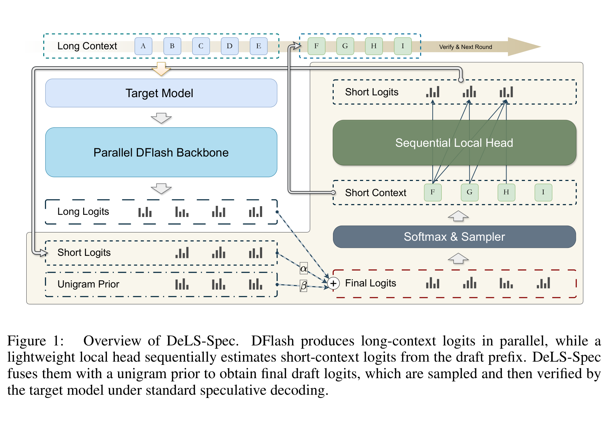
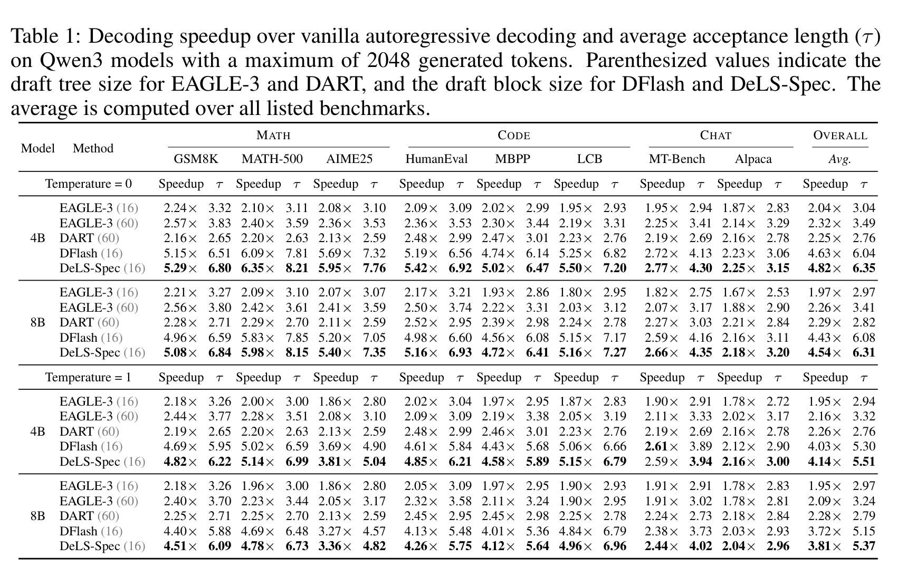
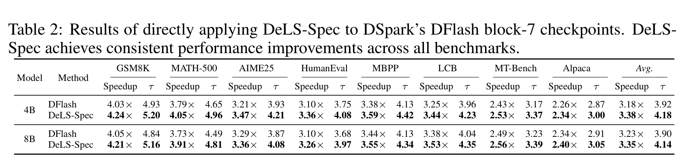
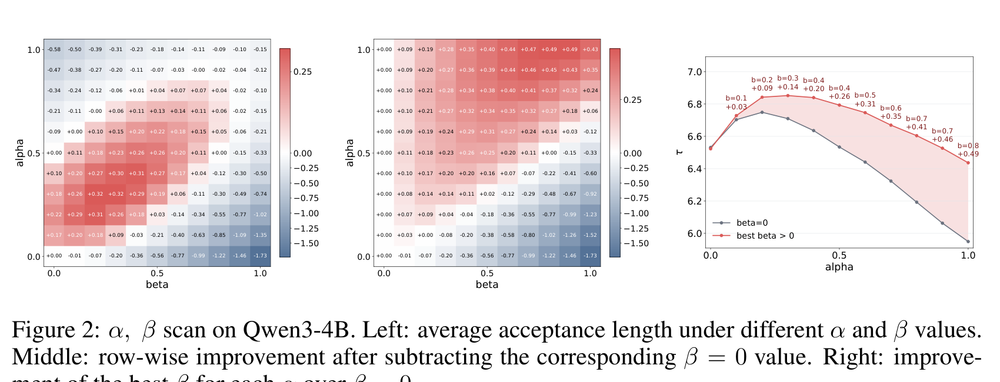
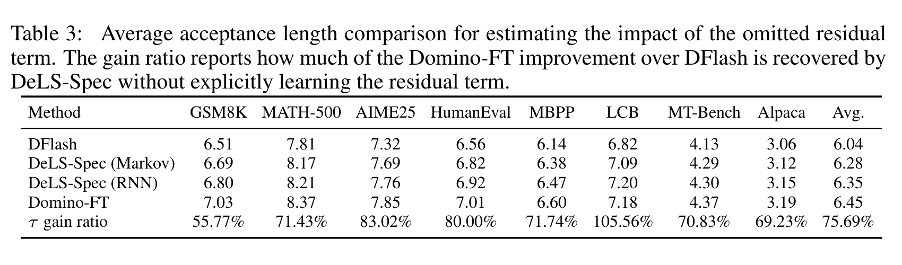
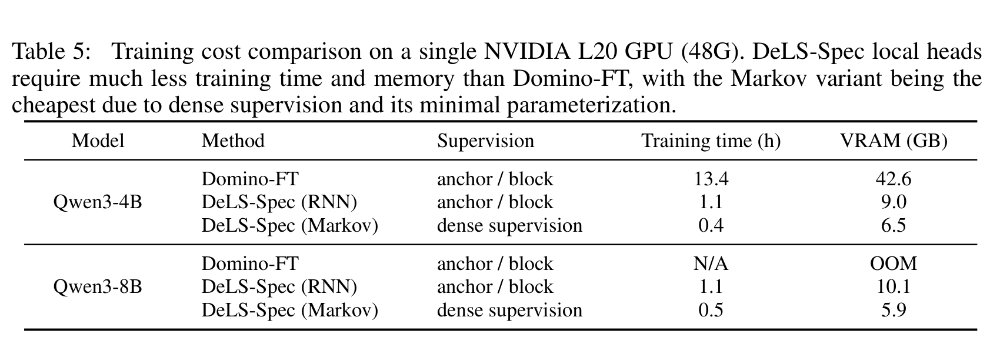

# DeLS-Spec：解耦长短上下文的并行推测草拟——隔离精读

> [!info] 文档关系
> - 文档类型：Paper
> - 领域入口：[README](../README.md)
> - 上位汇总：[Evolution](../surveys/evolution.md)
> - 证据资产：`../assets/papers/dels-spec/`
> - 相关文档：[DSpark](dspark.md)、[Figure inventory](../evidence/figure-inventory.md)

> 资料状态：已取得官方 [arXiv:2607.07409v1](https://arxiv.org/abs/2607.07409v1) PDF、LaTeX source 和官方 [DeLS-Spec 代码](https://github.com/dt-3t/DeLS-Spec)，代码固定在 commit `ab9be1b4d4d470064cd98dd25f7cd1c124b86ad0`。论文使用 ICLR 2026 模板但启用的是 `iclrpreprintcopy`，本文据此只称其为 arXiv preprint，不推断录用状态。图表均由官方 PDF 以 300 DPI 紧裁剪，保留完整 caption，并逐图完成原分辨率 QA。审计日期：2026-07-28。

## 修订信息

- 当前文档版本：`1.0.0`
- 当前修订 ID：`rev-dels-spec-20260728-initial`
- 当前修订时间：`2026-07-28T18:30:00+08:00`
- 替代版本：none

| 修订 ID | 文档版本 | 时间 | 修订者 | 类型 | 替代修订 | 迁移问题/解析 | 变更摘要 | 原因 | 影响位置 | 依据 | 对结论影响 |
|---|---|---|---|---|---|---|---|---|---|---|---|
| `rev-dels-spec-20260728-initial` | 1.0.0 | 2026-07-28T18:30:00+08:00 | Codex | initial | none | none | 从官方论文、源码、代码和逐图 QA 建立 DeLS-Spec canonical Paper | 用户要求把独立算法方案作为正式交付件分析 | 本文全部章节及正式证据资产 | arXiv v1、官方 source、官方代码 commit、结构与语义验证 | material：建立 DSpark 发布后算法演进的独立证据入口 |

## 0. 资料与配图索引

- 论文：[arXiv 摘要页](https://arxiv.org/abs/2607.07409v1)。
- 官方代码：[dt-3t/DeLS-Spec](https://github.com/dt-3t/DeLS-Spec/tree/ab9be1b4d4d470064cd98dd25f7cd1c124b86ad0)，固定 commit `ab9be1b4d4d470064cd98dd25f7cd1c124b86ad0`。
- 公开权重：README 指向 Hugging Face `dt3t/DeLS-Spec-Weights`；本次未下载大权重，metadata 与张量内容未独立核验。
- OpenReview：截至审计日未发现与标题精确匹配的公开 forum、评审、decision 或 rebuttal。
- Figure 1：[`fig1-overview-caption.png`](../assets/papers/dels-spec/fig1-overview-caption.png)，机制图。
- Table 1：[`table1-main-results-caption.png`](../assets/papers/dels-spec/table1-main-results-caption.png)，主结果。
- Table 2：[`table2-dspark-dflash-transfer-caption.png`](../assets/papers/dels-spec/table2-dspark-dflash-transfer-caption.png)，直接复用 DSpark 发布的 DFlash block-7 checkpoints。
- Figure 2：[`fig2-alpha-beta-scan-caption.png`](../assets/papers/dels-spec/fig2-alpha-beta-scan-caption.png)，融合权重扫描。
- Table 3：[`table3-residual-tradeoff-caption.png`](../assets/papers/dels-spec/table3-residual-tradeoff-caption.png)，残差交互收益与成本边界。
- Table 5：[`table5-training-cost-caption.png`](../assets/papers/dels-spec/table5-training-cost-caption.png)，训练成本。
- AI 生成分析图：未生成。论文 Figure 1 已能清楚表达输入、阶段、状态和输出，不需要以生成图替代原始证据。

## 0.1 术语与符号解释

### 0.1.1 术语表

| 术语 | 本文含义 | 别名 | 不等于/易混项 | 证据来源 |
|---|---|---|---|---|
| long-context expert | 冻结的 DFlash drafter；一次并行 forward 给整块位置提供基于全局 prefix 的 logits | DFlash expert | 不是 target verifier，也没有看到块内已经采样的实际 prefix | §3、Figure 1 |
| short-context expert | 只依据当前块内已出现 token 的轻量 local head | local head | 不读取 DFlash hidden state；训练时不要求加载 target 或 DFlash | §3.3–3.4、代码 `code/dels.py` |
| product of experts | 把长上下文和短上下文条件分布相乘，再除去重复计入的 unigram prior | PoE | 论文实际推理是带权 logit 近似，不是严格概率恒等式 | Eq. 3–9 |
| unigram prior | 由训练语料 token count 形成的全词表先验 | frequency baseline | 不是 target 的下一 token 分布 | §3.3、`load_unigram_log_prior` |
| residual interaction | 长上下文与局部 prefix 在给定候选 token 后仍存在的依赖项 | residual term | DeLS-Spec 为解耦训练而主动省略；Domino-FT 近似学习它 | Eq. 7、Table 3 |
| Markov local head | 只依赖上一个 token 的低秩局部模型 | one-step correction | 不保留更早 block prefix 状态 | Appendix A、`markov_dels.py` |
| RNN local head | 共享 target embedding、单层无 bias GRU、低秩投影和词表头 | sequential local head | 不等于 DSpark 的完整 backbone + sequential head 联训 | Appendix A、`DeLSLocalHead` |
| accepted length $\tau$ | 每轮平均接受长度 | acceptance length | 不是单 token 接受率；论文主表同时报告 speedup | Table 1–3 |
| Domino-FT | 冻结 DFlash backbone、只训练 Domino residual head 的桥接 baseline | residual-learning baseline | 不是完整 Domino 从头训练设置 | §5.5 |

### 0.1.2 符号表

| 符号 | 含义 | 性质 | 作用域 | 取值/单位 | 来源 | 易混点 |
|---|---|---|---|---|---|---|
| $x_i$ | 当前候选 draft token | author-defined | token | vocabulary item | §3 | $i$ 是块内位置 |
| $y$ | 当前块之前的长上下文 | author-defined | sequence | token prefix | Eq. 3–8 | 不包含当前块内 prefix |
| $z_i$ | $x_i$ 之前的块内短上下文 | author-defined | token/block | local prefix | Eq. 3–8 | 推理时由已草拟 token 构成 |
| $p_L(x_i\mid y)$ | DFlash 长上下文专家分布 | author-defined | token/vocab | probability | Eq. 8 | 位置间仍为 parallel prediction |
| $p_S(x_i\mid z_i)$ | local head 短上下文分布 | author-defined | token/vocab | probability | Eq. 8 | 可为 Markov 或 RNN |
| $p_P(x_i)$ | unigram prior | author-defined | vocab | probability | Eq. 8 | 下标 P 指 prior |
| $R(x_i;y,z_i)$ | 被省略的长短上下文残差交互 | author-defined | token/vocab | likelihood ratio | Eq. 7 | 不等于 RNN state |
| $\ell_L,\ell_S,\ell_P$ | 三个分布对应的 logits/log probability | author-defined/code-defined | token/vocab | logit | Eq. 9、kernel | 代码直接做加减 |
| $\alpha,\beta$ | local head 与 unigram correction 的校准系数 | author/code-defined | global 或 position-wise | 默认 0.3 | §4.1、Figure 2、README | 理论分解对应 1，实验默认不是 1 |
| $s_i$ | RNN local head hidden state | author-defined | token | vector | Appendix A | 不等于 speedup |
| $r$ | local head 低秩维度 | author/code-defined | model | 256 | Appendix A | 不等于 residual term $R$ |
| $\tau$ | 平均 accepted length | author-defined | benchmark | tokens/round | Tables 1–4 | 与 wall-clock speedup 不同 |

## 1. 论文基本信息

- 标题：*DeLS-Spec: Decoupled Long-Short Contexts for Parallel Speculative Drafting*。
- 作者：Hong-Kai Zheng、Piji Li。
- 类型：arXiv v1 preprint，提交于 2026-07-08；未确认正式 venue。
- 研究领域：lossless speculative decoding、block-parallel drafter、轻量因果修正。
- 核心问题：已有 DFlash checkpoint 缺少块内因果条件；Domino/DSpark 一类联训方案能补依赖，但迁移到已有 checkpoint 的训练代价高。
- 研究目标：不改动、不重训 DFlash backbone，只训练可插拔 local head，提升 accepted length 与端到端 speedup。
- 关键假设：长上下文与局部上下文的主要贡献可以近似以 PoE 合并；省略 residual interaction 的损失小于解耦训练带来的成本收益。

## 2. 研究动机与问题—方案闭环

### 2.1 出发点与背景痛点

DFlash 把整块 token 的昂贵 backbone 计算压到一次并行 forward，因此 draft latency 对 block size 不再线性增长；代价是位置 $i$ 的预测没有显式看到同一块中已经采样的 $x_{<i}$。对于存在多种合理续写的 prefix，各位置 marginal 单独看都合理，串成一条路径时却可能不连贯，后位 token 更容易被 target 拒绝。（author-stated，Introduction、§3.1）

Domino 与 DSpark 的 sequential correction 说明局部因果依赖确实有价值。但 DeLS-Spec 关心的是另一个使用场景：组织已经有训练好的 DFlash-style checkpoint，希望低成本增量增强，而不是重新跑 target/DFlash 联合训练。其问题定义因此不是“设计一个更强的全新 drafter”，而是“能否把局部因果能力解耦成可迁移插件”。（author-stated）

### 2.2 现有方案为何不够

| 现有做法 | 可观察失败 | 具体场景 | 例子来源 | 根因 | 为什么简单修补仍不够 | 证据 |
|---|---|---|---|---|---|---|
| DFlash position-wise parallel draft | block 后位接受质量受限 | 一个位置偏向 “are”，下一位置的独立 marginal 偏向另一路径的 “given”，组合后局部搭配可能失真 | 本文构造的说明例，不是论文实验 | 没有条件在实际 sampled local prefix 上 | 单纯增大 DFlash block 会扩大依赖缺口 | Introduction、§3.1 |
| Domino/DSpark 式联合因果修正 | 新 checkpoint 适配训练重 | 已有 DFlash 4B/8B checkpoint 需要再加载大组件并构造 anchor/block | paper-reported | local correction 与 DFlash/target 特征绑定 | 只冻结 backbone 仍要让它参与 forward 产生训练条件 | §3.2、Table 5 |
| 直接相加长、短 logits | 高频 token 被重复奖励 | 两个专家都从语料学到常用词频，乘积会把频率 prior 计算两次 | paper-derived | 条件分布共同包含 $p(x_i)$ | 只调 $\alpha$ 不能明确消除重复 prior；$\beta=0$ 扫描更差 | Eq. 4–8、Figure 2 |
| 设 $\alpha=\beta=1$ | 实际融合尺度失配 | 理论分解成立不代表独立训练的两个模型校准一致 | paper-reported | 专家训练目标和 logit scale 不同，且 residual 被省略 | 需要经验校准；固定权重又限制上下文自适应 | §3.5、Figure 2、Table 4 |

### 2.3 计划解决的问题与成功标准

- 核心研究问题：一个不接触 DFlash/target 训练状态的短上下文模型，能否作为已训练 parallel drafter 的即插即用 correction？
- 适用对象：兼容 tokenization、词表和 block size 的 DFlash-style checkpoints。
- 必须满足的约束：target verifier 与标准 speculative decoding 接受/拒绝规则不变；DFlash backbone 冻结；local head 可独立 NTP 训练。
- 成功标准：相对相同 DFlash baseline 提高 $\tau$ 和 wall-clock speedup；相对 residual 联训显著降低训练时间/显存；跨独立 checkpoint 保持增益。
- 明确不解决：DSpark 的 confidence estimator、硬件感知 prefix scheduler、serving 负载自适应；非 DFlash parallel drafter 的普适性；完整 residual interaction。

### 2.4 核心方案如何解决并优化问题

DeLS-Spec 把已有 DFlash 当作“看全局、但不看块内实际路径”的专家；另训一个只看局部路径的轻量专家。推理时 DFlash 先并行产生整块 base logits，local head 再按已采样 prefix 顺序产生 short logits。两者在 logit 空间相加，同时减去 unigram prior；采出的 draft block 仍交给 target 一次并行验证。因此改变的是 **proposal distribution**，不是 verifier，也不是调度器。

| 原始问题 | 根因/约束 | 方案设计 | 改变的变量/行为 | 作用机制 | 预期指标 | 证据 | 判断 |
|---|---|---|---|---|---|---|---|
| 后位缺乏块内依赖 | DFlash positions parallel independent | RNN/Markov local head | $\ell_L\to\ell_L+\alpha\ell_S$ | 让下一个 token 条件于实际 draft prefix | $\tau$、speedup | Tables 1–3 | supported |
| 高频 prior 重复 | 两个专家都含 token frequency | $-\beta\ell_P$ | 降低重复词频偏置 | PoE 中除去 $p_P(x_i)$ | $\tau$ | Figure 2 middle/right | supported by sensitivity |
| 插件适配成本高 | 联训需 target/DFlash 参与 | plain-text NTP 独立训练 | 训练 graph 只保留 local head | 去掉大模型 hidden/base logits 依赖 | hours、VRAM | Table 5 | supported，硬件单点 |
| checkpoint 绑定 | correction 学到特定 DFlash residual | 不读取 DFlash hidden state | 同一 local head 可挂接另一 compatible checkpoint | 只共享 tokenizer/embedding-compatible local distribution | transfer $\tau$/speedup | Table 2 | partially supported |
| 严格 PoE 不成立 | 存在 $R(x_i;y,z_i)$ | 主动省略 residual | 牺牲部分 proposal quality | 用模块化换训练成本 | $\tau$ gap、cost | Table 3/5 | trade-off supported |

### 2.5 完整因果链与证据闭环

实际触发是已有 block-parallel drafter 需要低成本升级；可观察痛点是 DFlash 后位缺少局部因果条件，而现有联训 correction 难以复用。论文把根因拆成互补的长/短上下文信息，以 PoE 近似推导出“长 logits + 短 logits − unigram prior”，再用独立 NTP 训练的 RNN/Markov local head实现短专家。结果上，Table 1 显示相同 DFlash b16 上 $\tau$ 和 speedup 稳定改善；Table 2 显示同一思路可挂到 DSpark 发布的独立 DFlash b7 checkpoints；Figure 2 支持 prior subtraction；Table 3 定量显示省略 residual 的质量损失；Table 5 则给出训练成本收益。

直接验证较强的环节是“local correction + prior → DFlash proposal 质量提升”和“独立训练 → 单卡成本降低”。间接证据是“插件可广泛迁移”：当前只覆盖 Qwen3 4B/8B、DFlash b16 与两个 DSpark 发布的 DFlash b7 checkpoints。尚未验证的是非 DFlash drafter、不同 tokenizer/模型族、高并发 serving，以及对 DSpark **完整方法**（sequential head + confidence scheduler）的 head-to-head 改进。

## 3. 核心贡献与创新点

1. 把 DFlash 的全局 prefix 建模与块内局部因果建模拆成可独立训练的两个专家，目标是升级已有 checkpoint，而非重训整套 drafter。（§3、Figure 1）
2. 从近似 PoE 推导 unigram prior subtraction，明确指出简单相加会重复计算 token frequency；Figure 2 提供权重扫描证据。（Eq. 3–9、Figure 2）
3. 给出 RNN 与 Markov 两种 local head，均能顺序修正整块并保留 DFlash 一次 parallel backbone 的主体结构。（Appendix A、代码）
4. 在 DSpark 发布的 DFlash block-7 checkpoints 上直接挂接，提供了一个真正“DSpark 发布之后、可用于其资产生态”的算法增量；但实验对象不是 DSpark 完整系统。（Table 2）
5. 以 Domino-FT 桥接 baseline 定量展示 residual quality 与 decoupled training cost 的 Pareto 权衡。（Tables 3、5）

## 4. 研究方法

### 4.1 方法总览

一个 decoding round 中，DFlash 先根据长上下文 $y$ 一次产生所有位置的 $\ell_L$。随后 local head 从当前 anchor/已采样 draft token 开始，按位置更新局部状态并产生 $\ell_S$；每一步把 $\ell_L+\alpha\ell_S-\beta\ell_P$ 做 softmax/采样，得到下一个 token。整块完成后，target model 按标准 speculative decoding 验证，accepted prefix 和 correction 逻辑不变。

### 4.2 组件级设计动机与问题映射

| 设计项 | why 状态 | 针对问题 | 因果机制 | 替代/权衡 | 验证 | 判断 |
|---|---|---|---|---|---|---|
| 冻结 DFlash | author-stated | 复用已有 checkpoint | 避免 backbone 再训练 | residual interaction 无法联合拟合 | Tables 2/5 | supported |
| 独立 RNN local head | author-stated | 块内多步局部依赖 | recurrent state 累积 local prefix | 比 Markov 稍贵 | Table 3 | supported，RNN 平均 $\tau$ 高 0.07 |
| Markov variant | author-stated | 极低成本 correction | previous-token lookup + low-rank vocab head | 只见一步，质量略低 | Tables 3/5 | supported |
| unigram subtraction | author-stated/theory | 词频 prior 重复 | 近似除去 $p(x_i)$ | corpus prior 可能域偏移 | Figure 2 | supported by sensitivity |
| 固定 $\alpha=\beta=0.3$ | empirical | logit scale 与 exposure mismatch | 抑制 local/prior 过强影响 | 每个上下文不能自适应 | Figure 2、Table 4 | supported on Qwen3-4B |
| fused Triton argmax | code-defined | 顺序 vocab projection/argmax 开销 | 融合低秩投影、base/prior mixing、argmax | 当前 kernel 是 greedy path | `code/kernel/dels.py` | implementation-supported |
| CUDA Graph fixed-shape rollout | code-defined | Python/kernel launch overhead | capture block suffix rollout | shape flexibility下降 | `DeLSGraphRunner` | implementation-supported |

### 4.3 关键公式

论文的起点是近似 PoE：

$$
p(x_i\mid y,z_i)\approx p(x_i\mid y)p(x_i\mid z_i).
$$

**这条公式在算什么？** 用长上下文专家和短上下文专家共同给候选 token 打分。

**怎么读？** 一个 token 同时符合全局语义和局部搭配时，乘积会更高。

**边界。** 这只是起点；两个条件分布重复含有 unigram frequency，也忽略了长短上下文交互。

论文进一步得到 token-dependent 部分：

$$
p(x_i\mid y,z_i)\propto
\frac{p(x_i\mid y)p(x_i\mid z_i)}{p(x_i)}
\cdot
\frac{p(y,z_i\mid x_i)}{p(y\mid x_i)p(z_i\mid x_i)}.
$$

第二项定义为：

$$
R(x_i;y,z_i)=\frac{p(y,z_i\mid x_i)}
{p(y\mid x_i)p(z_i\mid x_i)}.
$$

**这两条公式在算什么？** 第一项把长、短专家相乘并除去重复 prior；$R$ 表示两类上下文在给定 token 后仍不能被独立解释的交互。

**直觉。** DeLS-Spec 保留“两个专家 + prior correction”，省略 $R$，换取 local head 可完全独立训练。

**边界。** $R=1$ 或近似常数并未被证明；Table 3 的 Domino-FT gap 是经验上的残差代价，不是理论误差上界。

最终推理式为：

$$
\ell(x_i)=\ell_L(x_i\mid y)
+\alpha\ell_S(x_i\mid z_i)
-\beta\ell_P(x_i).
$$

**输入与输出。** 输入是 DFlash long logits、local head short logits、unigram log prior；输出是用于草拟的 final logits。

**变量作用。** $\alpha$ 控制局部因果修正强度，$\beta$ 控制词频去重强度；默认都为 0.3。

**小例子。** 若某常用 token 在长、短专家中都因高频获得高分，$-\beta\ell_P$ 会抵消一部分双重奖励；若它又与实际 local prefix 匹配，$\ell_S$ 仍可提供条件增益。

**边界。** 理论分解对应 $\alpha=\beta=1$，但实际模型未联合校准且 residual 被省略，因此论文通过 grid search 采用 0.3。

### 4.4 训练、推理与实验设计

- Target：Qwen3-4B、Qwen3-8B。
- 默认 DFlash：`z-lab/Qwen3-4B-DFlash-b16`、`z-lab/Qwen3-8B-DFlash-b16`，block size 16。
- local head 数据：4B 使用 DFlash 作者的 Qwen3-4B-Instruct-100K；8B 使用 Domino 作者的 Qwen3-8B-ShareGPT。
- local head 目标：普通 next-token prediction；DFlash backbone 在评测时加载但训练 local head 时不参与。
- benchmark：GSM8K、MATH-500、AIME25、HumanEval、MBPP、LiveCodeBench、MT-Bench、Alpaca；最大生成 2048 tokens；温度 0 与 1。
- 硬件：单张 NVIDIA L20 48GB；论文报告 Hugging Face Transformers、CUDA Graphs 和 fused Triton kernels。
- baseline：EAGLE-3、DART、DFlash；残差分析另加 Domino-FT。
- 公平性边界：主表在同一作者实现与硬件下比较，但没有多卡、不同 GPU、不同 batch/concurrency 或 production traffic 结果。

## 5. 关键结论

### 5.1 主结果

温度 0 时，Qwen3-4B 的 DFlash 平均 speedup/$\tau$ 为 `4.63×/6.04`，DeLS-Spec 为 `4.82×/6.35`；Qwen3-8B 从 `4.43×/6.08` 提高到 `4.54×/6.31`。温度 1 时，4B 从 `4.03×/5.30` 提高到 `4.14×/5.51`，8B 从 `3.72×/5.15` 提高到 `3.81×/5.37`。提升稳定但不是数量级变化：它更像低成本 checkpoint 增量，而不是替换 DFlash/DSpark 的新范式。

### 5.2 与 DSpark 的直接关系

Table 2 是本任务最关键的直接证据。作者把 local head 挂到 **DSpark 发布的 DFlash block-7 baseline checkpoints**：

- 4B：平均 `3.18×/3.92` → `3.38×/4.18`；
- 8B：平均 `3.23×/3.90` → `3.35×/4.14`。

必须严格限定：这证明 DeLS-Spec 能增强 DSpark release 中的 DFlash baseline checkpoint；它没有与 DSpark sequential head、confidence head、STS 或 hardware-aware scheduler 做 head-to-head。因此不能写成“DeLS-Spec 优于 DSpark”，也不能把该表的收益归因到 DSpark production serving。

### 5.3 消融与机制证据

Figure 2 显示最佳区域沿 $\alpha\approx\beta$ 的对角线分布，且在合适 $\alpha$ 下，正 $\beta$ 相对 $\beta=0$ 通常提高 $\tau$。这支持“local correction 与 prior subtraction 应成对使用”，但扫描仅在 Qwen3-4B 上，不能证明 0.3 是跨模型最优常数。

Table 3 中 DFlash 平均 $\tau=6.04$，DeLS-Spec Markov 为 6.28，RNN 为 6.35，Domino-FT 为 6.45。按作者计算，RNN DeLS-Spec 恢复 Domino-FT 相对 DFlash 增益的 75.69%。这支持“省略 residual 只损失一部分质量”，但 Domino-FT 是作者构造的桥接 baseline，不等同于所有 end-to-end residual 方法。

在单张 L20 上，Qwen3-4B Domino-FT 需 13.4h/42.6GB，DeLS RNN 需 1.1h/9.0GB，Markov 需 0.4h/6.5GB；Qwen3-8B 的 Domino-FT 在 48GB 上 OOM，而 DeLS RNN 为 1.1h/10.1GB，Markov为 0.5h/5.9GB。成本差异与“训练 graph 不加载 target/DFlash 大组件”的机制一致，但只是一种硬件、batch size 1、accumulation 4、单 epoch 的单点结果。

| 技术点                           | 对应实验             | 对照                   | 指标变化                           | 证据强度                          | 结论                            |
| ----------------------------- | ---------------- | -------------------- | ------------------------------ | ----------------------------- | ----------------------------- |
| local head 总体有效               | Table 1          | 同 DFlash b16         | 4B T0 $\tau$ +0.31；8B +0.23    | matched replacement           | supported                     |
| checkpoint 可迁移                | Table 2          | DSpark 发布的 DFlash b7 | 4B $\tau$ +0.26；8B +0.24       | direct transfer, narrow scope | partially supported           |
| RNN 优于 Markov                 | Table 3          | 同框架                  | 平均 $\tau$ +0.07                | matched variant               | supported                     |
| prior subtraction 有效          | Figure 2         | $\beta>0$ vs 0       | 多数 $\alpha$ 下正增益               | sensitivity                   | supported on 4B               |
| 固定 0.3 优于 learnable           | Table 4/Appendix | 同初始化和冻结组件            | 平均 6.65 vs 6.55                | matched training variant      | supported；可能受 teacher forcing |
| 解耦训练更便宜                       | Table 5          | Domino-FT            | 4B RNN 约 12.2× 更快、4.7× 更少 VRAM | matched reported setup        | supported，硬件单点                |
| fused Triton/CUDA Graph 的独立收益 | none             | 无 kernel on/off      | 未报告                            | code-only                     | unverified attribution        |

### 5.4 收益来源归因

| 组件/变化 | 对比基线 | 指标变化 | 影响路径 | 证据强度 |
|---|---|---|---|---|
| RNN short expert + prior | DFlash | $\tau$ 6.04→6.35 | proposal quality → 每轮更多接受 token | matched aggregate |
| RNN 替代 Markov | DeLS Markov | $\tau$ 6.28→6.35 | 更长 local memory | matched variant |
| residual interaction | DeLS RNN→Domino-FT | $\tau$ 6.35→6.45 | context interaction quality | bridge baseline，近似归因 |
| 独立训练 | Domino-FT→DeLS RNN | 13.4h→1.1h；42.6→9.0GB | 去除 target/DFlash training participation | matched reported setup |
| fused runtime | 非 fused path | 未报告 | draft sequential head latency | 无独立消融 |

## 6. Related Work 对比

| 方法 | 核心机制 | 优点 | 局限 | 与 DeLS-Spec 关系 |
|---|---|---|---|---|
| DFlash | 一次并行 block drafter | draft latency 低 | 块内实际 prefix 条件缺失 | long-context backbone |
| Domino | GRU causal encoder + residual head 联合建模 | proposal quality 更强 | 训练需大组件参与 | Table 3 的 residual 上界型对照 |
| DSpark | parallel backbone + lightweight sequential head + confidence scheduler | 同时优化 proposal 与 verification budget | 训练/系统闭环复杂 | DeLS 只解决可插拔 local correction，不替代 scheduler |
| TreeFlash/树草拟 | 从 parallel marginals 扩出候选树 | 减少单链早错损失 | 分支路径一致性与 verify budget 更复杂 | 可与 local path score 组合，但本文未验证 |
| D-PACE | 训练目标更贴 accepted-length 瓶颈 | 更直接优化后位/接受收益 | 需重新训练 drafter | 可作为 DSpark loss 假设，非 DeLS 结果 |

## 7. OpenReview 公开评审 × 论文内容交叉核验

截至 2026-07-28 未发现公开 OpenReview 页面、评审、decision 或 rebuttal，因此没有把第三方摘要或聚合站评论当作评审证据。ICLR 模板和 `Preprint` 页眉不能证明投稿或录用状态。

## 8. Infra 需求分析

### 8.1 算力与延迟

每轮近似延迟仍可写为：

$$
T_{\mathrm{round}}
\approx T_{\mathrm{DFlash\ parallel}}
+\sum_{i=1}^{\gamma}T_{\mathrm{local},i}
+T_{\mathrm{verify}}.
$$

DeLS-Spec 没有降低 DFlash 的首个 parallel forward，也没有改变 target verification；它新增 $\gamma$ 次低秩/GRU 顺序计算，以更高 $\tau$ 摊薄每 token 成本。是否净加速取决于：

$$
T_{\mathrm{token}}\approx\frac{T_{\mathrm{round}}}{\tau}.
$$

Table 1 显示作者环境下净收益为正，但未给出 local kernel 单独 latency、不同 batch 或不同 GPU 的 break-even 曲线。

### 8.2 参数、显存与存储

RNN local head 的主要参数近似为：

$$
N_{\mathrm{local}}
\approx 3(ed+dd)+dr+rV,
$$

其中 $e$ 是 token embedding 输入宽度、$d$ 是 GRU hidden width、$r=256$、$V$ 是词表大小；共享 target embedding 时不重复计算其参数。Markov 版本主要是 $Vr+rV$ 级的低秩 lookup/head。论文没有在正文表中给出精确参数量，不能仅从公式替代 checkpoint 统计。

### 8.3 数据类型

| 对象 | 格式 | 阶段 | 硬件依赖 | 影响 | 证据 |
|---|---|---|---|---|---|
| local head weights | 运行时继承加载 dtype；代码未硬编码单一 dtype | inference | CUDA GPU | 影响显存与 Tensor Core 路径 | `code/dels.py` |
| accumulation | Triton kernel 内转 fp32 accumulation | greedy fusion | Triton/CUDA | 提高低秩点积稳定性 | `code/kernel/dels.py` |
| token/index | int64 output，部分中间 argmax index int32 | inference | CUDA | 控制索引存储与 kernel 接口 | kernel code |
| unigram counts | 加载后先用 float64 计算 log prior，再转运行 dtype | initialization | CPU→GPU | 保证 prior 归一化稳定 | `load_unigram_log_prior` |

### 8.4 带宽与算子利用

若每位置显式物化 full-vocab short logits，最低写回量约为：

$$
\mathrm{Bytes}_{\mathrm{logits}}\approx \gamma B V b,
$$

其中 $B$ 为 batch、$V$ 为词表、$b$ 为每元素字节数。官方 Triton greedy kernel把低秩 projection、long-logit/prior mixing 与 argmax 融合，可避免把所有中间 short logits反复落回 HBM。代码没有公开 profiler、有效带宽或峰值利用率，因此不能声称 kernel 达到某个带宽百分比。

### 8.5 CPU/GPU 异构与 Serving

- CPU/host：加载 checkpoint、解析 $\alpha/\beta$ scalar 或 position schedule、准备 benchmark。
- GPU：DFlash forward、GRU/Markov rollout、fused vocab scoring、CUDA Graph replay、target verification。
- 同步：固定 shape CUDA Graph 减少 launch overhead；仓库也保留非 Triton fallback。
- Serving：README 有 SGLang benchmark 入口，但论文实验主要是 Hugging Face 单卡；没有 DSpark hardware-aware scheduler、并发 admission 或生产 telemetry。

### 8.6 自定义算子边界

官方代码支持 greedy 路径的 fused Triton argmax 与 CUDA Graph。温度大于 0 的 sampling 路径是否享受同等 fusion 需要结合 benchmark 分支复核；论文没有 kernel-only 消融。因而算法结论可由主表支持，系统收益不能拆成“PoE 算法贡献”和“kernel 工程贡献”的精确比例。

## 9. 开源代码对照

- 仓库：[dt-3t/DeLS-Spec](https://github.com/dt-3t/DeLS-Spec/tree/ab9be1b4d4d470064cd98dd25f7cd1c124b86ad0)
- commit：`ab9be1b4d4d470064cd98dd25f7cd1c124b86ad0`
- 范围：runtime、HF/SGLang benchmark、alpha/beta search、Triton kernels；README 明确说明训练代码仍在整理，尚未发布。

| 论文机制 | 代码路径 | 一致性判断 |
|---|---|---|
| RNN local head | `code/dels.py::DeLSLocalHead` | 一致：共享 embedding、单层 bias-free GRU、rank projection、low-rank LM head |
| Markov local head | `code/dels.py::MarkovDeLSLocalHead`、`code/kernel/markov_dels.py` | 一致 |
| $\ell_L+\alpha\ell_S-\beta\ell_P$ | `code/kernel/dels.py`、`markov_dels.py` | 一致；Triton 中 fp32 累加 |
| position-wise $\alpha/\beta$ | `parse_scalar_schedule`、README | 比正文默认常数更一般 |
| unigram prior | `load_unigram_log_prior` | 一致；实现包含 smoothing 与 vocab padding 检查 |
| CUDA Graph/fused Triton | `DeLSGraphRunner` | 一致 |
| local head 训练 | unavailable | 未开源；无法从代码复核 data pipeline、optimizer 和 teacher forcing 实现 |
| 论文完整实验输出 | repo 未附主表原始 logs | 部分可复现；数字仍依赖权重、数据与硬件 |

## 10. 优点与局限

### 优点

- 问题定义务实：针对“已有 DFlash checkpoint 如何低成本升级”，而非重复训练完整 drafter。
- 公式把 local expert 与 unigram prior 的职责讲清楚，Figure 2 对 prior subtraction 有直接敏感性证据。
- Table 2 真正测试了独立发布的 DSpark DFlash checkpoints，提供窄但有价值的迁移证据。
- Table 3/5 同时给质量残差和成本差异，避免只报“更便宜”而不承认 proposal quality 上限。
- 官方 runtime 和 kernel 已公开，核心 inference 公式可以代码对照。

### 局限

- 只在 Qwen3 4B/8B 与 DFlash family 上验证，不能外推到所有 parallel drafter。
- 没有与 DSpark 完整方法 head-to-head，也不包含 confidence scheduling；“DSpark 后续优化”只成立于其发布的 DFlash baseline 资产。
- residual interaction 被主动省略，Table 3 仍落后 Domino-FT 0.10 平均 $\tau$。
- $\alpha,\beta$ 固定，跨 token/domain/context 的最优强度未知；可学习版本受 teacher forcing/exposure mismatch。
- 训练代码尚未公开，无法完整复核 local head 数据处理与训练复现链。
- kernel、CUDA Graph 和算法变化捆绑报告，缺少 runtime-only 消融。
- 单卡 L20、单一训练配置和离线 benchmark 不代表高并发 serving 结论。

### 可改进之处

1. 用 scheduled sampling 或 target-verified prefix 训练 local head，缩小 teacher-forcing mismatch。
2. 以 long-logit entropy、local/long disagreement 或 DSpark confidence 为输入，学习受校准约束的动态 $\alpha,\beta$。
3. 在相同 checkpoint 上做 `DFlash → DeLS → DSpark head → DSpark+DeLS-style decoupled head` 的严格阶梯对比。
4. 分离 fused kernel on/off、CUDA Graph on/off、RNN/Markov 的 latency，画出 block size、batch、GPU 的 break-even。
5. 在非 DFlash parallel drafter 和不同 tokenizer/模型族上验证插件可迁移边界。

## 11. 研究启发

- **可借鉴思路**：把“全局语义条件”和“局部路径一致性”拆成独立专家，是已有 parallel checkpoint 的低成本增量路线。
- **与 DSpark 的组合点**：DeLS 的 decoupled local head 可作为 DSpark sequential correction 的低成本替代候选；DSpark confidence/scheduler 仍保留。该组合尚无论文实验。
- **训练目标扩展**：local head 不一定只做普通 NTP；可引入 accepted-length-aware position weighting，但要控制 exposure mismatch。
- **树扩展**：local head 可对 parallel marginals 构造的每条分支做 path-conditioned re-ranking；收益要扣除 branch rollout 和 tree verification 成本。
- **系统扩展**：动态 fusion 只有在额外控制逻辑不抵消 $\tau$ 增益时才有意义，应与 DSpark 的 capacity scheduler 联合评估。

## 12. 解读问题与待验证清单

1. Table 2 的 local head 是否与 b7 checkpoint 完全同 tokenizer/词表和训练域？跨模型迁移的必要条件需要更明确。
2. 省略 $R$ 的误差是否在长程代码、数学或开放式对话上呈现不同结构，而不仅是平均 $\tau$ 差异？
3. 动态 $\alpha/\beta$ 应依据 entropy、专家 disagreement 还是 DSpark confidence，才能避免再次受 teacher forcing 误导？
4. local head 顺序 rollout 在大 batch/高并发下是否成为新的 memory-bandwidth 或 launch bottleneck？
5. sampling 路径的 fused kernel 与 CUDA Graph 覆盖程度是否与 greedy 一致？
6. 训练代码和完整实验 logs 发布后，Table 5 的 12× 时间差能否在相同软件栈重现？
7. DeLS 与 DSpark head 是替代关系还是可叠加关系？最小实验应固定 DFlash backbone、数据、block size 和 verifier。
8. 若把 local expert 用于 tree branch scoring，增加的候选质量能否抵消树构造与 verify budget？

## 13. 一句话结论

DeLS-Spec 是目前最明确的 **DSpark 发布后、纯算法侧且能直接利用其发布资产** 的增量工作：它用独立训练的短上下文专家和 unigram prior correction，低成本增强 DFlash-style checkpoint；证据支持“更好的 proposal/accepted length 与显著更低训练成本”，但不支持“优于 DSpark 完整系统”或“已经改进 DSpark scheduler”的更强说法。
