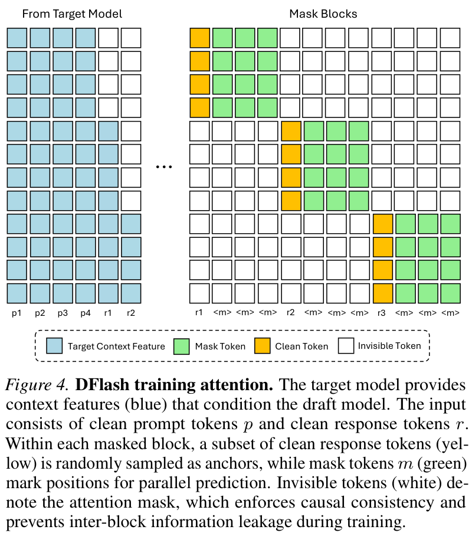
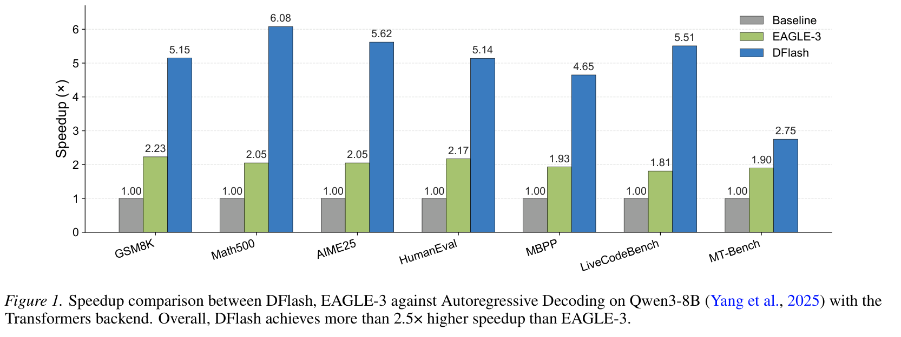
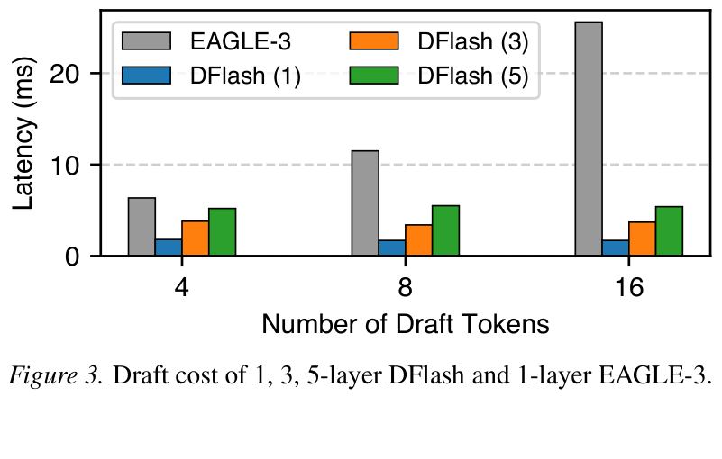
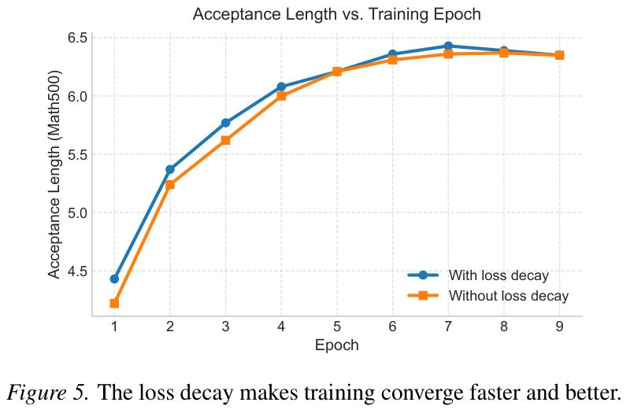

---
tags:
  - paper
  - collection/speculative-decoding
  - domain/model-systems
  - status/deep-review
  - topic/speculative-decoding
  - method/block-diffusion-drafting
document_type: paper
domain: speculative_decoding
collection: Speculative Decoding
review_status: deep-review
canonical: true
---

# DFlash: Block Diffusion for Flash Speculative Decoding 精读分析

> [!info] 文档关系
> - 文档类型：Paper
> - 领域入口：[README](../README.md)
> - 上位汇总：[Evolution](../surveys/evolution.md)
> - 证据资产：`../assets/papers/dflash/`
> - 相关文档：[Figure inventory](../evidence/figure-inventory.md)

> 资料状态：已核验 arXiv `2602.06036v2` camera-ready PDF、官方 LaTeX/source、官方代码 commit、三组 Hugging Face API/config 快照与 OpenReview submission ID。五张正文/附录 Figure 均由 240 dpi PDF page render 重新裁剪，包含完整 caption；原始 vector PDF 仍在 source。公开 OpenReview 评审 note 因 browser challenge/API 403 无法取得，精确分类为 access-blocked。本文是 delegated process review，不是 formal Paper。

## 修订信息

- 当前修订 ID：`rev-dflash-obsidian-properties-20260731`
- 当前文档版本：`1.0.2`
- 当前修订时间：`2026-07-31T10:00:00+08:00`
- 替代版本：`rev-dflash-affiliation-backfill-20260730` / `1.0.1`

| 修订 ID | 文档版本 | 时间 | 修订者 | 类型 | 替代修订 | 迁移问题/解析 | 变更摘要 | 原因 | 影响位置 | 依据 | 对结论影响 |
|---|---|---|---|---|---|---|---|---|---|---|---|
| `rev-dflash-b1-initial` | `1.0.0` | `2026-07-25T15:17:53+08:00` | `delegated-paper-review-agent` | `initial` | 无 | 无 | 首次建立单篇因果闭环、术语符号、设计动机、claim matrix、实验归因、视觉 QA、代码/模型配置/OpenReview/infra 核验 | 父任务要求补齐 DFlash B1 隔离交付 | `analysis.md`；[Figure inventory](../evidence/figure-inventory.md)；过程侧公开评审记录；`source_verification.md`；`code/dflash` | arXiv v2 PDF/source；official code `94e4abc…`；checkpoint configs；结构与语义验证 | material |
| `rev-dflash-affiliation-backfill-20260730` | `1.0.1` | `2026-07-30T23:30:00+08:00` | `/root` | `metadata-update` | `rev-dflash-b1-initial` / `1.0.0` | 无 | 补充作者—机构元数据与角色证据边界 | 统一回填 affiliation 交付字段 | `作者与机构` | 论文 PDF 标题页、机构编号与角色脚注 | none：不改变方法、实验与归因结论 |
| `rev-dflash-obsidian-properties-20260731` | `1.0.2` | `2026-07-31T10:00:00+08:00` | `/root` | `metadata-update` | `rev-dflash-affiliation-backfill-20260730` / `1.0.1` | 无 | 增加 Obsidian YAML Properties 与层级标签 | 全量 canonical Paper 标签补齐 | 文件头 YAML frontmatter | 已验证的 ICML 2026 标签 schema；仓库覆盖矩阵 | none：不改变论文分析与证据结论 |

## 0. 资料与配图索引

- 论文：`paper.pdf`；arXiv `2602.06036v2`，ICML 2026 camera-ready。
- 源码/LaTeX：`source/2602.06036.tar` 与 `source/latex/`。
- 元数据：`source/arxiv-metadata.xml`；完整核验记录见 `source_verification.md`。
- 开源代码：`https://github.com/z-lab/dflash`；`code/dflash`；commit `94e4abc5e0c31b67bc1a9d30f1cc34ece28a8756`。
- Checkpoints：`source/hf-qwen3-8b-dflash-*`、`source/hf-qwen3-4b-dflash-*`、`source/hf-qwen3-8b-target-*`。
- OpenReview：submission/forum `Oz335dV48X`；评审获取分类见 过程侧公开评审记录。
- 提取文本与 PDF 页渲染已在隔离过程工作区核验；正式文档只保留 QA 通过的原论文裁图。
- 视觉证据：Figures 1–5；完整页码、caption、bbox 与逐图 QA 见 [Figure inventory](../evidence/figure-inventory.md)。
- AI 生成分析示意图：未生成。已安装的 `openrouter-icu-image` 只有 `generate/edit` image endpoints，不支持技能强制要求的 `responses-doc --input-file analysis.md` document-input 路径；即使 API key 可用，也不得用 prompt-only 图片替代。

| 视觉 | 类型 | 本地路径 | 主要证据 |
|---|---|---|---|
| Figure 1 | result | `../assets/papers/dflash/fig1-speedup-caption.png` | Qwen3-8B 各任务端到端 speedup |
| Figure 2 | mechanism/system | `../assets/papers/dflash/fig2-inference-design-caption.png` | target feature fusion、每层 KV injection、parallel proposal |
| Figure 3 | system result | `../assets/papers/dflash/fig3-draft-latency-caption.png` | draft depth/token budget 对 latency 的影响 |
| Figure 4 | mechanism | `../assets/papers/dflash/fig4-training-attention-caption.png` | random anchors、block-local attention、跨 block 隔离 |
| Figure 5 | mechanism result | `../assets/papers/dflash/fig5-acceptance-vs-epoch-caption.png` | loss decay 的训练动态 |

## 0.1 术语与符号解释

### 0.1.1 术语表

| 术语 | 本文含义 | 别名 | 不等于/易混项 | 证据来源 |
|---|---|---|---|---|
| target model | 冻结的高质量 autoregressive LLM；产生 authoritative posterior token、hidden states 与最终输出 | oracle model | 不等于 teacher-only 离线模型；它也在线 verification | paper §3–5；code `dflash/model.py:87-143` |
| draft model | 五层为主的轻量 Qwen3-shaped Transformer adapter，使用 target feature 作为条件并行预测 masked block | diffusion drafter | 不等于独立端到端 dLLM，也不等于 target 的 early-exit 层 | paper §4；HF config |
| block diffusion drafting | 一个 forward 同时预测 anchor 后的 `block_size-1` 个 masked positions | one-step diffusion draft | 不等于多轮迭代 denoising；也不等于 tree construction | paper §3.2, §4.1；code `model.py:107-121` |
| speculative cycle | draft proposal 后由 target 一次并行 verification，提交最长匹配前缀再加一个 target bonus token | draft–verify cycle | 不等于单个 draft forward；包含 target verification | paper §3.1；code `model.py:126-143` |
| acceptance length $\tau$ | 每 cycle 平均提交 token 数，包含 target bonus token | accepted length | 不等于仅被接受的 draft token 数 $a$ | paper Eq. (1)；code `model.py:135-140` |
| target context feature | 五个 target layers 的 hidden states 拼接后，经共享线性投影和 RMSNorm 得到的条件特征 | fused target feature | 不等于 target logits；也不是每个 draft layer 各自重新融合 | paper Appendix A.3；code `model.py:39-45,317-335` |
| KV injection | target context feature 在每个 draft layer 被投影为额外 K/V entries | persistent conditioning | 不等于把 target feature 只加到 draft input embedding | paper §4.1, Table 9；code `model.py:226-238` |
| anchor token | 每个训练/推理 block 首位的 clean token；推理时来自上一 cycle 的 target bonus token | clean anchor | 不等于随机保留的任意 masked position | paper §4.2, Figure 4 |
| mask token | block 中待并行预测的位置；Qwen3 checkpoints 中 ID 151669 | noise token | 不等于 causal-mask 的不可见位置 | HF configs；paper Figure 4 |
| random anchor sampling | 每 epoch 从 response 中采 anchor 并构造多个局部 masked blocks | sampled blocks | 不等于标准固定 block partition | paper §4.2, Table 13 |
| loss decay | 对 block 内更靠前 token 施加更大 CE 权重 | acceptance-aware weighting | 不等于学习率 decay；$\gamma$ 在此是权重衰减尺度 | paper Eq. (4), Appendix A.1 |
| input fusion | target feature 只在 draft input 处融合的对照 | EAGLE-3-style conditioning | 不等于每层 KV injection | paper Table 9 |
| serving speedup | 同一 backend/硬件设置下相对 native AR baseline 的 tok/s 或 per-token latency 比值 | end-to-end acceleration | 不等于单独 draft-kernel speedup或 acceptance length | paper Tables 1–3, 5, 12 |
| lossless | 最终提交 token 总由 target posterior 决定；greedy 或 code 所实现的 exact-match sampling 不改变 target 轨迹 | target-distribution preserving | 不代表 draft token 自身正确率 100%，也不代表数值 bitwise reproducibility | paper Introduction/Conclusion；code `model.py:126-143` |

### 0.1.2 符号表

| 符号 | 含义 | 性质 | 作用域/索引 | 单位/取值 | 来源 | 易混点 |
|---|---|---|---|---|---|---|
| $\mathcal M_t,\mathcal M_d$ | target 与 draft model | author-defined | 全局 | 模型 | paper §3.1 | `t/d` 是角色，不是训练/测试集 |
| $\gamma$（speed model） | 每 cycle proposal 的 draft-token budget | author-defined | per cycle | token count | paper §3.1–3.2 | paper 又在 loss decay 中复用 $\gamma$ 作为 decay scale |
| $L$ | speculative decoding 平均 per-token latency | author-defined | workload/backend | seconds/token | paper Eq. (1) | 不等于单 cycle latency |
| $L_{\text{target}}$ | target 原生 AR per-token latency | author-defined | matched baseline | seconds/token | paper §3.1 | 必须在同一 backend/load 下比较 |
| $T_{\text{draft}}$ | 一个 cycle 的 drafting time | author-defined | per cycle | seconds | paper Eq. (1) | 不包含 verification |
| $T_{\text{verify}}$ | target 并行验证 proposal 的时间 | author-defined | per cycle | seconds | paper Eq. (1) | 随 block size、batch 与 backend 变化 |
| $\tau$ | 含 bonus token 的平均 acceptance length | author-defined | dataset/workload average | tokens/cycle，$[1,\gamma+1]$ | paper Eq. (1) | 不等于 draft-only acceptance $a$ |
| $\eta$ | 相对 target AR 的 speedup $L_{\text{target}}/L$ | author-defined | matched evaluation | ratio | paper §3.1 | table 中 `speedup` 是实测同义量 |
| $t_{\text{step}},t_{\text{parallel}}$ | AR draft 单步 latency 与一次 parallel-block latency | author-defined | draft stage | seconds | paper Eqs. (2)–(3) | “近似不随 $\gamma$”只在 moderate block size 成立 |
| $\mathbf H^{(l_i)}$ | target 第 $l_i$ 层 hidden state | author-defined | per token/layer | BF16 tensor | Appendix A.3 | code 的 `output_hidden_states` 有 embedding offset |
| $\mathbf H_t,\mathbf H_d$ | fused target context feature 与 draft hidden state | author-defined | per token/draft layer | hidden tensor | Appendix A.3 | $\mathbf H_t$ 已经过 $W_c$+RMSNorm |
| $W_c$ | 五层 target hidden 拼接到 draft hidden size 的共享投影 | author-defined | model-global | $H\times 5H$ | Appendix A.3 | 不等于每层 K/V projection |
| $\mathbf Q_i,\mathbf K_i,\mathbf V_i$ | draft layer $i$ 的 query/key/value | author-defined | per layer/head/token | tensor | Appendix A.3 | K/V 同时含 target context 与 draft block |
| $k$ | block 内 token position | author-defined | $k=1,\dots,b-1$ | index | paper Eq. (4) | anchor 不计入 masked-token loss |
| $w_k$ | position $k$ 的 CE loss weight | author-defined | per masked position | positive scalar | paper Eq. (4) | 非 acceptance probability |
| $\gamma$（loss） | loss-decay rate；b16/b10/b8 分别取 7/5/4 | author-defined | training config | scalar | Appendix A.1 | 与 proposal budget 同名复用，含义不同 |
| $b$ | block size，包含 1 个 anchor | analysis-derived | train/infer | 8, 10, 16 等 | paper §5；HF config | 实际 draft positions 为 $b-1$ |
| $a$ | 首次 mismatch 前连续匹配的 draft token 数 | analysis-derived | per cycle | $0,\dots,b-1$ | analysis derivation；code `model.py:135` | cycle 提交量是 $a+1$ |
| $H,I,L_d,N_q,N_{kv},d_h,s$ | hidden/intermediate size、draft layers、Q/KV heads、head dim、bytes/element | analysis-derived | checkpoint/system | counts, bytes | HF configs；§8 derivation | 用于容量/KV 估算，不是 paper 原符号 |
| $\mathrm{BW}_{eff},U_{\mathrm{BW}}$ | effective bandwidth 与峰值利用率 | analysis-derived | kernel/runtime | bytes/s, ratio | §8.4 derivation | paper/code 无 bytes-moved counter，不能给数值 |

## 1. 论文基本信息

### 作者与机构

- 第一作者（首位列名）：Jian Chen → University of California, San Diego。
- 共同第一作者（仅含论文明确标注者）：论文未显式标注。
- 通讯作者/通讯联系人（仅含论文明确标注者）：
  - Zhijian Liu → University of California, San Diego
- 其他作者涉及的机构（去重列举，不作逐作者映射）：University of California, San Diego。
- 对应依据：论文 PDF 标题页、作者机构编号与角色脚注（核验日期：2026-07-30）。

- 标题：*DFlash: Block Diffusion for Flash Speculative Decoding*
- 作者：Jian Chen, Yesheng Liang, Zhijian Liu
- 版本/venue：arXiv `2602.06036v2`；ICML 2026 camera-ready
- 领域：lossless speculative decoding、block diffusion、LLM inference/serving
- 核心问题：现有高接受率 drafter 仍 autoregressive，draft latency 随 proposal budget 线性增长；纯 diffusion drafter 则可能太大或太弱。
- 研究目标：把 diffusion 限定为单步 block proposal adapter，用 target hidden features 提升 proposal 质量，再由 target 验证保证输出合同。
- 关键约束：每个 target family 需独立训练 draft；block size 受 workload 影响；最终速度受 target verification、backend 和 concurrency 共同决定。

## 2. 研究动机与问题—方案闭环

### 2.1 出发点与背景痛点

`author-stated`：LLM decoding 的串行 token dependency 使低 batch/长输出推理慢、memory-bound 且 GPU 利用不足；长 CoT 放大 decode 占比。标准 speculative decoding 已把多个 draft tokens 合并为一次 target verification，但 EAGLE-3 的 draft stage 本身仍需多次 autoregressive steps。论文因此不是重新解决“能否验证多个 token”，而是清除 speculative pipeline 中残留的 draft-side seriality（Introduction；§3）。

`author-stated`：diffusion model 能并行预测 masked tokens，但独立生成质量通常弱于 AR target，且多步 denoising 会吃掉并行收益。论文的关键重定位是：draft 不必独立承担最终质量，只要 proposal 能被 target 快速验证；因此可将 denoising 压到单步而不让 draft 直接决定最终输出（Introduction；Conclusion）。

### 2.2 现有方案为何不够

第一条 failure mode 是 AR drafting 的 $T_{\text{draft}}=\gamma t_{\text{step}}$：budget 越大越慢，迫使 EAGLE-3 等使用浅 drafter；浅模型的 $\tau$ 又早早饱和，质量与 latency 被同一串行链绑定（§3.2，Figure 3）。第二条 failure mode 是 naive small diffusion drafter 缺少 target 内部表征，需“from scratch”猜 future tokens；Appendix Table 10 的 5-layer no-feature drafter 在 math 上只有 2.65–3.73× speedup 与 3.23–4.61 的 $\tau$。第三条是大 dLLM drafter：论文指出 DiffuSpec/SpecDiff-2 约 7B，draft quality 较强却付出容量/latency。

`inferred boundary`：这些 prior-failure 判断并非同一实验平台下的完整统一对比。DFlash 对 EAGLE-3 有直接实测，对其他 diffusion speculative methods 以“无开源实现”为由未跑；因此“state-of-the-art across all diffusion drafters”证据不足，只能稳健地说在已测 EAGLE-3 与 native AR baseline 上领先。

### 2.3 论文计划解决的问题与成功标准

- 核心研究问题：能否让一个显著小于 target 的 diffusion adapter 在一次 forward 中提出完整 block，同时达到足够高的 $\tau$，使 $T_{\text{draft}}$ 与 $T_{\text{verify}}$ 的总成本被更多 accepted tokens 摊薄？
- 目标场景：Qwen3/LLaMA family 的长输出、低至中并发 decoding；并扩展到 SGLang/vLLM。
- 必须满足：target output contract 不变；draft block 一次产生；target features 可被每层持续访问；端到端 speedup 而非只提升 $\tau$。
- 成功标准：Qwen3 上显著高于 EAGLE-3 的 matched-budget speedup/$\tau$；H200/B200 backend 中真实 throughput 提升；设计消融能拆分 parallel drafting 与 conditioning。
- 不解决：零训练迁移到任意 target、动态 block scheduler、完整 training code 开源、NPU/多机部署和所有 diffusion baseline 的统一公平对比。

### 2.4 核心方案如何解决并优化问题

| 原始问题/失败模式 | 根因或约束 | 对应方案设计 | 改变的变量/系统行为 | 作用机制 | 预期优化及指标 | 证据来源 | 判断 |
|---|---|---|---|---|---|---|---|
| AR draft latency 随 budget 线性增长 | token-to-token dependency | one-forward block diffusion proposal | $\gamma$ 次 sequential draft steps 变为一次 block forward | masked positions 并行计算 | 降 $T_{\text{draft}}$，提高 speedup | §3.2；Figure 3；code `model.py:107-121` | supported |
| small drafter 从零猜 future tokens | 容量小且缺少 target semantics | 抽取五层 target hidden 并共享融合 | draft condition 从 token embedding 扩展为 deep target features | target representation 提供 future-token hints | 提高 $\tau$ | §4.1；Table 7；Appendix Table 10 | partially supported：有消融，但 no-feature 与完整主模型并非一张 matched table |
| 深层 drafter 中 input condition 稀释 | 只在 input 注入一次 | 每层 KV injection | target feature 在每层 attention 均作为 K/V | 每层 query 直接访问 persistent context | 随 depth 增长保持 acceptance | Table 9；HF/code K/V concat | supported |
| first error 使整个后缀无效 | prefix acceptance contract | early-position loss decay | 前部 token CE 权重提高 | 优先减少最早 mismatch | 加速 $\tau$ 收敛 | Eq. (4), Figure 5 | partially supported：曲线支持，缺最终 matched 数表/置信区间 |
| 固定 partition 与推理 anchor 不匹配 | 推理 block 总以 target bonus token 起始 | random anchor sampling | 训练 block 起点每 epoch 变化 | 对齐推理条件并扩增 context coverage | 提升 speedup/$\tau$ | Table 13 | supported |
| 多个 blocks 训练会泄漏 | block 间并非同一真实序列状态 | block-local bidirectional sparse mask | 跨 block attention 设为 invisible | 并行训练且避免 future/block leakage | 降训练成本、保持目标有效 | Figure 4, §4.2 | plausible：机制清楚，无 runtime/quality ablation |
| 共享 vocab projection 成本大且易漂移 | 独立 embedding/head 增参并偏离 target space | 冻结共享 target embedding 与 LM head | 只训练 draft Transformer + fusion | proposal logits 与 target vocabulary geometry 对齐 | 降参数/训练成本 | §4.2；HF repo single draft weights | plausible：无独立消融 |
| 大 context 下 base drafter $\tau$ 下降 | draft 未见过 long-context pattern | 1.6K LongAlign samples fine-tune | draft context distribution 被扩展 | 学会利用长距 target feature | 16K/32K acceptance 回升 | Table 4 | supported for tested datasets，非零样本泛化 |

### 2.5 完整因果链与证据闭环

完整链条是：长输出 AR decoding 的 serial/memory-bound 痛点，使 speculative decoding 成为可行合同；但 AR drafter 仍有 $\gamma$ 个 sequential steps，且浅 drafter 的 acceptance 饱和。DFlash 将 draft stage 改成一次 block-parallel forward，直接减少 $T_{\text{draft}}$；又把 target 多层 hidden 通过共享 fusion 和每层 KV injection 送入小 drafter，提升 proposal 的连续匹配长度 $\tau$。target 对 proposal 一次并行验证，只提交连续匹配前缀与一个 target posterior token，最终输出仍由 target 决定。由

$$
L=\frac{T_{\text{draft}}+T_{\text{verify}}}{\tau},\qquad
\eta=\frac{L_{\text{target}}}{L}
$$

可预期更低 draft cost 与更高 $\tau$ 共同放大 speedup。Figure 3 直接支持 draft-side latency 路径；Table 7/9/13 与 Figure 5 分别支持 feature count、KV injection、anchor sampling 与 loss weighting；Table 1 和 SGLang Table 3 支持端到端结果。

证据闭环的边界是：Table 1 的完整系统同时改变 proposal topology、draft capacity、conditioning 与 verification budget，不能把 4–6× 全部归给单个组件；Figure 3 没有报告误差条；主表没有置信区间/多次运行方差；其他 diffusion baselines 未实测；高 concurrency 时 speedup 明显回落，说明 target verification/compute saturation 会重新成为 binding constraint。故总体判断为 `partially-supported`：核心机制—指标方向有直接证据，但跨方法的精确贡献分解与泛化边界未完全封闭。

## 3. 核心贡献与创新点

1. 把 block diffusion 从 final generator 重定位为 lossless speculative proposal adapter；最终质量风险由 target verification 吸收（Introduction/Conclusion）。
2. 用五层 target hidden fusion + every-draft-layer KV injection 同时提升小 drafter 的条件质量与 depth scaling（Figure 2；Table 7/9）。
3. 以 one-forward block prediction 消除 AR draft 的 budget-linear serial cost（§3.2；Figure 3）。
4. 用 random anchors、block-local sparse attention 和 early-token loss decay 把训练目标对齐 prefix acceptance，而非平均 token denoising（Figure 4；Eq. 4；Table 13；Figure 5）。
5. 给出 Transformers、SGLang、vLLM 与后续 MLX 的实现/模型发布；但 camera-ready 所对应训练 recipe 仍未开源。

## 4. 研究方法

### 4.1 方法总览

一个 cycle 从已经确定的 anchor token 开始。target 在 prefill/上一轮 verification 时输出 posterior 与 hidden states；五个 target layers 的 hidden 被拼接并投影为 $\mathbf H_t$。draft 输入为 `[anchor, mask, …, mask]`，target embedding 将其映射到 $\mathbf H_d$。每个 draft layer 只由 draft positions 产生 Q，而 target context 与 draft positions 一起产生 K/V。所有 masked positions 一次输出 proposal；target 再对完整 block 并行算 posterior，提交最长 exact-match prefix 与一个 target token，随后 crop target/draft KV cache 并进入下一 cycle。代码准确实现了这一 stage distinction（`model.py:87-169,185-347`）。

### 4.2 组件级设计动机与具体问题映射

| 设计项 | why 状态 | 原文证据 | 针对问题 | 因果机制 | 替代/权衡 | 验证证据 | 判断 |
|---|---|---|---|---|---|---|---|
| single-step block diffusion drafting | author-stated | §3.2, §4.1 | AR draft seriality | 同一 layer operation 覆盖所有 positions | AR/tree conditioning 更强但有 sequential cost | Figure 3；完整方法主表 | supported |
| five target hidden layers + $W_c$ | author-stated | §4.1, Appendix A.3 | tiny drafter 缺 context | 汇聚 shallow-to-deep representations | 更多 features 增 offline cache/训练 I/O | Table 7 | supported for 3→5 features |
| every-layer KV injection | author-stated | §4.1, Table 9 | input condition 随 depth 稀释 | 每层 query 直接 attend persistent target K/V | KV cache 墧；input fusion 更便宜 | matched replacement Table 9；code | supported |
| deeper 5-layer drafter | author-stated | §3.2, Table 6 | 1-layer drafter capacity ceiling | parallel block amortizes added depth | 8 layers $\tau$ 更高但 latency 抵消 | Table 6；Figure 3 | supported，最优依 workload |
| random anchor sampling | author-stated | §4.2 | standard blocks 与 bonus-token anchor 不匹配 | 对齐 inference start states 并做数据增广 | 固定 block 更简单/可复现 | Table 13 | supported |
| block-local bidirectional sparse mask | author-stated | §4.2, Figure 4 | 多 blocks 拼接会泄漏 | block 内共同 denoise，跨 block 隔离 | 分 block forward 无泄漏但训练慢 | mechanism visual only | plausible |
| early-position exponential loss decay | author-stated | Eq. (4), Appendix A.5.1 | first mismatch 截断后缀 | 对前部 token 提高梯度权重 | uniform CE 更中性；可能牺牲尾部 | Figure 5 | partially-supported |
| shared frozen embedding/LM head | author-stated | §4.2 | vocab projection 墧/表示漂移 | 复用 target token space | 限制 draft 表征自由度 | no matched ablation；checkpoint/code linkage | plausible |
| train b16, optional infer b8 | inferred from evidence | Table 8 | serving load 的 verification cost 变化 | 大 block 训练保留向小 block 退化能力 | b8→b16 泛化差；scheduler 未实现 | Table 8 | partially-supported |
| long-context fine-tune | author-stated | §5.4, Table 4 | >4K acceptance degradation | 少量长 context 样本适配 draft | 额外 data/epochs；非 zero-shot | Table 4 | supported in tested ranges |

### 4.3 推理公式与实现

Target feature fusion：

$$
\mathbf H_t=\operatorname{RMSNorm}\!\left(W_c[\mathbf H^{(l_1)};\ldots;\mathbf H^{(l_5)}]\right).
$$

Layer $i$ 的 KV injection：

$$
\mathbf Q_i=W_i^Q\mathbf H_d,\quad
\mathbf K_i=[W_i^K\mathbf H_t;W_i^K\mathbf H_d]_{\rm seq},\quad
\mathbf V_i=[W_i^V\mathbf H_t;W_i^V\mathbf H_d]_{\rm seq}.
$$

代码一致性：`extract_context_feature` 选 `target_layer_ids` 并 concat；`self.fc` 与 `hidden_norm` 实现 $W_c$+RMSNorm；attention 只对 `hidden_states` 做 Q，而对 `target_hidden` 和 draft hidden 都做 K/V concat（`model.py:39-45,223-238,312-347`）。HF Qwen3-8B checkpoint 将层 ID 固定为 `[1,9,17,25,33]`。

Greedy/exact-match acceptance 可写为

$$
a=\sum_{j=1}^{b-1}\prod_{k=1}^{j}\mathbf 1[d_k=\hat y_k],\qquad
\tau=\mathbb E[a+1].
$$

代码用 equality 后 `cumprod().sum()` 得 $a$，再写入 `a+1` 个 token、crop cache，并把 `a+1` 加入统计（`model.py:134-143`）。这明确区分 drafting、target verification 与 serving/runtime。

### 4.4 训练目标

训练先对 clean prompt/response 跑 frozen target，取所有 token 的五层 hidden。每个 sampled anchor 后放 $b-1$ 个 masks；同 block positions 双向可见，跨 block 不可见，target context 作为条件。masked-token CE 的 position weight 为

$$
w_k=\exp\left(-\frac{k-1}{\gamma_{\rm loss}}\right),
$$

其中 b16/b10/b8 的 $\gamma_{\rm loss}$ 分别为 7/5/4。Appendix 报告 6 epochs、AdamW、LR $6\times10^{-4}$、clip 1.0、cosine schedule、warmup 0.04、max length 3072（Coder 4096）、每 sequence 512 anchors。约 800K mixture 来自 Nemotron Post-Training Dataset V2 与 CodeAlpaca，但 response 由 target 重生成以加强 alignment。

事实缺口：source 说明可 online 或 offline hidden caching，却没报告实际每个模型采用哪一种、训练 GPU 数/类型、global batch、optimizer states、wall time、随机种子与完整数据生成参数。当前代码 commit 无训练实现，因此 Figure 4 的 Flex Attention mask 与 loss decay 只能从论文核验，不能从代码核验。

### 4.5 模型容量与 checkpoint

Qwen3-8B DFlash config：$H=4096,I=12288,L_d=5,N_q=32,N_{kv}=8,d_h=128$，BF16、b16。按当前代码的 Q/K/V/O 与 SwiGLU 三个矩阵、两次 layer norm、共享 fusion $W_c$ 估算：

$$
N_d\approx L_d\!\left[2H(N_qd_h)+2H(N_{kv}d_h)+3HI+2H\right]+5H^2+H
\approx1.049\times10^9.
$$

对应 BF16 约 2.097 GB，与 Hub `usedStorage=2,097,597,257` bytes 一致。它相对 8B target 是轻量 adapter，但不是“几十 M 参数”；任何声称 30M 的二手解读都与 checkpoint 配置冲突。

## 5. 关键结论与技术 claim 证据矩阵

### 5.1 主结果

Qwen3-8B、temperature 0、Transformers、2048 max new tokens：DFlash b16 平均 4.86×/$\tau=6.49$，EAGLE-3 tree16 为 1.76×/2.96，EAGLE-3 tree60 为 2.02×/3.40。相对 tree16，speedup 绝对 +3.10×、相对 +176.1%，$\tau$ +3.53、相对 +119.3%；相对 tree60，speedup +2.84×、相对 +140.6%，$\tau$ +3.09、相对 +90.9%。这些数来自 Table 1，不是 Figure 1 估读。

Qwen3-4B greedy 的平均为 4.91×/6.54，对 EAGLE-3(16) 1.81×/3.05：speedup +3.10×（+171.3%），$\tau$+3.49（+114.4%）。Sampling temperature 1 时 Qwen3-8B 降到 4.03×/5.48，相对 greedy 分别 -0.83×（-17.1%）与 -1.01（-15.6%），说明 open-ended uncertainty 会缩短 exact-match prefix。

Reasoning mode 中 Qwen3-4B/8B 在 GPQA/MATH-500/AIME25 报告约 3.64–4.64×，$\tau=4.55–5.82$。这支持长 CoT 场景，但没有 EAGLE-3 reasoning baseline，因此只能证明相对 native AR 的 acceleration，不能证明 reasoning 上相对 EAGLE-3 的优势。

### 5.2 Technical claim matrix

| 技术点 | 声称收益 | 实验/消融 | 是否受控 | 指标变化 | 证据分类 | 结论 |
|---|---|---|---|---|---|---|
| block diffusion 替代 AR draft | 降 drafting latency | Figure 3；Table 9 AR vs block groups | Figure 3 同硬件但未给误差；Table 9 同 5L/b8 | 16 tokens：5L DFlash latency远低于 1L EAGLE-3；Table 9 KV block 3.3× vs KV AR 2.4× (GSM8K) | replacement + system visualization，仍混合 topology | supported |
| target features 提升 proposal | 提高 $\tau$ | Appendix Table 10；Table 7 | 3-H→5-H 受控；no-feature→main 匹配信息不完整 | Math500 3-H→5-H：4.49→4.69×，5.38→5.64 | direct matched for feature count；confounded for none→full | partially-supported |
| every-layer KV 优于 input fusion | 提高 acceptance 与 speedup | Table 9 | matched 5L/b8 within drafting family | block GSM8K：2.9→3.3×，$\tau$3.5→4.2；HumanEval 2.9→3.2×，3.5→4.0 | direct replacement | supported |
| depth 可扩展 | 更深提高 $\tau$ | Table 6 | matched data/b16/5 features | Math500 3L→5L→8L $\tau$ 5.64→5.99→6.33；speedup 4.69→4.71→4.64 | direct sensitivity | supported；8L 并非最快 |
| b16 能向 b8 泛化 | adaptive scheduling basis | Table 8 | matched 8L/5 features | b16→b8 Math $\tau=5.09$，接近 b8→b8 5.21；b8→b16 仅 5.02 vs b16→b16 6.33 | direct cross-setting sensitivity | supported asymmetry；scheduler 未验证 |
| random anchors | 提高 data efficiency/$\tau$ | Table 13 | matched 3L/5H/b16/100K | Math 4.13→4.69× (+13.6%)，$\tau$4.94→5.64 (+14.2%) | direct ablation | supported |
| loss decay | 更快/更好 convergence | Figure 5 | matched curve claim，缺数表/方差 | 曲线全程前期更高，后期差距很小 | mechanism visualization, correlation | partially-supported |
| shared frozen embedding/head | 降参数并对齐 token space | prose + checkpoint | 无移除/可训练 head 对照 | 无独立 delta | code/config-only | plausible, unverified benefit |
| sparse training mask | 一次训练多个 blocks 且无泄漏 | Figure 4/prose | 无 dense/separate-forward 对照 | 无 runtime/quality delta | mechanism-only | plausible |
| long-context fine-tune | 恢复 >4K acceptance | Table 4 | base vs 1.6K/3-epoch adapted | hotpot 16K 3.61→6.05；qasper 16K 3.57→6.00；gov 32K 2.09→3.56 | direct adaptation comparison | supported for measured datasets |
| 真实 serving gain | 降成本、提高 throughput | SGLang Table 3, vLLM Table 12 | matched backend/baseline；scheduler/kernel bundled | Qwen3-8B Math500 c1 230→1175 tok/s (5.1×), c32 5694→16076 (2.8×) | direct end-to-end, component-confounded | supported end-to-end |
| “over 6× across range” | broad acceleration | Table 1 | task/model dependent | peak 6.09×；MT-Bench Q3-8B greedy仅2.75× | direct but selective headline | supported as peak，不能解释为所有设置 |

### 5.3 假设是否被验证

- “parallel drafting 降低 $T_{\text{draft}}$”：Figure 3 与代码 one-forward path 直接支持，但缺不同 batch/block 的完整 latency surface。
- “target hidden 提供 future-token information”：feature-count/KV-injection/no-feature 结果支持其有效性；却未直接 probe hidden 中的信息量，因果表述应限于“作为 condition 能提升 acceptance”。
- “每层 KV 防止 signal dilution”：Table 9 支持 KV 比 input fusion 好；没有逐层 representation probe，因此“稀释”是合理机制解释而非直接测量。
- “loss decay 对齐 first-error objective”：acceptance 合同与公式因果一致；Figure 5 支持 convergence，缺最终多 seed 显著性。
- “lossless”：target exact-match verification path 与代码提交逻辑支持；没有 property-based parity test 或随机 sampling 统计检验随仓库发布。

### 5.4 收益来源归因

| 组件/变化 | 对比基线 | 指标变化 | 影响路径 | 证据强度 |
|---|---|---|---|---|
| block parallelism | KV AR → KV block (Table 9) | GSM8K 2.4→3.3×，$\tau$4.8→4.2（质量略降、速度升） | draft latency/parallel utilization | matched replacement，最接近 algorithm-only bridge |
| KV conditioning | block input → block KV | GSM8K 2.9→3.3×、3.5→4.2 | candidate quality/$\tau$ | direct |
| feature count 3→5 | Table 7 | Math +0.20× speed, +0.26 $\tau$ | candidate quality | direct |
| depth 3→5 | Table 6 | Math +0.02× speed, +0.35 $\tau$ | quality gain nearly offsets extra draft cost | direct sensitivity |
| depth 5→8 | Table 6 | Math -0.07× speed, +0.34 $\tau$ | extra draft latency exceeds quality gain | direct sensitivity |
| random anchors | standard → sample | Math +0.56×, +0.70 $\tau$ | training alignment/data coverage | direct |
| loss decay | uniform → decay | curve shows earlier/final acceptance advantage | early-token quality | indirect visualization |
| SGLang FA4 + Spec-v2 + DFlash | native SGLang baseline | c1 5.1×，c32 2.8× on Q3-8B Math500 | algorithm + kernel + scheduler + load | direct end-to-end，不能组件分解 |

粗分解结论：DFlash 的独特价值来自“两条同时成立的路径”——block proposal 主要降低 $T_{\text{draft}}$，KV/target features 主要提高 $\tau$。不能把完整 4.86× 对 1.76× 的差值简单相加分配给二者，因为 Table 9 的 bridge baseline 使用不同 b8/Qwen3-4B 设置，且 verification topology、draft capacity 与 runtime 相互作用。

## 6. Related Work 对比

| 类别/工作 | 方法核心 | 优点 | 局限 | 与 DFlash 的关系/公平性 |
|---|---|---|---|---|
| Leviathan-style SD | 独立 small AR drafter + target verify | lossless 合同清楚 | draft serial，容量/成本权衡 | DFlash 保留 verification，替换 draft topology |
| Medusa | target 上多 prediction heads + tree verify | 无独立完整 drafter | head capacity/tree overhead | DFlash 用独立 adapter 与 block path |
| EAGLE-1/2/3 | target feature-conditioned AR/tree draft | 高 acceptance、成熟 baseline | draft steps 串行；input fusion | 主实测 baseline；tree16 matched budget、tree60 performance setting，比较相对充分但 checkpoints 来自 AngelSlim/official mixture |
| block diffusion/LLaDA/Fast-dLLM/SDAR | masked parallel generation | parallelism/bidirectional context | 独立生成质量、denoising steps、KV support | DFlash 只借其 proposal parallelism，不承担 final generation |
| TiDAR | diffusion “thinking” + AR “talking” | 混合范式 | paper 指出 final quality 非 lossless | 未实测，不能据此宣称全面领先 |
| DiffuSpec/SpecDiff-2 | large dLLM speculative drafter | 较长 acceptance | 大容量与 latency | 论文未因无开源实现而实测；比较仅为机制/容量论证 |
| PARD | small AR model mimic diffusion-style parallel prediction | 轻量 proposal | acceptance ceiling | DFlash 用真实 masked-block adapter + target KV condition |
| Samragh et al. | target hidden 含 future-token potential，LoRA parallel draft | 直接利用 target | 与 target 耦合 | DFlash 共享观察，但把解码器做成独立小 adapter |

公平性边界：Table 1 对 EAGLE-3 给 tree16 与 tree60，能覆盖 matched node budget 与其典型高 acceptance setting；但 DFlash block proposal 与 EAGLE tree proposal 的 verification structure 并不相同，node count 相同不等价于 kernel/verification cost相同。论文以端到端 speedup 作为最终裁判是合理的；仍应报告多 seed/latency variance 与统一官方 implementation commit，camera-ready 未提供。

## 7. OpenReview 公开评审 × 论文内容交叉核验

- OpenReview：`https://openreview.net/forum?id=Oz335dV48X`
- 访问日期：2026-07-25
- submission identity：已核验
- public reviews/meta-review/decision/rebuttal/discussion：forum browser challenge，api/api2 均 HTTP 403；access-blocked
- venue decision 的独立来源：arXiv v2 metadata 明确写 “Accepted at ICML 2026. Camera-ready version”；不能替代 decision note 内容。

因此没有可负责任地填入的 reviewer claim，也不把网络访问失败解释为“没有评审”。本 review 自己识别的主要审计问题是：训练代码缺失、其他 diffusion baseline 未实测、误差/方差未报告、完整 gain 分解仍混杂、固定 block 与高并发边界、checkpoint 容量并非极小。它们是 reviewer analysis，不冒充公开评审意见。

## 8. Infra 需求分析

### 8.1 算力与 latency regime

每 cycle 理想模型：

$$
T_{\rm cycle}=T_{\rm draft}(b,L_d)+T_{\rm verify}(b,B,C),\qquad
L=\frac{T_{\rm cycle}}{\tau},
$$

其中 $B$ 是 batch/concurrency，$C$ 是 context。低并发下 native AR target 多为 weight/HBM traffic dominated，较大 verification block 能提高 GPU occupancy；高并发时 native baseline 已能填满 GPU，verification 更 compute-bound，所以 Qwen3-8B Math500 speedup 从 c1 5.1× 降到 c32 2.8×。这不是方法失效，而是 binding constraint 从 serial launch/weight streaming 转向 target compute。

Figure 3 说明 DFlash draft latency 对 token budget 的增长小于 EAGLE-3，但不是严格常数：block attention/MLP FLOPs 仍随 $b$ 增长，且 deeper $L_d$ 墧。论文的 $T_{\text{draft}}=t_{\text{parallel}}$ 是 scheduling abstraction，不应解释为 $O(1)$ compute。

### 8.2 显存与存储

Qwen3-8B draft weights约 2.097 GB BF16。Draft KV cache 每 token：

$$
\mathrm{KVBytes}_{d/token}=2L_dN_{kv}d_hs
=2\cdot5\cdot8\cdot128\cdot2=20{,}480\ \text{bytes}.
$$

Target KV 每 token约：

$$
\mathrm{KVBytes}_{t/token}=2\cdot36\cdot8\cdot128\cdot2=147{,}456\ \text{bytes},
$$

所以 draft KV 约为 target KV 的 13.9%，未计 allocator/page padding。五层 hidden concat 输入为 $5Hs=40{,}960$ bytes/token，fusion output为 $Hs=8{,}192$ bytes/token。当前 Transformers code 请求 `output_hidden_states=True`，通常会暂时 materialize embedding + 全部 36 layer outputs，约 $37Hs=303{,}104$ bytes/token；能否由 backend 只保留五层对 deployment memory 很重要，paper 未量化。

Offline training cache 随 selected target layers 线性增长。以 BF16、800K samples、真实 token count $N$ 计，raw hidden cache近似 $5NHs$，没有 token-length distribution 不能给可靠 TB 数。

### 8.3 Data Types / 数值格式

| 对象 | 格式 | 阶段 | 硬件依赖 | 影响 | 证据 |
|---|---|---|---|---|---|
| Qwen3 target/draft weights | BF16 | infer | NVIDIA tensor cores/Apple conversion path | 2 bytes/element；容量与 matmul throughput | HF configs；benchmark `dtype=torch.bfloat16` |
| target/draft KV | 随 model dtype，核验 config 为 BF16 | infer | backend cache kernels | 每 token 约 147,456 + 20,480 B | config + derivation |
| token IDs/mask IDs | int64 in Transformers tensor | infer | GPU embedding/index | 小于 weight/KV traffic | `model.py:79-82` |
| logits/softmax | model/backend accumulation 未明确 | infer | PyTorch/FA2/FA4/vLLM | 可能影响 exact sampling parity | code/config未固定 accumulation |
| quantized target | paper未报告 | infer | backend-specific | 不应把 README 后续 MLX 4-bit example外推到 paper主结果 | precisely unverified |

### 8.4 带宽、互联与利用率

$$
\mathrm{BW}_{eff}=\frac{\mathrm{BytesMoved}}{\mathrm{RuntimeSeconds}},\qquad
U_{\mathrm{BW}}=\frac{\mathrm{BW}_{eff}}{\mathrm{PeakBandwidth}}.
$$

Paper 只给 latency/throughput，没有 Nsight bytes-moved、HBM transactions 或 peak-normalized counters，因此 $\mathrm{BW}_{eff}$ 与利用率不能数值化。定性上，低 batch target AR 会重复流式读取大权重；block verification 提高 weight reuse/arithmetic intensity。Draft 约 2.1GB 权重本身也可能 memory-bound，但一次处理 $b-1$ positions 比 $\gamma$ 次浅层 AR launches 更易复用。KV injection 增加 draft-layer K/V 读写；是否被 FA4/fused kernel 完全吸收未测。

主实验是 single H200/B200，故无 all-reduce/all-to-all、NVLink/RDMA 证据。Qwen3.5 更大模型/README 的 `tp-size` 示例不是 camera-ready 主表的互联实验，不能据此声称多 GPU scaling。

### 8.5 CPU/GPU/NPU 异构执行

| 阶段 | CPU | GPU/Apple GPU | 数据移动/同步 | 潜在瓶颈 | 证据 |
|---|---|---|---|---|---|
| dataset/prompt | Python formatting/tokenization/API client | 无 | CPU→device input IDs | tokenizer/request overhead at short outputs | `benchmark.py` |
| target prefill/verify | launch/scheduler | target kernels + hidden extraction | target KV/hidden on device | HBM/compute；all hidden materialization | `model.py:87-143` |
| draft | launch/cache control | BF16 attention/MLP + target LM head | target hidden→draft fusion stays device-local | 2.1GB weight traffic、draft KV | `model.py:107-121,223-255` |
| serving | SGLang/vLLM scheduler | FA4/Flashinfer/backend kernels | request batching, cache management | concurrency-dependent saturation | paper Table 3/12；README |
| MLX | Python host | Apple Metal/MLX kernels | unified memory | portability path，非 paper benchmark | `model_mlx.py` |
| NPU | 未实现/未报告 | 未验证 | 未知 | operator/cache compatibility | precise absence |

Transformers benchmark 用 `torch.cuda.synchronize()` 包围 timing，减少异步计时偏差，却增加同步；SGLang Spec-v2 scheduling overlap 是 throughput 结果的一部分。Repository 还列出 experimental overlap env flags，说明 runtime stability/版本 pin 是部署风险。

### 8.6 调度、Serving 与自定义算子

Camera-ready：SGLang 使用 single B200 + FA4，启用 Spec-v2 overlap；LLaMA 对比为了 EAGLE tree compatibility 使用 Spec-v1 + Flashinfer。当前 repo 增加 vLLM 0.20.1+、SGLang PR branch、MLX 路径，但版本晚于部分 paper 实验且 README 中若干依赖指向 PR heads。论文未发布 custom DFlash CUDA kernel；性能依赖 backend attention/cache/scheduler。动态 block scheduling 被明确留作 future work。

## 9. 开源代码与配置对照

- 仓库：`code/dflash`
- commit：`94e4abc5e0c31b67bc1a9d30f1cc34ece28a8756`
- 静态 compile：passed
- GPU reproduction：未执行

| 论文机制 | 本地路径 | pinned commit URL | 一致性 |
|---|---|---|---|
| five target hidden concat | `dflash/model.py:27-45,87-100` | `https://github.com/z-lab/dflash/blob/94e4abc5e0c31b67bc1a9d30f1cc34ece28a8756/dflash/model.py` | 一致 |
| single parallel block proposal | `dflash/model.py:107-121` | 同上 | 一致；当前 Transformers 只实现 one-shot |
| target parallel verification/bonus token/cache crop | `dflash/model.py:126-143` | 同上 | 一致 |
| every-layer target K/V concat | `dflash/model.py:185-255` | 同上 | 一致 |
| shared fusion $W_c$ | `dflash/model.py:302-347` | 同上 | 一致 |
| BF16 benchmark | `dflash/benchmark.py:190-233` | `https://github.com/z-lab/dflash/blob/94e4abc5e0c31b67bc1a9d30f1cc34ece28a8756/dflash/benchmark.py` | 一致 |
| SGLang/vLLM concurrency client | `dflash/benchmark.py:322-431` | 同上 | 评测客户端存在；server backend 实现不在此 repo |
| training random anchors/Flex Attention/loss decay | 不存在 | 无 | 未开源 |
| paper tables reproduction | 不存在 | 无 | 未开源 |

### 9.1 Checkpoint/config 对照

| Checkpoint | 状态/revision | 参数量/存储 | 架构 | 关键配置 | 与 target/baseline 差异 |
|---|---|---:|---|---|---|
| `z-lab/Qwen3-8B-DFlash-b16` | open; `9b41424…` | reviewer reconstruct 1.049B；Hub storage 2.098GB | 5L Qwen3-shaped draft, H4096, I12288, 32Q/8KV | BF16, b16, target layers 1/9/17/25/33 | 容量：5 vs target 36 layers；算法：noncausal masked block + KV injection；runtime：separate draft cache |
| `Qwen/Qwen3-8B` | open; `b968826…` | target 8B family；five safetensor shards | 36L Qwen3ForCausalLM, same H/I/heads | BF16, causal AR | authoritative target |
| `z-lab/Qwen3-4B-DFlash-b16` | open; `b74e3a3…` | Hub storage 1.075GB | 5L, H2560, I9728 | BF16, b16, same five layer IDs | family-specific draft; not interchangeable with 8B |

Model weights未下载/执行；Hub configs 与 API revisions已冻结。Capacity/config claims 是 verified metadata，不是 README-only 推断。

## 10. 优点、局限与风险

### 优点

- 因果目标清晰：分别攻击 $T_{\text{draft}}$ 与 $\tau$，不是只报一个黑盒 speedup。
- Table 9 提供罕见的 AR/block × input/KV bridge，使 parallelism 与 conditioning 至少能局部拆分。
- 主表同时给 speedup 与 $\tau$，serving 表覆盖 concurrency 1–32，暴露高负载边界。
- final target verification 保留 lossless contract，允许 aggressive one-step proposal。
- checkpoint/config 与 inference code 已公开且当前 repo 扩展到多 backend。

### 局限

- training recipe/code、data regeneration、Flex Attention mask、loss 实现和表格 reproduction scripts 未开源。
- 其他 diffusion speculative baselines 未实测；“SOTA”主要相对 EAGLE-3。
- 大多数表无多 seed、置信区间、标准差、energy/HBM telemetry。
- 完整 4–6× 是 algorithm+capacity+verification+kernel+scheduler 的系统结果，无法完全归因。
- fixed block 对任务/temperature/concurrency敏感；MT-Bench 与高并发收益明显较低。
- Qwen3-8B draft约 1.05B/2.1GB，仍有真实显存、load time 与 KV overhead。
- 当前 Transformers code materialize 全部 hidden states，可能产生 paper 未计的 transient memory。
- public OpenReview reviews/rebuttal/decision note access-blocked，缺独立审稿线索。

### 可改进之处

- 发布 deterministic training/data pipeline 与 exact paper commit/backend containers。
- 做 matched 2×2×N factorial：AR/block × input/KV × depth/feature count，分解 quality 与 runtime。
- 报告 latency distributions、Nsight HBM bytes、kernel occupancy、energy/token 与 batch/context surface。
- 在线 scheduler 依据最近 acceptance histogram、batch size、verification cost选 $b$。
- 只输出指定 target layers 的 hidden hooks，避免 `output_hidden_states=True` 全量 materialization。
- 对 stochastic sampling 做长序列分布 parity/property tests。

## 11. 研究启发

- Diffusion model 不必与 AR target 竞争 final quality；可作为受强条件约束的并行 proposal operator。
- 对 prefix-dependent acceptance，训练损失应近似 downstream utility，而非平均 token accuracy。
- Persistent condition 更适合深 adapter：将外部 condition 放进每层 K/V 是可迁移到 distillation/parallel head 的设计模式。
- 未来最值得验证的是“adaptive block + selective hidden extraction + fused verification”，因为当前高并发瓶颈已从 draft 迁到 verification/runtime。
- 最小复现闭环：Qwen3 target/draft checkpoint、HF config、Transformers 4.57.x、BF16 GPU、五个 benchmark prompt pipeline、native vs b16 两路径；但训练复现仍缺官方实现。

## 12. 解读问题/待验证清单

1. Table 1 每个 cell 跑了几次，方差和 warmup 规则是什么？
2. Qwen3 EAGLE-3 AngelSlim checkpoints 与 DFlash target-generated 800K data 的公平性如何？
3. `output_hidden_states=True` 的全层 transient memory/latency 在主表是否计入？
4. loss decay 最终收益是否跨 seed 显著，还是主要提前 convergence？
5. shared frozen embedding/head 是容量节省还是 acceptance 必需项？
6. block-local Flex Attention 相对 separate-block training 的真实吞吐增益多大？
7. 多 GPU/TP 下 target hidden 如何传给 draft，NVLink traffic 是否抵消收益？
8. dynamic block scheduler 能否在 c1–c32 间保持更平坦的 speedup？
9. sampling temperature/top-p/top-k 的 lossless parity 是否有自动测试？
10. repo 未来 training recipe 是否与 camera-ready 800K/6-epoch 设置完全一致？
11. checkpoint 1.05B 是否仍是所有 target family 的最优容量比例？
12. OpenReview 中是否曾要求更多 diffusion baselines、统计报告或 code release？当前 access block 无法回答。

## 13. 一句话总结

DFlash 最可信的贡献是把 target-feature-conditioned block diffusion 变成一次并行 proposal，并用每层 KV injection 同时提高 acceptance，使 Qwen3 的 matched end-to-end speedup 显著超过 EAGLE-3；最大不确定性不是主结果是否存在，而是训练不可复现、系统增益仍有组件混杂，以及固定 block/高并发/开放式生成下的收益边界。
