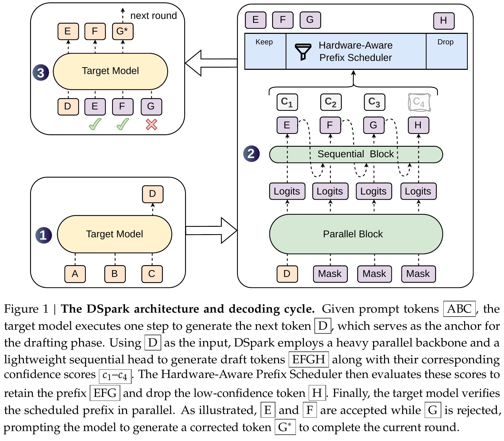
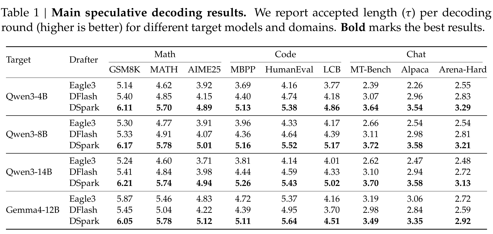
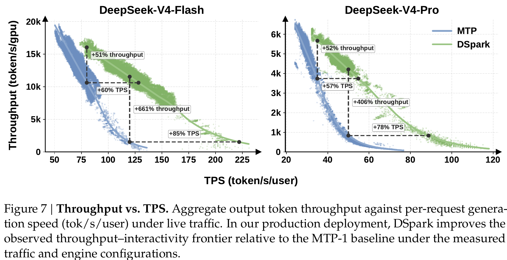
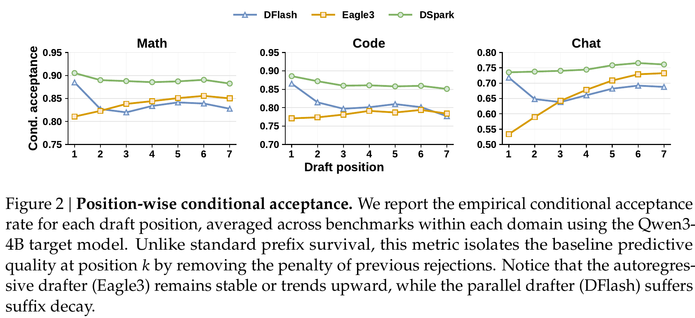
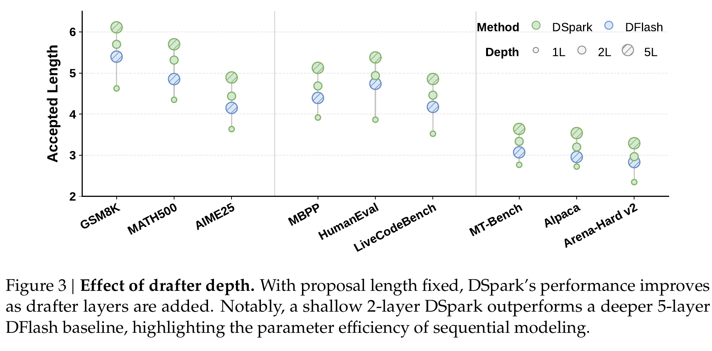
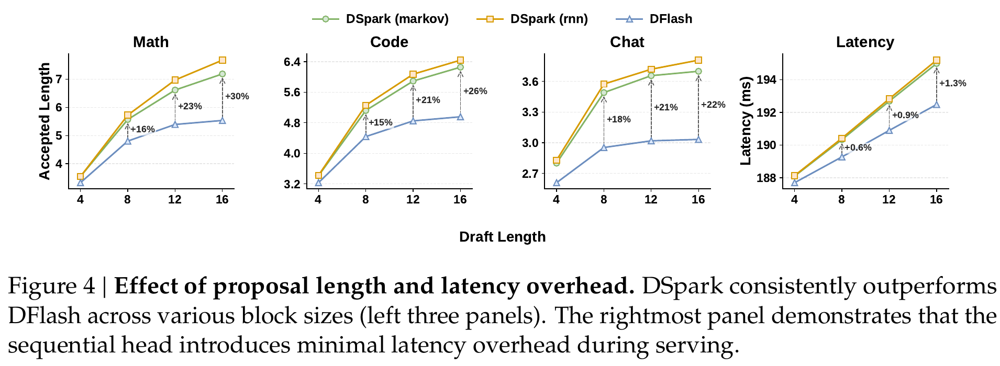
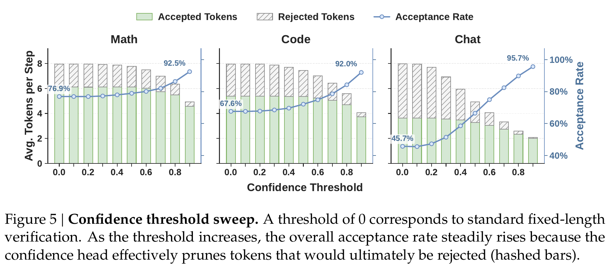
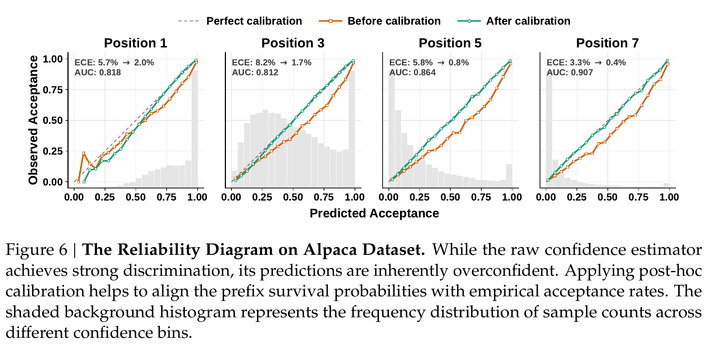
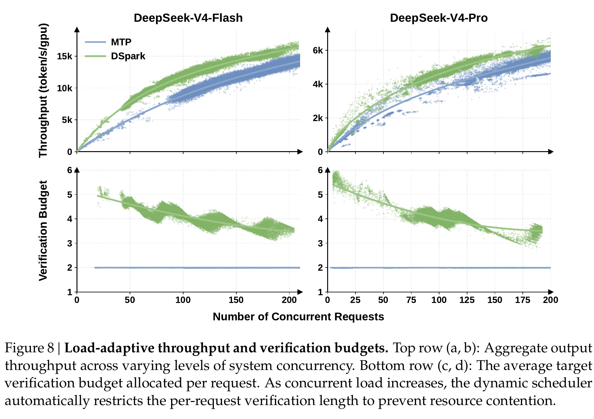

# DSpark：置信度调度的半自回归推测解码——隔离精读

> [!info] 文档关系
> - 文档类型：Paper
> - 领域入口：[README](../README.md)
> - 上位汇总：[Evolution](../surveys/evolution.md)
> - 证据资产：`../assets/papers/dspark/`
> - 相关文档：[Figure inventory](../evidence/figure-inventory.md)

> 资料状态：已取得官方 arXiv:2607.05147v1 PDF、LaTeX/source、官方 DeepSpec 代码与公开 checkpoint metadata/config。本文中的 Figure/Table 均为 300-DPI 论文页紧裁剪并包含完整 caption；没有把搜索摘要当作技术证据。论文材料审计日期为 2026-07-25；vLLM、vLLM-Ascend 与 SGLang 社区实现增量审计日期为 2026-07-27；DSpark 发布后算法工作与待验证组合增量审计日期为 2026-07-28。

## 修订信息

- 当前文档版本：`1.4.0`
- 当前修订 ID：`rev-dspark-20260728-algorithm-evolution`
- 当前修订时间：`2026-07-28T18:30:00+08:00`
- 替代版本：`rev-dspark-20260727-two-step-relay-clarification` / `1.3.0` / canonical Markdown SHA-256 `303b7d9653fe8943b91ac5d84de474a8969a4799d9df3e161b14d1c0d7d3155a`

| 修订 ID | 文档版本 | 时间 | 修订者 | 类型 | 替代修订 | 迁移问题/解析 | 变更摘要 | 原因 | 影响位置 | 依据 | 对结论影响 |
|---|---|---|---|---|---|---|---|---|---|---|---|
| `rev-dspark-20260725-initial` | 1.0.0 | 2026-07-25T15:27:51+08:00 | delegated agent `dspark-b1` | initial | none | none | 从官方论文、源码、代码、checkpoint 与逐图 QA 建立首个可验证交付 | B1 单篇隔离精读任务 | 本文全部章节及本 workspace artifacts | `task_packet.yaml`、官方 arXiv/source/DeepSpec/HF metadata、最终验证 | material：纠正“无 arXiv/source”的过时结论并重建证据边界 |
| `rev-dspark-20260725-validation-results` | 1.0.1 | 2026-07-25T15:43:25+08:00 | delegated agent `dspark-b1` | evidence-update | `rev-dspark-20260725-initial` / 1.0.0 / `bf5f71546073bdfbcd87a7d8a86bdc1353b45ecddabca3ef2717874b8c7142e4` | none | 补齐独立 `validation_results.json` 并更新冻结交付的验证、handoff、checklist 与 hashes | 父任务复核发现 process workspace 缺少 contract 要求的独立验证结果文件 | 修订信息；`validation_results.json`；`agent_handoff.md`；`review_checklist.md`；manifests | 父任务补件要求；Draft 2020-12 与 15 项语义验证重跑 | none：不改变论文事实、证据判断或综合结论 |
| `rev-dspark-20260727-community-adoption` | 1.1.0 | 2026-07-27T17:07:11+08:00 | Codex | evidence-update | `rev-dspark-20260725-validation-results` / 1.0.1 / `20729e2f2c00698e55757257df07a0f768cd0c9c87baf0bac9bfd81cdecd2c42` | none | 增补 vLLM / vLLM-Ascend 接入状态，核对 Markov、Confidence、FullGraph 与吞吐归因 | 社区实现已快速演进，需要区分“DSpark 基础路径已接入”与“Confidence 调度仍未进入正式闭环” | §5.4–5.5、§8.5–8.6、§9.2、§10–12 | 官方 release、合入/开放 PR、RFC、固定 commit 源码审计 | material：确认社区已将 Markov 高接受率通过图执行转化为吞吐，但否定“Confidence 已使能并贡献吞吐”的表述 |
| `rev-dspark-20260727-sglang-adoption` | 1.2.0 | 2026-07-27T17:16:27+08:00 | Codex | evidence-update | `rev-dspark-20260727-community-adoption` / 1.1.0 / canonical Markdown `d52b88359775c54a8a55d68d2619d57b4977709361529cbaeaa97b1e62de234b` | none | 增补 SGLang 已发布的 Confidence/STS/SPS/ragged verify/ZOS 完整路径及受控吞吐证据 | SGLang v0.5.16 的能力边界不同于 vLLM/vLLM-Ascend，需修正“社区 Confidence 后半闭环均未落地”的过度概括 | §5.4–5.5、§8.6、§9.2、§10–12 | SGLang v0.5.16、合入 PR、固定 main 源码与官方工程博文 | material：确认 SGLang 已公开实现并验证 Confidence 调度到吞吐的闭环，同时保留默认关闭和 SPS 表前置条件 |
| `rev-dspark-20260727-two-step-relay-clarification` | 1.3.0 | 2026-07-27T19:00:03+08:00 | Codex | clarification | `rev-dspark-20260727-sglang-adoption` / 1.2.0 / canonical Markdown `0635f1971edd31f6dc63edacf46c62aed422f70ec25489afa9c00a3f78d33f9a` | none | 澄清论文 production adaptation 与 SGLang 两步延迟 Confidence relay 的关系、时序和正确性边界，并修正“高并发前移”的含糊表述 | 原文容易被误读为额外执行两步模型，或把 ZOS 整体 1.5×收益归因给 relay 单项 | §0.1.1、§2.4、§5.2、§5.4、§8.6、§10 | 论文 `infra.tex`；SGLang 官方工程博文与合入 PR #30261 | none：不改变社区接入与吞吐结论，只提高机制和归因表述精度 |
| `rev-dspark-20260728-algorithm-evolution` | 1.4.0 | 2026-07-28T18:30:00+08:00 | Codex | content-update | `rev-dspark-20260727-two-step-relay-clarification` / 1.3.0 / canonical Markdown `303b7d9653fe8943b91ac5d84de474a8969a4799d9df3e161b14d1c0d7d3155a` | none | 增补 DeLS-Spec 对 DSpark 发布资产的直接算法增量，并把 loss、tree、feature fusion、动态融合等组合拆成可证伪实验假设 | 用户要求独立算法工作单独交付，其他方案先落入 DSpark 交付件阐释 | §6、§10.3、§11–12 | DeLS-Spec arXiv:2607.07409v1、官方源码/代码、Table 2；相关工作机制边界 | material：确认一个发布后直接算法增量，同时阻止把前置工作或未实验组合误写成已验证演进 |

## 0. 资料与配图索引

- 论文：`paper.pdf`，SHA-256 `522036b0cc16ad4678bd7c278dd0a0ab4da31170af7b97c2041067cc09a8289a`。
- 官方元数据：`source_metadata/arxiv-2607.05147.atom`；arXiv v1 发布于 2026-07-06。因而“目前无 arXiv/source”在 2026-07-25 已为假，详见 `source_audit.md`。
- LaTeX/source：`source/2607.05147.tar`，SHA-256 `af76c83cc22868e2aeaea613c1d4dea4635922d48b185d042e4e20ba794e2859`；解包文件在 `source/`。
- 开源代码：`https://github.com/deepseek-ai/DeepSpec.git`，commit `005e03b81cec38b7da6399833d609ee89a2587f2`；本地 `code/DeepSpec/`。
- OpenReview：未发现公开页面、评审、decision 或 rebuttal；审计见 过程侧公开评审记录。
- 提取文本：`extracted_text/extracted_text/full_text.clean.txt` 与逐页文本；首次路径错误后已成功重跑。
- 图表清单与裁剪坐标：[Figure inventory](../evidence/figure-inventory.md)。计数为 2 张机制图 + 7 张结果/系统图 = 9，缺失类型为 none。
- 联系表：`figures/contact-sheet.png`；每张 crop 均另行以原分辨率检查。
- AI 生成分析图：未生成。虽有 API key，但已安装 CLI 不提供规范强制的 `responses-doc --input-file analysis.md`；禁止用普通 prompt 替代。

关键证据图：

- Figure 1：`../assets/papers/dspark/fig1-architecture-caption.png`
- Table 1：`../assets/papers/dspark/table1-main-results-caption.png`
- Figure 2–8：`../assets/papers/dspark/fig2-conditional-acceptance-caption.png` 至 `../assets/papers/dspark/fig8-load-adaptive-caption.png`

## 0.1 术语与符号解释

### 0.1.1 术语表

| 术语 | 本文特定含义 | 别名 | 不等于/易混项 | 来源 |
|---|---|---|---|---|
| target model | 冻结的大模型，既提供 target features/训练分布，又在推理时并行验证草稿 | verifier | 不是 drafter；“target-generated bonus token”计入论文的 accepted length | §3–4、`source/sections/exp.tex:27` |
| drafter | 生成候选 token block 的小模型 | draft model | 不执行最终分布校正 | §3 |
| parallel backbone | 一次前向并行产生 $\gamma$ 个 hidden/base-logit 位置的 DFlash 风格主干 | heavy backbone | 不表示 token 间已条件化 | §4.1、`modeling.py:361-386` |
| semi-autoregressive | 主干并行、输出修正/采样串行；局部 softmax 仍按 token 精确归一化 | semi-AR | 既非完整 AR drafter，也非全局归一化 CRF/NAT | §4.2、Eq. sequential factorization |
| Markov head | 用上一个已采样 token 的 rank-256 embedding 产生词表 bias 的一阶顺序头 | vanilla Markov | 不保留更早 prefix state | `markov_head.py:8-90` |
| RNN head | 在 block 内携带 recurrent state 的替代顺序头 | recurrent correction | 非默认 Table 1 checkpoint | `markov_head.py:125-284` |
| suffix decay | 并行 drafter 后续位置的条件接受率随位置下降 | tail decay | 不等于 prefix survival 的自然连乘下降；Figure 2 用条件率隔离前序拒绝 | Figure 2、§5.2 |
| conditional acceptance | 在前面 draft tokens 全被接受的条件下，第 $k$ 个 token 被接受的概率/估计 | per-step acceptance | 不等于累计 prefix survival | Eq. confidence、Figure 2 |
| prefix survival | 前 $j$ 个 token 全通过验证的概率 $a_{r,j}$ | cumulative acceptance | 不等于单步 $c_{r,j}$ | Algorithm 1 |
| confidence head | 预测 soft conditional acceptance label 的线性头 | accept-rate predictor | 不是二元 correctness 分类器；target 是分布重叠而非一次采样标签 | Eq. acceptance、`loss.py:60-70,146-163` |
| STS | 从左到右校准累计 survival product 的 Sequential Temperature Scaling | post-hoc calibration | 公开 DeepSpec 中未找到其部署实现 | §4.3、Figure 6 |
| verification budget | 每轮送入 target 的请求 anchor + 被选 draft token 数 | batch capacity | 不是 GPU 显存预算或训练 batch size | Algorithm 1、Figure 8 |
| SPS curve | target engine 在 token batch size $B$ 下的 steps/s profile | capacity curve | 不是 tokens/s；论文把其与期望接受 token 数相乘 | §4.3 |
| hardware-aware prefix scheduler | 跨请求按 survival 排序并结合 SPS 选择各 prefix 长度 | global scheduler | 不是 DeepSpec evaluator 的单请求固定阈值 | Algorithm 1、`draft_ops.py:82-153` |
| non-anticipating | 调度决定不能依赖尚未实例化的未来 candidate token | causal admission | 不只是“在线”或低延迟；关系到 target 分布无偏恢复 | Appendix counterexample、§4.3 |
| two-step Confidence relay | 在 overlap/ZOS 流水线中异步转交 Confidence；第 $t$ 轮 forward 产生的分数不阻塞主机，而由调度侧在第 $t+2$ 轮读取 | two-step-back relay | 不是额外执行两次 drafter/target，也不表示旧分数直接替代当前候选排序；论文 production adaptation 与 SGLang relay 实现需分开理解 | 论文 `infra.tex`；[SGLang 工程博文](https://www.lmsys.org/blog/2026-07-06-dspark-sglang/)；[PR #30261](https://github.com/sgl-project/sglang/pull/30261) |
| accepted length $\tau$ | 每次 decoding round 平均产出的 accepted draft + target bonus token 数 | tokens/round | 不是接受率；论文 footnote 明确含 bonus token | Table 1 |
| matched throughput | 两系统在近似相同 aggregate throughput 点比较 per-user speed | capacity-matched | 不等于相同 SLA anchor | Figure 7 |
| live frontier | 在特定流量/engine 配置下观测的 throughput–interactivity Pareto 边界 | serving frontier | 不是跨硬件、跨流量分布的普适 frontier | Figure 7 |
| MTP-1 | DeepSeek-V4 先前生产草拟基线，每轮一枚 MTP draft token | production baseline | 不是 Eagle3 或 DFlash | `infra.tex:56-59` |
| Open-PerfectBlend | 1.3M prompts；响应由各 target 以 non-thinking 模式重新生成 | training prompt source | 不等于原数据响应直接训练 | `exp.tex:15-18`、README |

### 0.1.2 符号表

| 符号 | 含义 | 性质 | 作用域 | 单位/取值 | 来源 | 易混点 |
|---|---|---|---|---|---|---|
| $L$ | 推测解码每输出 token 延迟 | author-defined | round | seconds/token | Architecture Eq. latency | 与 loss $\mathcal L$ 不同 |
| $T_{\rm draft},T_{\rm verify}$ | 草拟、target 验证用时 | author-defined | round | seconds | `arch.tex:3-5` | production 还含调度/通信但式中合并 |
| $\gamma$ | 最大 draft token 数/block size | author-defined/config-defined | model/round | integer；offline 7，production 5 | §4、configs | 论文个别“proposal length + anchor”措辞需谨慎 |
| $\tau$ | 每轮期望/经验 accepted length（含 bonus） | author-defined | request/batch | tokens/round | Table 1、Algorithm 1 | 单请求指标与 batch 总期望在文中复用 |
| $X=(x_1,\ldots,x_\gamma)$ | draft block | author-defined | request | tokens | Eq. factorization | $x_0$ 是 anchor |
| $x_0,x_k,x_{<k}$ | anchor、第 $k$ token、block prefix | author-defined | token | vocab IDs | §4.2 | 不含 prompt 全历史的显式符号 |
| $U_k(v)$ | 并行主干在位置 $k$ 对词 $v$ 的 base logit | author-defined | token/vocab | logit | Eq. factorization | 尚未加顺序 bias |
| $B_k(\cdot)$ | 顺序头对词表 logits 的 prefix-dependent bias | author-defined | token/vocab | logit | Eq. factorization | 与 batch size $B$ 同字母复用 |
| $p_k,p_k^d,p_k^t$ | 条件 draft 分布、draft/target 分布 | author-defined | token/vocab | probability simplex | Eqs. factorization/acceptance | $p_k$ 已含顺序修正 |
| $u,v$ | softmax 分母枚举词与被评分词 | author-defined | vocab | token symbols | Eq. factorization | 不是向量 |
| $\mathcal V,V$ | 词表集合与大小 | author-defined | model | tokens | Eq. factorization/Markov | $V$ 非 value |
| $W_1,W_2$ | token→rank embedding 与 rank→vocab projection | author/code-defined | model | matrices | Eq. Markov、`markov_head.py:17-24` | 论文 RNN 式写 $W_2^\top$，代码 Linear 的存储方向不同但算子一致 |
| $r$ | Markov/RNN latent rank | author/config-defined | model | 256 default | Eq. Markov、config | 不等于 request index $r$ |
| $h_k,d$ | 主干 hidden state 及宽度 | author-defined | token/model | vector/dimension | Eq. confidence/RNN | Qwen3-4B config $d=2560$ |
| $s_k,z_k$ | RNN state 与拼接输入 | author-defined | token | $\mathbb R^r,\mathbb R^{2r+d}$ | Eq. RNN | 默认 Markov 不使用 |
| $W_g,W_c,W_o$ | RNN gate/candidate/output projections | author/code-defined | model | matrices | Eq. RNN | 代码合并为 `joint_proj` |
| $c_k,c_k^*$ | 预测条件接受概率与 soft target | author/code-defined | token | $(0,1),[0,1]$ | Eqs. confidence/acceptance | $c_k^*$ 是分布 overlap，不是 hard label |
| $w$ | confidence linear head 的权重向量 | author-defined | model | vector | Eq. confidence | 与位置权重 $w_k$ 不同 |
| $R,r$ | active request 数与 request 索引 | author-defined | batch/request | integer/index | Algorithm 1 | $r$ 同时被用作 low-rank 维度；按上下文区分 |
| $a_{r,j}$ | request $r$ 第 $j$ prefix survival | author-defined | request/token | $[0,1]$ | Algorithm 1 | 是 $c$ 的累计乘积 |
| $\ell_r$ | request $r$ 被调度的 draft prefix 长度 | author-defined | request | $0\ldots\gamma$ | Algorithm 1 | 不含 anchor |
| $B$ | target verification token batch size | author-defined | batch | tokens/step | Algorithm 1 | 与 logit bias $B_k$ 字母复用 |
| ${\rm SPS}(B)$ | profile 的 engine step rate | author-defined | batch | steps/s | Algorithm 1 | 非 token throughput |
| $\Theta$ | 期望系统 token throughput | author-defined | batch | tokens/s | Algorithm 1 | $\tau$ 此处是 batch 总期望 |
| $w_k$ | 第 $k$ draft 位置训练权重 | author/code-defined | token | $\exp(-(k-1)/\gamma_{\rm loss})$ | Training、`loss.py:25-37` | 代码 decay 参数名也是 gamma，但默认 4，不同于 block 7 |
| $\gamma_{\rm loss}$ | 位置 loss 衰减尺度 | analysis-qualified/code-defined | training | positive scalar；config 4.0 | `loss.py:30-36`、config | 为消除论文/代码把它也叫 gamma 的歧义而加下标；不是 block size |
| $\mathcal L_{\rm ce},\mathcal L_{\rm tv},\mathcal L_{\rm conf}$ | CE、L1 distribution match、confidence BCE | author/code-defined | training | scalar | §4.4、`loss.py` | 代码名 `l1_loss`；论文称 TV loss |
| $S,L_{\rm layer},n_{\rm kv},d_{\rm head},b$ | sequence length、层数、KV heads、head dim、每元素字节 | analysis-derived | infra | mixed | §8 derivation | 不是论文测量值 |
| ${\rm BytesMoved},t,P_{\rm peak}$ | 搬运字节、运行时间、峰值带宽 | analysis-derived | infra | bytes,s,bytes/s | §8 derivation | 源材料未给数值，不能计算利用率 |

## 1. 论文基本信息

- 标题：*DSpark: Confidence-Scheduled Speculative Decoding with Semi-Autoregressive Generation*。
- 类型：arXiv v1 technical report，非已识别 OpenReview venue paper。
- 研究领域：LLM lossless speculative decoding；drafter architecture；高并发 serving scheduling。
- 核心问题：长 block 并行草拟会 suffix decay；长 block 固定验证又会在高负载下浪费 target batch capacity。
- 目标：在不改变 target 分布的条件下，同时提高候选质量/accepted length 与系统负载下的 verification utility。
- 关键假设：target verification 能并行；SPS 主要由 verification token batch $B$ 决定；prefix survival 可校准；离线早停的全局最优还要求 $\Theta$ 沿 admission path 单峰。

## 2. 研究动机与问题—方案闭环

### 2.1 出发点与背景痛点

作者明确从延迟分解 $L=(T_{\rm draft}+T_{\rm verify})/\tau$ 出发：自回归 drafter 往往有较好 $\tau$，但其草拟延迟随 $\gamma$ 线性增加；并行 drafter 把主干压成单次前向，却因为 block 内各位置独立而牺牲后缀一致性。更长草稿还引入第二层系统矛盾：在高并发 target 已接近容量上限时，低成功率 token 占用的 batch slot 有明显机会成本。（author-stated，`arch.tex:3-12,99-105`）

这不是单一“模型精度”问题，而是两个串联环节：先决定可供验证的候选质量，再决定哪些候选值得送入 target。若只提高前者，固定验证仍可能把增大的 block 变成额外吞吐负担；若只做阈值裁剪，又会丢掉轻载时本可低成本验证的候选。

### 2.2 现有方案为何不够

并行位置没有条件于实际采样的前序 token。当上下文存在多种合理 continuation 时，各位置的 marginal choice 可能拼成不一致模式；Figure 2 的 DFlash 曲线随 draft 位置下滑，是这一根因的机制证据。完整 AR 可消除该依赖缺口，却把昂贵 drafter backbone 也串行化。

固定长度或静态 confidence threshold 的根因缺陷则是忽略负载相关机会成本。同一枚低 confidence token 在 target 空闲时几乎“免费”，在拥塞时会挤掉其他请求。阈值只看 token quality；DSpark 要优化的是 $a_{r,j}$ 与硬件 SPS 曲线共同决定的 $\Theta$。（author-stated）

另外，简单的事后全局搜索会破坏 lossless 所需的 non-anticipating 性质，因为下一位置 confidence 需要已实例化的当前 token。Appendix 给出反例：retrospective selection 可把 target 的 $0.7/0.3$ 输出改成 $0.85/0.15$。所以“看完整个 block 再挑最好 prefix”不是合法替代。（author-stated/theoretical counterexample）

### 2.3 目标问题与成功标准

- 模型目标：保持一次并行 backbone 的容量优势，同时用极轻顺序模块降低 suffix decay。
- 调度目标：按请求选择 $\ell_r$，最大化 $\Theta=\tau\,{\rm SPS}(B)$，且保持 non-anticipating/lossless。
- 离线成功指标：accepted length $\tau$、position-wise conditional acceptance、额外 round latency。
- estimator 成功指标：threshold sweep 的拒绝 token 过滤、ROC-AUC、ECE/STS 校准。
- 生产成功指标：aggregate throughput–per-user TPS frontier，以及 concurrency 变化下的 verification budget。
- 不解决：首个整块并行草拟的固定成本；难 query 的 draft early-exit；跨硬件/跨流量普适性；公开复现 V4 production scheduler。

### 2.4 核心方案如何解决并优化问题

| 失败模式 | 根因/约束 | 设计 | 改变的变量/行为 | 因果机制 | 预期指标 | 证据 | 判断 |
|---|---|---|---|---|---|---|---|
| parallel suffix decay | positions 不见实际 sampled prefix | Markov/RNN sequential head | $U_k\to U_k+B_k$ | 用前一 token/状态重排 logits | conditional acceptance、$\tau$ | Figs. 2–4、code | supported |
| full AR drafter 太慢 | backbone 被重复 $\gamma$ 次 | heavy parallel + light serial | 大计算并行、只把低秩头串行 | 让 $T_{\rm sequential}\ll T_{\rm parallel}$ | round latency | Fig. 4 | partial：只测 batch128 |
| blind full-block verification | suffix survival 低且域间差异大 | confidence head | 输出 $c_k$, $a_{r,j}$ | 估计多送一 token 的期望收益 | acceptance/filtering | Fig. 5、loss code | supported for discrimination |
| raw confidence overconfident | $\prod c_i$ 误差累积 | STS | 校正 cumulative products | 次序保持同时修正绝对概率 | ECE | Fig. 6 | partial：Alpaca-only、code unavailable |
| static threshold 不感知负载 | token 的机会成本随 SPS 变化 | global prefix scheduler | $\ell_r,B$ 随 load 变化 | 选最大 $a$ 的合法 prefix，并查 SPS | $\Theta$、frontier | Figs. 7–8 | confounded production evidence |
| retrospective search 有 selection bias | future candidate 参与当前 admission | causal early stop / delayed production adaptation | 决策只用已可见信息 | 保持 non-anticipating | target distribution | Appendix | theory-supported；单峰最优有条件 |
| 非平滑 production SPS | offline early stop 可能停在局部峰 | 两步旧 confidence 只估 dynamic top-K capacity，当前 confidence 做 rank | capacity planning 与 ranking 分离 | 避免用历史预测 early-stop，同时保持当前决策因果 | production robustness | `infra.tex` | paper-reported，未开源 |

这里的“两步”是 **decode iteration 的流水线距离**，不是多执行两次模型。按 SGLang 对该机制的公开描述，第 $t$ 轮 GPU forward 产生 Confidence 后，通过异步通道向调度侧 relay；为了不让 CPU 等待当前 GPU 结果并打断 overlap，调度器在第 $t+2$ 轮读取这份分数。论文的 production adaptation 又把决策拆成两层：两步旧 Confidence 只用于估计当前负载可承受的 dynamic top-K 总容量，当前 Confidence 用于候选排名。因此“旧分数定容量”和“当前分数排谁”不是同一件事。

这个延迟可能让容量预测在负载突变时不够及时，影响的是窗口选择是否最优和吞吐效率；候选仍由 target model 验证，因此它不等于放松 speculative decoding 的正确性约束。SGLang 报告的 decode loop 约 1.5× 更紧凑来自 **整个 overlap scheduler 开/关对比**，其中还包含异步 future、device-side barrier、page table 和多阶段重叠，不能归因成 two-step relay 单项带来 1.5×。

### 2.5 完整因果链与证据闭环

背景触发是高并发 LLM serving 希望减少每 token target 调用；可观察痛点是并行长草稿后缀质量下降、固定长验证占用容量；根因分别是 block 内 independence 和 verification opportunity cost 随负载变化。DSpark 先以低秩顺序修正改变每位置条件分布，Figure 2/3/4 直接显示 conditional acceptance、depth trade-off 与长 block 增益；再用 distribution-overlap confidence 和 STS 估计累计 survival，最后以 SPS profile 把 verification budget 分配给期望收益更高的 prefix。Figure 5/6 支持 estimator 的 discrimination/calibration；Figure 7/8 显示整套生产部署的 frontier/budget 行为。

闭环并非全部同强度。模型侧“顺序依赖→更稳定后缀→更长 accepted length”的链条有较直接的受控证据。调度侧只有 estimator diagnostics 加整套生产系统相对 MTP-1 的联合结果，缺少 scheduler-only、STS-only、kernel-only 或 raw trace 重放；所以“全系统 frontier 外移”可接受为特定部署下的直接观测，“由 scheduler 单独造成”则是 confounded。单峰 SPS 下的 offline global-optimal claim 有条件，production adaptation 的正确性/最优性没有公开代码和独立 proof。

## 3. 核心贡献与创新点

1. 半自回归 drafter：保留并行 DFlash backbone，仅把低秩 transition correction 和采样顺序化；对应 Figure 2–4 与开源代码。
2. soft acceptance estimator：以 $1-\frac12\|p_d-p_t\|_1$ 监督 conditional confidence，再校准累计 survival；对应 Figure 5–6。
3. 把 verification length 形式化为跨请求 $\Theta=\tau{\rm SPS}(B)$ 优化，并显式处理 lossless/non-anticipating 限制；对应 Algorithm 1 与 Appendix。
4. 给出 DeepSeek-V4 live-traffic production integration 与 frontier/budget 曲线；这是系统价值证据，但 attribution 是联合部署级别。
5. 发布 DeepSpec、离线比较 checkpoint 和 V4 DSpark checkpoint；不过生产 scheduler/kernel/telemetry 未随 DeepSpec 发布。

## 4. 研究方法

### 4.1 方法总览

每轮先由 target 产生 anchor $x_0$。并行 backbone 一次产生 $\gamma$ 个 $h_k,U_k$；顺序头从左到右根据已采样 prefix 修正 logits 并采 token，同时 confidence head 输出 $c_k$。scheduler 在 active requests 间选择每个 $\ell_r$，target 对 anchor + selected prefix 并行验证，接受连续 prefix，并在首个拒绝处用 target correction 结束该轮。

训练/离线评估、生产部署必须分开：DeepSpec 开源的是前者及单请求固定阈值 proposal；论文的多请求 global scheduler、STS production path 与 V4 kernels 不在 repo。

### 4.2 组件级设计动机与具体问题映射

| 设计项 | why 状态 | 具体问题 | 因果机制 | 替代/权衡 | 验证 | 判断 |
|---|---|---|---|---|---|---|
| anchor 也作为首预测位置 | author-stated | DFlash 的 anchor+mask 有额外计算 | $\gamma$ inputs 产生 $\gamma$ logits | 原 DFlash layout 更直接 | 论文称质量相近，无独立 ablation | plausible/unverified |
| parallel backbone | author-stated | AR backbone latency $O(\gamma)$ | 一次 forward 提供强首 token capacity | shallow AR 更便宜但首位弱 | Fig. 2 首位对比 | supported |
| rank-256 Markov head | author-stated | independent suffix collision | previous token embedding 产生 vocab bias | full $V^2$ 不可承受；RNN 更强但复杂 | Fig. 3/4、code | supported；rank 值无 sweep |
| RNN head | author-stated | Markov 只看一步 | recurrent state 累积 prefix | 额外实现/串行复杂度 | Fig. 4 仅长 block 小增益 | partially supported |
| distribution L1 loss | inferred from objective | CE 只拟合 observed token，不直接贴 target distribution | 最小化 draft-target distribution distance | KL/JS 未比较 | config/code；无 loss ablation | plausible |
| soft confidence target | author-stated | hard accept sample 高方差且 scheduler 要概率 | target/draft overlap 等于标准 SD 的一步期望接受概率 | hard labels、rank-only score | Fig. 5、code | supported for discrimination |
| STS | author-stated | cumulative confidence overconfidence | 顺序校准各 prefix product | isotonic/vector calibration 未比 | Fig. 6 Alpaca | partial |
| global sorting | author-stated | batch budget应跨请求分配 | 固定 $B$ 时取最大 marginal survival | per-request threshold 忽视相对价值 | derivation；无 offline trace oracle | conditional theory |
| early stop | author-stated | future-token leakage | throughput 首次下降即停止 | 可保因果但单峰外非全局最优 | Appendix counterexample | correctness motivation supported |
| production two-step-old top-K capacity | author-stated | async pipeline 与 jagged SPS | stale scores 只定 capacity，current scores 排名 | 更复杂、可能预测偏差 | live curves only | confounded |
| hidden-state communication | author-stated | 跨 stage 传 $V$-logits 太贵 | 传 $d$-hidden，worker local LM head | 重复 LM head compute/memory | production description only | plausible |
| variable-query kernels | author-stated | 不同 $\ell_r$ 破坏定长 kernels/graph | flatten tokens + marker/index attention | padding 简单但浪费 | production description only | unverified publicly |

### 4.3 模型与调度公式

半自回归分布：

$$
P(X\mid x_0)=\prod_{k=1}^{\gamma}p_k(x_k\mid x_0,x_{<k}),\qquad
p_k(v)=\frac{\exp(U_k(v)+B_k(x_0,x_{<k},v))}
{\sum_{u\in\mathcal V}\exp(U_k(u)+B_k(x_0,x_{<k},u))}.
$$

默认 Markov 修正：

$$
B(x_{k-1},\cdot)=W_1[x_{k-1}]W_2\in\mathbb R^V,\qquad r=256.
$$

RNN alternative：

$$
z_k=[s_{k-1};W_1[x_{k-1}];h_k],
$$

$$
s_k=\sigma(W_gz_k)\odot s_{k-1}+
(1-\sigma(W_gz_k))\odot\tanh(W_cz_k),\qquad
B_k=W_2^\top\tanh(W_oz_k).
$$

confidence 及 soft label：

$$
c_k=\sigma\!\left(w^\top[h_k;W_1[x_{k-1}]]\right),\qquad
c_k^*=1-\frac12\|p_k^d-p_k^t\|_1.
$$

标准 speculative rejection sampling 下，$c_k^*$ 是两分布重叠质量，因此有明确概率意义。累计 prefix survival 为：

$$
a_{r,j}=\prod_{i=1}^{j}c_{r,i}.
$$

调度目标：

$$
B=\sum_{r=1}^{R}(1+\ell_r),\qquad
\tau=\sum_{r=1}^{R}\left(1+\sum_{j=1}^{\ell_r}a_{r,j}\right),\qquad
\Theta=\tau\,{\rm SPS}(B).
$$

固定 $B$ 时，按 $a_{r,j}$ 降序选 token 且 prefix 单调性自动保持；沿这个 admission path 找 $B$。论文 Algorithm 1 首次 $\Theta$ 不增即停止，这只在 objective 单峰时给 global maximum；这是结论必须保留的条件。

### 4.4 训练目标

位置衰减权重为 $w_k=\exp(-(k-1)/\gamma_{\rm loss})$；开源 config 中 `loss_decay_gamma=4.0`，不要与 block size 7 混为一谈。

$$
\mathcal L_{\rm ce}=-\sum_kw_k\log p_k^d(x_k^*),
$$

$$
\mathcal L_{\rm tv}=\sum_kw_k\|p_k^d-p_k^t\|_1,
$$

$$
\mathcal L_{\rm conf}=-\sum_kw_k[c_k^*\log c_k+(1-c_k^*)\log(1-c_k)],
$$

$$
\mathcal L=0.1\mathcal L_{\rm ce}+0.9\mathcal L_{\rm tv}+1.0\mathcal L_{\rm conf}.
$$

代码 `loss.py:25-37,60-70,73-87,146-163,227-252` 与此一致。target frozen；embedding/LM head 从 target 复制并冻结；训练 drafter、sequential block、confidence head。论文未给 CE/L1/confidence 单项消融，因此系数选择的因果贡献未验证。

### 4.5 数据、baseline、公平性和 checkpoint

- 四个 target：Qwen3-4B/8B/14B、Gemma4-12B。
- 三个 drafter：Eagle3（1 layer, TTT horizon 7）、DFlash（5 layers, block 7）、DSpark（5 layers, block 7），相同 target feature layers、framework、data，并重训。
- 训练 prompts：Open-PerfectBlend 1.3M；chat/math/code/instruction 占 17.6/39.4/38.9/4.1%；各 target 以推荐 sampling、non-thinking 模式重生成 responses；10 epochs。
- 九个 benchmark：GSM8K/MATH500/AIME25；MBPP/HumanEval/LiveCodeBench；MT-Bench/Alpaca/Arena-Hard-v2。
- evaluation temperature 1.0，chain-based drafting，accepted length 含 target bonus。
- HF metadata 证实 Qwen3-4B DSpark/DFlash 共享 5 layers、block 7、target feature layers，但 DSpark 1.393B draft params、DFlash 1.315B，约多 5.9%；不是 parameter-matched。Eagle3 为 0.927B。详见 `checkpoint_audit.md`。

## 5. 关键结论与技术主张证据矩阵

### 5.1 主结果

Table 1 的 4 targets × 9 benchmarks 共 36 个 cell，DSpark 都是三者中最高。论文报告相对 macro-average：对 Eagle3，Qwen3-4B/8B/14B 分别 +30.9%/+26.7%/+30.0%；对 DFlash 分别 +16.3%/+18.4%/+18.3%。这是 fixed block、禁用 confidence scheduler 的离线结果，所以主要支持 drafter quality，不支持 production scheduler。

V4-Flash：80 tok/s/user SLA 下 aggregate throughput +51%；120 的边界 regime 名义 +661%；matched throughput 下 per-user speed +60%–85%。V4-Pro：35 下 +52%；50 的边界 regime 名义 +406%；matched capacity 下 +57%–78%。作者自己正确提醒 661%/406% 主要表示 MTP-1 在严格 SLA 下退化，不应当当作一般倍率。

### 5.2 消融和机制证据

| 技术点 | 声称收益 | 实验 | 控制 | 结果 | 强度 | 判断 |
|---|---|---|---|---|---|---|
| sequential dependency | 降 suffix decay | Fig. 2 条件接受率 | 同 target/domain；架构容量不完全同 | DSpark 首位高且 tail 稳 | mechanism visualization | supported |
| head 比加深 parallel 更有效 | 参数效率 | Fig. 3 depth sweep vs 5-layer DFlash | block fixed；参数仍非严格 matched | 2-layer DSpark 超 5-layer DFlash | replacement/depth sweep | fairly direct |
| 长 block 扩大 DSpark 优势 | tail dependency 价值随长度增 | Fig. 4 | depth fixed 5 | $\gamma=7$: +16/+15/+18%；$\gamma=15$: +30/+26/+22%（math/code/chat） | sensitivity | supported |
| serial head latency 小 | 保留 parallel speed | Fig. 4 right | batch128、context 512–4096 均值 | full-round +0.2%–1.3% | measured, narrow setting | partial |
| confidence 可过滤低价值 token | 更高 overall acceptance | Fig. 5 threshold sweep | Qwen3-4B；threshold 改变 token 数 | math 76.9→92.5%、code 67.6→92.0%、chat 45.7→95.7% | diagnostic | discrimination supported；不等于 throughput |
| STS 校准 survival | ECE 降低 | Fig. 6 Alpaca | raw vs post-hoc | AUC 0.81–0.90；ECE 3–8%→约1% | post-hoc calibration | dataset-limited |
| scheduler 随 load 缩预算 | 避免 batch contention | Fig. 8 | DSpark whole system vs MTP-1 | budget 随 concurrency 降、throughput 较优 | confounded live observation | system behavior supported，scheduler-only unproven |
| production frontier 外移 | 更高 throughput/interactivity | Fig. 7 | live traffic, different full stack | 数字见 §5.1 | end-to-end | configuration-specific direct result |
| loss coefficients/Markov rank | 最优训练组合 | none | none | none | code-only | unverified |
| two-step capacity adaptation / relay | jagged SPS 下稳健且不阻塞 overlap | 论文 production description；SGLang 公开 relay 实现与 overlap trace | 无 relay-only ablation；论文 production 实现未开源；社区实现不证明与论文私有栈完全等价 | overlap on 时 decode loop 约紧凑 1.5×，但这是整条 runtime 路径的联合结果 | 论文机制未独立验证；SGLang 工程路径已公开，单项收益仍不可归因 |

### 5.3 是否验证了假设

模型假设得到较完整验证：独立并行 suffix decay 可见；加入极轻顺序头后 tail/accepted length 提升；batch128 环境的附加 round latency 小。confidence 的 rankability 与 Alpaca calibration 也分别有图。

系统假设只得到部分验证。Figure 8 与 live frontier 符合“高负载缩 verification budget”的预期，却没有公开 SPS table、traffic trace、runtime-only counterfactual 或 scheduler ablation，无法排除 V4 drafter、kernel、routing、量化、模型版本等共同影响。

### 5.4 收益来源归因

| 组件/变化 | 对比 | 指标变化 | 路径 | 证据 |
|---|---|---|---|---|
| semi-AR whole drafter | DFlash fixed block | Qwen macro +16.3/+18.4/+18.3% | candidate quality→$\tau$ | matched framework/data，但 params +5.9%（4B） |
| sequential head at longer block | DFlash | $\gamma=7$ 到 15 的 gap 增大 | suffix coherence | sensitivity/direct |
| confidence head | threshold 0→高 | acceptance rate 大幅升、tokens/step 下降 | discrimination→pruning | diagnostic，不是 throughput gain |
| STS | raw confidence | ECE 约 3–8%→约1% | calibration→$\tau$ estimate | Alpaca-only |
| production whole stack | MTP-1 | matched throughput speed +60–85% Flash、+57–78% Pro | drafter+calibration+scheduler+kernels+engine | confounded |
| vLLM-Ascend Qwen3 MRV2 FullGraph | eager drafter | 1936.30 vs 1270.07 tok/s，mean accepted length 同为 6.48 | fixed-block Markov drafter→图执行降 launch/host overhead | 社区合入 PR；未加载 Confidence |
| vLLM-Ascend GLM-5.2 FullGraph | eager drafter | 578.6 vs 170.0 output TPS，acceptance 52.03% vs 52.78% | ACLGraph/context-KV bucketing→执行效率 | 社区开放 PR；默认关闭且明确排除 Confidence |
| SGLang `compact` Confidence 调度 | 同一 ragged 路径的 `no-trim` | batch1 基本持平；高并发下 `compact` 优势扩大，低接受率 workload 更早出现差距 | Confidence+SPS→按请求缩短 verify window→更小 token-tier CUDA Graph | 社区合入并随 v0.5.16 发布；官方受控曲线，未给统一百分比 |
| SGLang ZOS/内核整合 | overlap scheduler off | B300 TP8、BS1、接受长度约5时整体 383.7 tok/s；decode loop 约紧凑1.5× | fused kernels+两步延迟 Confidence 异步 relay+overlap→隐藏 host schedule bubble | 1.5×属于 overlap runtime 整体对比；不是 relay-only 或 Confidence-only ablation |

最后四行是 2026-07-27 的社区工程证据，不是论文实验。vLLM-Ascend 两行只说明固定块 Markov drafter 可通过 FullGraph/ACLGraph 转化为吞吐，不能据此声称 Confidence 产生了收益；SGLang 则进一步用同一 ragged 路径下的 `compact` 对 `no-trim` 受控曲线证明：**在高并发、verify token 边际成本已经上升时，Confidence/SPS 选出的较短窗口确实可以转化为系统吞吐。**但 383.7 tok/s 和 ZOS 1.5×仍是整体/运行时数据，不能拆成 Confidence 单项贡献。论文本身也没有 factorial ablation，任何组件百分比分解都会是虚构。

### 5.5 Claim–evidence matrix

| Claim | 证据类别 | 定位 | 结论 |
|---|---|---|---|
| DSpark 每个 Table 1 cell 最优 | direct | Table 1 | supported under reported setup |
| semi-AR 缓解 suffix decay | direct/indirect | Figs. 2–4 | supported |
| rank-256 是最佳 rank | missing | config only | unverified |
| RNN 全面优于 Markov | contradicted as broad claim | Fig. 4 | 仅长 block marginal gain；默认 Markov |
| confidence 精确预测 cumulative survival | partial | Fig. 6 Alpaca | calibrated on shown domain/positions |
| static threshold 提高 production throughput | missing | Fig. 5 仅 acceptance | unsupported |
| Algorithm 1 总是全局最优 | conditional | `arch.tex:163-169` | 仅 objective unimodal iff |
| early stop 保持 non-anticipating | theoretical | Appendix counterexample + causal construction | supported motivation；无 machine proof |
| DSpark production stack 外移 frontier | direct, configuration-specific | Fig. 7 | supported under measured traffic/engine |
| scheduler 单独导致 frontier gain | confounded | Figs. 7–8 | not attributable |
| V4 scheduler/code 可公开复现 | missing | DeepSpec search | false for full production path |
| vLLM / vLLM-Ascend 已使能 Confidence 调度 | direct contradiction | 固定 commit 源码与开放 PR | false as of 2026-07-27；权重被跳过/丢弃，调度仍 WIP |
| Ascend 社区吞吐数据证明 Confidence 有效 | contradicted attribution | FullGraph PR #12017/#12414 | false；测得的是图执行收益，Confidence 未参与 |
| SGLang 已实现 Confidence→按请求验证长度→图执行 | direct | v0.5.16、PR #30261、固定 main 源码 | true；dense/sparse 路径均有权重加载、STS、预算与 ragged verify |
| SGLang 只加 `--speculative-algorithm DSPARK` 就会获得 Confidence 调度收益 | direct contradiction | 默认配置与 server args | false；默认 `static` 不加载 Confidence；`compact` 还需实测 SPS 表，否则退化为 verify-all |
| SGLang 证明 Confidence 在所有负载下都加速 | contradicted as broad claim | 官方 `compact` vs `no-trim` 曲线 | false；BS1 基本持平，收益主要出现在较高并发，且依赖 workload/cost table |
| DSpark 无 arXiv/source | direct contradiction | official arXiv/source | false as of 2026-07-25 |

## 6. Related Work 对比

| 类别 | 核心机制 | 优点 | 局限 | 与 DSpark 的公平关系 |
|---|---|---|---|---|
| exact speculative decoding | draft proposal + target rejection correction | lossless | 收益取决于 draft latency/acceptance | DSpark 继承 verifier，不创新校正核心 |
| Eagle3/feature AR drafter | 逐 token 用 target features 草拟 | 条件一致性强 | backbone 重复，通常浅 | Table 1 同 framework/data，但层数/参数不同 |
| DFlash/parallel block drafter | masks/parallel positions 一次预测 | 深主干、低 draft latency | suffix independence | 最接近 backbone baseline；DSpark adds heads/loss |
| Medusa/P-EAGLE/PARD/DART 等 heads/block | 多头或并行候选 | 高并行 | tree/block policy 与依赖建模各异 | 论文未在同表实测多数方法 |
| tree methods（DDTree/TAPS/JetSpec） | 多分支 allocation | 覆盖多模态 | verification tree/内存更复杂 | DSpark 只做 chain；不可凭 Table 1 排名 |
| confidence threshold（SpecDec++/EAGLE/PACER） | token quality 超阈值即截断 | 简单、因果 | 不感知 engine load | DSpark 用全局 SPS objective 扩展 |
| goodput/serving schedulers | 联合 batch/latency/SLA | 系统目标明确 | 依赖 engine/traffic profile | DSpark 嵌入 SD prefix survival |
| CRF-NAT | parallel states + global sequential score | 建模依赖 | partition function 妨碍逐 token exact probability | DSpark 用 local softmax |
| CTC drafter | latent alignment | parallel flexible | latent marginalization限制 exact sampling/verification | DSpark 保持显式 causal factorization |
| concurrent CausalEncoder/RNN/DFlare 类 | 并行 backbone + light recurrence | 与 DSpark 机制接近 | novelty 时间线需逐文核对 | 论文承认相近；本交付不声称绝对首创 |
| [DeLS-Spec](dels-spec.md) | 冻结 DFlash 长上下文专家，独立训练 RNN/Markov 短上下文专家，并减去 unigram prior | 可直接增强已有 compatible checkpoint，训练成本低 | 省略长短上下文 residual；不含 confidence/scheduler | DSpark 发布后的直接算法增量；Table 2 使用 DSpark 发布的 DFlash b7 baseline，而非完整 DSpark |

Related Work 的 empirical fairness 边界很窄：真正统一重训的是 Eagle3/DFlash/DSpark。论文引用的树方法、动态调度与生产系统工作没有进入 matched baseline 表，不能由 Table 1 推断 DSpark 对整个领域 SOTA。

DeLS-Spec 是时间线上需要单独处理的例外：其 arXiv v1 晚于 DSpark，并直接复用了 DSpark release 中的 DFlash block-7 checkpoints。4B baseline 的平均 speedup/$\tau$ 从 `3.18×/3.92` 提高到 `3.38×/4.18`，8B 从 `3.23×/3.90` 提高到 `3.35×/4.14`。这个结果支持“DSpark 发布资产可被解耦 local head 低成本增强”，但没有测试 DSpark sequential head、Confidence、STS 或 hardware-aware scheduler，因而不能表述成“DeLS-Spec 超过完整 DSpark”。完整方法、公式、代码和成本证据见 [DeLS-Spec 隔离精读](dels-spec.md)。

## 7. OpenReview 公开评审 × 论文内容交叉核验

- OpenReview 链接：未发现。
- 访问日期：2026-07-25。
- decision/meta-review：unavailable/not applicable。
- author response/rebuttal：unavailable/not applicable。

官方 API exact-title 请求返回 HTTP 403；随后 exact-title indexed search、arXiv/source 与 repo 检查均未发现 DSpark forum ID。因而没有 reviewer claim 可交叉核验。此缺口不削弱 paper/code 本身，但意味着无法借助 public review history 检查作者回应、版本差异或 venue-level correctness concerns。完整记录见 过程侧公开评审记录。

## 8. Infra 需求分析

### 8.1 算力与延迟

论文的核心式：

$$
L=\frac{T_{\rm draft}+T_{\rm verify}}{\tau}.
$$

半自回归把 draft 近似拆为一次 parallel backbone 与 $\gamma$ 次低秩 projection/sampling：

$$
T_{\rm draft}\approx T_{\rm parallel}+\sum_{k=1}^{\gamma}T_{\rm head,k}.
$$

Markov 每步至少含 token embedding lookup 和 $r\to V$ projection，算术规模近似 $O(Vr)$；实际瓶颈可能是 LM-head/softmax HBM traffic 而非 FLOPs。论文只报告 batch128 full-round overhead 0.2%–1.3%，未给 kernel-level latency、FLOPs、GPU 型号或 utilization，不能外推到 batch1/低并发。

### 8.2 显存与存储

Markov 两矩阵参数字节近似：

$$
M_{\rm Markov}\approx 2Vrb,
$$

其中 2 对应 $W_1,W_2$。以 Qwen3-4B checkpoint 的 $V=151{,}936,r=256$ 为配置事实，但不代入某个未确认 runtime dtype 来声称实际显存。

标准 target KV cache 的分析式：

$$
M_{\rm KV}\approx 2L_{\rm layer}n_{\rm kv}d_{\rm head}Sb.
$$

DSpark 还需 draft KV/target hidden features、proposal logits 或 local LM-head buffers。DeepSpec README 明确 default Qwen3-4B target cache 约 38 TB，这使训练复现主要受存储而非仅 checkpoint 限制。

### 8.3 Data Types / 数值格式

| 对象 | dtype/格式 | 阶段 | 硬件依赖 | 影响 | 证据 |
|---|---|---|---|---|---|
| offline DSpark weights/train | BF16 | train/eval | BF16 GPU | 降内存/提高 tensor throughput | config、HF metadata |
| softmax/loss/confidence stats | FP32 cast | train/eval | GPU | 数值稳定但增 bandwidth/compute | `loss.py:67-69,82-84,157-165` |
| V4 Pro checkpoint | FP8 config，API同时列多 dtype tensors | production checkpoint | FP8 kernels | 存储/吞吐相关；不能据 API total 推 active bytes | pinned config/API |
| token IDs/indices | I64/marker/index tensors | data/routing | GPU index kernels/CPU input | 变长 routing metadata 开销 | checkpoint API、paper infra |
| target cache | shard binary tensors | training | large storage + GPU loading | ~38 TB default warning | README、cache code |

### 8.4 带宽、互联与利用率

若跨 stage 传完整 logits，每 sampled position 约 $Vb$ bytes；传 hidden 则约 $db$：

$$
\frac{{\rm Bytes}_{\rm logits}}{{\rm Bytes}_{\rm hidden}}\approx\frac{V}{d}.
$$

论文 production pipeline 因此传 hidden states 并在 worker local LM head 还原 logits；这是通信换本地 compute/replicated head memory。实际链路是 NVLink、PCIe 还是 RDMA、$b$ 与压缩协议均未报告。

$$
{\rm EffectiveBandwidth}=\frac{{\rm BytesMoved}}{t},\qquad
{\rm Utilization}=\frac{{\rm EffectiveBandwidth}}{P_{\rm peak}}.
$$

源材料没有 BytesMoved、runtime seconds、peak bandwidth 或 profiler trace，所以两项均 **不可估**。任何 GB/s/% 数字都会是假精度。

| 路径 | 数据量 | 利用率 | 优化 | 瓶颈判断 | 证据 |
|---|---:|---:|---|---|---|
| target→drafter hidden feature | $O(d)$/token | unavailable | 不传 $O(V)$ logits | likely communication-sensitive | paper-reported |
| Markov LM-head/logit | $O(Vr)$ math、$O(V)$ output | unavailable | low-rank input | likely HBM/softmax sensitive | code-derived |
| MoE all-to-all | unavailable | unavailable | mHC/MoE production stack | cannot classify | paper only |
| target cache storage→GPU | data-dependent | unavailable | sharded binary cache | storage/I/O risk | code/README |

### 8.5 CPU/GPU/NPU 异构执行

| 阶段 | CPU | GPU/accelerator | 数据移动/overlap | 瓶颈 | 证据 |
|---|---|---|---|---|---|
| data preparation | orchestration/tokenization/shard index | target answer/cache generation | host storage↔GPU | storage + target inference | DeepSpec scripts |
| training | launch/logging/dataloader | 8-GPU default BF16 training | distributed denominator all-reduce | cache I/O/GPU compute | code/README |
| offline eval | dataset/metrics | target+draft verification | DynamicCache | model compute | code |
| production | scheduler/control likely host/device mix，未说明 | V4 target、MoE drafter、custom kernels | async pipeline, graph, routing | unavailable | paper-reported |
| NPU 社区实现（非论文证据） | scheduler/control + vLLM-Ascend | Ascend NPU 上的 Markov drafter、SAS/DSA attention 与 FullGraph | fixed-block 图执行已验证；Confidence 调度未实现 | vLLM-Ascend main/PR |

不应把“hardware-aware”误读为天然跨 GPU/NPU portable；论文只说明 profile-aware，不给 accelerator portability。2026-07 的 vLLM-Ascend 接入证明了模型和部分 runtime 可以移植，但其专用 attention、QuaRot/W4A8、DP padding、FullGraph shape 与 RoPE 修复也反向说明：跨硬件兑现吞吐需要单独的后端工程。

### 8.6 Serving、自定义算子与正确性边界

production DSpark-5 使用三层 MoE parallel backbone、mHC、sliding-window attention 128 和 Markov head。为了变长 query，论文描述 flatten tokens + marker tensor、修改 index-attention/compress kernels，并与 ZOS/CUDA graph/asynchronous stages 集成。论文的 dynamic top-K adaptation 用两步旧 Confidence 估计总容量、用当前 Confidence 排名；论文私有 production 实现没有公开。SGLang 后续公开了两步延迟 relay 的社区实现：第 $t$ 轮分数异步转交并在第 $t+2$ 轮读取，以避免 host 同步打断 overlap；这证明工程数据通路可落地，但不等于公开复现了论文私有栈的全部容量预测策略。

Algorithm 1 的 non-anticipating early stop 与 production adaptation 不同：前者在 smooth/unimodal SPS 下易解释；后者为 jagged curve/async 实用改造。报告没有给 formal equivalence proof，故 production losslessness 主要是作者陈述加系统设计论证，而非公开可执行证明。

社区实现进一步强化了这个边界。vLLM 与 vLLM-Ascend 已公开固定块 DSpark、Markov sequential sampling 和图执行路径，但当前正式主干并未把 Confidence 分数接到“每请求有效 proposal length → target verification token 数 → scheduler accounting”这条链上。SGLang v0.5.16 则已公开这条后半链：Confidence/可选 STS 产生 survival，SPS 成本表决定总 verify budget，top-k allocator 分配每请求窗口，ragged token-tier CUDA Graph 真正减少 target 计算行数；两步延迟 relay 负责异步传递 Confidence，overlap scheduler 负责把主机调度隐藏在 forward 后面。其边界同样明确：默认 `static` 关闭 Confidence，`compact` 无实测 SPS 表会退化为 verify-all；ZOS 的约 1.5×也不是 relay 单项消融，因此“代码存在”不等于“启动即获得额外吞吐”，更不能把整条 runtime 收益归给某一个组件。

## 9. 开源代码对照

- 仓库：`deepseek-ai/DeepSpec`
- commit：`005e03b81cec38b7da6399833d609ee89a2587f2`
- 静态语法检查：69 个 Python 文件 pass；repo 无自带 `tests/`，未运行资源巨大的 end-to-end。

| 论文机制 | 本地路径 | commit 链接 | 判断 |
|---|---|---|---|
| parallel backbone/masks | `deepspec/modeling/dspark/qwen3/modeling.py:361-493` | `github.com/deepseek-ai/DeepSpec/blob/005e03b.../deepspec/modeling/dspark/qwen3/modeling.py` | 一致 |
| Markov/RNN heads | `deepspec/modeling/dspark/markov_head.py:8-311` | pinned same commit | 一致 |
| confidence head | `modeling.py:254-267,292-307,504-516` | pinned | 一致 |
| soft target + losses | `deepspec/modeling/dspark/loss.py:25-70,73-87,146-163,227-252` | pinned | 一致 |
| fixed-threshold proposal | `deepspec/eval/dspark/draft_ops.py:82-153` | pinned | 一致，但仅 offline diagnostic |
| exact target verification | `deepspec/eval/base_evaluator.py` | pinned | 一致 |
| STS | none found | n/a | 未开源 |
| global SPS scheduler | none found | n/a | 未开源 |
| V4 variable-query kernels/live telemetry | none found | n/a | 未开源 |

完整逐行说明见 `code_audit.md`。

### 9.1 开源权重/配置

| Checkpoint | 状态/revision | 参数 metadata | 结构/关键字段 | 与 baseline 差异 |
|---|---|---:|---|---|
| DSpark Qwen3-4B block7 | open / `3457dff...` | 1,393,133,569 BF16 | 5 layers, d2560, rank256, confidence on | 比 DFlash 多 Markov/confidence，约+5.9% params |
| DFlash Qwen3-4B block7 | open / `02d530b...` | 1,315,339,520 BF16 | 5 layers, rank0, confidence off | CE-only |
| Eagle3 Qwen3-4B TTT7 | open / `b0b90fd...` | 927,344,896 BF16 | 1 layer, TTT7 | AR/TTT |
| DSpark Qwen3-8B | open / `03326e5...` | 2,371,081,729 BF16 | API metadata | config 未单独下载 |
| DSpark Qwen3-14B | open / `83207b4...` | 3,416,263,169 BF16 | API metadata | config 未单独下载 |
| DSpark Gemma4-12B | open / `2fa72e7...` | 3,430,444,550 BF16 | API metadata | config 未单独下载 |
| V4 Flash DSpark | open / `62af8ff...` | API total 165,265,454,782 | pinned config/card | production whole checkpoint |
| V4 Pro DSpark | open / `7c09739...` | API total 889,484,881,098 mixed dtype | 61 layers, d7168, six experts/token, FP8 | API total 非 active params/bytes |

API totals与 active parameter/显存不可直接等同。详情见 `checkpoint_audit.md`。

### 9.2 vLLM / vLLM-Ascend / SGLang 工程接入审计（2026-07-27）

本节是论文发布后的社区实现审计，不把社区代码反推为论文原始证据。检查基线为 vLLM main commit [`7f599d7854`](https://github.com/vllm-project/vllm/commit/7f599d78546819948c32f2b23d913507bbb38875)、vLLM-Ascend main commit [`ddc85dda76`](https://github.com/vllm-project/vllm-ascend/commit/ddc85dda76d52fcb0ef4adb2f86fda64efb9a8b3) 与 SGLang main commit [`9a0bd24bed`](https://github.com/sgl-project/sglang/commit/9a0bd24bed1828cb0c6728262580306f8fd8ec02)。

| 社区/路径 | 状态 | 已实际进入推理的能力 | Confidence 实际状态 | 吞吐证据与边界 |
|---|---|---|---|---|
| vLLM 基础 DSpark | [PR #46995](https://github.com/vllm-project/vllm/pull/46995) 已于 2026-07-01 合入；[v0.25.0](https://github.com/vllm-project/vllm/releases/tag/v0.25.0) 起发布 | DeepSeek-V4/Qwen3 loader、non-causal block attention、Markov 顺序采样、Full CUDA Graph | 该 PR 明确把 dynamic drafting/confidence scheduling 排除在范围外 | PR 报告 8×B300、BS1、accepted length 约5时超过350 TPS；属于固定长度 DSpark 整体路径，不是 Confidence 对照 |
| vLLM 当前 main | 已发布基础能力 | Markov head 在每位置给 logits 加 bias 后顺序采样 | Qwen3 loader 明确写 `confidence_head is not wired into inference yet; skip its weights`；DeepSeek-V4 loader同样丢弃该权重，见固定版本的 [Qwen3](https://github.com/vllm-project/vllm/blob/7f599d78546819948c32f2b23d913507bbb38875/vllm/model_executor/models/qwen3_dspark.py#L172-L176) 与 [V4](https://github.com/vllm-project/vllm/blob/7f599d78546819948c32f2b23d913507bbb38875/vllm/models/deepseek_v4/nvidia/dspark.py#L482-L484) | 因而发布版本中的 DSpark throughput 不能归因给 Confidence |
| vLLM Confidence 调度 | [PR #47808](https://github.com/vllm-project/vllm/pull/47808) 为开放 WIP，未合入 | 分支已尝试加载 Confidence、生成 position probability、维护 per-request effective length，并加入 cost-profile/budget manager | 仅在 WIP 分支可见；尚未形成正式接口与稳定实现 | PR 未给完整 Confidence ON/OFF 端到端吞吐表；不能写成已兑现 |
| vLLM per-request length RFC | [RFC #48202](https://github.com/vllm-project/vllm/issues/48202) 开放 | 提议以固定 shape + 每请求逻辑长度连接 proposer、runner、async scheduler 与 metrics | prototype 已读取 Confidence，但不是正式 policy | Qwen3-4B、单 L20X、batch≤64 的诚实结果是所有测试阈值均未改善 wall-clock：backbone 仍生成整块、verify cost 近乎平坦、缩短 prefix 反而增加 round |
| vLLM-Ascend Qwen/GLM/DeepSeek-V4 | Qwen/GLM MRV1、Qwen MRV2 FullGraph 与 [DeepSeek-V4 PR #11431](https://github.com/vllm-project/vllm-ascend/pull/11431) 已合入 main | anchor-first block drafting、Markov sampling、Ascend attention/量化适配；部分路径支持 FullGraph | V4 loader 对 `confidence_head.*` 直接返回；proposer 注释写明预测 accepted length “Not yet achieved”，见固定版本的 [loader](https://github.com/vllm-project/vllm-ascend/blob/ddc85dda76d52fcb0ef4adb2f86fda64efb9a8b3/vllm_ascend/models/deepseek_v4_dspark.py#L448-L457) 与 [proposer](https://github.com/vllm-project/vllm-ascend/blob/ddc85dda76d52fcb0ef4adb2f86fda64efb9a8b3/vllm_ascend/spec_decode/llm_base_proposer.py#L1128-L1132) | Confidence 尚未参与验证长度或 scheduler accounting |
| vLLM-Ascend Qwen3 MRV2 FullGraph | [PR #12017](https://github.com/vllm-project/vllm-ascend/pull/12017) 已合入 | FullGraph 包含 fixed-block drafter 与 Markov sampling | 未加载/使用 Confidence | GSM8K 400 prompts：1936.30 vs eager 1270.07 tok/s，mean accepted length 均为6.48；这是约52.5%的图执行收益 |
| vLLM-Ascend GLM-5.2 | eager acceptance 修复 [PR #12262](https://github.com/vllm-project/vllm-ascend/pull/12262) 已合入；FullGraph [PR #12414](https://github.com/vllm-project/vllm-ascend/pull/12414) 仍开放 | W8A8/QuaRot、Markov、context-KV bucketing 与 ACLGraph 分支 | #12414 明确写 `MarkovHead path only`，Confidence follow-up；两个 graph 开关默认关闭 | 开放 PR 报告 578.6 vs eager 170.0 output TPS、acceptance 基本不变；证明 runtime conversion，不证明 Confidence |
| vLLM-Ascend 发布边界 | 最新检查的 [v0.23.0rc1](https://github.com/vllm-project/vllm-ascend/releases/tag/v0.23.0rc1) 源码包无 DSpark 路径；上述关键合入发生在其后 | 当前能力主要位于 main | 不适用 | 复现应固定 main commit，不能仅按已发布包推断 |
| SGLang DSpark 发布路径 | [PR #30261](https://github.com/sgl-project/sglang/pull/30261) 于 2026-07-12 合入，[v0.5.16](https://github.com/sgl-project/sglang/releases/tag/v0.5.16) 已发布 | Qwen3/DeepSeek-V4、Markov/RNN block drafter、Confidence、可选 STS、SPS budget、ragged verify、Full CUDA Graph、DP attention 与 ZOS | `compact`/`cap-accept` 会加载训练权重并计算每 token survival；缺权重直接报错，见固定版本 [model loader](https://github.com/sgl-project/sglang/blob/9a0bd24bed1828cb0c6728262580306f8fd8ec02/python/sglang/srt/models/dspark.py#L333-L466) 与 [planner](https://github.com/sgl-project/sglang/blob/9a0bd24bed1828cb0c6728262580306f8fd8ec02/python/sglang/srt/speculative/dspark_components/dspark_planner.py#L92-L210) | 后半闭环已进入正式版本，不是 WIP |
| SGLang 实际使能边界 | `SGLANG_RAGGED_VERIFY_MODE` [默认 `static`](https://github.com/sgl-project/sglang/blob/9a0bd24bed1828cb0c6728262580306f8fd8ec02/python/sglang/srt/environ.py#L785-L790) | `static` 固定全块；`compact` 按请求压紧；`cap-accept` 全验证但只提交预算内 token，用于观测 ceiling | `static` 不构造 Confidence；`compact` 无 `--speculative-dspark-sps-table-path` 时平坦成本表退化为 verify-all；STS 表可选，见 [server args](https://github.com/sgl-project/sglang/blob/9a0bd24bed1828cb0c6728262580306f8fd8ec02/python/sglang/srt/server_args.py#L2055-L2070) | 因而不能把“功能已发布”写成“默认开启并自动增益” |
| SGLang Confidence 吞吐归因 | 官方 [工程博文](https://www.lmsys.org/blog/2026-07-06-dspark-sglang/) 给出同一 ragged path 的 `compact` vs `no-trim` A/B | 高、低接受率 workload 在 BS1 都基本持平；随并发上升，`compact` 的优势扩大，且低接受率场景更早出现差距 | mixed traffic 中 GSM8K/Arena-Hard/poetry 平均窗口 5.24/3.78/2.91，ceiling utilization 0.88–0.97，证明按请求分配确实发生 | 这是当前最直接的“Confidence+SPS trimming→wall-clock”社区证据；但 cost/STS 模型仍属初版 |
| SGLang ZOS/整体性能 | 同一博文及 [PR #30365](https://github.com/sgl-project/sglang/pull/30365) | fused Triton、sharded matmul、device-side metadata、两步延迟 Confidence 异步 relay 与 overlap | Confidence 决策经异步 relay 接入调度，但 ZOS 同时包含大量 runtime 优化 | B300 TP8、BS1、接受长度约5时 383.7 tok/s；overlap trace 约紧凑1.5×。这是 overlap runtime 整体收益，不是 relay-only 或 Confidence-only 数字 |

因此，社区状态应表述为三层：

1. **已经完成**：DSpark 模型加载、Markov head、固定 block proposal、target verification，以及部分 CUDA/ACL FullGraph 路径。
2. **已经观察到系统收益**：vLLM-Ascend 在相同接受长度附近用 FullGraph/ACLGraph 显著提高 output TPS；SGLang 进一步以 `compact` 对 `no-trim` 证明 Confidence/SPS trimming 在高并发时能缩短 step，使 aggregate throughput–per-user speed 曲线向右上方改善。
3. **实现成熟度并不一致**：vLLM/vLLM-Ascend 的 Confidence、STS、每请求 survival、load-aware budget 与 async accounting 仍未进入正式闭环；SGLang 已随 v0.5.16 发布完整路径，但默认 `static`，启用 `compact` 后仍需 checkpoint Confidence 权重和硬件/负载匹配的 SPS 表。

## 10. 优点、局限与改进

### 优点

- 把“草稿更好”和“验证更聪明”置于同一个 latency/throughput 目标，而不是只优化 acceptance。
- local causal softmax 使 semi-AR correction 与 lossless speculative verification 相容。
- 模型侧证据分层清楚：Table 1 固定 block、Figure 2 mechanism、Figure 3/4 sensitivity/latency。
- 作者对 661%/406% boundary ratio 和 early-stop 单峰条件有主动限定，避免最明显的营销式误读。
- 正式发布 PDF/source、DeepSpec 与 checkpoints，离线模型链条可审计。

### 局限

1. production gain attribution 混杂：DSpark drafter、confidence/STS、scheduler、V4 model、routing/kernels 联合变化，无 factorial ablation。
2. DeepSpec 不含 STS、global scheduler、V4 custom kernels、SPS tables 或 live traces，关键系统结果不可独立复现。
3. Figure 6 只展示 Alpaca calibration；domain shift、load shift 与 tail-position calibration 未充分报告。
4. latency overhead 只在 batch128 与 context-length 均值测量；低并发、不同 GPU/quantization 可能不同。
5. baseline 数量有限，且参数未严格匹配；Table 1 不足以建立全领域 SOTA。
6. training 数据虽公开 prompts，但各 target 重生成 responses；代价大，default cache 约 38 TB。
7. Algorithm 1 的 global optimum 有 unimodal 条件；production jagged-SPS adaptation 没有相同强度的 proof。
8. fixed whole-block draft cost 对难 query 不可回收，作者也承认尚无 difficulty-aware early exit。
9. 无公开 OpenReview 历史，缺少独立 reviewer/rebuttal cross-check。
10. 截至 2026-07-27，vLLM/vLLM-Ascend 正式路径均未使能 Confidence；不能用其 FullGraph TPS 代替 Confidence scheduler 的因果验证。
11. SGLang 虽已发布完整 Confidence 调度闭环，但默认 `static`；其动态 scheduler、STS 与 SPS cost fit 被官方明确标为初版，收益主要出现在 verify-token 边际成本上升的较高并发区，不能外推为所有硬件、上下文和流量都加速。

### 可改进实验

- 2×2×2 factorial：sequential head、confidence/STS、global scheduler 分别 on/off，并固定 V4 engine/kernels/traffic replay。
- rank $r$、loss coefficient、calibration set/domain/temperature 的 sweep。
- 用相同 draft parameter/FLOP budget 对 DFlash/DSpark；同时报告 batch1、低/中/高并发 latency。
- 发布匿名化 trace、SPS table 与 trace-replay simulator；报告置信区间/日期窗口/traffic mix。
- 对 production adaptation 给出 non-anticipating formalization与分布一致性 property test。
- 发布 kernel microbench：bytes、effective bandwidth、occupancy、graph capture/variable-length overhead。

### 10.3 算法级增量候选：已验证结果与待验证方案

这一节只讨论算法变量，不把 FullGraph、ZOS、通信和 kernel 优化混入算法贡献。证据分两层：

1. **已验证的发布后工作**：DeLS-Spec 已在 DSpark 发布的 DFlash b7 baselines 上做直接实验，作为独立 Paper 维护。
2. **待验证组合**：Domino/TreeFlash/D-PACE/DFlare 等工作并不都晚于 DSpark，不能称为“基于 DSpark 演进”；这里只把它们的机制转写成 DSpark 可执行、可证伪的实验方案。

| 候选方案 | 状态 | 要改 DSpark 的什么 | 预期因果机制 | 最小受控实验 | 主要失败风险 |
|---|---|---|---|---|---|
| DeLS-style decoupled local expert | **直接证据，独立正式交付** | 冻结 parallel backbone，改用独立 NTP 训练的 RNN/Markov short expert，并做 $\ell_L+\alpha\ell_S-\beta\ell_P$ | 补块内实际 prefix 条件，同时避免为已有 checkpoint 重训 backbone | 固定同一 DFlash b7、verifier、block size，比较 DFlash、DeLS、DSpark sequential head、DeLS+DSpark scheduler | DeLS Table 2 尚未包含完整 DSpark；省略 residual 可能损失上限 |
| D-PACE-style accepted-length loss | **研究假设** | 把统一/指数位置 loss 改成由 prefix survival 与 accepted-length 瓶颈决定的动态位置权重 | 训练预算更集中到“修复后能延长连续 accepted prefix”的位置，而非平均 token accuracy | 固定架构/数据/steps，只切换 loss；报告逐位置 conditional acceptance、prefix survival、$\tau$ 和 speedup | 权重估计可能高方差；过度压后位会损害首位并降低整体 survival |
| Domino/TreeFlash-style path-conditioned tree | **研究假设** | 让 Markov/RNN head 对 parallel marginals 的候选分支逐路径打分，再做 tree verify | 单链早错时保留替代 continuation，同时修复 branch-agnostic marginal 组合不一致 | 固定总 draft/verify token budget，比 chain DSpark、marginal tree、path-conditioned tree；报告 tree coverage、accepted nodes、verify latency | sequential branch rollout 和树 KV/attention 成本可能抵消接受增益 |
| DFlare-style layerwise target feature fusion | **研究假设** | parallel backbone 不只接单一 fused target feature，改为多层或更高容量融合，再保留 DSpark sequential/confidence heads | 提高 long-context/base logits 质量，给 local head 更好的全局底座 | 固定 sequential head/scheduler，做 feature source、融合层数、drafter depth 的正交消融 | 参数、KV 注入和 draft latency 上升；收益可能来自容量而非融合方式 |
| 自适应 $\alpha/\beta$ local-prior fusion | **研究假设，来自 DeLS 局限** | 用 long-logit entropy、long/local disagreement 或 calibrated confidence 动态控制 local correction/prior subtraction | 简单上下文弱修正、局部不确定或 suffix 位置强修正，降低固定 0.3 的域/位置失配 | 固定 local head，比较常数、position schedule、entropy gate、confidence gate；同时测 calibration 与 $\tau$ | teacher forcing/exposure mismatch 会让 learned gate 在后位过度相信 local head |
| low-rank/量化 local vocab head | **工程化算法假设** | 压缩 Markov/RNN 的 $r\to V$ projection，或共享/蒸馏 target LM head | 降低顺序 head 的 HBM traffic，使低并发和更长 block 也能保持净收益 | 在相同 proposal distribution 误差预算下扫描 rank/dtype；分别测 head latency、$\tau$、speedup | 量化/低秩误差改变 proposal 分布，不能只报 kernel latency |

优先级上，第一步应先做 DeLS/DSpark sequential correction 的同 checkpoint 四阶梯比较，因为它能回答“解耦训练究竟只是更便宜，还是在相同 backbone 上也有不同质量上限”。第二步再做 D-PACE-style loss：它只改训练目标，变量最干净。树与 layerwise feature fusion 都会同时改变 draft budget、参数量或 verify path，归因成本更高，适合放在后续。

## 11. 研究启发与待验证问题

- “大并行模型 + 极小串行校正”可迁移到其他 block generation，只要串行模块保留局部可归一化概率。
- scheduler 的真正输入不是 confidence rank，而是 calibration 后的 marginal utility；这提示 model calibration 与 systems scheduling 应联合设计。
- non-anticipating 约束说明在线系统优化不能随意使用 hindsight oracle，尤其当后续 score 依赖当前 sampled action。
- 未来可研究 difficulty-aware draft early exit：先判断整块草拟是否值得，再判断 target 应验证多长。
- 还需验证：STS 对数学/代码/live traffic 是否稳定；jagged SPS 下 production policy 是否近似最优；V4 Flash/Pro 两个发布 checkpoint 与论文 live engine 是否完全同版本；不同 interconnect/dtype 下 hidden-state communication 的真实收益。
- vLLM RFC 的负结果提示一个更具体的问题：当 target verify cost 对 token 数近乎平坦时，Confidence 截短不会自动省时。后续实验必须先测 ${\rm SPS}(B)$ 或 step-cost curve，再决定是做 threshold、全局 capacity allocation，还是只保留固定 block。
- SGLang 的正结果给出对应的系统条件：只有把可变窗口压成真正更小的 ragged graph tier，并用 SPS 表识别 $\theta(M)$ 已显著增长的负载区，再通过 overlap/ZOS 隐藏决策开销，Confidence 才从“预测接受率”变成“减少 wall-clock”。这与 vLLM 低并发负结果并不矛盾。
- DeLS-Spec 给出了一个新的架构选择轴：DSpark 的 local causality 不一定要与 parallel backbone 联训。应把“联合 residual correction 的质量上限”和“独立 short expert 的迁移/训练成本”作为 Pareto，而不是只按 $\tau$ 排序。
- 前置论文中可借鉴的 loss、tree、feature fusion 机制只能作为研究假设。只有在相同 checkpoint、数据、draft/verify budget 和 runtime 下完成受控实验，才应升级为“DSpark 算法演进结论”。

## 12. 最终判断

DSpark 的模型贡献有较强可信度：官方 source、开源实现、固定-block主表和位置/深度/长度实验共同支持“少量顺序依赖能显著改善并行草拟后缀，且在所测 batch128 场景开销小”。系统贡献在工程上重要，但证据级别应写成“特定 live deployment 的 end-to-end frontier 改善”，而不是“公开复现的 scheduler-only 因果增益”。

截至 2026-07-27，社区状态给出了更完整的交叉验证：vLLM/vLLM-Ascend 已把 Markov drafter 和部分图执行接入 serving，FullGraph/ACLGraph 数据证明高接受率可以转化为吞吐，但它们的正式路径仍跳过 Confidence 权重或明确标记为未实现；SGLang v0.5.16 则已经把 Confidence/STS、SPS 负载成本、按请求 ragged verify、Full CUDA Graph 与 ZOS 接成公开闭环，并以 `compact` 对 `no-trim` 的受控曲线观察到高并发吞吐收益。

因此当前最准确的工程判断是：**Markov→接受长度→runtime 吞吐的前半闭环已在多个社区落地；Confidence/STS→负载感知验证预算→额外吞吐的后半闭环已在 SGLang 首先公开落地，但不是默认启用，也不是无条件有效。**它成立的关键系统条件是：较短窗口必须进入真正更小的执行 shape/graph tier，SPS 表必须反映当前硬件与负载的边际 verify 成本，调度开销还要被 overlap/ZOS 隐藏。

算法演进方面，当前唯一可以作为 DSpark 发布后独立正式工作的直接增量是 [DeLS-Spec](dels-spec.md)：它增强了 DSpark release 中的 DFlash baseline checkpoints，但未比较完整 DSpark。其余 loss、tree、target-feature fusion、自适应 local/prior 权重和低秩 head 方案均已被收敛为上面的最小实验与失败条件；在这些实验完成前，它们是路线建议，不是已证实结果。
