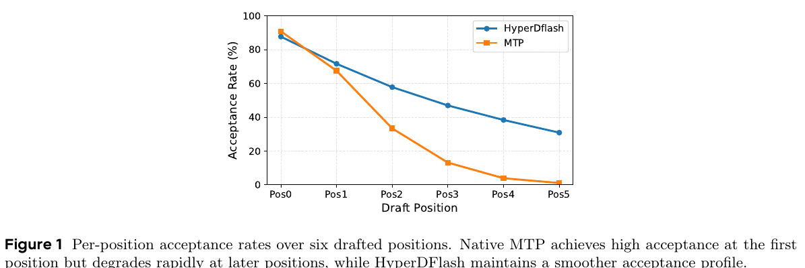
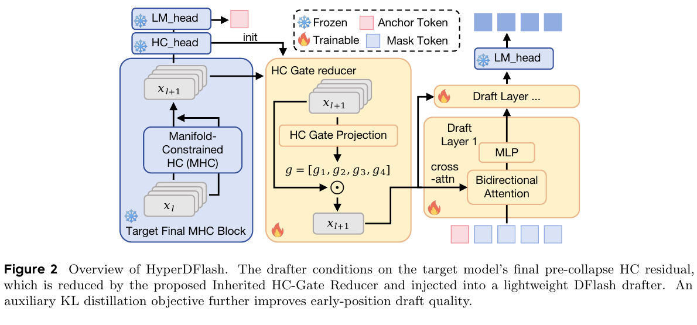
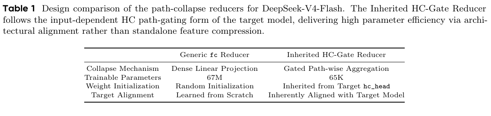
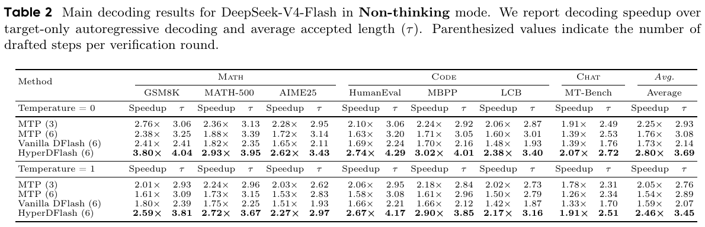
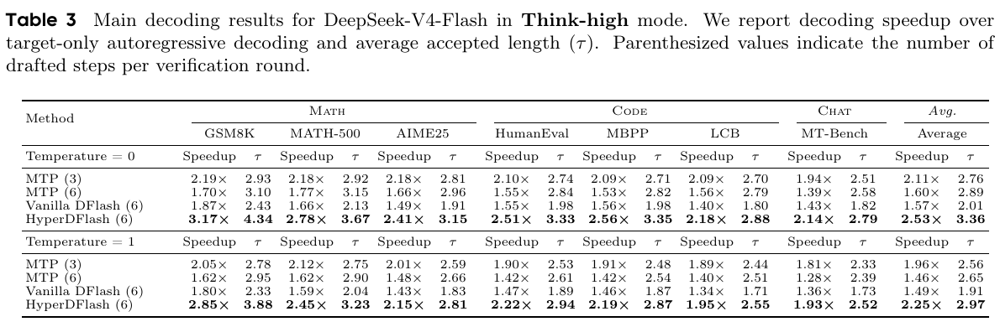

---
tags:
  - paper
  - collection/speculative-decoding
  - domain/model-systems
  - status/deep-review
  - topic/speculative-decoding
  - method/hyperconnection-alignment
document_type: paper
domain: speculative_decoding
collection: Speculative Decoding
review_status: deep-review
canonical: true
---

# HyperDFlash：面向 Hyper-Connection 的块并行推测解码精读

> [!info] 文档关系
> - 文档类型：Paper
> - 领域入口：[README](../README.md)
> - 上位汇总：[Evolution](../surveys/evolution.md)
> - 证据资产：`../assets/papers/hyperdflash/`
> - 相关文档：[Figure inventory](../evidence/figure-inventory.md)

## 修订信息

- 当前修订时间：`2026-07-31T10:00:00+08:00`

- 当前修订 ID：`rev-hyperdflash-obsidian-properties-20260731`
- 当前文档版本：`1.0.2`
- 修订时间：`2026-07-25T15:41:48+08:00`
- 修订者：`delegated-paper-review-agent`

| 修订 ID | 版本 | 类型 | 前驱 | 变更位置 | 原因/证据 | 对结论影响 |
|---|---|---|---|---|---|---|
| `rev-hyperdflash-initial` | `1.0.0` | `initial` | 无 | 全文、证据清单、图表、代码与 checkpoint 核验 | arXiv v2 PDF/source、DFlash commit `94e4abc…`、DeepSeek-V4-Flash revision `60d8d707…` | material：建立首版完整结论 |
| `rev-hyperdflash-affiliation-backfill-20260730` | `1.0.1` | `metadata-update` | 无 | `作者与机构` | 论文 PDF 标题页、机构编号与角色脚注 | none：不改变方法、实验与归因结论 |
| `rev-hyperdflash-obsidian-properties-20260731` | `1.0.2` | `metadata-update` | 无 | 无 | 无 | none：不改变论文分析与证据结论 |

## 0. 来源与图表清单

- 论文：Luxi Lin 等，*HyperDFlash: Hyper-Connection-Aligned Block Speculative Decoding with Gated Residual Reduction*，arXiv `2606.26744v2`，2026。
- 官方页面：https://arxiv.org/abs/2606.26744v2
- 核验版本：PDF SHA-256 `cc2b8a5e…a07c16`；source SHA-256 `30af1343…f010cd`。
- 论文状态：CoRR/arXiv 技术报告；未发现公开 venue decision。
- 作者/机构：10 位作者，ByteDance。
- 源码：arXiv LaTeX source 可用；HyperDFlash 实现与 drafter checkpoint 未发现公开版本。
- 基线代码：DFlash 官方仓库 commit `94e4abc5e0c31b67bc1a9d30f1cc34ece28a8756`。
- 目标 checkpoint：`deepseek-ai/DeepSeek-V4-Flash`，公开、非 gated，revision `60d8d70770c6776ff598c94bb586a859a38244f1`。
- OpenReview：未发现 HyperDFlash forum；官方 API 标题查询返回 403，因此记为不可用证据，不作推测。
- 图表：5 个计数对象，均含完整 caption；contact-sheet 与逐图 100% QA 均通过，详见 [Figure inventory](../evidence/figure-inventory.md)。

| 对象 | 用途 | 路径 | QA |
|---|---|---|---|
| Figure 1 | MTP 后位草稿退化 | `../assets/papers/hyperdflash/fig1-position-acceptance-caption.png` | passed |
| Figure 2 | HyperDFlash 总体机制 | `../assets/papers/hyperdflash/fig2-overview-caption.png` | passed |
| Table 1 | reducer 结构与参数量 | `../assets/papers/hyperdflash/table1-reducer-design-caption.png` | passed |
| Table 2 | Non-thinking 主结果 | `../assets/papers/hyperdflash/table2-nonthinking-results-caption.png` | passed |
| Table 3 | Think-high 主结果 | `../assets/papers/hyperdflash/table3-thinkhigh-results-caption.png` | passed |

## 0.1 术语与符号解释

### 0.1.1 术语表

| 术语 | 本文含义 | 别名 | 不等于/易混项 | 证据来源 |
|---|---|---|---|---|
| target model | 负责并行验证草稿且定义最终采样分布的 DeepSeek-V4-Flash | target、oracle（泛称） | 不是 drafter；“oracle”并非本文正式命名 | Sec. 1、3.2；DFlash `model.py:126-140` |
| drafter | 一次提出一块候选 token 的轻量 DFlash 派生模型 | draft model | 不等于 target 自带的 MTP 模块 | Sec. 1–2；Figure 2 |
| speculative decoding | drafter 提案、target 并行验证、只提交被接受前缀的无损解码范式 | draft-and-verify | “无损”指按相同 target 分布采样，不代表零额外计算 | Sec. 1；Related Work |
| block-parallel drafting | 从已接受 anchor 和 mask block 出发，一次 drafter forward 同时预测多个位置 | one-pass block drafting | 不是 MTP 的逐步串行外推 | Sec. 1；DFlash `model.py:107-121` |
| anchor token | 每个草稿块的首个已接受 token，作为块内条件锚点 | accepted anchor | 不是待验证草稿位置 | Sec. 1、Figure 2；DFlash `model.py:108-121` |
| MTP | DeepSeek-V4 原生 Multi-Token Prediction 模块，依赖未验证中间 token 顺序推进 | native MTP | 不等于 HyperDFlash 的块并行 drafter | Sec. 1、3.3；target code `model.py:738-766` |
| DFlash | 从 target 隐状态条件化、使用 mask block 一次并行起草的基线框架 | vanilla DFlash（本文直接适配版） | 原始 DFlash 代码并不支持 HC；DeepSeek-V4 支持仍标为 coming soon | Sec. 1、4；baseline README:34-38 |
| HC / mHC | DeepSeek-V4 每 token 保持多条并行 residual path 的 Hyper-Connection / manifold-constrained Hyper-Connection | 论文正文多用 HC，target README 用 mHC | 不是单一路 residual；论文标题的 “Hyper-Connection” 比早期摘要中的 “MHC” 更宽泛 | Sec. 1–2；target config `hc_mult=4` |
| `pre_hc_head` | target 最后一个 HC block 输出、最终路径折叠之前的多路径残差状态 | pre-collapse residual | 不等于中间多层 feature concatenation，也不等于折叠后的 LM-head 输入 | Sec. 2.1 |
| `hc_head` | target 在 LM head 前用输入相关 sigmoid gate 聚合 residual paths 的模块 | HC head | 不等于 HC block 内带 Sinkhorn 的 `hc_pre/hc_post` 路径混合 | Sec. 2.2 Eq. 1；target code `model.py:728-735` |
| Inherited HC-Gate Reducer | drafter 侧复用 `hc_head` 函数形式并继承 target gate 参数的路径 reducer | inherited reducer | 不是复制完整 target layer；不是 softmax gate | Sec. 2.2、Table 1 |
| generic fc reducer | 把拼接 target features 用密集线性层压到 hidden width 的 vanilla DFlash reducer | generic `fc` reducer；linear compressor | 不具备输入相关 path gate | Sec. 2.2；DFlash `model.py:317-334` |
| targeted LM-head KL distillation | 用 target LM head 对缓存 target hidden state 形成 soft label，只监督草稿块前两个位置 | early-position KL | 不是全位置 teacher forcing；当前 teacher 还使用 mean-pooled HC paths | Sec. 2.3 |
| drafting-stage mask | drafter 一次 block forward 中占位未决 token 的 mask | mask token | 不等于 target verification 的 causal/tree mask | Figure 2；DFlash `model.py:79-121` |
| target verification | target 对候选 block 并行求 posterior 并提交最长匹配前缀 | verification stage | 不等于 drafter 自注意力或训练 KL | Sec. 1；DFlash `model.py:126-140` |
| accepted length | 一轮 verification 中平均被接受的 draft token 数 | mean accepted length、$\tau$ | 不是生成质量分数，也不自动等价于端到端加速 | Sec. 3.4 |
| Non-thinking / Think-high | DeepSeek-V4-Flash 的两种推理模式 | Non-think / reasoning mode | 论文未披露完整 chat template、reasoning budget 或输出长度分布 | Sec. 3.2、Tables 2–3 |

### 0.1.2 符号表

| 符号 | 含义 | 性质 | 作用域/索引 | 单位/取值 | 来源 | 易混点 |
|---|---|---|---|---|---|---|
| $m$ | 每 token 的 HC residual path 数 | author-defined / code-confirmed | target-wide | DeepSeek-V4-Flash 为 4 | Eq. 1；target config | 论文早期材料把架构写作 MHC；这里 $m$ 是 path count |
| $d$ | 单条 residual path / hidden width | author-defined / code-confirmed | target/drafter width | 4096 | Sec. 2.2；target config | 不等于拼接宽度 $md$ |
| $\mathbf H_t$ | token $t$ 的 pre-collapse 多路径残差 | author-defined | per-token，shape $m\times d$ | hidden activations | Eq. 1 | 是最终 HC block 后、`hc_head` 前的状态 |
| $\mathrm{vec}(\mathbf H_t)$ | 按 path 展平后的向量 | author-defined | per-token | shape $md$ | Eq. 1 | 仅是展平，不是聚合 |
| $\tilde{\mathbf x}_t$ | 对展平多路径状态做 RMSNorm 后的 gate 输入 | author-defined | per-token | shape $md$ | Eq. 1 | target code 使用 inverse-RMS scaling、scale 与 epsilon 的更具体实现 |
| $W_f$ | `hc_head` gate 线性权重 | author-defined | target head | shape $m\times md$ | Eq. 1 | 不等于 dense reducer 的 $d\times md$ 权重 |
| $b$ | gate bias | author-defined | per path | shape $m$ | Eq. 1 | target code 另有 scale 参数与 epsilon |
| $\boldsymbol\alpha_t$ | token $t$ 的 path gates | author-defined | per-token/per-path | $(0,1)^m$，独立 sigmoid | Eq. 1 | 不归一化为和 1，不是 softmax |
| $\alpha_{t,j}$ | 第 $j$ 条 path 的 scalar gate | author-defined | token $t$、path $j$ | scalar | Eq. 1 | 对整条 $\mathbf H_{t,j}$ 广播 |
| $\mathbf y_t$ | gate 聚合后的单路条件向量 | author-defined | per-token | shape $d$ | Eq. 1 | 是 reducer 输出，不是 logits |
| $\mathbf h_p$ | target 位置 $p$ 的缓存 hidden state | author-defined | per-position | hidden vector/state | Sec. 2.3 | 当前 KL teacher 对 HC paths 做 mean-pool，未完全复用 gated collapse |
| $a$ | 草稿块 anchor 的位置 | author-defined | per-block | token index | Sec. 2.3 | 不是 KL 权重 $\alpha$ |
| $k$ | 草稿块内部预测位置 | author-defined | $1,\dots,P$ 或 block length | token offset | Sec. 2.3 | teacher 与 student 在 $k\ge2$ 的信息集不同 |
| $\mathbf z_k$ | drafter 在位置 $k$ 的 logits | author-defined | per-block-position | vocab logits | Sec. 2.3 | 不是概率，需 softmax |
| $T_{\mathrm{KD}}$ | 蒸馏温度 | author-defined | training-wide | 未报告具体值 | Eq. 2 | 不等于生成 temperature 0/1 |
| $P$ | 施加 KL 的前几个 block positions | author-defined | training objective | 本文为 2 | Eq. 2、Sec. 2.3 | 不等于总 draft steps（6） |
| $p_k^{T_{\mathrm{KD}}}$ | target teacher 的温度缩放概率 | author-defined | position $k$ | probability distribution | Eq. 2 | $k\ge2$ 条件于真值中间 token |
| $q_k^{T_{\mathrm{KD}}}$ | drafter student 的温度缩放概率 | author-defined | position $k$ | probability distribution | Eq. 2 | 条件于 masked intermediate positions |
| $\mathcal L_{\mathrm{KL}}$ | 前 $P$ 个位置的平均、温度缩放 KL loss | author-defined | training batch | scalar | Eq. 2 | 方向为 $\mathrm{KL}(p\|q)$ |
| $\mathcal L_{\mathrm{CE}}$ | one-hot token cross-entropy | author-defined | training batch | scalar | Eq. 3 | 论文未给位置权重细节 |
| $\alpha$ | KL loss 系数 | author-defined | training-wide | 通常 0.1–0.2 | Eq. 3、Sec. 2.3 | 与 path gate $\boldsymbol\alpha_t$ 同字母异义 |
| $\tau$ | 平均 accepted length | author-defined | benchmark aggregate | token / verification round | Sec. 3.4、Tables 2–3 | 不是 acceptance rate；表中也没有方差 |
| $S$ | 相对 target-only 的吞吐加速比 | analysis-derived | benchmark aggregate | $\times$ | Tables 2–3 | 论文写 “Speedup”，本分析用 $S$ 便于公式化 |
| $B_{\mathrm{KV}}$ | KV/cache 占用的分析变量 | analysis-derived | runtime | bytes | Sec. 8 推导 | 不是论文报告值，V4 的压缩注意力使朴素公式仅为上界模板 |
| $\mathrm{BW}_{\mathrm{eff}}$ | 有效数据搬移带宽 | analysis-derived | kernel/runtime | byte/s | Sec. 8 推导 | 论文未报告 bytes moved 或 kernel time |

## 0.2 AI 生成算法分析示意图

未生成，分类为 `visual-evidence-skip`。该可选辅助图缺口只影响信息可视化，不影响论文原图、公式、实验与代码证据。

## 1. 论文基本信息

### 作者与机构

- 第一作者（首位列名）：Luxi Lin → ByteDance。
- 共同第一作者（仅含论文明确标注者）：
  - Shuang Peng → ByteDance
- 通讯作者/通讯联系人（仅含论文明确标注者）：
  - Fangmin Chen → ByteDance
  - Songwei Liu → ByteDance
- 其他作者涉及的机构（去重列举，不作逐作者映射）：ByteDance。
- 对应依据：论文 PDF 标题页、作者机构编号与角色脚注（核验日期：2026-07-30）。

- 研究领域：LLM 推理加速、推测解码、块并行 drafting、Hyper-Connection 架构适配。
- 核心问题：原生 MTP 的后位 acceptance 急降；通用 DFlash 又与 DeepSeek-V4 的多路径 residual 表示不对齐。
- 研究目标：在固定六步 draft budget 下，提高平均 accepted length 与 target-only 相对吞吐，同时把 HC path reduction 的参数开销从约 67M 降至约 65K。
- 关键约束：只在单一 DeepSeek-V4-Flash target 上验证；HyperDFlash 代码、drafter checkpoint、生产 serving 分解均未公开。
- 总体判断：**论文级闭环得到部分支持**。完整 HyperDFlash 相比 MTP(3)、MTP(6)、Vanilla DFlash(6) 的主表优势一致；但三个组件被捆绑启用，发布版本没有逐组件消融，不能把收益分别归给 pre-collapse source、inherited reducer 与 KL。

## 2. 研究动机与问题—方案闭环

### 2.1 出发点与背景痛点

作者明确指出，推测解码的加速不仅取决于第一个 draft token 是否正确，还取决于连续可接受前缀有多长。DeepSeek-V4 自带的 MTP 在第一个位置很强，但它按顺序把未验证 token 继续喂入后续预测，因而早期错误会沿 draft positions 累积。Figure 1 显示 MTP acceptance 从首位约 90% 快速跌至末位接近 0，而 HyperDFlash 的曲线更平缓；图中却没有说明具体 benchmark、模式、temperature 或样本量，因此它是机制线索而非充分统计检验。

直接换用 DFlash 可以消除草稿内部的串行依赖：从已接受 anchor 加 mask block 一次预测整块。但 DeepSeek-V4 不是普通单路 residual 模型；它在最终 LM head 之前仍持有 $m$ 条 residual paths。Vanilla DFlash 的“多层状态拼接 + dense fc”既偏离 target 最终预测状态，又忽略 target 原生的输入相关 path aggregation。因此，论文不是只解决“怎样并行起草”，而是解决“怎样让并行 drafter 看到与 target 最终决策通路一致的条件表示”。

### 2.2 现有方案为何不够

1. **MTP 的失败模式（author-stated）**：后位预测依赖未验证 token，错误累积使 acceptance 随 position 急降（Sec. 1、Figure 1）。
2. **Vanilla DFlash 的失败模式（author-stated）**：中间多层 feature 与 target 最终 pre-collapse state 不一致；dense reducer 把 HC residual 当普通长向量，缺乏 target `hc_head` 的输入相关 gating（Sec. 1、2.1–2.2）。
3. **简单增加 draft steps 不够（supported）**：Non-thinking、temperature 0 下，MTP(6) 的 $\tau=3.08$ 高于 MTP(3) 的 2.93，却因 drafter 成本使 speedup 从 $2.25\times$ 降至 $1.76\times$；HyperDFlash(6) 同样六步达到 $\tau=3.69$ 和 $2.80\times$（Table 2）。
4. **纯 KL 全位置蒸馏不合适（author-stated, unablated）**：$k\ge2$ 时 teacher 看到真值中间 token，而 student 看到 mask；强行匹配 sharp conditional distributions 可能产生高方差、冲突梯度（Sec. 2.3）。

### 2.3 论文计划解决的问题与成功标准

- 核心研究问题：如何把一次性 block drafting 适配到 DeepSeek-V4 的 HC residual stream，同时保持高 acceptance 与低 reducer overhead？
- 目标对象：DeepSeek-V4-Flash + 六步 DFlash drafter。
- 必须满足的约束：target verification 仍保证生成分布正确；conditioning 与 target 最终 prediction pathway 对齐；path collapse 参数显著低于 dense projection。
- 成功标准：在同 target / verification pipeline 下，$\tau$ 和相对 throughput 均超过 MTP(3)、MTP(6)、Vanilla DFlash(6)；结果跨数学、代码、聊天、两种模式和 temperature 0/1。
- 明确不解决：生产流量下的 latency decomposition、batching/scheduler 效应、多 target 泛化、HyperDFlash 开源复现、KL 的独立因果效应。

### 2.4 核心方案如何解决并优化问题

| 原始问题/失败模式 | 根因或约束 | 对应方案设计 | 改变的变量/系统行为 | 作用机制 | 预期优化及指标 | 证据来源 | 判断 |
|---|---|---|---|---|---|---|---|
| MTP 后位 acceptance 急降 | 后位依赖未验证 token | DFlash 式 one-pass block drafting | 去掉草稿位置间 autoregressive dependency | 每个 draft position 从同一 accepted context + mask block 并行预测 | 提高后位 acceptance 与 $\tau$ | Figure 1；Sec. 1；baseline code | partially-supported：完整方法曲线改善，但无纯 drafting-form 消融 |
| 中间层 feature 偏离最终决策状态 | HC target 在末端仍保留多路径 residual | 只使用 `pre_hc_head` | conditioning source 移到 target 最终 collapse 前 | 保留全部 path 语义并贴近 target 原生 prediction pathway | 提高 candidate quality / $\tau$，减少多层捕获开销 | Sec. 2.1、Figure 2 | plausible：发布 PDF 无 source-only 消融 |
| dense fc 不符合 target 聚合机制且参数大 | 静态 $d\times md$ 投影不能表达 input-dependent gate | inherited HC-Gate Reducer | 从静态 feature mixing 变为每 token、每 path sigmoid gate；参数继承 | 复用 target `hc_head` 的归纳偏置与初始化 | 67M→65K；预期 acceptance 不降 | Eq. 1、Table 1、target code | parameter claim supported；quality contribution unisolated |
| CE 不利用 target 完整分布 | one-hot 丢失 dark knowledge | 前两个位置的 LM-head KL | 增加 soft-target regularization | 首位 teacher/student context 一致；第二位保守扩展 | 训练早期 draft quality/stability | Eq. 2–3、Sec. 2.3 | plausible/unverified：无独立 KL ablation |
| 增加 draft budget 可能反而拖慢 | drafter/verification 成本与 acceptance 权衡 | 同六步 matched budget 比较 | 固定每轮 draft steps | 隔离“多起草”与“更高质量起草” | $\tau$ 与 speedup 同升 | Tables 2–3 | supported at bundled-system level |

### 2.5 完整因果链与证据闭环

论文的完整逻辑是：实际加速受连续接受前缀限制；MTP 后位受未验证 token 误差累积影响；DFlash 能一次并行起草，但通用 feature capture 与 dense reduction 不匹配 DeepSeek-V4 的 HC 最终状态；HyperDFlash 因此用 pre-collapse 多路径状态、继承式输入相关 path gate 和受限 early-position KL，改变 drafter 的条件信息位置、path aggregation 函数和训练监督；预期得到更高的后位 acceptance、$\tau$ 与 throughput，同时降低 reducer 参数；Tables 2–3 在所有公开 benchmark/mode/temperature 聚合中均显示完整系统优于三个 baseline。

- **直接验证**：完整 HyperDFlash 在 matched six-step budget 下的 $\tau$ 和 speedup 优于 MTP(6) 与 Vanilla DFlash(6)；reducer 参数量可由形状和 target config 复算。
- **间接支持**：Figure 1 的位置曲线支持“后位退化”动机；target code 证实 HC 多路径与 `hc_head` 输入相关 sigmoid gate；DFlash code 证实多层状态拼接与 dense `fc`。
- **混杂环节**：HyperDFlash(6) 同时开启 conditioning source、reducer、KL 和可能的 DeepSeek 专用 integration，主表不能识别单组件效应。
- **未验证环节**：KL 稳定训练、pre-collapse 比 multi-layer 更好、inherited reducer 比 dense reducer 质量更好，均没有出现在发布 PDF 的独立 ablation。arXiv source 内存在被注释掉的 source/reducer ablation 表，不能视为正式发表证据。
- **边界**：单一 284B/13B-active target、内部数据混入训练、未披露生产 latency breakdown、代码/checkpoint 缺失，限制外推和复现。

## 3. 核心贡献与创新点

1. 把 block-parallel drafting 对齐到 HC target 的最终 pre-collapse residual，而非通用中间层拼接（Sec. 2.1、Figure 2）。
2. 用继承 target `hc_head` 的输入相关 sigmoid path reducer 替代 dense fc；参数从 67,108,864 降到约 65,540，约 $1024\times$ 缩减（Sec. 2.2、Table 1、target code）。
3. 只在前两个草稿位置施加 LM-head KL，显式承认后位 teacher/student 信息集错配（Sec. 2.3、Eq. 2–3）。
4. 在统一 target 与 verification pipeline 下同时比较原生部署点 MTP(3)、matched-budget MTP(6)、Vanilla DFlash(6) 和 HyperDFlash(6)，避免把“六步预算”本身误认为方法收益（Sec. 3.3、Tables 2–3）。

## 4. 研究方法

### 4.1 方法总览

输入是已接受上下文、最后一个 accepted anchor，以及五个 mask slots，构成六位置 block。target 已产生的最终 pre-collapse HC state 被保留；Inherited HC-Gate Reducer 把每 token 的 $m\times d$ 多路径表示聚合成 $d$ 维条件；轻量 DFlash drafter 通过 cross-attention 注入此条件，一次产生 block logits；target 再并行验证并提交最长接受前缀。训练时在 CE 外只对前两个 block positions 加 target LM-head KL。

该图使用 “MHC” 标签，而论文 v2 正文主要写 HC、并说明 DeepSeek-V4 的具体实现是 mHC。这里按 stage 区分：HC path 表示属于 target architecture；mask block 和 bidirectional attention 属于 drafting；LM-head 再算与前缀提交属于 verification。

### 4.2 组件级设计动机与具体问题映射

| 设计项 | 论文是否明确说明 why | 原文证据 | 针对的具体问题/失败模式 | 可能起作用的因果机制 | 替代方案/权衡 | 验证证据 | 判断 |
|---|---|---|---|---|---|---|---|
| one-pass block drafting | author-stated | Sec. 1 | MTP 草稿内部串行依赖与误差累积 | 所有候选位置直接条件于 accepted anchor/target context | MTP 成本小但后位弱；tree/AR drafter 可更灵活但串行 | Figure 1 + complete-system tables | partially-supported |
| `pre_hc_head` only | author-stated | Sec. 2.1 | 多层 feature 偏离最终 target state、额外 capture overhead | 保留完整 path 结构且取自最终 collapse 前 | multi-layer capture 适配更通用；folded state 更省宽度但丢 path 信息 | paper prose、Figure 2；无发布消融 | plausible |
| inherited sigmoid path reducer | author-stated | Sec. 2.2、Eq. 1、Table 1 | dense fc 静态、参数重、与 target aggregation 不一致 | 对每 token 自适应给 path 加权，初始化继承 target | dense fc 在 hidden width 不匹配时可 fallback；继承 reducer 要求相同 width/source | 参数直接验证；target code；quality 未隔离 | partially-supported |
| per-path drafter RMSNorm | author-stated but minimally motivated | Sec. 2.2 | reducer 输入尺度适配 | 在 gating 前稳定路径尺度 | 复用 target exact norm；或不额外 norm | 无消融、无代码 | unverified |
| first-two-position KL | author-stated | Sec. 2.3、Eq. 2–3 | CE 丢失完整 target distribution；后位 teacher context 错配 | 前位 soft labels 提供更丰富概率监督，限制 $P=2$ 减少冲突 | $P=1$ 更严格对齐；全位置 KL 信号更多但偏差更大 | 理论性信息集分析；无独立 ablation | plausible |
| KL weight 0.1–0.2 | author-stated | Sec. 2.3 | teacher 仍 mean-pool HC paths，可能有偏 | 低权重限制错误 teacher 的梯度影响 | gated teacher 或温度/权重 sweep | 无 sensitivity | unverified |
| two-stage 300K→150K training | author-stated | Sec. 3.1 | 通用能力与任务域适配需兼顾 | 先通用后任务导向 adaptation | 混合单阶段、更多公开数据、不同 epoch | 无 data/training ablation | unverified |
| six-step draft budget | author-stated | Sec. 3.3 | acceptance 与 draft cost 权衡 | 用 MTP(6) 和 DFlash(6) 对齐预算 | 动态 block length 可能更优 | matched-budget main tables | supported as evaluation control |
| vLLM serving | author-stated | Sec. 3.2 | 需要测吞吐而非只测 acceptance | 在同 stack 计算 target-only 相对 speedup | SGLang/custom runtime；生产调度 | 仅 aggregate speedup，无实现/分解 | partially-supported |

### 4.3 模型/系统架构

target config 核验到 `hc_mult=4`、hidden size 4096、43 layers、1 个 MTP layer。target `hc_head` 的实际实现是：展平 4 条 path，做 inverse-RMS scaling，线性映射到 4 个 gate，乘 scale、加 base/bias，经 sigmoid 与 epsilon，再对 paths 加权求和。论文 Eq. 1 是这个实现的抽象，而不是逐行等价代码。

Vanilla DFlash 的公开实现会选取若干 target layers、拼接 hidden states，再用 `nn.Linear(len(layer_ids)*hidden_size, hidden_size)` 和 RMSNorm 压缩；这正是 HyperDFlash 要替代的 interface。公开 baseline code 没有 HC 专用 path、inherited reducer 或 KL。

### 4.4 关键公式

论文对 target `hc_head` 的抽象为：

$$
\tilde{\mathbf{x}}_t=\mathrm{RMSNorm}(\mathrm{vec}(\mathbf H_t)),
\qquad
\boldsymbol{\alpha}_t=\sigma(W_f\tilde{\mathbf{x}}_t+b),
$$

$$
\mathbf y_t=\sum_{j=1}^{m}\alpha_{t,j}\mathbf H_{t,j}.
$$

因为各 gate 独立 sigmoid，$\sum_j\alpha_{t,j}$ 不必为 1。该函数可以动态抑制或放大整条 residual path；dense fc 则直接对所有 $md$ 输入维度做固定线性组合。

用 $m=4,d=4096$ 复算参数：

$$
N_{\mathrm{fc}}=(md)d=4\cdot4096^2=67{,}108{,}864,
$$

$$
N_{\mathrm{gate}}=m(md)+m=m^2d+m=65{,}540,
$$

$$
\frac{N_{\mathrm{fc}}}{N_{\mathrm{gate}}}=1023.94.
$$

因此 “67M vs 65K、三个数量级” 能由论文形状和 checkpoint config 直接验证。它证明的是 reducer **容量/存储**优势，不直接证明 acceptance 优势。

对 anchor position $a$，第 $k$ 个 draft prediction：

$$
\mathrm{teacher}_k=\mathrm{LMHead}(\mathbf h_{a+k-1}),
\qquad
\mathrm{student}_k=\mathbf z_k.
$$

蒸馏目标：

$$
\mathcal L_{\mathrm{KL}}
=\frac{T_{\mathrm{KD}}^2}{P}
\sum_{k=1}^{P}
\mathbb E\left[
\mathrm{KL}\!\left(
p_k^{T_{\mathrm{KD}}}\,\|\,q_k^{T_{\mathrm{KD}}}
\right)
\right],
$$

$$
\mathcal L=\mathcal L_{\mathrm{CE}}+\alpha\mathcal L_{\mathrm{KL}},
\qquad P=2,\quad \alpha\in[0.1,0.2]\ \text{（通常）}.
$$

最关键的正确性边界是：$k=1$ 时 teacher/student 都只见到 $[0{:}a]$；$k\ge2$ 时 teacher 额外见到 ground-truth $a+1,\dots,a+k-1$，student 却只见 mask，因此后位 KL 不是同条件分布之间的标准蒸馏。

### 4.5 训练/实验/部署设计

- Stage 1：约 300K public instruction/dialogue/code examples，公开部分主要来自 EagleChat；5 epochs。
- Stage 2：约 150K task-oriented code/instruction examples，包括 Evol-CodeAlpaca；5 epochs。
- 训练硬件：8× NVIDIA H20；per-GPU batch size 4。
- 学习率：Stage 1 为 $8\times10^{-4}$；Stage 2 为 $1\times10^{-4}$。
- 最终 checkpoint：Stage 2 后选择，但未公开 selection metric、step、seed、optimizer、sequence length、mixed precision、gradient accumulation 或 checksum。
- 评测 target：单一 DeepSeek-V4-Flash。
- benchmark：GSM8K、MATH-500、AIME25、HumanEval、MBPP、LiveCodeBench、MT-Bench。
- 模式/温度：Non-thinking / Think-high，temperature 0/1。
- serving：vLLM；未披露 vLLM commit、batch size、concurrency、prompt/output length distribution、GPU 型号、tensor parallel 度、CUDA graph 或 kernel 配置。

## 5. 关键结论

### 5.1 主结果

Non-thinking、temperature 0 的公开聚合：

- 对 MTP(3)：$\tau$ 2.93→3.69，绝对 +0.76、相对 +25.94%；speedup $2.25\times\to2.80\times$，绝对 +0.55、相对 +24.44%。
- 对 matched-budget MTP(6)：$\tau$ 3.08→3.69，+0.61 / +19.81%；speedup $1.76\times\to2.80\times$，+1.04 / +59.09%。
- 对 Vanilla DFlash(6)：$\tau$ 2.14→3.69，+1.55 / +72.43%；speedup $1.73\times\to2.80\times$，+1.07 / +61.85%。

Non-thinking、temperature 1 对 MTP(6)：$\tau$ 2.89→3.45，+0.56 / +19.38%；speedup $1.54\times\to2.46\times$，+0.92 / +59.74%。

Think-high、temperature 0 对 MTP(6)：$\tau$ 2.89→3.36，+0.47 / +16.26%；speedup $1.60\times\to2.53\times$，+0.93 / +58.12%。temperature 1：$\tau$ 2.65→2.97，+0.32 / +12.08%；speedup $1.46\times\to2.25\times$，+0.79 / +54.11%。

所有 7 个公开 benchmark 的表格单元中，HyperDFlash 都同时给出最高 speedup 与 $\tau$。然而论文没有误差条、seed variance、样本数量、输出长度分布或显著性检验；“一致”是表格描述，不是统计显著性结论。

### 5.2 技术 claim—证据矩阵

| 论文声称的技术点 | 声称收益/效果 | 对应实验/消融 | 对照是否受控 | 指标变化 | 证据强度 | 结论 |
|---|---|---|---|---|---|---|
| MTP 后位 error accumulation | 后位 acceptance 急降 | Figure 1 | setting 未报告 | 曲线约 90%→近 0 | mechanism visualization | partially-supported |
| block-parallel drafting 避免未验证 token 链式误差 | 更平滑后位 acceptance | Figure 1 + full system | 与 HC/KL 捆绑 | HyperDFlash 曲线更平 | indirect/confounded | plausible |
| `pre_hc_head` 比 multi-layer 对齐 | candidate quality 更好、capture overhead 更低 | 发布 PDF 无消融 | no | 无发布 delta | none（source comments 不计正式证据） | unverified |
| inherited reducer 参数高效 | 67M→65K | Table 1 + shape/config | matched formula | $1023.94\times$ 少 | direct calculation + code | supported |
| inherited reducer 更对齐/质量不降 | $\tau$ 提升 | full HyperDFlash vs vanilla | conditioning/KL 同时变 | bundled delta | confounded replacement baseline | partially-supported |
| KL 利用完整 target distribution | 早期 draft quality/stability | 无独立 ablation | no | 无 delta | rationale only | unverified |
| KL 只监督前两位更合理 | 减少后位 context mismatch | 信息集分析 | 无 $P$ sensitivity | 无 delta | theoretical/plausibility argument | plausible |
| 两阶段数据训练有效 | 通用+任务适配 | 无 data ablation | no | 无 delta | none | unverified |
| 同六步预算收益不是“多起草” | $\tau$、speedup 都升 | HyperDFlash(6) vs MTP(6) | budget/target/pipeline matched；其他组件 bundled | Table 2–3 | replacement baseline | supported at system level |
| 跨任务/模式/温度稳健 | 7 benchmarks、2 modes、2 temperatures 均优 | Tables 2–3 | same reported config | 所有 cells 最优 | broad but no variance | partially-supported |
| 生产 serving 加速 | end-to-end production latency 更好 | 未做 | no | 仅 target-only 相对 throughput | none | unverified |

重要源码边界：`source/main.tex` 中有被 `%` 注释掉的 conditioning-source 与 reducer ablation 表。它们不出现在 arXiv v2 PDF，缺少正式实验上下文，不能升级为 paper-proven evidence；只能作为“作者曾准备过相关实验，但最终发布版本未纳入”的审计线索。

### 5.3 是否验证了假设

- “六步 HyperDFlash 整体优于六步 MTP / Vanilla DFlash”：是，主表直接支持。
- “HC-aware adaptation 对 DeepSeek-V4 必要”：系统级结果支持，但 pre-collapse 与 reducer 两项无法拆分，结论应写为“HC-aware bundle 有效”。
- “inherited reducer 的主要价值是架构对齐而非压缩”：参数与 code 支持其函数形式更贴近 target；quality 因果未独立验证。
- “KL 改善训练早期 draft quality”：未验证。论文没有 learning curve、KL on/off 或 $P,\alpha,T_{\mathrm{KD}}$ sensitivity。
- “可用于高性能生产 serving”：尚未验证。没有 concurrency、P50/P99 latency、batching 或 GPU utilization。

### 5.4 收益来源归因

| 组件/变化 | 对比基线 | 指标变化 | 影响路径 | 证据强度 |
|---|---|---|---|---|
| 完整 HC-aware bundle | Vanilla DFlash(6), Non-thinking T=0 | $\tau$ +1.55；speedup +1.07× | candidate quality + possible runtime overhead changes | matched system replacement，但组件混杂 |
| 完整 bundle | MTP(6), Non-thinking T=0 | $\tau$ +0.61；speedup +1.04× | parallel drafting + HC alignment + KL | matched budget，算法整体直接证据 |
| 从 MTP(3) 增至 MTP(6) | MTP(3), Non-thinking T=0 | $\tau$ +0.15；speedup −0.49× | 更多候选但更高 drafter cost | direct matched target evidence |
| reducer capacity | dense fc → inherited gate | 67M→65K（约 −99.90%） | 权重读取、参数存储、训练更新量下降 | direct calculation；未测 wall-clock isolated delta |
| pre-collapse source | multi-layer → `pre_hc_head` | 无发布 delta | context alignment、减少 feature capture | unverified |
| KL | CE → CE+KL | 无发布 delta | early-position probability matching | unverified |

不能把 Table 2 的 +1.55 $\tau$ 全部归因于 gate reducer，也不能把 speedup 增益解释为 kernel 优化；论文没有 HyperDFlash custom kernel，candidate quality 与 runtime 成本共同决定 speedup。

## 6. Related Work 对比

| 类别/论文 | 方法核心 | 优点 | 局限 | 与本文关系/比较公平性 |
|---|---|---|---|---|
| Leviathan/Chen speculative decoding | 小 drafter 提案、target 并行验证 | 分布保持、通用 | drafter 质量/成本决定收益 | HyperDFlash 沿用 verification 原理 |
| MTP / DeepSeek-V4 native MTP | target 内部多步预测，顺序推进 | 无外部大 drafter、首位强 | 后位依赖未验证 token | 论文同时给 MTP(3) 部署点与 MTP(6) matched budget，设计较公平 |
| blockwise parallel decoding | 一次预测多个未来 token | 减少 drafting 序列性 | 多位置质量难维持 | HyperDFlash 属于架构感知的现代实现 |
| Medusa / Hydra | 多 head 或顺序依赖 draft heads | 轻量、可 tree verify | 头间/位置依赖、target adaptation | 论文 related work 提及，但主表未比较 |
| EAGLE 1/2/3 | feature-level AR drafter + dynamic trees | acceptance 高、生态成熟 | drafting 仍有 sequential steps | HyperDFlash 不提供 EAGLE baseline；外部适用范围比较不足 |
| DFlash | mask block + target hidden context，一次并行 drafting | 消除草稿内部 AR 链 | 普通多层 capture/dense fc 不适配 HC | 最接近基线；公开代码直接证实 multi-layer concat + fc |
| retrieval/lookahead/self-speculative | 检索、lookahead candidates、early exit | 可免训练或减少外部模型 | 对数据/target 架构/搜索有不同依赖 | 论文只作 taxonomy，不做主实验 |
| Hyper-Connections / mHC | 多路径 residual 与受约束混合 | 改善深层信号传播 | 改变 downstream hidden-state interface | HyperDFlash 的关键在 co-design，不是提出 HC 本身 |
| knowledge distillation | teacher soft distribution | 比 one-hot 信息丰富 | teacher/student context mismatch 会引入偏差 | 本文只在前两位保守使用，但没有消融 |

Related Work 的主要欠缺不是引用范围，而是实验比较范围：主结果只覆盖内部最相关的 MTP 和 DFlash，无法判断相对 EAGLE-3、Medusa/Hydra 的 wall-clock Pareto 前沿。考虑 target 是新 HC 架构，这种缺口可理解，但会缩小 “high-performance” 的外推强度。

## 7. OpenReview 公开评审 × 论文内容交叉核验

- OpenReview 链接：未发现。
- 访问日期：2026-07-25。
- decision/meta-review：不可获得。
- author response/rebuttal：不可获得。

因此没有 reviewer claim 可以合法映射。以下三类担忧来自本精读而不是公开评审：组件消融缺失、serving decomposition 缺失、单 target 与非公开工作负载限制。它们均由论文 Limitations、注释源码和代码/checkpoint 缺口支持。

### 7.1 正向证据

不存在可归于 reviewer 的正向评价。论文自身最强的正向信号是：matched six-step budget、跨 7 benchmarks / 2 modes / 2 temperatures 的一致 system-level 优势，以及 reducer 参数量可独立复算。

### 7.2 仍成立的主要担忧

- 组件 causality：无发布版 source-only、reducer-only、KL-only ablation。
- 复现：无 HyperDFlash code/checkpoint、训练 recipe 细节与 vLLM revision。
- 测量：无 seed variance、P50/P99、GPU utilization、batch/concurrency。
- 泛化：只有 DeepSeek-V4-Flash；未验证其他 HC targets 或 width mismatch fallback。

### 7.3 Rebuttal/Revision

无公开 rebuttal 可核验。arXiv v2 的 source comments 暗示作者曾准备 source/reducer ablation，但它们被注释且未进入 PDF，不能视为修订已解决证据缺口。

### 7.4 对贡献范围的影响

上述问题不推翻“完整 HyperDFlash bundle 在作者测试设置中优于所列 baseline”，但会把结论限定为：**单 target、作者内评测、缺少组件归因和生产 serving 复现的架构感知系统结果**。

## 8. Infra 需求分析

### 8.1 算力

论文报告训练用 8×H20、两阶段各 5 epochs，但没有 tokens/example、sequence length、drafter layer count或每 step 时间，无法计算总 FLOPs。

推理一轮的粗粒度延迟可写为：

$$
t_{\mathrm{round}}
=t_{\mathrm{draft}}(K)+t_{\mathrm{verify}}(K+1)+t_{\mathrm{cache}}+t_{\mathrm{sched}},
$$

而平均每提交 token 成本近似：

$$
t_{\mathrm{token}}\approx
\frac{t_{\mathrm{round}}}{\mathbb E[A]+1},
$$

其中 $K=6$、$A$ 是接受草稿数。提高 $\tau$ 只减小分母侧的 verification rounds；如果 drafter 太重，仍可能像 MTP(6) 那样 acceptance 上升而 speedup 下降。Table 2 正好展示了这一 Pareto 关系。

### 8.2 显存与存储

只看 reducer 参数，若 BF16 保存：

$$
B_{\mathrm{fc}}\approx 67{,}108{,}864\times2
=134.2\ \mathrm{MB},
$$

$$
B_{\mathrm{gate}}\approx65{,}540\times2
=0.131\ \mathrm{MB}.
$$

若训练还保留 FP32 master weights 与 Adam 两个 moments，近似每参数 16 bytes，则分别约 1.074 GB 与 1.05 MB。实际训练框架可能不同，这只是明确标记的分析估算。

pre-collapse condition buffer 对每 token 的裸激活量：

$$
B_{\mathrm{preHC/token}}=m d\,b
=4\cdot4096\cdot b.
$$

BF16 时为 32 KiB/token；折叠后是 8 KiB/token。论文声称复用已经为 MTP 保持的 buffer，所以边际峰值可能小于重新 capture 多层 states，但未给 allocator trace。

### 8.3 Data Types / 数值格式

| 对象 | 数据类型/格式 | 使用阶段 | 硬件依赖 | 对精度/速度/显存影响 | 证据 |
|---|---|---|---|---|---|
| DeepSeek-V4-Flash MoE experts | FP4 packed + E8M0 scale | target inference | 新型 GPU/TileLang kernels | 降权重带宽与存储；需 dequant/GEMM support | target README/config/kernel |
| target 其他主要权重 | FP8 E4M3 + scale | target inference | FP8 GEMM | 降 HBM 流量 | target config/kernel |
| target default activations | BF16，动态量化到 FP8 | inference | FP8 tensor core/kernel | 精度与吞吐折中 | target config/model/kernel |
| LM head / HC gate compute | code 中 FP32 parameter/compute paths 后转回输入 dtype | logits / HC collapse | GPU | 稳定归一化与 logits，但可能增加局部带宽 | target code `model.py:705-735` |
| HyperDFlash drafter/reducer | 未报告 | train/infer | unknown | 无法验证 speedup 对 dtype 的依赖 | paper/code absence |

### 8.4 带宽、互联与高效利用

有效带宽定义：

$$
\mathrm{BW}_{\mathrm{eff}}
=\frac{\mathrm{BytesMoved}}{t_{\mathrm{kernel}}},
\qquad
U_{\mathrm{BW}}
=\frac{\mathrm{BW}_{\mathrm{eff}}}{\mathrm{BW}_{\mathrm{peak}}}.
$$

论文没有 bytes moved、kernel time、H20/HBM peak、TP degree 或 Nsight profile，不能给出可信百分比。可以做的定性判断：

- dense 67M reducer 每 token/step 重读大量权重，倾向 memory-bandwidth-heavy；65K gate weight 更容易 cache resident。
- `pre_hc_head` 避免抓取并拼接多个中间层，可能减少 activation write/read 和 layout transform。
- target 本身为 284B/13B-active MoE，权重与 KV/cache traffic 仍远大于 65K reducer；因此 reducer 参数缩小不等价于全系统速度按 $1024\times$ 改善。
- 多卡 inference 可能涉及 tensor-parallel all-reduce/all-gather；target code 明确对 embedding、row-parallel linear、logits 进行 collectives，但论文未给互联拓扑或通信占比。

| 路径 | 数据量 | 峰值带宽 | 有效带宽/利用率 | 优化机制 | 瓶颈判断 | 证据 |
|---|---:|---:|---:|---|---|---|
| dense reducer weights | ~134 MB/BF16 per full read | 未报告 | 未报告 | 换成 0.131 MB gate | 可能 memory-bound | derived from Table 1 |
| pre-HC buffer | 32 KiB/token/BF16 | 未报告 | 未报告 | reuse MTP buffer | memory locality sensitive | derived from config |
| target MoE weights | 284B total、13B active，mixed FP4/FP8 | 未报告 | 未报告 | quantized kernels | likely HBM/compute mixed | target model card |
| TP collectives | shape-dependent | NVLink/PCIe 未报告 | 未报告 | implementation-defined | communication unknown | target code only |

### 8.5 CPU/GPU/NPU 异构执行

| 阶段 | CPU 角色 | GPU/NPU/加速器角色 | 数据移动 | 同步/overlap | 潜在瓶颈 | 证据 |
|---|---|---|---|---|---|---|
| data prep | tokenizer/dataset pipeline，细节未报告 | H20 training | host→device batches | 未报告 | CPU input stalls unknown | paper only |
| target/drafter inference | request orchestration、vLLM scheduler | target + drafter forward/verify | CPU→GPU token IDs；GPU-resident states | 未报告 | scheduler/batching | paper says vLLM |
| verification/cache update | likely host-light | GPU logits、prefix match、KV crop | mostly device resident in efficient stack | 未报告 | cache mutation / sync | baseline code conceptual evidence |
| NPU deployment | 未讨论 | 未验证 | unknown | unknown | custom FP4/FP8/HC kernels absent | unavailable |

不能把 baseline Python `torch.cuda.synchronize()` 的 benchmark timing 当作 HyperDFlash 生产实现；论文只说 vLLM，未开源实际路径。

### 8.6 调度/Serving/自定义算子

- vLLM 的版本与 HyperDFlash integration 未公开。
- 没有证据表明 HyperDFlash 使用新的 custom operator；target checkpoint 自带 TileLang FP4/FP8、sparse attention、HC Sinkhorn kernels，但这些是 target architecture 支持，不是 HyperDFlash 新贡献。
- drafter 和 target 的 KV/cache ownership、rollback、continuous batching、speculative request coalescing 未披露。
- 缺少生产 traffic 下 P50/P95/P99、TTFT、TPOT、concurrency 与 batch-size sweep。论文自身 Limitations 明确承认这一点。

## 9. 开源代码对照

- HyperDFlash 仓库：未发现。
- baseline 仓库：`https://github.com/z-lab/dflash`，commit `94e4abc5e0c31b67bc1a9d30f1cc34ece28a8756`。
- target checkpoint/code：`https://huggingface.co/deepseek-ai/DeepSeek-V4-Flash/tree/60d8d70770c6776ff598c94bb586a859a38244f1`。

| 论文机制 | 本地路径 | 固定 revision 链接 | 一致性判断 |
|---|---|---|---|
| Vanilla DFlash 多层 target feature capture | DFlash repo `dflash/model.py:27-45` | GitHub commit `94e4abc…` | 一致 |
| anchor+mask block drafting 与最长前缀验证 | DFlash repo `dflash/model.py:79-143` | GitHub commit `94e4abc…` | 一致 |
| generic dense `fc` reducer | DFlash repo `dflash/model.py:317-334` | GitHub commit `94e4abc…` | 一致 |
| target HC residual stream | HF revision `60d8d707…` 的 `modeling_deepseek.py:647-700` | 固定 revision | 一致 |
| target final `hc_head` gate | HF revision `60d8d707…` 的 `modeling_deepseek.py:718-735` | 固定 revision | 与 Eq. 1 功能一致，实际多 scale/epsilon |
| native MTP block | HF revision `60d8d707…` 的 `modeling_deepseek.py:738-766` | 固定 revision | 一致 |
| HyperDFlash `pre_hc_head` hook/reducer | 无 | 无 | 未开源 |
| HyperDFlash KL/data/training | 无 | 无 | 未开源 |
| HyperDFlash vLLM serving | 无 | 无 | 未开源 |

### 9.1 开源权重/配置对照

| 权重/Checkpoint | 公开状态 | revision/commit | 参数量 | 架构/层数/宽度 | 关键配置字段 | 与 baseline 的差异 |
|---|---|---|---:|---|---|---|
| DeepSeek-V4-Flash target | open, ungated | `60d8d70770c6776ff598c94bb586a859a38244f1` | 284B total / 13B active（model card） | DeepseekV4ForCausalLM；43 layers；4096 width；4 HC paths | FP4 experts、FP8 other weights、1 MTP layer | target，不是 drafter |
| HyperDFlash drafter | not found | none | unknown | unknown | $P=2,\alpha=0.1$–0.2 仅来自论文 | algorithm-specific artifact unavailable |
| DFlash DeepSeek-V4 draft | coming soon | none | unknown | unknown | README 明示未发布 | baseline project 也无法复现本文 exact adapter |

## 10. 优点与局限

### 优点

- 问题定义精准：把“并行 drafting”与“target internal representation alignment”联系起来，而不是只增加 heads/tokens。
- matched-budget MTP(6) 是重要桥梁 baseline，直接揭示更多候选可能降低 speedup。
- reducer 参数优势可由公式、target config 和代码三方交叉验证。
- KL 设计诚实地区分了前位相同 context 与后位 context mismatch。
- 论文主动承认 serving、KL、fallback、单 target 与内部工作负载限制。

### 局限

- 发布版没有任何单组件 ablation；全文却多次用 “validating effectiveness of …” 描述三个组件，措辞强于证据。
- Figure 1 setting 不完整；主表无 variance/significance。
- 数据集只给 approximate counts，包含 task-oriented adaptation，无法排除 benchmark-adjacent contamination；AIME25 等 prompt/template 未披露。
- HyperDFlash code/checkpoint 不公开；DFlash 项目对 DeepSeek-V4 仍 coming soon。
- vLLM integration 和硬件测量条件缺失，无法重现 speedup。
- 单一 target，且 inherited reducer 要求 source/width 匹配；跨架构适用性有限。
- teacher 当前 mean-pool HC paths，与主张的 gated target pathway 并不完全一致。

### 可改进之处

1. 发布 2×2×2 factorial 或至少逐项 on/off ablation：source、reducer、KL。
2. 报告 $P\in\{1,2,3,6\}$、$\alpha$、$T_{\mathrm{KD}}$ sensitivity 和 training curves。
3. 把 KL teacher 改为真正 `hc_head` gated collapse，并与 mean-pool 对照。
4. 披露 vLLM commit、GPU、TP、batch/concurrency、prompt/output lengths、TTFT/TPOT/P99、GPU utilization。
5. 发布 checkpoint/config/hash 和 exact dataset manifest，隔离 public/internal portions。
6. 在至少一个其他 HC/mHC target 或不同 hidden width 上验证，并量化 fallback dense projection。

## 11. 研究启发

- **架构—加速器共设计**：推测 drafter 不应把 target hidden state 当作无语义张量；最终 prediction interface 的结构可能比“采更多层”更重要。
- **容量减少可以是对齐的副产物**：65K gate 不是单纯压缩，而是利用 target 已学习的 path aggregation inductive bias。
- **蒸馏前先核对信息集**：teacher/student context 不同会使 KL 目标本身有偏；“只蒸馏可靠位置”是可推广原则。
- **accepted length 与 speedup 必须成对报告**：MTP(6) 展示 acceptance 稍升却 throughput 明显下降，说明算法质量和系统成本不可混写。
- **复现实验建议**：先复现 target `hc_head` 与 baseline DFlash interface，再做 source-only、reducer-only、KL-only、serving-only 的四层拆分，避免一次重写全部路径。

## 12. 未解决的解读问题

1. HyperDFlash drafter 有几层、多少总参数、attention/KV 结构是什么？
2. `pre_hc_head` buffer 的 exact shape、存储 dtype、生命周期和 vLLM ownership 是什么？
3. source comments 中被删去的 ablation 为何没有进入 v2 PDF？是否经过同一 checkpoint/data/runtime？
4. Figure 1 对应哪个 benchmark、mode、temperature 和 sample size？
5. speedup 使用多少 GPU、何种 tensor parallel、batch/concurrency、输入/输出长度？
6. Stage 2 数据与 GSM8K/MATH/AIME/HumanEval/MBPP/LCB/MT-Bench 的去重策略是什么？
7. KL teacher 为什么仍 mean-pool paths，而不是复用已强调的 gated `hc_head`？
8. $\alpha=0.1$–0.2 与 $P=2$ 是否由 sweep 选择？有没有对 training stability 的量化？
9. stochastic temperature 1 下是否使用严格 rejection correction，还是 greedy-prefix equality 的工程近似？公开 HyperDFlash code 缺失，无法核验。
10. reducer 参数降幅在整个 284B target + drafter serving path 中实际减少多少 HBM traffic 和 latency？

## 13. 可供上位 Survey 合成的谨慎结论

HyperDFlash 是一个有说服力的 **architecture-aware block drafting 系统实例**：它表明把 drafter 条件接口对齐到 target 的最终 HC path representation，完整系统可以在作者设置中显著超过原生 MTP 与通用 DFlash；其中 reducer 的约 $1024\times$ 参数缩减有直接可复核证据。上位综述不应把完整收益拆分归因给三个组件，也不应把论文的 aggregate throughput 扩写为生产 latency 结论；更稳妥的表述是“HC-aware bundle 获得系统级优势，但组件因果、开源复现与 serving decomposition 仍缺失”。
