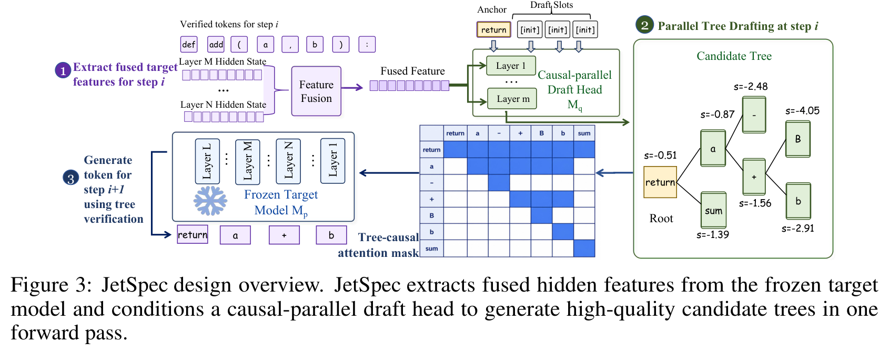
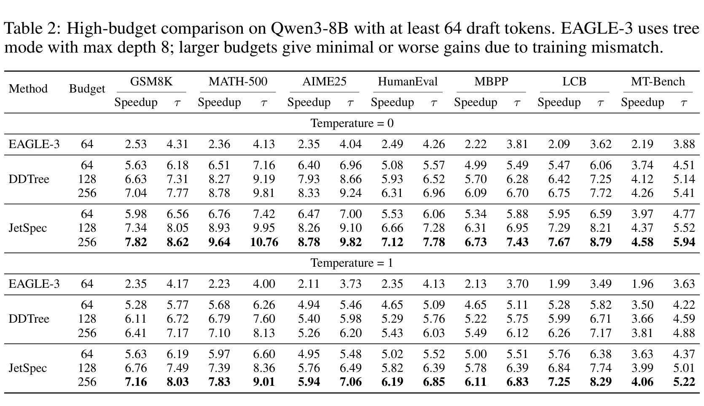
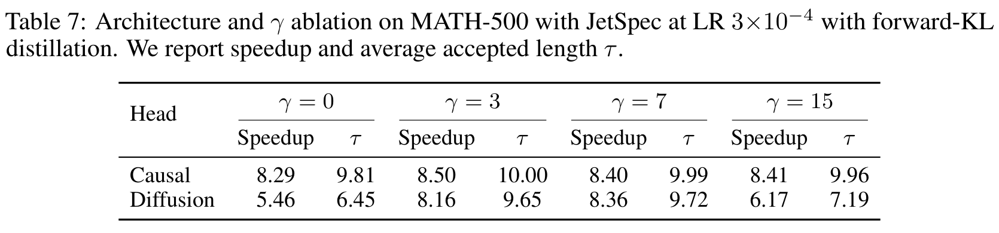
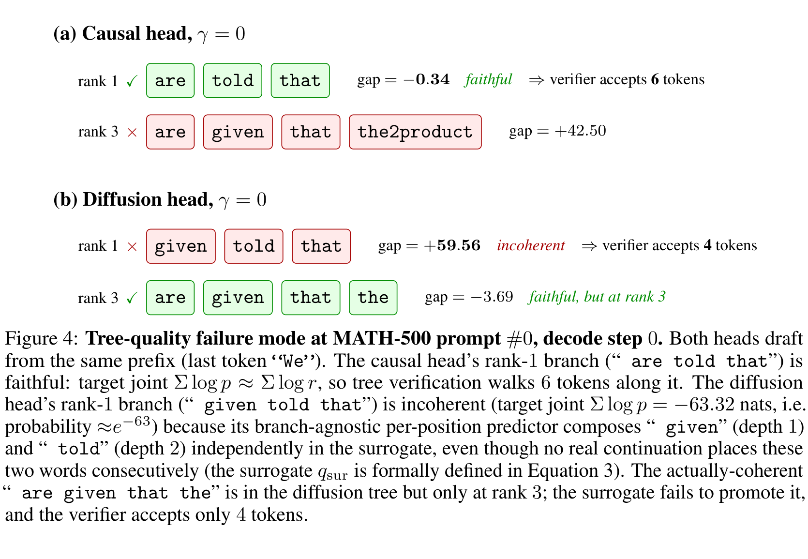

---
tags:
  - paper
  - collection/speculative-decoding
  - domain/model-systems
  - status/deep-review
  - topic/speculative-decoding
  - method/parallel-tree-drafting
document_type: paper
domain: speculative_decoding
collection: Speculative Decoding
review_status: deep-review
canonical: true
---

# JetSpec：打破推测解码扩展上限的并行树草稿——深度审阅

> [!info] 文档关系
> - 文档类型：Paper
> - 领域入口：[README](../README.md)
> - 上位汇总：[Evolution](../surveys/evolution.md)
> - 证据资产：`../assets/papers/jetspec/`
> - 相关文档：[Figure inventory](../evidence/figure-inventory.md)

> 论文：*JetSpec: Breaking the Scaling Ceiling of Speculative Decoding with Parallel Tree Drafting*
> 版本：arXiv:2606.18394v3（2026-06-25 修订，21 页）
> 状态：arXiv 预印本；截至 2026-07-25 未检索到公开 OpenReview 记录
> 代码：JetSpec 主仓库固定于 `2c7b3fae75690dfe9a188a37d7fdfd43ee0e032f`；vLLM 分支固定于 `f90d5ca17a2c05f436a80ee2e0984cc7a22e1a16`

## 修订信息

- 当前文档版本：`1.0.2`
- 当前修订 ID：`rev-jetspec-obsidian-properties-20260731`
- 当前修订时间：`2026-07-31T10:00:00+08:00`
- 替代版本：`rev-jetspec-affiliation-backfill-20260730` / `1.0.1`

| 修订 ID | 文档版本 | 时间 | 修订者 | 类型 | 替代修订 | 变更摘要 | 原因 | 影响位置 | 依据 | 对结论影响 |
|---|---|---|---|---|---|---|---|---|---|---|
| `rev-jetspec-affiliation-backfill-20260730` | `1.0.1` | `2026-07-30T23:30:00+08:00` | `/root` | `metadata-update` | `pre-affiliation-metadata` / `1.0.0` | 补充作者—机构元数据与角色证据边界 | 统一回填 affiliation 交付字段 | `作者与机构` | 论文 PDF 标题页、机构编号与角色脚注 | none：不改变方法、实验与归因结论 |
| `rev-jetspec-obsidian-properties-20260731` | `1.0.2` | `2026-07-31T10:00:00+08:00` | `/root` | `metadata-update` | `rev-jetspec-affiliation-backfill-20260730` / `1.0.1` | 增加 Obsidian YAML Properties 与层级标签 | 全量 canonical Paper 标签补齐 | 文件头 YAML frontmatter | 已验证的 ICML 2026 标签 schema；仓库覆盖矩阵 | none：不改变论文分析与证据结论 |

## 1. 一句话结论

### 作者与机构

- 第一作者（首位列名）：Lanxiang Hu → University of California, San Diego。
- 共同第一作者（仅含论文明确标注者）：论文未显式标注。
- 通讯作者/通讯联系人（仅含论文明确标注者）：论文未显式标注。
- 其他作者涉及的机构（去重列举，不作逐作者映射）：University of California, San Diego；Zhejiang University；University of Illinois Urbana-Champaign；Nanjing University；StepFun。
- 对应依据：论文 PDF 标题页、作者机构编号与角色脚注（核验日期：2026-07-30）。

JetSpec 最可信的贡献不是“单次前向为树中每个分支生成真正的分支条件分布”，而是：用深度因果掩码把一次并行草稿前向锚定到一条自回归式 rank-1 主干，再以累计对数概率扩展高预算候选树；它在 Qwen3-8B 的高预算实验中稳定提高接受长度和端到端加速，并显著降低无深度因果头对损失深度权重 $\gamma$ 的敏感性。证据对 rank-1 主干保真和高预算扩展较强，对 off-argmax 分支条件性、非贪心无损验证、跨模型/跨硬件普适性及各系统优化的独立收益则不足。

## 2. 来源状态、范围与审阅方法

### 2.1 一手材料

- 官方论文与源码：[arXiv:2606.18394v3](https://arxiv.org/abs/2606.18394v3)；PDF SHA-256 `500750163f56a3a49939667611b63e9091a3ebdc60503bb1d626a95d0e03c142`，source SHA-256 `6b0c5156ff2749f5df4a2f12013e957ea3cc6ee65784d4794679b8a3549ee2db`。
- 官方主代码：[hao-ai-lab/JetSpec](https://github.com/hao-ai-lab/JetSpec/tree/2c7b3fae75690dfe9a188a37d7fdfd43ee0e032f)，固定提交 `2c7b3fa…`。
- 官方 vLLM 分支：[JetSpec-project/vllm-jetspec](https://github.com/JetSpec-project/vllm-jetspec/tree/f90d5ca17a2c05f436a80ee2e0984cc7a22e1a16)，固定提交 `f90d5ca…`。
- 公共检查点：JetSpec Qwen3-8B、Qwen3-30B-A3B 及无 $\gamma$ DFlash 对照的 Hugging Face metadata/config 均已按固定 revision 核验。

### 2.2 证据等级

本文用五类证据标签：

| 标签 | 含义 |
|---|---|
| 直接 | 在尽量匹配的控制条件下改变目标因素并测量结果。 |
| 间接 | 现象与解释一致，但没有隔离目标因素。 |
| 混杂 | 多个模型、训练、运行时或预算因素同时变化。 |
| 缺失 | 论文提出或暗示结论，但没有足够可审计材料。 |
| 代码限定 | 仓库实现可确认机制或能力，但不自动证明论文表格使用了该路径。 |

本审阅没有重跑 H100/B200/H200 实验；因此数值均为论文报告值或明确标注的计算值。代码静态核对用于判断“实现是什么”，不能替代性能复现。

### 2.3 配图与生成图状态

- 论文机制图：`../assets/papers/jetspec/fig3-jetspec-design-caption.png`
- 论文主结果：`../assets/papers/jetspec/table2-high-budget-results-caption.png`
- 论文架构消融：`../assets/papers/jetspec/table7-causal-diffusion-gamma-ablation-caption.png`
- 论文机制案例：`../assets/papers/jetspec/fig4-tree-quality-failure-caption.png`
- QA：每图页码、原页尺寸、bbox、完整 caption 和逐图原分辨率复核结果见 [Figure inventory](../evidence/figure-inventory.md)。
- AI 生成分析示意图：未生成；该可选辅助图缺失不影响论文原图、公式、实验和代码证据。

## 3. 修订信息

- 当前版本：`1.0.0`
- 当前修订 ID：`rev-jetspec-b2-001`
- 修订时间：`2026-07-25T15:58:58+08:00`
- 修订者：`delegated-paper-review-agent`
- 类型：初始交付
- 前序修订：无
- 影响范围：本文、[Figure inventory](../evidence/figure-inventory.md)与证据边界
- 证据：arXiv v3 PDF/源码、固定提交代码、公共 checkpoint 元数据与论文原图 QA。
- 对结论的影响：初始结论，无迁移或未解决前序版本。

| 修订 ID | 文档版本 | 时间 | 修订者 | 类型 | 替代修订 | 迁移问题/解析 | 变更摘要 | 原因 | 影响位置 | 依据 | 对结论影响 |
|---|---|---|---|---|---|---|---|---|---|---|---|
| `rev-jetspec-b2-001` | `1.0.0` | `2026-07-25T15:58:58+08:00` | `delegated-paper-review-agent` | `initial` | 无 | 无 | 建立初始深度审阅及可审计证据链 | JetSpec B2 交付修复 | 本文与 [Figure inventory](../evidence/figure-inventory.md) | arXiv v3、固定代码提交、checkpoint metadata、原图 QA | 初始，无前序结论 |

## 4. 术语与符号

### 4.1 术语表

| 术语 | 定义 | 别名 | 来源 | 歧义与限定 |
|---|---|---|---|---|
| 推测解码 | 草稿模型先提出多个 token，目标模型并行验证并提交可接受前缀的无损加速框架。 | SD, speculative decoding | §2、§3.1 | “无损”依赖验证/采样算法正确；公开树实现目前主要是贪心路径。 |
| 因果并行草稿头 | 在一个块内使用深度下三角掩码，一次前向输出多个深度的草稿分布。 | causal-parallel draft head, causal head | §3.2、图 3、`draft_head.py` | “并行”指单次块前向；不是每个树分支分别条件化。 |
| 扩散头 | DFlash 风格、块内深度间无因果依赖的并行预测头。 | diffusion head, bidirectional head | §2.3、§3.1、表 7 | 论文把其树分布称为 branch-agnostic；$\gamma$ 调优可显著恢复表现。 |
| rank-1 主干锚定 | 后续深度 logits 条件于一次前向中较早深度的锚定 token，从而让最高分路径更接近自回归条件链。 | anchored trunk | 附录 A、图 4、代码 | 这是本审阅对论文和代码的精确化表述；off-argmax 分支仍继承同一组深度 logits。 |
| 分支无关边际 | 每一深度共用一组候选分布，所有父节点复用该分布。 | independent marginals, branch-agnostic predictor | 式 3、附录 A、`accum_logp.py` | JetSpec 默认树构造也复用深度 logits；区别主要在这些 logits 是否沿主干因果锚定。 |
| 树预算 | 单轮验证中扁平候选树的节点上限。 | budget, node budget | §3.3、表 2 | 论文表格有时把 64/128/256 称 draft tokens；实现中预算包含根节点，需按具体路径解释。 |
| 平均接受长度 | 每个推测步骤被目标模型接受的草稿 token 平均数。 | $\tau$, acceptance length | 表 1–11 | 通常不含 correction token；吞吐提升还取决于验证与调度成本。 |
| 累计对数概率树 | 以路径上各深度草稿 log-prob 之和为堆优先级，在预算内最佳优先扩展。 | accum-logp | §3.3、表 10、`accum_logp.py` | 分数是草稿代理分布，不一定等于真实目标分支联合概率。 |
| 树验证 | 目标模型用祖先可见掩码一次计算候选节点 logits，再选择最深完全匹配路径。 | tree verification | §3.4、附录 E、代码 | 主仓库和 vLLM 原生树路径均明确实现贪心匹配。 |
| 目标模型重生成 | 用冻结目标模型继续生成训练序列，再用其隐藏态/分布训练草稿头。 | regenerated continuations | §4.1、表 6 | 生成温度、长度、过滤细节未完整披露。 |

### 4.2 符号表

| 符号 | 含义 | 来源类型 | 范围/索引 | 单位或取值 | 来源 | 歧义 |
|---|---|---|---|---|---|---|
| $M_p$ | 目标模型 | 作者定义 | 全文 | Qwen3-8B/30B-A3B | §3.1 | 与概率分布 $p$ 对应。 |
| $M_q$ | 草稿模型/头 | 作者定义 | 全文 | 轻量头 | §3.1 | 公开实现是挂接冻结目标隐藏态的 head，不是独立小 LM。 |
| $N$ | 最大并行草稿深度 | 作者定义 | 单个推测步 | 主实验块大小 16 | 式 1–2、附录 | 某些早期 SD 文献用 $\gamma$ 表示 draft length；本文另用 $\gamma$ 表示损失权重尺度。 |
| $\alpha$ | 平均 token 接受率 | 作者定义 | iid 近似 | $[0,1]$ | 式 1–2 | 树接受并非真正 iid；公式是动机模型。 |
| $c$ | 单个草稿 token 成本相对一个目标 AR 步的比例 | 作者定义 | 延迟比 | 无量纲 | 式 2、附录 G | 并行头只有一次块前向，论文按 $N$ 摊销；不含全部树构建/验证开销。 |
| $\tau$ | 平均接受长度 | 作者定义 | 数据集平均 | token/步 | 各结果表 | 与接受率 $\alpha$ 不同。 |
| $B$ | 树节点预算 | 作者定义 | 单个推测步 | 64/128/255/256 等 | §3.3、表 2 | 实现是否计根节点随接口而异。 |
| $W$ | 每深度候选宽度 | 作者定义 | 树构造 | 案例为 7 | 附录 A | top-$W$ 仍来自每深度共享 logits。 |
| $r_i$ | 第 $i$ 深度的草稿边际分布 | 作者定义 | $i=1,\ldots,N$ | 概率分布 | 式 3、附录 A | 对 off-argmax 分支不是该分支祖先条件分布。 |
| $q_{\mathrm{sur}}$ | 将深度边际相乘得到的树路径代理概率 | 作者定义 | 路径 | 概率 | 式 3 | 可严重偏离目标联合概率。 |
| $p(y_i\mid x,\pi_{<v_i})$ | 目标模型在真实分支前缀上的条件概率 | 作者定义 | 树节点 $v_i$ | 概率 | 附录 A | 用于离线机制分析，不是默认树评分。 |
| $z_p^{(m)},z_q^{(m)}$ | 教师与学生在位置 $m$ 的 logits | 作者定义 | 训练位置 $m$ | 实数向量 | §3.2 | 对齐细节依赖冻结目标前向。 |
| $T_{\mathrm{KD}}$ | 蒸馏温度 | 作者定义 | 训练损失 | 正数 | §3.2 | 论文没有在主文给出最终数值。 |
| $w_i$ | 深度 $i$ 的损失权重 | 作者定义 | 块内位置 | $e^{-\max(i-i_a,0)/\gamma}$ | §4.3 | 论文规定 $\gamma=0$ 为“均匀无衰减”，不是该公式的通常极限。 |
| $\gamma$ | DFlash 风格深度损失衰减尺度 | 作者定义 | 训练 | 0, 3, 7, 15 | 表 7 | 与传统 SD 中 draft length 的常用符号冲突；本文 draft length 用 $N$。 |
| $H_i$ | 深度 $i$ 的熵 | 作者定义 | 树评分消融 | nats | 表 10 | 混合分数中的正号会奖励高熵，$\alpha$ 是另一个系数。 |
| $\Delta$ | 草稿代理 log-prob 与目标分支联合 log-prob 的差 | 分析派生 | 案例/提示平均 | nats | 图 4、附录 A | 正值越大代表代理过度乐观。 |

## 5. 论文级动机—问题—方案闭环

### 5.1 为什么需要这项工作

作者的起点是一个明确的系统约束：推测解码只有在接受率高、草稿成本低时才随草稿长度扩展。按论文的 iid 近似，单轮期望输出 token 数为

$$
\mathbb{E}[L]=\frac{1-\alpha^{N+1}}{1-\alpha},
$$

相对标准 AR 解码的理想加速为

$$
S(N,\alpha,c)=\frac{1-\alpha^{N+1}}{(1-\alpha)(Nc+1)}.
$$

这两式是**作者陈述的动机模型**，不是树解码实测的完整延迟模型。它清楚揭示两条互相牵制的路径：增大 $N$ 需要保持 $\alpha$，同时又不能让 $Nc$ 线性吞噬收益。

既有两类草稿器各解决一半问题。自回归/多头树草稿保持条件依赖，候选质量高，但随深度增加的串行或多步草稿成本形成上限；DFlash 类块并行头一次前向输出多个位置，成本低，却把每个深度的边际分布组合成树路径，容易把各自“局部合理、相邻不相容”的 token 拼到高排名分支。作者把目标问题定义为：**在一次草稿前向内恢复足够的深度因果结构，使高预算树扩展同时获得低草稿成本和高接受长度。**

### 5.2 方案如何逐步回应根因

图 3 给出作者主张的闭环：冻结目标模型提供多层融合隐藏特征；轻量草稿头在块内施加因果掩码；单次前向得到每深度候选 logits；累计对数概率算法在预算内构树；目标模型一次树注意力前向验证。

| 先前失败/约束 | JetSpec 设计 | 改变的变量或行为 | 因果机制 | 预期优化 | 测量证据 | 判断 |
|---|---|---|---|---|---|---|
| AR 草稿随深度增加多次前向 | 一次块前向输出 $N$ 个深度 | 草稿前向次数从随深度增长降为每轮一次 | 用小 head 的块并行计算摊薄成本 | 降低 $c$，允许更大预算 | 附录 G 每草稿 token 成本；表 2 高预算趋势 | 部分支持：成本表用 DFlash 代理头，非完整 JetSpec 树路径 |
| 扩散边际组合出不相容路径 | 深度下三角因果掩码 | 后一深度可见较早锚定 token | 提升 rank-1 主干条件一致性 | 提高 $\tau$，降低 $\gamma$ 敏感性 | 表 7、图 4、附录 A | 支持主干；不支持所有分支 |
| 单层目标特征不足以兼顾语义/局部信息 | 融合五个目标层隐藏态后投影 | head 输入包含跨层特征 | 复用冻结目标表征降低 head 容量需求 | 提高草稿分布拟合 | 架构/配置/代码 | 合理但缺独立消融 |
| 硬标签丢失候选相对偏好 | forward-KL 软标签蒸馏 | 学生覆盖教师概率质量 | 保留多候选排序信息 | 提高树评分与接受长度 | 表 4 | 仅小幅优于 SFT；反向 KL 明显差 |
| 每深度 top-$W$ 的组合空间爆炸 | 累计 log-prob 最佳优先构树 | 预算优先给高代理概率路径 | 在固定 $B$ 下最大化高分前缀覆盖 | 提高预算利用率 | 表 10、代码 | 直接支持，混合小 $\alpha$ 可相当 |
| 树节点不能用普通序列因果注意力验证 | 祖先掩码 + paged tree attention | 每节点只见祖先，所有节点并行验证 | 保持分支前缀语义并一次计算 logits | 降低验证轮数 | §3.4、附录 E、代码、表 11 | 功能支持；自定义内核独立加速量缺失 |

### 5.3 成功标准与实际边界

作者陈述或可直接推导的成功标准是：

1. 在预算从 64 增至 256 时，接受长度和端到端加速继续上升，而不是因草稿成本或质量下降饱和。
2. 在相同 $\gamma$ 下，因果头优于扩散头；在不同 $\gamma$ 下，因果头更稳定。
3. 在数学、代码、聊天任务及温度 0/1 上，优于 DDTree/EAGLE-3。
4. 在 serving batch/预算变化下仍有端到端吞吐收益。

总体判断为**部分支持**。表 2 广度和表 7 的匹配架构消融支持前两项；图 4 与附录 A 支持主干排序机制。但系统比较未把 head、训练配方、构树、内核逐项隔离，Qwen3-30B-A3B 证据不如 8B 完整，公开 vLLM 树验证只支持严格贪心设置，且默认树的 off-argmax 分支仍不是分支条件预测。

闭环可概括为：

> 高 $N$ 需要低 $c$+高 $\alpha$ → AR 草稿保条件但昂贵、扩散草稿便宜但主干不一致 → 深度因果块头把一次前向锚定到一致主干 → 累计概率在高预算中优先扩展该主干附近 → 树验证提升 $\tau$ 与加速 → 但非主干仍共享深度 logits，完整分支条件性和非贪心路径尚未闭合。

### 5.4 核心贡献与创新点

1. **低成本因果块头。** 在单次块前向中恢复深度因果依赖，目标是兼顾 DFlash 的低摊销草稿成本和 AR drafter 的主干一致性；图 3、表 7 与附录 A 是主要证据。
2. **面向高预算的候选树。** 用累计 log-prob 最佳优先扩展每深度候选，使预算从 64 到 256 时仍能增加 $\tau$ 与 speedup；表 2 和表 10 支持。
3. **跨层目标特征与目标分布对齐训练。** 融合冻结目标的五层隐藏态，并用目标重生成 continuation 与 forward-KL 训练 head；表 4、表 6 和 checkpoint 配置支持，但多层融合缺独立消融。
4. **树验证系统集成。** 实现祖先可见树注意力、paged KV、CUDA graph 与 vLLM serving 路径；附录 E、表 11 和固定代码支持功能存在，但系统优化的独立收益未隔离。

## 6. 方法重建与阶段边界

### 6.1 特征融合与轻量草稿头

Qwen3-8B 公共配置显示 head 为 5 个 decoder layer，隐藏维度 4096、32 个注意力头、8 个 KV 头、中间维度 12288；从目标层 `[1, 9, 17, 25, 33]` 取隐藏态，拼接成 $5d$，再经无 bias 线性投影和 RMSNorm 回到 $d$。目标 36 层被冻结，仅训练约 1.049B 参数的 head。Qwen3-30B-A3B head 为 8 层、隐藏维度 2048、约 474M 参数，目标层 `[1,12,23,34,45]`。

代码证据：固定提交中 `jetspec/models/draft_head.py` 的配置/构造、隐藏态投影和 decoder stack，以及公开 Qwen3-8B/30B checkpoint config。该容量不是“极小”的通常意义：8B head 超过十亿参数，但相对冻结目标及一次并行产出多个深度仍可低摊销成本。

### 6.2 因果并行到底条件于什么

训练/普通推理输入是 `[anchor, mask_1, ..., mask_{N-1}]`，显式注意力掩码是深度下三角。`draft_head_adapter.py` 默认一次 head forward 后直接返回每深度 logits；`accum_logp.py` 明确说明“每一深度的 children 对所有 parents 相同”。因此：

- **训练和一次草稿前向阶段**：深度 $i$ 能见 anchor 及较早深度的锚定内容/表示，构成一条因果主干。
- **树构造阶段**：每个深度只保留一组 logits，所有该深度父节点复用它们。
- **off-argmax 分支**：如果父节点偏离锚定主干，子分布并未重新条件于该分支。
- **可选条件化接口**：`propose_logits_conditioned` 可用给定 path 再做一次前向，但不是表 2 默认“一次前向树草稿”路径。

论文附录 A 已诚实承认：“off-argmax branches in the heap still inherit this anchored $r_2$”。因此主文“branch-wise tree-causal conditioning / all active tree nodes”的宽泛表述应收窄为“深度因果、主干锚定的共享边际”。

### 6.3 训练目标

对位置 $m$，教师与学生温度分布为

$$
\tilde p^{(m)}=\mathrm{softmax}(z_p^{(m)}/T_{\mathrm{KD}}),\quad
\tilde q^{(m)}=\mathrm{softmax}(z_q^{(m)}/T_{\mathrm{KD}}),
$$

每位置 forward KL 为

$$
\mathcal L_{\mathrm{FKL}}^{(m)}
=D_{\mathrm{KL}}\!\left(\tilde p^{(m)}\Vert\tilde q^{(m)}\right),
$$

总损失为

$$
\mathcal L_{\mathrm{train}}
=T_{\mathrm{KD}}^2
\frac{\sum_m w_m\mathcal L_{\mathrm{FKL}}^{(m)}}{\sum_m w_m}.
$$

消融中的深度权重写作

$$
w_i=\exp\left[-\frac{\max(i-i_{\mathrm{anchor}},0)}{\gamma}\right].
$$

论文又把 $\gamma=0$ **操作性定义**为均匀权重、无衰减；这不是上述式子的通常数学极限，复现者必须使用特殊分支，而不能直接代入零。

训练数据由 Nemotron Post-Training V2 的 780K 样本与 20K CodeAlpaca 组成，文中统称 800K mixture。作者用目标模型按 chat template 继续生成监督序列，块大小 16，每例最多 512 anchors，8 张 H100、micro-batch 2、主学习率 $3\times10^{-4}$。完整训练脚本、随机种子、目标生成温度/最大长度/过滤规则和全部环境锁定文件未公开，故训练复现不完整。

### 6.4 树构造与验证

每深度取 top-$W$ token 与 full-vocabulary-normalized log-prob，路径分数为

$$
\log q_{\mathrm{sur}}(y_{1:d}\mid x)
=\sum_{i=1}^{d}\log r_i(y_i\mid x).
$$

最大堆每次弹出累计 log-prob 最大的节点，并在预算 $B$ 内扩展下一深度。`accum_logp.py` 第 42–147 行与论文描述吻合。它优化的是共享深度代理分数，而不是真实目标分支联合概率。

目标验证为每节点构建祖先关系，使节点只注意根和自身祖先；随后比较每个 child token 与其 parent 位置的目标预测，取最深完全匹配路径，再附加最后接受节点的目标 correction token。主仓库 `tree/_core/accept.py` 和 vLLM `dflash_tree.py` 都实现这一贪心匹配。

论文 §3.4 还给出温度采样时标准 rejection-sampling 的概念公式（接受率 $\min(1,p/q)$ 与修正分布）。然而：

- 主仓库 `tree_accept` 在 $T>0$ 时只是从目标 logits 采样 posterior，再做 token 相等路径匹配，没有读取 draft probability $q$；
- vLLM `tree_accept` 对 `temperature != 0` 明确抛出 `NotImplementedError`；
- vLLM `_sample_dflash_tree` 要求 `all_greedy` 且无 penalty/bad words/logprobs。

因此表 2 温度 1 的“compliance with Equation”没有由所审固定提交的原生树代码完整支撑；可能使用了未公开/另一实验路径。该结果作为论文报告保留，但非贪心无损实现判为**缺失/实现不一致**。

## 7. 组件级设计理由与 rationale 矩阵

| 设计 | 理由状态 | 具体问题 | 因果机制 | 替代与取舍 | 验证证据 | 判断 |
|---|---|---|---|---|---|---|
| 多层目标隐藏态融合、只训练 head | 作者陈述 + 部分推断 | 独立 drafter 成本高，单层特征可能不足 | 复用冻结目标多层语义并减少可训练范围 | 更小/更少层 head 更省算力；独立 LM 更灵活 | 配置与代码；无层选择/容量消融 | 合理、未充分验证 |
| 深度因果掩码 | 作者陈述 | 扩散边际拼接不相容主干 | 后深度见先前锚定 token，改善 rank-1 条件一致性 | 双向头更并行对称；逐分支条件化更准确但需多次前向 | 表 7、图 4、附录 A、代码 | 主干直接支持；全树部分支持 |
| 目标重生成训练序列 | 作者陈述 | 原语料 continuation 与目标模型实际分布错位 | 让 head 训练于目标会访问的前缀/continuation | 原语料廉价、可复现；重生成昂贵且细节敏感 | 表 6 | 直接但生成配方缺失 |
| forward-KL 蒸馏 | 作者陈述 | 硬标签不保留多个候选的相对偏好 | 覆盖教师概率质量，辅助树候选排序 | SFT 简单且结果接近；reverse-KL 更 mode-seeking | 表 4 | forward-KL 略优于 SFT；反向 KL 显著差 |
| 累计 log-prob 构树 | 作者陈述 | 固定预算需要优先覆盖高价值分支 | 以路径代理概率做最佳优先分配 | 熵导向探索更广但会浪费预算；小权重 hybrid 可相当 | 表 10、代码 | 直接支持 |
| 祖先掩码、paged tree attention、CUDA graphs | 作者陈述 + 代码 | 普通序列注意力破坏树前缀，动态形状/掩码有开销 | 正确树可见性 + 融合内核 + 静态 capture bucket | 稠密 mask 简单但内存/带宽差；物理 KV 易实现但复制多 | 附录 E、两个仓库 | 功能代码支持；性能归因混杂 |
| 静态树预算 | 作者陈述 | 实现与 CUDA graph 需要可控形状 | 固定节点上限简化构图和验证 | 动态预算可适应不确定性、降低大 batch 压力 | 表 2、表 11 | 预算敏感性支持；动态策略缺失 |

## 8. 实验设计

目标模型为 Qwen3-8B 和 Qwen3-30B-A3B，主结果集中在 8B。任务覆盖 GSM8K、MATH-500、AIME25、HumanEval、MBPP、LiveCodeBench 和 MT-Bench，使用 non-thinking mode。离线实验称使用 8 张 H100 或 B200；表 7/附录 A 的源码注释或正文给出 4×B200。主表除特殊说明外使用优化 Triton 解码内核。

基线包括 EAGLE-3、DFlash 与其树变体 DDTree。比较公平性要分层看：

- EAGLE-3 最大树深度 8，论文称更大预算因训练错配收益很小；这不等于算法固有上限。
- DDTree 与 JetSpec 的树预算/目标模型接近，是更有意义的 bridge baseline，但 head 架构、训练目标/数据及运行时代码仍可能同时变化。
- 表 7 在同一 MATH-500、学习率、forward-KL 和 $\gamma$ 下比较 causal/diffusion head，是最直接的架构证据。
- 缺少多随机种子、置信区间、显著性检验和逐组件运行时分解。

## 9. 主结果：高预算扩展

温度 0、预算 256 时，JetSpec/ DDTree 的 speedup 与 $\tau$ 如下：

| 任务 | JetSpec speedup / $\tau$ | DDTree speedup / $\tau$ | speedup 绝对增益 | 相对增益（计算） |
|---|---:|---:|---:|---:|
| GSM8K | 7.82 / 8.62 | 7.04 / 7.77 | +0.78× | +11.1% |
| MATH-500 | 9.64 / 10.76 | 8.78 / 9.81 | +0.86× | +9.8% |
| AIME25 | 8.78 / 9.82 | 8.33 / 9.24 | +0.45× | +5.4% |
| HumanEval | 7.12 / 7.78 | 6.31 / 6.96 | +0.81× | +12.8% |
| MBPP | 6.73 / 7.43 | 6.09 / 6.70 | +0.64× | +10.5% |
| LCB | 7.67 / 8.79 | 6.75 / 7.72 | +0.92× | +13.6% |
| MT-Bench | 4.58 / 5.94 | 4.26 / 5.41 | +0.32× | +7.5% |

这些增益与更高 $\tau$ 同向，支持“候选质量改善是主要通道”。但表 2 不能把端到端增益全部归于因果掩码：模型 checkpoint、训练配方、构树/内核实现可能混杂。温度 1 时 JetSpec 同样在七项、预算 256 全部高于 DDTree，但固定公开代码没有对应的非贪心树 rejection 路径，故数值可信度依赖论文实验环境而非代码可复现性。

预算扩展方面，JetSpec 从 64 到 256 在温度 0 的 MATH-500 从 6.76×/7.42 增至 9.64×/10.76，DDTree 从 6.51×/7.16 增至 8.78×/9.81。JetSpec 的高预算优势扩大，但 DDTree 同样明显扩展，故“打破 ceiling”应理解为在本文预算/系统范围内延后饱和，而不是证明无上限扩展定律。

## 10. 消融、技术点证据矩阵与收益归因

### 10.1 最关键的架构消融

表 7 在 MATH-500 上给出：

- $\gamma=0$：因果 8.29×/$\tau=9.81$，扩散 5.46×/6.45；speedup +2.83×，相对 +51.8%，$\tau$ +3.36，+52.1%。
- $\gamma=3$：8.50×/10.00 对 8.16×/9.65。
- $\gamma=7$：8.40×/9.99 对 8.36×/9.72。
- $\gamma=15$：8.41×/9.96 对 6.17×/7.19。

这直接证明因果头对 $\gamma$ 稳定，而不是证明扩散头始终低质量；扩散头在 $\gamma=7$ 几乎追平 speedup。JetSpec 的最强架构主张应是**结构稳健性、减少损失权重调参依赖**。

### 10.2 其他消融

- 表 4：MATH-500 forward-KL 8.46×/10.01，SFT 8.42×/9.98，差异极小；reverse-KL 5.25×/6.59 明显下降。结论是“避免 reverse-KL”证据强，“forward-KL 必须优于 SFT”证据弱。
- 表 6：同一 800K mixture 下，目标重生成相对原 corpus 在预算 256 的各任务 speedup 大幅提高，例如 GSM8K 7.82× 对 3.36×。这是强效果，但重生成同时改变了训练序列分布，且缺生成细节。
- 表 10：累计 log-prob 8.15×/$\tau=9.81$，纯熵 4.76×/5.52；混合 $\alpha=0.25$ 为 8.27×/9.81，在小 $\alpha$ 范围与默认相当，$\alpha=8$ 降至 7.42×/9.00。直接支持高分路径优先，不能说明默认在所有任务最优。

### 10.3 技术主张矩阵

| 技术主张 | 证据 | 分类 | 审阅结论 |
|---|---|---|---|
| 一次并行前向降低每草稿 token 成本 | 式 2、附录 G | indirect（间接/代理） | 低摊销成本成立；附录用 DFlash 配置，不是完整 JetSpec 系统。 |
| 因果掩码修复扩散树的分支不一致 | 表 7、图 4、附录 A | direct（直接 + 机制） | 修复 rank-1 主干排序，不能推广到所有分支。 |
| JetSpec 对 $\gamma$ 鲁棒 | 表 7、附录 A | 直接 | 在 MATH-500 和所测四个 $\gamma$ 值支持。 |
| 高预算下优于 DDTree | 表 2 | confounded（混杂但广泛） | 七任务、温度 0/1 支持结果，归因不纯。 |
| forward-KL 优于硬标签 | 表 4 | 直接但效应小 | 部分任务/数值接近，措辞应保守。 |
| 重生成训练数据关键 | 表 6 | 直接替换基线 | 效果大，复现细节不足。 |
| 累计 log-prob 是有效构树分数 | 表 10、代码 | 直接 | 强于熵；与小权重 hybrid 相当。 |
| 温度 1 下保持无损正确性 | 论文式 6、表 2 | unverified（缺失/实现冲突） | 固定公开树代码不实现 $p/q$ rejection。 |
| 自定义树注意力内核带来主要性能增益 | 附录 E、代码 | 混杂 | 有实现，无 kernel-on/off 独立表。 |
| 可扩展至生产 serving | 表 11、vLLM 分支 | code-only + indirect | 单 H100 静态 batch/预算支持；功能限制严格。 |

### 10.4 接受收益与系统收益分开看

接受路径收益由表 7、图 4 和附录 A 直接连接到 $\tau$。端到端 speedup 还包含草稿头前向、top-k/GPU→CPU 转移、Python/CPU 堆构树、目标树前向、KV 提交和调度。主仓库 `accum_logp.py` 把 top-k 成对转到 host 并用 Python heap；vLLM 分支也有 CPU tree representation/hot path。高 $\tau$ 是必要但非充分条件。

## 11. 机制案例：从候选排序到接受长度

同一 MATH-500 prompt、decode step 0：

- 因果头 rank-1 为 “are told that”，草稿代理与目标联合差 $-0.34$ nats，树接受 6 token。
- 扩散头 rank-1 为 “given told that”，草稿代理 $-3.76$，目标联合 $-63.32$，过度乐观约 $59.56$ nats，只接受 4 token。
- 真正连贯的 “are given that the” 在扩散树中只排第 3。
- 因果头自身 rank-3 off-argmax 分支的 gap 可达 $+42.50$ nats，正好说明其非主干仍不是真正分支条件化。

50 个 MATH-500 prompts 的附录统计进一步显示：$\gamma=0$ 时扩散 rank-1 gap 超过因果的比例为 92%，中位 gap 为 +62.81 对 +12.36 nats；gap $\ge80$ 的比例 26% 对 0%，gap <5 的比例 6% 对 42%；平均接受长度 4.84 对 9.46。到 $\gamma=7$，扩散平均接受长度恢复到 9.42，因果为 9.64；极端 gap 比例 4% 对 2%。这组证据同时支持机制，也限制夸张解释：因果结构减少脆弱性，但适当损失权重能让扩散头接近。

## 12. Related Work：机制、公平性与新颖性

### 12.1 自回归/多头草稿

Medusa 类多头预测一次产生多个 future-token 候选，但各头的条件结构有限；Hydra、EAGLE/EAGLE-3 等通过串联、特征对齐或树建模提高条件性。优势是候选质量，代价是额外顺序依赖、训练复杂度或较高 head 成本。JetSpec 并非首次认识到“未来 token 之间需要因果依赖”，其差异在于把这种依赖放进一次块并行 head，并重点验证大树预算。

### 12.2 块并行、扩散与 Jacobi 路线

DFlash 是最接近的低成本基线：一次生成多个深度边际，草稿成本很低；DDTree/OPT-Tree 在其边际上构树。JetSpec 的核心批评是边际相乘不等于目标分支联合。Jacobi/迭代修正方法也可并行更新多个位置，但通常需要多轮迭代。公平的比较应同时匹配 head 参数量、训练数据、损失、树算法和内核；表 7 只完成其中一部分。

### 12.3 树验证与系统

SpecInfer 等工作已使用候选树和树注意力并行验证；JetSpec 的自定义 paged tree-attention、KV 组织与 CUDA graph 是工程推进，而非树验证概念首创。论文 Related Work 对 Hydra/OPT-Tree 的正式讨论偏薄：源码注释中出现不等于已发表文本中的充分比较。

### 12.4 检索式/提示式草稿

Prompt lookup、n-gram/retrieval speculative decoding 几乎无训练成本，在重复文本上强，但对开放式推理覆盖不足；JetSpec 用学习式 head 换取更广泛分布覆盖与额外 checkpoint/训练成本。

新颖性判断：**组合创新清晰，基础因果思想并非全新**。较可信的新意是“深度因果块头 + 共享目标多层特征 + 高预算树构造/验证系统”的联合设计和系统化扩展证据。

## 13. 代码与 checkpoint 交叉核对

### 13.1 主仓库关键路径

| 机制 | 本地证据 | 固定提交链接 | 结论 |
|---|---|---|---|
| 下三角块掩码 | `jetspec/models/draft_head.py` | [draft_head.py L97-L110](https://github.com/hao-ai-lab/JetSpec/blob/2c7b3fae75690dfe9a188a37d7fdfd43ee0e032f/jetspec/models/draft_head.py#L97-L110) | 深度 $j$ 仅见不晚于自身的 key。 |
| 目标 KV 与 head 状态拼接 | 同上 | [L153-L204](https://github.com/hao-ai-lab/JetSpec/blob/2c7b3fae75690dfe9a188a37d7fdfd43ee0e032f/jetspec/models/draft_head.py#L153-L204) | 实现冻结目标上下文条件化。 |
| 多层特征投影与 head stack | 同上 | [L319-L375](https://github.com/hao-ai-lab/JetSpec/blob/2c7b3fae75690dfe9a188a37d7fdfd43ee0e032f/jetspec/models/draft_head.py#L319-L375) | 配置与 checkpoint metadata 一致。 |
| 单次 depth logits | `jetspec/models/draft_head_adapter.py` | [adapter L52-L130](https://github.com/hao-ai-lab/JetSpec/blob/2c7b3fae75690dfe9a188a37d7fdfd43ee0e032f/jetspec/models/draft_head_adapter.py#L52-L130) | 默认输出每深度共享分布。 |
| 可选路径再条件化 | 同上 | [L193-L206](https://github.com/hao-ai-lab/JetSpec/blob/2c7b3fae75690dfe9a188a37d7fdfd43ee0e032f/jetspec/models/draft_head_adapter.py#L193-L206) | 需要额外 forward，不是默认表 2 路径。 |
| 累计 log-prob 堆构树 | `jetspec/tree/baselines/accum_logp.py` | [L42-L147](https://github.com/hao-ai-lab/JetSpec/blob/2c7b3fae75690dfe9a188a37d7fdfd43ee0e032f/jetspec/tree/baselines/accum_logp.py#L42-L147) | 注释明确 all parents 共享 depth top-k。 |
| 贪心接受 | `jetspec/tree/_core/accept.py` | [L144-L183](https://github.com/hao-ai-lab/JetSpec/blob/2c7b3fae75690dfe9a188a37d7fdfd43ee0e032f/jetspec/tree/_core/accept.py#L144-L183) | $T>0$ 是目标采样后 token 匹配，不是 $p/q$ rejection。 |

### 13.2 vLLM 分支关键路径

固定提交的 `vllm/v1/spec_decode/dflash_tree.py` 提供 CPU 构树、最优前缀/启发式树和 GPU greedy accept；`vllm/v1/attention/backends/tree_attn.py` 构建树注意力元数据、祖先 mask 与 CUDA graph buffer；`gpu_model_runner.py` 使用深度位置、树元数据、GPU accept 和 KV compaction。

最关键的限制是代码显式要求 greedy：`dflash_tree.py` 1172–1176 对非零温度抛错，`gpu_model_runner.py` 4304–4315 还禁止 penalties、bad words 和 logprobs。它说明公开 serving 集成是功能性但尚非通用采样器。

### 13.3 checkpoint 容量与算法/运行时分离

| checkpoint | 固定 revision | 公开性 | head 参数 | 算法配置 | 不能由 metadata 推断的内容 |
|---|---|---|---:|---|---|
| `JetSpec/jetspec-qwen3-8b` | `020a198caefde24a2891ad827cba7fb977ccdc36` | public, ungated | 1,048,626,432 BF16 | 5-layer, $d=4096$, causal head, block 16 | 训练随机种子、吞吐、kernel 路径 |
| `JetSpec/jetspec-qwen3-30b-a3b` | `67bfdf0a73a34c87efa1a82d4f90023e6bcb819b` | public, ungated | 473,995,264 BF16 | 8-layer, $d=2048$, causal head | 主表等量完整性与硬件效率 |
| `JetSpec/dflash-qwen3-8b-epoch6-3e-4-no-gamma` | `97b047532326a0cfe037fc0ea3927b34c5b1c6d1` | public, ungated | 1,048,626,432 BF16 | 同容量、`causal_head=false` | 是否正是表 7 所有单元使用的最终权重 |

同容量 causal/no-causal config 有利于架构比较，但 checkpoint metadata 本身不证明训练数据、步数和运行时完全匹配。

## 14. AI 基础设施分析

### 14.1 计算

训练报告 8×H100、micro-batch 2；离线评测用 H100 或 B200，机制案例为 4×B200；每草稿成本附录用单张 H200 NVL。未给训练总步数/总 GPU-hours、峰值 FLOP/s 或 model FLOP utilization，无法计算 MFU。

head 一次处理 $N$ 个块位置，注意力内部仍有 $O(N^2)$ 的块内注意力项，但 $N=16$ 很小；主要成本来自约 1B 参数的多层 head 权重读/矩阵乘。附录定义

$$
c=\frac{T_{\mathrm{draft}}}{N\,T_{\mathrm{verify}}},
$$

并报告长上下文、较大 $N$ 下 $c$ 降低（例如上下文 1024 时从 $N=16$ 的 0.845% 到 $N=256$ 的 0.054%）。这是把一次 block forward 除以 $N$ 的摊销代理，不含树构造、target tree verification、KV 提交和调度。

### 14.2 内存与带宽

公开 checkpoint 为 BF16 safetensors。仅按参数估算，8B head 权重约 $1.049\times10^9\times2\approx1.95$ GiB，30B-A3B head 约 0.88 GiB；实际模型加载还包括目标权重、KV cache、临时 activation、logits/top-k 和 allocator 开销。主仓库配置默认 BF16，vLLM 分支支持 paged KV、物理/逻辑树 KV layout 与异步 commit。

树验证若显式物化每请求 $B\times B$ dense mask，会形成 $O(B^2)$ 内存/带宽负担；论文称自定义 SM90 paged FlashAttention/CuTe DSL 内核在 shared memory 中 staging tree mask，代码也提供祖先 mask 和 tree bias 路径。没有 bytes moved、HBM throughput、L2 命中或 kernel timeline，故不能给有效带宽或 roofline 结论。

### 14.3 CPU/GPU 异构与运行时

GPU 完成 logits、top-k、target attention 和部分 accept；CPU/Python 仍可能执行 tree heap、请求调度与形状准备。主仓库 `_topk_pair_to_lists` 会 GPU→CPU 物化，vLLM 的 CPU tree hot path 同样存在 `.tolist()`；这在 batch 1 容易成为 host-bound 开销。vLLM 分支通过 GPU accept、CUDA graph capture sizes、paged KV 和异步 KV commit 降低部分同步，但 accepted depth 仍至少一次 `.item()` 同步。

没有多节点张量并行/流水并行实验或 NVLink/InfiniBand 通信量，因此 interconnect 可扩展性为缺失。NPU/CPU-only 支持未报告。

### 14.4 serving 表的内部不一致

PDF 表 11 caption 明确写 MATH-500，表值显示单 H100、batch 1 时预算 16/128 为 224.0/553.3 TPS（1.75×/4.33×）；batch 16 的最佳是预算 32：1094.6 TPS（3.81×），预算 128 反降为 803.1 TPS（2.80×）。这支持“大预算更适合小 batch，较大 batch 受验证/内存压力影响”。

但附录 E 前一段正文把表 11 称为 HumanEval；主文另一段还声称 batch 1 从 443.3 到 968.2 TPS（3.09× 到 6.75×），与 v3 实际表格不一致。应以 PDF 表格为可见数值证据，并把 dataset/旧数值冲突列为论文校对问题。

## 15. OpenReview 交叉核对

OpenReview API exact-term 搜索返回 `count: 0`；公开网页搜索也未定位到条目。精确 `content.title` API 查询收到 403，故不能证明不存在私有投稿。arXiv 源包含 `neurips_2026.sty` 仅表示模板选择，不是录用证据。没有公开 review、rebuttal、decision 或 discussion 可交叉核对；该项记为不可用证据，不作推测。

## 16. 局限、风险与可复现性

1. **默认树不是完整分支条件模型。** 共享每深度 logits 只让 rank-1 锚定主干更可信；off-argmax 分支仍继承错误前缀条件。
2. **非贪心证据链断裂。** 论文报告温度 1 且给出 rejection 公式，公开树实现却只完整支持 greedy。
3. **训练不可完整复现。** 无完整训练脚本、环境锁、种子、目标重生成参数和原始实验日志；源码注释暴露内部日志路径但这些不是交付数据。
4. **系统归因混杂。** head、训练数据、loss、树算法、Triton/CuTe kernel、KV 路径共同作用，缺逐项 latency breakdown/kernel-on-off。
5. **统计不充分。** 无多种子误差、置信区间或显著性测试。
6. **范围有限。** 核心证据以 Qwen3-8B、MATH-500 和 NVIDIA GPU 为主；30B-A3B、不同模型族、长上下文、多节点与异构硬件证据弱。
7. **成本指标可能过度乐观。** $c$ 是 DFlash proxy head 的 per-token 摊销，不是端到端树轮次的增量成本。
8. **serving 文本/表格不一致。** 表 11 的 dataset 与数值在正文、caption 之间冲突。
9. **预算定义需谨慎。** 论文“draft tokens”与代码“含根节点的 num_nodes”可能有一位差。
10. **公开代码时点晚于论文 v3。** 主仓库提交为 2026-06-27，晚于 arXiv v3 两天；代码能力不能自动归入所有论文实验。

## 17. 可迁移启发与后续实验

- 把“完整树条件化”拆成两层目标：廉价的 rank-1 主干锚定和昂贵的选择性 off-argmax 再条件化；只对高质量/高不确定分支调用 `propose_logits_conditioned`，可能获得更好质量—成本折中。
- 动态预算应联合使用 top-1/top-2 gap、熵、batch pressure 和目标验证成本，而不是固定 $B$；表 11 已显示预算最优点随 batch 改变。
- 需要一个严格匹配的 $2\times2$ 因果实验：causal/diffusion × regenerated/corpus，在相同参数量、loss、步数、kernel 下报告 $\tau$、draft latency、verify latency、tree CPU latency。
- 为非贪心树实现节点级 $p/q$ rejection 与 correction distribution，并做分布等价性测试，而不只是温度采样后 token 匹配。
- 报告完整的延迟分解和有效带宽：head GEMM、top-k、D2H、CPU heap、tree attention、accept、KV commit、scheduler；同时给静态/动态 CUDA graph 命中率。
- 把附录的 rank-1 gap 扩展为 rank-$k$、不同深度和真实被访问分支的校准曲线，直接评估“预算花在何处”。

## 18. 最终判断

JetSpec 对一个真实的系统瓶颈给出了有洞察力的折中：一次因果块前向让低草稿成本与较高主干一致性兼得，累计概率树又把这种质量转化为高预算下更长接受路径。表 7 和图 4 是最有说服力的因果证据，表 2 展示了广泛但混杂的端到端收益。论文最需要收敛的表述是“branch-wise causal”：固定代码和附录共同说明默认方法更准确地说是**argmax 主干锚定、深度共享边际的因果并行草稿**。在这个限定下，工作仍有明确价值；若要把结论升级为通用、无损、生产级的并行树草稿系统，还需要非贪心验证、逐组件系统消融、完整训练复现和动态 serving 策略。
