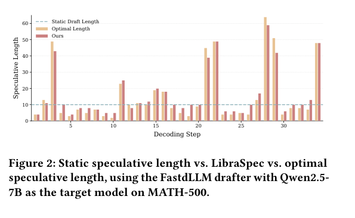
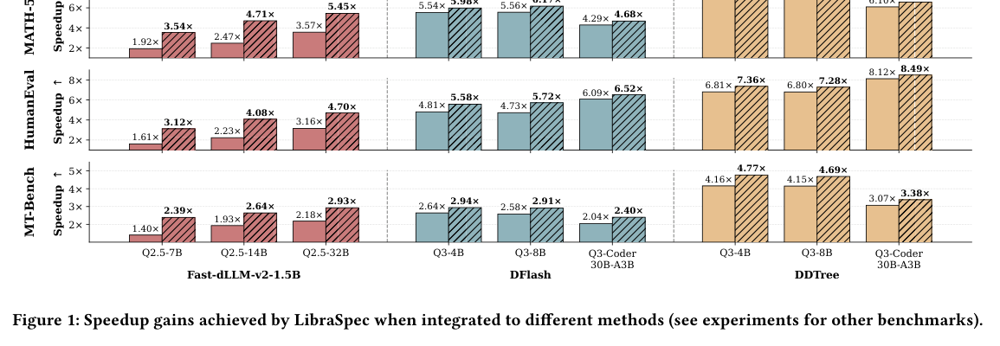
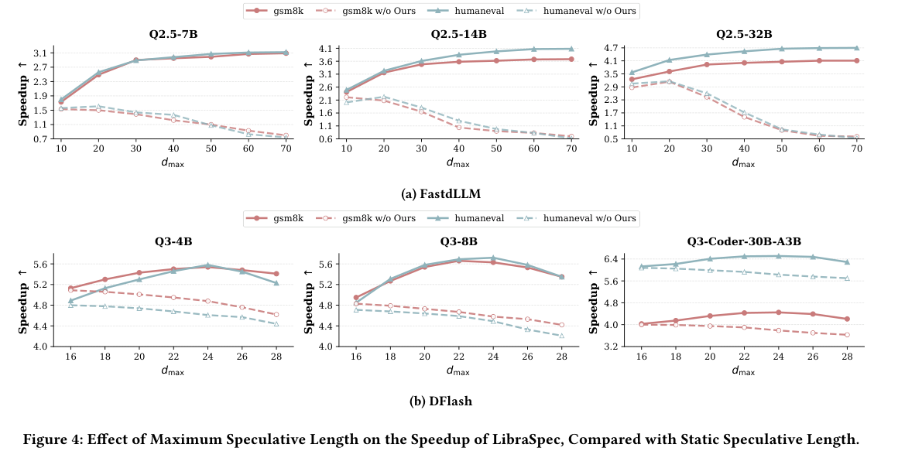
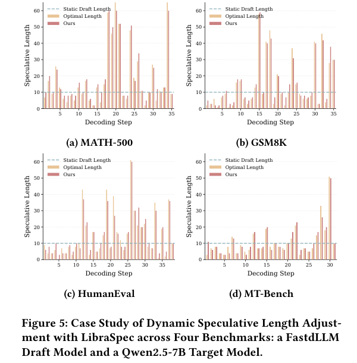
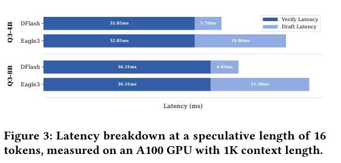

---
tags:
  - paper
  - collection/speculative-decoding
  - domain/model-systems
  - status/deep-review
  - topic/dynamic-speculative-length
  - method/marginal-gain-optimization
document_type: paper
domain: 02_model_systems/speculative_decoding
collection: speculative-decoding
review_status: deep-review
canonical: true
---

# LibraSpec: Dynamic Diffusion-Based Speculative Decoding via Marginal-Gain-Driven Optimization 精读分析

> [!info] 文档关系
> - 文档类型：Paper
> - 领域入口：[README](../README.md)
> - 上位汇总：[Evolution](../surveys/evolution.md)
> - 证据资产：`../assets/papers/libraspec/`
> - 相关文档：[Figure inventory](../evidence/libraspec-figure-inventory.md)

LibraSpec 解决的不是“怎样造出更准的草稿”，而是扩散式 drafter 已经并行造出一批候选后，**究竟送多少个给大模型验证才最省时间**。它把旧方法的“预测会接受几个”改写成“新增一段的接受收益，是否值得新增验证成本”，再用 drafter 置信度在线近似这个判断。论文的端到端结果很强，但要把结论说准：理论收敛针对使用真实接受概率、近似常数边际验证成本的理想目标；实际 LibraSpec 用 $q_i$ 和超参数 $\alpha$ 代替不可提前知道的量，所以实验支持“这套近似通常更快”，并没有证明每一轮实际选出的长度都是全局最优。

> 资料状态：已核验 arXiv:2608.08721v1 PDF、LaTeX source 和全部公式/表格；未发现公开代码或 OpenReview 页面。正文使用 5 张带完整 caption 的 PDF 裁剪图，均完成 contact-sheet 与逐图原分辨率 QA。

## 修订信息

- 当前文档版本：`1.0.0`
- 当前修订 ID：`rev-libraspec-initial-20260902`
- 当前修订时间：`2026-09-02T18:00:00+08:00`
- 替代版本：无（initial）

| 修订 ID | 文档版本 | 时间 | 修订者 | 类型 | 替代修订 | 迁移问题/解析 | 变更摘要 | 原因 | 影响位置 | 依据 | 对结论影响 |
|---|---|---|---|---|---|---|---|---|---|---|---|
| `rev-libraspec-initial-20260902` | `1.0.0` | `2026-09-02T18:00:00+08:00` | `/root` | initial | 无 | 无 | 建立完整精读、五张视觉证据、发布链路与证据边界 | 用户要求按标准交付 | 全文、figure inventory、manifest | arXiv v1 PDF/source、逐图 QA | material |

## 0. 资料与配图索引

- 论文：[arXiv:2608.08721v1](https://arxiv.org/abs/2608.08721)
- PDF：`paper.pdf`；LaTeX source：`source/`；提取文本：`extracted_text/`
- 开源代码：未发现公开仓库；因此实现级断言只来自 Algorithm 1 和 Appendix B。
- OpenReview：未发现公开页面，不能做 reviewer/rebuttal 交叉核验。
- 原论文图：Figure 1–5，见本文各相关章节与 `figure_inventory.md`。
- AI 生成图：生成接口权限失败；未用占位图。Figure 2 与 Algorithm 1 足以覆盖输入、在线调整、验证和输出。

## 0.1 术语与符号解释

### 0.1.1 术语表

| 术语 | 本文含义 | 不等于/易混项 | 证据来源 |
|---|---|---|---|
| speculative length | 一轮里提交给 target 并行验证的候选 token 数 $d$ | 不一定等于 drafter 已生成数量，也不等于最终接受数量 | §1、§3.2 |
| prefix acceptance | 一旦某位置被拒，后续候选即使单独看正确也不能直接提交 | 不是逐位置彼此独立接受 | §3.1、Theorem 3.3 |
| single beneficial adjustment | 从 $d$ 调到 $d'$ 后，期望加速比严格增大的一次调整 | 实际算法的置信度近似并不自动等价于理论定义 | Definition 3.1 |
| marginal benefit | 新增或移除片段带来的期望接受 token 数 | 不是单个 token 的 $q_i$；前缀存活使各位置相乘 | Theorem 3.2 |
| draft budget $B$ | 当前已生成、尚未消费的候选 token 额度 | 不是显存预算或 target verification budget | Algorithm 1、§3.4 |
| oracle length | 对当前解码步穷举得到的最优验证长度 | 线上不可获得，只作案例对照 | Figure 2、Figure 5 |
| calibration | drafter 置信度 $q_i$ 与 target 实际接受概率 $p_i$ 的一致程度 | 高置信度不保证 target 接受；长 horizon 会恶化 | Assumption 3.7、§4.6 |

### 0.1.2 符号表

| 符号 | 含义 | 性质 | 作用域 | 单位/取值 | 来源 | 易混点 |
|---|---|---|---|---|---|---|
| $d,d'$ | 调整前、后的验证长度 | author-defined | per decoding round | 正整数 | §3.2–3.4 | $d'$ 是理论候选或实际估计结果，需看上下文 |
| $\tau_d$ | 长度为 $d$ 时连续接受的 token 数 | author-defined | per round / expectation | tokens | Eq. 1 | 表中 $\tau$ 是全数据平均 |
| $\eta_d$ | 相对自回归 target 的加速比 | author-defined | per configuration | ratio | Eq. 1 | “额外 0.5×”是加速比差值，不是相对百分比 |
| $T_d^{\mathrm{draft}},T_d^{\mathrm{verify}}$ | 生成/验证长度 $d$ 候选的时间 | author-defined | per round | ms | Eq. 1 | 简化理论忽略前者随 $d$ 的变化 |
| $L_d^{\mathrm{target}}$ | target 普通自回归每 token 延迟 | author-defined | per setting | ms/token | Eq. 1 | 不是整轮 target latency |
| $p_i$ | target 对第 $i$ 个候选的接受概率 | author-defined | per position | $[0,1]$ | §3.1 | 验证前不可知 |
| $q_i$ | drafter 给第 $i$ 个候选的置信度 | author-defined | per position | $[0,1]$ | §3.1、Assumption 3.7 | 实际算法把它当 $p_i$ 的替代量 |
| $c$ | 每新增一个验证位置的平均成本 | author-defined | model/runtime | time/position | §3.3 | 近似为常数，真实 kernel 可能非线性 |
| $\epsilon_i$ | 从位置 $i$ 看仍满足边际条件的最大末端位置 | author-defined | per start position | token index | Theorem 3.3/3.4 | 最终取所有 $i$ 的最小值 |
| $\alpha$ | 吸收 $T_i^{\mathrm{verify}},\tau_i,c$ 的实用权衡系数 | author-defined | per drafter config | 论文设 FastdLLM 2.0，DFlash/DDTree 2.2 | §3.4、§4.5 | 不是由运行时直接测出的精确成本 |
| $n$ | drafter 每次生成的 block size | author-defined | per drafter | tokens | Algorithm 1 | 初始 $d=n$ |
| $B$ | 已生成但尚未用于扩展的草稿预算 | author-defined | per round | tokens | Algorithm 1 | 可因扩展先变负，再触发补块 |
| $d_{\max}$ | 在线扩展长度上限 | author-defined | per drafter | FastdLLM 60；DFlash/DDTree 24 | §3.4、Appendix B | 既控制计算，也限制置信度失准风险 |

## 0.2 算法总览证据



> 原论文 Figure 2。黄色是逐步穷举的 Oracle，红色是 LibraSpec，蓝色虚线是固定长度 10。它展示“每轮最优长度会大幅变化”和“在线估计可跟踪变化”，但只是一条 MATH-500 轨迹，不是普遍最优性证明。

## 1. 论文基本信息

- 标题：*LibraSpec: Dynamic Diffusion-Based Speculative Decoding via Marginal-Gain-Driven Optimization*
- 版本：arXiv:2608.08721v1，2026-08-09；cs.CL / cs.AI；尚无正式 venue 信息。
- 完整作者列表：Zexun Lin、Yuan Feng、Junlin Lv、Kevin S. Zhou、Xike Xie。
- 第一作者及机构（role basis: first listed author；evidence: PDF title block, affiliation 1）：

| 作者 | 身份依据 | 所属机构 | 对应依据 |
|---|---|---|---|
| Zexun Lin | 论文首位作者；无共同一作标记 | Suzhou Institute for Advanced Research, University of Science and Technology of China | `main.tex` author block |

- 通讯作者及机构（role basis: `\correspondingauthor` marker in title block；evidence: PDF title block corresponding-author marker）。role basis: \correspondingauthor marker in title block。

| 作者 | 身份依据 | 所属机构 | 对应依据 |
|---|---|---|---|
| Xike Xie | `\correspondingauthor` 明确标记 | Suzhou Institute for Advanced Research, University of Science and Technology of China | `main.tex` author block |

- 其余作者涉及机构：Suzhou Institute for Advanced Research, University of Science and Technology of China。全局作者证据：paper.pdf first page title block and affiliations。
- 核心问题：扩散式 drafter 的生成边际成本很低时，怎样按当前上下文动态决定“值得验证”的候选长度。
- 关键假设：prefix acceptance；新增位置的条件边际收益不增；验证边际成本近似常数；$q_i$ 与 $p_i$ 足够校准。

## 2. 研究动机与问题—方案闭环

### 2.1 出发点与背景痛点

普通动态长度策略主要来自自回归 drafter：每多草拟一个 token，都要再串行跑一步小模型，所以预测“最终能收几个”能同时避免无效 drafting 和 verification。扩散式 drafter 改变了成本结构，它一次并行产出一个 block，额外候选已经较便宜；真正昂贵的是把多少位置送入 target。

论文因此指出，**接受概率高不等于值得验证**。某个尾部 token 即使较可能被接受，只要它带来的期望接受增量小于 target 为它扩展验证张量的成本，整体 token/ms 仍可能下降。这是作者明确陈述的动机（Introduction、§3.2）。

### 2.2 现有方案为何不够

旧方法有两个可观察的失败端。第一，固定短长度在容易段落里浪费 target 的并行能力；第二，固定长长度在难 token 很早出现时验证大量注定不能提交的后缀。Figure 2 中 Oracle 从约 3 到 60+ token 跳变，说明同一请求内部也不存在一个一直合适的长度。

本文构造一个说明例，不是论文实验：当前长度 10，每轮平均接受 8 个；再加入 5 个候选，平均只多接受 0.5 个，却让 target 验证时间从 10 ms 增到 15 ms。旧策略看到尾部仍有非零接受概率，可能继续扩；但效率从 $8/10=0.8$ token/ms 变成 $8.5/15\approx0.57$ token/ms。把置信度阈值调高只能间接限制长度，仍没回答“多出的接受收益是否抵得过这台机器上的验证成本”。

验证器记录的 concrete scenario 1：Figure 2 中 Oracle 长度在约 3 到 60+ token 间跳变，任一固定值都会在部分轮次偏离；simple-fix explanation 1：只调高置信度阈值仍不知道新增收益是否抵消验证耗时。
验证器记录的 concrete scenario 1：Figure 2 中 Oracle 长度在约 3 到 60+ token 间跳变，任一固定值都会在部分轮次偏离。

| 现有做法 | 可观察失败 | 场景来源 | 根因 | 为什么简单补丁不够 | 证据 |
|---|---|---|---|---|---|
| 固定长度 | 易段过短、难段过长 | paper-provided | 上下文可预测性逐步变化 | 换一个固定值只是在两种浪费间移动 | Figure 2、5 |
| 预测 accepted length | 高接受候选仍可能拉低整体速度 | reviewer-created numerical example | 只看收益，不看 verification cost | 提高置信阈值仍未建模硬件成本 | Introduction、Theorem 3.2 |
| 一次性启发式增减 | 对快速变化的最优点反应滞后 | G4-style：全收 +2，否则 -1 | 更新幅度不由收益/成本决定 | 调大步长可能过冲，调小又跟不上 | Appendix B、Table 1 |

### 2.3 论文计划解决的问题与成功标准

- 每轮用已有信号选择验证长度，不训练额外 predictor。
- 新长度在理论模型下提高期望加速比，并通过迭代走向最优区间。
- 能插到 FastdLLM、DFlash、DDTree 上；适用于 greedy 和 temperature 1 sampling。
- 用端到端 speedup $\eta$、平均接受长度 $\tau$ 和 Oracle 长度偏差验证。
- 不解决 drafter 训练、target kernel 本身、并发 serving 调度，也不保证 $q_i$ 严格等于 $p_i$。

### 2.4 核心方案如何解决并优化问题

方案先把速度写成“接受 token 数 / draft+verify 时间”，再比较新增片段的边际效率和当前平均效率：新增片段更划算才扩，低于当前平均才剪。实际运行时，用已经生成候选的 $q_i$ 代替不可提前获得的 $p_i$，用 $\alpha$ 折叠 runtime 成本，按 block 补充候选，并以 $d_{\max}$ 截止。

| 原问题 | 设计 | 改变的变量/行为 | 预期指标 | 证据 | 判断 |
|---|---|---|---|---|---|
| accepted length 不等于速度最优 | 边际收益/成本判据 | 从预测 $\tau$ 改为优化 $\eta$ | speedup | Theorem 3.2、Table 1 | 理论直接；实践间接 |
| $p_i$ 验证前不可知 | 以 $q_i$ 近似 | 在线可计算 $\epsilon_i$ | 无额外训练 | Assumption 3.7、Figure 5 | 机制可行，依赖校准 |
| 逐 token 扩展会频繁调用 drafter | block + budget $B$ | 批量补草稿 | draft latency/I/O | Algorithm 1 | 无独立消融 |
| 长 horizon 失准 | $d_{\max}$ | 限制在线搜索范围 | 稳定 speedup | Figure 4 | 有敏感性证据 |
| 估计噪声导致来回振荡 | 一次回退即停 | 截断调整次数 | 稳定性/控制开销 | §3.4 | 作者陈述，无消融 |

### 2.5 完整因果链与证据闭环

扩散 drafter 把草稿边际成本压低（Figure 3）→ 旧动态策略仍只估计接受长度 → 它可能验证“会接受但不够划算”的尾部 → LibraSpec 改为比较新增接受收益和新增验证成本（Theorem 3.2）→ 用 $q_i,\alpha$ 实现在线近似并按 block 扩展（Algorithm 1）→ 选出的长度更靠近局部 Oracle（Figure 5）→ 平均接受长度和端到端 speedup 同时上升（Table 1–3、Figure 1）。

直接验证的是：扩散 drafting 比 EAGLE-3 便宜、长度会逐轮变化、加 LibraSpec 后三类 drafter 多数配置更快、$\alpha$ 和 $d_{\max}$ 有一定稳健区间。间接支持的是“长度跟踪导致速度提升”，因为没有把每个设计逐项消融。尚未直接验证的是：实际 $q_i$ 近似下的每次调整必然增速、不同 GPU/kernel/并发下常数 $\alpha$ 是否仍成立，以及一次回退和 budget $B$ 各自贡献。

## 3. 核心贡献与创新点

1. 把扩散式 speculative decoding 的动态长度目标从 accepted-length prediction 改成 expected-speedup optimization（Introduction、Eq. 1–2）。
2. 给出边际判据、位置级必要/充分条件、单峰性和有限步收敛证明（Theorem 3.2–3.6）。
3. 用 $q_i$、$\alpha$、$B$ 和 $d_{\max}$ 把理想判据落成免训练在线算法（Algorithm 1）。
4. 在 6 个 target、3 种扩散 drafter、4 个任务、两种采样设置上验证可插拔性（Table 1–3）。

## 4. 研究方法

### 4.1 方法总览

一轮开始时，扩散 drafter 先并行生成 $n$ 个候选及置信度。LibraSpec 从 $d=n$ 开始，用各位置后的“连续被接受概率”估计还能安全扩到哪里；若建议更长，先消费已经生成但没用完的 budget，不足才再生成完整 block；若建议变短，只回退一次并结束。最后把前 $d$ 个候选交给 target 一次验证，按标准 speculative decoding 规则接受最长前缀并纠正首个错误。

### 4.2 组件级设计动机与具体问题映射

**设计一：边际判据不是换个置信度阈值，而是换优化问题。** 如果只问“下一个 token 会不会被接受”，会忽略把 target 验证张量从 $d$ 扩到 $d'$ 的时间。LibraSpec 问的是“新增片段每单位验证成本带来多少接受 token，是否高于当前整段平均值”。这能阻止高置信但低性价比的尾部稀释速度。代价是必须假设验证成本可用一个近似线性模型描述；Theorem 3.2 直接支持理想判据，Table 1 只间接支持实用近似。

**设计二：用 $q_i$ 替代 $p_i$，换来在线可用，也引入最关键偏差。** target 的真实接受概率只有验证后才知道，若先跑 target 再选长度就失去意义。drafter 已经输出 $q_i$，所以算法直接拿来估计前缀存活概率。好处是免训练、几乎不增加模型参数；问题是 drafter 可以过度自信，而且越远位置越容易失准。Figure 4 显示不同 drafter 的有效 $d_{\max}$ 不同，这恰好说明近似不是无条件成立。

**设计三：$\alpha$ 把难以实时测量的成本折成一个旋钮。** 理论式需要 $T_i^{\mathrm{verify}},\tau_i,c$，它们随模型、batch、context 和 kernel 变化。论文没有每轮测这些量，而是吸收到 $\alpha$。这让集成简单，但也把“理论无超参最优”变成“实践需按 drafter 选 2.0 或 2.2”。Table 4 显示一段范围内都优于静态基线，却也显示最优值因 drafter 改变。

**设计四：block budget $B$ 是控制面优化，不是接受率算法。** 若每算出多两个候选就调用一次 diffusion drafter，控制开销和 I/O 会吞掉收益。算法一次生成 $n$ 个，把未消费位置记进 $B$；只有扩展超过库存才补完整 block。它降低 drafter 调用频率，但可能多生成最终没有验证的候选。论文没有移除 $B$ 的受控消融，所以“减少 I/O”是作者陈述和算法结构支持，不是量化归因。

**设计五：$d_{\max}$ 与一次回退是实际稳定器。** $d_{\max}$ 防止在长 horizon 继续相信失准的 $q_i$，Figure 4 给出直接敏感性证据。一次回退后立即停止，则是避免置信度估计与长度反复相互影响而振荡；其代价是可能过早停在次优点。论文明确解释了这个动机，但没有“允许多次回退”的对照，因此稳定性收益未被隔离。

汇总如下，表格只用于索引，不替代上面的解释。

| 设计项 | why 来源 | 针对问题 | 权衡 | 验证 | 判断 |
|---|---|---|---|---|---|
| 边际判据 | author-stated | 只看接受、不看成本 | 依赖成本模型 | theory + end-to-end | 部分直接支持 |
| $q_i$ 近似 $p_i$ | author-stated assumption | target 概率不可提前知 | 校准偏差 | Figure 4/5 | 间接支持 |
| $\alpha$ | author-stated | runtime 量难在线精确测 | 需调参且硬件相关 | Table 4 | 敏感性支持 |
| budget $B$ | author-stated | 频繁 drafter 调用 | 可能过量生成 | 无消融 | 未隔离 |
| $d_{\max}$ | author-stated | 长 horizon 失准 | 可能截断真最优 | Figure 4 | 直接支持 |
| 一次回退 | author-stated | 振荡和额外计算 | 可能保守 | 无消融 | 未隔离 |

### 4.3 模型/系统架构与在线状态流

LibraSpec 不是新神经网络，而是夹在 diffusion drafter 和 target verifier 之间的在线控制器。它不改 target 权重、不训练 predictor，也不改标准 accept/correct 合同。读者可以把它理解为一个每轮重置的小状态机：

```text
输入 prefix x<=t
  -> drafter 一次生成 n 个 token + q[1:n]
  -> 状态初始化 d=n, B=0
  -> 计算每个起点 i 的 epsilon_i，取 epsilon*=min_i epsilon_i
     -> epsilon* <= d：回退到 epsilon*，立即停止调整
     -> epsilon* > d：扩展 d；先扣 B
          -> B >= 0：已有草稿够用，继续计算
          -> B < 0：按 ceil(-B/n) 补完整 block，更新 B，继续计算
  -> d 达到 d_max 或触发回退
  -> target 并行验证前 d 个候选
  -> 输出最长接受前缀 + 首个纠正 token，进入下一轮
```

这里有三条必须分开的边界。第一，**理论层**用真实 $p_i$ 和近似常数 $c$ 证明期望速度关于 $d$ 单峰；第二，**算法层**用 $q_i$ 和固定 $\alpha$ 估计 $\epsilon_i$；第三，**系统层**按 block 生成和 budget 复用控制调用次数。理论层的“beneficial”不能无条件套到后两层。

状态变化也很具体：$d$ 决定 target verification 的序列长度；$B$ 只记录候选库存，不进入接受规则；$q_i$ 只用于选长度，不改变 target 的最终输出分布；$d_{\max}$ 同时限定显存/验证开销和置信度外推范围。训练边界是“无新增训练”，部署边界是必须能从 drafter 取得逐位置 confidence，并能接受动态 verification shape；论文未讨论 CUDA Graph 多 shape 捕获和高并发 batch 拼接。

### 4.4 关键公式

公式 F1 的 purpose：计算验证长度 d 的接受收益与草稿、验证耗时合并成端到端加速比。
本卡使用的变量名也可写作 `tau_d`（接受 token 数）、`T_d^draft`（草稿耗时）、`T_d^verify`（验证耗时）和 `L_d^target`（target 单 token 延迟）。
符号索引：tau_d、T_d^draft、T_d^verify、L_d^target。

$$
\eta_d=\frac{\tau_d L_d^{\mathrm{target}}}{T_d^{\mathrm{draft}}+T_d^{\mathrm{verify}}}.
$$

**这条公式在算什么？** 长度 $d$ 的 speculative round 相对 target 逐 token 解码快多少。

**怎么读？** 一轮省下的 target 串行时间，除以这一轮实际 draft+verify 时间。

**输入与输出。** 输入是平均接受数、target 单 token 延迟及两段耗时；输出是无量纲加速比。

**变量在这里各做什么？** $\tau_d$ 增大分子；draft/verify 时间增大分母；$d$ 同时影响这些量。

**直觉。** 接受更多不保证更快，若验证时间涨得更快，$\eta_d$ 会下降。

**边界。** 端到端公式本身包含 drafting；后续理论把 drafting 随长度变化忽略。

**小例子。** 本文构造：接受 8 token、target 2 ms/token、draft+verify 5 ms，则 $\eta=3.2\times$。

$$
\eta_d\approx\frac{\tau_d L_d^{\mathrm{target}}}{T_d^{\mathrm{verify}}}.
$$

**这条公式在算什么？** 当 diffusion drafting 相对便宜时，只看 verification 侧的长度选择目标。

**怎么读？** 已经有一长串便宜候选，选择能让“接受 token / 验证时间”最大的前缀。

**输入与输出。** 输入为 $\tau_d,L_d^{\mathrm{target}},T_d^{\mathrm{verify}}$；输出为近似加速比。

**变量在这里各做什么？** 与上一式相同，但 $T_d^{\mathrm{draft}}$ 被视为固定或可忽略。

**直觉。** 这正是论文从“生成几个”转成“验证几个”的原因。

**边界。** Figure 3 支持 DFlash drafting 更便宜，但不是零；频繁补 block 时近似会变弱。

**小例子。** 若 DFlash draft 约 6 ms、verify 约 36 ms，省略 drafting 仍是约 14% 的分母误差，不能把“negligible”理解成数学上的零。

$$
\frac{\mathbb E[\tau_{d:d'}]}{T_{d:d'}^{\mathrm{verify}}}>
\frac{\mathbb E[\tau_d]}{T_d^{\mathrm{verify}}},\qquad d<d'.
$$

**这条公式在算什么？** 从 $d$ 扩到 $d'$ 是否值得。

**怎么读？** 新加片段每毫秒带来的接受 token，要高于当前整段平均水平。

**输入与输出。** 输入为新增片段与当前片段的期望接受量/验证时间；输出是一次扩展是否 beneficial 的布尔判断。

**变量在这里各做什么？** $\tau_{d:d'}$ 只计新增段的边际收益；$T_{d:d'}$ 只计新增成本。

**直觉。** 好比球队平均得分，新增成员只有高于现有平均才会抬高整体平均。

**边界。** 用真实期望量时是充要关系；实际算法并没有这些真实量。

**小例子。** 当前 8 token/10 ms=0.8；新增段 2 token/2 ms=1.0，扩展会提高平均；若是 0.5/5=0.1 则不会。

$$
\epsilon_i=\left\lfloor\alpha\sum_{j=i}^{d}\prod_{k=i}^{j}q_k+i\right\rfloor,
\qquad \epsilon^*=\min_i\epsilon_i.
$$

**这条公式在算什么？** 实际算法从每个起点 $i$ 估计最多可扩到哪里，再取最保守的共同上界。

**怎么读？** 从 $i$ 开始，连续存活概率的累计和越大，允许的末端越远；任何一个起点不支持继续扩，就限制整体长度。

**输入与输出。** 输入是已有候选的 $q_i$ 和 $\alpha$；输出是整数候选长度 $\epsilon^*$。

**变量在这里各做什么？** 连乘表达“前面全过才轮到后面”；求和表达期望接受量；$\alpha$ 调扩展激进度；$\min_i$ 强制所有位置约束。

**直觉。** 一个很低的中间置信度会让它之后所有连乘快速变小，从而及时截短。

**边界。** 这是 Theorem 3.4 的实践近似，省略未来未生成位置，并用 $q_i,\alpha$ 替换理论量。

**小例子。** 若 $q=[0.9,0.9,0.2]$，从第 1 位的存活和约 $0.9+0.81+0.162$；第三位低置信会使继续扩展的收益很快衰减。

### 4.5 训练、实验与部署设计

- 无新增训练；依赖 FastdLLM、DFlash、DDTree 已发布 drafter。
- target：Qwen2.5 7/14/32B Instruct 与 Qwen3 4B/8B/Coder-30B-A3B Instruct。
- 数据：MATH-500 128、GSM8K 128、HumanEval 164、MT-Bench 80 个样本。
- 指标：端到端 speedup $\eta$、平均接受长度 $\tau$；temperature 0 和 1。
- 硬件：论文只报告 NVIDIA A100，未给 A100 显存版本、CUDA/kernel、batch/concurrency、context 分布细节。
- 公平性：EAGLE-3 和 FastdLLM 静态长度在 3–20 为每个模型-数据集选最优；DDTree node budget 在 64/128/256/512 选最好。LibraSpec 的 $d_{\max}$ 可到 60，因此与静态 FastdLLM 的搜索上限不相同；这符合动态扩展设计，但削弱“只由 policy 带来”的严格隔离。

## 5. 关键结论

### 5.1 主结果



Figure 1 汇总部分数据集：FastdLLM+LibraSpec 从 1.40–3.57× 提到 2.39–5.45×；DFlash 从 2.04–6.09× 提到 2.40–6.52×；DDTree 从 3.07–8.12× 提到 3.38–8.49×。最高 8.49× 是 Qwen3-Coder-30B-A3B + DDTree + LibraSpec 在 HumanEval 的绝对加速比，不是“在 DDTree 之上再快 8.49×”。

Table 1 的平均值更适合看稳定性：FastdLLM+LibraSpec 在 Qwen2.5-7/14/32B、temperature 0 上比 FastdLLM 分别增加 1.42/1.57/1.29 个加速比点；temperature 1 增加 1.32/1.48/1.25。Table 2 中对 DFlash/DDTree 的额外增益通常约 0.39–0.69 个点。这里论文反复写“additional $x\times$”，应读成加速比绝对差，而非相对提升百分比。

### 5.2 消融和机制证据



Figure 4 显示：FastdLLM 随 $d_{\max}$ 到约 50–70 后平台；DFlash 多在 22–24 附近最好，继续增大会下降。这直接支持“不同 drafter 的置信度有效 horizon 不同”，也说明 $d_{\max}$ 不是纯粹无害上限。



Figure 5 在四条轨迹上报告 LibraSpec 相对 Oracle 的平均绝对偏差 2.78 token，固定长度是 9.48。它提供机制可视化，但每个 benchmark 只展示一个 case，存在选择性展示风险；论文未报告全测试集的 Oracle gap 分布。

| 技术点 | 对应证据 | 对照是否受控 | 证据强度 | 结论 |
|---|---|---|---|---|
| 整体动态 policy | Table 1–3 | 对 baseline 整体对照 | replacement baseline | 有力支持端到端收益 |
| $\alpha$ 稳健 | Table 4 | 同模型/任务 sweep | sensitivity | 支持有限范围稳健，不支持跨硬件通用 |
| $d_{\max}$ 防失准 | Figure 4 | 同模型/任务 sweep | sensitivity | 支持 drafter-specific 上限 |
| Oracle 跟踪 | Figure 2/5 | 轨迹对照 | mechanism visualization | 支持案例，不是全局统计 |
| budget $B$ | 无 | 无 | none | 未量化 |
| 一次回退 | 无 | 无 | none | 未量化 |
| 理论 $p_i$ 到实际 $q_i$ 的差距 | 无 calibration plot | 无 | assumption only | 核心缺口 |

### 5.3 是否验证了假设

- “diffusion drafting 相对便宜”：Figure 3 直接支持，但只测 A100、1K context、length 16。
- “速度关于长度单峰”：数学证明依赖 prefix acceptance 和近似常数边际成本；Figure 4 的曲线多呈单峰/平台，是间接经验支持。
- “$q_i$ 可替代 $p_i$”：Figure 4/5 间接支持可用性，但没有 reliability diagram、ECE 或 position-wise calibration，因此未直接验证。
- “迭代收敛到全局最优”：理论算法成立；实际轨迹接近 Oracle，但没有全量最优 gap 统计，不能等同证明。

### 5.4 收益来源归因

| 变化 | 对比基线 | 指标变化 | 影响路径 | 证据强度 |
|---|---|---|---|---|
| LibraSpec 完整 policy | FastdLLM static | 平均 +1.25 至 +1.57 加速比点 | $d$ 更贴合局部可预测性，$\tau$ 上升 | matched whole-method |
| 完整 policy | DFlash/DDTree | 多数平均 +0.39 至 +0.69 点 | verification 长度选择 | matched whole-method |
| $\alpha$ | w/o LibraSpec / 多 $\alpha$ | 所测值均优于 static | 调整扩展激进度 | sensitivity，非组件消融 |
| $d_{\max}$ | 多上限 | 有平台或回落 | 限制校准外推 | sensitivity |

无法把收益再精确分给边际公式、budget、一次回退，因为没有逐项消融；把完整方法收益归给某一个组件会过度解读。

## 6. Related Work 对比

| 类别/方法 | 核心 | 优点 | 局限 | 与 LibraSpec 关系 |
|---|---|---|---|---|
| DISCO 类 predictor | 训练模型预测 accepted length | 可学习上下文模式 | 要训练、会域外失准 | LibraSpec 免训练且优化 speedup |
| FailFast | 用 confidence 等启发式截断 | 简单免训练 | 未显式建模 verify cost | Table 1 直接比较 |
| Gemma 4 MTP style | 全收 +2，否则 -1 | 状态很少 | 反应慢、步长不看收益成本 | 作者适配到 FastdLLM 比较 |
| FastdLLM/DFlash/DDTree | 并行生成 block/tree | draft marginal cost 低 | 仍需选 verification 长度 | LibraSpec 是可插拔控制层 |

## 7. OpenReview 公开评审 × 论文内容交叉核验

未发现公开 OpenReview 页面（检索日期 2026-09-02），因此没有 reviewer score、decision、rebuttal 或 discussion 可核验。arXiv v1 也不能当作已经同行评审通过。

### 7.1 与论文证据一致的正向评价

不适用；无公开评审。

### 7.2 经核验仍成立的主要担忧

独立核验后的主要担忧是理论/实践替换缺少直接校准证据、组件消融不足、硬件和 serving 设置报告不全、Oracle gap 只给案例均值。

### 7.3 Rebuttal/Revision 是否真正解决问题

不适用；当前只有 arXiv v1。

### 7.4 对贡献、适用范围和风险的影响

这不否定“免训练 policy 在所测配置有效”，但限制了对不同 GPU、kernel、并发负载、长 context 和新 drafter 的外推；部署前需要重新测 $\alpha,d_{\max}$。

## 8. Infra 需求分析

### 8.1 算力

控制器计算主要是对 $q_i$ 做区间连乘/求和。按 Algorithm 1 直算每轮约 $O(d^2)$ 标量操作，相比 target forward 很小；论文未给向量化实现。端到端算力由动态 $d$ 改变的 target verification FLOPs 主导，近似可写为 $\mathrm{FLOPs}_{verify}(d,C)$，其中 context $C$ 固定时通常随 $d$ 增大，但 attention/kernel batching 使其未必严格线性。

### 8.2 显存与存储

LibraSpec 无新权重和持久化表。额外状态是 $q_{1:d}$、候选 token、$B,d$，为 $O(d)$；真正显存变化来自 target 同时验证 $d$ 个位置的 activation、logits 和临时 attention buffer。KV cache 最终只需提交 accepted prefix，但验证时仍要为候选 positions 计算临时 KV；论文未说明 rejected suffix 的 buffer 回收实现。

### 8.3 Data Types / 数值格式

论文未报告 weights/activation 的 bf16/fp16、confidence 累加精度或连乘的数值稳定实现。若直接 fp16 连乘很多 $q_i<1$，可能下溢；稳妥实现应在 fp32 累加或 log-space 计算，但这是工程建议，不是论文已验证实现。

| 对象 | 格式 | 阶段 | 影响 | 证据 |
|---|---|---|---|---|
| target/drafter weights | not-stated | inference | 无法核验 Tensor Core 路径 | paper gap |
| $q_i$ 与累计乘积 | not-stated | policy | 长 $d$ 可能数值下溢 | Algorithm 1；inferred risk |
| token/$B,d$ | integer | control | 可忽略显存 | Algorithm 1 |

### 8.4 带宽、互联与高效利用

单 GPU A100 是唯一明确硬件事实，未报告多 GPU、TP 通信或互联。动态 $d$ 会改变每轮权重读取的利用率和 activation/KV 写入量，但由于一次 target forward 共享 weights，适度加长可摊薄 memory-bound 解码；过长又增加无效后缀计算。Figure 3 正是这种 verification 主导成本的局部证据。



Figure 3 在 1K context、length 16 上：DFlash draft 为 5.79/6.03 ms，而 EAGLE-3 为 19.80/21.38 ms；两者 target verify 相同为 32.85/36.31 ms。它支持把优化重点移到 verification，但 DFlash draft 仍约占总时延 14%–16%，不能完全忽略。

### 8.5 CPU/GPU/NPU 异构

控制器可在 CPU 做，但若每轮把 $q_i$ 从 GPU 同步回 CPU，会造成同步泡；更合理的是 GPU 上计算或异步小张量路径。论文没有报告放置位置、kernel fusion 或 NPU 适配，故不能断言控制开销为零。

### 8.6 Serving 与负载边界

论文报告的是单配置 end-to-end speedup，而非多请求 throughput/尾延迟。动态 shape 可能增加 CUDA Graph 捕获数量、batch 内长度 padding、调度碎片；高并发下单请求最优 $d$ 未必等于系统吞吐最优 $d$。因此 LibraSpec 当前更像 per-request latency policy，不是 workload-aware serving scheduler。

## 9. 代码与复现核验

### 9.1 代码状态

截至 2026-09-02 未发现论文官方公开仓库，source 也没有 code URL。可复现的只有 Algorithm 1 和 Appendix B 配置：FastdLLM $n=10,d_{\max}=60,\alpha=2.0$；DFlash/DDTree $n=16,d_{\max}=24,\alpha=2.2$。无法核验 $q_i$ 取 softmax max、sampled token probability 还是校准后 confidence，也无法核验累计乘积精度、budget 跨轮生命周期、target backend 和 timing 边界。

## 10. 优点、局限与可改进方向

### 10.1 优点

- 抓住 diffusion drafter 改变成本结构这一关键转折，优化目标合理。
- 控制器免训练、无新增参数，可跨三种 drafter。
- 理论链条完整，实验覆盖模型、任务和 sampling 设置较广。
- 同时报告 speedup 与 $\tau$，避免只看接受率。

### 10.2 局限

- 理论 $p_i,c$ 与实践 $q_i,\alpha$ 之间缺少误差界或 calibration 测量。
- budget、一次回退没有独立消融；完整收益无法组件归因。
- 只报告 A100 且 serving 细节不足，$\alpha$ 可能硬件相关。
- Oracle 只展示少量 case，缺少全数据 gap 分布。
- 静态 FastdLLM 搜索 3–20，而动态上限 60，policy 与可用长度范围没有完全隔离。
- 无公开代码，复现状态受限。

### 10.3 改进方向

1. 在线测量 verification latency curve，而不是固定 $\alpha$；按 context/batch/hardware 自适应。
2. 给 $q_i\to p_i$ 做 position-aware calibration，并报告 ECE、可靠性图和误差对长度选择的影响。
3. 分别消融 budget、回退次数、$\min_i$ 约束和 block size。
4. 把目标从单请求 speedup 扩展为高并发 throughput/TPOT/SLO 下的系统效用。
5. 报告所有样本/解码步相对 Oracle 的 gap 分布，而非少量轨迹。

## 11. 可迁移启发

这项工作的通用启发是：当上游生成从串行变成批量并行后，旧控制策略的目标函数可能已经过时。此时不能只优化“有效产出量”，还要比较新增产出的边际收益与下游消费成本。类似思想可用于 retrieval top-k、MoE expert budget、视觉 token pruning 和 agent tool-call batching，但前提是下游成本曲线与收益可估计。

## 12. 仍需追问的问题

1. $q_i$ 在 sampling 下具体指 sampled token probability 还是最大概率？
2. $\prod q_i$ 是否使用 log-space/fp32，长到 60 时数值如何稳定？
3. $B$ 是否在每个 target verification round 清零？伪码初始化为 0，但“remaining budget”叙述可能让人误读。
4. 理论把 $T^{verify}$ 边际成本近似常数，在 FlashAttention、CUDA Graph 和不同 batch 下误差多大？
5. 若不同请求的 $d$ 不同，服务端如何合 batch，是否抵消单请求收益？
6. 全量解码步相对 Oracle 的 P50/P90 gap 是多少？

## 13. 一句话总结

LibraSpec 的价值在于把扩散式投机解码的长度控制从“猜会收几个”校正为“多验证一个是否划算”，所测配置下确实稳定提速；但理论最优性不能直接转写成实际每轮最优，因为关键的 $p_i$ 与运行时成本都被 $q_i$ 和固定 $\alpha$ 近似了。
