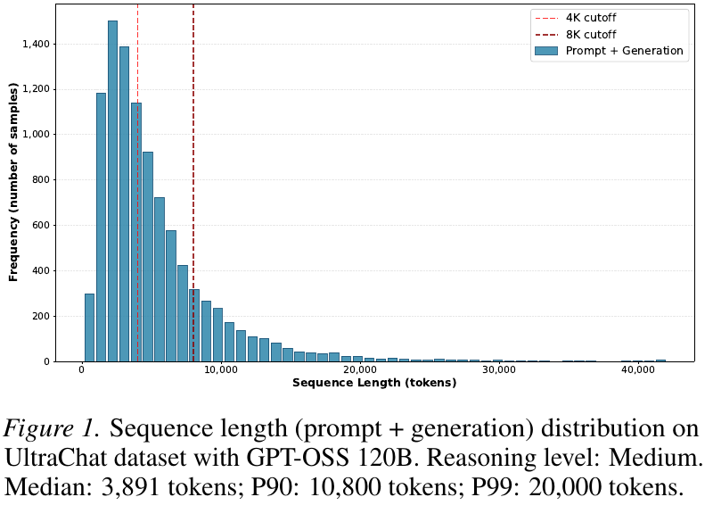
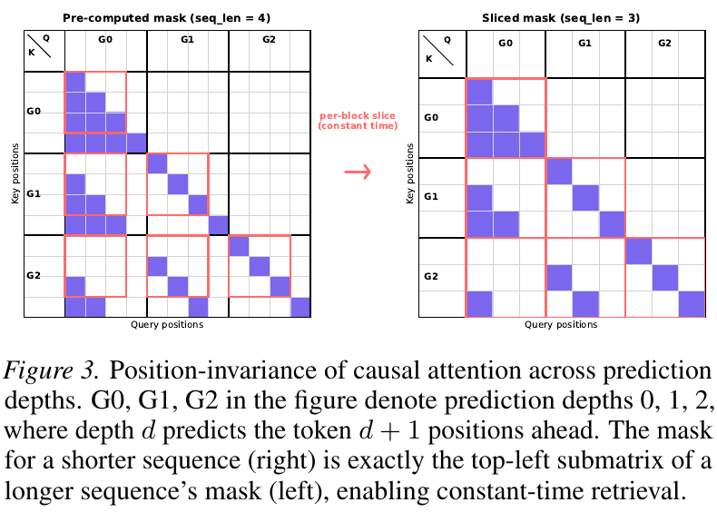
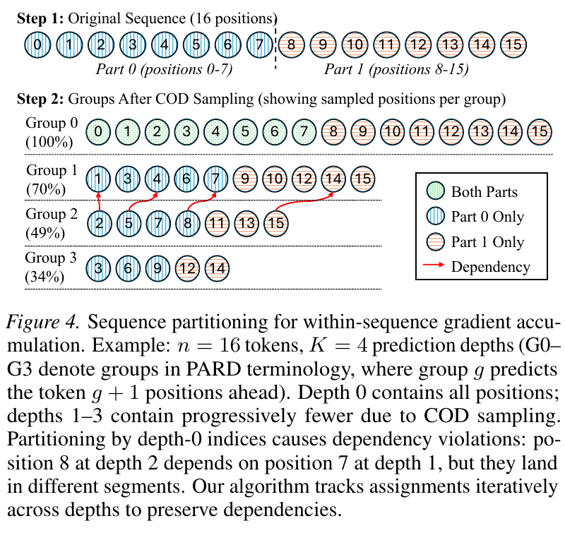
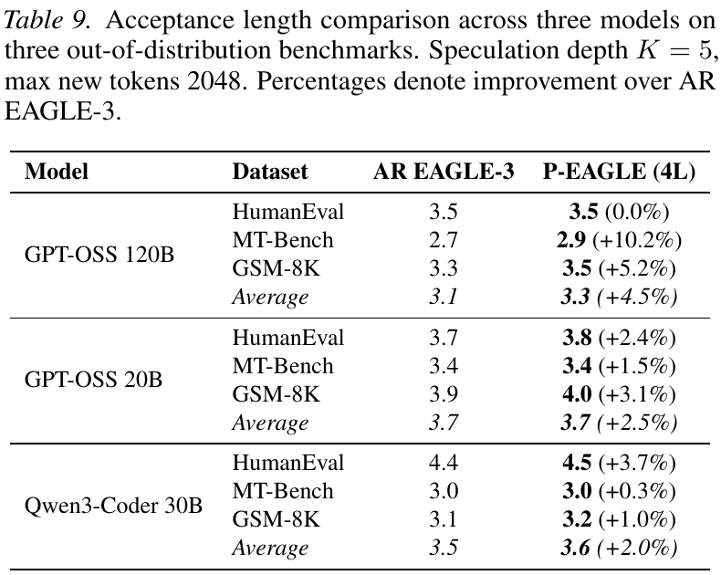
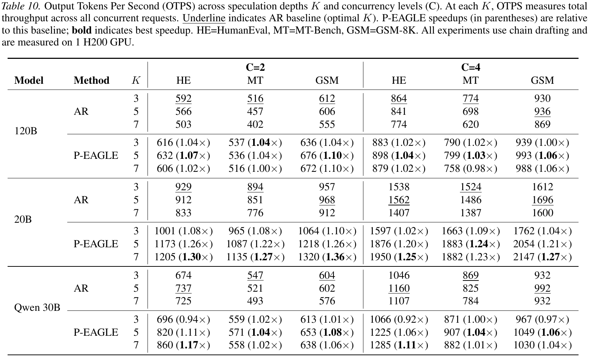

# P-EAGLE: Parallel-Drafting EAGLE with Scalable Training 精读分析

> [!info] 文档关系
> - 文档类型：Paper
> - 领域入口：[README](../README.md)
> - 上位汇总：[Evolution](../surveys/evolution.md)
> - 证据资产：`../assets/papers/p-eagle/`
> - 相关文档：[Figure inventory](../evidence/figure-inventory.md)

> 资料状态：官方 arXiv `2602.01469v1` PDF/source、当前 vLLM runtime、合入 PR、三组公开 checkpoint/config 与 6 个逐图 QA 视觉均已核验。论文是 arXiv v1；未发现公开 OpenReview。本文是隔离 process review，不修改 canonical Paper/Survey。

## 修订信息

- 当前修订 ID：`rev-p-eagle-affiliation-backfill-20260730`

- 当前文档版本：`1.0.1`
- 当前修订时间：`2026-07-30T23:30:00+08:00`
- 替代版本：`rev-p-eagle-b2-initial` / `1.0.0`

| 修订 ID | 文档版本 | 时间 | 修订者 | 类型 | 替代修订 | 迁移问题/解析 | 变更摘要 | 原因 | 影响位置 | 依据 | 对结论影响 |
|---|---|---|---|---|---|---|---|---|---|---|---|
| `rev-p-eagle-b2-initial` | `1.0.0` | `2026-07-25T17:40:00+08:00` | `delegated-paper-review-agent` | `initial` | 无 | 无 | 从 arXiv v1、官方 source、后续 vLLM 实现、公开 checkpoints 与重新裁剪视觉建立完整可审计审阅 | P-EAGLE B2 交付修复 | 本文与 [Figure inventory](../evidence/figure-inventory.md) | arXiv v1、固定 vLLM commit、checkpoint revisions、原图 QA | material：纠正旧资料中“无代码/无 checkpoint”及表号过时结论 |
| `rev-p-eagle-affiliation-backfill-20260730` | `1.0.1` | `2026-07-30T23:30:00+08:00` | `/root` | `metadata-update` | `rev-p-eagle-b2-initial` / `1.0.0` | 无 | 补充作者—机构元数据与角色证据边界 | 统一回填 affiliation 交付字段 | `作者与机构` | 论文 PDF 标题页、机构编号与角色脚注 | none：不改变方法、实验与归因结论 |

## 0. 资料与配图索引

- 官方论文与源码：[arXiv:2602.01469v1](https://arxiv.org/abs/2602.01469v1)。
- vLLM：[固定提交 `190be7d…`](https://github.com/vllm-project/vllm/tree/190be7dad2afa6684902324e0dffa2dc0229a364)，以及已合并 PR #32887 和官方实现博客。
- Checkpoints：`checkpoints/`，三组 API metadata 与 pinned `config.json`。
- OpenReview：未发现公开论坛，exact-title API 枚举被 challenge 阻断；记为不可用证据。
- 图表：[Figure inventory](../evidence/figure-inventory.md)；6 个正式资产见 `../assets/papers/p-eagle/`，均已完成逐图 QA。
- AI 生成分析示意图：未生成；该可选辅助图缺失不影响论文原图、公式、实验和代码证据。
- 版本校正：当前 PDF 的 acceptance 主表是 **Table 9**，OTPS 主表是 **Table 10**；旧稿中的 Table 8/9 编号来自较早排版，不再沿用。

## 0.1 术语与符号解释

### 0.1.1 术语表

| 术语 | 本文含义 | 别名 | 不等于/易混项 | 证据来源 |
|---|---|---|---|---|
| target model | 冻结的大模型，产生最终分布、验证 draft，并提供 3 层 hidden states | verifier | 不等于 P-EAGLE drafter；“冻结”是训练架构角色 | paper §2/Fig.2 |
| AR EAGLE-3 | 每个 draft token 顺序调用一次 1-layer EAGLE drafter 的主 baseline | autoregressive EAGLE | 不是 target AR decoding；drafting 串行、verification 仍并行 | paper §1, §5 |
| P-EAGLE | target-hidden-conditioned 的 parallel multi-token drafter | Parallel-Drafting EAGLE | 不是 PARD standalone drafter；不改 target distribution | paper abstract, §2 |
| NTP position | 一次 P-EAGLE forward 中有真实新 token 与 target context hidden state 的第 1 个预测位置 | Pos 1 | 属于 drafting 输入构造，不是 target verification | Fig.2, vLLM proposer |
| MTP position | 同一 forward 中预测更远未来 token、缺少真实前序 token/hidden 的位置 | Pos 2…K | 不是顺序 EAGLE 中已生成的状态 | paper §2 |
| mask token embedding | 用预定义 unused token ID 的可训练 embedding 表示未知前序 token | `ptd_token_id` 对应 embedding | 不等于 attention mask；代码 config 中是 token ID | paper §2/§4.3; checkpoint configs |
| shared hidden state | 所有 MTP depth 共享的可学习 hidden placeholder | `h_shared`, runtime `mask_hidden` | 不等于 NTP target hidden state；checkpoint tensor 未整包下载 | paper Fig.2; vLLM `llama_eagle3.py` |
| COD | 随 depth 以几何比例随机保留训练位置，降低并行训练有效长度 | Conditional Drop-token | 训练期采样，不是 serving draft pruning | paper §3; PARD related work |
| prediction depth/group | depth $g$ 预测 $g+1$ positions ahead | PARD group | 应与 transformer layer depth、speculation tree depth区分 | paper Fig.3/4 |
| amortized mask construction | 初始化时构造最大 mask，batch 内以 top-left view slicing 取短序列 mask | precomputed mask | 解决 mask 构造/分配开销，不单独解决 activation memory | paper §3.1/Fig.3 |
| sequence partitioning | 单条并行训练序列按依赖分段，分段 forward/backward 并累计梯度 | within-sequence gradient accumulation | 不等于常规跨样本 micro-batch accumulation | paper §3.2/Fig.4 |
| acceptance length (AL) | 每次 speculative iteration 实际提交的平均 token 数；论文 $K=5$ 时称理论上限 6（含 bonus token） | accepted length | 不等于 acceptance rate 或 draft-only K | paper §5.2/Table 9 |
| OTPS | 所有并发请求合计的 output tokens per second | throughput | 不等于单请求 latency；表中不同 C 不宜直接作 latency 比较 | paper Table 10 |
| parallel drafting runtime | vLLM 中重建 draft-only batch metadata、插 mask slots、一次 drafter forward 的阶段 | P-EAGLE serving | 不等于 target verification；kernel 不改变 candidate logits | vLLM PR/blog/code |

### 0.1.2 符号表

| 符号 | 含义 | 性质 | 作用域/索引 | 单位/取值 | 来源 | 易混点 |
|---|---|---|---|---|---|---|
| $n$ | 原训练序列长度 | author-defined | per sequence | tokens | paper §3 | 不等于 COD 后总 positions |
| $K$ | parallel prediction/speculation depth | author-defined | train 或 infer | positive integer；主训练 8，主评测 3/5/7 | paper §3/§5 | 必须标 $K_{\rm train}$/$K_{\rm infer}$ |
| $g,d$ | prediction group/depth index | author-defined | $0,\ldots,K-1$ | index | Fig.3/4 | 不等于 model layer |
| $r$ | COD retention ratio | author-defined | per depth | $(0,1)$，例 0.8 | paper §3.2 | depth $g$ 约保留 $r^g$ |
| $L_{\rm eff}$ | COD 后总训练 positions | analysis-derived from paper | per sequence | positions | §4.2 derivation | 不是 target context length |
| $L$ | target decoder layers（Fig.2）或 total positions（§3.2） | author-defined/ambiguous | local formula | count | Fig.2, paper §3.2 | 论文复用；本文按上下文限定 |
| $d_{\rm model}$ | target hidden width；Fig.2 原文写 $d$ | author-defined renamed | model-global | channels | Fig.2 | 避免与 prediction depth $d$ 冲突 |
| $N$ | P-EAGLE drafter transformer layers | author-defined | model-global | 主配置 4 | Fig.2/Table 9 | 不等于 target layer count $L$ |
| $h_{\rm shared}$ | MTP 共享 learnable hidden state | author-defined | shared across MTP positions | vector, $3d_{\rm model}$ before projection | paper §2; vLLM code | runtime may project auxiliary hidden chunks |
| $t_i$ | 第 $i$ 个未来 draft token | author-defined | per request/iteration | token ID | paper §2 | $t_1$ 是 NTP output |
| $S$ | intra-sequence partition segment count | author-defined | per training sequence | positive integer | paper §3.2 | 论文给复杂度上界，未给全部实现常数 |
| $C$ | serving concurrency | author-defined | benchmark run | Table 10: 2 or 4 | Table 10 | 不是 compute cost |
| $B_{\rm eff}$ | bytes moved / runtime | analysis-derived | per kernel/path | bytes/s | §8.4 | 论文未报告所需 bytes/runtime |
| $U_{\rm BW}$ | effective/peak bandwidth | analysis-derived | per device/path | ratio | §8.4 | 无 telemetry，不能给数值 |

Manifest trace aliases：`L_eff`、`d_model`、`h_shared`、`t_i`、`B_eff`、`U_BW`；它们分别对应上表的 LaTeX 记法。

## 1. 论文基本信息

### 作者与机构

- 第一作者（首位列名）：Mude Hui → University of California, Santa Cruz。
- 共同第一作者（仅含论文明确标注者）：
  - Xin Huang → Amazon Web Services
- 通讯作者/通讯联系人（仅含论文明确标注者）：
  - Xin Huang → Amazon Web Services
- 其他作者涉及的机构（去重列举，不作逐作者映射）：University of California, Santa Cruz；Amazon Web Services。
- 对应依据：论文 PDF 标题页、作者机构编号与角色脚注（核验日期：2026-07-30）。
- 边界说明：Mude Hui 的 AWS 经历是 internship note，不作为其正式标题页机构编号。

- 标题：P-EAGLE: Parallel-Drafting EAGLE with Scalable Training。
- 作者：Mude Hui 等；机构为 UC Santa Cruz 与 AWS Amazon。
- 版本：arXiv `2602.01469v1`，2026；未发现 venue/公开同行评审。
- 核心问题：保留 EAGLE 的 target-conditioned draft quality，同时消除生成 $K$ 个 draft token 所需的 $K$ 次顺序 drafter forward，并让 parallel-drafter training 支持 reasoning workload 的长序列。
- 成功条件：长上下文可训练；AL 不显著弱于强 AR EAGLE-3；端到端 OTPS 提升且输出分布仍由 target verification 决定。
- 关键边界：每个 target family 仍需专用 drafter；主表只到 C=4、单 H200、chain drafting；训练代码在本次核验时只见 vLLM-speculators 后续 RFC/WIP，而非论文作者完整训练实现。

## 2. 研究动机与问题—方案闭环

### 2.1 出发点与背景痛点

作者明确指出，reasoning LLM 输出已显著变长。Figure 1 给出的 GPT-OSS 120B/UltraChat 分布中，中位总长度 3,891，P90 10,800，P99 20,000 tokens。若 drafter 只在短上下文训练，就出现训练—推理分布错配；论文声称 extended reasoning traces 的 acceptance rate 最多下降 25%。与此同时，EAGLE-3 虽以 target hidden states 得到较强 proposal quality，draft 阶段仍自回归：$K$ 个 token 需要 $K$ 次小模型 forward，draft latency 会吃掉更深 speculation 的收益。

### 2.2 现有方案为何不够

ParallelSpec/PARD 已证明 parallel token prediction 可行，但论文报告两类约束。第一，展开 $n\times K$ positions 后，naive attention 为 $O((nK)^2)$，单条长序列自身即可 OOM，常规“拆 batch 不拆样本”的 gradient accumulation 无能为力。第二，PARD 的随机 COD 会为每条样本产生不同保留位置，per-example mask 构造和分配在 2K+ 序列成为 data-loader/epoch bottleneck。Table 1 的先验比较还带公平性限制：ParallelSpec 无公开代码/充分训练细节，PARD 需被作者改造成 EAGLE-conditioned 版本，因而它们不是原作者实现的等价复现。

### 2.3 目标问题与成功标准

- 把 EAGLE drafting 的 forward-pass count 从 $K$ 降到 1；
- 给缺少真实前序 token/hidden 的 MTP positions 可学习但稳定的替代输入；
- 将 8K–20K parallel-draft training 变成可运行问题；
- 以 Table 9 验证 proposal quality 不掉，以 Table 10 验证系统吞吐；
- 不要求 target fine-tune，也不改变 speculative verification 的 lossless contract。

### 2.4 问题—设计—改变变量映射

| 原始问题/失败模式 | 根因/约束 | 对应设计 | 改变变量/系统行为 | 预期优化 | 证据 | 判断 |
|---|---|---|---|---|---|---|
| $K$ tokens 要 $K$ drafter forwards | AR branch dependency | parallel NTP+MTP positions | drafter forward count $K\to1$ | draft latency/OTPS | Fig.2, Table 10, vLLM one-forward code | supported |
| MTP 无真实前序输入 | future token/hidden unavailable | mask embedding + $h_{\rm shared}$ | 用 learnable placeholders 替代缺失输入 | AL 接近 AR | hidden-state ablation、checkpoint/runtime | partially supported：组合有效，单独 shared-vs-mask 未全隔离 |
| naive long training OOM | $O((nK)^2)$ positions/attention | COD + sequence partition | 减少 positions 并令峰值 attention 分片 | context length/peak memory | Table 1, Fig.4, complexity argument | partial：可训练性直接，$O(L^2/S^2)$ 缺独立 telemetry |
| mask/data load 过慢 | per-example construction/allocation | precompute + slice | per-batch construction 变 view | data load/epoch time | Table 2: 718.5s→17.5s，12+h→1.8h | direct but bundled with framework |
| shared placeholder 信息不足 | parallel prediction更难 | 4 layers、unfrozen embedding、长训练、$K_{\rm train}>K_{\rm infer}$ | capacity/optimization budget增加 | AL | Tables 3–7 | direct one-factor ablations，跨配置仍有限 |
| batch metadata shape 不匹配 | draft-only mask slots | fused Triton expansion + remapping | GPU-side token/position/mask/slot construction | runtime overhead | post-paper vLLM code/blog | implementation-supported；非 paper Table 10 kernel attribution |

### 2.5 完整因果链与证据闭环

链条是：长 reasoning outputs 要求长上下文 drafter → AR EAGLE 的 proposal quality 强但 $K$ 次顺序 draft forward 成为瓶颈 → parallel positions 可把 forward 次数压成 1，却引入 MTP 缺失输入与 $nK$ 训练膨胀 → learnable shared state/mask token 恢复可训练输入，mask slicing 与 dependency-aware partitioning 恢复长序列可训练性 → 4-layer/capacity recipe 使 AL 匹配 1-layer AR → 单 H200 的 K=5–7 OTPS 提升。

已直接支持的是 mask构造时间、recipe 若干单因素 AL、9 个 AL 主对比与 H200 OTPS。间接/混杂的是“20K matching inference distribution 导致总体收益”、sequence partition 独立贡献、shared state 与 mask embedding 的各自必要性，以及 runtime kernel 对 Table 10 的贡献。未验证边界包括多 GPU/高并发尾延迟、能耗、完整训练复现和不同 target family 的泛化。

## 3. 核心贡献

1. 将 hidden-state-conditioned EAGLE drafter改造成一次 forward 的 NTP+MTP parallel prediction（§2/Fig.2）。
2. 通过最大 attention mask 预计算和 tensor slicing 消除 per-example mask 构造（§3.1/Fig.3/Table 2）。
3. 用依赖传播的单序列 partition 支持 within-sequence gradient accumulation（§3.2/Fig.4/Algorithm 1）。
4. 系统消融形成 parallel EAGLE recipe，并在 3 个 target×3 datasets 上验证 AL/OTPS（§4–5/Table 9–10）。
5. 论文之后，机制已进入 vLLM 且公开 3 组 checkpoint；这是复现性增强，不应倒填为 v1 投稿时的开源状态。

## 4. 研究方法与组件级设计动机

### 4.1 架构

target 冻结并输出 layer 2、$L/2$、$L-1$ hidden states，拼成 $3d_{\rm model}$。NTP 位置接收真实 context token/hidden；MTP 位置接收 mask embedding 与共享 $h_{\rm shared}$。所有 positions 经 $N$ 层 drafter 和 target LM head 一次产生 $t_1,\ldots,t_K$。

### 4.2 COD 与 amortized mask

COD 下有效 positions 为

$$
L_{\rm eff}=n\sum_{g=0}^{K-1}r^g
=n\frac{1-r^K}{1-r}.
$$

无 COD 时 $L_{\rm eff}=nK$，naive attention storage/compute 量级为 $O(L_{\rm eff}^2)$。causal mask 对序列长度具有 top-left prefix invariance，因此最大 mask 一次构造、短例只取 view。

在 $n=8192,K=8,r=0.8$ 时：

$$
L_{\rm eff}\approx8192\frac{1-0.8^8}{1-0.8}\approx34{,}087.
$$

单个 bf16 $L_{\rm eff}^2$ 矩阵约 $34{,}087^2\times2\approx2.32$ GB；这是分析推导，不含 heads/QKV/softmax/gradients，也不代表实际 flash-attention materialization。

### 4.3 Dependency-aware partitioning

对 depth 0/1 先按边界赋 segment；更深位置跟随前一 depth 的依赖 $p-1$：

$$
\mathcal A_g[p]=
\begin{cases}
\max\{s:\mathcal B_s\le p\},& g\in\{0,1\},\\
\mathcal A_{g-1}[p-1],&g\ge2.
\end{cases}
$$

每段还累计所需 NTP prefix：

$$
\mathcal N_s=\{p\in\mathcal P_0:p<\mathcal B_{s+1}\}.
$$

论文给出峰值 attention 从 $O(L^2)$ 到 $O(L^2/S^2)$ 的理想量级；重复 NTP prefix、非 attention activation 和不均衡 sampling 会使真实节省偏离此式。

### 4.4 组件级设计 rationale matrix

| 设计项 | why 状态 | 针对问题 | 因果机制 | 替代/权衡 | 验证 | 判断 |
|---|---|---|---|---|---|---|
| shared $h_{\rm shared}$ | author-stated | MTP 缺 hidden | 提供可学习共同先验，RoPE/attention区分位置 | depth-specific encoding/NTP injection | hidden ablation：simple shared 高 7–15% | supported against tested alternatives |
| mask token embedding | author-stated | MTP 缺前序 token | 用特殊 embedding 表示未知输入 | frozen/ordinary embedding | unfreeze +5% AL；代码/配置确认 token ID | partial：mask本身无 remove ablation |
| 4-layer drafter | author-stated | parallel input 信息较少 | capacity compensation | 1/2 layers 更快 | 1→4 HumanEval 2.69→3.92 | direct AL，runtime trade-off由Table10间接 |
| $K_{\rm train}>K_{\rm infer}$ | author-stated | far-depth generalization | 更深 horizon 训练提供覆盖 | match K 更省训练 | 8/5 优于5/5，小幅 | direct but small |
| COD | author-stated/adopted | $nK$ positions 太多 | geometric subsampling | 更低 r 可能损伤 quality | 无独立 r sweep in main paper | plausible/under-isolated |
| precomputed mask slicing | author-stated | per-example overhead | position invariance 令 view reusable | dynamic construction | Table2 direct time | supported |
| dependency-aware splitting | author-stated | single sequence OOM/跨depth依赖 | 依赖跟随 segment + NTP prefix | naive index split invalid | Fig.4/complexity/Table1 | partial，缺 component-only memory curve |
| HCA AR baseline | author-stated | 避免弱 baseline | 强化 AR context alignment | vanilla EAGLE baseline | baseline AL强；无同预算 HCA ablation | improves fairness but complicates budget matching |
| vLLM fused batch expansion | post-paper implementation | parallel draft shape/metadata mismatch | GPU one-pass copy/insert/mask/remap | multiple PyTorch ops | code + later blog | runtime implemented；不证明paper系统归因 |

### 4.5 训练/评测设置

主 P-EAGLE 为 4 layers，max sequence 8192，$K_{\rm train}=8$，COD ratio 0.8；batch 8、microbatch 1、8-step accumulation，peak LR $10^{-4}$，8×H200 training。数据为 UltraChat、GSM-8K train、OpenCodeInstruct；OOD benchmarks 为 HumanEval、MT-Bench、GSM-8K test。Table 10 是 1×H200、chain drafting、C=2/4。未报告随机种子/置信区间/方差，且 Table 1 的 prior implementations 是作者重实现/改造。

## 5. 关键结论、claim matrix 与收益归因

### 5.1 Acceptance length

4-layer P-EAGLE 在 9 组均匹配/略超 1-layer AR：模型平均相对差为 +4.5%（120B）、+2.5%（20B）、+2.0%（Qwen 30B）。最大单项是 120B/MT-Bench 的 2.7→2.9（+10.2%）；Qwen/MT-Bench 仅 +0.3%。这验证“parallel quality 可匹配”，不能推出 shared state 本身让质量更高。

### 5.2 OTPS

最强点是 GPT-OSS 20B、C=2、K=7、GSM：AR optimal 968→P-EAGLE 1320，绝对 +352 OTPS、相对 +36%。120B 提升较小（最佳约 +10%）；Qwen HumanEval K=3 在 C=2/C=4 为 0.94×/0.92×，说明一次 4-layer forward 未必比 3 次 1-layer forwards便宜。K=5–7 后才摊薄 capacity cost。

### 5.3 技术 claim 证据矩阵

| 技术点 | 声称收益 | 对应证据 | 控制 | 强度 | 结论 |
|---|---|---|---|---|---|
| parallel forward | 降 draft latency | Table10 + vLLM one-forward path | end-to-end，多变化 | direct system + code | supported at reported hardware |
| shared state优于复杂编码 | 提高 AL | hidden-state Table3 | matched four alternatives | direct replacement | supported within one config |
| 4 layers补偿信息缺口 | 提高 AL | layer Table4 | matched layer sweep | direct | supported for AL |
| unfreeze embedding | mask token更有意义 | Table5 | frozen vs unfrozen | direct | supported modestly |
| train deeper than infer | 提高 infer AL | Table6 | 5/5 vs8/5 | direct | supported small effect |
| longer training | 更好 optimization | Table7 | epochs sweep | direct | supported, diminishing |
| long sequence improves reasoning drafter | 减少 distribution mismatch | Fig1/Table1/sequence-length ablation | cross-model/confounded | indirect | plausible; 512→2048 gain small on Llama8B |
| precomputed masks | 大幅降 loader/epoch cost | Table2 | PARD vs ours | framework differences bundled | strong but confounded |
| partition gives $O(L^2/S^2)$ peak | 使20K可训 | theorem-style argument/Table1 | no component telemetry | indirect | partially supported |
| 1.10–1.36× over AR | OTPS | Table10 | same H200/table setting | direct end-to-end | supported for C2/C4 workloads |
| later vLLM fused kernel | 降 setup overhead | code/blog later benchmarks | not paper matched ablation | code-only/post-paper | implemented, gain not isolated |

### 5.4 收益来源归因

| 组件/变化 | 基线 | 指标变化 | 影响路径 | 证据 |
|---|---|---|---|---|
| 1→4 drafter layers | 1-layer P-EAGLE | HumanEval 2.69→3.92；MT 2.41→3.04 | candidate quality/AL | matched layer ablation |
| unfreeze embedding | frozen | HE 2.56→2.69；MT 2.29→2.41 | mask representation/AL | matched |
| $K_{\rm train}$ 5→8 at $K_{\rm infer}=5$ | 5/5 | HE 2.41→2.51；MT 2.20→2.26 | horizon generalization/AL | matched |
| mask framework | PARD-like dynamic | 718.5s→17.5s load；12+h→1.8h epoch | training system | bundled comparison |
| P-EAGLE full runtime | best AR K per workload | max 968→1320 OTPS (+36%) | one forward + preserved AL | end-to-end, not component variance decomposition |

不能把 +36% 全归给“一次 forward”：P-EAGLE 同时是 4-layer、AL略不同、K不同，verification/batching也变化。反过来，kernel 只改变 setup/memory traffic，不改变 proposal distribution，不能解释 AL。

## 6. Related Work

| 类别 | 机制 | 优点 | 局限/公平性 | 与 P-EAGLE 关系 |
|---|---|---|---|---|
| EAGLE/EAGLE-3 | target hidden-conditioned sequential drafter | AL强、drafter小 | $K$ sequential forwards | 直接 baseline；HCA增强版 |
| Medusa/MTP self-drafting | target附加 heads并行预测 | draft低延迟 | 改target/independent heads可能quality低 | P-EAGLE保留外置 target-conditioned drafter |
| ParallelSpec | discrete EAGLE-style parallel drafter | 展示parallel潜力 | 无代码/训练细节；作者重实现 | 最近机制基线，但不可审计公平复现 |
| PARD | COD parallel training | 降 positions | per-example mask慢；standalone drafter | P-EAGLE采用COD并重做scaling |
| Falcon/SAR | dependency-aware training/tree | 改善 semi-AR draft quality | custom tree/机制不同 | 同属并行draft但目标不同 |
| Cascade drafting | 多drafter按位置分配算力 | 灵活 latency allocation | 多模型调度复杂 | 解决draft cost的另一条路径 |
| KV/cache优化 | eviction/quantization/streaming | 承载长context | 可能lossy；不解决draft串行 | 可组合，论文未实测 |

论文对 ParallelSpec/PARD 的主比较存在作者重实现/adaptation，因此“长训练不可行”应限定于论文实现和硬件，不宜泛化为方法的绝对上限。

## 7. OpenReview 公开评审 × 内容交叉核验

- OpenReview：未发现公开 forum；exact-title API 返回 challenge 403。
- decision/meta-review/rebuttal：不可用。
- 因此没有 reviewer claim 可交叉核验；下列关注点来自本文审阅：缺随机方差、prior baseline重实现、partition独立消融不足、paper与后续runtime版本分离、训练代码未完整公开。
- 该缺口不阻塞 source-grounded review，但论文仍缺独立同行评议信号。

## 8. Infra 需求分析

### 8.1 算力

粗略 draft-only 交换为

$$
T_{\rm AR\ draft}\approx K\,T_{\rm 1L},\qquad
T_{\rm P\ draft}\approx T_{\rm NL,parallel}(K).
$$

把 layer count 线性化只能给直觉 $N/K$，不能当真实性能模型；attention shape、LM head、kernel launch、batch size、MoE verification都会破坏线性关系。Table10 的 Qwen K=3 slowdown正说明 $4/3$ 容量代价可超过并行收益。

### 8.2 显存/存储

训练峰值至少包含 drafter parameters/gradients/optimizer、target hidden inputs、$L_{\rm eff}$ activations/logits、attention metadata。已验证 checkpoint 是 4-layer BF16，API约1–2B参数；仅 bf16 weights 约2–4GB，训练 optimizer/gradients 远高于此。公开 configs 的 max positions 是131K/262K，但这只表示架构配置上限，不证明论文在这些长度训练。

### 8.3 数据类型

| 对象 | 格式 | 阶段 | 影响 | 证据 |
|---|---|---|---|---|
| drafter weights | BF16 | checkpoint/infer | 约2 bytes/parameter | pinned configs/API |
| target GPT-OSS serving | MXFP4 weights（后续博客） | runtime | B200/FlashInfer MoE依赖 | vLLM blog |
| KV cache | FP8（后续命令） | serving | 降HBM footprint/bandwidth | blog/model cards |
| token/position/masks | int/bool tensors | input expansion | metadata traffic/launch | vLLM Triton code |
| `mask_hidden` | drafter dtype，运行时copy/project | MTP input | hidden-width broadcast | vLLM proposer/model |

paper Table10只写H200，不足以确认其 target weight/KV格式与后续B200博客完全相同，二者不合并。

### 8.4 带宽、互联与利用率

$$
B_{\rm eff}=\frac{\mathrm{BytesMoved}}{\mathrm{RuntimeSeconds}},
\qquad U_{\rm BW}=\frac{B_{\rm eff}}{B_{\rm peak}}.
$$

论文未给 bytes/kernel time/peak utilization，故不能数值估计。vLLM 后续 fused Triton kernel把 copy/scatter/insert/fill/mask/remap 合为一趟，机制上减少 launch 和额外 HBM passes；hidden state 因宽度大而另走 mapping+copy。单 H200 表无 NVLink/RDMA；多GPU通信、TP all-reduce、MoE all-to-all均未评估。瓶颈随 target size/concurrency 从 draft setup/compute 移向 target verification/MoE routing。

### 8.5 CPU/GPU/NPU 异构执行

paper未报告NPU或CPU offload。后续vLLM实现把主要 expansion、slot mapping、hidden填充留在GPU，CPU负责scheduler/config/metadata控制。无 pinned-memory/DMA telemetry；NPU适配未验证。该方法并不理论要求homogeneous GPU，但当前证据只支持NVIDIA H200/B200路径。

### 8.6 Serving/自定义算子

parallel draft batch比verification batch多 mask slots，必须重建query lengths、positions、slot mapping、rejection/mask flags及CUDA graph capture range。当前 vLLM commit明确实现这些对象并要求 checkpoint含 `ptd_token_id`/`mask_hidden`。这使“旧稿无runtime代码”结论过时，但训练端 RFC/WIP 不能替代论文作者训练代码。

## 9. 开源代码与 checkpoint 对照

- runtime repo/commit：[vLLM `190be7d…`](https://github.com/vllm-project/vllm/tree/190be7dad2afa6684902324e0dffa2dc0229a364)。
- PR：`#32887` 已于 2026-02-05 合入，merge `af3162d…`。
- 代码一致性：parallel one-forward、mask slots、shared hidden、attention/KV metadata 与论文机制一致；training mask/COD/partition不在该runtime路径中核验。
- checkpoint：三组open/not-gated，4 layers、BF16、明确 `ptd_token_id`；未下载GB级 weights，故 `mask_hidden` tensor shape/value未逐tensor审计。

| 论文机制 | 本地路径 | 一致性 |
|---|---|---|
| parallel flag | vLLM `vllm/config/speculative.py` | 一致 |
| one-forward proposer | vLLM `vllm/v1/spec_decode/llm_base_proposer.py` | 一致 |
| fused expansion | vLLM `vllm/v1/spec_decode/utils.py` | 实现后续系统优化 |
| `mask_hidden` loading | vLLM `vllm/model_executor/models/llama_eagle3.py` | 一致，缺权重 tensor 实检 |
| COD/precompute/partition training | vLLM runtime无对应作者实现 | 未核验；speculators后续RFC/WIP |

## 10. 优点、局限与改进

优点：

- 清楚拆分 draft-quality 与 draft-latency，并用 AL+OTPS 双层验证；
- mask overhead 和单序列 memory 两个training bottleneck分别处理；
- recipe ablations覆盖shared state、layers、embedding、K、epochs、sequence length；
- 后续vLLM/checkpoints显著增强部署可用性。

局限：

- arXiv v1、无公开评审；无方差/显著性/随机种子；
- Table1的ParallelSpec/PARD不是原作者公开实现的等预算复现；
- shared state与mask embedding、COD与partition、kernel与algorithm gain未完全独立；
- Table10只有单H200、C=2/4、chain drafting；无TTFT/ITL/P99/energy/memory telemetry；
- 后续B200博客采用不同checkpoint/并发/数据/格式，不可与Table10直接拼表；
- target-specific drafter增加训练/存储/生命周期成本。

建议补充：公开冻结训练commit与configs；做COD ratio×S×sequence length memory/time surface；同一2/4-layer下分离parallel/AR；报告TTFT/ITL/P99、HBM bandwidth、kernel breakdown、C=1…64；按checkpoint revision提供可复现实验容器。

## 11. 研究启发

- parallel drafter的最佳容量不是“越小越好”，而是 AL 与一次forward latency的联合最优。
- training scalability本身可成为算法贡献，但必须把mask construction、activation memory和I/O分别量化。
- runtime metadata/layout往往是parallel algorithm落地的隐形成本；candidate quality与kernel efficiency需要两条证据链。
- 可研究按并发/target verification cost动态选择K或2L/4L head，而非静态K。

## 12. 待验证清单

1. Table1的20K运行实际peak memory、wall time和partition $S$ 是多少？
2. 只移除 $h_{\rm shared}$ 或只冻结mask embedding，各自损失多少？
3. COD ratio sensitivity与AL/memory Pareto面如何？
4. 2-layer P-EAGLE是否在低K/高并发提供更好OTPS？
5. runtime fused kernel占iteration time多少，未融合版本差多少？
6. checkpoint cards与paper训练数据/recipe为何有差异，哪一revision对应Table9/10？
7. 多GPU TP/MoE下hidden gathering、all-to-all与parallel slots如何交互？
8. lossless sampling在非零temperature的vLLM路径是否有完整回归测试？

## 13. 一句话总结

P-EAGLE把EAGLE的强proposal从 $K$ 次顺序draft forward改为一次parallel forward，并以mask预计算与依赖保持分片补齐长上下文训练；H200表支持最高1.36×对强AR baseline的吞吐收益，但训练组件独立归因、公开评审与跨硬件高并发telemetry仍是主要证据缺口。
