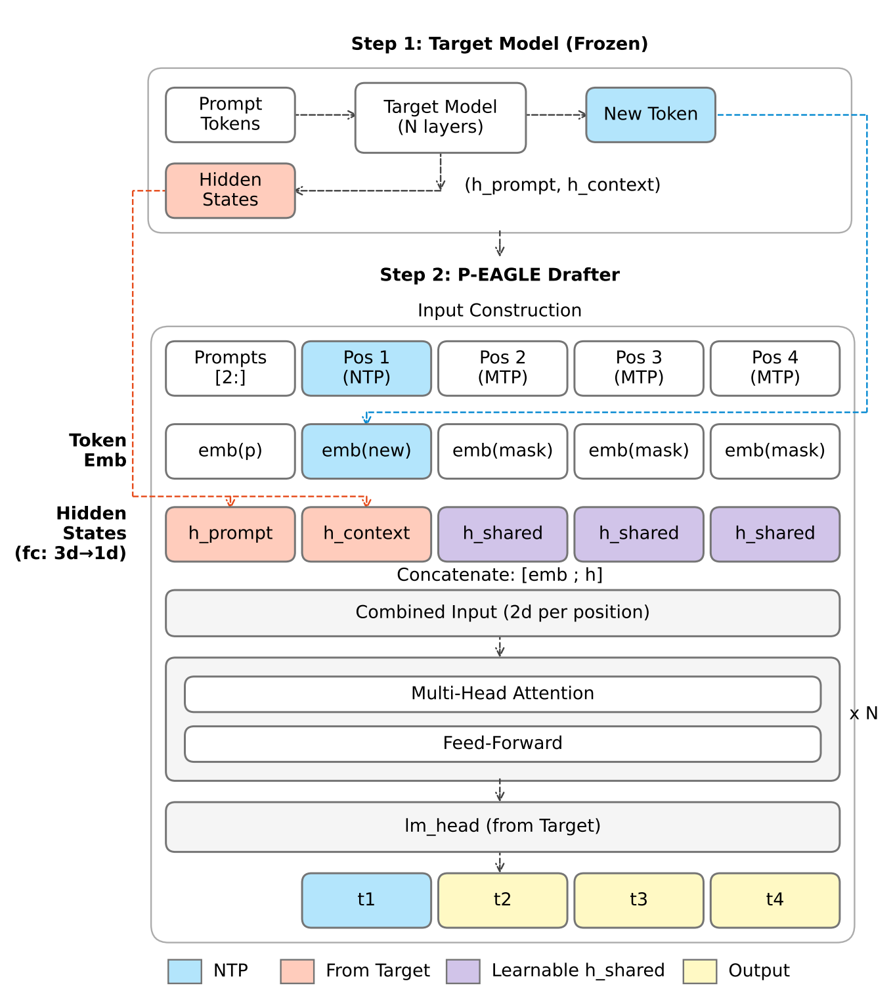
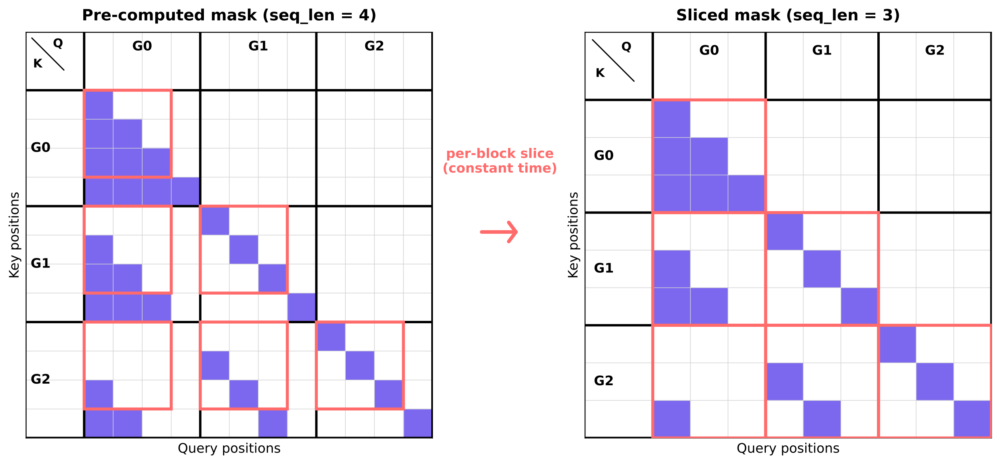
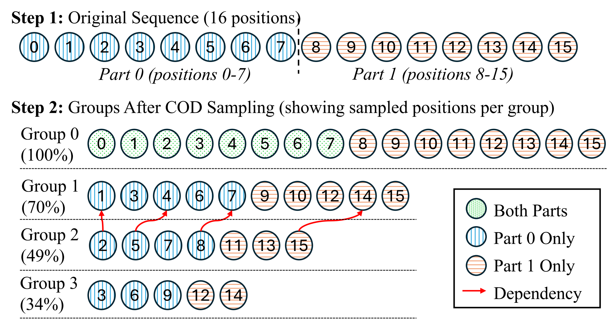

# P-EAGLE: Parallel-Drafting EAGLE with Scalable Training 精读分析

> [!info] 文档关系
> - 文档类型：Paper
> - 领域入口：[README](../README.md)
> - 上位汇总：[Evolution](../surveys/evolution.md)
> - 证据资产：`../assets/papers/p-eagle/`
> - 相关文档：[JetSpec](jetspec.md)

> 资料状态：已下载 arXiv PDF、arXiv source tar，并解包 LaTeX 源文件。图片优先来自 arXiv source 中的原始 PDF 图，已额外渲染为 PNG 供 Markdown 查看；不是从论文 PDF 页面裁剪。未发现论文给出的官方代码仓库链接，代码实现只可依据论文中 vLLM implementation 声明分析，无法做源码级核验。

## 0. 资料与配图索引

- 论文 PDF：`2602.01469v.pdf`（本地 artifacts 中未保留）
    
- arXiv source：`2602.01469v_source.tar`（本地 artifacts 中未保留）
    
- LaTeX 主文件：`source/main.tex`（本地 artifacts 中未保留 P-EAGLE source）
    
- 提取文本：`extracted_text/main.tex`（本地 artifacts 中未保留）
    
- 开源代码：论文未给出仓库链接；GitHub 检索未发现明显官方 `P-EAGLE` 仓库。源码对照未进行。
    
- arXiv 元数据：`arXiv:2602.01469v1`，提交/更新时间 `2026-02-01T22:26:17Z`。
    

图表：

|图/表|内容|本地资源|
|---|---|---|
|Figure 1|GPT-OSS 120B 在 UltraChat 上的序列长度分布|[`fig1-length-distribution.png`](../assets/papers/p-eagle/fig1-length-distribution.png)|
|Figure 2|P-EAGLE 架构|[`fig2-architecture.png`](../assets/papers/p-eagle/fig2-architecture.png)|
|Figure 3|attention mask 可裁剪/复用|[`fig3-attention-mask.png`](../assets/papers/p-eagle/fig3-attention-mask.png)|
|Figure 4|依赖保持的序列切分|[`dependency-aware-splitting.png`](../assets/papers/p-eagle/dependency-aware-splitting.png)|
|Appendix Figure|regularized NTP hidden 中 $\alpha$ 衰减轨迹|[`alpha-trajectory.png`](../assets/papers/p-eagle/alpha-trajectory.png)|
|Table 1|长上下文训练可扩展性对比|`source/main.tex` lines 168-183|
|Table 2|mask 构造训练开销|`source/main.tex` lines 308-319|
|Tables 3-7|训练 recipe 消融|`source/main.tex` lines 551-717|
|Table 8|acceptance length 主结果|`source/main.tex` lines 935-969|
|Table 9|vLLM OTPS 主结果|`source/main.tex` lines 1015-1064|
|Appendix Table|2-layer vs 4-layer P-EAGLE|`source/main.tex` lines 1301-1328|

## 1. 论文基本信息

- 标题：P-EAGLE: Parallel-Drafting EAGLE with Scalable Training
    
- 作者：Mude Hui, Xin Huang, Jaime Campos Salas, Yue Sun, Nathan Pemberton, Xiang Song, Ashish Khetan, George Karypis
    
- 机构：UC Santa Cruz, AWS Amazon
    
- 领域：LLM speculative decoding、parallel drafting、serving/inference acceleration
    
- 核心问题：EAGLE-3 的 drafter 接受率高，但生成 $K$ 个 draft token 仍需 $K$ 次顺序 drafter forward；并行 draft 可降低 drafting latency，但长上下文训练的 attention/mask/activation 成本随序列长度和预测深度急剧上升。
    
- 研究目标：把 EAGLE 从 autoregressive drafting 改成一次 forward 预测多个 token，并把训练扩展到 reasoning workload 所需的 8K/20K 级长上下文。
    
- 关键假设：reasoning 模型输出更长，drafter 训练长度必须匹配推理分布；P-EAGLE 的并行预测质量可以通过更深 drafter、可训练 mask token embedding 和长训练补偿；RoPE attention 已经足以携带位置/预测深度信息，不必给 MTP 位置额外注入 depth-specific hidden state。
    

## 2. 核心贡献与创新点

1. **把 EAGLE 的顺序 drafter 改成并行 MTP drafter。** 传统 EAGLE 预测 $K$ 个 draft token 需要 $K$ 次 drafter forward；P-EAGLE 对 NTP 位置继续使用 target hidden states，对 MTP 位置用共享可学习 hidden state $h_{\text{shared}}$ 和 mask token embedding 替代未知的前序 token/hidden vector，从而一次 forward 产生多个 draft token。证据：`source/main.tex` lines 219-234。
    
2. **长上下文可扩展训练框架。** 并行预测把有效长度从 $n$ 扩为 $nK$，朴素 attention 复杂度为 $O((nK)^2)$。P-EAGLE 用预计算最大 mask + per-example tensor slicing 消除 per-batch mask 构造，并用依赖保持的 sequence partitioning 做单序列内部 gradient accumulation。证据：`source/main.tex` lines 283-304, 400-421。
    
3. **训练 recipe：用容量补偿并行预测的信息缺口。** 论文发现 4-layer drafter、unfreeze embedding、$K_{\text{train}}>K_{\text{infer}}$、更长训练和更长序列可以弥补 MTP 位置缺少真实前序 token/hidden state 的问题。证据：`source/main.tex` lines 576-746。
    
4. **vLLM 端到端吞吐验证。** 论文声称已在 vLLM 中实现 P-EAGLE，并在 GPT-OSS 120B/20B 与 Qwen3-Coder 30B 上相对 AR EAGLE-3 获得 1.10x-1.36x speedup。证据：`source/main.tex` lines 1015-1064。
    

## 3. 研究方法

### 3.1 问题到方案的逻辑链

问题链条：

1. 标准自回归解码每个 token 都要跑 target model，memory bandwidth 成为瓶颈。
    
2. speculative decoding 通过小 drafter 先草拟、target model 批量验证来减少 target forward 次数。
    
3. EAGLE-3 利用 target hidden states，drafter 很小且 acceptance length 高，但 draft token 仍按 token 顺序生成，$K$ 个 draft token 需要 $K$ 次 drafter forward。
    
4. Parallel drafting 能把 $K$ 次 drafter forward 压成 1 次，但 MTP 位置没有真实的前序 token/hidden vector，并且训练时有效序列长度和 mask 成本暴涨。
    
5. P-EAGLE 的设计分两层：架构上用共享可学习 hidden state + mask token embedding 处理 MTP 缺失输入；训练上用预计算 mask + sequence partitioning 处理长上下文内存和数据加载瓶颈。
    

### 3.2 模型/系统架构

P-EAGLE drafter 继承 LLaMA 3 风格 transformer layer 和 RoPE。Figure 2 中 target model 先处理 prompt/context，并抽取第 2 层、第 $L/2$ 层、第 $L-1$ 层 hidden states，拼接成 $3d$。NTP 位置使用真实 token embedding + target hidden states，类似 AR EAGLE。MTP 位置预测 $t_2,t_3,\ldots$，没有前一步 draft token 和 hidden state，所以使用：

$$  
h_{\text{MTP}} = h_{\text{shared}}  
$$

  

并配合一个可训练 mask token embedding 表示“未知前序 token”。论文比较了 depth-specific encoding、NTP hidden injection 等四个替代设计，结果都比 shared hidden state 差 7%-15%。

### 3.3 可扩展训练：mask 预计算

PARD 的 COD 会在不同 prediction depth 随机保留位置，保留率为 $r$，总有效位置数近似为：

$$  
L_{\text{eff}} = n \sum_{i=0}^{K-1} r^i = n \frac{1-r^K}{1-r}  
$$

  

朴素并行预测 attention 成本：

$$  
\mathrm{AttentionCost} = O(L_{\text{eff}}^2)  
$$

  

如果不用 COD，则 $L_{\text{eff}}=nK$，复杂度为：

$$  
O((nK)^2)  
$$

  

P-EAGLE 的 mask 预计算基于一个观察：跨 prediction depth 的 causal pattern 对位置平移/长度截断是不变的。最大长度 mask 只构造一次，短序列 mask 用左上角子矩阵切片得到。

训练开销证据：2048 token、$K=8$、UltraChat 200K examples、8 x H200 下，PARD 加载 128 examples 需要 718.5s、epoch 12h+；P-EAGLE 分别是 17.5s 和 1.8h。表格来源：`source/main.tex` lines 308-319。

### 3.4 可扩展训练：sequence partitioning

预计算 mask 解决 mask 构造开销，但不能解决 activation/attention memory。论文给出例子：$n=8192,K=8,r=0.8$ 时：

$$  
L_{\text{eff}} = 8192 \cdot \frac{1-0.8^8}{1-0.8} \approx 8192 \cdot 4.161 \approx 34.1K  
$$

  

attention matrix 仅单个 $L_{\text{eff}}\times L_{\text{eff}}$ bf16 矩阵就约为：

$$  
34{,}100^2 \times 2\ \text{bytes} \approx 2.33\ \text{GB}  
$$

  

这还没算 multi-head、QKV、softmax、梯度、optimizer state 等。因此论文提出单条 sequence 内部切 segment 并累计梯度。难点是 COD 后不同 depth 的位置集合不同，depth $d$ 位置 $p$ 必须 attend 到 depth $d-1$ 的 $p-1$；如果简单按 token index 切分，会把依赖切到不同 segment。

算法核心：

$$  
\mathcal{A}_g[p] = \begin{cases} \max\{s:\mathcal{B}_s \le p\}, & g \in \{0,1\} \\\\ \mathcal{A}_{g-1}[p-1], & g \ge 2 \end{cases}  
$$

  

每个 segment 还累积包含足够的 depth-0/NTP 前缀：

$$  
\mathcal{N}_s=\{p\in\mathcal{P}_0:p<\mathcal{B}_{s+1}\}  
$$

  

论文声称使用 $S$ 个 segment 后 peak attention memory 从 $O(L^2)$ 降到 $O(L^2/S^2)$。证据：`source/main.tex` lines 400-421。

### 3.5 训练/实验/部署设计

主实验设置：

- 模型：GPT-OSS 120B、GPT-OSS 20B、Qwen3-Coder 30B。
    
- P-EAGLE：主结果使用 4 decoder layers。
    
- 训练长度：max sequence length 8192。
    
- 训练预测深度：$K_{\text{train}}=8$。
    
- COD down-sampling ratio：0.8。
    
- batch：batch size 8，micro-batch 1，8-step gradient accumulation。
    
- learning rate：peak $1\times 10^{-4}$，linear schedule，warmup ratio 0.0025。
    
- 硬件：8 x H200 训练；vLLM OTPS 表在 1 x H200 上测。
    
- 数据：UltraChat、GSM-8K train split、OpenCodeInstruct。
    
- OOD 评测：HumanEval、MT-Bench、GSM-8K test split。
    
- baseline：AR EAGLE-3 1-layer，并实现 HCA loss，使 baseline 更强。
    

证据：`source/main.tex` lines 754-770, 1015-1018。

## 4. 关键结论

### 4.1 长上下文训练可扩展性

Table 1 在 GPT-OSS 120B、MT-Bench、speculation length 5 条件下比较训练上下文长度：

|Method|Layers|1K|4K|8K|20K|
|---|---|---|---|---|---|
|ParallelSpec + EAGLE 3|1|1.5|1.6|OOM|OOM|
|PARD + EAGLE 3|4|2.4|Infeas.|OOM|OOM|
|P-EAGLE|4|2.4|2.8|2.9|3.0|

结论：本文最强的系统 claim 不是单纯 AL 更高，而是 prior parallel drafting 在 8K+ 训练不可用或成本不可接受时，P-EAGLE 可以训练到 20K 并保持 AL。证据来源：`source/main.tex` lines 168-183。

### 4.2 训练 recipe 消融

Hidden state ablation：共享 learnable hidden state 最好，HumanEval AL 3.16；depth-specific encoding 2.85，NTP hidden + depth 2.68，NTP hidden only 2.81，regularized NTP hidden 2.94。证据：`source/main.tex` lines 551-568。

Model depth：1 layer 到 2 layers 提升最大，HumanEval 从 2.69 到 3.58；4 layers 达 3.92。MT-Bench 从 2.41 到 2.76，再到 3.04。证据：`source/main.tex` lines 582-598。

Embedding：unfreeze embedding 带来约 +5%。HumanEval 2.56 -> 2.69，MT-Bench 2.29 -> 2.41。证据：`source/main.tex` lines 606-623。

$K_{\text{train}}$：$K_{\text{train}}=8,K_{\text{infer}}=5$ 比 $5/5$ 更好，HumanEval 2.41 -> 2.51，MT-Bench 2.20 -> 2.26。证据：`source/main.tex` lines 661-678。

训练时长：20/40/60 epochs 在 HumanEval 上 3.92/3.98/4.00，在 MT-Bench 上 3.04/3.15/3.18。收益递减但稳定。证据：`source/main.tex` lines 685-700。

训练序列长度：512 -> 2048 对 LLaMA 3.1 8B 短上下文评测只带来小幅提升，HumanEval 2.51 -> 2.56，MT-Bench 2.26 -> 2.29。论文解释为 LLaMA 3.1 8B 不是 reasoning model，长输出分布收益不明显。证据：`source/main.tex` lines 702-717。

### 4.3 Acceptance length 主结果

Table 8 表明 P-EAGLE 4L 在 9 个 model-dataset 组合中匹配或略超 AR EAGLE-3：

|Model|Dataset|AR EAGLE-3|P-EAGLE 4L|
|---|---|---|---|
|GPT-OSS 120B|HumanEval|3.5|3.5|
|GPT-OSS 120B|MT-Bench|2.7|2.9 (+10.2%)|
|GPT-OSS 120B|GSM-8K|3.3|3.5 (+5.2%)|
|GPT-OSS 20B|HumanEval|3.7|3.8 (+2.4%)|
|GPT-OSS 20B|MT-Bench|3.4|3.4 (+1.5%)|
|GPT-OSS 20B|GSM-8K|3.9|4.0 (+3.1%)|
|Qwen3-Coder 30B|HumanEval|4.4|4.5 (+3.7%)|
|Qwen3-Coder 30B|MT-Bench|3.0|3.0 (+0.3%)|
|Qwen3-Coder 30B|GSM-8K|3.1|3.2 (+1.0%)|

论文明确说 AL 不是本文主要胜点，目标是证明并行 drafter 在加一点容量后“不损失质量”，真正收益看端到端 throughput。证据：`source/main.tex` lines 865-970。

### 4.4 vLLM OTPS 主结果

Table 9 使用 chain drafting、1 x H200，比较 C=2/C=4 并发下的 Output Tokens Per Second。关键结论：

- GPT-OSS 20B 最受益：C=2 时 K=7 在 GSM-8K 上 1320 OTPS，相对 AR 最优 968 为 1.36x；C=4 时 K=7 在 GSM-8K 上 2147，相对 AR 最优 1696 为 1.27x。
    
- GPT-OSS 120B 收益较小：C=2 约 1.04x-1.10x；C=4 约 1.03x-1.06x。论文解释为较大模型和 MoE verification latency 更容易成为瓶颈。
    
- Qwen 30B 在低 K 有可能变慢：HumanEval K=3 下 C=2 为 0.94x，C=4 为 0.92x；K=5/7 后才摊薄 4-layer drafter 开销。
    

这支持一个实践判断：P-EAGLE 不适合只开很小 speculation depth；它依赖 K=5-7 把“一次较深 drafter forward”的成本摊薄。证据：`source/main.tex` lines 1015-1064。

## 5. Related Work 对比

|类别/论文|方法核心|优点|局限|与 P-EAGLE 的关系|
|---|---|---|---|---|
|Speculative decoding|小模型/草稿器先生成，target model 并行验证|lossless 加速，不改 target 输出分布|draft quality 和 verification cost 决定上限|P-EAGLE 属于此范式|
|EAGLE / EAGLE-3|使用 target hidden states 训练紧凑 drafter|acceptance rate 高，生产系统采用广|drafter 仍自回归，$K$ tokens 需 $K$ forward|P-EAGLE 直接改造 EAGLE 的 drafting 方式|
|Medusa / self-drafting / MTP|target 或附加 heads 并行预测多个 token|drafting 延迟低|可能需要改 target 或 acceptance 不及 EAGLE|P-EAGLE 保留 EAGLE target-conditioned 优势|
|ParallelSpec|EAGLE-style parallel drafter|证明 parallel drafter 可有效|论文称缺少实现细节，长序列训练会 OOM|P-EAGLE 主要补齐架构和训练可扩展性|
|PARD|Conditional Drop-token 降低 parallel prediction 训练成本|减少有效序列长度|per-example mask 构造长上下文下很慢；原方法是 standalone drafter|P-EAGLE 继承 COD 思路，但用预计算 mask 和 sequence partitioning 扩展到长上下文|
|Falcon / Cascade Speculative Drafting|SAR training、decoding tree 或多 drafter cascade|从其他角度降低 draft latency|机制更复杂，和 EAGLE hidden-state conditioning 不同|论文定位为并行 draft 的相关但不同路径|
|长上下文 KV/attention 优化|KV eviction、KV quantization、streaming attention|提升可承载上下文|可能 lossy 或改变缓存行为|与 P-EAGLE 正交，可组合|

论文 Related Work 证据：`source/main.tex` lines 1113-1135。

## 6. Infra 需求分析

### 6.1 算力

P-EAGLE 的核心算力交换是：

$$  
\text{AR drafting cost} \approx K \cdot C_{\text{drafter}}(1\text{ layer})  
$$

  

$$  
\text{P-EAGLE drafting cost} \approx C_{\text{drafter}}(N\text{ layers}, K\text{ positions})  
$$

  

如果忽略并行 position 带来的 attention/activation 增量，且以 layer 数粗略估计，4-layer P-EAGLE 相对 1-layer AR EAGLE 的 draft-only 计算约为：

$$  
\frac{4}{K}  
$$

  

所以 $K=3$ 时约 $1.33x$，可能比 AR 还慢；$K=5$ 时约 $0.8x$，$K=7$ 时约 $0.57x$。这和 Table 9 中 Qwen 30B 在 K=3 变慢、K=5/7 变快的现象一致。注意这是我的粗略推导，实际还受 attention shape、kernel、batching、KV cache 和 verification latency 影响。

### 6.2 显存与存储

训练内存主要来自：

1. drafter 参数、梯度、optimizer states；
    
2. target model hidden states 输入/缓存；
    
3. MTP 扩展后的 activation；
    
4. attention mask 和 attention score；
    
5. output logits/labels。
    

有效位置数：

$$  
L_{\text{eff}}=n\frac{1-r^K}{1-r}  
$$

  

对于论文主配置 $n=8192,K=8,r=0.8$，$L_{\text{eff}}\approx 34.1K$。如果预计算完整 dense mask，布尔 mask 约：

$$  
L_{\text{eff}}^2 \approx 1.16 \times 10^9\ \text{entries}  
$$

  

若以 1 byte/bool 存储约 1.16 GB；若以 bf16/float mask 存储则约 2.3 GB/4.6 GB。论文正文只说预计算固定 footprint，没有在最终正文给出精确 mask 内存；这是我的估算。

### 6.3 带宽与互联

训练使用 8 x H200，并依赖 gradient accumulation。通信量取决于 DDP/FSDP/ZeRO 实现细节，论文没有给出并行策略，因此不能精确计算。一般地，如果 drafter 参数量为 $P_d$、梯度 dtype 为 $b$ bytes，data-parallel all-reduce 每 step 的梯度通信量近似：

$$  
\mathrm{Bytes}_{\text{allreduce}} \approx 2\frac{G-1}{G} P_d b  
$$

  

其中 $G=8$。由于 P-EAGLE drafter 是 target-conditioned 小模型，通信瓶颈大概率不如 activation/attention memory 和 target verification 显著；但若训练时频繁保存 target hidden states 或在线跑 target model 抽 hidden states，I/O 和 HBM 带宽会成为额外瓶颈。论文未说明 hidden state 是离线预计算还是在线抽取。

### 6.4 调度、Serving 与自定义算子

P-EAGLE serving 需要调度器支持：

- 一次 drafter forward 输出多个 speculative tokens；
    
- target model 并行 verification；
    
- chain drafting；
    
- per-request speculation depth $K$ 选择；
    
- 和 vLLM 的 batching/concurrency 交互。
    

生产上要小心两类负载：

1. **低并发/低 K**：4-layer drafter 的单次 forward 开销可能超过 AR EAGLE 的若干次 1-layer forward，Table 9 中 Qwen 30B K=3 已出现 slowdown。
    
2. **高并发/大模型/MoE**：verification latency 变主瓶颈，drafting 优化收益被压缩。论文在 `source/main.tex` line 1064 明确提到 MoE expert routing overhead 随 batch size 增大，瓶颈从 drafting 转向 verification。
    

## 7. 开源代码对照

- 仓库：未发现论文给出的官方仓库。
    
- commit：无。
    
- 代码范围：无可核验本地代码。
    

|论文机制|本地路径|GitHub commit 链接|一致性判断|
|---|---|---|---|
|P-EAGLE architecture|无|无|仅论文描述|
|precomputed attention mask|无|无|仅论文描述|
|sequence partitioning|无|无|仅论文伪代码|
|vLLM implementation|无|无|论文声明已实现，无法源码验证|
|chain drafting benchmark|无|无|仅表格结果|

需要特别标注：论文对 production deployment 的可信度主要来自结果表和文字描述，而不是可复现代码。没有源码时，mask slicing 是否真的常数开销、sequence partitioning 如何和 CUDA kernels/vLLM scheduler 接合、chain drafting 细节、公平 baseline 配置，都无法独立确认。

## 8. 优点与局限

### 优点

- 问题定位准确：EAGLE 的 acceptance 不是短板，drafting 的 sequential overhead 才是进一步优化点。
    
- 系统瓶颈具体：论文没有只说 parallel MTP，而是处理 mask 构造、单序列 OOM、依赖保持切分这些训练工程问题。
    
- 实验设计较强：AR EAGLE-3 baseline 使用 HCA loss，且论文承认 AL 不是核心胜点，避免把小幅 AL 提升包装成主要贡献。
    
- 对不同模型规模给出端到端 OTPS，而不是只报告 acceptance length。
    

### 局限

- 无源码仓库，vLLM 实现和 benchmark 细节无法核验。
    
- 训练成本高：主实验使用 8 x H200，且每个 target model 都要训练 target-specific drafter。
    
- P-EAGLE 需要 4-layer drafter 才稳定追平 AR EAGLE；在小 K 或 verification-heavy 场景可能没有收益。
    
- 主训练 max sequence length 是 8192，但 introduction 中强调 P99 20K 和 Table 1 的 20K 可训练性；主实验并没有把 20K 作为统一训练配置。
    
- 对输出质量的评估主要是 acceptance length 和 OTPS，没有看到下游最终答案质量、SLA latency percentile、不同 prompt length/output length bucket 的完整 breakdown。
    
- RoPE injectivity 证明是“几乎处处”层面的表征论证，不等价于训练优化一定能自动利用该信息；幸好论文有 ablation 支撑，但理论证明的实际解释力有限。
    

### 可改进之处

- 发布 vLLM patch 和训练脚本，至少给出 mask construction/sequence partitioning 的核心代码。
    
- 增加 latency breakdown：drafter time、verification time、scheduler overhead、KV cache/memory bandwidth、MoE expert routing。
    
- 按 prompt length/output length 分桶报告 OTPS 和 acceptance length，验证 reasoning 长输出场景是否最受益。
    
- 评估不同 $K$ 的自动选择策略，而不是固定 K=3/5/7。
    
- 比较 2-layer P-EAGLE 的真实端到端吞吐，找出低 latency 场景下的最优容量点。
    

## 9. 研究启发

- 对 speculative decoding，draft quality 和 draft latency 要一起看；AL 高但 drafting 太慢可能不划算。
    
- 并行 MTP drafter 的关键不是一定要给每个 depth 独立参数，可能更重要的是让 attention 和位置编码自己组织 depth 信息，再用模型容量补偿。
    
- 长上下文 speculative drafter 训练不是普通 sequence training 的简单放大；单样本内部 gradient accumulation 和依赖保持切分值得单独作为系统 primitive。
    
- 在 serving 中，最优 speculation depth 依赖模型规模、drafter 深度、并发和 verification bottleneck；静态 K 可能不是生产最优。
    

## 10. 解读问题/待验证清单

1. 论文未开源时，P-EAGLE 的 vLLM integration 是否需要修改 scheduler、spec decode verifier、KV cache layout 或 CUDA graph？
    
2. 预计算 mask 的实际 dtype、layout、设备位置是什么？max seq 20K 时固定 footprint 到底多大？
    
3. sequence partitioning 后，重复包含 cumulative NTP prefix 会带来多少额外计算？$O(L^2/S^2)$ 是否忽略了 prefix 重叠？
    
4. 主结果训练 max sequence length 为 8192，Table 1 说可到 20K；20K 配置下端到端 OTPS 和 AL 是否也有主结果级别验证？
    
5. COD random sampling 的随机性如何影响 reproducibility？是否需要固定采样以配合预计算 mask？
    
6. P-EAGLE 的 mask token ID 如何选择？不同 tokenizer/unused token 情况下是否稳定？
    
7. target model hidden states 是在线生成还是离线缓存？如果离线缓存，存储和 I/O 成本多大？
    
8. AR EAGLE-3 baseline 的 HCA loss 实现和训练预算是否与 P-EAGLE 完全公平？
    
9. Table 9 的 OTPS 是 total throughput；单请求 latency、P50/P95/P99 是否也改善？
    
10. 该方法是否适用于非 RoPE 模型，或者 RoPE 理论是 shared hidden state 成功的必要条件？
    

## 11. 一句话总结

P-EAGLE 的核心价值是把 EAGLE 的高 acceptance 优势和并行 draft 的低 latency 结合起来，并通过 mask 预计算与依赖保持的 sequence partitioning 解决长上下文训练瓶颈。最大不确定性是缺少源码和更细的 serving telemetry，导致 vLLM 实现细节、真实生产负载下的 latency 分布和 20K 训练配置的可复现性仍待验证。
