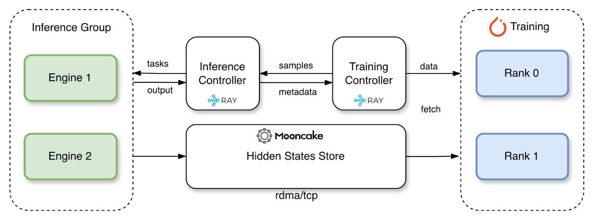
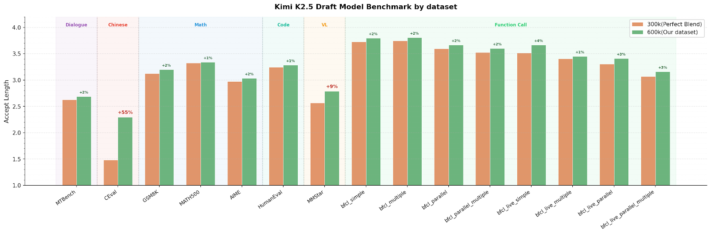
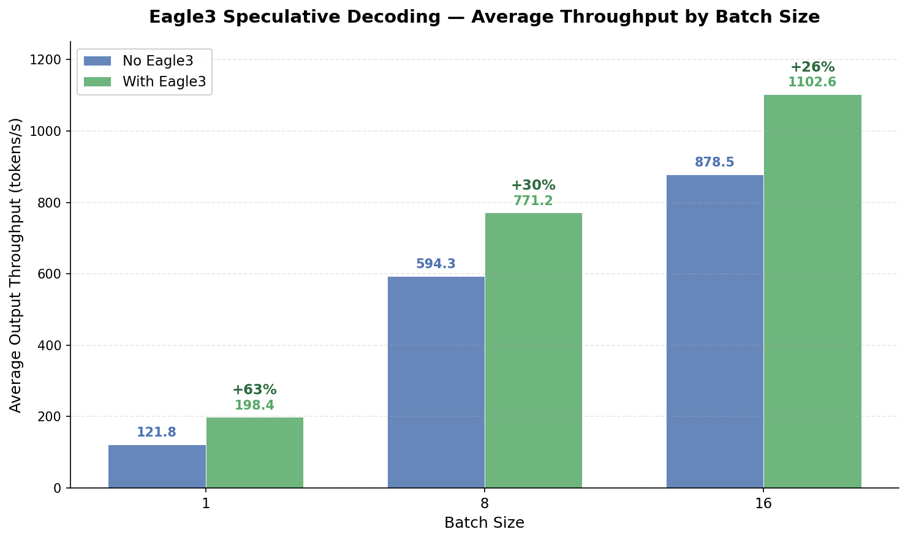
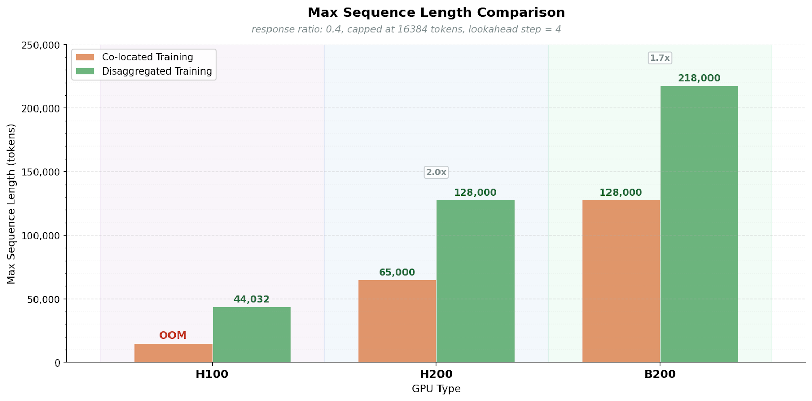

---
tags:
  - paper
  - collection/speculative-decoding
  - domain/model-systems
  - status/deep-review
  - topic/speculative-drafter-training
  - method/disaggregated-training
document_type: paper
domain: 02_model_systems/speculative_decoding
collection: speculative-decoding
review_status: deep-review
canonical: true
---

> [!info] 文档关系
> - 领域入口：[README](../README.md)
> - 父级 Survey：[Evolution](../surveys/evolution.md)
> - 正式资产：`../assets/papers/torchspec/`
> - 证据清单：[Figure inventory](../evidence/figure-inventory.md)

# TorchSpec: Speculative Decoding Training at Scale 精读分析

TorchSpec 解决的不是 target 推理本身，而是“如何给 speculative drafter 喂海量 target hidden states”。它把 target inference 与 draft optimization 放到独立 GPU groups，==中间只经 Mooncake 流 tensor、经 Ray 流 metadata==；这样避开百 TB 级离线缓存，也解除 target TP 与 draft FSDP/DP 的资源绑定。最大证据缺口是官方技术博客缺少同行评审和完整复现实验协议，性能图证明完整系统可用，却没有隔离 RDMA、调度、FSDP 与 EAGLE-3 训练配方各自贡献。

> 资料状态：TorchSpec 没有同名论文。本文以 PyTorch 官方技术博客（2026-03-19）、官方仓库 commit `ae4ee712dd6056000ff36f7f66796fea6866383b`、官方图表与代码为一手证据。

## 修订信息

- 当前文档版本：`1.0.0`
- 当前修订 ID：`rev-torchspec-20260804-initial`
- 当前修订时间：`2026-08-04T21:45:00+08:00`
- 替代版本：无（initial）

| 修订 ID | 文档版本 | 时间 | 修订者 | 类型 | 替代修订 | 迁移问题/解析 | 变更摘要 | 原因 | 影响位置 | 依据 | 对结论影响 |
|---|---|---|---|---|---|---|---|---|---|---|---|
| `rev-torchspec-20260804-initial` | `1.0.0` | `2026-08-04T21:45:00+08:00` | Codex | initial | 无 | 无 | 建立技术报告、官方代码和视觉证据精读 | 用户要求分析 TorchSpec | `analysis.md`、`figure_inventory.md`、代码快照 | PyTorch Blog、官方 repo、逐图 QA | material |

## 0. 资料与配图索引

- 技术报告：[PyTorch Blog](https://pytorch.org/blog/torchspec-speculative-decoding-training-at-scale/)
- 官方代码 commit：`ae4ee712dd6056000ff36f7f66796fea6866383b`
- 视觉证据：[Figure inventory](../evidence/figure-inventory.md)
- 官方机制图：`../assets/papers/torchspec/disaggregated-architecture.png`
- 官方结果图：`../assets/papers/torchspec/kimi-draft-benchmark.png`、`../assets/papers/torchspec/kimi-throughput.png`、`../assets/papers/torchspec/max-sequence-length.png`
- AI 生成图：未生成；官方 architecture 图已给出输入、控制器、Mooncake store、训练 ranks 和数据流。

## 0.1 术语与符号解释

### 0.1.1 术语表

| 术语 | 本文含义 | 别名 | 不等于/易混项 | 来源 |
|---|---|---|---|---|
| disaggregated training | target inference GPUs 与 draft training GPUs 物理解耦、独立扩展 | decoupled inference/training | 不是把训练样本离线存盘 | Blog “TorchSpec” section；README |
| hidden-state store | Mooncake 管理的跨节点 tensor 暂存与传输层 | Mooncake store | Ray controller 只传 key/metadata，不承载大 tensor | `transfer/mooncake/` |
| GPU Direct RDMA | NIC 直接向 GPU memory 搬数据，绕过 CPU staging | GDR | 默认 config 仍是 TCP 且 `enable_gpu_direct: false`；能力不等于默认启用 | Blog；`configs/default.yaml` |
| backpressure | sample pool 超限时暂停 inference dispatch，避免 tensor store 被生产端淹没 | watermark control | 不是训练梯度流控 | `controller/inference_manager.py` |
| train with decode | 训练期间由 target engine 从 prompt 自回归生成 response，再训练 drafter | online response regeneration | 不等于 EAGLE TTT 的多深度 rollout | Blog；configs `train_with_decode/` |
| offline replay | 从磁盘读取预先生成的隐藏状态，主要用于开发/单卡测试 | offline training | 不是主张的无磁盘在线路径 | `docs/offline_training.md` |

### 0.1.2 符号表

| 符号 | 含义 | 性质 | 作用域 | 单位/取值 | 来源 | 易混点 |
|---|---|---|---|---|---|---|
| $L$ | 每样本 token 数 | analysis-derived | per sample | tokens | blog storage table | 不等于 lookahead |
| $H$ | target hidden width | analysis-derived | per model | elements | Kimi K2.5: 7168 | aux hidden 拼接宽度是 $T H$ |
| $T$ | 传输的 auxiliary target layer 数 | analysis-derived | per recipe | integer | EAGLE-3 example: 3 | 最后一层 hidden 另计 |
| $b$ | 每元素字节数 | analysis-derived | per tensor dtype | bf16=2 | storage derivation | input IDs 为 int64=8 |
| $I$ | inference hidden-state generation capacity | code-defined | system level | samples/s | `docs/performance_metrics.md` | 不是推理服务 tok/s |
| $R$ | training consumption capacity | analysis-derived（代码显示为 `T`） | system level | samples/s | performance metrics | 为避免与 target layers 冲突，本分析写 $R$ |
| $Q$ | sample-pool bytes/entries | analysis-derived | runtime | bytes/samples | controller code | 大小受 Mooncake capacity/backpressure 限制 |

## 0.2 官方算法/系统总览

> PyTorch Blog 官方未编号图。Inference controller 从 training controller 取 task；engine 生成 hidden states 并写 Mooncake；控制面只回传 key/metadata；training ranks fetch tensor 后用 FSDP2 训练。稳定吞吐由较慢的一侧决定，sample pool 吸收短时速率波动。

## 1. 基本信息与署名

- 报告标题：*TorchSpec: Speculative Decoding Training at Scale*
- 发布：PyTorch Blog，2026-03-19
- 署名类型：机构/团队署名
- 署名机构：TorchSpec team；Mooncake team
- 机构署名依据：`PyTorch Blog title byline: TorchSpec team, Mooncake team`
- 第一作者、共同一作、通讯作者及个人机构对应：不适用，标题 byline 未署个人作者。
- Acknowledgement 列出团队成员，但星号含义没有 legend，因此不推断共同一作或通讯身份。
- 许可证：仓库 MIT；报告网页按站点条款。

## 2. 研究动机与问题—方案闭环

### 2.1 出发点与背景痛点

EAGLE-3 等 drafter 训练需要 target 的多层 hidden states。target 规模增大、上下文变长后，训练瓶颈从“能否算 drafter”变成“target 放在哪里、hidden states 怎么送到 trainer”。博客用 Kimi K2.5 举例：128K token、3 个 aux layers 加最后一层 hidden，bf16 数据约 7 GB/样本；10 万样本若离线存盘约 700 TB。

另一种常见方案是 target 与 drafter 共置。8x H100 总 640 GB，而约 575 GB target weights 按 8 路切分后每卡约 72 GB，仅剩约 8 GB 给 draft training。TTT 又要保留多 speculative depths 的 activation，因此博客称只能训练约 4096 context。核心约束不是 draft 参数量，而是 target resident memory 与训练 activation 争同一显存池。

### 2.2 现有方案为何不够

| 现有方案 | 可观察失败 | 具体场景 | 来源 | 根因 | 为什么简单修补仍不够 | 证据 |
|---|---|---|---|---|---|---|
| 离线预计算 hidden states | 存储和文件系统 I/O 爆炸 | 128K Kimi 样本约 7 GB，100k 样本约 700 TB；多实验并行会重复 materialize | paper-provided（blog） | token x layer x hidden width 线性放大 | 压缩可降常数但仍需序列化、版本管理与重复数据；无法自然支持 train-with-decode | Blog storage tables |
| target/draft 共置 | draft 训练上下文被 target weights 挤压 | 8x H100 每卡约 8 GB 余量，TTT 只能约 4K context | paper-provided（blog） | inference TP 与 training ranks 共用显存和拓扑 | 再加数据并行仍复制 target；只做 CPU offload 会引入 PCIe/host memory bottleneck | Blog memory table |
| 紧耦合并行配置 | 小 drafter 被迫沿用大 target 的 TP | 本文构造的说明例，不是官方实验：target TP=8，但 draft 只需 2 卡；共置仍无法把其余卡变成独立 DP/FSDP group | reviewer-created | 两个不同计算图共享 rank placement | 只调 microbatch 不解除 rank ownership 和 target memory resident | Blog “Rigid sharding” |

### 2.3 目标与成功标准

- 不把 hidden states 持久化到磁盘。
- inference 与 training GPU 数、TP/DP/FSDP 策略独立扩展。
- 支持长上下文、多节点、大规模 on-policy/target-regenerated 数据。
- 维持 pipeline 吞吐，不让 inference 饿死 training，也不让 sample pool 无限增长。
- 产出能在 vLLM/SGLang/TensorRT-LLM 等 serving 路径使用的 drafter checkpoint。

### 2.4 核心方案如何解决并优化问题

| 原问题 | 设计 | 改变变量/行为 | 因果机制 | 预期优化 | 证据 | 判断 |
|---|---|---|---|---|---|---|
| target 占 training 显存 | 分离 inference/training groups | 每组 GPU memory ownership | target weights 不驻留 training ranks | context/batch 上限 | max-length chart | supported as system observation |
| 离线 hidden storage | Mooncake streaming | tensor lifetime 从永久文件变临时 object | RDMA/TCP 直接搬运，metadata 与 tensor 分离 | storage/I/O | code store + blog | implementation-supported；未报告网络利用率 |
| 两侧速率不匹配 | sample pool + backpressure | $Q$ 与 dispatch | buffer 吸收抖动，watermark 暂停 producer | 稳定性 | controller code/tests | code-supported |
| target 模型多样 | inference-engine-native capture | hidden extraction 位于 production engine | 复用 engine 的 tokenizer/kernel/model support | model coverage/alignment | vLLM public API path, patches | supported but backend maturity differs |
| draft training 扩展 | FSDP2/USP/Ray placement | independent training mesh | 参数/activation 切分与 inference TP 解耦 | scale | code/examples | implementation-supported |

### 2.5 因果链与证据边界

长序列多层 hidden states 使离线缓存达百 TB，target resident weights 又使共置 training 缺显存；TorchSpec 将 target inference 移到独立 GPU group，通过 Mooncake 流式传 tensor，并由 Ray 控制 metadata、队列、placement 与 backpressure；training group 因而可用完整显存和自己的 FSDP/DP 策略。官方图支持更长 sequence，代码支持数据/控制路径，Kimi case 展示可训练 600k/6B token drafter 并带来 serving throughput 增益。

但完整系统同时改变了资源数量、并行策略、网络路径、数据规模和模型配方。博客没有 matched cost experiment，不能证明“同 GPU-hours 下 disaggregation 一定更快/更便宜”，只能证明它解除内存与拓扑约束并在给定配置下可运行。

## 3. 核心贡献

1. 以 Mooncake 为 hidden-state 数据面，消除长期磁盘 materialization。
2. 以 Ray actor/controller 为控制面，使 inference 与 training 独立 placement 和扩缩容。
3. 直接在 inference engine 内 capture hidden states，降低训练/部署 tokenization 与 kernel 偏差。
4. 提供 EAGLE-3、DFlash、DSpark 等训练路径、FSDP2、离线 replay、checkpoint conversion 和多 backend 工程实现。

## 4. 研究方法与系统实现

### 4.1 端到端流程

1. Dataset 进入 `AsyncTrainingController.prompt_buffer`。
2. `AsyncInferenceManager` 按 watermark 取 prompt，并 round-robin 分配给 engine actors。
3. target engine 生成 aux/final hidden states，写入 `EagleMooncakeStore`，只把 key 与 shape/dtype metadata 返回 controller。
4. controller 形成 per-DP-rank queues；`MooncakeDataFetcher` 拉 tensor、collate、H2D。
5. trainer 用 FSDP2 跑 EAGLE/DFly/DSpark 等 forward/backward；保存 DCP checkpoint，再转换到 HF/serving 格式。

### 4.2 组件级设计动机

| 设计 | why | 具体问题 | 机制 | 权衡 | 证据 | 判断 |
|---|---|---|---|---|---|---|
| control/data plane separation | author-stated | Ray 传 GB tensors 序列化昂贵 | Ray 只传 key，Mooncake 承载 tensor | 两套服务与生命周期管理 | blog + controller/store code | supported |
| Mooncake RDMA/TCP | author-stated | 跨节点高吞吐与 fallback | registered buffers/GDR or TCP | 依赖 NIC、driver、buffer sizing；默认不是 GDR | code/config | supported |
| backpressure by pool bytes | author-stated/code-defined | producer 快于 consumer 时 OOM | pool watermark 暂停新 inference | 过小会降低 overlap，过大占内存 | controller tests | supported |
| engine-native extraction | author-stated | HF 训练路径与 serving engine 偏差 | vLLM `extract_hidden_states` + KV connector | backend 需 public hook或patch | `vllm_engine.py`, patches | supported |
| FSDP2 + independent placement | author-stated | draft mesh 被 target TP 绑定 | separate device mesh and Ray placement | 跨节点通信和运维增加 | `training/fsdp.py`, examples | supported |
| offline replay | inferred as developer mode | 无多 GPU/engine 时调试困难 | 预生成文件重放 | 重新引入磁盘，不是规模化主路径 | docs/code | supported for dev |

### 4.3 关键公式

#### F1：隐藏状态存储/传输量

$$
\mathrm{Bytes}_{\mathrm{sample}}
=L\left(T H b_{\mathrm{aux}}+H b_{\mathrm{last}}\right)+L b_{\mathrm{id}}.
$$

**这条公式在算什么？** 计算一个样本若保存/传输多层 hidden states 需要多少字节。

**怎么读？** 每个 token 需要 $T$ 层 aux hidden 和一层 final hidden，再加 input ID。

**输入与输出。** 输入为 token 长度 $L$、hidden width $H$、层数 $T$ 与 dtype 字节；输出为 bytes/sample。

**变量在这里各做什么？** $b_{\mathrm{aux}}$/$b_{\mathrm{last}}$ 通常 bf16=2；$b_{\mathrm{id}}$ 对 int64=8。

**直觉。** 序列、层数或 hidden width 任一翻倍，数据量近似翻倍；vocab size 不直接进入，因为 logits 可由 final hidden + lm_head 重算。

**边界。** 不含 alignment、Mooncake metadata、padding、buffer fragmentation 与网络协议 overhead。

**小例子。** Kimi K2.5：$L=131072,H=7168,T=3$、bf16，aux 约 5.25 GiB，last hidden 约 1.75 GiB，合计约 7 GiB，与博客表一致。

#### F2：异步 pipeline 的稳态上限

$$
\mathrm{Throughput}_{\mathrm{pipeline}}\approx\min(I,R),
\qquad \frac{dQ}{dt}\approx I-R.
$$

**这条公式在算什么？** 判断 inference producer 与 training consumer 谁限制总体样本吞吐，以及 sample pool 是否增长。

**怎么读？** 两段流水线只能跑到较慢一段的速度；若 inference 更快，队列会积累，反之 training 等数据。

**输入与输出。** 输入是 inference capacity $I$ 和 training capacity $R$；输出是稳态 samples/s 与 pool 变化趋势。

**变量在这里各做什么？** $Q$ 是等待训练的样本池；backpressure 在 $Q$ 达阈值后降低有效 $I$。

**直觉。** 多加 inference engines 只在 $I<R$ 时提高端到端吞吐；当 $I>R$，应加 training ranks 或优化 fetch/compute。

**边界。** 近似忽略 batch 粒度、启动/尾部、失败重试与 nonstationary sequence lengths。

**小例子。** 本文构造：$I=18,R=12$ samples/s 时最终约 12 samples/s，pool 每秒先增长约 6，直到 backpressure 生效。

## 5. 关键结论与技术主张证据矩阵

| 主张 | 官方结果 | 控制/缺口 | 证据强度 | 判断 |
|---|---|---|---|---|
| 离线 hidden storage 不可持续 | 128K sample ~7 GB；100k ~700 TB | 公式可复算；不含压缩 | direct calculation | supported |
| 解耦提高 max sequence | H100 OOM vs 44,032；H200 65k -> 128k；B200 128k -> 218k | 图注给 response ratio/lookahead；软件版本和 batch 细节不足 | official benchmark | supported in reported setup |
| Kimi drafter quality | 600k dataset 相对 300k 在多数集 +1%-4%，CEval +55%、MMStar +9% | 数据量与数据分布同时变，不能归因“规模” | confounded | correlation-only |
| serving throughput | batch 1: 121.8 -> 198.4 (+63%); b8 +30%; b16 +26% | 比的是 with/without Eagle3；不是 TorchSpec 与其他 trainer | direct for resulting checkpoint | 证明模型有效，不隔离框架贡献 |
| independent scaling | Ray placement + separate engine/training configs | 未公开成本最优曲线 | code evidence | mechanism supported |
| no storage overhead | 主在线路径只存 Mooncake tensor | 仍有内存/network buffer；offline replay 存盘 | code evidence | “no persistent disk materialization”准确，不能说零数据开销 |

### 5.1 长上下文证据

该图直接支持“training GPUs 不放 target weights 后，序列上限上升”，但 H100 co-located 标成 OOM 而非具体可比长度，且 H200/B200 的 total GPU count、microbatch、FSDP strategy 未在图中完整固定。因此它是可行性证据，不是严格的同成本 scaling law。

### 5.2 收益归因

- 框架直接改变：显存归属、tensor transport、resource placement、pipeline overlap。
- drafter 算法改变：EAGLE-3 loss/TTT、数据规模、lookahead。
- serving 改变：是否启用 EAGLE3、batch size、engine/kernel。

官方 +63%/+30%/+26% 是“训练结果 + serving runtime”的组合收益，不能归因给 Mooncake 或 FSDP2。TorchSpec 的独立贡献应以可训练序列上限、磁盘 materialization 消除和 resource decoupling 衡量。

## 6. Related Work 对比

| 方案 | 数据路径 | 资源关系 | 优点 | 局限 |
|---|---|---|---|---|
| offline hidden cache | target -> files -> trainer | 时间解耦 | 简单、可复用 | 百 TB、I/O、版本陈旧 |
| co-located | same GPU memory | target TP 绑定 trainer | 无网络/磁盘中转 | 显存压力、独立扩展困难 |
| TorchSpec | engine -> Mooncake -> trainer | 两组独立 | 长 context、动态配比、engine alignment | 网络和分布式运维复杂 |
| AngelSpec | 继承 TorchSpec，再加 MTP/DFly/online eval | 同上 | 方法覆盖更广 | D-cut 仍未在 repo 中 |

## 7. 公开评审交叉核验

不适用 OpenReview。报告是机构署名的 PyTorch Blog；没有公开 reviewer、decision 或 rebuttal。仓库 adoption 和测试只说明实现使用情况，不等同同行评审。

## 8. Infra 需求分析

- 计算：target inference group 负责 prefill/hidden extraction；training group 负责 drafter forward/backward/optimizer。
- 显存：training group 不驻留 target weights，但仍需 activations、FSDP shards、optimizer state、receive buffers。
- 网络：单样本可达 GB 级，RDMA/RoCE/IB 更适合；TCP fallback 可运行但会经过 host/pinned buffers并受 CPU/DDR/NIC 限制。
- 并行：target 可 TP/PP；draft 可 FSDP2 FULL_SHARD/REPLICATE、DP 与 USP；Ray placement 可 training-first/inference-first/custom。
- 数值：hidden 通常 bf16；FSDP param bf16/fp16，reduce fp32/bf16；Kimi 等量化 target 可以在 engine 侧运行，但 blog 的“支持 FP8/INT4”是 engine compatibility 声称，不代表 trainer 在量化 hidden 上训练。
- scheduler：EnginePool round-robin + semaphore；sample-pool bytes 控 backpressure；perf metrics 区分 data_time 与 compute_time。

有效带宽需用：

$$
\mathrm{BW}_{\mathrm{eff}}=\frac{\mathrm{BytesMoved}}{t_{\mathrm{fetch}}},\qquad
\eta=\frac{\mathrm{BW}_{\mathrm{eff}}}{\mathrm{BW}_{\mathrm{peak}}}.
$$

官方未发布 fetch bytes/time 对照，因此无法给 RDMA utilization。代码的 `perf/data_time` 包含 queue get、Mooncake fetch、collation 和 H2D，不能直接当网络时间。

## 9. 开源代码对照

- commit：`ae4ee712dd6056000ff36f7f66796fea6866383b`
- 控制面：`torchspec/controller/training_controller.py`、`inference_manager.py`
- 数据面：`torchspec/transfer/mooncake/eagle_store.py`、`buffers.py`
- vLLM public API capture：`torchspec/inference/engine/vllm_engine.py`
- training/FSDP2：`torchspec/training/eagle3_trainer.py`、`fsdp.py`
- checkpoint/serving conversion：`torchspec/training/checkpoint.py`、`tools/convert_to_hf.py`
- Kimi 2-node H200：`examples/kimi-k25-2node-h200/`

代码版本比 2026-03 博客更新：README 当前已列 vLLM、SGLang、TensorRT-LLM、HF，且 DFlash/DSpark 已存在；博客 roadmap 中“未来支持 DFlash/MTP/TensorRT-LLM”的部分对当前 commit 已部分过时。MTP trainer 仍不在 TorchSpec repo，而 AngelSpec 扩展了这一路径。

测试：选取 `test_capacity_handling.py`、`test_partition_results.py`、`test_data_utils.py`，当前环境得到 49 passed、10 failed。失败集中在测试 conftest 将 `torch`/Ray Queue mock 为 `MagicMock` 后，dtype element size 与 queue return 不再是真实对象；因此不能把失败直接归为产品逻辑 bug，也不能声称测试全绿。需要官方 environment/Docker 复跑。

## 10. 优点与局限

### 优点

- 问题定义清楚：不是泛称“训练很贵”，而是量化 hidden-state bytes 与 target resident memory。
- control/data plane 分工在代码中一致，backpressure 与 capacity metrics 可操作。
- engine-native capture 降低训练与部署路径差异，并已扩展到多个 backend。
- 2-node/3-node Kimi scripts、checkpoint conversion 与 offline replay 提高工程可用性。

### 局限

- 没有同行评审或同名论文；博客实验协议不足以严格复现。
- 没有 matched total-GPU-hours/cost comparison；解耦通常需要额外独立 inference GPUs。
- 网络是新绑定约束：7 GB/sample 在大吞吐下可能压满 NIC，论文未报告有效带宽、重试、尾延迟或多租户干扰。
- “如果 engine 支持模型即可 out of the box”过强：代码仍需 layer-id 语义、connector、patch/config 与 checkpoint key mapping。
- 600k 数据相对 300k 的质量提升同时改变数据组成，不能归因纯数据规模。
- 当前测试未在项目标准依赖栈跑通。

## 11. 研究启发

1. 把 drafter training 看成 producer-consumer 系统，先量出 $I,R,Q$ 再扩容。
2. 比较 co-located 与 disaggregated 时必须固定 total GPUs、GPU-hours、网络和 target sample distribution。
3. 下一步应公开 tensor bytes/s、RDMA utilization、pool occupancy、失败恢复与 checkpoint reproducibility。

## 12. 待验证清单

1. 在相同 16 GPU、相同 wall time 下，解耦与共置的 time-to-quality 如何？
2. TCP、RDMA、GPU Direct 三路径的 data_time、CPU 使用与有效带宽是多少？
3. engine 升级是否改变 hidden layer indexing 或 tokenization，如何做契约测试？
4. 多个训练任务共享 inference group/Mooncake 时如何隔离 backpressure 和 buffer 生命周期？
5. Kimi 600k 模型的收益有多少来自数据组成、TTT、长 context 与框架？

## 13. 一句话总结

TorchSpec 把 speculative drafter 训练的核心瓶颈从“把 target 塞进 trainer”改造成可独立扩展的 hidden-state producer-consumer pipeline；其系统机制和代码较可信，但性能归因与成本公平性仍需要匹配实验。
