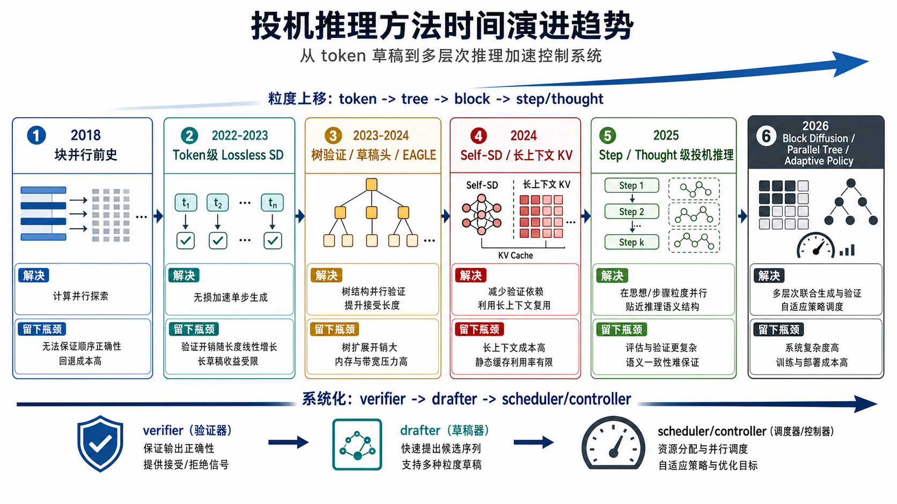
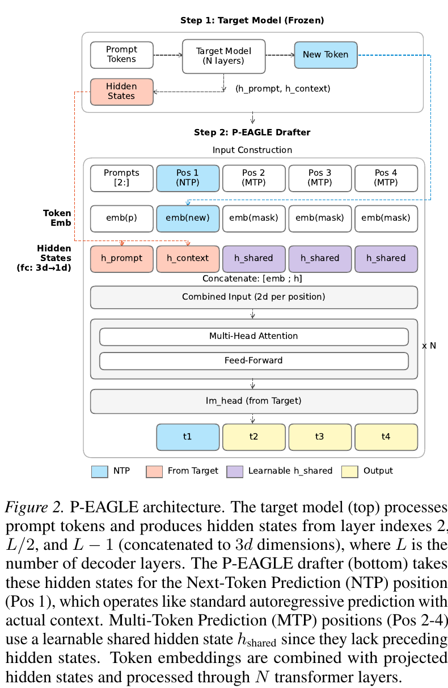
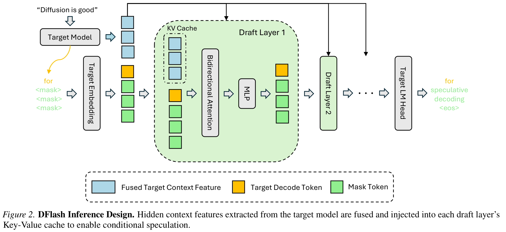
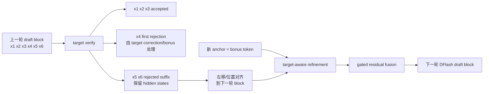

# 投机推理方法时间演进调研：从 Token 草稿到多层次推理加速

> [!info] 文档关系
> - 文档类型：Survey
> - 领域入口：[README](../README.md)
> - 证据资产：`../assets/surveys/evolution/`
> - 相关文档：[Foundations and trends](foundations-and-trends.md)

> 调研日期：2026-09-02
> 说明：本文参考本领域精读材料与 [Foundations and trends](foundations-and-trends.md) 的问题线索，并按新的论文检索、arXiv 元数据和 deep-research 六阶段结果重新组织。

## 修订信息

- 当前文档版本：`1.4.2`
- 当前修订 ID：`rev-spec-evolution-retrace-illustrated-20260903`
- 当前修订时间：`2026-09-03T23:00:00+08:00`
- 替代版本：`rev-spec-evolution-token-recycling-readout-20260903` / `1.4.1`

| 修订 ID | 文档版本 | 时间 | 类型 | 变更摘要 | 依据 | 对结论影响 |
|---|---|---|---|---|---|---|
| `rev-spec-evolution-delivery-remediation-20260725` | `1.1.0` | `2026-07-25T23:30:00+08:00` | evidence-and-link remediation | 更新六篇 canonical Paper 的精确证据入口、时间线边界与跨论文结论限制 | canonical Paper reviews、Figure inventory 与发布器校验 | minor；不新增 backlog Paper |
| `rev-spec-evolution-dels-spec-20260728` | `1.2.0` | `2026-07-28T18:30:00+08:00` | evidence update | 增补 DeLS-Spec：冻结 DFlash、独立训练短上下文专家，并严格限定其与 DSpark 的直接证据关系 | DeLS-Spec arXiv/source/code、Table 2、canonical Paper | material：新增一个 DSpark 发布后的算法演进节点 |
| `rev-spec-evolution-dynamic-verify-runtimes-20260902` | `1.3.0` | `2026-09-02T20:00:00+08:00` | implementation evidence update | 固定 vLLM/SGLang commit，补充动态 verification 与 CUDA Graph 的实际分桶、ragged packing、回退及数据并行约束 | vLLM `b205750`、SGLang `ebfd8c6` 官方源码 | material：收紧 LibraSpec 的 serving 可落地边界 |
| `rev-spec-evolution-rejection-feedback-20260903` | `1.4.0` | `2026-09-03T22:00:00+08:00` | mechanism/evidence update | 补充拒绝采样的 lossless 概率守恒、reject error signal 的已有路线，以及 rejected-suffix 跨轮条件化 | Leviathan/DeepMind speculative sampling、OSD、Token Recycling、OnlineSPEC、ReTrace 原文 | material：把 verification feedback 从“裁决结果”扩展为可复用的 draft adaptation 信号 |
| `rev-spec-evolution-token-recycling-readout-20260903` | `1.4.1` | `2026-09-03T22:30:00+08:00` | explanation clarification | 展开 Token Recycling adjacency matrix 的存储语义、逐层构树、并行更新与上下文丢失边界 | Token Recycling Sections 3.1-3.3、5.2 与 Appendix A.3-A.5 | minor：不改变路线判断，补足机制可读性 |
| `rev-spec-evolution-retrace-illustrated-20260903` | `1.4.2` | `2026-09-03T23:00:00+08:00` | explanation clarification | 用流程图、位置映射和门控残差公式解释 ReTrace 如何复用 rejected suffix | ReTrace arXiv `2608.29748` 摘要与机制描述 | minor：不改变证据边界，提升可读性 |

本文是 canonical timeline；[Foundations and trends](foundations-and-trends.md#1-lossless-correctness-contract) 维护完整的 lossless correctness、accepted-length、draft/verify 成本与 KV/serving 基础合同。本文只在拒绝反馈成为独立演进路线的位置重述必要的概率守恒，以说明哪些反馈复用仍然 lossless。

## 精读证据入口

[P-EAGLE](../papers/p-eagle.md) · [DFlash](../papers/dflash.md#5-关键结论与技术-claim-证据矩阵) · [D²SD](../papers/d2sd.md#5-关键结论) · [JetSpec](../papers/jetspec.md) · [HyperDFlash](../papers/hyperdflash.md) · [DSpark](../papers/dspark.md#5-关键结论与技术主张证据矩阵) · [DeLS-Spec](../papers/dels-spec.md) · [AngelSpec](../papers/angelspec.md) · [TorchSpec](../papers/torchspec.md) · [AcceptMoE](../papers/acceptmoe.md) · [LibraSpec](../papers/libraspec.md)

LibraSpec 将扩散式草稿器的动态长度选择改写为“新增接受收益是否值得验证成本”的边际判断；它用 drafter 置信度近似 target 接受概率，在六个 target、三种 diffusion drafter 上报告了更高的端到端加速，但理论最优性仍受概率校准与近似常数成本假设约束。详见 [LibraSpec 精读](../papers/libraspec.md)。

2026 年新增的两个系统锚点是 [AngelSpec](../papers/angelspec.md) 和 [TorchSpec](../papers/torchspec.md)：前者把 workload 分工、DFly 并行草稿和 D-cut 全局验证预算组合起来；后者把 target hidden-state 生成与 drafter 训练解耦。两者的吞吐数字都属于完整系统结果，不能脱离 serving、网络和训练配方独立归因。

## 资料获取与可追溯性

本次调研过程中实际获取/使用了三类材料：

- **论文元数据与全文线索**：通过 arXiv API 检索并整理了 39 篇 paper；Semantic Scholar 公共 API 当时返回 429，因此没有编造 citation count。
- **本地论文/PDF/source**：复用了当前仓库已归档的 DFlash、D2SD、JetSpec、HyperDFlash、P-EAGLE 等论文 PDF、LaTeX source、提取文本和页面/图表裁剪。
- **代码/仓库线索**：记录了 EAGLE、Medusa、LayerSkip、Kangaroo、DFlash、D2-SD、JetSpec、LookaheadReasoning 等仓库；其中 DFlash、JetSpec、DSpark/DeepSpec 等在已有精读材料里有本地浅克隆或 commit 线索。GitHub API 本轮被匿名限流，因此未使用实时 star 数。

下面正文中的部分图来自本地已归档的论文原图或论文截图，作为关键原理证据图使用。

## 0. 核心结论

投机推理的演进不是“某个新方法替代旧方法”，而是一条逐层上移、逐层并行化的技术路线：

```text
2018          2022-2023            2023-2024              2024                  2025                         2026
块并行前史 -> token级lossless SD -> 树验证/草稿头/EAGLE -> self-SD/长上下文KV -> reasoning-level投机 -> block diffusion/parallel tree/adaptive policy
```

这条线的本质变化有五个：

1. **投机粒度上移**：token -> token tree -> block -> reasoning step / thought。
2. **drafter 更靠近 target**：独立小模型 -> target attached heads -> target hidden-state conditioning -> self-speculation -> 模型架构对齐 drafter。
3. **并行化从 verifier 扩展到 drafter**：早期只是 target 并行验证，2026 年开始重点解决 drafter 自己仍串行的问题。
4. **正确性合同分化**：lossless target distribution 仍是底座，但 reasoning 场景引入语义等价、reward-guided acceptance 和 final-answer quality 导向。
5. **系统调度成为主角**：KV-cache、tree/cascade attention、CUDA graph、vLLM/SGLang 调度和动态 budget 决定真实 speedup。



上图是根据本次调研结果生成的总览图；下面的原论文图用于支撑若干关键阶段的机制分析。

## 1. 2018：块并行的前史，但还没有现代投机合同

代表工作是 **Blockwise Parallel Decoding**。它已经提出一次预测一块未来 token 的思路，但与现代 speculative decoding 的关键差别在于：它还没有通用的 `draft -> target verify -> accept/correct` 合同。

这个阶段解决的是“能不能并行猜多个 token”；没有解决的是“猜错后如何保证 target 输出不变”。后来 DFlash 等 block diffusion 方法重新回到 block 预测，但已经把它放进 target verification 框架内，因此风险由目标模型吸收。

## 2. 2022-2023：Token 级 Lossless Speculative Decoding 奠基

代表工作：

- **Fast Inference from Transformers via Speculative Decoding**：ICML 2023 Oral，T5-XXL 上报告 2-3x 加速。
- **Accelerating Large Language Model Decoding with Speculative Sampling**：DeepMind，Chinchilla 70B 上报告 2-2.5x 加速。

这一阶段的基本结构是：

```text
小 drafter 连续生成 γ 个 token
        ↓
target model 一次性并行评分这些 token
        ↓
按接受规则提交最长正确前缀，错误处由 target 修正
```

它的贡献在于建立了 **lossless / distribution-preserving** 合同，使加速不改变 target 行为。但它也马上暴露了后续所有工作的共同瓶颈：

严格的接受-纠正规则、residual distribution 与 speedup 上限见 [基础合同](foundations-and-trends.md#1-lossless-correctness-contract) 和 [acceptance 成本模型](foundations-and-trends.md#2-acceptanceaccepted-length-与速度上限)；本节只维护历史位置。

- 如果要求 token 精确匹配，`γ` 越长，整段草稿全对概率越低；
- 如果 drafter 本身也是自回归，`γ` 越长，draft latency 越高；
- 如果 drafter 和 target 分布差距大，接受率会迅速下降。

后续演进基本都在回答一个问题：如何在不破坏 correctness contract 的前提下，提高 accepted tokens per expensive target pass，同时控制 draft/verify 成本。

## 3. 2023-2024：从单链草稿到树验证、草稿头和 EAGLE

### 3.1 为什么需要树

单链 speculative decoding 的弱点是“一错全废”：第一个 token 错了，后面即使有些 token 本来可用，也无法提交。**SpecInfer** 把候选组织成 token tree，让 target 在一次前向中验证多条候选路径。**Sequoia** 进一步用硬件感知方式优化树结构。

这条路线的变化是：

```text
一条草稿链 -> 多分支 token tree
```

它解决了候选覆盖问题，但引入新成本：tree attention、candidate metadata、verification node budget。如果树太大，accepted length 上升也未必等于 wall-clock speedup。

### 3.2 为什么需要 target-attached heads

独立小模型虽然概念简单，但部署麻烦，还可能和 target 分布不匹配。**Medusa** 给 target 加多个 decoding heads，一次预测多个未来 token；**Hydra** 强化 head 之间的依赖；**EAGLE** 则更进一步，用 target 的高层 hidden states 做 feature-level drafting。

这条路线的变化是：

```text
外部小 drafter -> target 内部或旁路草稿能力
```

EAGLE 的关键价值在于指出：future-token signal 很大程度已经存在于 target hidden states 中。相比纯 token 小模型，它接受率更高，也因此成为 2024-2026 许多论文的强基线。

但 EAGLE 类方法留下一个重要瓶颈：强接受率不等于低 draft cost。许多 EAGLE draft 仍按 token 顺序生成，`K` 个 draft token 需要多次 drafter forward。这直接引出 2026 的 P-EAGLE 和 block diffusion 路线。

## 4. 2024：Self-Speculation 与长上下文 KV-cache 问题

代表工作：

- **LayerSkip**：训练早退层，浅层作为 self-drafter，完整模型验证。
- **Kangaroo**：双早退机制降低 self-draft 成本。
- **TriForce / MagicDec**：面向长上下文和 KV-cache 的层级/稀疏 speculative decoding。

这阶段的变化是：

```text
外部/附加 drafter -> target 自身的早退层、稀疏注意力或 KV 子集
```

它的动机很直接：如果 target 自己能草稿，就不需要额外小模型，也减少模型间分布不匹配。对于长上下文，真正贵的不只是算一次 transformer，而是每步读取越来越大的 KV-cache。

这个阶段为推理模型时代铺路。长 CoT 输出会让 decode 阶段持续变长，KV-cache 访问和调度尾延迟变成主要瓶颈。

## 5. 2025：Speculative Reasoning 出现，粒度从 Token 升到 Step/Thought

2025 年是“投机推理”从普通 speculative decoding 中分化出来的关键节点。原因是 reasoning model 的输出形态变了：它不只是生成答案，而是生成很长的推理轨迹。

### 5.1 Reward-Guided Speculative Decoding

RSD 用 process reward model 判断中间步骤质量，并决定是否调用 target model。它不再严格追求无偏 target 分布，而是在推理任务中优化质量/成本折中。

这反映了 reasoning 场景的一个变化：用户最终关心答案质量和推理可靠性，不一定只关心逐 token 复现 target。

### 5.2 Speculative Search

Speculative Search 面向 tree-search reasoning。传统 Tree-of-Thought / MCTS 式方法需要生成大量 thought，延迟很高。SpecSearch 用小模型和大模型在 thought/token 两层协作，过滤低质量 thought。

这里投机对象已经不是单个 token，而是搜索树中的中间推理节点。

### 5.3 Lookahead Reasoning

Lookahead Reasoning 是最典型的 step-level speculative reasoning。它的关键判断是：

> 推理步骤只需要语义正确，不需要 token 完全相同。

因此，小模型可以草拟未来几个 reasoning steps，target 批量展开并由 verifier 判断语义等价。token-level SD 仍可在每个 step 内部使用，所以二者是正交叠加关系。

这条路线真正突破的是 token-level ceiling：当验证单位变成语义步骤后，接受条件不再是逐 token exact match。

### 5.4 SparseSpec

SparseSpec 从系统角度回答长 CoT 的问题。reasoning model 输出很长，每步 full attention 都要读完整 KV-cache，因此 decode 从 compute-bound 转向 memory-bound。SparseSpec 用 self-speculation 和 PillarAttn 稀疏选择关键 token，并配合 scheduler、delayed verification 和动态 KV-cache 管理。

因此，2025 年形成了两条互补方向：

| 方向 | 代表 | 解决什么 |
|---|---|---|
| Step/thought-level speculation | Lookahead Reasoning, Speculative Search, RSD | 减少昂贵 target 生成的推理步骤/思考节点 |
| Memory/system-aware speculation | SparseSpec | 减少长 CoT token 级解码的 KV-cache 成本 |

### 5.5 Step-level / Semantic Speculation 的最新分化

截至 2026-07-02，step-level 方向已经从单纯的 “small draft + target verify” 分化成三类：语义 step 接受、SRM-LRM 协同推理、以及 router/controller 调度。它们的共同点是：**不再试图保证逐 token 等价，而是以最终答案质量、延迟和成本的 Pareto 折中为目标**。

| 工作 | 时间 | 核心做法 | 适合放在哪条线 |
|---|---:|---|---|
| [SpecReason](https://arxiv.org/abs/2504.07891) | 2025-04 | 轻量模型先执行中间 reasoning steps，base/LRM 负责评估和必要纠正；论文明确利用 thinking tokens 的语义灵活性，并把它与 token-level speculative decoding 区分开。 | step-level semantic speculation 的代表 |
| [Speculative Thinking](https://arxiv.org/abs/2504.12329) | 2025-04，2026-06 修订 | training-free 框架，让大模型在推理层面指导小模型；在 `wait`、反思、结构分隔等位置介入，减少无效回溯并提高小模型推理质量。 | SRM-LRM collaborative reasoning |
| [Arbitrage](https://arxiv.org/abs/2512.05033) | 2025-12 | 面向 step-level semantic verification 的拒绝浪费问题，训练轻量 router 判断 target 是否可能产生“显著更好”的 step，而不是固定阈值接受/拒绝。 | advantage-aware router |
| [ConfSpec](https://arxiv.org/abs/2602.18447) | 2026-01 | confidence-gated cascaded verification：小模型高置信时直接接受，低置信样本升级到 target；目标是匹配 target accuracy 的同时减少 target 调用。 | confidence-gated verifier/controller |
| [SemanticSpec](https://arxiv.org/abs/2602.03708) | 2026-02 | 不验证 token，而验证 semantic sequences；用 target 内部 hidden states probing 估计某种语义序列概率，报告在 DeepSeekR1-32B 和 QwQ-32B 上超过 token-level baseline。 | semantic-aware speculative decoding |
| [TrigReason](https://arxiv.org/abs/2604.14847) | 2026-04 | 系统刻画 SRM 的三类风险：路径偏离、认知过载、恢复能力不足；只在战略规划、过度自信、循环等 trigger 上调用 LRM。 | trigger-based SRM-LRM collaboration |

这些工作很有工程价值，但它们也把 step-level 路线的理论边界暴露得更清楚：自然语言 step 不是一个稳定、可精确定义的随机变量。target 一次性判断“这个 step 可以接受”，并不等价于 “target 自由生成时会选择同一条推理轨迹”，更不等价于保持 target model 的输出分布。

因此，step-level 方法和 token-level lossless speculative decoding 的关系应当这样区分：

| 维度 | Token-level / token-tree SD | Step-level / semantic speculation |
|---|---|---|
| 验证对象 | 明确 token 序列或 token tree 节点 | 自然语言 reasoning step / thought / semantic sequence |
| 正确性合同 | 可以做到 target distribution preserving | 通常只能保证经验上的 final-answer quality |
| 接受规则 | target logits 下的接受-拒绝或等价变体 | semantic verifier、置信门控、router、trigger |
| 失败模式 | 接受率低、draft latency 高、tree verify 成本高 | 语义漂移、错误中间假设被接受、target 轨迹被剪掉 |
| 合理定位 | lossless acceleration | lossy reasoning acceleration / proposal-and-verification |

更尖锐地说：如果 step-level 方案只是让小模型先写 CoT 再直接采用，那它本质上就是“小模型推理”，不是 speculative decoding。只有当 target 或由 target 校准的 verifier/controller 拥有最终裁决权时，它才是 proposal-and-verification reasoning；即便如此，它也一般不能声称 lossless。

## 6. 2026：Drafter 自身并行化，Block Diffusion 和 Parallel Tree 成为前沿

这些方法在机制上的统一分类及其 draft/tree/verify 成本见 [Token、Tree 与 Block taxonomy](foundations-and-trends.md#3-mechanism-taxonomy)；本节按时间顺序展开。

2026 年最明显的趋势是：社区开始集中解决 **drafter 自身仍然串行** 的问题。

### 6.1 P-EAGLE：把 EAGLE 从顺序 draft 改成并行 draft

P-EAGLE 的出发点是：EAGLE 接受率高，但草稿 token 仍顺序生成。P-EAGLE 用 parallel MTP drafter 一次预测多个 token，并用 mask pre-computation、dependency-preserving sequence partitioning 解决 reasoning 长上下文训练成本。



这张原论文结构图展示了 P-EAGLE 的关键机制：target model 冻结并提供 hidden states，P-EAGLE drafter 将 NTP 位置和多个 MTP 位置放进同一次输入构造中，用共享可学习 hidden state `h_shared` 和 mask token embedding 一次性预测多个未来 token。这正是它区别于顺序 EAGLE drafter 的地方。

它代表了 EAGLE 路线的自然演进：

```text
高接受率 feature drafter -> 保留 target feature 优势，同时降低 draft latency
```

工程边界需要按时间区分：论文训练代码仍未公开，但截至 2026-07-25，vLLM 已合并 P-EAGLE 推理支持并发布官方实现说明，三个公开 drafter checkpoint 也已核验；这些是论文发布后的 runtime 证据，不应倒推为论文训练可复现性。详见 [代码与 checkpoint 对照](../papers/p-eagle.md#9-开源代码与-checkpoint-对照)。

### 6.2 DFlash：用 Block Diffusion 让草稿一轮并行生成

DFlash 的关键转向是把 diffusion model 从“最终生成器”改为“speculative drafter”。扩散模型独立生成质量不如 AR LLM 并不致命，因为最后由 target 验证。它的优势是：一个 forward 生成整个 block，draft latency 不随 block length 线性增长。



这张 DFlash 原理论文图说明了它的核心工程设计：target model 的 fused context feature 通过 KV 注入进入 diffusion drafter；block 内多个 mask token 在 draft layer 中并行预测，最后再由 target LM head/target model 做 speculative verification。也就是说，DFlash 不是让 diffusion model 独立生成最终答案，而是把 diffusion 当成低延迟 block proposal 模块。

DFlash 解决的是：

```text
AR drafter: draft token 1 -> token 2 -> ... -> token K
DFlash:    一次 forward 生成 block 1..K
```

本地精读显示，DFlash 在 Qwen3-8B 上多个 reasoning/code/chat benchmark 可达到约 4-5x 级别 speedup，accepted length 约 5.5-6.5；论文摘要报告部分设置超过 6x，并显著优于 EAGLE-3。精确实验边界与归因见 [DFlash 关键结论与 claim 证据矩阵](../papers/dflash.md#5-关键结论与技术-claim-证据矩阵)。

但 DFlash 留下两个新问题：

- block 内 token 缺少充分 left-to-right dependency，后缀接受率会下降；
- 固定 block size 不适合所有样本和 serving load。

### 6.3 DDTree / D2SD：从单条 block 到扩散草稿树

DDTree 试图用 DFlash 每个位置的分布构造 candidate tree，解决单条 block “早错后缀全废”的问题。但它也暴露一个结构性缺陷：per-position marginal 可能单点合理、组合成路径却不合理。

D2SD 则更有针对性：先由 DFlash 生成 block 和 confidence，估计最可能的拒绝边界，再用第二个 variable-prefix diffusion drafter 在这些边界重新生成后缀，形成共享前缀树。它的核心趋势是：


这张 D2SD 原论文流程图非常清楚地展示了它相对 DFlash 的演进：左侧 DFlash 单条草稿在第一个 mismatch 后丢弃后缀；右侧 D2SD 先用 per-position confidence 预测最可能拒绝边界，再通过 Top-K Unmask 和 VP-Drafter 生成共享前缀分支，最后由 target model joint cascade tree verify，提交最长 accepted prefix。

```text
盲目加长 block / 随机多采样 -> 根据 confidence 把分支放在最可能出错的位置
```

本地精读指出，D²SD 也提醒了一个重要原则：accepted length 不是唯一指标。额外层级可能提高接受长度，但如果 draft/verify 成本更高，speedup 反而下降。完整问题—方案闭环、系统成本与证据分类见 [D²SD 研究方法](../papers/d2sd.md#4-研究方法)、[关键结论](../papers/d2sd.md#5-关键结论)和[Infra 需求分析](../papers/d2sd.md#8-infra-需求分析)。

### 6.4 JetSpec：用 Causal-Parallel Head 修复扩散树路径不一致

JetSpec 直接瞄准 DDTree/DFlash-style tree 的问题：并行 diffusion head 给的是 branch-agnostic per-position marginal，不是真正条件在路径前缀上的分布。

JetSpec 的方案是在 draft head 的 depth 维引入 causal conditioning，同时保持 one-forward drafting。它希望得到：


JetSpec 的原论文图展示了三步机制：从 frozen target model 抽取多层 hidden states并融合；用 causal-parallel draft head 一次产生候选分数；再构树并让 target model 并行验证。深度因果 mask 最直接锚定的是 rank-1/argmax 主干，不足以证明所有 off-argmax 分支都按各自祖先条件化；因此它缓解 per-position marginal 拼接不一致，但不等于完整 branch-wise causal drafting。详见 [条件性边界](../papers/jetspec.md#62-因果并行到底条件于什么)。

```text
并行 draft 的低成本 + AR path conditioning 的路径一致性
```

本地精读显示，JetSpec 在 Qwen3-8B、H100、tree budget 256 下，MATH-500 报告 9.64x speedup / accepted length 10.76，MT-Bench 报告 4.58x / 5.94。固定公共 vLLM 路径只支持 greedy tree decoding，temperature 1 的 lossless 路径不能由该代码复现；所以它代表 high-budget tree scaling 的重要方向，但非贪心结论仍依赖论文环境。

### 6.5 HyperDFlash / DFlare / BlockPilot：从通用 block draft 到模型/样本/系统自适应

HyperDFlash 面向 DeepSeek-V4 Hyper-Connection，对齐 pre-collapse residual 和 gated residual reducer，并加入前两个位置的 KL distillation，说明 block drafter 正在变得 model-specific。其 matched six-step 结果支持完整 bundle 的优势，但没有 reducer-only、KL on/off 或 runtime decomposition，不能把全部收益拆分归因给单一组件；详见 [收益来源归因](../papers/hyperdflash.md#54-收益来源归因)。

DFlare 扩展 DFlash 的 target feature fusion 和 drafter capacity，说明 block diffusion 的下一步是提高条件信息和模型容量。

DSpark 则在 parallel block 与 autoregressive draft 之间插入 lightweight sequential head，并以 confidence scheduler 动态裁剪验证前缀。截至 2026-07-25，官方 arXiv `2607.05147v1`、source、DeepSpec 代码与公开 checkpoint 均已核验；旧材料中“无 arXiv/source”的结论已失效。其 [研究方法](../papers/dspark.md#4-研究方法)、[关键结论与证据矩阵](../papers/dspark.md#5-关键结论与技术主张证据矩阵)与 [Infra/生产归因边界](../papers/dspark.md#8-infra-需求分析)明确区分离线 drafter 证据和 whole-stack 线上收益。

BlockPilot、CaDDTree、EntMTP、WhiFlash 则显示另一个趋势：固定 speculation budget 正在被淘汰。系统需要根据当前样本、entropy、batch size、verification cost 和 drafter 类型选择策略。

### 6.6 拒绝采样：为什么 lossless，以及为什么 rejection 本身是有价值的反馈

早期 speculative decoding 的“接受/拒绝”不是一个质量打分器，而是一套保持 target 分布不变的抽样合同。给定已确认上下文 $h$，target 和 drafter 的 next-token 分布分别为 $p(x\mid h)$ 和 $q(x\mid h)$。drafter 先采样 $x\sim q$，再以

$$
a(x)=\min\left(1,\frac{p(x\mid h)}{q(x\mid h)}\right)
$$

的概率接受它。因而通过“draft 提出并被接受”输出 $x$ 的概率质量是：

$$
q(x\mid h)a(x)=\min\{p(x\mid h),q(x\mid h)\}
$$

接受分支只拿走两分布的重叠部分。剩余的 target 质量是

$$
[p(x\mid h)-q(x\mid h)]_+
$$

它的总量等于拒绝概率：

$$
1-\alpha=\sum_x[p(x\mid h)-q(x\mid h)]_+,
\qquad
\alpha=\sum_x\min(p,q)
$$

所以拒绝后不能再从完整的 $p$ 重新采样，否则会把已经在接受分支中出现的概率质量重复计算。正确做法是从 residual distribution 采 correction：

$$
r(x\mid h)=
\frac{[p(x\mid h)-q(x\mid h)]_+}
{\sum_y[p(y\mid h)-q(y\mid h)]_+}
$$

最终输出 $x$ 的概率为

$$
\underbrace{\min(p(x),q(x))}_{\text{接受 draft}}
 +
\underbrace{(1-\alpha)r(x)}_{\text{拒绝后 correction}}
 =
\min(p(x),q(x))+[p(x)-q(x)]_+
 =p(x)
$$

这就是 lossless 的原因：每个 token 的 target 概率质量都恰好由“接受 draft”或“residual correction”两条互斥路径提供。多 token 草稿只是对每个已接受前缀位置重复这套单 token 证明；首个拒绝位置采 correction，后面的 token 因为条件在被拒 token 上而不能直接提交。若整段都接受，则从新的已确认上下文采一个 target bonus token，同样不改变 target 分布。该合同来自 [Leviathan et al., ICML 2023](https://proceedings.mlr.press/v202/leviathan23a.html) 和 [DeepMind speculative sampling](https://arxiv.org/abs/2302.01318)。

因此，一次 rejection 不是“这个 token 永远错误”。如果 $p(x)=0.4,q(x)=0.5$，该 token 被提议时仍有 $0.4/0.5=0.8$ 的条件接受概率；被拒只表示这次抽样没有保留 drafter 对它多给出的那部分质量。尤其在 temperature sampling 下，不能把 rejected token 当成硬负标签，也不能在下一轮无条件把它加入 blacklist。

### 6.7 Reject error signal：从丢弃结果到下一轮 draft 条件

拒绝位置仍然暴露了有用信息：target 在哪里不同意 drafter、target correction/bonus 是什么、$p-q$ 的差异有多大，以及首个 mismatch 之后被丢弃的 suffix 是否仍保留语法或语义方向。现有工作可以分成四个强度层级：

| 反馈用法 | 代表工作 | 反馈如何进入下一步 | 是否即时改变下一轮 token proposal | 证据边界 |
|---|---|---|---|---|
| target correction / residual | Leviathan、DeepMind | 只在当前拒绝位置补回 target 缺失概率质量 | 是，但仅是当前轮 correction | lossless 合同，不是跨轮学习 |
| online distillation | [OSD](https://arxiv.org/abs/2310.07177) | 记录错误位置和 target logits，周期性更新 drafter 参数 | 间接；更新有缓冲和间隔 | ICML 2024；目标是 query 分布适应 |
| candidate recycling | [Token Recycling](https://arxiv.org/abs/2408.08696) | 把 accepted 与 rejected draft 节点处的 target top-k 后继写入 adjacency matrix | 是；后续构树会读取这些候选 | ACL 2025；使用 token transition，不是硬负样本 |
| rejected-trajectory conditioning | [ReTrace](https://arxiv.org/abs/2608.29748) | 对 rejected suffix hidden states 左移对齐，用同次 verify 的 target states 修正，再门控注入下一 block | 是；保留一轮 conditioning signal | 2026-08-30 v1 预印本，当前主要验证 DFlash/Qwen3 |

#### Token Recycling 的 adjacency matrix 怎么用

这里的 adjacency matrix（邻接矩阵）容易让人误以为它保存了一个 $|\mathcal V|\times|\mathcal V|$ 的稠密转移概率表。实际结构更像一张放在 GPU 上、可批量索引的**定长邻接表**：

$$
\mathcal M\in\mathcal V^{|\mathcal V|\times k},\qquad
\mathcal M[x]=[y_1,y_2,\ldots,y_k]。
$$

每一行由一个 token ID $x$ 索引，行内只保存 target 模型过去在 $x$ 后面给出的 $k$ 个最高概率候选 token ID，且按当时概率从高到低排列；它不保存完整概率，也不保存产生这次预测的长上下文。论文设置 $k=8$，报告额外显存约 1.95 MB。矩阵可全零冷启动，也可沿用先前请求更新过的矩阵进行 hot start；后一种做法用少量常驻状态换取首轮就有可用候选。

一次解码循环可拆成四步：

1. **从当前 token 读一行。** 以已提交前缀的最后一个 token 为根节点，例如 `guest`，读取 $\mathcal M[\texttt{guest}]$，得到按优先级排列的 `speaker`、`speak`、`Spe` 等候选。
2. **逐层查表形成树。** 对第一层候选再次批量索引矩阵，例如 $\mathcal M[\texttt{speaker}]$ 给出 `at`、`for`，$\mathcal M[\texttt{speak}]$ 给出 `ings` 等。论文不是无约束地做完整广度优先搜索，而是套用一个预先确定形状的静态、不平衡树模板：排名靠前的节点分到更多子节点、也能继续得更深。这样树形和 attention mask 可以预处理，运行时主要是按层 gather，而不是逐节点搜索。
3. **由 target 一次并行验证整棵树。** 所有节点按层摊平成 merged sequence，再用 tree attention 保证每个节点只看见自己所在分支的祖先。target 选择与自回归结果一致的最长路径提交；矩阵只负责提出候选，不负责决定最终输出。
4. **把本轮 target 结果写回。** target 已经为树中每个 draft 节点 $\tilde x_i$ 算出了“沿该节点所在路径，下一个 token 是什么”的分布 $\tilde p_{i+1}$，于是直接覆盖对应行：

$$
\mathcal M[\tilde x_i]\leftarrow\operatorname{argtopk}(\tilde p_{i+1})。
$$

关键在于第 4 步会更新**所有** draft 节点，而不只是最终被接受路径上的节点。某个节点这轮被拒绝，通常只说明它不适合当前完整上下文；target 在它后面给出的 top-k 仍可能包含通用的局部组合，之后换一个上下文就能命中。论文案例中，`be` 所在分支第一轮没有提交，但其后继候选仍被写入矩阵；下一轮前缀走到 `could` 时，矩阵提出 `could -> be -> a -> great`，其中 `be -> a` 正是来自先前 rejected 节点的信息。这也解释了消融中更新所有 draft 节点的 MAT 高于只更新 accepted 节点。

这个结构快的原因也是它的主要限制：$\mathcal M[x]$ 只按单个 token $x$ 寻址，把不同上下文中出现的同一个 $x$ 压进同一行。因此它擅长标点、固定搭配、词内 token 延续等局部规律，却不能表达“同一个 token 在不同主题或长程依赖下应接什么”。同一 token 在树的多个分支出现时，还会有多组不同的 target top-k 争写同一行；论文实现选择不额外排序或加锁，允许并行 CUDA 写入产生混合结果，因为严格挑选首次或末次出现虽会轻微改变 MAT，却增加了足以影响吞吐的管理开销。错误或陈旧候选仍需 target 验证，主要损失是树预算和速度，而不是直接把它们提交为输出。

ReTrace 是目前与“上一轮拒绝信息帮助下一轮 draft”最接近的机制。它不复用第一个 rejected token，因为该位置已经被 target correction 解决；它复用的是首个拒绝之后的 rejected suffix 表示。论文的直觉是：block drafter 的后缀虽然不能提交，但并不一定完全失去方向，可能仍保留格式、局部结构和语义轨迹。下一轮以 bonus token 作为新 anchor 后，将这些表示向前对齐，并与 target verification 已经产生的 hidden state 融合。这样复用的是**轨迹表示**，而不是把旧 token 当作下一轮同一位置的标签。

可以把一轮 ReTrace 画成下面这样（这是帮助理解的抽象图，变量名不等同于论文原式）：



用一个具体序列看位置变化。假设上一轮草稿为

$$
\underbrace{x_1\;x_2\;x_3}_{\text{accepted}}
\;\underbrace{x_4}_{\text{first rejection}}
\;\underbrace{x_5\;x_6}_{\text{rejected suffix}}。
$$

target 最终提交 $x_1,x_2,x_3$，并在拒绝位置返回 correction/bonus $b$。标准做法的下一轮输入是 $[x_1,x_2,x_3,b]$ 加若干 mask；ReTrace 额外保留 $x_5,x_6$ 产生的隐藏表示 $r_5,r_6$。它们不会作为已确认 token 拼回序列，而是通过位置映射 $A$ 对齐到新 block 的条件槽位：

$$
\tilde r_{u}=r_{A(u)}。
$$

这里 $A$ 表示“旧 suffix 的第几个位置对应新 block 的第几个位置”。例如旧 suffix 有两个位置，而 bonus 后的新 block 也有两个注入槽位时，可以直观地写成 $A(1)=5,A(2)=6$；实际实现还要处理 block 长度、截断和 padding，这里只表达左移对齐的含义。

target 在同一次验证中已经计算出对应的 target-side 表示 $t_u$ 以及拒绝边界信号。于是可将 target-aware refinement 抽象写成：

$$
\hat r_u=\operatorname{Refine}(\tilde r_u,t_u,\Delta_u)，
$$

其中 $\Delta_u$ 表示 correction、logit 差异或其他验证信号。论文摘要确认了用同次 verify 的 target-aware correction signals 修正 rejected suffix，但没有给出可直接复述的统一标量公式，因此这里的 $\operatorname{Refine}$ 是解释性记号，不是论文声称的原式。

最后，修正后的表示不是强制覆盖当前输入，而是通过门控残差注入：

$$
e'_u=e_u+g_u\odot W_r\hat r_u,
\qquad g_u=\sigma\!\left(W_g[e_u;\hat r_u]+b_g\right)。
$$

其中 $e_u$ 是下一轮原始 mask/anchor embedding，$W_r$ 将 suffix 表示投影到 drafter 输入宽度，$g_u$ 是逐位置门控，$\odot$ 表示逐元素相乘。这个公式是机制示意：它表达“保留多少旧轨迹由 gate 决定”，不声称 ReTrace 的具体参数化必然正好采用这组矩阵。门控很重要，因为 rejected suffix 可能只在局部结构上有用，也可能与新 bonus 上下文冲突；全量相加会把旧错误硬塞回下一轮。

因此，ReTrace 的复用对象和作用边界可以压缩成：

| 对象 | 是否提交为输出 | 下一轮如何使用 |
|---|---|---|
| 首个 rejected token $x_4$ | 否 | 由 target correction/bonus 替代，不直接复用 |
| rejected suffix token $x_5,x_6$ | 否 | 只保留 hidden representations，经过对齐、target 修正和 gate 后作为 drafter 条件 |
| accepted prefix $x_1,x_2,x_3$ | 是 | 进入新的已确认上下文和 KV cache |

这也是它仍可保持 lossless 的原因：ReTrace 只改变下一轮 drafter 的 proposal 条件，rejected token 从未绕过 target verifier 变成输出，target 的接受规则和 correction 路径保持不变。[ReTrace 原论文摘要](https://arxiv.org/abs/2608.29748)

这条路线还解释了为什么 DFlash 比普通 EAGLE 更适合做跨轮 rejected-suffix reuse：DFlash 产生一条较深的 block，首个 mismatch 之后仍有位置对齐的 hidden-state 序列；EAGLE 的候选往往是多分支树，剩余节点对应不同祖先路径，直接按位置复用会混淆条件上下文。Token Recycling 则采取更轻的离散版本：论文消融显示，更新所有 draft 节点（包括 rejected 节点）比只更新 accepted 节点的 MAT（Mean Accepted Token，平均每轮 target 验证接受的 token 数）更高，但它保存的是后继候选，不是连续 hidden trajectory。[Token Recycling 原文消融](https://arxiv.org/html/2408.08696v3#S5.SS2)

如果把这个方向抽象成新的 drafter，可把每轮反馈写成

$$
m_t=\operatorname{Compress}(h_t^T,p_t,q_t,b_t,R_t)，
$$

其中 $b_t$ 是 target correction/bonus，$R_t$ 是 rejected token 或 rejected suffix，$h_t^T$ 是 target 在验证中已经算出的表示。下一轮 proposal 分布改为

$$
q_{t+1}(x\mid h_{t+1},m_t)。
$$

只要 verifier 用这个实际的 $q_{t+1}$ 重新计算 $p/q_{t+1}$ 接受率和 residual correction，lossless 合同仍然成立。反过来，如果 drafter 已被 rejection memory 改变，却仍使用旧的 $q$ 做 rejection test，概率守恒会失效。

当前最值得验证的设计不是硬 blacklist，而是三种软反馈：

1. 用 target/draft 的 logit 差或 residual mass 生成低秩 correction，作为下一轮前几个位置的输入偏置；
2. 复用 rejected suffix hidden states，并以 gate 控制它们对 mask input 的残差注入；
3. 在相似上下文中维护短期 error memory，用于调整 candidate ranking 或 tree breadth，而不是直接禁止某个 token。

其中第 2 种已有 ReTrace 的直接先例；第 1、3 种仍有明显研究空间，尤其是普通 AR/EAGLE drafter、temperature sampling 和 batch serving 下的上下文键控与额外存储成本。reject error signal 还可以和 DSpark/LibraSpec 的动态长度控制结合：反馈不仅告诉系统“哪个 token 可能错”，也可以估计本轮继续验证后缀的边际收益。

### 6.8 DeLS-Spec：从“联训因果修正”转向“可插拔短上下文专家”

DeLS-Spec 是 DSpark 发布后的直接算法增量。它不改 verifier 或 scheduler，也不重训 DFlash：把冻结的 DFlash 视为 long-context expert，独立训练 RNN/Markov local head 作为 short-context expert，推理时用

$$
\ell=\ell_L+\alpha\ell_S-\beta\ell_P
$$

融合长、短上下文 logits，并减去重复计算的 unigram prior。默认 $\alpha=\beta=0.3$。这条路线的核心价值不是把 $\tau$ 提高一个数量级，而是把已有 DFlash-style checkpoint 的升级成本显著降低。

它与 DSpark 的关系需要严格限定：论文 Table 2 直接使用 **DSpark 发布的 DFlash block-7 baseline checkpoints**，4B 平均 speedup/$\tau$ 从 `3.18×/3.92` 提高到 `3.38×/4.18`，8B 从 `3.23×/3.90` 提高到 `3.35×/4.14`；但没有与 DSpark sequential head、Confidence、STS 或 hardware-aware scheduler 比较。因此它证明的是“DSpark release 资产可被低成本增强”，不是“DeLS-Spec 优于完整 DSpark”。详见 [DeLS-Spec 隔离精读](../papers/dels-spec.md) 与 [DSpark 的算法增量候选](../papers/dspark.md#103-算法级增量候选已验证结果与待验证方案)。

## 7. 路线差异总表

| 时间 | 路线 | 代表方法 | 解决的瓶颈 | 留下的问题 |
|---|---|---|---|---|
| 2022-2023 | Token-level lossless SD | Leviathan, DeepMind | target forward 串行 | token 精确匹配天花板 |
| 2023-2024 | Tree verification | SpecInfer, Sequoia | 单链覆盖不足 | tree verification 成本 |
| 2024 | Multi-head / EAGLE | Medusa, Hydra, EAGLE | 独立 drafter 部署和接受率 | head 训练、draft 仍可能串行 |
| 2024 | Self-SD / KV sparse | LayerSkip, Kangaroo, TriForce, MagicDec | 额外 drafter 内存、长上下文 KV | early-exit/sparse draft 质量 |
| 2025 | Step/thought-level reasoning | RSD, SpecSearch, Lookahead Reasoning, SpecReason, Speculative Thinking | token 级无法表达语义等价 | 语义 verifier 成本和可靠性；不能保证 target 分布等价 |
| 2025 | Reasoning memory-aware | SparseSpec | 长 CoT KV-cache memory-bound | 系统集成复杂 |
| 2025-2026 | Semantic verifier / router | Arbitrage, ConfSpec, SemanticSpec, TrigReason | step-level 拒绝浪费、小模型何时升级到 target | 置信校准、语义漂移、跨任务泛化 |
| 2026 | Parallel EAGLE / MTP | P-EAGLE | EAGLE draft 串行 | 训练和 serving 可复现性 |
| 2026 | Block diffusion | DFlash | drafter 自回归串行 | block dependency 和固定 block size |
| 2026 | Diffusion tree / repair | DDTree, D2SD | 单 block 早错损失 | confidence 校准、cascade 成本 |
| 2026 | Causal parallel tree | JetSpec | 高 budget 下路径不一致 | 训练代码与 kernel 复杂度 |
| 2026 | Decoupled local correction | DeLS-Spec | 已有 parallel checkpoint 的块内因果增强成本 | residual 上限、动态融合与非 DFlash 泛化 |
| 2026 | Adaptive scheduling | BlockPilot, CaDDTree, EntMTP, WhiFlash | 静态 budget 不适配负载 | policy 泛化和在线稳定性 |
| 2024-2026 | Reject error signal / draft adaptation | OSD, Token Recycling, OnlineSPEC | verification 产生的错误信息未被下一轮充分利用 | 在线更新成本、上下文错配、lossless proposal accounting |
| 2026 | Rejected-trajectory conditioning | ReTrace | 首个 mismatch 后 rejected suffix 被整体丢弃 | 只验证 DFlash/Qwen3；跨 drafter 和 serving 泛化待证 |

## 8. 未来趋势判断

### 8.1 多层次混合投机会成为主流

单一方法很难覆盖所有场景。长 CoT reasoning 最自然的架构是：

```text
semantic step speculation
    + block/parallel token drafting
    + tree verification
    + sparse/self attention for KV
    + adaptive online scheduler
```

也就是说，Lookahead Reasoning 这类 step-level 方法不是替代 DFlash/EAGLE，而是与 token/block-level SD 叠加。

### 8.2 Verification 会从“比较 token”变成“判断可接受性”，但合同会变弱

早期 verifier 只需判断 token 是否匹配 target。推理场景中，verifier 可能要判断：

- 这个 reasoning step 是否语义等价；
- 这个 thought 是否质量不低于 target；
- 这个 draft mismatch 是否仍能提高 final answer；
- 这个 block/tree 是否值得在当前 batch 里验证。

因此 verifier/calibrator/scheduler 会成为新的核心模块。

但这里必须区分两种目标：token verifier 仍然可以追求 lossless target distribution；semantic verifier 更多是在做经验上的质量控制。后者可以带来成本/延迟收益，却不能因为“语义上看起来合理”就声称与 target 推理一致。

### 8.3 Block diffusion 的关键不再是“能不能并行”，而是“如何对齐 AR 验证”

DFlash 证明 block diffusion 可以做 drafter。后续难点是：

- 训练目标要对齐 first-error / accepted-prefix，而不是平均 token CE；
- tree construction 要避免 branch-agnostic marginal 拼出不一致路径；
- block size 要根据样本和系统状态动态选择。

JetSpec、D2SD、BlockPilot、Teaching Diffusion to Speculate Left-to-Right 都在回答这个问题。

### 8.4 真实性能会越来越依赖 serving backend

2026 方法普遍需要 tree attention、cascade attention、paged KV、CUDA graph、vLLM/SGLang/FlashInfer 支持。没有这些系统组件，论文中的 accepted length 很难转化成真实吞吐。

因此，未来比较方法时不能只看 `τ` 或 speedup 单值，还应看：

- concurrency sweep；
- output length bucket；
- latency p50/p95/p99；
- KV-cache memory bandwidth；
- verifier node/token budget；
- kernel 和 scheduler 配置。

#### 8.4.1 vLLM：动态的是“整批统一 K”，并为有限 K 集合预录 graph

截至 2026-09-02 的 vLLM commit [`b205750`](https://github.com/vllm-project/vllm/tree/b205750fe0ace51bdfda25a857386161471ef19b) 已有正式的 Dynamic Speculative Decoding（动态投机解码）配置 `num_speculative_tokens_per_batch_size`。它不是按每条请求的置信度分别选长度，而是把运行时 batch size 区间映射到一个**全批统一**的候选数 $K$：并发小时可取更大的 $K$，并发变大时降低 $K$，甚至设为 0 关闭本轮投机。[官方说明](https://github.com/vllm-project/vllm/blob/b205750fe0ace51bdfda25a857386161471ef19b/docs/features/speculative_decoding/dynamic_speculative_decoding.md)明确把目标写成避免 $B\times K$ 验证负载超过合适范围。

实现链路也印证了这一点：`SpeculativeConfig` 保存 batch-size schedule；`build_dynamic_sd_schedule_lookup` 在启动时展开稠密查找表；scheduler 每轮用已调度请求数查出单个 $K$；CUDA Graph manager 再枚举 schedule 中所有可能的 query length，预先建立相应 graph 候选。uniform decode 路径把 token 数按 query length 向上取整，变长 decode 路径则用 token-count graph 承接不同请求组合。也就是说，vLLM 没有让一张 graph 接受任意新 shape，而是**把动态选择限制在启动时可枚举的离散 $K$ 集合内**。

这条路径对 LibraSpec 有两层差异。第一，LibraSpec 原算法按上下文/置信度逐请求给出 $d_i$，vLLM 公开的 Dynamic SD 只给整批一个 $K$；若直接接入，就必须把 $\{d_i\}$ 压成一个共同值，或另做 ragged/varlen packing。第二，vLLM 官方当前明确说该动态 schedule 不兼容数据并行：各 rank 独立选择不同 $K$ 会使 collective 调用形状或次数分歧并可能死锁，因此启用 DP 时自动回退静态 `num_speculative_tokens`。这不是普通性能损失，而是执行正确性约束。

#### 8.4.2 SGLang：普通路径仍需统一宽度，DSpark 已实现逐请求 ragged verify

截至同日的 SGLang commit [`ebfd8c6`](https://github.com/sgl-project/sglang/tree/ebfd8c60e53e77d67fc79f171d230dd521d9ff73) 同时保留两种合同。普通 EAGLE/DFlash/NG2 等 target verification 仍按固定的 `num_tokens_per_req` 捕获 graph；运行时宽度若与 capture 宽度不同，`DecodeCudaGraphRunner.can_run_graph` 返回 false，转入 eager（非 graph）执行。

更值得注意的是 DSpark 的 compact ragged verify（压紧式不等长验证）。`RaggedVerifyLayout` 保存每条请求的 `verify_lens`，把不同长度的 query 行连续打包；全批真实验证量

$$
N=\sum_{i=1}^{B} d_i
$$

公式解释：$B$ 是请求数，$d_i$ 是第 $i$ 条请求本轮实际验证长度，$N$ 是压紧后的真实 token 总数。运行时不按最大 $d_i$ 给每条请求补齐，而是把 $N$ 向上取整到预录的 token grid，选择对应 CUDA Graph；回放前把本轮 `verify_lens` 和 query 起点索引写进 capture 时分配的固定地址缓冲。

例如三条请求分别需要验证 `[2, 5, 3]`，真实工作是 10 token。若 graph grid 为 `[8, 16, 32]`，它选择 16-token graph，而不是按最大长度 5 形成 15-token 的等宽矩阵。剩余槽位仍有桶内 padding，但通常比所有请求补到最大宽度更少。数据并行时，DSpark planner 还使用全局请求数和协商后的 token tier，让各 rank 选择同一个 graph 桶，避免 vLLM 文档所警告的 collective 分歧。

不过这不是 SGLang 所有投机算法的通用能力。源码中的 `supports_ragged_verify()` 当前只对 DSpark 返回 true；compact 模式还明确不兼容 two-batch overlap（双批重叠调度）、LoRA 和关闭 CUDA Graph padding，并依赖 attention backend 声明支持 ragged verify graph。超出最大 grid、backend 不支持或宽度不符合普通 capture 合同时，仍需回退 eager。因此“框架支持动态 verify”不能简写成“任意 drafter 都能免费使用逐请求动态长度”。

#### 8.4.3 对 LibraSpec 的落地判断

综合两套固定版本源码，前述 [LibraSpec](../papers/libraspec.md#86-动态验证长度与-decode-graph-的矛盾无代码条件下的工程推论) 的“多 graph + 分桶”推论得到确认，但需要修正粒度：

- vLLM 已实现的是**按 batch size 选整批统一 K，再为所有 K 预录 graph**；它更像 workload-aware policy，不等价于 LibraSpec 的逐请求 marginal-gain policy。
- SGLang DSpark 已实现更接近 LibraSpec 的**逐请求长度 + packed token rows + 总 token 数分桶**；但该能力尚未对 DFlash/普通 EAGLE 泛化。
- 真正接入 LibraSpec 时，速度目标不能继续使用连续长度的 $T_d^{\mathrm{verify}}$，而应使用分桶后的 $T_{G(N)}^{\mathrm{verify}}$，并加入 padding、graph miss/eager fallback、graph 常驻显存和 DP tier 同步成本。
- 两个仓库都没有发现 LibraSpec 控制器或逐请求 marginal-gain 接口；因此这里只能确认可复用的 runtime 机制，不能声称 LibraSpec 已经被框架支持。

证据边界：上述结论来自 pinned source code 与 vLLM 官方文档，没有在本地 GPU 上运行吞吐、尾延迟或 graph memory 测量；框架行为只绑定到所列 commit。

## 9. 开放问题

1. **语义 verifier 的可靠性**：数学/代码推理中错误中间步骤可能导致最终答案错，不能只看表面相似；step-level 接受规则通常不能提供 token-level SD 那种分布等价保证。
2. **reasoning step 自动切分**：换行、句号、公式块都不一定对应真正的依赖边界。
3. **accepted length 与 speedup 的统一目标**：额外分支、额外 drafter、额外 verifier 都可能吞掉接受长度收益。
4. **block diffusion 的路径一致性**：如何在 one-forward drafting 与 left-to-right 条件依赖之间取平衡。
5. **adaptive policy 泛化**：block size / tree budget / drafter 类型选择必须跨任务、温度、模型和负载稳定。
6. **复现性**：许多 2026 方法的训练代码、serving patch 和 kernel 还不完整公开，系统结论需要谨慎解读。
7. **step-level 伪命题风险**：如果没有 target 或经 target 校准的 verifier/controller 做最终裁决，所谓 step-level speculation 会退化成小模型独立推理；如果有裁决，它也更像 lossy proposal-and-verification，而不是 lossless speculative decoding。
8. **reject error signal 的时序与归因**：被拒 token、target correction、rejected suffix hidden state 分别对应不同上下文；直接把旧 token 当下一轮负样本会错位。需要区分即时条件化、候选缓存和后台在线蒸馏，并测量额外 memory、copy/fusion kernel、graph shape 与 proposal accounting 成本。

## 10. 简短结论

投机推理的趋势可以概括为一句话：

> 从“让 target 少跑几步”的 token 级技巧，演进为“在 token、block、tree、reasoning step 和系统调度多个层面共同分配推理预算”的控制系统。

下一代高效 reasoning serving 很可能不是某个单点算法，而是一个多级 speculative controller：它根据当前请求的推理阶段、局部 entropy、KV-cache 压力、batch 状态和 verifier 置信度，动态决定是用 token SD、block diffusion、tree verification、semantic step speculation，还是直接让 target 自回归生成。

## 正式证据入口

本调研使用的七篇完整精读见上方“精读证据入口”；检索缓存、PDF、源码、渲染页和执行日志仅作为过程材料保存，不作为正式知识链接。
