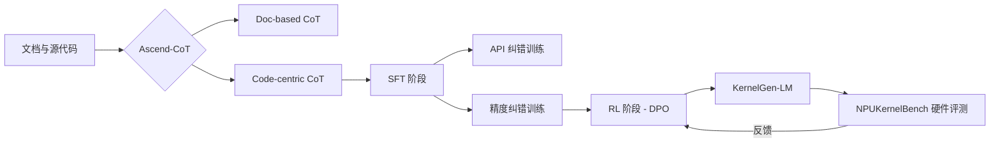

# AscendKernelGen

## 资料边界

- 用途：记录 AscendKernelGen 的数据构建、模型训练、评估基准和 NPU kernel generation 系统设计。
- 来源：论文、开源数据集/模型/benchmark 链接和本地索引。
- 相关索引：[Kernel Agents Paper Index](0.%20Awesome%20Papers%20on%20LLM&Agent%20for%20kernel.md)。

这篇论文提出了 **AscendKernelGen**，这是一个针对 NPU（特别是华为昇腾 Ascend 平台）内核自动生成的全栈研究框架。由于 NPU 编程涉及复杂的硬件约束、异步流水线和显式内存管理，通用大模型（如 Qwen3、Llama3）在这些任务上的表现接近 0。

该研究的核心在于将内核编程视为一个**系统性的推理过程**，而不仅仅是代码补全。

### 1. 核心贡献与系统设计
论文通过三个阶段解决了 NPU 内核生成的难题：
*   **数据构建**：构建了 **Ascend-CoT** 数据集。不同于简单的代码堆砌，它包含大量的思维链（Chain-of-Thought），解释了分块（Tiling）、同步和 API 选型背后的逻辑。
*   **模型训练 (KernelGen-LM)**：采用了两阶段训练：
    1.  **SFT（监督微调）**：引入错误衍生监督（Error-Derived Supervision），专门学习如何修正编译和精度错误。
    2.  **RL（强化学习）**：利用 **DPO** 算法，根据真实的硬件执行反馈（执行成功 vs 失败）来优化模型。
*   **评估基准 (NPUKernelBench)**：设计了一个分层的评测集，涵盖从简单算子（Level 1）到复杂算子（Level 3，如 Gemm/TopK）的 158 个任务，支持静态和动态形状的自动化评测。

### 2. 实验结果
*   **编译成功率 (CR)**：在复杂算子上，Pass@10 从 **0% 提升至 95.5%**。
*   **功能正确性 (ER)**：性能大幅超越通用模型，Pass@1 达到 **33.46%**（平均值），且在部分算子上实现了 **1.86x 的性能加速**（相比专家代码）。

---

### 3. 资源汇总

该项目已开源，提供了从模型到数据的全套资源：

| 资源类别 | 资源名称 | 说明 |
| :--- | :--- | :--- |
| **数据集** | [Ascend-CoT](https://huggingface.co/datasets/AscendKernelGen/Ascend-CoT) | 包含文档 CoT、代码中心 CoT 及通用推理数据，共约 8.4 万条原始样本。 |
| **模型** | [KernelGen-LM](https://huggingface.co/models?search=AscendKernelGen) | 基于 Qwen3-32B 微调的领域增强模型，专门用于 AscendC 内核生成。 |
| **评测基准** | [NPUKernelBench](https://github.com/AscendKernelGen/NPUKernelBench) | 包含 158 个内核任务，支持编译、精度和性能的自动化硬件闭环评估。 |
| **代码框架** | [AscendKernelGen](https://github.com/AscendKernelGen/AscendKernelGen) | 集成了数据构建、训练流水线和评估流程的完整框架。 |

---

### 4. 关键技术总结 (Mermaid)

> Experimental results demonstrate that our approach significantly bridges the gap between general LLMs and hardware-specific coding. Specifically, the compilation success rate on complex Level-2 kernels improves from 0% to 95.5% (Pass@10), while functional correctness achieves 64.3%. [Main Results](https://alphaxiv.org/abs/2601.07160v2?page=1)
