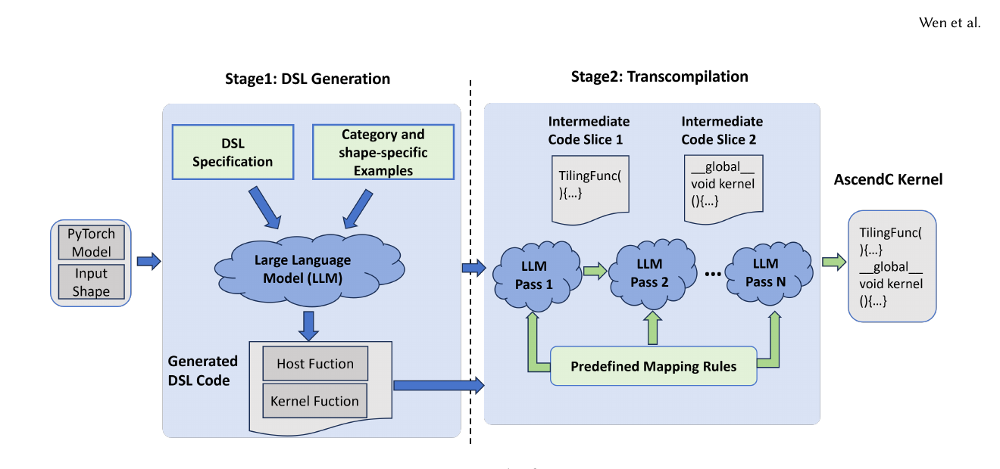
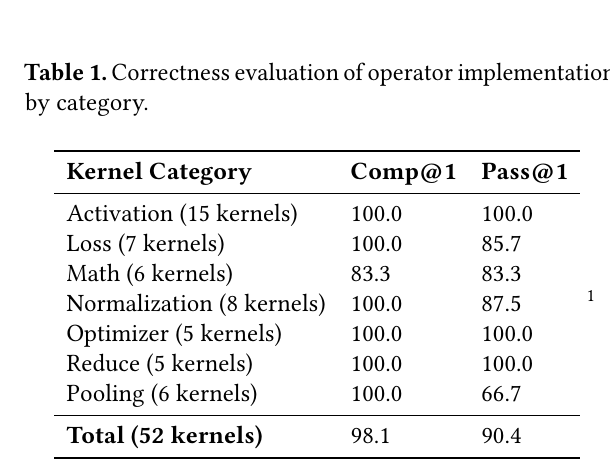

# AscendCraft: Automatic Ascend NPU Kernel Generation via DSL-Guided Transcompilation

> [!info] 文档关系
> - 文档类型：Paper
> - 领域入口：[README](../README.md)
> - 上位汇总：[Paper index](../evidence/paper-index.md)
> - 证据资产：`../assets/papers/ascend-craft/`
> - 相关文档：[AscendKernelGen](ascend-kernel-gen.md)，[Kernel generation survey](towards-automated-kernel-generation.md)，[Figure inventory](../evidence/figure-inventory.md)

## 修订信息

- 当前文档版本：`1.0.1`
- 当前修订 ID：`rev-ascend-craft-affiliation-backfill-20260730`
- 当前修订时间：`2026-07-30T23:30:00+08:00`
- 替代版本：`pre-affiliation-metadata` / `1.0.0`

| 修订 ID | 文档版本 | 时间 | 修订者 | 类型 | 替代修订 | 变更摘要 | 原因 | 影响位置 | 依据 | 对结论影响 |
|---|---|---|---|---|---|---|---|---|---|---|
| `rev-ascend-craft-affiliation-backfill-20260730` | `1.0.1` | `2026-07-30T23:30:00+08:00` | `/root` | `metadata-update` | `pre-affiliation-metadata` / `1.0.0` | 补充作者—机构元数据与角色证据边界 | 统一回填 affiliation 交付字段 | `作者与机构` | 论文 PDF 标题页、机构编号与角色脚注 | none：不改变方法、实验与归因结论 |

## 0. 资料与配图索引

- 论文：arXiv:2601.22760v1，2026-01-30；Nanjing University 与 Huawei；[官方摘要与 PDF](https://arxiv.org/abs/2601.22760)。当前为 arXiv preprint，未确认正式 venue。
- 代码：论文没有给出可审计的公开实现或 checkpoint；因此 multi-pass prompts、mapping rules 与编译修复逻辑只能按论文描述分析。
- OpenReview：截至 2026-07-11 未发现公开评审、decision 或 rebuttal。
- 图表：Figure 3（框架）与 Table 1（正确性）；完整记录见 [figure inventory](../evidence/figure-inventory.md)。

## 0.1 符号表

| 符号 | 含义 | 作用域 | 单位/取值 | 来源 | 易混点 |
|---|---|---|---|---|---|
| $Comp@1$ | 首个生成候选可编译的任务比例 | 52 kernels | % | Table 1 | 不是 functional correctness |
| $Pass@1$ | 首个候选通过参考输出验证的任务比例 | 52 kernels | % | Table 1 | 论文表述基于 compiled/generated task 口径，复现需核对脚本 |
| $Fast_\alpha@1$ | 正确 kernel 性能达到 PyTorch eager 的至少 $\alpha$ 倍的比例 | correct kernels | % | Table 2 | $\alpha=1$ 表示不慢于 eager，不是平均 speedup |
| $T_b$ | PyTorch eager latency | one workload | time | Sec. 5 | 不等于专家 AscendC baseline |
| $T_g$ | generated AscendC latency | one workload | time | Sec. 5 | 需相同 shape/环境 |

## 0.2 术语

| 术语 | 本文含义 | 不等于 | 证据 |
|---|---|---|---|
| DSL | 人工设计的 host function + kernel function 轻量中间表示 | 不是训练得到的语言，也不是通用 compiler IR | Sec. 3 |
| category/shape-specific examples | 给 DSL 生成阶段的专家 few-shot 示例 | 不是 benchmark-independent learned policy | Sec. 4.1 |
| transcompilation | LLM 按规则将 DSL 逐 pass 降为 AscendC | 不是确定性 compiler lowering | Sec. 4.2 |
| refinement pass | 可选对齐/padding 修正 | 不能等同于完整 autotuning | Sec. 4.2 |

## 1. 问题到方案

### 作者与机构

- 第一作者（首位列名）：Zhongzhen Wen → State Key Laboratory for Novel Software Technology, Nanjing University。
- 共同第一作者（仅含论文明确标注者）：论文未显式标注。
- 通讯作者/通讯联系人（仅含论文明确标注者）：论文未显式标注。
- 其他作者涉及的机构（去重列举，不作逐作者映射）：State Key Laboratory for Novel Software Technology, Nanjing University；Software Engineering Application Technology Laboratory, Huawei。
- 对应依据：论文 PDF 标题页、作者机构编号与角色脚注（核验日期：2026-07-30）。

直接生成 AscendC 同时要求模型处理算法、host tiling、分层存储、队列同步、对齐和冗长 API；公开语料稀缺使这些约束难以内化。AscendCraft 把一次高熵生成改成两层：先生成更短、结构化且保留 Ascend 执行语义的 DSL，再用明确映射规则做四个 LLM lowering pass。其核心假设是“约束生成空间”比“仅扩大模型或训练语料”更适合专有 NPU 编程。

## 2. 方法

### 2.1 DSL 边界

DSL 保留 host 端 core partition/tiling 和 kernel 端 `CopyIn -> Compute -> CopyOut`；隐藏 buffer 初始化、AscendC API 冗余与部分 alignment 参数。它仍显式表达 GM/L1/UB/L0 层级、Scalar/Vector/Cube 执行单元、queue/data dependency，因此不是把硬件细节全部抽象掉，而是选择“LLM 必须决定的性能语义”。

### 2.2 两阶段与四个 pass

1. 从 PyTorch model + input shape、DSL spec 以及 category/shape examples 生成 host/kernel DSL。
2. Pass 1 生成 host tiling 与 launch；Pass 2 初始化 kernel state/queues/buffers；Pass 3 映射 compute/data movement；Pass 4 可选修正 alignment 与 padding。
3. 每个 pass 读取前一段生成结果、相关 AscendC API、few-shot 示例和预定义映射规则。论文描述可使用编译反馈修正，但没有公开代码让人核对 retry budget、错误分类或停止条件。

这个流程更接近“LLM 作为非确定 lowering engine”，不是传统 compiler：同一 DSL 仍可能产生不同 AscendC，语义保持依赖 prompt 和示例。

## 3. 实验设置与主结果

- benchmark：MultiKernelBench 中 7 类共 52 个 kernel；MatMul 与 Convolution 未纳入该表，论文脚注明它们仍在开发。
- 环境：Ascend 910B2、CANN 8.1、PyTorch 2.6、Ubuntu 22.04；官方 driver/firmware 与 CANN 匹配（Sec. 5.1）。
- baseline：correctness 与参考实现比较；性能相对 PyTorch eager，而不是手写 AscendC 或理论峰值。

Table 1 报告总 $Comp@1=98.1\%$、$Pass@1=90.4\%$。Pooling 的 $Pass@1=66.7\%$ 最低，Math 的 $Comp@1/Pass@1=83.3\%$。Table 2 报告 $Fast_{0.2}@1=82.7\%$、$Fast_{0.8}@1=57.7\%$、$Fast_{1.0}@1=46.2\%$；最后一个数字只表示 46.2% 达到或超过 eager，不代表平均 1.462x。

论文另在 mHC 架构上展示两个新 kernel 个案，初始生成相对 eager 约 3--6x，专家优化后最高 15.9x。这里同时改变了 workload、generated implementation 和人工优化，属于案例证据，不能用于证明 52-task 总体泛化或纯自动系统的平均收益。

## 4. 技术主张证据矩阵与收益归因

| 技术点 | 声称效果 | 对照 | 证据强度 | 判断 |
|---|---|---|---|---|
| DSL 抽象 | 降低直接 AscendC 生成难度 | 论文引用 direct-generation 13% correctness；未给同模型 matched ablation | 混杂 | 总体有效，但无法独立归因 |
| category/shape examples | 提供 tiling/dataflow 先验 | 无 remove-example ablation | 无直接证据 | 未验证必要性 |
| multi-pass lowering | 每步受约束、提高稳健性 | 无 one-shot lowering 对照 | 机制 + 总体结果 | 部分支持 |
| mapping rules/API context | 降低 hallucinated API | 无去除实验 | 间接 | 合理但未隔离 |
| refinement pass | 修复 alignment/padding | 无 pass-level failure reduction | 无直接证据 | 未验证 |
| DSL + lowering 全系统 | 52-task 高 correctness | Table 1/2 | 直接系统结果 | 在该 benchmark/硬件上支持 |

论文没有给出完整组件消融，因此收益只能归到“DSL、示例、mapping、multi-pass 的组合”，不能断言某一项贡献了多少百分点。与 AscendKernelGen 相比，这篇工作避免训练成本，却把领域知识成本转移到 DSL/spec/prompt 工程；两者的 baseline 与 benchmark 也不同，数字不可横比。

## 5. Related Work

| 路线 | 方法 | 优点 | 局限 | 本文差异 |
|---|---|---|---|---|
| Triton/TileLang | 人工/编译器 DSL | lowering 可确定、生态成熟 | Ascend 目标与语义不同 | DSL 专为 LLM 和 Ascend 设计 |
| direct LLM generation | prompt -> AscendC | 少中间层 | 专有 API 幻觉、约束过多 | 用两阶段约束搜索空间 |
| AscendKernelGen | 数据 + SFT + DPO | 模型内化领域知识 | 训练和数据成本高 | 本文依赖 few-shot 与规则，不训练专用模型 |

## 6. OpenReview 与代码核验

未发现公开 OpenReview 页面，也未找到论文声明的公共仓库。因此无法核验 prompt 原文、四 pass 是否固定、compiler feedback 是否启用、温度/采样数、失败重试、52 个任务清单与计时脚本。正式结论只使用 PDF 的 Figure/Table/Section，不把旧 AlphaXiv 转述或二手摘要作为证据。

## 7. Infra 分析

### 7.1 执行与数据类型

生成侧是多次 LLM inference，成本近似

$$
C_{\mathrm{LLM}}=C_{\mathrm{DSL}}+\sum_{p=1}^{P}(C_{\mathrm{prompt},p}+C_{\mathrm{decode},p})+R\,C_{\mathrm{retry}},
$$

其中 $P=4$，$R$ 为编译失败后的 retry 次数；论文未报告 token 数、模型、dtype 或 latency，因此不能估算总 GPU/NPU 成本。执行侧 AscendC kernel 依赖 GM <-> on-chip buffer 搬运、queue synchronization、Vector/Cube 指令与 host tiling。有效带宽仍需 $BW_{eff}=BytesMoved/t$，但论文只给端到端 kernel 相对 latency，没有 bytes 或 counters。

### 7.2 CPU/NPU 异构路径

| 阶段 | CPU/LLM host | Ascend NPU | 同步点 | 证据边界 |
|---|---|---|---|---|
| DSL/lowering | prompt 构造、LLM API、代码拼接 | 无 | pass dependency | 论文机制图 |
| compile | CANN compiler、错误解析 | 无/工具链 | compiler result | retry 实现未公开 |
| launch | tiling、shape、runtime launch | AI Core kernel | host-device metadata | Sec. 2/4 |
| kernel | 调度与 reference | CopyIn/Compute/CopyOut | queues/events | 具体 counters 未报告 |

## 8. 局限与待验证清单

- 需要 matched ablation：direct AscendC、DSL one-shot、multi-pass、去 mapping rules、去 examples。
- benchmark 排除 MatMul/Conv，52-task 覆盖不足以代表生产算子；mHC 只有两个案例。
- 性能基线是 eager，不是专家 AscendC、vendor library 或 roofline，46.2% 不能说明接近硬件上限。
- 未报告模型版本、prompt、temperature、重试数、成功选择策略、计时方差与编译缓存。
- DSL 的人工维护成本、跨 CANN 版本稳定性和新 API migration 尚未量化。

## 9. 对 kernel agent 的启发

AscendCraft 的可迁移价值在“把动作空间显式分层”：agent 先决定算法/tiling，再逐步实例化 host、buffer 和 compute。后续系统应把 DSL 做成可静态验证 IR，把 LLM 只用于高层选择，并用 compiler/profiler 为每个 pass 提供局部 credit；这样才能把 prompt workflow 升级为可审计的 agentic compiler loop。
