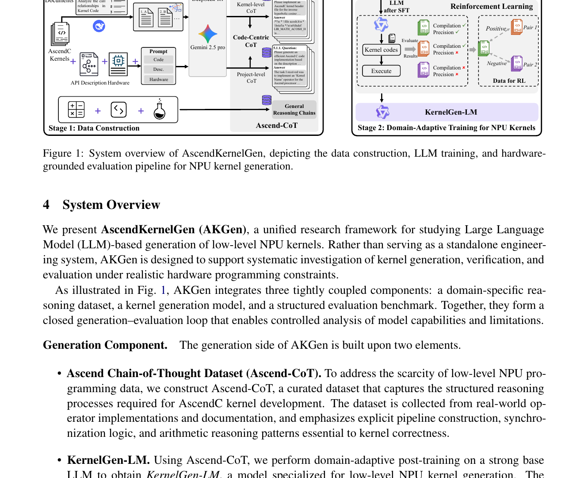
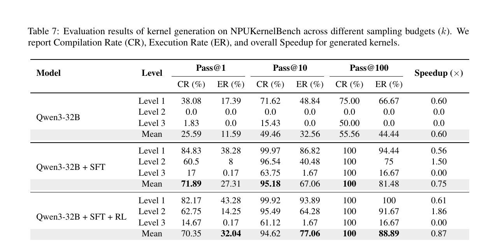

---
tags:
  - paper
  - collection/kernel-agents
  - domain/agentic-workflows
  - status/deep-review
  - topic/kernel-generation
  - method/execution-feedback
document_type: paper
domain: kernel_agents
collection: Kernel Agents
review_status: deep-review
canonical: true
---

# AscendKernelGen: A Systematic Study of LLM-Based Kernel Generation for Neural Processing Units

> [!info] 文档关系
> - 文档类型：Paper
> - 领域入口：[README](../README.md)
> - 上位汇总：[Paper index](../evidence/paper-index.md)
> - 证据资产：`../assets/papers/ascend-kernel-gen/`
> - 相关文档：[AscendCraft](ascend-craft.md)，[Kernel generation survey](towards-automated-kernel-generation.md)，[Figure inventory](../evidence/figure-inventory.md)

## 修订信息

- 当前文档版本：`1.0.2`
- 当前修订 ID：`rev-ascend-kernel-gen-obsidian-properties-20260731`
- 当前修订时间：`2026-07-31T10:00:00+08:00`
- 替代版本：`rev-ascend-kernel-gen-affiliation-backfill-20260730` / `1.0.1`

| 修订 ID | 文档版本 | 时间 | 修订者 | 类型 | 替代修订 | 变更摘要 | 原因 | 影响位置 | 依据 | 对结论影响 |
|---|---|---|---|---|---|---|---|---|---|---|
| `rev-ascend-kernel-gen-affiliation-backfill-20260730` | `1.0.1` | `2026-07-30T23:30:00+08:00` | `/root` | `metadata-update` | `pre-affiliation-metadata` / `1.0.0` | 补充作者—机构元数据与角色证据边界 | 统一回填 affiliation 交付字段 | `作者与机构` | 论文 PDF 标题页、机构编号与角色脚注 | none：不改变方法、实验与归因结论 |
| `rev-ascend-kernel-gen-obsidian-properties-20260731` | `1.0.2` | `2026-07-31T10:00:00+08:00` | `/root` | `metadata-update` | `rev-ascend-kernel-gen-affiliation-backfill-20260730` / `1.0.1` | 增加 Obsidian YAML Properties 与层级标签 | 全量 canonical Paper 标签补齐 | 文件头 YAML frontmatter | 已验证的 ICML 2026 标签 schema；仓库覆盖矩阵 | none：不改变论文分析与证据结论 |

## 0. 资料与配图索引

- 论文：arXiv:2601.07160v2，2026-04-17；Pengcheng Laboratory、Huawei 等；[官方摘要与 PDF](https://arxiv.org/abs/2601.07160)。当前是 arXiv preprint，未在论文或公开检索中确认正式 venue。
- 代码与数据：论文指向 Ascend-CoT、KernelGen-LM、AscendKernelGen 与 NPUKernelBench；截至 2026-07-11，旧索引中的两个 GitHub URL 返回 404，Hugging Face 资源状态未形成可审计快照，因此均标为“论文声称公开、当前未验证”。
- OpenReview：未发现公开 forum、review、decision 或 rebuttal；本节不把“未发现”解释为未投稿。
- 核心图表：Figure 1（系统闭环）与 Table 7（主结果）；页码、bbox 与逐图 QA 见 [figure inventory](../evidence/figure-inventory.md)。

## 0.1 符号表

| 符号 | 含义 | 作用域 | 单位/取值 | 来源 | 易混点 |
|---|---|---|---|---|---|
| $k$ | 每个任务采样的候选数 | evaluation | 1/10/100 | Sec. 8.2, Table 7 | 不是 kernel top-k 算子参数 |
| $CR@k$ | 至少一个候选可编译的任务比例 | task set | % | Sec. 8.2 | 编译不代表数值正确 |
| $ER@k$ | 至少一个候选编译、执行并通过精度验证的任务比例 | task set | % | Sec. 8.2 | 论文简称 Execution Rate，实质包含正确性门槛 |
| $S$ | 相对专家实现的运行时加速 | correct kernels | $\times$ | Table 7 | 不应和 PyTorch eager 基线混用 |
| $w_l$ | Level $l$ 的正确性评分权重 | benchmark | 0.2/0.3/0.5 | Sec. 7.4.3 | 只用于综合评分，不是训练 loss |

## 0.2 术语与数据构造

| 术语 | 本文含义 | 不等于/易混项 | 证据 |
|---|---|---|---|
| Ascend-CoT | 文档 CoT、单文件/项目级 kernel CoT、通用推理链组成的 83,916 条原始语料 | 不是全部经真实 NPU 执行验证的 83,916 个 kernel | Sec. 5 |
| error-derived supervision | 将编译/API 错误与数值错误转成诊断、修复监督 | 不是在线 RL rollout | Sec. 6.1, Fig. 2 |
| RL | 用编译与精度结果形成偏好对，再做 DPO | 不是 policy-gradient RL，也未证明直接优化 latency | Sec. 6.2 |
| Level 1/2/3 | 线性数据流、结构化局部复用、全局依赖/复杂控制流 | 不是通用难度标准 | Sec. 7.2, Table 2 |

## 1. 问题到方案

### 作者与机构

- 第一作者（首位列名）：Xinzi Cao → Pengcheng Laboratory；Sun Yat-sen University。
- 共同第一作者（仅含论文明确标注者）：
  - Jianyang Zhai → Pengcheng Laboratory；Sun Yat-sen University
  - Pengfei Li → Huawei
  - Zhiheng Hu → Huawei
- 通讯作者/通讯联系人（仅含论文明确标注者）：
  - Weicheng Xue → Pengcheng Laboratory
  - Bin Zhou → Pengcheng Laboratory
  - Yonghong Tian → Pengcheng Laboratory；Peking University
- 其他作者涉及的机构（去重列举，不作逐作者映射）：Pengcheng Laboratory；Huawei；Sun Yat-sen University；Peking University。
- 对应依据：论文 PDF 标题页、作者机构编号与角色脚注（核验日期：2026-07-30）。

通用代码模型缺少 AscendC API、host/device 协同、tiling、片上存储和异步流水线知识，复杂任务在零样本设置下接近零执行成功率（Table 1）。论文把问题拆成三个闭环：用 Ascend-CoT 注入领域推理，用 SFT + error-derived supervision 建立可编译基线，再用执行结果构造 DPO 偏好；NPUKernelBench 负责把自由文本生成落到编译、精度和性能三重验证。

这个设计的重要边界是：框架研究的是“生成模型 + evaluation harness”，并不是一个能自主搜索 profiler trace 的完整 kernel agent。DPO 使用执行正确性偏好，但论文没有把性能计数器、roofline 或持续 latency 搜索纳入 RL 环。

## 2. 方法

### 2.1 数据构造

- 文档数据来自官方 AscendC 编程、API 与最佳实践材料，经章节对齐和转述构成显式 API/约束推理。
- code-centric CoT 同时覆盖单文件 kernel 与项目级 host-kernel pair；后者固定 shape/tiling 情景以减少工业工程中的条件分支混杂。
- DeepSeek-R1 负责文档和单文件推理，Gemini 2.5 Pro 负责多文件项目推理，DeepSeek-Reasoner 参与 flywheel 修订（Sec. 8.1）。这些 teacher 选择与数据质量绑定，论文未给出 teacher 替换消融。
- 原始语料 83,916 条，99.1% 输入短于约 11.1k token，最大约 111k（Sec. 5）。这是长度分布，不是最终 SFT token 数或训练预算。

### 2.2 两阶段训练

第一阶段以 Qwen3 系列做 full fine-tuning 或 LoRA。编译失败样本被重构为 API 诊断与修复对，编译通过但精度失败的样本被重构为数值诊断与 corrected kernel。第二阶段从硬件 verifier 形成“编译且精度通过”相对失败候选的偏好对，用 DPO 更新模型：

$$
\mathcal L_{\mathrm{DPO}}=-\mathbb E_{(x,y^+,y^-)}\log\sigma\left(\beta\left[\log\frac{\pi_\theta(y^+|x)}{\pi_{\mathrm{ref}}(y^+|x)}-\log\frac{\pi_\theta(y^-|x)}{\pi_{\mathrm{ref}}(y^-|x)}\right]\right).
$$

论文并未证明偏好对中的全部差异只来自某个 kernel 机制；它证明的是执行反馈能改善总体生成分布。

### 2.3 Benchmark 与验证合同

NPUKernelBench 包含 158 个任务、16 类算子，区分 static-shape 的编译期专化与 dynamic-shape 的 host tiling/shape inference。生成结果必须进入：代码结构校验 -> Ascend 编译 -> 参考实现数值比较 -> 正确结果计时。故主结果必须同时报告 $CR@k$ 和 $ER@k$，不能把高编译率称为正确率。

## 3. 实验设置与主结果

模型包含 Qwen3 1.7B--32B 与 Qwen3-Coder-30B-A3B；主线是 Qwen3-32B。论文报告 full fine-tuning/LoRA 与 DPO，但没有披露足以独立复算总训练 FLOPs、完整 wall-clock、节点拓扑或功耗的配置。评测在真实 Ascend NPU 上运行，具体生产负载与并发 serving 情景未覆盖。

- Base Qwen3-32B 的 Level-2 $CR@10/ER@10$ 均为 0；SFT+RL 为 95.49%/64.28%。摘要中的 95.5% 与 64.3% 来自这一行。
- 全任务 mean $ER@1$ 从 11.59%（base）到 27.31%（SFT），再到 32.04%（SFT+RL）。SFT 的绝对增益是 +15.72 pp，RL 在 SFT 上再加 +4.73 pp。
- Level-2 speedup 从无有效结果到 SFT 1.50x、SFT+RL 1.86x；但 Level-1 仍只有 0.61x，Level-3 speedup 为 0。不能把 1.86x 外推为全 benchmark 平均加速。
- 即使 $k=100$，SFT+RL 的 Level-3 $ER@100$ 仅 16.67%，说明复杂控制流仍是主要缺口。

## 4. 技术主张证据矩阵与收益归因

| 技术点 | 声称效果 | 受控证据 | 强度 | 判断 |
|---|---|---|---|---|
| 领域 SFT | 建立 AscendC 语法、API 与结构能力 | Table 7，base -> SFT | 直接阶段对照，但训练数据/预算一并改变 | 支持总体收益，不能细分到单一数据源 |
| error-derived supervision | 减少 API/数值失败 | Fig. 2 给机制；没有独立 remove-only 主表 | 间接 | 合理但未隔离 |
| DPO execution feedback | 提高首次执行正确率 | Table 7，SFT -> SFT+RL；Table 9 策略消融 | 较强 | 支持 ER 改善，性能归因仍混杂 |
| kernel code data | 数据组成中最关键 | Fig. 6 去除 kernel code 降幅最大 | 直接 ablation | 在 Qwen3-8B 设置下支持 |
| 更大模型 | Level 1/2 更好 | Fig. 5 scale sweep | 趋势 | Level 3 未随规模稳定解决 |
| full tuning 优于 LoRA | 更强领域适配 | Table 8：mean ER 22.13% vs 13.55% | 直接 | 仅 Qwen3-8B 配置成立 |

SFT 对 mean $ER@1$ 的贡献明显大于后续 DPO；这是一种基于 Table 7 的桥接分解，不是方差归因。DPO 对 Level-2 $ER@10$ 的增益从 40.48% 到 64.28%（+23.80 pp）更突出，说明执行反馈对中等复杂度候选筛选有效；Level-3 几乎不变，表明奖励不能替代缺失的全局算法能力。

## 5. Related Work

| 路线 | 核心 | 优点 | 局限 | 与本文关系 |
|---|---|---|---|---|
| KernelBench/TritonBench | 执行式 GPU kernel benchmark | 可复核 correctness/latency | 主要是 CUDA/Triton | NPUKernelBench 扩到 Ascend host/device 约束 |
| 直接 LLM kernel generation | 从算子描述直接生成代码 | 流程短 | 专有 DSL 上语料不足 | 本文用领域数据和执行偏好补齐 |
| AscendCraft | DSL + 多 pass transcompilation | 无需领域模型训练 | 依赖专家 DSL/映射规则 | 互补：抽象约束 vs 模型后训练 |

## 6. OpenReview 交叉核验

截至 2026-07-11 未发现公开 OpenReview 页面，因此无法核对 reviewer、decision 或 rebuttal。需要保留的阅读风险是：teacher 数据许可与泄漏、benchmark 与训练 kernel 的重叠、性能测量重复次数/方差、以及公开资源当前不可访问；这些不是 reviewer 结论，而是论文复现缺口。

## 7. Infra 分析

### 7.1 计算、显存与数据类型

训练主干达到 32B 参数。仅参数存储的下界为 $P b_w/8$；32B 在 bf16 下约 64 GB，训练还需要 gradients、optimizer states 与 activations，因而必然是多卡/分片训练。论文没有报告训练 dtype、并行拓扑或有效带宽，不能给出利用率百分比。

NPU 执行路径至少包含 CPU host 生成 tiling/shape metadata、编译器构建 device binary、NPU Global Memory 与 on-chip buffer 的搬运和 Vector/Cube 计算。对一次 tile，最小数据移动近似为

$$
B_{\mathrm{tile}}=b_x|X|+b_y|Y|+b_o|O|,\quad BW_{\mathrm{eff}}=B_{\mathrm{tile}}/t.
$$

但论文没有逐 kernel bytes、时间分解或 Ascend 峰值配置，因此无法计算 utilization。1.86x 只能视为 end-kernel latency 比值，不能归因到 bandwidth、fusion 或 Cube 利用率。

### 7.2 异构与调度

| 阶段 | CPU | NPU | 数据移动/同步 | 风险 |
|---|---|---|---|---|
| generation | tokenizer、LLM serving host | 可能为训练/推理加速器 | prompts/code | 未披露 serving stack |
| compile | Ascend compiler、日志 | 无或工具链调用 | source/binary | rollout 编译延迟造成 straggler |
| evaluate | launch、shape/tiling、reference orchestration | generated kernel | host metadata、tensor H2D/D2H | 错误隔离与超时 |
| preference build | 聚合 CR/ER | 批量执行 | result telemetry | reward hacking、基准过拟合 |

## 8. 代码与 checkpoint 对照

论文声称公开 Ascend-CoT、KernelGen-LM、AscendKernelGen 和 NPUKernelBench，但截至核验日，旧 GitHub 链接不可访问，未能取得 commit、目录、checkpoint config 或许可证。因而本文不能确认代码是否实现 error correction、DPO pair construction、全部 158 个任务或论文精度阈值；所有实现级判断保持“未验证”。

## 9. 局限与待验证清单

- benchmark 训练数据重叠与 held-out operator family 未充分量化。
- Level-3 仍低，说明更大模型和正确性偏好没有解决全局依赖、动态控制流与 host/device 联合推理。
- 性能结果缺少方差、warm-up、重复次数、compiler flags 和硬件型号细节，不能做严谨 roofline 分析。
- 公开资源当前状态与论文“available”声明不一致，需要作者提供稳定 release/tag。
- 最小复现闭环应固定一个公开 checkpoint、数据 revision、CANN/driver/firmware、任务 hash、数值阈值与计时协议。

## 10. 对 kernel agent 的启发

最可迁移的设计不是“让模型写 AscendC”，而是把编译、精度、性能拆成有序 gates，并把错误日志转成可学习轨迹。下一步 agent 应把 profiler counters、shape family 泛化和失败恢复纳入状态，同时隔离 algorithm-quality reward 与 runtime reward，避免只优化可编译性。
