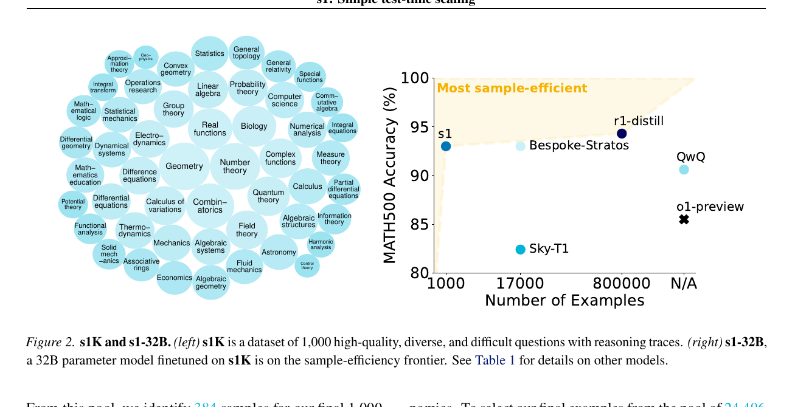
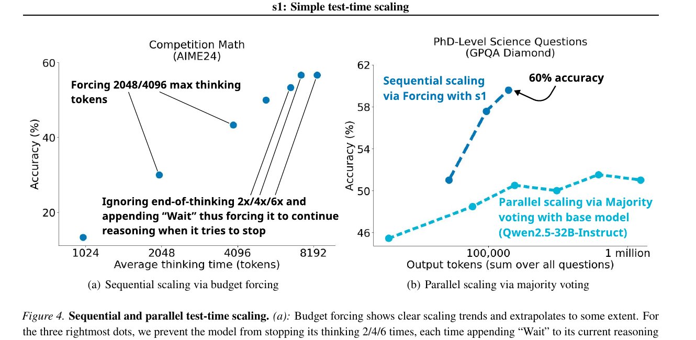

# s1: Simple test-time scaling

> [!info] 文档关系
> - 文档类型：Paper
> - 领域入口：[README](../README.md)
> - 上位汇总：[Paper index](../evidence/paper-index.md)
> - 证据资产：`../assets/papers/s1-test-time-scaling/`
> - 相关文档：[Kernel generation survey](towards-automated-kernel-generation.md)，[Figure inventory](../evidence/figure-inventory.md)

## 修订信息

- 当前文档版本：`1.0.1`
- 当前修订 ID：`rev-s1-test-time-scaling-affiliation-backfill-20260730`
- 当前修订时间：`2026-07-30T23:30:00+08:00`
- 替代版本：`pre-affiliation-metadata` / `1.0.0`

| 修订 ID | 文档版本 | 时间 | 修订者 | 类型 | 替代修订 | 变更摘要 | 原因 | 影响位置 | 依据 | 对结论影响 |
|---|---|---|---|---|---|---|---|---|---|---|
| `rev-s1-test-time-scaling-affiliation-backfill-20260730` | `1.0.1` | `2026-07-30T23:30:00+08:00` | `/root` | `metadata-update` | `pre-affiliation-metadata` / `1.0.0` | 补充作者—机构元数据与角色证据边界 | 统一回填 affiliation 交付字段 | `作者与机构` | 论文 PDF 标题页、机构编号与角色脚注 | none：不改变方法、实验与归因结论 |

## 0. 资料与配图索引

- 论文：arXiv:2501.19393v3，2025-03-01；Stanford/University of Washington/AI2；[官方摘要与 PDF](https://arxiv.org/abs/2501.19393)。论文以 ICML 样式排版，但本文未从公开 venue 页面确认正式录用状态，故不把模板等同于 venue。
- 官方代码：[simplescaling/s1](https://github.com/simplescaling/s1/tree/77272c6e925d610257a50b520bad15330b513389)，核验 commit `77272c6e925d610257a50b520bad15330b513389`（2026-07-11）。
- OpenReview：未发现可确认对应版本的公开 forum/reviews/decision。
- 领域定位：这是 test-time reasoning budget 论文，不是 kernel generation 论文。收录原因仅是其预算控制思想可迁移到 kernel agent 的 generate/compile/profile/refine 回合分配。
- 图表：Figure 2 与 Figure 4，见 [figure inventory](../evidence/figure-inventory.md)。

## 0.1 符号表

| 符号 | 含义 | 作用域 | 单位 | 来源 | 易混点 |
|---|---|---|---|---|---|
| $a$ | 一次运行实际使用的 thinking tokens | sample/budget | token | Eq. 1 | 不是总输出 token |
| $a_{min},a_{max}$ | 预设最小/最大 reasoning budget | method | token | Eq. 1 | 最小预算靠 suppress delimiter 实现 |
| $\mathcal A$ | 被评估的一组 budget | benchmark | set | Sec. 3.2 | 不是答案集合 |
| $f(a)$ | 在 budget $a$ 下的 accuracy | benchmark | % | Eq. 2--3 | 非必然单调 |
| Control | 实际 budget 落在区间内的比例 | method | % | Eq. 1 | 不等于 accuracy |
| Scaling | 不同 budget 点间的平均性能斜率 | benchmark | accuracy/token | Eq. 2 | 依赖预算点选择 |

## 0.2 术语

| 术语 | 本文含义 | 不等于 | 证据 |
|---|---|---|---|
| s1K | 1,000 个高质量、多样、困难问题及推理轨迹 | 不是全部正确：论文 grader 判 53.6% 正确 | Sec. 2 |
| budget forcing | 在 decoding 时强制终止或抑制 end-of-thinking，并追加 `Wait` | 不是重新训练、搜索树或 verifier | Sec. 3.1 |
| sequential scaling | 后续计算依赖前面 reasoning state | 并行采样/majority vote | Sec. 3.1 |
| s1-32B | Qwen2.5-32B-Instruct 在 s1K 上 SFT 的模型 | 不是 kernel-specialized model | Sec. 4.1 |

## 1. 问题到方案

### 作者与机构

- 第一作者（首位列名）：Niklas Muennighoff → Stanford University；Allen Institute for AI；Contextual AI。
- 共同第一作者（仅含论文明确标注者）：
  - Zitong Yang → Stanford University
  - Weijia Shi → University of Washington；Allen Institute for AI
  - Xiang Lisa Li → Stanford University
- 通讯作者/通讯联系人（仅含论文明确标注者）：论文未显式标注。
- 其他作者涉及的机构（去重列举，不作逐作者映射）：Stanford University；University of Washington；Allen Institute for AI；Contextual AI。
- 对应依据：论文 PDF 标题页、作者机构编号与角色脚注（核验日期：2026-07-30）。

论文追问：能否不用大规模 RL，仅靠少量精炼轨迹和一个 decoding intervention 得到可控 test-time scaling。方案先按 difficulty、diversity、quality 从 59K pool 选出 s1K，再对 Qwen2.5-32B-Instruct 做 SFT；推理时达到最大 budget 就插入 end-of-thinking，低于最小 budget 而模型想结束时就抑制 delimiter 并追加 `Wait`。

## 2. 数据与训练

- s1K 覆盖 50 个 domain。难度筛选使用 Qwen2.5-7B/32B 的解题表现和 reasoning length；多样性按 MSC 类别均匀采样；quality 由来源与 grader 过滤。
- 部分轨迹由 Gemini Flash Thinking 蒸馏。teacher、grader 与最终学生存在模型依赖，论文用 ablation 说明三种筛选标准组合优于单项，但没有排除 benchmark contamination。
- SFT 使用 16 张 H100、26 分钟；论文据此估算约 7 H100 GPU-hours。作为对照，59K 全量实验约 394 H100 GPU-hours（Sec. 5.1）。这些是训练 compute，不含数据生成、筛选、评估和 serving。

## 3. Budget forcing 机制与公式

最大 budget 是硬停止：生成到阈值后补 end-of-thinking delimiter 和可选 `Final Answer:`。最小 budget 是软延长：模型想结束时屏蔽 delimiter 并追加 `Wait`，保留已有 KV state 继续 decode。其目标不是保证更长一定更正确，而是建立可控 budget 曲线：

$$
\mathrm{Control}=\frac{1}{|\mathcal A|}\sum_{a\in\mathcal A}\mathbf 1(a_{min}\le a\le a_{max}),
$$

$$
\mathrm{Scaling}=\frac{1}{\binom{|\mathcal A|}{2}}\sum_{a,b\in\mathcal A,b>a}\frac{f(b)-f(a)}{b-a},\qquad
\mathrm{Performance}=\max_{a\in\mathcal A}f(a).
$$

因为 $f$ 可能非单调，Scaling 是选定 budget 网格上的经验斜率，不是普适 scaling law。

## 4. 主结果

- Table 1：s1-32B（1K examples + BF）在 AIME24/MATH500/GPQA Diamond 为 56.7/93.0/59.6；无 BF 的 s1 为 50.0/92.6/56.6。AIME24 绝对 +6.7 pp，样本只有 30 题，方差需要谨慎。
- Figure 4：AIME24 的 budget forcing 随 thinking tokens 增长总体上升；GPQA 上 sequential forcing 到约 60%，并行 majority vote 曲线约 45--52%。两曲线使用不同模型与总 token 口径，只能说明该设置下的趋势，不能证明 sequential scaling 普遍优于 parallel sampling。
- Table 4：2x `Wait` 在 AIME24 为 53.3，相比 no extrapolation 50.0；MATH500 保持 93.0，GPQA 59.6。字符串选择本身是一个 prompt-level hyperparameter。
- rejection sampling 按输出长度筛选出现 inverse scaling，证明“更长”不是充分条件；budget forcing 的收益依赖保留原轨迹并触发自我修正，而不是长度本身。

## 5. 技术主张证据矩阵与收益归因

| 技术点 | 受控证据 | 强度 | 结论 |
|---|---|---|---|
| 1K 精选数据足够激活 reasoning | 1K 与 59K、筛选标准 ablation | 中等 | 支持样本效率，但 teacher/compute 不完全匹配 |
| budget forcing 可扩展 compute | Fig. 4、Table 3/4 | 直接经验 | 在 s1-32B 和三项 benchmark 上支持 |
| `Wait` 促成自我修正 | Fig. 3 个案、Table 4 string ablation | 个案 + 对照 | 部分支持，机制未普遍验证 |
| sequential 优于 parallel | Fig. 4(b) | 混杂 | 模型/采样/计量不同，不能作普遍结论 |
| 更长 reasoning 更好 | rejection sampling 反例 | 反证 | 不成立；需改变生成轨迹而非只筛长度 |

## 6. Related Work 与 OpenReview

相比 best-of-N/majority vote，budget forcing 复用单条生成状态，额外 compute 串行累积；相比 process reward/search，它没有 verifier 或分支；相比 RL reasoning models，它只做 SFT + decoding control。未发现公开 OpenReview 评审，因此无法交叉核验 reviewer concern。论文自身已暴露小 benchmark、recitation/API evaluation 问题和 scaling 饱和。

## 7. 代码与 infra 对照

官方仓库在核验 commit 下公开数据处理、SFT/评估与 budget forcing 示例。实现层边界是 tokenizer delimiter 与 vLLM/生成 API 行为：batch size、continued generation 与不同推理引擎会改变结果，论文 Appendix 也记录相关复现差异。

参数下界：32B bf16 weights 约 64 GB；KV cache 额外成本近似

$$
M_{KV}=2L n_{kv} d_h T b,
$$

budget forcing 将 $T$ 拉长，因此 memory 与单请求 latency 线性上升。KV 可复用避免重复 prefill，但串行 decode 无法像 parallel samples 那样充分批处理。训练使用 H100/PyTorch FSDP；论文没有报告 NVLink 利用率、dtype、峰值显存或 serving throughput，不能计算有效带宽。

## 8. 迁移到 kernel agent 的边界

可迁移的是“预算控制器”，不是语言任务本身。kernel agent 的状态可以是当前实现、编译/精度/profiler 反馈，动作是继续修复、重启候选或停止。合理目标应是

$$
\max_B\;\mathbb E[Q(k_B)]-\lambda C_{compile}(B)-\mu C_{run}(B),
$$

其中 $Q$ 同时包含 correctness gate 与性能。单纯追加“再想一次”没有论文证据能提高 kernel correctness；必须让新增回合接收真实 compiler/profiler observation，并设硬件时间、编译队列和沙箱预算。

## 9. 局限与待验证清单

- 三个 benchmark 规模有限，AIME24 对少数题变化敏感。
- teacher/grader 数据链、潜在污染与错误 reasoning trace 对泛化的影响未完全隔离。
- `Wait` 与 tokenizer/chat template 强绑定，跨模型迁移需要重测 delimiter 和 stopping behavior。
- 最大预算受 context window、KV memory 和尾延迟约束，性能会饱和或反转。
- 对 kernel agent 的最小实验应比较 fixed-turn、budget forcing、compiler-triggered continuation 与 best-of-N，并报告 correct@budget、best latency、编译次数和 wall-clock。
